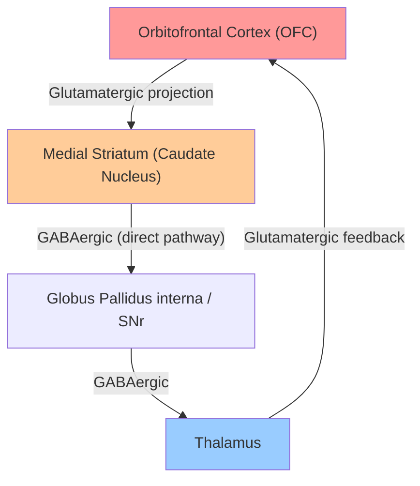
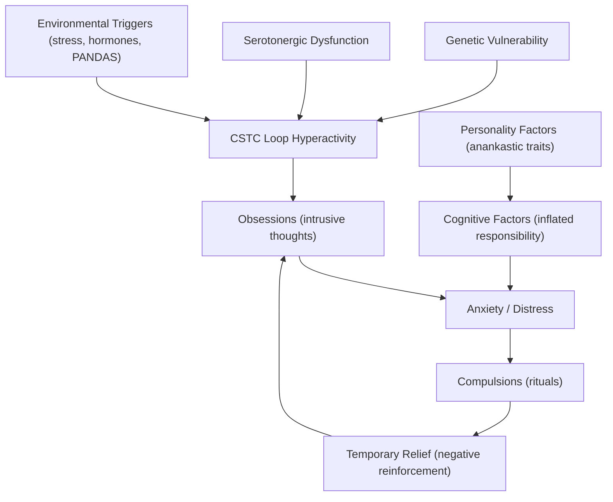

## 1. Definition

Obsessive-Compulsive Disorder (OCD) — let's break the name down:
- **"Obsessive"** → from Latin *obsidēre* = "to besiege" — the mind is besieged by intrusive, unwanted thoughts
- **"Compulsive"** → from Latin *compellere* = "to drive, to force" — the person feels driven to perform repetitive behaviours
- **"Disorder"** → this crosses the threshold from normal quirks into clinically significant distress or functional impairment

OCD is a chronic neuropsychiatric disorder characterised by the presence of **obsessions** (recurrent, intrusive, unwanted thoughts, images, or urges) and/or **compulsions** (repetitive, stereotyped behaviours or mental acts performed in response to obsessions or according to rigid rules), which are:

1. ***Recognised as arising from the patient's own mind*** (not inserted from outside — this distinguishes it from thought insertion in psychosis) [1][2]
2. ***Associated with a sense of compulsion*** — the patient cannot control them despite wanting to [1][2]
3. ***Associated with a sense of resistance*** — the patient tries to resist them (though this may diminish over time as the illness becomes chronic) [1][2]
4. ***Ego-dystonic*** — in conflict with the patient's own values, goals, and self-concept; recognised as senseless or excessive [1][2]

<Callout title="Key Defining Features — Mnemonic: 'CORE'">
**C** — Compulsion (sense of being driven, cannot control)
**O** — Own thoughts (recognised as originating from self)
**R** — Resistance (attempts to resist, though may wane)
**E** — Ego-dystonic (recognised as senseless, in conflict with self)
</Callout>

<Callout title="OCD vs OCPD — A Common Exam Trap" type="error">
Do NOT confuse OCD with Obsessive-Compulsive Personality Disorder (OCPD/Anankastic PD). In OCPD, the traits are **ego-syntonic** (the person sees their rigidity and perfectionism as reasonable and desirable). In OCD, the obsessions and compulsions are **ego-dystonic** (the person recognises them as irrational and distressing). Furthermore, OCPD does **not** have ritualistic compulsions in the way OCD does. Although OCPD is over-represented in OCD patients (~23–32%), people with OCPD are actually more likely to develop **depression** than OCD [3].
</Callout>

---

## 2. Epidemiology

| Parameter | Detail |
|---|---|
| ***Prevalence*** | ***~2% of the general population*** (12-month prevalence ~1.2%, lifetime prevalence ~2.3%) [1][4] |
| ***Mean age of onset*** | ***19.5 years, with 25% starting by age 14*** [1][4] |
| ***Sex ratio*** | ***Female : Male ≈ 1:1*** in adults (lecture slides state 1:1); senior notes cite some studies showing F > M ≈ 1.2–3.8:1 — the discrepancy reflects study methodology. However, ***males have earlier onset than females*** [4] |
| Childhood OCD | M > F; earlier onset in boys is a consistent finding |
| Course | Typically gradual onset; ***rarely remits spontaneously (~20% in 40 years) if untreated*** [3] |
| Prognosis | ~2/3 improve to some extent within 1 year of treatment; ~40% remission at 15 years [3] |

### Prognostic Factors [3]

| Better Prognosis | Worse Prognosis |
|---|---|
| Identifiable precipitating event | ***Childhood onset*** |
| Good premorbid adjustment | ***Personality disorder*** |
| Episodic symptoms | ***Tic-related OCD*** |
| | ***Male sex*** |
| | ***Overvalued ideas about obsessions*** (poor insight) |
| | ***Comorbid depression*** |

### Comorbidities [1][5]

This is extremely high-yield — OCD is almost never alone:

| Comorbidity | Prevalence |
|---|---|
| ***> 70% lifetime diagnosis of an anxiety disorder*** (panic disorder, social anxiety disorder, GAD, specific phobia) | ~76% |
| ***> 60% lifetime diagnosis of a mood disorder*** — ***MDD being the most common*** (~41%) | ~63% |
| OC personality disorder | 23–32% |
| ***Up to 30% lifetime tic disorder*** | Up to 30% |
| ***12% of persons with schizophrenia/schizoaffective disorder*** | 12% |
| Others | Bipolar disorder, eating disorders, substance use disorders |

<Callout title="Why the High Comorbidity with Depression?">
The chronic, distressing, ego-dystonic nature of obsessions leads to demoralisation, helplessness, and functional impairment → secondary depression is extremely common. Additionally, shared serotonergic dysfunction may predispose to both conditions. When both OCD and depression are present, the ICD-10 advises giving diagnostic precedence to whichever developed first [3].
</Callout>

---

## 3. Anatomy and Neurocircuitry

Understanding the neuroanatomy is essential because OCD, unlike many other psychiatric disorders, has a relatively well-defined circuit abnormality. This is one of the most testable aspects of OCD.

### 3.1 The Cortico-Striato-Thalamo-Cortical (CSTC) Loop

***The orbitofrontal cortico-striato-thalamo-cortical (CSTC) circuit dysfunction is widely cited as the major abnormality underpinning OCD*** [1][3].

**How does this loop normally work?**

The CSTC loops are parallel circuits that connect cortical areas → striatum (basal ganglia) → thalamus → back to the same cortical area. They exist for motor, cognitive, limbic and other functions. The **orbitofrontal CSTC loop** specifically handles:

- **Decision-making** about whether an action is "complete" or requires repetition
- **Habit learning vs. goal-directed behaviour** — the OFC mediates the balance between **compulsivity** (tendency toward habitual/routine behaviour) and **impulsivity** (tendency toward reward-driven/goal-directed behaviour) [3]
- **Error monitoring** — "Have I done this correctly? Is there danger?"

**What goes wrong in OCD?**

***OCD arises from a hyperactive orbitofrontal CSTC loop*** [3]:

1. The **OFC** fires excessively → generates a persistent feeling that "something is wrong" or "incomplete"
2. This hyperactivity propagates through the caudate → thalamus → back to the OFC
3. The result is a **self-reinforcing loop**: the brain keeps signalling danger/incompleteness, driving the person to check, wash, count, etc.
4. Performing the compulsion provides **temporary relief** (the loop briefly quiets), but this negatively reinforces the cycle

### 3.2 Key Brain Structures Implicated

| Structure | Imaging Finding | Functional Role in OCD |
|---|---|---|
| ***Orbitofrontal cortex (OFC)*** | ***↑ activity*** on functional imaging; ***↓ grey matter volume*** | Error detection, "something is wrong" signal |
| ***Caudate nucleus (striatum)*** | ***↑ activity***; ***↑ grey matter volume*** | Gating of habitual behaviours; normally filters out irrelevant thoughts |
| ***Anterior cingulate cortex (ACC)*** | ***↑ activity***; ***↓ grey matter volume in dorsomedial and anterior portions*** | Conflict monitoring; detects discrepancy between intended and actual state |
| ***Thalamus*** | ***↑ activity*** | Relay centre; when hyperactive, fails to filter out repetitive signals |

**Structural imaging summary**: ↑ grey matter volume in striatum, ↓ grey matter in OFC, dorsomedial and anterior cingulate cortex [3].

**Functional imaging summary**: ↑ activity in OFC, caudate, ACC, and thalamus — all key nodes of the CSTC loop [3].

### 3.3 Neurotransmitter Systems

#### Serotonin (5-HT)

***Studies implicate a role for abnormalities in 5-HT function*** [1][3]:
- ***Serotonergic agents (e.g., SSRIs) are effective in treating OCD*** — this was historically the strongest evidence for serotonin involvement
- OCD requires **higher doses** of SSRIs and **longer duration** to respond compared to depression (typically 8–12 weeks vs. 4–6 weeks) — this suggests the mechanism is different from simply correcting a serotonin deficit
- ***However, studies attempting to confirm 5-HT abnormalities in the brain have been inconsistent*** [3]
- ↓ cortical 5-HT1A binding has been described

#### Glutamate

- ***Glutamate transporter gene (SLC1A1)*** is the most consistently replicated genetic finding in OCD [3]
- The CSTC loop uses glutamate as its primary excitatory neurotransmitter
- Glutamate excess in the striatum could drive the hyperactive loop
- This has led to interest in glutamate-modulating agents (e.g., memantine, riluzole, N-acetylcysteine) as adjunctive treatments

#### Dopamine

- Tic-related OCD and OCD with poor insight may involve dopaminergic pathways
- This is why **antipsychotics** (dopamine blockers) are used as augmentation in treatment-resistant OCD

---

## 4. Aetiology

### 4.1 Biological Factors

#### 4.1.1 ***Genetics*** [1][3]

- ***Genes are thought to play a significant role, more so in paediatric-onset cases*** [3]
- **Family studies**: MZ > DZ concordance rate; first-degree relatives have **4× risk** [3]
- **Candidate genes** [3]:
  - ***Glutamate transporter (SLC1A1)*** — most consistently replicated
  - ***Serotonin transporter (5-HTTLPR)***
  - ***5-HT2A receptor gene***
  - ***BDNF gene*** (brain-derived neurotrophic factor) — not consistently replicated

#### 4.1.2 ***Neurobiological*** [1][3]

**OCD is associated with several brain disorders that give us clues about pathophysiology:**

| Condition | Relevance |
|---|---|
| ***Encephalitis lethargica*** | An atypical encephalitis of unknown origin (postulated to be post-influenza) that frequently presents with OC symptoms; demonstrates that basal ganglia pathology → OCD-like symptoms [3] |
| ***Tourette's syndrome*** | OC symptoms were once included in diagnostic criteria; up to 30% of OCD patients have tics; shared striatal pathology [3] |
| ***PANDAS*** | ***Paediatric Autoimmune Neuropsychiatric Disorder Associated with Streptococcal infection*** — 70% of Sydenham's chorea (which affects the caudate nucleus) has OC symptoms; anti-basal ganglia antibodies from molecular mimicry cross-react with striatal neurons [1][3] |

<Callout title="Why PANDAS Matters">
PANDAS elegantly demonstrates the neurobiological basis of OCD. Group A streptococcal infection triggers an autoimmune response → antibodies cross-react with the caudate nucleus (molecular mimicry) → caudate dysfunction → OC symptoms. This is the same caudate nucleus that is hyperactive in the CSTC loop model. The fact that treating the autoimmune process can resolve OCD symptoms in these children is powerful evidence for a neurobiological basis.
</Callout>

#### 4.1.3 ***Serotonergic Dysfunction*** [1][3]

As discussed above — SSRIs work, but the exact serotonin abnormality remains inconsistent across studies. The serotonin hypothesis is probably an oversimplification; serotonin likely modulates the CSTC loop rather than being the primary "cause."

### 4.2 Psychological Factors

#### 4.2.1 Personality Factors [3]

- ***Associated with obsessive-compulsive personality*** (anankastic traits: orderliness, perfectionism, rigidity)
- But remember: ~1/3 of OCD patients have other personality types, and people with OCPD are actually more likely to develop depression than OCD [3]

#### 4.2.2 ***Cognitive Theories*** [3]

OCD is ***explained as an inability to control normal intrusive impulses and see them in perspective*** [3]:

1. **Everyone has intrusive thoughts** — studies show that 80–90% of the general population experiences intrusive thoughts similar in content to clinical obsessions (e.g., "What if I push this person onto the train tracks?")
2. **The difference in OCD** is how these thoughts are **appraised**:
   - ***OCD patients respond to intrusive thoughts as if they were personally responsible for their possible consequences*** [3]
   - e.g., thinking "What if I harm my child?" → the OCD patient interprets this as "I am a dangerous person and I might actually do it"
3. ***This feeling of responsibility → excessive attempts to ward off the thoughts and their supposed consequences*** [3]
4. These attempts take the form of:
   - ***Compulsive behaviours*** (checking, washing, counting)
   - ***Avoidance*** (avoiding triggers)
   - ***Reassurance-seeking*** (repeatedly asking others for confirmation of safety)
5. The compulsions temporarily reduce anxiety → **negative reinforcement** → the cycle is maintained

This cognitive model is the basis for **Cognitive Behavioural Therapy (CBT)** with **Exposure and Response Prevention (ERP)**.

### 4.3 Social/Environmental Factors [3]

| Factor | Detail |
|---|---|
| ***Stressors*** | ***Acute onset OCD has been reported following exposure to traumatic events*** [3] |
| ***Hormonal fluctuations*** | ***Premenstrual and postpartum periods can lead to new onset or exacerbation of OCD, suggesting that hormonal fluctuations may play an aetiological role*** [3] |
| Childhood adversity | Neglect, abuse may contribute as non-specific risk factors |

---

## 5. Classification

### 5.1 ICD-11 Classification

In the ICD-11 (2019, adopted progressively), OCD has been **removed from the anxiety disorders** and placed in its own category: **"Obsessive-Compulsive and Related Disorders (OCRDs)"**. This reflects the understanding that while anxiety is prominent in OCD, the core pathology (CSTC loop dysfunction, compulsivity) is distinct from primary anxiety disorders.

The OCRD category includes:
- **Obsessive-Compulsive Disorder**
- **Body Dysmorphic Disorder** (BDD)
- **Hoarding Disorder**
- **Trichotillomania** (hair-pulling disorder)
- **Excoriation Disorder** (skin-picking disorder)
- **Olfactory Reference Disorder** (new in ICD-11)
- **Hypochondriasis** (illness anxiety disorder — placed here in ICD-11 but under somatic symptom disorders in DSM-5)

### 5.2 DSM-5 Classification

Similarly in DSM-5 (2013), OCD was moved out of anxiety disorders into **"Obsessive-Compulsive and Related Disorders"**.

### 5.3 Subtypes / Specifiers (DSM-5)

| Specifier | Description |
|---|---|
| **With good or fair insight** | Recognises that OCD beliefs are definitely or probably not true |
| **With poor insight** | Thinks OCD beliefs are probably true |
| **With absent insight/delusional beliefs** | Completely convinced OCD beliefs are true — this is the most treatment-resistant subtype |
| **Tic-related** | Current or past history of a tic disorder — has treatment implications (may benefit from antipsychotic augmentation) |

### 5.4 Common Symptom Dimensions / Themes

This is a clinically useful way to categorize OCD presentations. The four major dimensions are:

| Dimension | Obsession Content | Compulsion |
|---|---|---|
| ***Contamination/Cleaning*** | Fear of contamination by dirt, germs, faeces, bodily fluids, chemicals | Excessive handwashing, cleaning rituals, avoidance of "contaminated" objects |
| ***Doubt/Checking*** | Uncertainty about previous actions (e.g., "Did I lock the door?" "Did I turn off the stove?") | Excessive checking rituals |
| ***Symmetry/Ordering*** | Need for symmetry, precision, "just right" feeling | Repeated rearrangement, counting in particular patterns |
| ***Forbidden thoughts*** | Aggressive impulses, blasphemous thoughts, sexual obsessions | Avoidance of objects associated with violence; acts of redemption (e.g., repeating "forgive me" 15 times); reassurance-seeking from the "victim" |

[1][2]

<Callout title="Hoarding — No Longer Under OCD" type="idea">
Hoarding was previously considered a subtype of OCD but is now a separate diagnosis in both DSM-5 and ICD-11. Unlike classical OCD, hoarding is typically **ego-syntonic** (patients see value in their possessions and resist discarding them), and it does not respond well to SSRIs or standard OCD treatments.
</Callout>

---

## 6. Clinical Features

### 6.1 Symptoms (Subjective — What the Patient Reports)

#### 6.1.1 ***Obsessions*** [1][2]

Obsessions are ***recurrent, intrusive thoughts, impulses, images, ruminations, or doubts*** that are unwanted and cause marked anxiety or distress [1][2].

| Type | Description | Example | Pathophysiological Basis |
|---|---|---|---|
| ***Obsessional ruminations*** | Internal debates with arguments for and against everyday actions, reviewed endlessly | "Did I wash my hands properly? What if there are still germs?" | Hyperactive OFC error-detection circuit generates persistent "incomplete" signals → the patient cannot experience a sense of completion |
| ***Obsessional impulses*** | ***Urges to perform acts, usually of a violent or embarrassing kind*** | Urge to leap in front of a car; urge to shout obscenities in church | Normal intrusive impulses (which everyone has) are catastrophically misappraised due to inflated sense of responsibility → excessive anxiety about acting on them |
| ***Obsessional images*** | Vivid mental pictures, often of a violent or sexual nature | Images of harming one's child | Amygdala activation by the emotionally charged content → anxiety → reinforces the obsessional cycle |
| ***Obsessional doubts*** | Persistent uncertainty about whether an action was completed | "Did I lock the door? Did I turn off the gas?" | Caudate nucleus normally signals task completion; caudate dysfunction → failure to generate the "done" signal |
| ***Obsessional phobias*** | ***Worsening of OC symptoms in certain situations, leading to avoidance*** | Person with violent impulses avoids the kitchen where knives are kept | Contextual cues activate the CSTC loop → increased obsessional activity → avoidance is adopted as a maladaptive coping strategy |

**Key themes** of obsessions (from lecture slides): ***dirt, contamination, aggression, illness, religion*** [2]

#### 6.1.2 ***Compulsions*** [1][2]

Compulsions are ***repetitive, stereotyped behaviours or mental acts*** performed to reduce the anxiety caused by obsessions or to prevent a dreaded event [1][2].

| Type | Description | Example | Pathophysiological Basis |
|---|---|---|---|
| ***Compulsive checking*** | Repeated verification of actions | Checking locks, stove, taps multiple times | Caudate dysfunction → cannot register task as "complete" → repeated checking attempts to generate the missing "done" signal |
| ***Compulsive cleaning*** | Excessive washing or cleaning rituals | Handwashing for 30 minutes until skin is raw | Contamination obsession triggers anxiety → cleaning temporarily reduces anxiety (negative reinforcement) → OFC circuit briefly quiets → anxiety returns → cycle repeats |
| ***Compulsive counting*** | Counting in specific patterns or to specific numbers | Must count to 7 before entering a room | Ritualistic attempt to impose order/control on the "incomplete" signal; may be tied to magical thinking |
| ***Obsessional slowness*** | ***Slowness not explained by time consumed by obsessive rituals*** — ***can be considered an obsession in itself*** | Taking 3 hours to get dressed because every step must be done "perfectly" | Hyperactive error-monitoring (ACC/OFC) → each sub-step must be evaluated for correctness → extreme slowing |
| ***Mental rituals*** | Covert cognitive acts (praying, counting silently, repeating phrases) | Silently repeating "forgive me" 15 times after a blasphemous thought | Functionally equivalent to overt compulsions but harder to detect clinically |

**Key types** of compulsions (from lecture slides): ***checking, cleaning, counting, slowness*** [2]

<Callout title="The Obsession-Compulsion Relationship">
Not all obsessions have paired compulsions, and vice versa. Some patients have predominantly obsessional symptoms (ICD-10 F42.0) or predominantly compulsive symptoms (F42.1), or mixed (F42.2). However, the vast majority (~90%) have both. Even patients who deny compulsions often have **mental rituals** that function as compulsions.
</Callout>

### 6.2 Signs (Objective — What the Clinician Observes)

OCD is largely a disorder of subjective experience, so **signs on examination are relatively few** compared to symptoms. However, astute observation can reveal:

| Sign | Observation | Pathophysiological Basis |
|---|---|---|
| **Dermatitis / excoriation of hands** | Red, cracked, raw skin on hands and forearms | Excessive handwashing compulsions → mechanical and chemical damage to skin barrier |
| **Skin picking / hair pulling** | Focal alopecia (trichotillomania), excoriated lesions | OC-spectrum behaviours; may represent a compulsion to achieve a "just right" feeling |
| **Avoidance behaviours** | Patient may refuse to touch certain objects, sit in certain areas, or use public facilities | Contamination obsessions → avoidance of perceived triggers |
| **Ritualistic behaviours during consultation** | Repetitive touching, tapping, rearranging objects, checking | Observable compulsions; the patient may feel compelled to perform rituals even in the clinic |
| **Slowness** | Taking unusually long to complete simple tasks (e.g., filling in a form) | Obsessional slowness — each action must meet a perfectionistic standard |
| **Distress and anxiety** | Visible tension, sweating, restlessness, tearfulness when unable to perform rituals | Anxiety is the primary affective response to obsessions; blocking compulsions acutely increases anxiety |
| **Low mood / flat affect** | Secondary to chronic illness and demoralisation | Comorbid depression (>60%); also, the exhausting nature of constant obsessions erodes mood |
| **Depersonalization** | Patient may report feeling detached from self | Sometimes reported in OCD; relationship with OC symptoms is unclear [3] |

### 6.3 Associated Features [3]

#### Affective Responses
- ***Anxiety***: often prominent and may ***decrease or increase after rituals***; may have ***panic attacks*** or intense feeling of distress due to sense of "incompleteness" [3]
- ***Depression***: may or may not be related to OC symptoms — can be reactive (demoralisation) or a true comorbid condition [3]

#### Behavioural Responses
- ***Avoidance behaviour***: patients often avoid cues that trigger OC symptoms (e.g., individuals with contamination concerns avoid public situations) — ***this may become pervasive and severely restrict functioning*** [3]

#### Insight
- This is critically important for prognosis and treatment planning:
  - **Good insight** → better treatment response (especially to CBT)
  - **Poor insight / overvalued ideas** → worse prognosis; may border on delusional
  - **Absent insight / delusional beliefs** → most treatment-resistant; may require antipsychotic augmentation

### 6.4 ***Maintained Insight and Regarded as Senseless*** [2]

The lecture slides emphasize that OCD patients typically ***maintain insight*** and ***regard their symptoms as senseless*** [2]. This is a hallmark distinguishing OCD from psychotic disorders — the patient recognises "I know this is irrational, but I can't stop." Over time, however, insight may diminish.

### 6.5 ***Presence of Resistance*** [2]

The lecture slides specifically highlight ***resistance*** as a key clinical feature [2]. The patient actively tries to resist the obsessions and compulsions. This is characteristic of OCD — in contrast to, say, impulsive behaviours in personality disorders where there may be less resistance.

---

## 7. Differential Diagnosis (Overview)

*(Full differential will be covered in the next section, but briefly for context:)*

| Differential | Key Distinguishing Feature |
|---|---|
| ***Normal intrusive thoughts*** | Present in 80–90% of population but do NOT cause distress, are easily dismissed, do not lead to compulsions |
| ***Generalised Anxiety Disorder (GAD)*** | Worries in GAD are about real-life concerns (finances, health) and are ego-syntonic; in OCD, obsessions are ego-dystonic and often bizarre/irrational |
| ***Depressive rumination*** | Mood-congruent, focused on past failures/guilt; lacks the repetitive ritualistic quality of OCD |
| ***Psychosis / Schizophrenia*** | Thought insertion (thoughts feel alien, placed by external force) vs. OCD (thoughts recognised as own); in OCD with absent insight, this distinction can be challenging |
| ***Obsessive-Compulsive Personality Disorder (OCPD)*** | Ego-syntonic traits (perfectionism, orderliness felt as appropriate); no true obsessions or compulsions |
| ***Tic disorders*** | Simple, brief, non-purposeful motor or vocal tics vs. complex, purposeful compulsions; but can co-occur |
| ***Body Dysmorphic Disorder (BDD)*** | Preoccupation specifically with perceived physical appearance defects; classified under OC-related disorders [3] |
| ***Organic causes*** | ***Encephalitis lethargica***, Tourette's, ***PANDAS***, Huntington's, basal ganglia lesions, frontal lobe lesions [3] |

---

## 8. Summary of Aetiology — Integrated Model

The key insight is that OCD is a **self-reinforcing loop** at both the neural level (CSTC circuit) and the behavioural level (obsession → anxiety → compulsion → relief → obsession). Treatment must break this loop at one or more points — pharmacologically (SSRIs modulate serotonin in the CSTC circuit) and/or behaviourally (ERP prevents the relief step, allowing habituation).

---

<Callout title="High Yield Summary">

1. **Definition**: Obsessions ± compulsions that are CORE — Compulsion (driven), Own thoughts, Resistance, Ego-dystonic
2. **Epidemiology**: ~2% prevalence; mean onset 19.5y; 25% by age 14; M=F in adults but M earlier onset; rarely remits untreated (~20% in 40y)
3. **Comorbidities**: > 70% anxiety disorders; > 60% mood disorders (MDD most common); up to 30% tic disorders; 12% schizophrenia/schizoaffective
4. **Neurocircuitry**: Hyperactive orbitofrontal CSTC loop (OFC → caudate → thalamus → OFC); ↑ activity in OFC, caudate, ACC, thalamus on functional imaging
5. **Aetiology**: Genetics (SLC1A1 glutamate transporter most consistent), serotonergic dysfunction, CSTC loop, PANDAS (autoimmune), cognitive factors (inflated responsibility), stress/hormonal triggers
6. **Clinical Features**: Obsessions (ruminations, impulses, images, doubts, phobias) and compulsions (checking, cleaning, counting, slowness, mental rituals); maintained insight; presence of resistance; anxiety as primary affective response; avoidance behaviour; frequent comorbid depression
7. **Key distinction from OCPD**: OCD = ego-dystonic, ritualistic compulsions; OCPD = ego-syntonic, perfectionism without true obsessions/compulsions
8. **Prognostic factors**: Worse with childhood onset, tic-related, male, poor insight/overvalued ideas, comorbid depression, personality disorder

</Callout>

---

<ActiveRecallQuiz
  title="Active Recall - Obsessive-Compulsive Disorder (Definition, Epidemiology, Aetiology, Clinical Features)"
  items={[
    {
      question: "Name the four defining characteristics of obsessions in OCD (the 'CORE' features).",
      markscheme: "1. Compulsion (sense of being driven, cannot control); 2. Own thoughts (recognised as originating from self); 3. Resistance (patient tries to resist them); 4. Ego-dystonic (recognised as senseless, in conflict with self-concept)."
    },
    {
      question: "Describe the cortico-striato-thalamo-cortical (CSTC) loop in OCD, including the key structures and what goes wrong.",
      markscheme: "Orbitofrontal cortex (OFC) sends glutamatergic projections to the medial striatum (caudate nucleus), which projects to thalamus, which feeds back to OFC. In OCD, this loop is hyperactive: the OFC generates persistent 'something is wrong' / 'incomplete' signals, driving obsessions and compulsions. Functional imaging shows increased activity in OFC, caudate, anterior cingulate cortex, and thalamus."
    },
    {
      question: "What is PANDAS and how does it support the neurobiological basis of OCD?",
      markscheme: "PANDAS = Paediatric Autoimmune Neuropsychiatric Disorder Associated with Streptococcal infection. Group A strep triggers autoimmune response with anti-basal ganglia antibodies (molecular mimicry) that cross-react with caudate nucleus. 70% of Sydenham chorea (which affects caudate) develops OC symptoms. This demonstrates that caudate dysfunction leads to OCD symptoms, supporting the CSTC loop model."
    },
    {
      question: "What are the key differences between OCD and OCPD?",
      markscheme: "OCD: ego-dystonic (patient recognises symptoms as irrational and distressing), true obsessions and ritualistic compulsions present, sense of resistance. OCPD: ego-syntonic (traits felt as reasonable and desirable), no true obsessions or compulsions, characterised by perfectionism/rigidity/orderliness. OCPD patients are more likely to develop depression than OCD."
    },
    {
      question: "List the major comorbidities of OCD with approximate lifetime prevalence percentages.",
      markscheme: "Anxiety disorders: more than 70% (PD, SAD, GAD, phobia); Mood disorders: more than 60% (MDD most common at approx 41%); Tic disorders: up to 30%; Schizophrenia/schizoaffective: 12%; OCPD: 23-32%; Others: bipolar disorder, eating disorders."
    },
    {
      question: "What are the prognostic factors in OCD? List factors associated with better and worse prognosis.",
      markscheme: "Better prognosis: identifiable precipitating event, good premorbid adjustment, episodic symptoms. Worse prognosis: childhood onset, personality disorder, tic-related OCD, male sex, overvalued ideas about obsessions (poor insight), comorbid depression."
    }
  ]}
/>

## References

[1] Lecture slides: GC 171. Stress-related disorders and obsessive-compulsive disorder (Post-traumatic stress disorder adjustment disorder, acute stress disorder)_rev.pdf (p37–39)
[2] Lecture slides: GC 167. I feel very nervous Anxiety disorders.pdf (p31)
[3] Senior notes: ryanho-psych.md (Section 8.2 Obsessive-Compulsive Disorder, pp. 186–190)
[4] Lecture slides: GC 171 (p37) — Epidemiology of OCD
[5] Lecture slides: GC 171 (p38) — Co-morbidities of OCD
