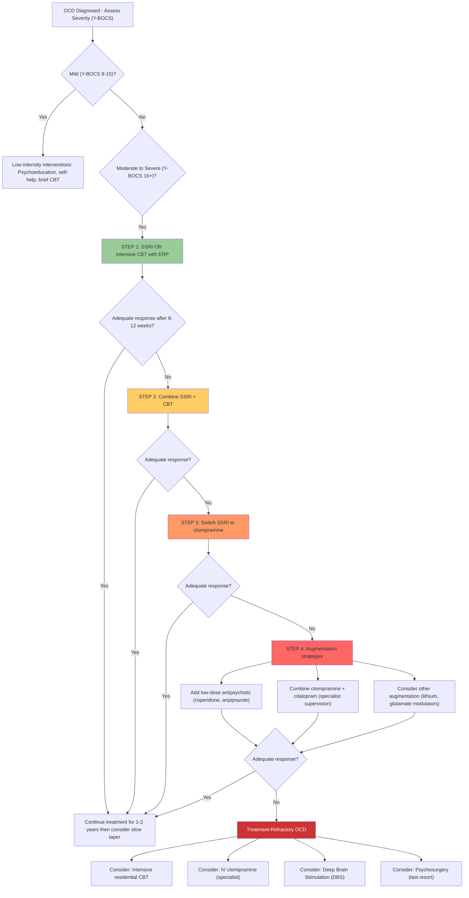

## Management of OCD

### 1. Overview and Guiding Principles

Before diving into specific treatments, let's establish the key principles that govern OCD management:

**Principle 1: OCD responds to a narrow range of treatments.** Unlike depression where many classes of antidepressant work, OCD responds specifically to **serotonergic** agents (SSRIs, clomipramine) and **CBT with ERP**. Noradrenergic agents alone (e.g., desipramine, reboxetine) do not work for OCD. This specificity supports the serotonergic hypothesis of OCD pathophysiology.

**Principle 2: OCD requires higher doses and longer duration.** SSRIs for OCD typically require doses at the **top of the therapeutic range** and **8–12 weeks** to show effect (vs. 4–6 weeks for depression). This suggests the mechanism in OCD is different from simple serotonin reuptake inhibition — it likely involves downstream receptor desensitisation and modulation of the CSTC loop.

**Principle 3: Treatment response rates are moderate.** ***40–60% treatment response*** [19] — this means a substantial proportion of patients will need augmentation or combination strategies. Complete remission is even less common.

**Principle 4: CBT and medication have comparable efficacy and complementary mechanisms.** ***Cognitive behaviour therapy reduces resting state glucose metabolism or blood flow in the right caudate in treatment responders. Similar results have been obtained with drug treatment*** [20]. This is remarkable — both pharmacotherapy and psychotherapy normalise the same CSTC circuit hyperactivity, but through different entry points (bottom-up for drugs, top-down for CBT).

---

### 2. Stepped-Care Management Algorithm (Based on NICE Guidelines)

The approach is **stepped care** — start with the least intensive effective treatment and escalate if response is suboptimal [3]:

| Step | Intervention | When to Use |
|---|---|---|
| ***1st line*** | ***SSRI*** **or** ***intensive CBT*** | Initial treatment for moderate-to-severe OCD [3] |
| ***2nd line*** | ***Combination of SSRI + CBT*** | ***If response to single strategy is suboptimal*** [3] |
| ***3rd line*** | ***Use clomipramine if SSRI fails*** | After adequate trial of ≥2 SSRIs [3] |
| ***4th line*** | ***Add antipsychotic*** **or** ***combine clomipramine + citalopram*** | ***If response still suboptimal*** [3] |

---

### 3. Pharmacological Treatment

#### 3.1 First-Line: SSRIs

***SSRIs are first-line*** for OCD because they have the ***best side-effect profile*** [3][21].

**How SSRIs work in OCD**: SSRIs block the serotonin transporter (SERT) → ↑ synaptic 5-HT availability → over weeks, this leads to desensitisation of presynaptic 5-HT1A autoreceptors and postsynaptic 5-HT receptor changes → modulation of serotonergic tone in the CSTC loop → ↓ hyperactivity of the OFC-caudate-thalamic circuit → ↓ obsessions and compulsions.

**Why higher doses are needed in OCD vs depression**: The SERT occupancy required to modulate the CSTC loop in OCD appears to be higher than that needed for the mood circuits in depression. Studies suggest that OCD requires ~80% SERT occupancy (achieved at higher doses) vs ~60–70% for depression.

| SSRI | Starting Dose | Target OCD Dose | Notes |
|---|---|---|---|
| ***Fluoxetine*** | 20 mg/day | 40–80 mg/day | Long half-life (advantage: missed doses matter less; disadvantage: slow washout if switching) |
| ***Fluvoxamine*** | 50 mg/day | 200–300 mg/day | Particularly well-studied in OCD; licensed for OCD in many countries; significant CYP1A2 inhibition |
| ***Sertraline*** | 50 mg/day | 150–200 mg/day | Good evidence base; relatively few drug interactions |
| ***Paroxetine*** | 20 mg/day | 40–60 mg/day | Potent; but highest risk of discontinuation syndrome among SSRIs due to short half-life and anticholinergic properties; **category D in pregnancy** (cardiac defects) |
| ***Citalopram*** | 20 mg/day | 40 mg/day (max; QTc risk above this) | Clean pharmacology; but QTc prolongation limits dose escalation |
| ***Escitalopram*** | 10 mg/day | 20–30 mg/day | S-enantiomer of citalopram; slightly better tolerability; also QTc risk at high doses |

[2][21]

**Key prescribing principles for SSRIs in OCD**:

- ***Duration: ≥ 1–2 years after achieving remission, then slowly tapered*** [3]
- ***Relapse is common in the first few weeks after stopping*** [3]
- Start low, go slow — but titrate to the **maximum tolerated dose** before declaring treatment failure
- Allow **8–12 weeks** at adequate dose before assessing response (vs 4–6 weeks for depression)
- An **adequate trial** = maximum tolerated dose for ≥ 8–12 weeks
- Try at least **2 different SSRIs** before moving to clomipramine

**Common side effects of SSRIs** (explained mechanistically):

| Side Effect | Mechanism | Clinical Relevance |
|---|---|---|
| GI upset (nausea, diarrhoea) | ↑ 5-HT stimulates 5-HT3 receptors in GI tract | Usually transient (1–2 weeks); advise taking with food |
| Sexual dysfunction | ↑ 5-HT inhibits dopaminergic and noradrenergic pathways involved in sexual arousal/orgasm | Common (~30–50%); major cause of non-adherence; consider switching to agent with less sexual SE |
| Initial anxiety/agitation | Acute ↑ 5-HT stimulates 5-HT2C receptors → anxiogenic | Particularly relevant in OCD — warn patients symptoms may temporarily worsen; consider short-term benzodiazepine cover |
| Weight gain | Complex — 5-HT2C receptor effects on appetite regulation | More with paroxetine; less with fluoxetine |
| Hyponatraemia (SIADH) | ↑ 5-HT stimulates ADH release | Particularly in elderly; monitor Na+ if symptomatic |
| QTc prolongation | Direct cardiac ion channel effects | Particularly citalopram/escitalopram at high doses; obtain baseline ECG |
| Discontinuation syndrome | Abrupt cessation → rapid ↓ in synaptic 5-HT; receptor upregulation not yet reversed | Worst with paroxetine (short half-life); always taper slowly |

<Callout title="OCD ≠ Depression Dosing" type="error">
A very common exam and clinical mistake is to treat OCD with "depression doses" of SSRIs. If a patient with OCD is on fluoxetine 20 mg and not responding, the answer is NOT "treatment failure" — it's "dose is too low." You must titrate to the maximum tolerated dose (e.g., fluoxetine 80 mg) and wait 8–12 weeks before declaring non-response.
</Callout>

#### 3.2 Second-Line / Alternative: Clomipramine

***Clomipramine*** is a tricyclic antidepressant (TCA) that is the **most potent serotonin reuptake inhibitor** among TCAs. Its name: "chloro" + "imipramine" — it is a chlorinated derivative of imipramine.

***Clomipramine is used if SSRI fails*** [3][21].

**Why clomipramine works for OCD**: Clomipramine is an extremely potent SERT blocker (more potent than most SSRIs). Its active metabolite, desmethylclomipramine, also inhibits noradrenaline reuptake, but the parent compound's serotonergic action is what drives the anti-obsessional effect.

**Why it's not first-line**: The side-effect profile is significantly worse than SSRIs:

| Side Effect | Mechanism |
|---|---|
| Anticholinergic effects (dry mouth, constipation, urinary retention, blurred vision) | Muscarinic receptor blockade |
| Sedation | Histamine H1 receptor blockade |
| Orthostatic hypotension | Alpha-1 adrenergic blockade |
| Weight gain | H1 and 5-HT2C effects |
| ***QTc prolongation / cardiac arrhythmia*** | Sodium channel blockade in cardiac myocytes |
| Seizure risk | Lowered seizure threshold at high doses |
| Lethal in overdose | Sodium channel blockade → cardiac conduction block → VF/asystole |

**Prescribing**: Start 25 mg/day, titrate to 100–250 mg/day. **ECG mandatory** before starting and at dose increases (check QTc). **Contraindicated** in recent MI, heart block, severe liver disease.

#### 3.3 Alternative: Venlafaxine (SNRI)

***Venlafaxine*** is listed as an alternative to SSRIs [3]. It is an SNRI ("serotonin-noradrenaline reuptake inhibitor") — at lower doses it acts predominantly as an SRI, and at higher doses it recruits noradrenergic blockade. The anti-OCD effect is likely mediated primarily by the serotonergic component.

Evidence for venlafaxine in OCD is weaker than for SSRIs or clomipramine — it is used when SSRIs and clomipramine cannot be used or have failed.

#### 3.4 Augmentation Strategies

When monotherapy is insufficient, augmentation is the next step:

##### 3.4.1 ***Antipsychotic Augmentation*** [3][19]

***Antipsychotics (haloperidol, risperidone, quetiapine, olanzapine, aripiprazole)*** are used as augmentation [3].

**Why antipsychotics help in OCD**: The CSTC loop involves dopaminergic modulation at the striatal level. Adding a dopamine blocker may help "brake" the hyperactive loop. This is particularly effective in:
- ***Tic-related OCD*** (shared striatal dopaminergic pathology with tic disorders)
- OCD with **poor/absent insight** (delusional-like conviction may have a dopaminergic component)
- OCD with comorbid tics or Tourette's

| Antipsychotic | Evidence Level | Notes |
|---|---|---|
| **Risperidone** (0.5–3 mg/day) | Best evidence | Multiple RCTs; NNT ~4–5 |
| **Aripiprazole** (5–15 mg/day) | Good evidence | Partial D2 agonist — may be better tolerated; less metabolic SE |
| **Haloperidol** (2–5 mg/day) | Moderate evidence | Particularly for tic-related OCD; EPS risk |
| **Quetiapine** (150–450 mg/day) | Mixed evidence | Sedation may be useful if insomnia is prominent |
| **Olanzapine** (5–10 mg/day) | Some evidence | Significant metabolic side effects (weight gain, diabetes) |

**Duration of augmentation trial**: 4–6 weeks at adequate dose before assessing response.

##### 3.4.2 ***Clomipramine + Citalopram Combination*** [3]

***Combining clomipramine + citalopram*** is listed as a 4th-line option [3]. This is pharmacologically rational (two serotonergic agents via different mechanisms) but requires **specialist supervision** due to:
- Risk of **serotonin syndrome** (↑↑ synaptic 5-HT → hyperthermia, rigidity, clonus, autonomic instability)
- Combined **QTc prolongation** risk
- Requires ECG monitoring and careful dose titration

##### 3.4.3 Other Augmentation Options (Research/Specialist Level)

| Agent | Mechanism | Evidence |
|---|---|---|
| **Lithium** | Enhances serotonergic transmission | Weak evidence for OCD (unlike its strong evidence in depression augmentation) |
| **N-acetylcysteine (NAC)** | Glutamate modulator (restores glutamate homeostasis in striatum) | Emerging evidence; low risk; sometimes used as adjunct |
| **Memantine** | NMDA receptor antagonist → glutamate modulation | Small studies show benefit; targets glutamatergic CSTC dysfunction |
| **Riluzole** | Glutamate release inhibitor | Used in ALS; small OCD studies show promise |
| **D-cycloserine** | Partial NMDA agonist → facilitates extinction learning | Used to augment CBT/ERP (given before ERP sessions to enhance fear extinction) |

#### 3.5 ***Anxiolytics*** [3]

***Anxiolytics*** are used for ***short-term relief, but not more than 2–4 weeks at a time*** [3].

**Why short-term only?** Benzodiazepines (BZDs) enhance GABA-A receptor function → rapid anxiolysis. However:
- They do NOT treat the core OCD pathology (CSTC loop hyperactivity)
- Tolerance and dependence develop rapidly (within 2–4 weeks)
- Withdrawal can exacerbate anxiety
- They impair the learning that occurs during CBT/ERP (BZDs dampen the anxiety that is therapeutically necessary for habituation)

**Role**: Bridge therapy during the initial 2–4 weeks of SSRI treatment when anxiety may paradoxically worsen due to acute serotonergic stimulation.

---

### 4. Non-Pharmacological Treatment

#### 4.1 ***Psychoeducation*** [3][22]

***Psychoeducation to improve patient's understanding and reassurance*** [3][22].

This is always the first step. Key points to communicate:
- OCD is a recognised medical condition, not a character flaw
- The intrusive thoughts do NOT mean the patient will act on them (crucial for those with aggressive/sexual obsessions)
- Treatment is effective in the majority of cases
- Both medication and psychological therapy work
- Recovery takes time — 8–12 weeks for medication, typically 12–16 sessions for CBT

#### 4.2 ***Psychological Support and Reassurance*** [22]

***Psychological support and reassurance*** [22] — but note that excessive reassurance-seeking from the therapist can itself become a compulsion. The therapist must balance being supportive while not feeding into the OCD cycle.

#### 4.3 ***CBT with Exposure and Response Prevention (ERP)*** [3][19][22]

This is the **gold-standard psychological treatment** for OCD.

**Name breakdown**:
- **Exposure** = deliberate confrontation with the feared stimulus/obsessional trigger
- **Response Prevention** = deliberately NOT performing the compulsion

***Exposure and response prevention (ERP)*** involves ***exposure to environmental cues that increase symptoms, but preventing the compulsive response*** (e.g., stopping the patient from washing their hands when they want to) [3].

**Why ERP works — from first principles**:

1. The obsession triggers anxiety → the compulsion provides temporary relief (negative reinforcement)
2. This relief prevents the natural process of **habituation** (the brain's ability to learn that the feared outcome does not occur)
3. By blocking the compulsion (response prevention) while maintaining exposure to the trigger:
   - Anxiety initially spikes (this is expected and patients must be warned)
   - Over time (typically 45–90 minutes), anxiety **naturally decreases** through habituation
   - With repeated sessions, the brain learns: "I touched the 'contaminated' surface, I didn't wash, and nothing bad happened"
4. This weakens the obsession-anxiety-compulsion cycle

***Effect: ~2/3 with moderately severe rituals improve substantially, comparable to SSRIs*** [3].

**Limitations**: ***Less effective for obsessional thoughts that occur without rituals*** [3] — because pure obsessions have no overt compulsion to prevent. For these patients, the cognitive component is more important.

**Typical protocol**: 12–16 sessions, each 60–90 minutes, with between-session homework (self-directed ERP). A hierarchy of feared situations is constructed from least to most anxiety-provoking, and exposure progresses gradually.

#### 4.4 ***Cognitive Therapy*** [3][22]

***Cognitive therapy as part of CBT*** [3]:

***Involves: tackling underlying cognitive beliefs of obsessive thoughts*** [3]:

- ***Thought stopping and distraction for ruminations*** [3][22] — ***resistive thoughts only increase their occurrence*** [22]. This is a counterintuitive but crucial principle: the more you try to suppress a thought, the more it rebounds (Wegner's "white bear" experiment). Instead, patients learn to **acknowledge** the thought without engaging with it.

- ***Modification of responsibility beliefs***: ***Try to suggest less threatening alternative explanations and discuss any other cognitive distortions*** [3]. For example:
  - "Having the thought 'I might harm my child' does NOT mean I am a dangerous person" (thought-action fusion)
  - "Just because I thought about contamination does NOT mean I am contaminated" (magical thinking)
  - "I am not personally responsible for preventing every possible harm" (inflated responsibility)

***Effect: not as effective on its own but increases the effect of behavioural interventions when combined*** [3].

<Callout title="Why CBT Works at the Brain Level" type="idea">
***Increased activity in the right caudate is found in patients with OCD, and cognitive behaviour therapy reduces resting state glucose metabolism or blood flow in the right caudate in treatment responders. Similar results have been obtained with drug treatment*** [20]. This means CBT and SSRIs converge on the same neural target — the hyperactive caudate in the CSTC loop — through different pathways. CBT works "top-down" (cortical cognitive reappraisal → ↓ OFC drive → ↓ caudate activity), while SSRIs work "bottom-up" (↑ serotonin → modulate striatal gating → ↓ loop hyperactivity).
</Callout>

#### 4.5 Neurosurgical Interventions (Last Resort)

For treatment-refractory OCD (failed multiple adequate pharmacological trials + CBT):

##### 4.5.1 ***Psychosurgery*** [3][19]

***Psychosurgery: orbitomedial/cingulate lesioning → dramatic decrease in tension and stress in severe cases*** [3].

- **Anterior capsulotomy**: lesions the anterior limb of the internal capsule (disrupts the connection between OFC and thalamus in the CSTC loop)
- **Cingulotomy**: lesions the anterior cingulate cortex (disrupts the error-monitoring component)
- These are **irreversible** and reserved for the most severe, treatment-refractory cases
- Response rates ~30–50% in carefully selected patients
- Risks: personality change, apathy, seizures, cognitive impairment

##### 4.5.2 ***Deep Brain Stimulation (DBS)*** [3]

***Deep brain stimulation (DBS): increasingly used for intractable OCD but experience is still limited*** [3].

- **Targets**: ventral capsule/ventral striatum, subthalamic nucleus, nucleus accumbens
- **Mechanism**: high-frequency electrical stimulation → functional inhibition of the target → disrupts the hyperactive CSTC loop
- **Advantage over psychosurgery**: reversible and adjustable
- **Disadvantage**: requires permanent implanted hardware; risk of infection, lead migration, battery replacement
- FDA-approved under a Humanitarian Device Exemption for severe, treatment-refractory OCD
- Response rates ~60% in carefully selected patients

---

### 5. General Treatment Principles from Lecture Slides

The lecture slides emphasize the following broader treatment framework [19][21][23]:

***General treatment approaches*** [23]:
- ***Pharmacotherapy: Antidepressants, Anxiolytics, Antipsychotics, Mood stabilizers***
- ***Psychotherapy: Cognitive Behaviour Therapy (CBT), Mindfulness-based Therapy***

***Treatment of Anxiety Disorders*** (which includes OCD in the lecture context) [21]:
- ***Supportive measures: Explanation, Reassurance***
- ***Psychological treatment: Cognitive behavioural therapy***
- ***Medications: Antidepressants (e.g., SSRI, SNRI, TCA, MAOI), Beta-adrenergic antagonist (e.g., propranolol), Benzodiazepines, Buspirone, Pregabalin***

For OCD specifically from the antidepressant slide [21]:
- ***SSRI: Paroxetine, Citalopram, Escitalopram, Fluoxetine, Sertraline, Fluvoxamine***
- ***TCA: Clomipramine: OCD*** (specifically highlighted for OCD)

<Callout title="Key Lecture Summary Point" type="idea">
***There are many effective treatments including psychotherapy and psychopharmacology. There is a huge amount of suffering associated with these disorders*** [24]. The lecture specifically reminds us that despite effective treatments being available, OCD causes enormous suffering — partly because it is underdiagnosed, undertreated, and patients often wait 7–10 years before seeking help due to shame and stigma.
</Callout>

---

### 6. Special Populations

| Population | Considerations |
|---|---|
| **Children and adolescents** | CBT with ERP is first-line; SSRIs (fluoxetine, fluvoxamine, sertraline have best evidence) as second-line; lower starting doses; screen for PANDAS in acute onset; involve family in treatment |
| **Pregnancy** | CBT is first-line (no drug exposure risk). If medication needed: sertraline and fluoxetine have most safety data. **Avoid paroxetine** (teratogenic — cardiac defects). Clomipramine should generally be avoided. Risk-benefit discussion essential |
| **Elderly** | Start SSRIs at lower doses; heightened risk of hyponatraemia (SIADH), falls, drug interactions; cognitive side effects of clomipramine particularly problematic |
| **Tic-related OCD** | May benefit from earlier antipsychotic augmentation (especially haloperidol or aripiprazole) given shared striatal dopaminergic pathology |
| **OCD with absent insight** | May need antipsychotic augmentation earlier; CBT may be less effective without insight; motivational approaches may help |
| **Comorbid depression** | Treat OCD first (SSRIs treat both); if depression is severe and independent, may need specific depression management (e.g., higher SSRI dose, augmentation with lithium/antipsychotic, or ECT for depression) |

---

### 7. Monitoring and Follow-Up

| Timepoint | Action |
|---|---|
| **Baseline** | Y-BOCS score, comorbidity screen, risk assessment, ECG if using clomipramine/high-dose SSRI, bloods (LFT, RFT, TFT) |
| **2–4 weeks** | Review tolerability of medication; assess for initial worsening of anxiety; suicide risk check |
| **8–12 weeks** | First assessment of treatment response (Y-BOCS); if inadequate response at adequate dose → escalate |
| **6 months** | Continue effective treatment; ongoing CBT reinforcement; assess functional improvement |
| **1–2 years** | If in sustained remission, consider **slow taper** of medication (over 6–12 months); continue CBT skills as relapse prevention |
| **Relapse** | Return to previously effective dose; consider long-term/indefinite treatment if ≥ 2 relapses |

---

### 8. Indications and Contraindications Summary Table

| Treatment | Indications | Contraindications / Cautions |
|---|---|---|
| **SSRIs** | First-line for all OCD; moderate-severe; all age groups | Caution: QTc prolongation (citalopram/escitalopram at high doses); pregnancy (avoid paroxetine); serotonin syndrome risk with MAOIs (absolute contraindication to combine); bleeding risk with NSAIDs/anticoagulants |
| **Clomipramine** | SSRI failure (≥ 2 adequate trials); severe OCD | Contraindicated: recent MI, heart block, severe liver disease, concurrent MAOI, epilepsy (relative). Caution: elderly (anticholinergic), suicidal patients (lethal in overdose) |
| **Venlafaxine** | Alternative when SSRIs and clomipramine not tolerated | Caution: hypertension (monitor BP at doses > 150 mg); discontinuation syndrome; serotonin syndrome risk |
| **Antipsychotic augmentation** | Partial/non-response to SSRI ± CBT; tic-related OCD; poor insight OCD | Caution: metabolic syndrome (olanzapine, quetiapine); EPS/tardive dyskinesia (haloperidol); prolactinaemia (risperidone) |
| **CBT with ERP** | First-line (equivalent to SSRIs); all severities; preferred in pregnancy/children; obsessional ruminations respond better to cognitive component | Relative contraindications: severe depression (may impair engagement); active psychosis; substance intoxication; patient refusal; severe intellectual disability |
| **Benzodiazepines** | Short-term anxiolysis (≤ 2–4 weeks) while waiting for SSRI to take effect | Contraindicated for long-term use; avoid in patients with substance use history; impairs CBT learning |
| **DBS** | Severe, treatment-refractory OCD (failed ≥ 3 adequate medication trials + CBT) | Requires neurosurgical centre of expertise; medical contraindications to neurosurgery |
| **Psychosurgery** | Absolute last resort; severe, treatment-refractory OCD | Irreversible; significant risk of personality change; requires multidisciplinary review and ethical approval |

---

<Callout title="High Yield Summary">

1. **Stepped care**: 1st line = SSRI or intensive CBT → 2nd line = SSRI + CBT → 3rd line = clomipramine → 4th line = add antipsychotic or clomipramine + citalopram
2. **SSRIs**: First-line pharmacotherapy; require higher doses than depression (max tolerated dose); 8–12 weeks to assess response; continue ≥ 1–2 years after remission then slow taper
3. **Clomipramine**: Most potent SRI; reserved for SSRI failure; significant side effects (anticholinergic, cardiac, lethal in overdose); ECG mandatory
4. **Antipsychotic augmentation**: For partial/non-responders; risperidone and aripiprazole have best evidence; especially useful in tic-related and poor-insight OCD
5. **CBT with ERP**: Gold-standard psychotherapy; ~2/3 improve; works by blocking compulsion → allowing habituation → breaking obsession-anxiety-compulsion cycle; less effective for pure obsessions without rituals
6. **Cognitive therapy**: Targets inflated responsibility, thought-action fusion, magical thinking; enhances ERP effect when combined
7. **Both CBT and SSRIs normalise CSTC loop hyperactivity** — CBT reduces right caudate hyperactivity in treatment responders
8. **Anxiolytics**: Short-term only (≤ 2–4 weeks); bridge therapy; do NOT treat core pathology; impair CBT learning
9. **Neurosurgery**: DBS (reversible, ~60% response) or psychosurgery (irreversible, ~30–50% response) for treatment-refractory cases only
10. **Treatment response rate**: 40–60% overall; complete remission less common → importance of combination and augmentation strategies
11. **Key side-effect vigilance**: QTc (clomipramine, high-dose SSRI), serotonin syndrome (SSRI + clomipramine), initial anxiety worsening with SSRI initiation

</Callout>

---

<ActiveRecallQuiz
  title="Active Recall - OCD Management"
  items={[
    {
      question: "Describe the stepped-care approach to OCD management according to NICE guidelines (4 steps).",
      markscheme: "Step 1: SSRI or intensive CBT. Step 2: Combination SSRI + CBT if single strategy suboptimal. Step 3: Switch to clomipramine if SSRI fails. Step 4: Add antipsychotic augmentation or combine clomipramine + citalopram if still suboptimal."
    },
    {
      question: "Why do SSRIs require higher doses and longer treatment duration in OCD compared to depression? What constitutes an adequate trial?",
      markscheme: "OCD requires higher SERT occupancy (approximately 80% vs 60-70% for depression) to modulate the CSTC loop. Adequate trial = maximum tolerated dose for 8-12 weeks (vs 4-6 weeks for depression). The mechanism involves downstream receptor desensitisation and CSTC circuit modulation beyond simple serotonin reuptake inhibition."
    },
    {
      question: "Explain the mechanism of Exposure and Response Prevention (ERP) from first principles. Why does it work?",
      markscheme: "Obsession triggers anxiety, compulsion provides temporary relief (negative reinforcement), preventing natural habituation. ERP: patient is exposed to trigger (exposure) while compulsion is blocked (response prevention). Anxiety initially spikes but naturally decreases over 45-90 minutes through habituation. Brain learns feared outcome does not occur. Repeated sessions weaken the obsession-anxiety-compulsion cycle. Approximately 2/3 with moderate-severe rituals improve substantially."
    },
    {
      question: "What neuroimaging finding supports the convergence of CBT and pharmacotherapy in OCD treatment?",
      markscheme: "Increased activity in the right caudate is found in OCD patients. CBT reduces resting state glucose metabolism or blood flow in the right caudate in treatment responders. Similar results have been obtained with drug treatment (SSRIs). This shows both treatments normalise the same CSTC loop hyperactivity through different pathways: CBT top-down (cortical reappraisal reduces OFC drive and caudate activity), SSRIs bottom-up (increased serotonin modulates striatal gating)."
    },
    {
      question: "Name three indications for antipsychotic augmentation in OCD, and which agents have the best evidence.",
      markscheme: "Indications: (1) Partial or non-response to SSRI plus CBT; (2) Tic-related OCD (shared striatal dopaminergic pathology); (3) OCD with poor or absent insight. Best evidence: risperidone (0.5-3 mg/day, NNT approximately 4-5) and aripiprazole (5-15 mg/day, partial D2 agonist, better tolerated). Haloperidol also has evidence especially for tic-related OCD."
    },
    {
      question: "Why are benzodiazepines limited to short-term use in OCD, and what specific problem do they cause for psychological treatment?",
      markscheme: "Short-term only because: (1) do not treat core CSTC loop pathology; (2) tolerance and dependence develop within 2-4 weeks; (3) withdrawal exacerbates anxiety. Specific problem for psychological treatment: BZDs dampen the anxiety that is therapeutically necessary for habituation during ERP. By reducing anxiety artificially, they prevent the extinction learning that makes ERP effective. Limit to 2-4 weeks as bridge therapy during SSRI initiation."
    }
  ]}
/>

## References

[2] Lecture slides: GC 167. I feel very nervous Anxiety disorders.pdf (p31, p36–37, p40)
[3] Senior notes: ryanho-psych.md (Section 8.2 Obsessive-Compulsive Disorder — Management, pp. 189–190)
[19] Lecture slides: GC 171. Stress-related disorders and obsessive-compulsive disorder (Post-traumatic stress disorder adjustment disorder, acute stress disorder)_rev.pdf (p41) — Treatment
[20] Lecture slides: GC 171 (p40) — Functional imaging studies
[21] Lecture slides: GC 167. I feel very nervous Anxiety disorders.pdf (p36–37) — Treatment of Anxiety Disorders; Antidepressants
[22] Lecture slides: GC 167. I feel very nervous Anxiety disorders.pdf (p40) — Psychotherapy for OCD
[23] Lecture slides: GC 171 (p17) — General treatment approaches
[24] Lecture slides: GC 171 (p43) — Summary
