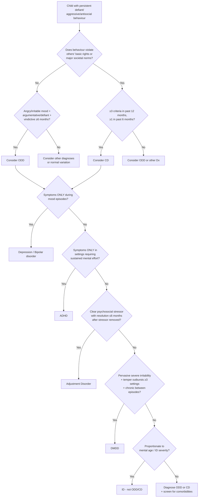

## Differential Diagnosis of Oppositional-Defiant Disorder (ODD) and Conduct Disorder (CD)

The differential diagnosis of ODD/CD is one of the trickiest areas in child psychiatry because **externalizing behaviour is a final common pathway** for many conditions. A child who is angry, defiant, and aggressive could have ODD, CD, ADHD, depression, mania, autism, intellectual disability, a response to trauma, or any combination thereof. Your job is to figure out **what is driving the behaviour** — and that requires understanding each differential from first principles.

<Callout title="The Core Principle of DDx in Externalizing Behaviour" type="idea">
Always ask: **Is the behaviour the primary problem, or is it secondary to something else?** A depressed child may be irritable and defiant — but treat the depression and the defiance resolves. A child with ADHD may appear oppositional — but the "defiance" is actually impulsivity and inability to sustain effort. Only diagnose ODD/CD when the externalizing behaviour is the **primary, persistent** pattern and not better explained by another condition.
</Callout>

---

### Overview: Diagnostic Decision Flowchart

---

### Detailed Differential Diagnosis

#### 1. ODD vs CD (Distinguishing Between the Two)

This is the most fundamental distinction and the first one to make.

***CD: ODD has less severe behaviour, not to the level of violating other's rights or societal norms. Also with more problems of emotional dysregulation under DSM-5*** [1].

| Feature | ODD | CD |
|---|---|---|
| Core issue | Emotional dysregulation + defiance of authority | Violation of others' rights + societal norms |
| Aggression | Verbal (arguing, temper) > physical | Physical aggression (fighting, weapon use, cruelty) |
| Criminal behaviour | Absent | Present (theft, arson, robbery, etc.) |
| Empathy | Usually preserved (feels guilty after outbursts) | May be absent (especially with CU traits) |
| Severity | Annoying and disruptive but not dangerous | Dangerous to self and others |
| DSM-5 emphasis | ***More problems of emotional dysregulation*** [1] — the angry/irritable mood cluster is central | More problems of behavioural self-control |

**Why this matters clinically**: ***The key distinction from other types of conduct disorder is the absence of behaviour that violates the law and the basic rights of others, such as theft, cruelty, bullying, assault, and destructiveness. The definite presence of any of the above would exclude the diagnosis [of ODD]*** [1]. ***If another type (F91.0–F91.2) is present, it should be coded in preference to oppositional defiant disorder*** [1].

In other words: **CD trumps ODD**. If a child meets criteria for both, you diagnose CD (which subsumes ODD features). You don't diagnose them separately — the ODD symptoms are understood as part of the CD picture.

However, under DSM-5, ODD *can* be diagnosed concurrently with CD if the ODD emotional symptoms (angry/irritable mood) are prominent and the clinician wants to capture that dimension.

---

#### 2. ADHD

This is the single most important differential **and** the single most common comorbid condition.

***ADHD: often comorbid with ODD. Should distinguish whether failure to conform is merely limited to situations that demand sustained mental effort or effort or demand that the individual sits still*** [1].

***ADHD: behaviour does not violate societal norms or rights of others*** [1].

***ODD pts may also resist work or school tasks that require self-application, but this is because they resist conforming to others' demands. This behaviour is characterised by negativity, hostility and defiance, and must be differentiated from aversion due to difficulty sustaining mental effort, forgetting instructions and impulsivity. It should be noted that ODD can occur together with ADHD*** [1].

Let me explain this from first principles:

- **ADHD non-compliance** is fundamentally about **executive dysfunction**. The child *cannot* sustain attention → loses track of instructions → appears to ignore parents. Or the child is impulsive → acts before thinking → appears deliberately defiant. But the intent is not hostile — the child is not *choosing* to disobey; the neurological "hardware" for sustained attention and impulse inhibition is faulty.

- **ODD non-compliance** is fundamentally about **emotional dysregulation and relational conflict**. The child *can* follow instructions in neutral situations but *chooses* to defy authority figures because of anger, resentment, or vindictiveness. The defiance is active and deliberate, directed at authority figures.

| Feature | ADHD | ODD/CD |
|---|---|---|
| **Nature of non-compliance** | Passive (forgets, can't sustain effort) | Active (refuses, argues, hostile) |
| **Pervasiveness** | Present in ALL settings (pervasive) | May be selective (worse with known adults) |
| **Emotional tone** | Frustration, carelessness | Anger, hostility, vindictiveness |
| **Intent** | Not deliberate | Deliberate defiance |
| **Motor activity** | ↑ motor activity, fidgeting, "driven by a motor" | Not typically hyperactive |
| ***Rights violation*** | ***Behaviour does not violate societal norms or rights of others*** [1] | ODD: defiant but not criminal; CD: violates rights |
| **Response to structure** | Improves with structure and cues | May worsen (opposes imposed structure) |

<Callout title="The Comorbidity Trap" type="error">
Approximately **40% of ADHD children have comorbid ODD** and **~20% have comorbid CD** [2]. In clinical practice, you will frequently encounter children who have BOTH. The key is not to assume that all disruptive behaviour is "just ADHD" — many children genuinely have both conditions, and you must treat both. ***It should be noted that ODD can occur together with ADHD*** [1]. Screen systematically: ***Symptom-screening: ODD S/S first → screen CD S/S if ODD S/S present*** [1].
</Callout>

---

#### 3. Depressive Disorder / Bipolar Affective Disorder (BAD)

***Depressive/BAD: negative affect and irritability only occurs in the context of a mood episode*** [1].

***Childhood depression may be associated with irritability, aggression and conduct problems, but these behaviour are limited to mood episodes*** [1].

This is a critical differential because childhood depression often does NOT present as classical sadness — it frequently manifests as **irritability, anger, and externalizing behaviour** [3].

**Why depression causes irritability in children**: Children have immature emotional regulation and limited verbal capacity to express internal distress. The "masked depression" of childhood means that instead of saying "I feel sad and hopeless," the child's dysphoric mood manifests as anger outbursts, aggression, somatic complaints (abdominal pain, headache), and behavioural problems. One of the senior notes cases illustrates this: ***one case tried to steal a bus because of frustration at home, take cannabis to lift mood due to depression*** [1] — the externalizing behaviour was secondary to the underlying depressive state.

**Why bipolar mania mimics CD**: ***ADHD and mania are both associated with distractibility, impulsivity and talkativeness. In BAD, these features tend to occur episodically and may be associated with elated mood and grandiosity*** [1]. A manic adolescent may engage in reckless behaviour (spending sprees, sexual indiscretion, dangerous driving, aggression) that looks exactly like CD — but it is episodic and mood-state-dependent.

| Feature | ODD/CD | Depression | Bipolar Mania |
|---|---|---|---|
| **Temporal pattern** | Persistent (≥ 6–12 months) | Episodic (weeks to months) | ***Episodic*** [1] (days to weeks) |
| **Irritability** | Chronic, directed at authority | Part of low mood episode | Part of elevated/irritable mood episode |
| **Between episodes** | Symptoms persist | Returns to baseline | Returns to baseline |
| ***Associated features*** | Defiance, vindictiveness, rule-breaking | Anhedonia, guilt, suicidality, sleep/appetite change | ***Elated mood and grandiosity*** [1], ↓ sleep need, pressured speech, flight of ideas |
| **Onset** | Early (preschool for ODD) | Variable; ***increases drastically after puberty*** [1] | Often late adolescence; ***~25% of BAD first presented as juvenile depression*** [1] |

> **High Yield**: The distinguishing question is: **"Is there a clear episodic pattern where the behaviour worsens during mood episodes and improves between them?"** If yes → consider mood disorder. If the behaviour is chronic and non-episodic → ODD/CD is more likely.

---

#### 4. Disruptive Mood Dysregulation Disorder (DMDD)

***Disruptive mood dysregulation disorder: irritability and temper outbursts are more severe*** [1].

DMDD was introduced in DSM-5 specifically to address the concern that children with severe chronic irritability were being misdiagnosed with paediatric bipolar disorder. Let me explain from first principles:

- **DMDD** = severe, recurrent temper outbursts (verbal or behavioural) that are grossly out of proportion to the situation, occurring ≥ 3 times/week, **AND** a persistently irritable/angry mood **between** the outbursts, present most of the day, nearly every day, in **≥ 3 settings** (home, school, peers).
- The key distinction from ODD: **DMDD is more severe and more pervasive**. ODD irritability can be confined to 1–2 settings; DMDD is pervasive. ODD outbursts are frequent but not necessarily grossly out of proportion; DMDD outbursts are explosive and disproportionate.
- The key distinction from bipolar: DMDD irritability is **chronic and non-episodic** (present for ≥ 12 months without a symptom-free period > 3 months). Bipolar irritability is episodic.

| Feature | ODD | DMDD |
|---|---|---|
| Temper outbursts | Frequent | ***More severe*** [1], grossly disproportionate, ≥ 3x/week |
| Mood between outbursts | May be normal between episodes | Persistently irritable/angry most of the day, nearly every day |
| Pervasiveness | Mild: 1 setting; Moderate: ≥ 2; Severe: ≥ 3 | Must be present in ≥ 3 settings |
| Age of onset | Preschool | Diagnosis requires onset before age 10 (diagnosed 6–18y) |

<Callout title="DSM-5 Exclusion Rule" type="error">
***Criteria [for ODD] not met for DMDD*** [1]. This means: if a child meets criteria for DMDD, you diagnose DMDD and NOT ODD. DMDD takes diagnostic precedence. However, a child with DMDD can still be diagnosed with CD if criteria are met.
</Callout>

---

#### 5. Intellectual Disability (ID)

***ID: ODD only diagnosed when out of proportion when compared with other individuals of comparable mental age or ID severity*** [1].

**Why this matters from first principles**: A child with intellectual disability (ID; previously "mental retardation") has limited cognitive capacity to understand rules, process instructions, express frustration verbally, and foresee consequences. This cognitive limitation leads to behavioural problems that may *look like* ODD — the child appears to defy instructions, has tantrums, is irritable. But the underlying mechanism is cognitive inability rather than wilful defiance.

The diagnostic rule is: compare the child's behaviour to **other children of the same mental age**, not chronological age. A 10-year-old with moderate ID (mental age ~5 years) who has tantrums equivalent to a typical 5-year-old does NOT have ODD — those tantrums are developmentally appropriate for that mental age. ODD is only diagnosed if the behaviour exceeds what would be expected even for the child's cognitive level.

---

#### 6. Adjustment Disorder

***Adjustment disorder: only consider adjustment disorder if criteria for CD is not met, with clear association with psychosocial stressor (resolves ≤ 6 months of resolution of stressor)*** [1].

**Adjustment disorder** = emotional or behavioural symptoms developing within 3 months of an identifiable psychosocial stressor, causing marked distress out of proportion to the stressor, with impairment in functioning. Critically:
- There is a **clear temporal relationship** to the stressor.
- Symptoms **resolve within 6 months** of the stressor being removed.
- If full criteria for ODD or CD are met, those diagnoses take precedence — adjustment disorder is essentially a "residual" diagnosis.

Examples in children: parental divorce → child becomes defiant and aggressive at school. If this resolves once the family situation stabilises, it's adjustment disorder. If it persists and escalates even after the stressor resolves, consider ODD/CD.

---

#### 7. Autism Spectrum Disorder (ASD)

Although not explicitly listed in the ODD/CD DDx section of the senior notes, ASD is mentioned in the ADHD differential [1] and is important to consider.

**Why ASD children may appear oppositional**: Rigid adherence to routines → when a routine is disrupted, the child has a meltdown that looks like an ODD tantrum. Poor social communication → difficulty understanding instructions → apparent non-compliance. Sensory overload → aggressive outbursts. Restricted interests → refuses to do anything outside their interest area.

But the underlying mechanism is fundamentally different:
- **ODD defiance** is relational and intentional — directed at authority figures.
- **ASD "defiance"** is driven by **rigidity, poor social cognition, and sensory dysregulation** — it is not directed at authority figures per se; it is a response to disrupted expectations or overwhelming stimuli.

Look for: stereotyped behaviours, restricted interests, impaired social reciprocity, sensory sensitivities, early onset of social communication difficulties (before the "behavioural" problems).

---

#### 8. Antisocial Personality Disorder (ASPD)

This is not a differential in childhood (personality disorders are not diagnosed before age 18), but rather the **adult diagnostic outcome** of CD.

***Preceded by conduct disorder < 15y (25% F, 40% M eventually develop antisocial PD)*** [1]. ***Callous lack of concern for others as central feature. Irritable, exploitative, violent and may inflict cruel or degrading acts on other people. Superficial charm but relationships are shallow and short-lived. Irresponsible and depart from social norms. Impulsive and take risks without concern for safety. Avoid responsibility with striking lack of guilt or remorse and therefore does not change behaviour with punishment*** [1].

The key point: **you cannot diagnose ASPD before 18, and you need a history of CD before age 15**. So in a paediatric setting, you are diagnosing CD now with the understanding that ASPD may be the future trajectory, especially in childhood-onset CD with CU traits.

---

#### 9. Substance Use Disorders

***ADHD-like symptoms can occur with substance use, but these are episodic and occur only in the context of substance use*** [1]. The same applies to ODD/CD-like behaviour.

- Intoxication (alcohol, stimulants, cannabis) can cause aggression, irritability, disinhibition, and risk-taking.
- Withdrawal states can cause irritability, agitation, and aggressive behaviour.
- The key distinguishing feature: behaviour is **temporally linked to substance use** and does not occur independently.
- However, note that substance use is also a **common comorbidity** of CD (especially in adolescents) — so both can coexist.

---

#### 10. Post-Traumatic Stress Disorder (PTSD) and Trauma-Related Disorders

***PTSD can occur in children, resembles adult counterpart*** [1] [5].

Children with PTSD (especially complex/developmental trauma) frequently present with:
- Irritability and anger outbursts (hyperarousal cluster)
- Aggression (re-enacting trauma through play or behaviour)
- Defiance and distrust of adults (especially if the trauma involved adults)
- Risk-taking behaviour

This can be indistinguishable from ODD/CD without careful trauma history. The key distinguishing features:
- History of traumatic event(s)
- Intrusive symptoms (flashbacks, nightmares, distress at reminders)
- Avoidance of trauma-related stimuli
- Negative alterations in cognition/mood

Always screen for trauma/abuse in any child presenting with externalising behaviour — ***child maltreatment, exposure to inter-parental conflict and violence*** [1] are both aetiological factors for ODD/CD AND independent conditions requiring treatment.

---

#### 11. Normal Developmental Variation

Not every defiant toddler has ODD! ***Temper tantrums, for example, are a normal part of a 3-year-old's development and their mere presence would not be grounds for diagnosis*** [1].

***Judgements concerning the presence of conduct disorder should take into account the child's developmental level*** [1]. ***Equally, the violation of other people's civic rights (as by violent crime) is not within the capacity of most 7-year-olds and so is not a necessary diagnostic criterion for that age group*** [1].

Key points:
- Tantrums peak at age 2–3 ("terrible twos") and normally decline by age 4–5.
- Mild oppositional behaviour is normal in adolescence (identity formation, individuation from parents).
- ODD is only diagnosed when the behaviour is ***clearly outside the normal range of behaviour for a child of the same age in the same sociocultural context*** [1].
- Duration must be ***6 months or longer*** [1].
- ***Isolated dissocial acts are not*** sufficient for diagnosis [1] — the pattern must be repetitive and persistent.

---

#### 12. ICD-10 Exclusion Criteria

***Exclusion criteria include uncommon but serious underlying conditions such as schizophrenia, mania, pervasive developmental disorder, hyperkinetic disorder, and depression*** [1].

This means: before diagnosing ODD/CD under ICD-10, you must rule out these conditions as the primary cause of the behaviour. If the behaviour is better explained by psychosis (command hallucinations telling the child to be violent), mania, ASD, ADHD, or depression, those diagnoses take precedence.

---

### Summary: Systematic DDx Approach

| Differential | Key Distinguishing Feature | Why it Matters |
|---|---|---|
| **CD** (vs ODD) | Behaviour violates others' rights/societal norms | CD trumps ODD if both present |
| **ADHD** | Non-compliance is passive (can't sustain effort, impulsive), not hostile; pervasive across settings | Most common comorbidity (~40%); screen always |
| **Depression** | Irritability/aggression limited to mood episodes; look for anhedonia, guilt, sleep/appetite change | Childhood depression often presents with irritability |
| **Bipolar disorder** | Episodic; elated/grandiose mood; distinct from chronic ODD pattern | Must not diagnose ODD during bipolar episodes |
| **DMDD** | More severe outbursts (≥ 3x/week, grossly disproportionate); chronic irritable mood between episodes; ≥ 3 settings | DMDD excludes ODD diagnosis |
| **ID** | Behaviour proportionate to mental age | Only diagnose ODD if disproportionate to cognitive level |
| **Adjustment disorder** | Clear temporal link to psychosocial stressor; resolves ≤ 6 months after stressor | "Residual" Dx — only if ODD/CD criteria not met |
| **ASD** | Rigidity-driven, not authority-directed; poor social cognition | Meltdowns ≠ tantrums |
| **PTSD** | Trauma history; intrusions, avoidance, hyperarousal | Always screen for trauma |
| **Substance use** | Behaviour temporally linked to intoxication/withdrawal | Also a common comorbidity of CD |
| **Normal development** | Age-appropriate (tantrums at 2–3, mild adolescent defiance) | Must exceed developmental norms for ≥ 6 months |
| **Psychosis** | Behaviour driven by delusions/hallucinations | Rare in children but must exclude |

<Callout title="High Yield DDx Summary">

The three most important differentials to remember for exams:

1. **ADHD** — most common comorbidity; distinguish passive non-compliance (can't) from active defiance (won't). Can coexist.

2. **Depression/BAD** — behaviour limited to mood episodes. Childhood depression = irritability. Bipolar = episodic + grandiosity.

3. **DMDD** — more severe than ODD; chronic inter-episode irritability; ≥ 3 settings; excludes ODD diagnosis.

**Always ask these screening questions**:
- Is there a **mood episode** driving the behaviour? → Depression/BAD
- Is there **inattention/hyperactivity** driving the behaviour? → ADHD
- Is the behaviour **proportionate to mental age**? → ID
- Is there a **clear stressor** with resolution? → Adjustment disorder
- Is there **pervasive severe chronic irritability**? → DMDD
- Is there a **trauma history**? → PTSD
</Callout>

---

<ActiveRecallQuiz
  title="Active Recall - DDx of ODD and CD"
  items={[
    {
      question: "A 9-year-old boy with ADHD repeatedly refuses to do homework and argues with his mother. How do you distinguish whether this is ADHD alone or comorbid ODD?",
      markscheme: "ADHD non-compliance: passive, limited to tasks requiring sustained mental effort or sitting still, driven by executive dysfunction (cannot sustain attention, forgets instructions, impulsive). ODD non-compliance: active defiance characterised by negativity, hostility, deliberate arguing, directed at authority figures, not limited to mentally effortful tasks. If the defiance extends beyond situations requiring sustained effort and involves deliberate hostility/vindictiveness, diagnose comorbid ODD. Both can and frequently do coexist (~40%)."
    },
    {
      question: "A 12-year-old girl is irritable, aggressive, and defiant. Her teacher reports she has been like this for 3 months since her parents divorced. What differential should you consider and what is the key temporal criterion?",
      markscheme: "Adjustment disorder. Key criteria: (1) clear temporal association with identifiable psychosocial stressor (parental divorce), (2) symptoms develop within 3 months of stressor, (3) symptoms resolve within 6 months of resolution of stressor. Only diagnose adjustment disorder if full criteria for ODD/CD are NOT met. If symptoms persist beyond 6 months after stressor resolution or meet full ODD/CD criteria, reclassify."
    },
    {
      question: "What is DMDD and why does it take diagnostic precedence over ODD?",
      markscheme: "Disruptive Mood Dysregulation Disorder: severe recurrent temper outbursts (verbal or behavioural) grossly out of proportion, occurring 3 or more times per week, PLUS persistently irritable/angry mood between outbursts (most of the day, nearly every day), present in 3 or more settings, for 12 or more months. It is MORE SEVERE and MORE PERVASIVE than ODD. DSM-5 states criteria for DMDD must not be met when diagnosing ODD - DMDD excludes ODD diagnosis."
    },
    {
      question: "Why might a child with intellectual disability appear to have ODD, and what is the diagnostic rule?",
      markscheme: "Children with ID have limited cognitive capacity to understand rules, process instructions, express frustration verbally, and foresee consequences, leading to tantrums and apparent defiance that mimics ODD. The diagnostic rule: compare behaviour to other individuals of comparable MENTAL AGE or ID severity, not chronological age. Only diagnose ODD if behaviour is out of proportion even for the child's cognitive level."
    },
    {
      question: "How do you distinguish conduct problems due to childhood depression from primary conduct disorder?",
      markscheme: "Key distinction: In depression, irritability, aggression, and conduct problems are LIMITED TO MOOD EPISODES and improve between episodes. Look for associated depressive features: anhedonia, guilt, sleep/appetite change, suicidality. Childhood depression may present as irritability rather than sadness (masked depression). In CD, behaviour is PERSISTENT (at least 12 months) and not linked to episodic mood change. Both can coexist as comorbidities."
    }
  ]}
/>

## References

[1] Senior notes: ryanho-psych.md (Sections 12.4 ODD/CD pp. 264–271; 12.3 ADHD DDx pp. 260–264; 10.5 Personality Disorders p. 240; 12.1.2 Overview of child psychiatric disorders)
[2] Senior notes: ryanho-psych.md (Section 12.3 ADHD comorbidities table)
[3] Lecture slides: GC 164. I am depressed Mood disorders.pdf
[5] Lecture slides: GC 171. Stress-related disorders and obsessive-compulsive disorder (Post-traumatic stress disorder adjustment disorder, acute stress disorder)_rev.pdf
