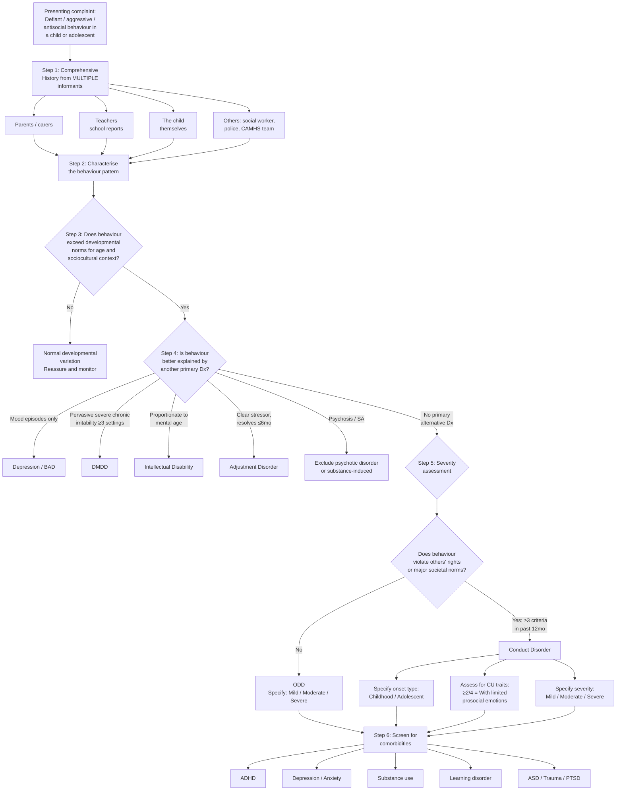
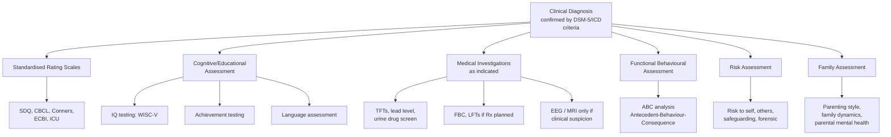

## Diagnostic Criteria

ODD and CD are **clinical diagnoses** — there is no blood test, no scan, no single biomarker. The diagnosis rests entirely on a careful, structured clinical assessment demonstrating a **persistent pattern** of behaviour that exceeds developmental norms. Let me walk through the criteria systematically, explaining the logic behind every element.

### Why Clinical Criteria Matter So Much

In most of medicine, you confirm a clinical suspicion with a definitive investigation (biopsy, culture, imaging). In child psychiatry — and especially in disruptive behaviour disorders — the criteria themselves ARE the definitive test. This means you must know them cold, understand what each criterion is trying to capture, and appreciate why the thresholds exist.

---

### 1. DSM-5 Diagnostic Criteria for ODD

***ODD and CD are coded as separate disorders under the group disruptive, impulse-control and conduct disorders*** [1].

#### Criterion A — Symptom Pattern

***A pattern of angry/irritable mood, argumentative/defiant behaviour, or vindictiveness lasting at least 6 months as evidenced by ≥ 4 of the following exhibited during interaction with ≥ 1 non-sibling individual (with persistence and frequency exceeding normal limits for age)*** [1]:

**Angry/Irritable Mood:**
1. ***Often loses temper*** [1]
2. ***Is often touchy or easily annoyed*** [1]
3. ***Is often angry or resentful*** [1]

**Argumentative/Defiant Behaviour:**
4. ***Often argues with authority figures or, for children and adolescents, with adults*** [1]
5. ***Often actively defies or refuses to comply with requests from authority figures or with rules*** [1]
6. ***Often deliberately annoys others*** [1]
7. ***Often blames others for his or her mistakes or misbehaviour*** [1]

**Vindictiveness:**
8. ***Has been spiteful or vindictive at least twice within the past 6 months*** [1]

Let me unpack the design logic of these criteria:

- **Three clusters, not one**: DSM-5 deliberately split ODD into three symptom dimensions because research showed they have different developmental trajectories and prognostic implications:
  - **Angry/irritable mood** → predicts later **internalizing disorders** (anxiety, depression)
  - **Argumentative/defiant behaviour** → predicts continued **ODD/ADHD-type problems**
  - **Vindictiveness** → predicts later **conduct disorder** (the most ominous cluster)
- **"≥ 4 of 8"**: You need symptoms from across clusters, not just one. A child who only argues (criterion 4) but isn't angry, vindictive, or blaming doesn't meet threshold.
- **"≥ 1 non-sibling"**: Sibling conflict alone is insufficient. All siblings fight — this is developmentally normal. The criteria require the behaviour to extend beyond sibling interactions.
- **"Persistence and frequency exceeding normal limits for age"**: Tantrums in a 2-year-old are normal. The same intensity at age 8 is not. Context matters. ***Temper tantrums, for example, are a normal part of a 3-year-old's development and their mere presence would not be grounds for diagnosis*** [1].
- **Duration ≥ 6 months**: This ensures we are capturing a persistent pattern, not a brief adjustment reaction.

<Callout title="Vindictiveness — the Most Important Criterion" type="idea">
The **vindictiveness** criterion (criterion 8) is the single strongest predictor of progression from ODD to CD. A child who is merely argumentative is annoying. A child who is **spiteful and vindictive** — who deliberately seeks revenge, holds grudges, and retaliates — shows the callous, premeditated quality that characterises more severe antisocial trajectories. When assessing ODD, pay special attention to this criterion.
</Callout>

#### Criterion B — Functional Impairment

***The disturbance in behaviour is associated with distress in the individual or others in his or her immediate social context*** [1].

Note the clever phrasing: distress in the individual **OR others**. Many children with ODD are not distressed themselves — they externalise. But their parents, teachers, and peers are distressed. This criterion captures the "externalizing" nature of the disorder — ***people around suffer*** [2].

#### Criterion C — Exclusion Criteria

***Do not occur exclusively during course of psychotic, SA [substance abuse], depression, bipolar disorder. Criteria not met for DMDD*** [1].

This is the "rule-out" step:
- If behaviour only occurs during a depressive episode → diagnose depression, not ODD
- If behaviour only occurs during a manic episode → diagnose bipolar, not ODD
- If criteria for DMDD are met → diagnose DMDD instead (DMDD trumps ODD, as discussed in DDx)
- Psychotic disorders and substance abuse must be excluded as primary causes

#### Severity Specifiers

***Mild: confined to only 1 setting*** [1]
***Moderate: present in ≥ 2 settings*** [1]
***Severe: present in ≥ 3 settings*** [1]

Settings = home, school, with peers, in the community, etc. The more settings affected, the more **pervasive** and severe the disorder. A child who is only defiant at home (mild) may have a family-specific issue; a child defiant everywhere (severe) likely has a more intrinsic problem.

---

### 2. DSM-5 Diagnostic Criteria for Conduct Disorder

#### Criterion A — Behaviour Pattern

***A repetitive and persistent pattern of behaviour in which others' basic rights or major age-appropriate societal norms or rules are violated, as manifested by the presence of ≥ 3/15 of the following in the past 12 months with ≥ 1 present in the past 6 months*** [1]:

**Aggression to People and Animals:**
1. Often bullies, threatens, or intimidates others
2. Often initiates physical fights
3. Has used a weapon that can cause serious physical harm (bat, brick, broken bottle, knife, gun)
4. Has been physically cruel to people
5. Has been physically cruel to animals
6. Has stolen while confronting a victim (mugging, purse-snatching, extortion, armed robbery)
7. Has forced someone into sexual activity

**Destruction of Property:**
8. Has deliberately engaged in fire-setting with intention of causing serious damage
9. Has deliberately destroyed others' property (other than fire-setting)

**Deceitfulness or Theft:**
10. Has broken into someone else's house, building, or car
11. Often lies to obtain goods or favours or to avoid obligations ("cons" others)
12. Has stolen items of nontrivial value without confronting the victim (shoplifting, forgery)

**Serious Violations of Rules:**
13. Often stays out at night despite parental prohibitions, beginning before age 13
14. Has run away from home overnight at least twice (or once without returning for a lengthy period)
15. Is often truant from school, beginning before age 13

Key design principles:
- **"≥ 3/15 in past 12 months, ≥ 1 in past 6 months"**: Two temporal thresholds ensure (1) a sufficient number of different behaviours across 12 months showing a **pattern**, and (2) at least one **recent** behaviour confirming ongoing problems. ***Isolated dissocial acts are not*** sufficient for diagnosis [1].
- **Four clusters of escalating severity**: The criteria move from aggression → property destruction → deceitfulness → rule violations. This mirrors the typical developmental escalation pattern.
- **Age-specific thresholds**: Criteria 13 and 15 specify "beginning before age 13" because staying out late and truancy become more common in normal adolescent development. Before 13, these behaviours are more pathological.

#### Criterion B — Functional Impairment

The disturbance in behaviour causes clinically significant impairment in social, academic, or occupational functioning.

#### Criterion C — Age Exclusion

If age ≥ 18, criteria are not met for antisocial personality disorder. (If the patient is 18+ and meets criteria, consider ASPD instead — CD is a paediatric diagnosis.)

#### Onset Specifier

- **Childhood-onset type**: ≥ 1 symptom characteristic of CD prior to age 10 years
- **Adolescent-onset type**: No symptoms before age 10 years
- **Unspecified onset**: Information insufficient to determine age of onset

**Why this specifier matters**: As discussed in the aetiology section, ***prognosis is worse for early-onset cases (antisocial behaviour in 40% early-onset cases and only 20% in adolescent-onset cases)*** [1].

#### Callous-Unemotional (CU) Traits Specifier

***With limited prosocial emotions*** [1] — requires ≥ 2 of the following, persistently over ≥ 12 months and across multiple settings:
- **Lack of remorse or guilt**: Does not feel bad or guilty about wrongdoing (excluding guilt only when caught or facing punishment)
- **Callous — lack of empathy**: Disregards and is unconcerned about others' feelings
- **Unconcerned about performance**: Does not show concern about poor/problematic performance at school, work, or other activities
- **Shallow or deficient affect**: Does not express feelings or show emotions to others, except in superficially inauthentic ways

<Callout title="CU Traits = The Most Important Specifier in CD" type="error">
The "with limited prosocial emotions" specifier identifies children who are on the trajectory towards **antisocial personality disorder**. These children have a fundamentally different neurobiological profile (amygdala hypoactivity, blunted cortisol, reduced fear conditioning) and respond poorly to standard behavioural interventions that rely on punishment. They require specific treatment approaches targeting reward-based learning rather than punishment-based approaches. **Always assess for CU traits** when diagnosing CD.
</Callout>

#### Severity

***Specify: mild, moderate, severe*** [1]:
- **Mild**: Few conduct problems beyond those required for diagnosis; problems cause only minor harm (e.g., lying, truancy, staying out late)
- **Moderate**: Intermediate between mild and severe
- **Severe**: Many conduct problems beyond the minimum required, OR problems cause considerable harm to others (e.g., forced sex, physical cruelty, weapon use, stealing while confronting, breaking and entering)

---

### 3. ICD-10 Diagnostic Criteria (For Comparison)

***Diagnostic criteria is largely similar between the two classifications*** [1].

#### ICD-10: ODD (F91.3)

***The essential feature of this disorder is a pattern of persistently negativistic, hostile, defiant, provocative, and disruptive behaviour, which is clearly outside the normal range of behaviour for a child of the same age in the same sociocultural context, and which does not include the more serious violations of the rights of others*** [1].

Key features specified [1]:
- ***Children with this disorder tend frequently and actively to defy adult requests or rules and deliberately to annoy other people***
- ***Usually they tend to be angry, resentful, and easily annoyed by other people whom they blame for their own mistakes or difficulties***
- ***They generally have a low frustration tolerance and readily lose their temper***
- ***Typically, their defiance has a provocative quality, so that they initiate confrontations and generally exhibit excessive levels of rudeness, uncooperativeness, and resistance to authority***
- ***The key distinction from other types of conduct disorder is the absence of behaviour that violates the law and the basic rights of others, such as theft, cruelty, bullying, assault, and destructiveness***

***This diagnosis is not recommended unless the duration of the behaviour described above has been 6 months or longer*** [1].

***Exclusion criteria include uncommon but serious underlying conditions such as schizophrenia, mania, pervasive developmental disorder, hyperkinetic disorder, and depression*** [1].

#### ICD-10: CD (F91)

***Judgements concerning the presence of conduct disorder should take into account the child's developmental level*** [1].

***Examples of the behaviours on which the diagnosis is based include*** [1]:
- ***Excessive levels of fighting or bullying***
- ***Cruelty to animals or other people***
- ***Severe destructiveness to property***
- ***Fire-setting***
- ***Stealing***
- ***Repeated lying***
- ***Truancy from school and running away from home***
- ***Unusually frequent and severe temper tantrums***
- ***Defiant provocative behaviour***
- ***Persistent severe disobedience***

***Any one of these categories, if marked, is sufficient for the diagnosis, but isolated dissocial acts are not*** [1].

ICD-10 subtypes [1]:
- ***CD confined to family context (F91.0)***
- ***Unsocialized CD (F91.1)***
- ***Socialized CD (F91.2)***
- ***ODD (F91.3)*** — note: ODD is a subtype of CD in ICD-10, not a separate disorder
- ***Other CD (F91.8)***
- ***CD unspecified (F91.9)***
- ***Mixed disorders of conduct and emotions (F92)*** — when combined with emotional disorder

| Feature | ICD-10 | DSM-5 |
|---|---|---|
| ODD relationship to CD | ***Subtype of CD*** [1] (ODD is F91.3) | ***Separate disorder*** [1] |
| Duration threshold | ***6 months or longer*** [1] | ODD: ≥ 6 months; CD: ≥ 3 criteria in past 12 months |
| Onset subtyping | Not formalised | Childhood-onset vs adolescent-onset |
| CU traits | Not included | "With limited prosocial emotions" specifier |
| Severity specifiers | Not explicitly graded | Mild / Moderate / Severe |
| Emotional dysregulation | Less emphasis | ***More problems of emotional dysregulation under DSM-5*** [1] |

---

### 4. ICD-11 Criteria (Current International Standard)

ICD-11 has now moved closer to DSM-5 in several important ways:

- **ODD (6C90)** is now classified as a **separate disorder** from CD (no longer a subtype), aligning with DSM-5.
- **Conduct-Dissocial Disorder (6C91)** replaces "Conduct Disorder" and includes onset specifiers (childhood vs adolescent) and a qualifier for "with limited prosocial emotions" — again aligning with DSM-5.
- ICD-11 emphasises **dimensional assessment** (severity, functional impact) more than ICD-10.

---

## Diagnostic Algorithm

### Step-by-Step Clinical Approach

### Detailed Description of Each Step

#### Step 1: Comprehensive Multi-Informant History

This is the single most important step. ***During interview: get an impression of how difficult is the child and how good is the parenting*** [1].

**From parents/carers** [1]:
- ***Overall compliance to parents' commands: % compliance — usually 70–80% (50% bad, 90% good)*** [1]
- ***Non-compliance: usually on what aspect? How do you handle it?*** [1]
- ***Find out how the parent gives commands → can be trained to give better commands*** [1]
- ***Temper: Worst temper/outburst? How severe or frequent is it? How do parents cope? Current situation*** [1]
- ***Baumrind's parenting styles: authoritarian, permissive, authoritative, neglecting*** [1]
- Family structure, domestic violence, parental mental health, substance use, criminal history

**From teachers/school**:
- Academic performance and engagement
- Behaviour in structured vs unstructured settings (playground, lunch)
- Peer relationships — bullied, bully, or both?
- Comparison with developmental norms

**From the child**:
- Their perspective on the problems (do they see themselves as having a problem?)
- Their emotional state (screening for depression, anxiety, trauma)
- Substance use screen in adolescents
- Risk assessment: self-harm, harm to others, exploitation

**From other sources**:
- Social worker reports, police records (for CD)
- Previous CAMHS assessments
- Child protection records

<Callout title="Critical Point: Behaviour May Not Be Evident in Clinic" type="error">
***Frequently, this behaviour is most evident in interactions with adults or peers whom the child knows well, and signs of the disorder may not be evident during a clinical interview*** [1]. You CANNOT diagnose ODD/CD based on a single clinic visit observation. Multi-informant, multi-setting assessment is mandatory.
</Callout>

#### Step 2: Systematic Symptom Screening

***Symptom-screening: ODD S/S first → screen CD S/S if ODD S/S present*** [1].

This is the correct clinical hierarchy:
1. Screen for ODD symptoms (the milder condition) first
2. If ODD symptoms are present, then screen for CD symptoms (the more severe condition)
3. If CD criteria are met, CD takes diagnostic precedence over ODD (***if another type [F91.0–F91.2] is present, it should be coded in preference to oppositional defiant disorder*** [1])

#### Step 3: Developmental Context Assessment

***Judgements concerning the presence of conduct disorder should take into account the child's developmental level*** [1].

Ask: Is this behaviour appropriate for this child's age, gender, cognitive level, and sociocultural context? A 3-year-old's tantrum is normal. A 12-year-old's tantrum is not. A brief period of defiance during family upheaval may be normal. Six months of persistent defiance is not.

#### Step 4: Exclude Primary Alternative Diagnoses

Apply the exclusion criteria systematically (as detailed in the DDx section):
- Depression/BAD: behaviour only during mood episodes?
- DMDD: pervasive severe chronic irritability? → diagnose DMDD, not ODD
- ID: proportionate to mental age?
- Adjustment disorder: clear stressor with resolution?
- Psychosis, substance use: primary cause?

#### Step 5: Classify and Specify

Once ODD or CD is confirmed:
- **ODD**: Specify severity (mild/moderate/severe by number of settings)
- **CD**: Specify onset type (childhood vs adolescent), CU traits (with limited prosocial emotions), severity (mild/moderate/severe)

#### Step 6: Screen for Comorbidities

This is essential because comorbidity is the rule, not the exception:
- ADHD (~40% with ODD, ~20% with CD) [2]
- Depression/anxiety
- Substance use
- Learning disorders
- ASD, PTSD

---

## Investigation Modalities

### The Fundamental Principle

<Callout title="No Diagnostic Test Exists for ODD/CD">
There is **no laboratory test, neuroimaging study, or psychometric score** that definitively diagnoses ODD or CD. The diagnosis is **purely clinical**, based on history and behavioural observation meeting standardised criteria. Investigations are performed to: (1) assess comorbidities, (2) exclude medical mimics, (3) evaluate severity and prognostic factors, and (4) guide management planning.
</Callout>

### 1. Standardised Rating Scales and Questionnaires

These are the closest things to "investigations" in this field. They provide structured, validated quantification of behavioural problems.

| Instrument | What it Measures | Who Completes It | Key Findings / Interpretation |
|---|---|---|---|
| **Strengths and Difficulties Questionnaire (SDQ)** | 5 domains: emotional symptoms, conduct problems, hyperactivity/inattention, peer relationship problems, prosocial behaviour | Parent, teacher, self-report (11+) | **Conduct problems subscale score ≥ 4** (parent/teacher) suggests clinically significant conduct difficulties. Total difficulties score ≥ 17 suggests overall psychopathology. Free, widely used in HK CAMHS as a screening tool. |
| **Child Behaviour Checklist (CBCL)** (Achenbach System of Empirically Based Assessment) | Broadband: internalising vs externalising; narrowband: aggressive behaviour, rule-breaking behaviour, anxious/depressed, etc. | Parent (CBCL), Teacher (TRF), Youth self-report (YSR) | **Externalising T-score ≥ 64** (borderline clinical) or **≥ 70** (clinical range) suggests significant externalising pathology. Provides multi-informant comparison — discrepancies between parent and teacher ratings are clinically informative. |
| **Eyberg Child Behaviour Inventory (ECBI)** | Frequency and perceived severity of disruptive behaviours in 2–16 year olds | Parent | **Intensity score ≥ 131** or **Problem score ≥ 15** suggests clinically significant conduct problems. Particularly useful for monitoring treatment response. |
| **Conners Rating Scales** (3rd edition) | ADHD symptoms, ODD symptoms, aggression | Parent, teacher, self-report | **ODD subscale T-score ≥ 65** suggests significant oppositional behaviour. Primarily an ADHD tool but includes ODD screening. |
| **Inventory of Callous-Unemotional Traits (ICU)** | CU traits: callousness, uncaring, unemotional | Parent, teacher, self-report | Elevated scores identify the "with limited prosocial emotions" subtype of CD. No universal cutoff; interpret in context. |

**Why use these scales?**
- They **standardise** the assessment across informants, reducing bias
- They allow **comparison to normative data** (is this child truly abnormal, or at the high end of normal?)
- They provide **quantifiable baselines** to measure treatment response
- They capture **multi-informant perspectives** — often the parent and teacher disagree, which itself is diagnostically informative (e.g., if a child is only disruptive at home but fine at school, this points towards family-level issues)

### 2. Cognitive and Educational Assessment

| Assessment | Purpose | Key Findings / Interpretation |
|---|---|---|
| **IQ testing** (e.g., WISC-V: Wechsler Intelligence Scale for Children, 5th edition) | Assess intellectual functioning; rule out ID; identify verbal-performance discrepancies | Children with ODD/CD often show **lower verbal IQ relative to performance IQ**. Low verbal IQ → difficulty expressing frustration verbally → resort to physical aggression. Full-scale IQ < 70 with adaptive deficits → consider ID (behaviour may be proportionate to mental age). |
| **Academic achievement testing** (e.g., WIAT, Woodcock-Johnson) | Identify specific learning disorders | Up to **25% of children with conduct problems have comorbid learning disorders** [2]. Unrecognised learning difficulties → academic failure → frustration → behavioural problems. Identifying and treating these can significantly improve behaviour. |
| **Language assessment** (Speech and Language Therapist) | Assess receptive and expressive language | Language delays are common in ODD/CD. Poor receptive language → child doesn't understand instructions → appears defiant. Poor expressive language → cannot verbalise frustration → acts out physically. |

### 3. Medical Investigations (To Exclude Medical Mimics and Assess for Organic Causes)

These are not routine for every child with ODD/CD, but should be considered based on clinical suspicion:

| Investigation | Indication | Key Findings / Interpretation |
|---|---|---|
| **Thyroid function tests** (TSH, fT4) | Irritability, mood lability, hyperactivity | Hyperthyroidism can cause irritability, aggression, emotional lability, and hyperactivity mimicking ODD/ADHD. |
| **Lead level** (blood lead level) | Environmental exposure risk (old housing, pica); especially in younger children with cognitive/behavioural problems | Elevated lead levels (≥ 5 µg/dL) are associated with impulsivity, aggression, and cognitive impairment. Lead damages prefrontal cortex development → impaired executive function → behavioural problems. |
| **Urine drug screen** | Adolescents with CD; suspicion of substance use | Positive for cannabis, amphetamines, opioids, etc. Substance intoxication/withdrawal can cause aggression and disinhibition. Also identifies comorbid substance use disorder. |
| **FBC, LFTs, renal function** | Baseline before pharmacotherapy (if considered); signs of malnutrition/neglect | May reveal nutritional deficiencies (iron deficiency → irritability, poor concentration), evidence of substance use (deranged LFTs from alcohol/solvents), or neglect. |
| **EEG** | Episodic explosive aggression raising suspicion of epilepsy (temporal lobe epilepsy) | Temporal lobe epilepsy can cause ictal/post-ictal aggression and personality changes. Very rare as a cause of "ODD/CD" but important to consider if there are atypical features (episodic out-of-character violence, automatisms, amnesia for events). |
| **Chromosomal / genetic testing** | Dysmorphic features, ID, family history of genetic conditions | Identifies conditions like Fragile X syndrome, 22q11 deletion, XYY karyotype — all associated with behavioural difficulties. Not routine; guided by clinical genetics consultation. |
| **MRI brain** | Neurological signs, developmental regression, head injury history | Only if clinical suspicion of structural brain lesion (e.g., frontal lobe tumour, traumatic brain injury). Not routine. |

### 4. Functional Behavioural Assessment (FBA)

This is a structured assessment conducted by clinical psychologists or behavioural specialists, not a laboratory test, but it is the most important "investigation" for treatment planning.

| Component | What it Assesses | Clinical Utility |
|---|---|---|
| **Antecedent analysis** | What triggers the behaviour? (demands, transitions, peer provocation, boredom) | Identifies modifiable triggers for behavioural intervention |
| **Behaviour description** | Exact topography: frequency, intensity, duration of each problem behaviour | Provides quantifiable baseline for treatment monitoring |
| **Consequence analysis** | What happens after the behaviour? (attention gained, demand removed, peer approval) | Identifies the **maintaining reinforcement contingencies** (the "why" behind the behaviour — is it attention-seeking, escape, or tangible reward?) |
| **Setting events** | Background factors that lower the threshold (poor sleep, hunger, family conflict, medication effects) | Identifies contextual factors to modify |

**Why FBA is crucial**: The cornerstone of behavioural treatment (parent management training, classroom interventions) is understanding the **function** of the behaviour. Two children may both throw chairs, but one does it to escape maths (escape function — negative reinforcement) and the other does it to get the teacher's attention (attention function — positive reinforcement). The treatment strategy is completely different for each.

### 5. Risk Assessment

In children with CD, a structured risk assessment is essential:

| Domain | What to Assess | Tools |
|---|---|---|
| **Risk to others** | History of violence, weapon access, threats, animal cruelty, sexual aggression | SAVRY (Structured Assessment of Violence Risk in Youth) |
| **Risk to self** | Self-harm, suicidal ideation (comorbid depression), substance overdose risk | Columbia Suicide Severity Rating Scale |
| **Safeguarding** | Is the child a victim of abuse/neglect? | Multi-agency assessment; child protection protocols |
| **Forensic/legal** | Criminal record, police involvement, probation/supervision orders | Liaison with Youth Justice Services |

### 6. Family Assessment

| Assessment | Purpose | Key Aspects |
|---|---|---|
| **Parenting assessment** | Evaluate parenting quality, style, and capacity | ***Baumrind's parenting styles*** [1]; observe parent-child interaction; assess warmth, consistency, limit-setting |
| **Family functioning** | Evaluate family dynamics, conflict, communication | McMaster Family Assessment Device; genogram |
| **Parental mental health screening** | Identify parental psychopathology affecting parenting | Screen for parental depression, substance use, ASPD, domestic violence |
| **Social circumstances** | Housing, financial stress, social support, cultural factors | Social work assessment |

---

### Summary: Investigation Approach for ODD/CD

<Callout title="High Yield Summary — Diagnostics">

1. **ODD/CD are clinical diagnoses** — no confirmatory test exists. Diagnosis rests on meeting DSM-5/ICD criteria through structured multi-informant clinical assessment.

2. **ODD DSM-5**: ≥ 4/8 symptoms across 3 clusters (angry/irritable, argumentative/defiant, vindictive) for ≥ 6 months, with ≥ 1 non-sibling.

3. **CD DSM-5**: ≥ 3/15 symptoms across 4 clusters (aggression, destruction, deceit/theft, rule violations) in past 12 months, ≥ 1 in past 6 months. Specify onset (childhood vs adolescent), CU traits, severity.

4. **Clinical interview hierarchy**: Screen ODD first → if positive, screen CD → CD trumps ODD.

5. **Multi-informant assessment is mandatory** — behaviour may not be evident in clinic.

6. **Rating scales** (SDQ, CBCL, Conners) provide structured, quantifiable baselines.

7. **Cognitive assessment** (WISC-V) is important to rule out ID and identify learning disorders (25% comorbidity).

8. **Functional Behavioural Assessment** (ABC analysis) is the most important "investigation" for treatment planning — identifies the function/maintaining reinforcers of the behaviour.

9. **Medical investigations** are selective, not routine: TFTs, lead level, urine drug screen as indicated.

10. **ICD-10 classifies ODD as a subtype of CD; DSM-5 and ICD-11 classify them as separate disorders.**
</Callout>

---

<ActiveRecallQuiz
  title="Active Recall - Diagnostic Criteria and Investigations for ODD/CD"
  items={[
    {
      question: "State the three symptom clusters of DSM-5 ODD and the minimum number of criteria required for diagnosis. Which cluster is the strongest predictor of progression to CD?",
      markscheme: "Three clusters: (1) Angry/irritable mood (3 criteria), (2) Argumentative/defiant behaviour (4 criteria), (3) Vindictiveness (1 criterion). Need 4 or more of 8 total symptoms, lasting 6 or more months, in interaction with at least 1 non-sibling. VINDICTIVENESS is the strongest predictor of progression to CD."
    },
    {
      question: "For DSM-5 Conduct Disorder, what are the temporal requirements, the four symptom clusters, and the three specifiers you must document?",
      markscheme: "Temporal: 3 or more of 15 criteria in past 12 months, with at least 1 in past 6 months. Four clusters: (1) Aggression to people and animals, (2) Destruction of property, (3) Deceitfulness or theft, (4) Serious violations of rules. Three specifiers: (a) Onset type - childhood before 10 vs adolescent 10 or later, (b) With limited prosocial emotions - CU traits, need 2 of 4 for 12 or more months, (c) Severity - mild/moderate/severe."
    },
    {
      question: "Why is a Functional Behavioural Assessment considered the most important 'investigation' in ODD/CD, and what does the ABC framework stand for?",
      markscheme: "FBA identifies the FUNCTION (maintaining reinforcement contingency) of the problem behaviour, which directly guides treatment. ABC = Antecedent (trigger), Behaviour (exact description), Consequence (what happens after - reinforcement type). Two children with identical behaviour may have different functions (e.g., escape vs attention-seeking), requiring completely different intervention strategies. Without understanding function, behavioural treatment is guesswork."
    },
    {
      question: "A 10-year-old with suspected ODD has a normal clinical examination. What three categories of non-medical investigations should you arrange and why?",
      markscheme: "(1) Standardised rating scales (SDQ, CBCL) from parents and teachers - to quantify severity, compare to norms, and get multi-informant perspectives. (2) Cognitive/educational assessment (WISC-V, achievement testing) - to rule out ID (compare behaviour to mental age) and identify comorbid learning disorders (25%). (3) Functional behavioural assessment (ABC analysis) - to identify triggers and maintaining reinforcers for treatment planning. Medical investigations are selective, not routine."
    },
    {
      question: "How does ICD-10 differ from DSM-5 in classifying the relationship between ODD and CD? What change did ICD-11 introduce?",
      markscheme: "ICD-10: ODD is classified as a SUBTYPE of CD (F91.3) - less severe variant within the CD spectrum. DSM-5: ODD and CD are SEPARATE disorders under disruptive, impulse-control and conduct disorders. ICD-11 has moved closer to DSM-5 - ODD (6C90) is now a separate disorder from Conduct-Dissocial Disorder (6C91), and includes onset specifiers and CU traits qualifier."
    }
  ]}
/>

## References

[1] Senior notes: ryanho-psych.md (Section 12.4 ODD/CD diagnostic criteria, ICD-10/DSM-5 classification, clinical assessment approach, pp. 264–271)
[2] Senior notes: ryanho-psych.md (Section 12.3 ADHD comorbidities and overlap table)
