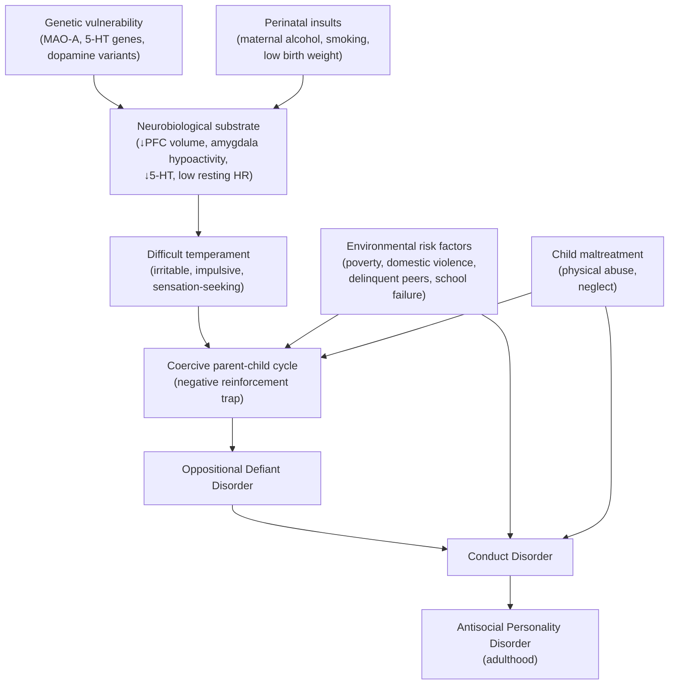

## 1. Definition

Oppositional-defiant disorder (ODD) and conduct disorder (CD) are two closely related **externalizing psychiatric disorders** of childhood and adolescence, characterised by ***dissocial, aggressive, defiant conduct that is outside of socially acceptable norms*** [1][2].

Let's break this down:

- **"Externalizing"** = the pathological behaviour is directed outwards — towards other people and the environment. This is the key distinction from "internalizing" disorders (anxiety, depression) where the patient themselves suffers most. In externalizing disorders, ***people around suffer*** [2].
- **ODD** = *"oppositional"* (against) + *"defiant"* (refusing to obey). A persistent pattern of **angry/irritable mood**, **argumentative/defiant behaviour**, and **vindictiveness** towards authority figures. The behaviour is annoying and disruptive, but does **not** cross the line into serious criminal or rights-violating acts [1][2].
- **CD** = *"conduct"* (behaviour). A repetitive and persistent pattern of behaviour in which the **basic rights of others** or **major age-appropriate societal norms/rules** are violated — including aggression, destruction of property, deceitfulness/theft, and serious rule violations [1][2].

<Callout title="The Key Conceptual Distinction">
Think of ODD and CD on a **spectrum of severity**. ODD is the "milder" end — the child is angry, argumentative, and defiant, but doesn't commit crimes or seriously violate others' rights. CD is the "severe" end — the child fights, steals, destroys property, is truant, sets fires, and may commit criminal acts. ***ODD is often the developmental precursor of CD*** [1][2], meaning many children with CD started with ODD first.
</Callout>

---

## 2. Epidemiology

### Prevalence
- **ODD**: Prevalence estimates range from **2–11%** in community samples, with most studies converging around **3–5%**. It is one of the most common reasons for referral to child and adolescent mental health services (CAMHS).
- **CD**: Prevalence approximately **2–10%**, often quoted around **5–6%** in school-age children.
- Both are **more common in males** (M:F approximately 2–3:1 for ODD; 3–4:1 for CD), although the gender gap narrows in adolescence.

### Age of Onset
- ***ODD: usually appears during preschool years*** [1]. Symptoms are often evident by age 3–5 years.
- ***CD: emerges in mid-childhood to mid-adolescence*** [1]. DSM-5 distinguishes childhood-onset ( < 10 years) from adolescent-onset ( ≥ 10 years) — this distinction has major prognostic implications (discussed below).

### Comorbidities
ODD and CD rarely exist in isolation. Comorbidity is the rule, not the exception:

- ***ADHD***: The single most important comorbid condition. ~40% of children with ADHD have comorbid ODD, ~20% have comorbid CD [2]. The overlap is so common that you must **always** screen for ADHD when you diagnose ODD/CD, and vice versa.
- **Mood disorders**: Depression (~20%), bipolar disorder — youth depression may present with irritability and behavioural problems [2][3].
- **Anxiety disorders**: ~25% comorbid [2].
- **Substance abuse**: Especially in adolescents with CD (~15%) [2].
- **Learning disorders**: ~25% [2]. Academic failure both contributes to and results from conduct problems.
- **Specific developmental disorders**: Language delay, reading difficulties — these children get frustrated in school and act out.

> **High Yield**: The differential table from senior notes is critical — ADHD, ODD/CD, GAD, depression, and mania share overlapping features (restlessness, poor concentration, irritability). The distinguishing feature of ODD/CD is the **absence of hyperactivity/motor overactivity** as a core feature, and the **presence of irritability and defiance** as the primary presenting complaint [2].

| Feature | ADHD | ODD/CD | GAD | Depression | Mania |
|---|---|---|---|---|---|
| Restlessness | ✓ | | ✓ | | |
| Poor concentration | ✓ | | ✓ | ✓ | ✓ |
| ↑ Motor activity | ✓ | | | | ✓ |
| Distractibility | ✓ | | ✓ | | ✓ |
| **Irritability** | | **✓** | ✓ | ✓ | ✓ |

---

## 3. Anatomy and Function (Neurobiology)

Understanding the neurobiology is crucial because it explains **why** these children behave the way they do — it is not simply "bad parenting" or "bad children."

### 3.1 Prefrontal Cortex (PFC) — The "Brake System"
- The **ventromedial PFC (vmPFC)** and **orbitofrontal cortex (OFC)** are responsible for **impulse control, decision-making, evaluation of consequences, and emotional regulation**.
- In children with ODD/CD, neuroimaging studies show **reduced grey matter volume and cortical thickness** in the PFC [2].
- **Why this matters**: If your "brake system" is underdeveloped, you cannot inhibit impulsive aggressive responses. When told "no," the child cannot regulate the frustration → outburst.

### 3.2 Amygdala — The "Threat Detector"
- The **amygdala** processes emotional stimuli, particularly **fear and threat detection**.
- In CD, especially the subtype with **callous-unemotional (CU) traits**, there is **amygdala hypoactivity** — these children show reduced response to fearful facial expressions and distress cues in others.
- **Why this matters**: Normal empathy requires recognising another person's distress. If your amygdala doesn't "fire" when you see someone in pain, you don't feel the normal inhibition against causing that pain → cruelty, bullying, aggression without remorse.

### 3.3 The HPA Axis — Stress Response System
- The **hypothalamic-pituitary-adrenal (HPA)** axis regulates cortisol (the stress hormone).
- Children with CD (especially those with CU traits) show **blunted cortisol responses** to stress — they are physiologically under-aroused.
- **Why this matters**: Low cortisol = low anxiety = **low fear of punishment**. These children are not deterred by consequences the way typically-developing children are. This explains why simple punishment-based approaches often fail.

### 3.4 Serotonin (5-HT) System
- **Low serotonergic activity** is consistently associated with **impulsive aggression** across species (from rodents to humans).
- Low CSF 5-HIAA (the main serotonin metabolite) correlates with aggressive, impulsive behaviour.
- **Why this matters**: Serotonin acts as a "behavioural brake" — it modulates impulsivity. Deficient 5-HT → reduced impulse control → reactive aggression.

### 3.5 Dopamine and Reward Circuits
- The **mesolimbic dopamine pathway** (ventral tegmental area → nucleus accumbens) mediates reward and motivation.
- Dysfunction in reward processing may explain why these children are excessively driven by **immediate rewards** and insensitive to **delayed consequences** — the classic "marshmallow test" failure.

### 3.6 Autonomic Nervous System
- Children with CD show **lower resting heart rate** — one of the most replicated biological findings in the field.
- **Why this matters**: Low resting heart rate indicates **autonomic under-arousal**. This creates an unpleasant state of boredom/restlessness, driving **sensation-seeking behaviour** (risk-taking, aggression, rule-breaking) as a form of self-stimulation.

---

## 4. Aetiology

The aetiology is best understood through the ***biopsychosocial model*** — ***multiple, inter-related risk factors*** [1] operate at the individual, family, and broader environmental levels.

<Callout title="The Big Picture" type="idea">
No single factor causes ODD/CD. It's always a **gene–environment interaction**. A child with genetic vulnerability + adverse parenting + poor neighbourhood + school failure = high risk. Remove one or more of those risk factors, and the trajectory can change. This is why management must be **multimodal**.
</Callout>

### 4.1 Individual-Level Influences

#### 4.1.1 Genetics

***Strong genetic contribution in certain subtypes of ODD/CD*** [1]:

- ***There is a highly heritable trait of liability to externalizing disorders (ODD, CD, ADHD)*** [1]. Twin studies show heritability of antisocial behaviour at approximately **40–70%**, with MZ concordance > DZ concordance.
- ***Mechanism: dependent on other factors*** [1]:
  - ***Genetic contribution is higher for antisocial behaviour in the presence of inattention and hyperactivity, callous-unemotional traits, or high levels of aggression*** [1].
  - This means genes don't operate in a vacuum — they interact with the phenotype. A child with genetic risk who *also* has ADHD or CU traits is at much higher risk than a child with genetic risk alone.
- ***Implicated genes***: The most well-studied is the ***MAO-A gene variant***, which ***predisposes to CD only when combined with adverse factors in the child's environment*** [1].
  - **MAO-A** = Monoamine Oxidase A, an enzyme that breaks down serotonin, noradrenaline, and dopamine.
  - The **low-activity MAOA variant** results in less efficient monoamine degradation → altered neurotransmitter signalling.
  - But here's the key: this gene only leads to CD when the child has experienced **maltreatment**. This is the classic **gene × environment (G×E) interaction** demonstrated by Caspi et al. (2002) — one of the most replicated findings in psychiatric genetics.

#### 4.1.2 Pregnancy and Perinatal Complications

***Maternal alcoholism is associated with CD (?due to effect on IQ)*** [1]:
- Fetal alcohol spectrum disorder (FASD) causes frontal lobe damage → impaired executive function → impulsivity and poor judgement.
- Maternal smoking during pregnancy → nicotine exposure → altered dopaminergic development → increased risk of externalizing behaviour.
- ***Low birth weight and prematurity*** [2] are associated with neurodevelopmental vulnerability.

#### 4.1.3 Temperament

***Difficult temperament*** [1] — measured as early as infancy:
- Babies who are **irritable, hard to soothe, have irregular biological rhythms**, and respond negatively to novelty ("difficult temperament" per Thomas & Chess) are at higher risk of later ODD.
- **Why?** Difficult temperament strains the parent-child relationship → parent becomes frustrated/harsh → child escalates → coercive cycle begins.

***Low IQ and neurocognitive deficits*** [1]:
- Children with lower IQ (especially verbal IQ) have difficulty understanding rules, expressing emotions verbally, and problem-solving → resort to physical aggression.
- ***Signs suggestive of neurodevelopmental impairment/delay, e.g. clumsiness, language delay, abnormalities of speech*** [2] — these may result from early developmental insults and increase risk.

***Callous-unemotional (CU) traits*** [1]:
- A subset of children with CD show a distinctive profile: **lack of empathy, absence of guilt, shallow affect, lack of concern about performance**.
- These traits are **highly heritable** and associated with **amygdala hypoactivity** (as discussed above).
- CU traits identify a particularly severe and **treatment-resistant** subgroup — DSM-5 specifies this as the "with limited prosocial emotions" specifier.

### 4.2 Family-Level Influences

#### 4.2.1 Child-Rearing Practices and Attachment

***Quality of parenting is among the strongest predictors of antisocial behaviour*** [1].

***Suboptimal parenting practices***: ***harsh inconsistent discipline, low warmth and involvement, high criticism → associated with ODD/CD*** [1].

<Callout title="The 'Coercive Process' — Gerald Patterson's Model">

This is one of the most important concepts in understanding ODD. It's a ***form of negative reinforcement trap leading to tantrums*** [1].

The ***ABC of operant learning theory: Antecedents → Behaviour → Consequences*** [1]:

**Example 1** [1]:
- **A**: Child asked for toys in shop
- **B**: Child whined after being refused
- **C**: Toys bought (parent gives in)

**Example 2** [1]:
- **A**: Child asked to tidy up toys
- **B**: Child whined "No I will not do it!"
- **C**: Mother tidied up for child

***Consequences: parents respond to mildly oppositional behaviour with a prohibition → child escalates until parent backs off → child taught that becoming more aggressive will allow him to get his way*** [1].

This is **negative reinforcement** (not positive reinforcement): the child's unpleasant behaviour is rewarded by the **removal** of something aversive (the demand to tidy up, the refusal of the toy). Both parties are "trained" — the parent learns to give in (their aversive experience of the tantrum stops), and the child learns to escalate.
</Callout>

***Insecure attachment, especially of the disorganized type, is strongly associated with antisocial behaviour*** [1].
- **Disorganized attachment** (Type D) arises when the attachment figure is simultaneously the source of comfort *and* the source of fear (e.g., an abusive parent). The child has no coherent strategy for managing distress → dysregulated emotional responses → aggression.

#### 4.2.2 Baumrind's Parenting Styles

***Baumrind's parenting styles*** [1] are directly relevant to understanding risk:

| Style | Warmth | Control | Outcome |
|---|---|---|---|
| **Authoritative** (ideal) | High | High (firm but fair) | Best outcomes — prosocial, self-regulated |
| **Authoritarian** | Low | High (harsh, rigid) | Obedient but resentful; risk of rebellion |
| **Permissive** | High | Low | Poor self-regulation; entitled |
| **Neglecting** | Low | Low | Worst outcomes — highest risk of CD |

***During interview: get an impression of how difficult is the child and how good is the parenting*** [1]:
- ***Overall compliance to parents' commands: % compliance — usually 70–80% (50% bad, 90% good)*** [1]
- ***Non-compliance: usually on what aspect? How do you handle it?*** [1]
- ***Find out how the parent gives commands → can be trained to give better commands*** [1]
- ***Temper: Worst temper/outburst? How severe or frequent is it? How do parents cope? Current situation*** [1]

#### 4.2.3 Child Maltreatment and Domestic Violence

***Physical abuse: conduct problems → corporal punishment → ↑ risk of later CD*** [1]:
- This creates a vicious cycle. The child's behaviour is difficult → parent resorts to physical punishment → child learns that aggression is an acceptable way to solve problems → more aggression → more punishment.

***Domestic violence between adults → ↑ likelihood of becoming aggressive*** [1]:
- Children who witness inter-parental violence learn through **social learning/modelling** (Bandura) that aggression is a normal way to resolve conflict.

#### 4.2.4 Parental Psychopathology

***Parental criminality*** is one of the strongest family-level predictors [1]:
- Operates through both genetic transmission (heritable impulsivity, antisocial traits) and environmental modelling.
- Parental substance abuse, parental antisocial personality disorder, and maternal depression all increase risk.

### 4.3 Influences Beyond the Family

***Factors in the wider environment*** that predict poor outcome [1]:

- **Peer influences**: Association with delinquent peers is one of the strongest predictors of adolescent-onset CD. "Deviancy training" occurs when antisocial adolescents reinforce each other's deviant behaviour.
- **School factors**: Academic failure, school exclusion, lack of positive school engagement. Schools that are poorly organised, with inconsistent discipline, have higher rates of conduct problems.
- ***Economically deprived areas*** [1]: Neighbourhood-level poverty, high crime rates, lack of community resources, social disorganisation — all increase risk through multiple pathways (stress, modelling, limited opportunities).
- **Media/technology**: Exposure to violent media may contribute, though the effect size is small.

### 4.4 Hong Kong Context

In Hong Kong, several aetiological factors deserve particular attention:

- **Academic pressure**: The extremely competitive education system in HK means academic failure is particularly stigmatising and psychologically damaging. Children with unrecognised ADHD or learning difficulties who repeatedly fail may develop ODD/CD as a reaction to chronic frustration.
- **Small living spaces**: Overcrowded housing (e.g., subdivided flats) means family conflict is amplified and there is little physical space for "cooling off."
- **Domestic helpers**: Some families delegate child-rearing to domestic helpers who may have limited authority → inconsistent discipline.
- **Cross-border families**: Children of cross-border families (where one parent works in mainland China) may experience disrupted attachment and inconsistent parenting.
- **Gang involvement (triad influence)**: In some communities, adolescents may be recruited into triad-associated activities, which reinforces antisocial behaviour.
- **Internet and gaming**: Hong Kong has high rates of internet gaming disorder among youth, which may co-occur with CD and contribute to truancy.

---

## 5. Pathophysiology — An Integrated Model

Pulling the neurobiology and aetiology together:

The **developmental trajectory** is:
1. **Infancy**: Difficult temperament (genetic + perinatal)
2. **Toddler/preschool**: ODD emerges (coercive cycles + parenting difficulties)
3. **School age**: ODD may progress to CD if risk factors accumulate (school failure, peer rejection → delinquent peer group)
4. **Adolescence**: CD worsens (substance use, criminal behaviour, truancy)
5. **Adulthood**: ~40% of early-onset CD → antisocial personality disorder [1]

---

## 6. Classification

### 6.1 ICD-10 Classification

***ODD is classified as a subtype of CD in which the severity is less*** [1]. Under ICD-10 (F91):

| Code | Subtype | Description |
|---|---|---|
| **F91.0** | ***CD confined to family context*** | Antisocial behaviour restricted to home/family interactions |
| **F91.1** | ***Unsocialized CD*** | Aggressive, dissocial behaviour in a child who is rejected by peers and has no close friendships |
| **F91.2** | ***Socialized CD*** | Conduct problems in a child who is well-integrated into a peer group (often a delinquent peer group) |
| **F91.3** | ***Oppositional defiant disorder*** | Persistently negativistic, defiant behaviour without serious rights violations |
| **F91.8** | ***Other CD*** | |
| **F91.9** | ***CD unspecified*** | |
| **F92** | ***Mixed disorders of conduct and emotions*** | When CD co-occurs with significant emotional disturbance (depression, anxiety) |

### 6.2 ICD-11 Classification (Current)

ICD-11 (adopted by WHO, increasingly used) has reorganised these conditions:

- **6C90**: Oppositional Defiant Disorder
- **6C91**: Conduct-Dissocial Disorder
  - 6C91.0: Childhood onset
  - 6C91.1: Adolescent onset
  - 6C91.Z: Onset unspecified

ICD-11 now recognises ODD as a **separate disorder** from CD (rather than a subtype), aligning with DSM-5.

### 6.3 DSM-5 Classification

***ODD and CD are coded as separate disorders under the group "Disruptive, Impulse-Control and Conduct Disorders"*** [1].

***It was noted that under this group, CD and Intermittent Explosive Disorder represent the two extremes of impaired self-control of behaviour and emotions respectively, and ODD is somewhat intermediate between the two*** [1].

Think of it this way:
- **Intermittent Explosive Disorder (IED)**: Primarily a problem of **emotional dysregulation** → explosive outbursts disproportionate to provocation
- **ODD**: Mixed — **both emotional dysregulation AND behavioural defiance**
- **CD**: Primarily a problem of **behavioural self-control** → persistent rule-violation and rights-violation

DSM-5 subtypes for **CD**:
- **Childhood-onset type**: ≥ 1 symptom characteristic of CD prior to age 10 years
- **Adolescent-onset type**: No symptoms before age 10 years
- **Unspecified onset**

DSM-5 specifier for **CD**:
- ***With limited prosocial emotions*** (CU traits) — requires ≥ 2 of: lack of remorse/guilt, callous-lack of empathy, unconcerned about performance, shallow/deficient affect
- ***Specify: mild, moderate, severe*** [1]

DSM-5 severity specifiers for **ODD**:
- ***Mild: confined to only 1 setting*** [1]
- ***Moderate: present in ≥ 2 settings*** [1]
- ***Severe: present in ≥ 3 settings*** [1]

<Callout title="ICD-10 vs DSM-5: Key Differences" type="idea">

| Feature | ICD-10 | DSM-5 |
|---|---|---|
| ODD classification | Subtype of CD | Separate disorder |
| Emphasis on emotional dysregulation | Less emphasis | ***More problems of emotional dysregulation under DSM-5*** (irritability, tantrums) [1] |
| CU traits specifier | Not included | "With limited prosocial emotions" specifier |
| Age cutoff for onset | Not specified | Childhood-onset < 10y vs adolescent-onset ≥ 10y |
</Callout>

---

## 7. Clinical Features

### 7.1 Clinical Assessment Approach

***During interview*** [1], you should systematically assess:

1. ***Symptom-screening: ODD S/S first → screen CD S/S if ODD S/S present*** [1]
   - This is the correct screening hierarchy: start with the milder condition, then escalate.

2. Assessment of parenting:
   - ***Overall compliance to parents' commands*** [1]
   - ***% compliance: usually 70–80% (50% bad, 90% good)*** [1]
   - ***Non-compliance: usually on what aspect? How do you handle it?*** [1]
   - ***Find out how the parent gives commands → can be trained to give better commands*** [1]

3. Assessment of temperament:
   - ***Temper: Worst temper/outburst? How severe or frequent is it? How do parents cope? Current situation*** [1]

4. ***Get an impression of how difficult is the child and how good is the parenting*** [1] — this dual assessment is key because treatment targets both.

### 7.2 ODD — Symptoms and Signs (with Pathophysiological Basis)

The DSM-5 organises ODD symptoms into **three clusters** [1]:

#### Cluster 1: Angry/Irritable Mood (Emotional Dysregulation)

| Symptom | Description | Pathophysiological Basis |
|---|---|---|
| ***Often loses temper*** [1] | Frequent tantrums, explosive outbursts disproportionate to the provocation | Deficient **prefrontal cortical inhibition** of amygdala-driven emotional responses. The "top-down" braking mechanism is immature/impaired → emotional stimuli trigger unmodulated rage. Low serotonergic tone further reduces the threshold for impulsive emotional reactions. |
| ***Is often touchy or easily annoyed*** [1] | Low threshold for irritation; minor frustrations provoke disproportionate anger | **Amygdala hyperreactivity** to perceived threats/frustrations combined with poor PFC regulation. These children interpret neutral stimuli as threatening (**hostile attribution bias** — see below). |
| ***Is often angry or resentful*** [1] | Persistent negative affective state; carries grudges | Chronic **HPA axis dysregulation** with altered cortisol patterns. Insecure attachment → internal working model of the world as hostile and untrustworthy → persistent anger. |

**Hostile Attribution Bias**: This is a critical cognitive distortion in ODD/CD. When presented with ambiguous social situations (e.g., another child accidentally bumps into them), these children systematically **interpret the other's intent as hostile** ("He did that on purpose!"). This leads to retaliatory aggression that appears unprovoked to observers but feels justified to the child. It arises from:
- Amygdala hyperreactivity (threat overdetection)
- Poor vmPFC modulation (failure to reappraise)
- Learning from an environment where aggression was indeed common (domestic violence)

#### Cluster 2: Argumentative/Defiant Behaviour

| Symptom | Description | Pathophysiological Basis |
|---|---|---|
| ***Often argues with authority figures*** [1] | Persistent verbal opposition to adults/parents/teachers | Reflects **impaired executive inhibition** — the child cannot suppress the urge to challenge. Also reflects **learned coercive patterns** (Patterson's model): arguing has previously been reinforced because adults eventually backed down. |
| ***Often actively defies or refuses to comply with requests from authority figures or with rules*** [1] | Won't do homework, chores, follow instructions | The **coercive cycle** has taught the child that defiance works (negative reinforcement). Additionally, children with low verbal IQ may genuinely struggle to understand complex instructions → refuse rather than admit confusion. |
| ***Often deliberately annoys others*** [1] | Intentionally provocative behaviour | Serves multiple functions: attention-seeking (any attention, even negative, is reinforcing for an emotionally neglected child), sensation-seeking (low autonomic arousal → the excitement of conflict is stimulating), and assertion of control. |
| ***Often blames others for his or her mistakes or misbehaviour*** [1] | Externalises responsibility | Reflects both **hostile attribution bias** (it really *is* someone else's fault in the child's perception) and **immature ego defences** (projection, externalisation). Poor metacognitive abilities prevent self-reflection. |

#### Cluster 3: Vindictiveness

| Symptom | Description | Pathophysiological Basis |
|---|---|---|
| ***Has been spiteful or vindictive at least twice within the past 6 months*** [1] | Deliberately retaliatory; seeks revenge; holds grudges | This is the most concerning cluster as it predicts progression to CD. Reflects a combination of hostile attribution bias, poor empathy (mild CU traits), and the learned belief that retaliation is necessary for self-protection (modelled from an aggressive home environment). |

<Callout title="Important Note on ODD Symptoms" type="error">
***Frequently, this behaviour is most evident in interactions with adults or peers whom the child knows well, and signs of the disorder may not be evident during a clinical interview*** [1]. This is a classic exam pitfall — a child with ODD may be perfectly well-behaved in front of the doctor! You MUST obtain collateral history from parents, teachers, and caregivers. The child's behaviour in a brief, novel clinic setting is NOT representative.
</Callout>

### 7.3 CD — Symptoms and Signs (with Pathophysiological Basis)

CD symptoms are organised into **four clusters** representing increasingly severe norm-violating behaviour [1][2]:

#### Cluster 1: Aggression to People and Animals

| Symptom | Pathophysiological Basis |
|---|---|
| ***Excessive levels of fighting or bullying*** [1] | **Reactive aggression**: amygdala hyperactivity + poor PFC inhibition → "hot" impulsive violence. **Proactive aggression**: (in CU-trait subtype) amygdala hypoactivity → lack of empathic inhibition → "cold" instrumental violence used to achieve goals. Low serotonin facilitates both types. |
| Often initiates physical fights | As above. Additionally, low resting heart rate → sensation-seeking → fighting provides autonomic stimulation. |
| Has used a weapon that can cause serious physical harm (e.g., bat, brick, knife, gun) | Escalation from bare-handed aggression. Reflects increasing severity and desensitisation to violence. May be modelled from domestic violence or media exposure. |
| ***Cruelty to animals or other people*** [1] | **Callous-unemotional traits**: amygdala hypo-responsiveness to distress cues → no empathic braking. The child does not experience the vicarious distress that normally inhibits cruelty. This is a particularly ominous sign — strong predictor of later violent offending. |
| Has stolen while confronting a victim (e.g., mugging, purse-snatching, extortion, armed robbery) | Proactive instrumental aggression — using force to obtain desired objects. Reflects both low empathy and poor evaluation of consequences (PFC dysfunction). |
| Has forced someone into sexual activity | Most severe form of aggression. Associated with early-onset CD, CU traits, and often prior victimisation (sexual abuse). |

#### Cluster 2: Destruction of Property

| Symptom | Pathophysiological Basis |
|---|---|
| ***Fire-setting*** [1] | Fire-setting (pyromania-like behaviour) in CD reflects sensation-seeking (low autonomic arousal), poor impulse control (PFC dysfunction), and sometimes anger/revenge motivation. It is one of the **McDonald triad** findings (fire-setting, cruelty to animals, enuresis) historically associated with later violent offending. |
| ***Severe destructiveness to property*** [1] | May be reactive (rage-driven) or proactive (vandalism for excitement/peer approval). |

#### Cluster 3: Deceitfulness or Theft

| Symptom | Pathophysiological Basis |
|---|---|
| Has broken into someone else's house, building, or car | Poor evaluation of consequences + reward-seeking behaviour (dopaminergic drive for immediate gratification). |
| ***Repeated lying*** [1] (to obtain goods/favours or avoid obligations) | **Theory of mind** is actually intact — these children understand deception. But poor moral development (Kohlberg's pre-conventional level) + learned patterns from observing dishonesty in the family + reinforcement of lying (it works to avoid punishment). |
| ***Stealing*** [1] without confronting the victim (e.g., shoplifting, forgery) | Impulsive reward-seeking + failure to consider long-term consequences. |

#### Cluster 4: Serious Violations of Rules

| Symptom | Pathophysiological Basis |
|---|---|
| ***Staying out at night*** [1] despite parental prohibitions (beginning before age 13) | Reflects both defiance of authority (ODD component) and peer influence (delinquent peer group reinforces late-night activity). |
| ***Running away from home*** [1] overnight (at least twice) | May indicate: (1) escape from an abusive home environment, (2) association with delinquent peers, or (3) severe family relationship breakdown. |
| ***Truancy from school*** [1] (beginning before age 13) | **School avoidance** in CD is different from the anxiety-driven school refusal of internalizing disorders. In CD, the child skips school because it is boring/frustrating (low IQ, learning difficulties) or to engage in antisocial activities with peers. |

### 7.4 Clinical Presentation by Setting

***At home*** [1]:
- ***Stealing, lying, disobedience with verbal/physical aggression towards siblings or adults, running away from home***
- Destruction of family property
- Persistent defiance of parental rules

***At school*** [1]:
- ***Truancy, delinquency, vandalism, reckless behaviour, bullying of others***
- Classroom disruption, refusal to follow teacher instructions
- Academic underperformance (often secondary to ADHD or learning difficulties)

***Criminal behaviour*** [1]:
- ***Theft, robbery, arson, sexual assaults, criminal damage***
- Drug use and dealing
- Gang involvement

### 7.5 Important Signs on Examination

While there are no pathognomonic physical signs, look for:

- **Physical signs of substance abuse**: Injection marks, dilated/constricted pupils, smell of cannabis/alcohol
- **Injuries**: Signs of fighting (bruises, scars), signs of self-harm
- **Signs of abuse/neglect**: Unexplained injuries in unusual locations, poor hygiene, malnutrition (important to screen — the child may be both a perpetrator AND a victim)
- **Neurodevelopmental signs**: Clumsiness, speech abnormalities, signs of FASD (smooth philtrum, thin upper lip, short palpebral fissures)
- **Mental state examination**:
  - Affect: angry, hostile, suspicious, or (in CU-trait subtype) superficially charming but flat affect
  - Attitude: uncooperative, provocative, or deceptively compliant
  - Insight: typically poor — externalises blame

### 7.6 Paediatric History-Taking Considerations

From the ***CFB (PAE01) Paediatric history taking*** [4] perspective, when assessing a child with suspected ODD/CD:

- ***Birth and perinatal history***: Ask about maternal substance use during pregnancy, birth complications, prematurity, low birth weight — these are risk factors.
- ***Developmental history***: Milestones (especially language and motor delays), any neurodevelopmental concerns.
- ***Temperament from infancy***: Was the child "easy" or "difficult"? Colic, sleep problems, feeding difficulties?
- ***Family history***: Psychiatric disorders in parents (especially antisocial personality disorder, substance abuse, depression), criminal history.
- ***Social history***: Parenting style assessment, domestic violence, housing conditions, financial stress, school performance, peer relationships, involvement with social services or police.
- ***Screen for comorbidities***: ADHD (hyperactivity/inattention), mood disorders (sadness/irritability), anxiety, substance use, learning difficulties.

---

## 8. Course and Prognosis

### 8.1 ODD Course

- ***Onset: usually appears during preschool years*** [1]
- ***Often precedes development of CD, especially those with defiant, argumentative and vindictive behaviour*** [1]
- ***↑ Risk of adjustment problems in adulthood, e.g. antisocial behaviour, impulse-control problems, substance abuse, anxiety, depression*** [1]
- Not all children with ODD progress to CD — approximately **30%** eventually develop CD, while many others develop internalizing disorders (anxiety, depression) instead.

### 8.2 CD Course

- ***Onset: emerges mid-childhood to mid-adolescence*** [1]
- ***Variable course after development, with progressively severe conduct problems in some individuals (e.g., theft → rape, robbery)*** [1]
- ***Some will show antisocial personality disorder, e.g. violent offending, heavy drug usage, teenage pregnancy, inability to graduate*** [1]
- ***Prognosis is worse for early-onset cases (antisocial behaviour in 40% early-onset cases and only 20% in adolescent-onset cases)*** [1]

### 8.3 Factors That Predict Poor Outcome [1]

| Domain | Factors |
|---|---|
| **In the young person** | Early onset, severe antisocial behaviour, ADHD comorbidity, callous-unemotional traits, low IQ, substance use |
| **In the family** | ***Parental criminality***, parental substance abuse, harsh/inconsistent discipline, domestic violence, large family size |
| **In the wider environment** | ***Economically deprived areas***, delinquent peer group, school exclusion, lack of community resources |

<Callout title="Childhood-Onset vs Adolescent-Onset CD" type="idea">
This is a **high-yield** distinction:

**Childhood-onset CD** ( < 10 years):
- More likely male
- More often have CU traits
- More neurobiological basis (lower IQ, neurodevelopmental issues)
- More ADHD comorbidity
- More persistent — **40% develop ASPD**
- Worse prognosis

**Adolescent-onset CD** ( ≥ 10 years):
- More gender-balanced
- More influenced by peer factors and social context
- Less neurobiological abnormality
- Often desists in adulthood — only **20% develop ASPD**
- Better prognosis
</Callout>

---

## 9. Key Differentials (Brief Overview — Detailed DDx in Next Section)

***Differential diagnosis*** [1]:

| Condition | Distinguishing Feature |
|---|---|
| ***ADHD*** | ***Often comorbid with ODD. Should distinguish whether failure to conform is merely limited to situations that demand sustained mental effort or effort or demand that the individual sits still*** [1]. ***Behaviour does not violate societal norms or rights of others*** [1]. |
| ***Depressive/Bipolar disorder*** | ***Negative affect and irritability only occurs in the context of a mood episode*** [1]. ***Childhood depression may be associated with irritability, aggression and conduct problems, but these behaviour are limited to mood episodes*** [1]. |
| ***Disruptive Mood Dysregulation Disorder (DMDD)*** | ***Irritability and temper outbursts are more severe*** [1] and more pervasive (present in 3+ settings). DMDD was created specifically to address the over-diagnosis of paediatric bipolar disorder. |
| ***Intellectual Disability (ID)*** | ***ODD only diagnosed when out of proportion when compared with other individuals of comparable mental age or ID severity*** [1]. |
| ***Adjustment Disorder*** | ***Only consider adjustment disorder if criteria for CD is not met, with clear association with psychosocial stressor (resolves ≤ 6 months of resolution of stressor)*** [1]. |

---

<Callout title="High Yield Summary">

1. **ODD and CD are externalizing disorders** — ODD features angry/irritable mood + argumentative defiance + vindictiveness; CD features serious violation of others' rights and societal norms.

2. **ODD is the developmental precursor of CD** — ODD → CD → Antisocial Personality Disorder (the "developmental trajectory").

3. **Aetiology is biopsychosocial**: Genetics (MAO-A G×E interaction, heritable externalizing liability) + neurobiology (↓PFC, amygdala dysfunction, ↓5-HT, low resting HR) + coercive parenting cycles (Patterson's negative reinforcement trap) + broader environmental adversity.

4. **Callous-unemotional (CU) traits** identify a severe, treatment-resistant subtype of CD with amygdala hypoactivity and poor empathic response (DSM-5 "with limited prosocial emotions" specifier).

5. **Childhood-onset CD has worse prognosis** (40% → ASPD) vs adolescent-onset (20% → ASPD).

6. **Always screen for ADHD** when ODD/CD is present — ~40% comorbidity.

7. **ODD may not be evident in clinic** — obtain collateral history from parents and teachers.

8. **The coercive cycle (Patterson)** is the key psychological mechanism: child defiance → parent gives in → negative reinforcement → escalation.

9. **Assessment should evaluate both child difficulty AND parenting quality** — management must target both.

10. **DSM-5 classifies ODD and CD as separate disorders**; ICD-10 classified ODD as a subtype of CD.
</Callout>

---

<ActiveRecallQuiz
  title="Active Recall - ODD and CD: Definition to Clinical Features"
  items={[
    {
      question: "Explain Patterson's coercive process in ODD using the ABC framework of operant learning. Why does the child's behaviour escalate over time?",
      markscheme: "Antecedent (parent makes demand) - Behaviour (child whines/defies) - Consequence (parent backs down). This is negative reinforcement: the aversive demand is removed, reinforcing the child's oppositional behaviour. The child learns that escalating aggression leads to getting their way. Both parties are trained - parent learns to give in to stop tantrums, child learns louder tantrum = success."
    },
    {
      question: "Name the three DSM-5 symptom clusters of ODD and give one example symptom from each.",
      markscheme: "(1) Angry/irritable mood - e.g. often loses temper, touchy/easily annoyed, angry/resentful. (2) Argumentative/defiant behaviour - e.g. argues with authority, defies rules, deliberately annoys others, blames others. (3) Vindictiveness - spiteful/vindictive at least twice in past 6 months."
    },
    {
      question: "What is the significance of the MAO-A gene variant in the aetiology of conduct disorder?",
      markscheme: "The low-activity MAO-A gene variant predisposes to CD ONLY when combined with adverse environmental factors (e.g. child maltreatment). This is a classic gene-environment interaction (Caspi et al. 2002). MAO-A is monoamine oxidase A which degrades serotonin, noradrenaline and dopamine. Low activity variant leads to altered monoamine signalling but only manifests as CD with environmental adversity."
    },
    {
      question: "Distinguish childhood-onset from adolescent-onset conduct disorder in terms of onset age, gender, neurobiological features, and prognosis.",
      markscheme: "Childhood-onset: before age 10, predominantly male, more neurodevelopmental abnormalities (lower IQ, CU traits, ADHD comorbidity), worse prognosis (40% develop ASPD). Adolescent-onset: age 10 or later, more gender-balanced, more peer-influenced, fewer neurobiological abnormalities, better prognosis (only 20% develop ASPD)."
    },
    {
      question: "Why might a child with ODD appear completely normal during a clinic consultation? What should you do?",
      markscheme: "ODD behaviour is most evident with adults/peers the child knows well and may not be apparent in a novel clinical setting. Must obtain COLLATERAL HISTORY from parents, teachers, caregivers. Cannot rely on in-clinic observation alone. Also assess parenting style, compliance rates, and temper outbursts history."
    },
    {
      question: "Explain the neurobiology of callous-unemotional traits in conduct disorder. Why are these children cruel without remorse?",
      markscheme: "CU traits are associated with amygdala hypoactivity - reduced neural response to others' fearful faces and distress cues. Normal empathy requires recognising another's distress (amygdala function). If the amygdala does not fire in response to victim distress, the normal inhibition against causing harm is absent. Also show blunted cortisol/HPA axis response (low anxiety, low fear of punishment) and shallow affect. Highly heritable. DSM-5 specifier: with limited prosocial emotions."
    }
  ]}
/>

## References

[1] Senior notes: ryanho-psych.md (Section 12.4 Oppositional-defiant and Conduct Disorders, pp. 264–271)
[2] Senior notes: ryanho-psych.md (Sections 12.1.2, 12.3 ADHD overview tables)
[3] Lecture slides: GC 164. I am depressed Mood disorders.pdf
[4] Lecture slides: CFB (PAE01) Paediatric history taking.pdf
