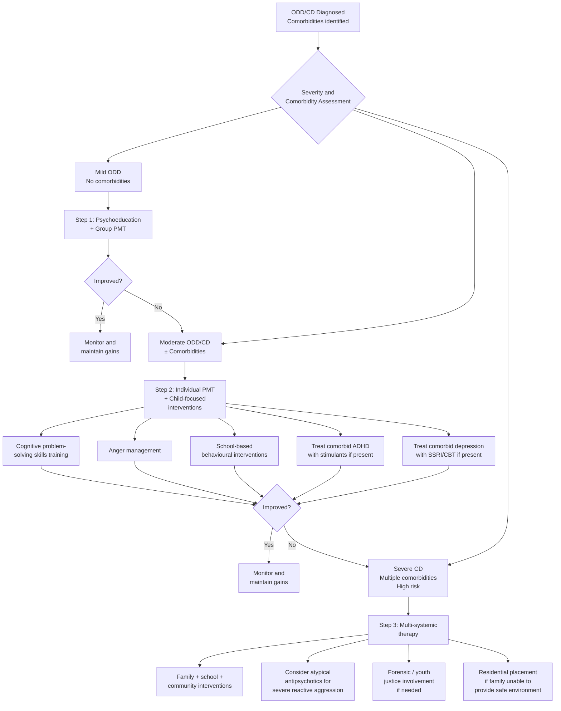

## Management of ODD and CD

### Guiding Principles

The management of ODD/CD follows several fundamental principles that distinguish it from most other medical conditions. Understanding these principles is essential before diving into specific treatments.

**Principle 1: Psychosocial treatment is the mainstay** [1]

***For pure ODD without comorbid CD, ASD, ADHD, the issue often lies within the family. Psychosocial Tx is therefore indicated, not medication*** [1]. This is the single most important management concept. Unlike ADHD (where medications are highly effective, with effect sizes of ~1.0 [1]), there is **no medication that directly treats ODD or CD**. Medications are only used for comorbidities or specific symptom targets (e.g., severe reactive aggression).

**Why?** Because ODD/CD is fundamentally a **learned pattern of interaction** between the child and their environment, maintained by reinforcement contingencies (Patterson's coercive cycle). You cannot prescribe a pill to fix a coercive parent-child interaction pattern. You must retrain the interaction pattern itself.

**Principle 2: Multimodal, multi-systemic approach**

The child exists within multiple systems — family, school, peer group, community. Effective treatment must target **all** relevant systems, not just the child in isolation. A child who receives anger management therapy but returns to a home with harsh inconsistent parenting and a neighbourhood with delinquent peers will not improve.

**Principle 3: Treat comorbidities**

***Treatment of any comorbid disorders, e.g. ADHD, depression*** [1]. Comorbid ADHD is present in ~40% of ODD cases — treating the ADHD with stimulants often dramatically reduces the oppositional behaviour because much of the "defiance" was actually driven by impulsivity and executive dysfunction. Treating comorbid depression may resolve irritability-driven aggression.

**Principle 4: Earlier intervention = better outcome**

***Prognosis is worse for early-onset cases*** [1]. Paradoxically, early-onset cases have worse prognosis BUT are also the most amenable to treatment — because the coercive patterns are less entrenched, the child has not yet been recruited into delinquent peer groups, and the family system may still be modifiable.

---

### Management Algorithm

---

### Treatment Modalities — Detailed Breakdown

---

### A. Psychosocial Interventions (The Mainstay)

***Approach to Mx: psychosocial Tx as mainstay*** [1]

#### 1. Parent Management Training (PMT)

***Mainstay of treatment for ODD/CD by teaching parents specific techniques to alter parent-child interaction*** [1].

This is, without question, the most important treatment for ODD/CD. It is also the ***most effective behavioural therapy*** [1] for these conditions.

**Theoretical Basis:**

***Based on social learning theory (operant learning theory) and behavioural modification*** [1].

Let me explain this from first principles. Operant learning theory (B.F. Skinner) states that behaviour is shaped by its **consequences**:
- **Positive reinforcement**: Behaviour followed by a pleasant consequence → behaviour increases (e.g., child shares toys → parent praises → child shares more)
- **Negative reinforcement**: Behaviour followed by removal of an unpleasant stimulus → behaviour increases (e.g., child screams → parent removes demand → child learns screaming works — this is Patterson's coercive trap)
- **Positive punishment**: Behaviour followed by an unpleasant consequence → behaviour decreases (e.g., child hits sibling → loss of screen time)
- **Extinction**: Behaviour that is no longer reinforced → behaviour gradually decreases (e.g., child whines for attention → parent consistently ignores → whining reduces)

PMT teaches parents to **systematically restructure** these contingencies.

**Specific Strategies:**

***In particular, manage contingencies around child social behaviour*** [1]:

***Promote desired behaviour by attention and rewards ("catch your child being good")*** [1]:
- **Why this works**: Most parents of ODD children are trapped in a pattern of noticing only bad behaviour and ignoring good behaviour. The child learns that the only way to get parental attention is through misbehaviour (negative attention is better than no attention). By deliberately attending to and praising good behaviour, you shift the reinforcement contingencies.
- **Specific techniques**:
  - ***Reward system: offer reward for desirable behaviour → positive reinforcement*** [1]. This includes star charts, token economies, and tangible rewards.
  - **Labelled praise**: "I really like how you put your shoes away without being asked" (specific, not just "good boy") — the child learns exactly what behaviour is valued.
  - **Positive attending**: Describing what the child is doing well in real time ("You're building that tower really carefully") — provides warm attention without demands.

***Extinguish unwanted behaviour by selective ignoring, punishments (by withdrawal of privileges), time-out from any positive reinforcement*** [1]:

- ***Time-out from reinforcement = procedure in which a child is placed in a different setting whenever he or she engages in undesirable or inappropriate behaviours. It works by removal of any reinforcement (e.g. attention) from inappropriate behaviour*** [1].
  - **Why "time-out" works**: The child is temporarily removed from ALL sources of reinforcement (attention, toys, TV, siblings). This is NOT punishment in the traditional sense — it's the systematic removal of reinforcement. The key principle: time-out only works if "time-in" (normal time) is reinforcing. If the child's normal environment is neglectful and unrewarding, removing them to a boring room has no differential effect.
  - **Practical approach**: Brief (1 minute per year of age, typically 3–5 minutes maximum), consistent, calm. Parent should not engage in argument during time-out — any attention (even scolding) is reinforcing.

- ***Response cost system: withdrawing rewards or privileges when unwanted or problem behaviour occurs*** [1].
  - **Why this works**: This is a form of negative punishment (removing something pleasant). Example: child earns 10 stars for the week → breaks a rule → loses 2 stars. This is more effective than adding punishments because it preserves the reward framework while creating a tangible consequence.

- ***Behaviour modelling*** [1]:
  - Parents model appropriate behaviour — how to express frustration verbally, how to resolve conflict without aggression, how to take a "cool-down break" when angry.

***Aim is to foster nurturance with firm limits*** [1]:
- This is the **authoritative parenting style** (Baumrind) — high warmth + high structure. PMT essentially trains parents to shift from whatever their current style is (usually authoritarian, permissive, or neglecting) towards authoritative.

**Effectiveness and Indications:**
- PMT has the **strongest evidence base** of any intervention for ODD/CD.
- Most effective for **younger children** (preschool to mid-childhood) where parental influence is greatest.
- Requires parental engagement and attendance — a major limitation is that the most chaotic families who need it most are the least likely to attend consistently.
- Can be delivered in **group** format (cheaper, includes peer support) or **individual** format (more intensive, for complex cases).

**Specific PMT Programmes:**
- **Triple P (Positive Parenting Program)**: Multi-level programme ranging from universal prevention to intensive individual intervention. Widely used internationally including in Hong Kong.
- **Incredible Years (Webster-Stratton)**: Group-based PMT programme with strong evidence for 3–8 year olds. Includes video modelling of parent-child interactions.
- **Parent-Child Interaction Therapy (PCIT)**: Live-coached sessions where a therapist behind a one-way mirror gives the parent real-time earpiece coaching during interactions with the child. Very effective for younger children (2–7 years).

**Contraindications/Limitations:**
- Parental severe mental illness (psychosis, severe depression, active substance dependence) — parent cannot engage meaningfully.
- Active domestic violence — safety concerns take priority; behavioural approaches require a stable, safe environment.
- Parental intellectual disability — may need modified programmes.
- Older adolescents — parental influence diminishes; peer and community interventions become more important.

---

#### 2. Cognitive Problem-Solving Skills Training (CPSST)

***Use of structural activities to teach children step-by-step approach to solve interpersonal problems that previously provoked negative behaviour*** [1].

**Why this is needed**: Children with ODD/CD typically have deficits in social information processing. When faced with an interpersonal problem (e.g., another child takes their toy), they jump straight to aggression because they lack the cognitive skills to generate alternative solutions.

**How it works**: The child is taught a structured problem-solving sequence:
1. **Identify the problem** ("What happened?")
2. **Identify the feeling** ("How do I feel about this?")
3. **Generate alternative solutions** ("What are my options?")
4. **Evaluate consequences of each option** ("What would happen if I did X?")
5. **Choose the best option and implement it**
6. **Evaluate the outcome** ("Did it work?")

**Effectiveness**: ***Improvements shown. Short-term efficacy*** [1]. The evidence is positive but more limited than for PMT. Works best when combined with PMT (targeting both the child's skills and the parent's management simultaneously).

**Indication**: School-age children and adolescents with ODD/CD who have demonstrated social cognitive deficits.

**Limitation**: Requires a minimum cognitive/developmental level — not suitable for very young children or those with significant ID.

---

#### 3. Anger Management

***Aggressive individuals were shown to misperceive others' intention as hostile when it is not and tend to underestimate own level of aggressiveness*** [1].

This is the **hostile attribution bias** discussed in the aetiology section. Anger management directly targets this cognitive distortion.

***Seek to correct these ideas by teaching how to inhibit sudden inappropriate responses to angry feelings and reappraise intentions of other people*** [1].

**Techniques include**:
- **Cognitive restructuring**: Challenging hostile attributions ("Maybe he bumped into me by accident, not on purpose")
- **Arousal reduction**: Teaching physiological calming strategies (deep breathing, progressive muscle relaxation, counting to 10) — these work because they activate the parasympathetic nervous system, counteracting the sympathetic fight-or-flight response that drives reactive aggression
- **Self-monitoring**: Teaching the child to recognise their own anger cues (clenched fists, hot face, racing heart) before they escalate to aggression
- **Response inhibition**: "Stop and think" techniques — inserting a pause between the impulse and the action, allowing the prefrontal cortex time to engage

**Indication**: Children/adolescents with significant reactive aggression driven by hostile attribution bias and poor emotional regulation.

**Limitation**: Less effective for children with CU traits who show **proactive** (instrumental, cold) aggression — these children don't misperceive intent; they simply don't care. Their aggression is planned, not impulsive, so arousal-reduction techniques are less relevant.

---

#### 4. Multi-Systemic Therapy (MST)

***Amalgamation of individual, family and extra-family techniques targeting on risk factors*** [1].

***Involve interventions in family, school, community*** [1].

***Promising in severely impaired youths*** [1].

**Why MST is different**: Most therapies target one system (PMT targets the family; CPSST targets the child; school interventions target the classroom). MST recognises that severe CD involves **dysfunction across all systems simultaneously** — the family is chaotic, the school is failing the child, the peer group is delinquent, and the community is under-resourced. You must intervene at every level.

**How it works**:
- An MST therapist works with the **entire ecology** of the young person.
- Sessions take place in the family home, school, and community (not in a clinic).
- Available 24/7 for crisis support.
- Time-limited (typically 3–5 months).
- Targets **specific modifiable risk factors** identified through assessment:
  - Family: PMT-style parenting interventions, addressing parental substance use, improving family communication
  - Peer: Reducing contact with delinquent peers, promoting prosocial peer activities
  - School: Improving attendance, coordinating with teachers, academic support
  - Individual: Addressing substance use, cognitive skills, anger management

**Indication**: Severe CD with multi-system dysfunction; young people at risk of out-of-home placement (residential care, youth justice).

**Evidence**: Strong evidence from multiple RCTs showing reduced re-offending, reduced out-of-home placements, and improved family functioning.

**Contraindication**: Currently limited availability in Hong Kong; resource-intensive.

---

#### 5. School-Based Interventions

***Other school interventions to achieve behavioural management*** [1].

These are analogous to the ADHD classroom interventions described in the senior notes [1]:

- ***Ensure structured and predictable routines*** [1] — children with ODD/CD do worse in chaotic, unpredictable environments. Structure reduces the number of "flashpoints" for conflict.
- ***Employ cost-response token economy systems, e.g. star charts*** [1] — same principles as home-based reward/response cost systems.
- ***Use of daily report cards*** [1] — behaviour targets are set each morning; the child receives feedback throughout the day; the card goes home so parents can provide additional reinforcement.
- ***Teach organisation and work/study skills*** [1] — especially important when comorbid ADHD/learning disorder is present.
- Teacher training in positive behaviour support, de-escalation techniques, and consistent limit-setting.

**Indication**: All children with ODD/CD who are in mainstream education.

---

#### 6. Other Psychosocial Interventions

***Other interventions, e.g. social skills training, cognitive training, cognitive-behavioural training*** [1]:

- **Social skills training**: Teaching prosocial behaviours (taking turns, sharing, reading social cues, making friends) through role-play, modelling, and structured practice. Most effective for younger children.
- **CBT**: Combining cognitive restructuring (addressing hostile attributions, negative self-beliefs) with behavioural strategies. Moderate evidence.
- **Mentoring programmes**: Connecting at-risk youth with prosocial adult role models. Addresses the lack of positive adult relationships.
- **Functional Family Therapy (FFT)**: Brief, structured family therapy targeting family communication patterns and relational processes. Evidence-based for adolescent CD.

---

### B. Pharmacological Interventions

<Callout title="The Cardinal Rule of Medication in ODD/CD" type="error">
***For pure ODD without comorbid CD, ASD, ADHD, the issue often lies within the family. Psychosocial Tx is therefore indicated, not medication*** [1]. There is **NO** medication approved or indicated for the core symptoms of ODD or CD. Medication is only used for: (1) treating comorbid conditions, or (2) managing severe reactive aggression when psychosocial interventions alone are insufficient.
</Callout>

#### 1. Treatment of Comorbid ADHD

This is the most common indication for medication in a child with ODD/CD.

***Treatment of any comorbid disorders, e.g. ADHD, depression*** [1].

**Psychostimulants (First-line for ADHD)**:

***Medications: very effective (most effective among all psychotropics) → more effective than psychosocial Tx*** [1] — this refers specifically to ADHD treatment, not ODD/CD directly.

| Medication | Type | Onset | Duration | Dosing | Key S/E |
|---|---|---|---|---|---|
| ***Ritalin (Methylphenidate)*** [1] | ***Central nervous system stimulant*** [1] | ***20–60 minutes*** [1] | ***1–4 hours*** [1] | ***More than once daily*** [1] | ***Decreased appetite, weight loss, insomnia, headache, abdominal pain, irritability, mood swing*** [1] |
| ***Ritalin LA (Methylphenidate)*** [1] | CNS stimulant | ***20–60 minutes*** [1] | ***8 hours*** [1] | ***Once daily*** [1] | ***Side effects similar to Ritalin*** [1] |
| ***Concerta (Extended-release Methylphenidate)*** [1] | CNS stimulant | ***30 minutes–2 hours*** [1] | ***12 hours*** [1] | ***Once daily*** [1] | ***Side effects similar to Ritalin, but relatively milder*** [1] |
| ***Strattera (Atomoxetine — SNRI)*** [1] | ***Non-stimulant*** [1] | ***4–6 weeks*** [1] | ***24 hours*** [1] | ***Once daily*** [1] | ***Epigastric discomfort, nausea/vomiting, sedation, decreased appetite, dizziness, mood swing*** [1] |

***MoA: ↑ availability of central dopamine and noradrenaline → CNS stimulant*** [1].

**Why treating ADHD improves ODD behaviour**: ADHD drives impulsivity → impulsive non-compliance → appears oppositional. When you treat the ADHD with stimulants, the child gains better executive control → can follow instructions, wait, think before acting → much of the apparent "defiance" resolves. Studies show that stimulant treatment reduces not only ADHD symptoms but also ODD symptoms in comorbid cases.

***Efficacy: very effective with effect size of 1.0, ↓ restlessness, ↓ aggression, ↑ attention*** [1].

***Dosing: avoid dosing after 5pm in primary school and 6pm in secondary school → ↓ insomnia*** [1].

***S/E: irritability, depression, insomnia, poor appetite (with ↓ height/weight growth), ↑ tic disorders*** [1].

**Atomoxetine**: ***Used when stimulants are not appropriate, e.g. FHx of SA, tic disorder, unresponsive to stimulants*** [1]. ***Effect size ~0.7*** [1]. ***S/E: nausea, abdominal pain, LOA, sleep disturbances, deranged LFT, severe liver damage (1/50k)*** [1].

**Uncommon side effects for stimulants**: ***motor tics, tachycardia*** [1].

**Uncommon side effects for atomoxetine**: ***deranged liver function*** [1].

**Contraindications for stimulants**:
- Structural cardiac disease, cardiomyopathy, serious cardiac arrhythmias — stimulants increase sympathetic tone → risk of sudden cardiac death (rare but fatal)
- Uncontrolled hypertension
- Hyperthyroidism — additive sympathomimetic effect
- Concurrent MAO inhibitor use — hypertensive crisis
- Active psychosis — stimulants can exacerbate psychotic symptoms
- Active substance abuse (relative) — though newer long-acting formulations have low abuse potential
- Tic disorders (relative) — may worsen tics, though evidence is mixed; atomoxetine preferred

#### 2. Treatment of Comorbid Depression

- **SSRIs** (e.g., fluoxetine) — first-line for moderate/severe childhood depression.
- **CBT** — first-line for mild childhood depression; adjunctive for moderate/severe.
- **Important caution**: ***Beware of suicidal risk in SSRIs*** [1]. SSRIs carry a black-box warning for increased suicidal ideation in under-25s, particularly in the first weeks of treatment. Monitor closely.

#### 3. Atypical Antipsychotics for Severe Reactive Aggression

***Atypical antipsychotics for reactive aggression*** [1]:
***Evidence is modest at best*** [1].
***Only when poor emotional regulation occurs over prolonged ranges*** [1].

**Medications used**: Risperidone and aripiprazole are the two best-studied atypical antipsychotics for aggression in children.

**Risperidone**:
- **MoA**: D₂ and 5-HT₂A receptor antagonist. The 5-HT₂A blockade in the prefrontal cortex is thought to improve impulse control and reduce irritability. D₂ blockade in the mesolimbic pathway reduces reward-driven aggressive behaviour.
- **Indication**: Severe, persistent reactive aggression that has not responded to psychosocial interventions; aggression in context of ASD or ID.
- **Evidence**: FDA-approved for irritability associated with ASD in children 5–16 years. Some evidence for aggression in CD, but off-label.
- **S/E**: Weight gain (→ metabolic syndrome), sedation, hyperprolactinaemia (→ gynaecomastia, galactorrhoea, amenorrhoea), extrapyramidal symptoms, QTc prolongation. **Metabolic monitoring** (weight, BMI, fasting glucose, lipids) is mandatory.
- **Dose**: Start low (0.25–0.5 mg/day), titrate slowly.

**Aripiprazole**:
- **MoA**: Partial D₂ agonist and 5-HT₂A antagonist. The partial agonism means it "stabilises" dopamine signalling rather than fully blocking it — potentially fewer metabolic and prolactin-related side effects than risperidone.
- **Evidence**: FDA-approved for irritability in ASD (6–17 years). Off-label for CD-related aggression.
- **S/E**: Weight gain (less than risperidone), akathisia, sedation, nausea.

**Contraindications for atypical antipsychotics**:
- Known QTc prolongation or family history of sudden cardiac death — QTc monitoring with ECG
- Obesity/metabolic syndrome (relative) — weight-gaining effect exacerbates
- Prolactin-sensitive tumours (e.g., prolactinoma) — risperidone raises prolactin
- Neuroleptic malignant syndrome history

<Callout title="When to Use Antipsychotics — A Strict Threshold" type="error">
Antipsychotics should be considered **only** when:
1. Psychosocial interventions have been adequately trialled and failed
2. ***Poor emotional regulation occurs over prolonged ranges*** [1] — not for isolated outbursts
3. The aggression is **severe** enough to pose a risk to the child or others
4. The potential benefits outweigh the significant metabolic and endocrine side effects
5. The family/carers consent after thorough discussion of risks

They should be used for the **shortest possible duration** with regular review. They do NOT treat ODD/CD itself — they dampen the intensity of aggressive outbursts while psychosocial interventions are implemented.
</Callout>

#### 4. Other Pharmacological Options

| Agent | Rationale | Evidence | Notes |
|---|---|---|---|
| **Mood stabilisers** (lithium, valproate) | Target impulsive aggression via modulation of serotonergic and GABAergic systems | Limited evidence in paediatric aggression; some data for lithium in hospitalised aggressive youth | Lithium requires serum level monitoring, renal/thyroid function checks. Valproate is teratogenic — caution in adolescent females. |
| **Alpha-2 agonists** (clonidine, guanfacine) | Reduce sympathetic arousal → reduce hyperarousal-driven aggression; also treat comorbid ADHD | Moderate evidence for ADHD + aggression; guanfacine extended-release is better studied | S/E: sedation, hypotension, bradycardia. Guanfacine has less sedation than clonidine. |
| **SSRIs** | Low serotonin → impulsive aggression; SSRIs raise 5-HT → may reduce impulsive aggression | Mixed evidence for aggression itself; effective for comorbid depression/anxiety which may drive aggression | As above — suicide risk monitoring essential. |

---

### C. Multi-Agency and Systemic Interventions

For severe CD, management extends beyond health services:

| Intervention | Description | Indication |
|---|---|---|
| **Social services involvement** | Child protection assessment, family support, foster care/kinship care if needed | When neglect, abuse, or inability to provide safe environment is identified |
| **Youth justice services** | Supervision orders, community service, restorative justice programmes | Adolescents who have committed criminal offences |
| **Residential care** | Therapeutic residential placement when family environment is untenable | Severe CD with family breakdown; repeated failed community interventions |
| **Educational placement** | Special school placement (e.g., EBD schools — Emotional and Behavioural Difficulties schools) | When mainstream school cannot meet the child's needs despite accommodations |
| **Safeguarding** | Multi-agency case conferences, child protection plans | When the child is both perpetrator AND victim (common in CD) |

---

### D. Summary: Stepped-Care Model

| Step | Severity | Interventions |
|---|---|---|
| **Step 1** | Mild ODD (1 setting) | Psychoeducation, group PMT, watchful waiting, teacher advice |
| **Step 2** | Moderate ODD/mild CD | Individual PMT, CPSST, anger management, school-based behavioural plans, treat comorbid ADHD/depression |
| **Step 3** | Severe ODD/moderate CD | MST or FFT, combination of child + family + school interventions, consider medication for comorbidities, consider atypical antipsychotic for severe aggression |
| **Step 4** | Severe CD with CU traits, multi-system dysfunction, criminal behaviour | MST, intensive multi-agency intervention, residential placement if needed, forensic input, medication as adjunct |

---

### E. Special Considerations

#### CU Traits — Modified Treatment Approach

Standard PMT relies heavily on **punishment-based** contingencies (time-out, response cost). Children with CU traits show **reduced fear conditioning** (blunted amygdala and cortisol response) — they are simply not deterred by punishment the way typical children are. For these children:

- **Reward-based approaches** are more effective than punishment-based ones
- Emphasise **warm, positive reinforcement** rather than consequences
- Eye contact training and empathy-building exercises may have some benefit
- Treatment is generally harder and prognosis is poorer

#### Hong Kong Context

- **CAMHS** (Child and Adolescent Mental Health Services): Under the Hospital Authority — provides multidisciplinary assessment and treatment
- **Integrated Family Service Centres (IFSCs)**: Social Welfare Department — family support, parenting programmes
- **School social workers**: Present in most secondary schools; can provide frontline screening and support
- **Triple P**: Available in Hong Kong through Social Welfare Department and NGOs
- **Youth offending services**: Probation and aftercare services under the Social Welfare Department
- **Education Bureau**: Special educational needs (SEN) support — ODD/CD children may receive accommodations under the inclusion education policy

---

<Callout title="High Yield Summary — Management">

1. **Psychosocial treatment is the mainstay** — no medication treats ODD/CD core symptoms directly.

2. **PMT is the most effective intervention** — based on operant learning theory; teaches parents to reinforce good behaviour ("catch your child being good") and extinguish bad behaviour (selective ignoring, time-out, response cost).

3. **Time-out** works by removing ALL reinforcement (including attention), not as "punishment." It only works if "time-in" is rewarding.

4. **CPSST** teaches step-by-step problem-solving for interpersonal conflicts.

5. **Anger management** corrects hostile attribution bias and teaches arousal reduction.

6. **MST** is the gold standard for severe CD — targets family, school, peer, and community systems simultaneously.

7. **Treat comorbid ADHD** with stimulants (methylphenidate, effect size 1.0) — this alone often dramatically reduces oppositional behaviour.

8. **Atypical antipsychotics** (risperidone, aripiprazole) for severe reactive aggression ONLY when psychosocial interventions have failed and emotional dysregulation is prolonged. Evidence is modest.

9. **CU-trait subtype** responds poorly to punishment-based approaches; emphasise reward-based strategies instead.

10. **Stepped-care model**: psychoeducation → PMT → CPSST/anger management → MST → multiagency for escalating severity.
</Callout>

---

<ActiveRecallQuiz
  title="Active Recall - Management of ODD and CD"
  items={[
    {
      question: "Why is medication NOT first-line for pure ODD without comorbidities? What is the theoretical basis for psychosocial treatment being the mainstay?",
      markscheme: "For pure ODD without comorbid CD, ASD, or ADHD, the issue often lies within the family. ODD is fundamentally a learned pattern of interaction maintained by reinforcement contingencies (Patterson's coercive cycle), not a neurochemical imbalance amenable to medication. Psychosocial treatment (especially PMT) directly restructures the operant contingencies that maintain the behaviour. No medication is approved or indicated for core ODD/CD symptoms."
    },
    {
      question: "Explain the three key behavioural strategies used in Parent Management Training, naming the operant learning principle behind each.",
      markscheme: "(1) Reward system/catching the child being good = POSITIVE REINFORCEMENT (pleasant consequence follows desired behaviour, increasing it). (2) Time-out from reinforcement = EXTINCTION/removal of reinforcement (all reinforcement including attention is removed during misbehaviour, reducing it). (3) Response cost system = NEGATIVE PUNISHMENT (withdrawal of privileges/rewards following unwanted behaviour, reducing it). Additional: selective ignoring = EXTINCTION (ignoring minor misbehaviour removes the attention reinforcement). Behaviour modelling = SOCIAL LEARNING."
    },
    {
      question: "A child with comorbid ADHD and ODD is started on methylphenidate and shows improvement in both ADHD and ODD symptoms. Explain why treating ADHD can improve oppositional behaviour.",
      markscheme: "ADHD drives impulsivity and executive dysfunction, leading to impulsive non-compliance that mimics wilful defiance. When stimulants increase dopamine and noradrenaline availability in frontosubcortical circuits, executive control improves. The child can now follow instructions, inhibit impulsive responses, wait, and think before acting. Much of the apparent 'defiance' was actually driven by inability to sustain effort and impulsive responding, not hostile intent. Methylphenidate effect size 1.0, decreases restlessness and aggression, increases attention."
    },
    {
      question: "When are atypical antipsychotics indicated in ODD/CD, and what are the key side effects requiring monitoring?",
      markscheme: "Indications: (1) Severe reactive aggression unresponsive to psychosocial interventions, (2) poor emotional regulation occurring over PROLONGED ranges (not isolated outbursts), (3) evidence is MODEST AT BEST — strict threshold required. Key side effects requiring monitoring: METABOLIC (weight gain, metabolic syndrome — monitor weight/BMI/fasting glucose/lipids), ENDOCRINE (hyperprolactinaemia — gynaecomastia/galactorrhoea/amenorrhoea with risperidone), NEUROLOGICAL (EPS, akathisia), CARDIAC (QTc prolongation — ECG monitoring). Sedation is common."
    },
    {
      question: "Why is Multi-Systemic Therapy considered the gold standard for severe CD, and how does it differ from standard therapies?",
      markscheme: "MST is an amalgamation of individual, family, and extra-family techniques targeting risk factors across ALL systems simultaneously (family, school, peer, community). It differs from standard therapies because: (1) it treats the entire ecology, not just one system, (2) sessions occur in home/school/community, not clinic, (3) therapist is available 24/7, (4) it is time-limited (3-5 months), (5) it targets specific modifiable risk factors identified through assessment. Promising in severely impaired youths. Reduces re-offending and out-of-home placements."
    },
    {
      question: "Why do children with callous-unemotional traits respond poorly to standard punishment-based behavioural approaches? What alternative strategy is recommended?",
      markscheme: "CU traits are associated with amygdala hypoactivity and blunted HPA axis/cortisol response, resulting in REDUCED FEAR CONDITIONING. Standard punishment-based approaches (time-out, response cost) rely on the child experiencing anxiety/distress about consequences to deter future behaviour. Children with CU traits have low anxiety and low fear of punishment, so these strategies are ineffective. Alternative: REWARD-BASED approaches are more effective. Emphasise warm positive reinforcement, praise for prosocial behaviour, and tangible rewards rather than punishments. Treatment is harder and prognosis is poorer overall."
    }
  ]}
/>

## References

[1] Senior notes: ryanho-psych.md (Sections 12.4 ODD/CD management pp. 268–269; 12.3 ADHD management including PMT, medications, school interventions pp. 262–264; footnotes on PMT and time-out)
[2] Senior notes: ryanho-psych.md (Section 12.3 ADHD comorbidities and overlap table)
