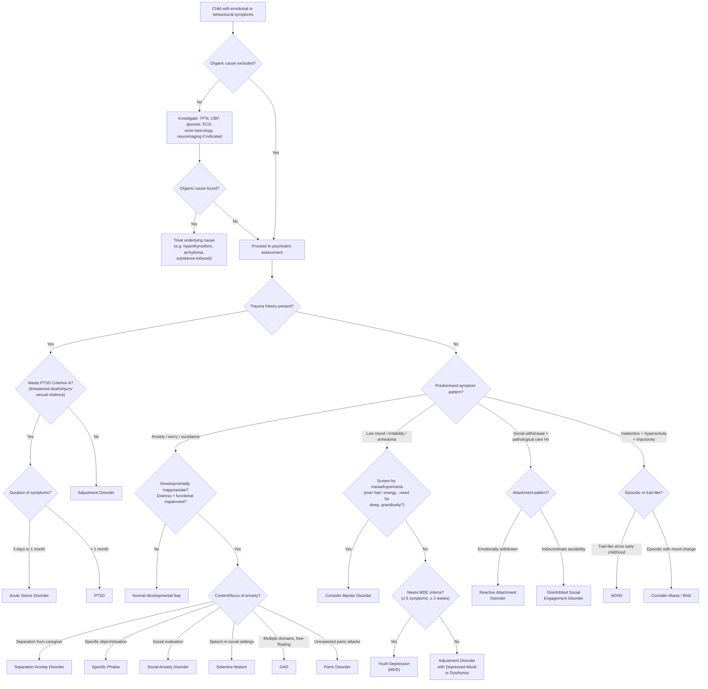

## Differential Diagnosis of Other Psychiatric Conditions in Child Psychiatry

The differential diagnosis of psychiatric conditions in children is harder than in adults for one core reason: **developmental immaturity changes how symptoms present**. A depressed child may look like an ODD child (irritability). An anxious child may look like an ADHD child (poor concentration, restlessness). A child with ADHD may look manic (hyperactivity, talkativeness, impulsivity). The art is in recognising **which circuit is driving the behaviour**, and that requires careful history, developmental context, and pattern recognition.

This section systematically addresses the differential diagnosis of each major "other" child psychiatric condition, followed by a unifying algorithmic approach.

---

### 1. Differential Diagnosis of Childhood Anxiety Disorders

The senior notes explicitly state: ***D/dx: consider organic causes, e.g. hyperthyroidism, arrhythmias, neurological disease, substance-induced anxiety (alcohol, illicit drugs, caffeine)*** [1].

The lecture slides reinforce the same principle for adults that applies equally to children: ***DDx for anxiety symptoms — Physical disorder, substance abuse etc*** and ***DDx for avoidance features — Personality disorder, psychosis, depression*** [6].

#### 1.1 Organic / Medical Differentials

These must always be considered **first** because anxiety symptoms (tachycardia, tremor, sweating, restlessness, poor concentration) are **non-specific** — they can be produced by any condition that activates the sympathetic nervous system or mimics its effects.

| Organic Cause | Why It Mimics Anxiety | How to Distinguish |
|---|---|---|
| **Hyperthyroidism** ("hyper" = excessive; "thyroid" = thyroid gland) | Excess T3/T4 → ↑metabolic rate → tachycardia, tremor, heat intolerance, restlessness, weight loss, irritability — these overlap substantially with anxiety symptoms | TFTs (↑free T4, ↓TSH); look for goitre, exophthalmos, warm moist skin; symptoms are **persistent** and not situational |
| **Cardiac arrhythmias** (SVT, WPW) | Paroxysmal tachycardia → palpitations, chest tightness, dizziness, shortness of breath → misinterpreted as panic attacks | ECG, Holter monitor; episodes are truly paroxysmal with sudden onset/offset; no cognitive anxiety component between episodes; no avoidance behaviour |
| ***Epilepsy*** (temporal lobe epilepsy particularly) [7] | Auras can produce intense fear, déjà vu, depersonalisation, autonomic symptoms → mimics panic | EEG; stereotyped episodes; may have post-ictal confusion; temporal relationship to seizure activity |
| ***Phaeochromocytoma*** [7] | Episodic catecholamine release → paroxysmal hypertension, tachycardia, sweating, pallor, headache → mimics episodic panic | 24h urinary catecholamines/metanephrines; paroxysmal hypertension is the key clue; no situational trigger |
| **Hypoglycaemia** | ↓Blood glucose → sympathetic activation → tremor, sweating, palpitations, anxiety, irritability | Blood glucose during episode; symptoms resolve with glucose administration; temporal relationship to fasting/meals |
| ***Vestibular dysfunction*** [7] | Dizziness and unsteadiness → may trigger secondary anxiety and avoidance (especially in panic disorder) | Vestibular testing; true vertigo (room spinning) rather than light-headedness; nystagmus on examination |
| **Neurological disease** (brain tumour, demyelination) [1] | Depending on location, can cause anxiety, personality change, irritability | Neuroimaging; focal neurological signs; progressive course |
| **Asthma / respiratory disease** | Dyspnoea → air hunger → panic-like symptoms | Wheezing on auscultation; peak flow variability; response to bronchodilators |

> **First-principles reasoning:** The sympathetic nervous system activation that underlies anxiety symptoms is a **final common pathway**. Any condition that increases sympathetic tone — whether endogenous (thyrotoxicosis, phaeo) or exogenous (stimulants, caffeine) — will produce the same autonomic symptoms. You cannot diagnose a psychiatric anxiety disorder until you have excluded these organic mimics.

#### 1.2 Substance-Induced Anxiety [1]

| Substance | Mechanism |
|---|---|
| **Caffeine** (very common in adolescents via energy drinks, coffee) | Adenosine receptor antagonism → ↑arousal, ↑sympathetic activation |
| **Stimulants** (amphetamines, cocaine, methylphenidate if misused) | ↑DA and NA release → sympathetic activation → anxiety, agitation, paranoia |
| **Cannabis** | At high doses or in predisposed individuals → acute anxiety/panic; chronic use → withdrawal anxiety |
| **Alcohol withdrawal** | Loss of GABA-ergic inhibition → CNS hyperexcitability → anxiety, tremor, seizures |
| ***Intoxication: alcohol, stimulants (amphetamines, cocaine, caffeine), cannabis, inhalants, hallucinogens*** [2] |
| ***Withdrawal: alcohol, sedatives/hypnotics (BZDs, opiates), caffeine, cocaine, nicotine*** [2] |
| ***Side effects of medications: antidepressants (esp first 2 weeks), corticosteroids, sympathomimetics, T4, anticholinergics, antipsychotics (akathisia)*** [2] |

<Callout title="Caffeine in Children — An Overlooked Culprit" type="idea">
In Hong Kong, energy drink consumption among adolescents is increasing. A single can of a popular energy drink contains ~80-160 mg of caffeine — equivalent to 1-2 strong coffees. Caffeine has a half-life of ~5 hours and can cause jitteriness, insomnia, tachycardia, and anxiety indistinguishable from an anxiety disorder. Always ask about caffeine intake in an anxious adolescent.
</Callout>

#### 1.3 Psychiatric Differentials of Childhood Anxiety

| Differential | Why It Mimics Anxiety | How to Distinguish |
|---|---|---|
| **ADHD** | Restlessness, poor concentration, distractibility overlap with GAD [3] | ADHD: distractibility is by **external stimuli, new activities, enjoyable preoccupations** (not by worry). Symptoms are pervasive and trait-like (present since early childhood). No excessive worry. ↑Motor activity is present in ADHD but not typical of anxiety [3][4] |
| **ODD / Conduct disorder** | Irritability overlaps with anxiety [3] | ODD: irritability is characterised by **negativity, hostility, defiance** — directed at authority figures. Anxiety: irritability arises from **chronic fear/tension** and is more generalised. ODD children resist demands due to opposition; anxious children resist due to fear [4] |
| **Depression** | Poor concentration, irritability, sleep disturbance overlap with anxiety [3] | Depression: usually later onset, **episodic course**, prominent anhedonia, ↓energy. Concentration difficulty is due to rumination/psychomotor retardation rather than hypervigilance. However, note **70% comorbidity** — both can co-exist [1] |
| **Mania / hypomania** | Poor concentration, ↑motor activity, distractibility, irritability overlap [3] | Mania: **episodic** (not chronic), a/w ↑self-esteem, **grandiosity**, **↓need for sleep** (different from insomnia — the child genuinely feels rested with less sleep), **flight of ideas**, elated or expansive mood [5] |
| **Psychotic disorders (schizophrenia)** | Anxiety can be secondary to persecutory delusions or command hallucinations | Focus of anxiety is delusional content (e.g., "people are watching me"); presence of formal thought disorder, negative symptoms; bizarre/disorganised behaviour; poor reality testing |
| **OCD** | Anxiety is triggered by obsessional thoughts → compulsive behaviours → may look like anxious avoidance | OCD: anxiety is linked to **specific intrusive thoughts** (contamination, harm, symmetry) with **compulsive rituals** to neutralise them. The content is often odd, irrational, or magical rather than realistic worries [8] |
| **PTSD** | General anxiety, hyperarousal, avoidance overlap with anxiety disorders | PTSD: linked to **specific traumatic event**; presence of **re-experiencing** (flashbacks, nightmares with trauma content); avoidance is of **trauma-related** stimuli specifically [9] |
| **Separation anxiety vs. School phobia vs. Truancy** | All present as "not going to school" | Separation anxiety: the child is anxious about **separation from caregiver** (not about school itself); school refusal resolves if parent stays. School phobia (social anxiety): child fears the **school environment** (peers, performance). Truancy: child is **not anxious** — they choose not to attend, often engaging in pleasurable activities instead (conduct problem) |
| ***Personality disorder*** [6] | Avoidant PD (fear of rejection), dependent PD (fear of abandonment) can mimic anxiety disorders | PD: **enduring**, pervasive pattern across situations from adolescence; more rigid/inflexible; distress arises from interpersonal patterns rather than situational triggers |
| **Adjustment disorder** | Anxiety symptoms following a stressor | Stressor is identifiable but **non-traumatic**; symptoms develop within 3 months of stressor; does not meet full criteria for a specific anxiety disorder; resolves within 6 months after stressor ends [9][10] |
| **Normal developmental fears** | Many fears are age-appropriate (stranger anxiety, separation protest, fear of dark) | Key distinction: **severity** and **duration** are proportionate to developmental stage; **no functional impairment**; the child can be reassured and the fear does not dominate daily life [1] |

<Callout title="Overlap Table — A High-Yield Exam Resource" type="idea">
The senior notes provide this invaluable overlap table [3]. Memorise it — it shows exactly which symptoms are shared across common child psychiatric differentials:

| Feature | ADHD | ODD/CD | GAD | Depression | Mania |
|---|---|---|---|---|---|
| Restlessness | ✓ | | ✓ | | |
| Poor concentration | ✓ | | ✓ | ✓ | ✓ |
| ↑Motor activity | ✓ | | | | ✓ |
| Distractibility | ✓ | | ✓ | | ✓ |
| Irritability | | ✓ | ✓ | ✓ | ✓ |

Notice: **irritability** is the one feature shared by ODD, GAD, depression, AND mania — but NOT by uncomplicated ADHD. If a child has irritability + poor concentration, think anxiety/depression/mania before ADHD.
</Callout>

#### 1.4 Distinguishing Between Types of Anxiety Disorders

Within the anxiety disorder family, the differentials are important because management differs:

| Condition | Focus of Anxiety | Trigger | Age Pattern |
|---|---|---|---|
| **Separation anxiety disorder** | Harm befalling attachment figures; being separated | Separation from caregiver | Peak 7-9y |
| **Specific phobia** | Specific object or situation (animals, heights, blood) | Exposure to phobic stimulus | Early childhood |
| **Social anxiety disorder** | Social evaluation, embarrassment, humiliation | Social/performance situations | Early adolescence |
| **GAD** | Multiple domains (school, health, family, future) | Not situation-specific; "free-floating" | Late adolescence |
| **Panic disorder** | Recurrent **unexpected** panic attacks + fear of next attack | Initially unexpected; later situational avoidance may develop | Late adolescence (rare before puberty) |
| **Selective mutism** | Speaking in specific social situations | Specific social contexts (school) | Before age 5 |

> **Key principle from the lecture:** ***Panic attacks tend to be expected in other anxiety disorders*** (e.g., triggered by social situations in social phobia, by separation in separation anxiety disorder) [7]. Only in **panic disorder** are there recurrent **unexpected** (uncued) panic attacks with persistent worry about further attacks.

---

### 2. Differential Diagnosis of Youth Depression

#### 2.1 Medical / Organic Differentials

| Organic Cause | Mechanism | How to Distinguish |
|---|---|---|
| **Hypothyroidism** | ↓T3/T4 → ↓metabolic rate → fatigue, weight gain, cold intolerance, constipation, psychomotor slowing, depressed mood | TFTs; physical signs (dry skin, bradycardia, delayed relaxation of reflexes); onset usually gradual |
| **Anaemia** (iron deficiency, common in adolescent girls) | ↓O₂ delivery → fatigue, poor concentration, irritability | FBC, ferritin; pallor, tachycardia; responds to iron replacement |
| **Addison's disease** (adrenal insufficiency) | ↓Cortisol → fatigue, weight loss, low mood, hypotension | Synacthen test; look for hyperpigmentation, postural hypotension, hyperkalaemia |
| **Infectious mononucleosis** (EBV) | Post-viral fatigue → prolonged lethargy, poor concentration → mimics depression | Monospot/EBV serology; sore throat, lymphadenopathy, hepatosplenomegaly |
| **Substance use** | CNS depressants (alcohol, cannabis) → low mood, anhedonia, poor motivation; stimulant withdrawal → crash | Drug history, urine toxicology; temporal relationship to substance use |
| **Medications** (corticosteroids, isotretinoin, OCP) | Various mechanisms affecting monoamine pathways | Temporal relationship to medication initiation |
| **Chronic medical illness** (diabetes, epilepsy, IBD) | Acts as non-specific stressor; some have direct neurobiological effects | Known medical history; treat the primary condition |
| ***Brain tumour, neurological conditions*** | Depending on location (frontal lobe, hypothalamus) → apathy, personality change, mood symptoms | Neuroimaging; focal neurological signs; progressive course |

#### 2.2 Psychiatric Differentials

| Differential | Why It Mimics Depression | How to Distinguish |
|---|---|---|
| **Normal sadness / bereavement** | Sadness is a normal emotion, especially after loss | Normal sadness: self-limited, fluctuating ("waves of grief"), self-esteem preserved, no pervasive anhedonia, functional recovery within expected timeframe |
| **Adjustment disorder with depressed mood** | Depressive symptoms following identifiable stressor | Develops within 3 months of stressor; does not meet full criteria for MDE; resolves within 6 months after stressor ends [10] |
| **Anxiety disorder** | Overlapping symptoms (insomnia, poor concentration, irritability, somatic complaints) | Anxiety: core feature is **excessive worry/fear**; concentration difficulty due to worry (not anhedonia/psychomotor retardation). However, 70% comorbidity — both can co-exist [1] |
| **ADHD** | Poor concentration, restlessness, irritability | ADHD: onset **early** (before 6-12 years), **pervasive** and **persistent** (trait-like, not episodic), ↑motor activity; no sustained depressed mood or anhedonia [3][4] |
| **ODD / Conduct disorder** | Irritability, behavioural problems | ODD/CD: hostile, defiant, deliberately annoying; irritability is directed at authority figures specifically; no pervasive sadness or anhedonia; onset and course differs |
| ***Bipolar affective disorder (BAD)*** | ~25% of BAD first presents as juvenile depression [1] | Screen for: FHx of bipolar, any hypomanic/manic symptoms (↑energy, ↓need for sleep, grandiosity, pressured speech), psychotic features, atypical features (hypersomnia, hyperphagia, leaden paralysis). ***Discerning features: psychotic features, atypical features (e.g. hypersomnia, hyperphagia, leaden paralysis)*** [5] |
| **Schizophrenia (prodromal)** | Negative symptoms (apathy, social withdrawal, flat affect) can resemble depression | Look for positive symptoms (hallucinations, delusions), formal thought disorder; negative symptoms tend to be more pervasive and lack the subjective distress of depression |
| **Substance use disorder** | Cannabis, alcohol → low mood, anhedonia, poor motivation | Temporal relationship to substance use; urine toxicology; symptoms improve with abstinence |
| **Chronic fatigue syndrome** | Profound fatigue, poor concentration, unrefreshing sleep | Fatigue is the **dominant** symptom; typically post-infectious onset; absence of pervasive low mood/anhedonia (though these can develop secondarily) |
| **Eating disorder** | Weight loss, poor concentration, low mood, social withdrawal | Core psychopathology is fear of weight gain/body image distortion; food restriction is deliberate; low mood often secondary to malnutrition |

<Callout title="The Bipolar Trap" type="error">
***~25% of BAD first presents as juvenile depression*** [1]. This is one of the most important facts in child psychiatry exams. If you diagnose depression and start an SSRI without screening for bipolar, you risk triggering mania. Always ask:
1. Has there ever been a period of unusually high energy, reduced need for sleep, or grandiosity?
2. Is there a family history of bipolar disorder?
3. Are there psychotic features (more common in bipolar depression than unipolar)?
4. Are there atypical features (hypersomnia, hyperphagia)?

***Misdiagnosis is very common → correct diagnosis and treatment is often delayed by 5-7 years on average*** [5].
</Callout>

---

### 3. Differential Diagnosis of Selective Mutism

| Differential | How to Distinguish |
|---|---|
| **Normal shyness / adjustment to new environment** | DSM-5 specifies that symptoms must last > 1 month and not be limited to the first month of school. Normal shyness does not prevent all speech in social settings |
| **Speech/language disorder** | In selective mutism, the child speaks **fluently at home** — language competence is intact. In language disorder, the difficulty is present across all settings |
| **Hearing impairment** | Hearing test is normal; the child responds to sounds and can speak at home |
| **ASD** | ASD: poor social reciprocity, restricted interests, and communication difficulties are present **across all settings**, not just specific social contexts. The child with ASD doesn't speak because of social communication impairment, not because of anxiety |
| **Intellectual disability** | Global developmental delay including language; speech difficulties present across all settings |
| **Traumatic mutism** | Sudden onset of mutism after a traumatic event, affecting all settings (not selective). Rare |
| **Social anxiety disorder without mutism** | Social anxiety may cause significant distress in social situations but the child still manages to speak (even if quietly or briefly) |

---

### 4. Differential Diagnosis of Attachment Disorders (RAD and DSED)

| Differential | How to Distinguish |
|---|---|
| **ASD** | ASD: social communication difficulties are due to **neurodevelopmental impairment** (poor theory of mind, restricted interests, stereotypies), not due to pathological caregiving. ASD does not require a history of neglect. Restricted/repetitive behaviours are not a feature of attachment disorders |
| **ADHD** | DSED children may appear impulsive and socially indiscriminate, but ADHD impulsivity is about **motor/cognitive disinhibition**, not about **attachment indiscrimination**. ADHD children still show selective attachment to caregivers |
| **Intellectual disability** | Children with ID may have poor social judgment but typically form selective attachments; developmental level explains social difficulties |
| **Normal variation in temperament** | Some children are naturally more sociable/outgoing — but they still show selective attachment, check back with caregivers, and show appropriate wariness with strangers |
| **Depression** | RAD can resemble depression (withdrawn, flat affect, reduced positive emotion), but RAD specifically involves **attachment-related** disturbance in the context of pathological caregiving, not a mood episode |

---

### 5. Differential Diagnosis of PTSD in Children

***D/dx of PTSD*** [9]:

| Differential | How to Distinguish |
|---|---|
| ***Adjustment disorder*** | ***Stressor can be of any severity or type, but either the stressor is non-traumatic or the symptomatology does not meet criteria for PTSD*** [9]. Adjustment disorder is the diagnosis when symptoms follow a stressor that does not meet Criterion A (actual/threatened death, serious injury, sexual violence) |
| ***Acute stress disorder*** | ***Lasts for 3 days to 1 month following exposure to traumatic event*** [9]. Same symptom cluster but shorter duration. If symptoms persist > 1 month, reclassify as PTSD |
| ***OCD*** | ***Recurrent intrusive thoughts are present, but they are unrelated to traumatic event*** [9]. OCD intrusions have themes of contamination, harm, symmetry — not trauma re-experiencing |
| ***Other anxiety disorders*** | ***Anxiety symptoms (worries, avoidance, arousal) are not related to traumatic events*** [9]. The key is whether the symptoms are **thematically linked to a specific trauma** |
| ***Traumatic brain injury (TBI)*** | ***TBI-related neurocognitive symptoms may mimic PTSD symptoms (e.g. irritability, startle response, poor concentration), but usually there are no re-experiencing and avoidance symptoms but may have persistent disorientation and confusion*** [9] |
| **Depression** | Can co-exist. Depression: pervasive anhedonia and low mood without the specific re-experiencing/avoidance cluster. But note that PTSD Criterion D (negative cognitions/mood) overlaps with depression |
| **Normal stress response** | Transient distress after trauma is **normal**. PTSD is only diagnosed when symptoms persist > 1 month and cause functional impairment |
| **Dissociative disorders** | Dissociative symptoms can occur in PTSD (the "dissociative subtype") but if dissociation is the dominant feature without re-experiencing, consider a dissociative disorder |
| **Behavioural disorder (ODD/CD)** | In children, PTSD hyperarousal may manifest as irritability and aggression → misdiagnosed as ODD/CD. Key: look for the trauma history and the re-experiencing symptoms |

---

### 6. Differential Diagnosis of Mania/Hypomania in Youth (When Considering BAD vs Other Child Conditions)

This is included because ***~25% of BAD first presents as juvenile depression*** [1], and manic episodes in adolescents need careful differentiation.

***Differential diagnosis of manic episode*** [5]:
- ***Depressive disorder with irritability and anxious distress***
- ***Psychotic disorder or schizoaffective disorder***
- ***Substance/medication-induced/medical conditions***
- ***Attention deficit and hyperactivity disorder***
- ***Personality disorder with prominent irritability***

| Differential | Key Distinguishing Features |
|---|---|
| ***ADHD*** | ADHD: **chronic, trait-like** (present since early childhood, not episodic); **no ↑self-esteem, grandiosity, flight of ideas, ↓need for sleep** [5]. Mania: **episodic** with clear change from baseline |
| ***Psychotic disorder / schizoaffective disorder*** | Schizophrenia: psychotic symptoms persist **outside of mood episodes**; FTD more a/w **loosening of association, neologism, thought blocking** (cf mania: **circumstantiality, tangentiality, flight of ideas**); speech more **hesitant/halting** (cf mania: **pressured, difficult to interrupt**); may have catatonia or negative symptoms [5] |
| ***Borderline personality disorder*** | **No FHx of BAD**; rapid shifts of mood over **hours** (not days-weeks); **no classic mania symptoms** (↑energy, grandiosity); mood disturbances often **triggered by interpersonal issues** [5] |
| **Substance-induced** | Temporal relationship to substance use; symptoms resolve with abstinence; urine toxicology [5] |
| **Organic brain lesion** | Consider in older patients or those with no psychiatric history; **extreme social disinhibition without gross mood disorder → consider frontal lobe pathology** [5] |

---

### 7. Unifying Differential Diagnosis Algorithm

The following mermaid diagram provides a clinical approach to the child presenting with emotional/behavioural symptoms, systematically narrowing the differential:

---

### 8. Approach to the "Anxious and Irritable Child" — A Common Exam Scenario

In clinical practice and exams, you are often presented with a child who is irritable, refusing school, with somatic complaints. The differential is wide:

**Step 1: Exclude organic causes**
- History and physical examination
- Basic investigations: ***CBP, R/LFT, thyroid function test*** [11]. ***Others: blood alcohol level, blood and urine toxicology screen*** if indicated [11]

**Step 2: Identify the primary psychopathology**
- Ask about the **theme** of the child's distress:
  - ***Worry about gaining weight → eating disorder*** [2]
  - ***Worry about having serious illness → hypochondriasis*** [2]
  - ***Fear of being poisoned or killed → delusional beliefs in paranoid schizophrenia*** [2]
  - ***Ruminatory thoughts of guilt or worthlessness → depression*** [2]
  - ***A/w obsessional thoughts or resisting a compulsion → OCD*** [2]
  - ***Separation or abandonment → borderline, dependent personality disorder*** [2]
  - ***Being rejected or inadequate → avoidant personality disorder*** [2]

**Step 3: Determine if symptoms are developmentally appropriate**
- Is the severity and duration proportionate to the child's age and developmental stage?
- Is there functional impairment (academic, social, family)?
- If both yes → meets criteria for psychiatric disorder [1]

**Step 4: Consider comorbidity**
- Comorbidity is the rule, not the exception, in child psychiatry
- 70% of depressed children have comorbid anxiety [1]
- 50% of ADHD children have comorbid psychiatric conditions [3]
- Always screen for multiple conditions

<Callout title="The Theme-of-Anxiety Approach" type="idea">
When presented with an anxious child, the single most useful question is: **"What is the child worried about?"** The answer tells you the diagnosis:
- Worried about **separation** → Separation anxiety disorder
- Worried about **social judgment** → Social anxiety disorder
- Worried about **everything** → GAD
- Worried about **specific object/situation** → Specific phobia
- Worried about **contamination/harm with rituals** → OCD
- Worried about **trauma** → PTSD
- Worried about **weight** → Eating disorder
- Worried about **illness** → Health anxiety / hypochondriasis
- **No cognitive worry but physical symptoms** → Consider organic cause or somatoform disorder
</Callout>

---

<Callout title="High Yield Summary">

**Key Differential Diagnosis Principles in Child Psychiatry:**

1. **Always exclude organic causes first**: hyperthyroidism, arrhythmias, hypoglycaemia, phaeochromocytoma, epilepsy, substance use (especially caffeine in adolescents), medication side effects

2. **Symptom overlap is enormous** — use the overlap table:
   - ADHD: restlessness + poor concentration + ↑motor + distractibility (NO irritability)
   - ODD: irritability is the defining feature (hostile, defiant)
   - GAD: restlessness + poor concentration + distractibility + irritability (but NO ↑motor)
   - Depression: poor concentration + irritability (but also anhedonia, ↓energy)
   - Mania: poor concentration + ↑motor + distractibility + irritability (PLUS grandiosity, ↓need for sleep, flight of ideas — these are absent in ADHD)

3. **ADHD vs Mania**: ADHD is trait-like and chronic; mania is episodic. ADHD lacks grandiosity, ↓need for sleep, and flight of ideas

4. **~25% of BAD presents as juvenile depression** → always screen for hypomania/mania in any depressed adolescent. Misdiagnosis delays correct treatment by 5-7 years on average

5. **Normal developmental fear vs anxiety disorder**: diagnosed only when developmentally inappropriate + significant distress + functional impairment

6. **Theme of anxiety guides the specific diagnosis**: separation → SAD; social evaluation → social phobia; everything → GAD; unexpected panic → panic disorder; trauma-related → PTSD; intrusive thoughts with rituals → OCD

7. **PTSD vs Adjustment disorder**: stressor severity (Criterion A traumatic vs non-traumatic) and symptom profile (full PTSD criteria vs subthreshold)
</Callout>

---

<ActiveRecallQuiz
  title="Active Recall - Differential Diagnosis of Child Psychiatric Conditions"
  items={[
    {
      question: "An 8-year-old presents with restlessness, poor concentration, and irritability. ADHD is considered. Name three features that, if present, would point toward a manic episode rather than ADHD.",
      markscheme: "1) Grandiosity or inflated self-esteem; 2) Decreased need for sleep (genuinely rested with less sleep, not insomnia); 3) Flight of ideas or subjective racing thoughts. Additionally: episodic course (clear change from baseline) rather than chronic/trait-like presentation. ADHD lacks these features."
    },
    {
      question: "List four organic/medical conditions that can mimic childhood anxiety disorders and explain the mechanism for one of them.",
      markscheme: "Hyperthyroidism (excess T3/T4 causes sympathetic activation — tachycardia, tremor, restlessness); cardiac arrhythmias (paroxysmal tachycardia mimics panic); phaeochromocytoma (episodic catecholamine release); hypoglycaemia (sympathetic activation from low glucose); epilepsy (temporal lobe auras mimic panic); asthma (dyspnoea mimics panic). Need 4 with mechanism for 1."
    },
    {
      question: "A 14-year-old presents with depressive symptoms. What proportion of bipolar disorder first presents as juvenile depression, and name three clinical features you would screen for to avoid missing bipolar disorder.",
      markscheme: "Approximately 25%. Screen for: 1) History of any period of elevated energy, decreased need for sleep, or grandiosity (hypomania/mania); 2) Family history of bipolar disorder; 3) Psychotic features (more common in bipolar than unipolar depression); Also consider: atypical features (hypersomnia, hyperphagia, leaden paralysis)."
    },
    {
      question: "How do you differentiate Separation Anxiety Disorder from Social Anxiety Disorder and from truancy in a child who refuses to go to school?",
      markscheme: "Separation anxiety: child is anxious about being separated from caregiver, not about school itself — resolves if parent stays at school. Social anxiety: child fears the school social environment (peer judgment, performance) — anxiety persists even if parent is present. Truancy: no anxiety — child deliberately avoids school to do pleasurable activities; this is a conduct/behavioural problem, not an anxiety disorder."
    },
    {
      question: "In differentiating PTSD from Adjustment Disorder in a child, what are the two key distinguishing factors?",
      markscheme: "1) Nature of the stressor: PTSD requires exposure to actual or threatened death, serious injury, or sexual violence (Criterion A traumatic event), whereas adjustment disorder can follow any stressor of any severity. 2) Symptom profile: PTSD requires specific symptom clusters (re-experiencing, avoidance, negative cognitions/mood, hyperarousal), whereas adjustment disorder is diagnosed when symptomatology does not meet full PTSD criteria."
    }
  ]}
/>

## References

[1] Senior notes: ryanho-psych.md (Section 12.5 Other Psychiatric Conditions in Child Psychiatry, Section 12.1.2 Overview)
[2] Senior notes: ryanho-psych.md (Section 7.3 Approach to Anxiety, differential diagnosis)
[3] Senior notes: ryanho-psych.md (Section 12.3 ADHD — overlap table and comorbidities)
[4] Senior notes: ryanho-psych.md (Section 12.3 ADHD — differential diagnosis)
[5] Senior notes: ryanho-psych.md (Section 7.1.2 Approach to Elated or Irritable Mood; differential diagnosis of mania)
[6] Lecture slides: GC 167. I feel very nervous Anxiety disorders.pdf (p27)
[7] Lecture slides: GC 167. I feel very nervous Anxiety disorders.pdf (p18)
[8] Senior notes: ryanho-psych.md (Section on OCD differential diagnosis)
[9] Senior notes: ryanho-psych.md (Section on PTSD differential diagnosis)
[10] Senior notes: ryanho-psych.md (Section on Adjustment Disorder differential diagnosis)
[11] Lecture slides: GC 164. I am depressed Mood disorders.pdf (p13)
