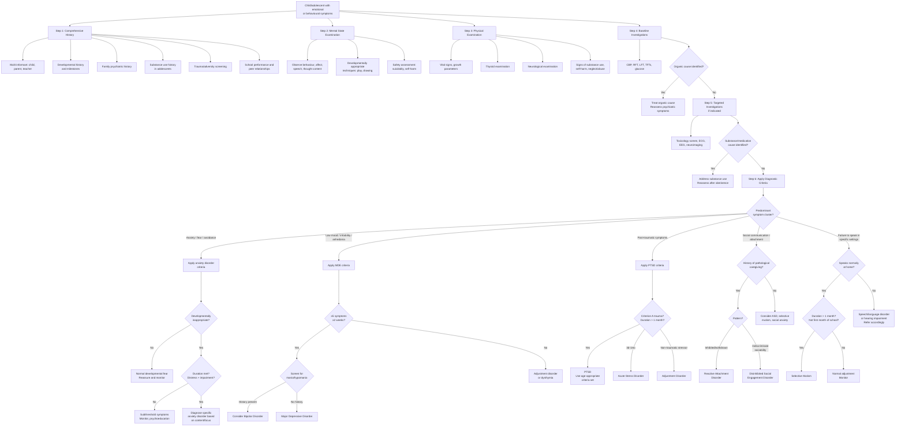

## Diagnostic Criteria, Diagnostic Algorithm, and Investigations

### 1. Guiding Principles of Diagnosis in Child Psychiatry

Before diving into specific criteria, it is essential to understand **why** psychiatric diagnosis in children follows a particular logic:

**Diagnostic criteria in psychiatry universally consist of** [12]:
1. **A cluster of symptoms** — core (discriminating) symptoms + associated (characteristic) symptoms
2. **Minimal duration** — to separate transient reactions from disorders
3. **Distress or functional impairment** — the symptoms must actually matter to the child's life
4. **Exclusion criteria** — rule out organic causes, substances, and other psychiatric disorders that better explain the picture

In child psychiatry, there is a crucial additional layer: **developmental appropriateness**. Many "symptoms" of psychiatric disorders are actually normal at certain ages (separation anxiety in toddlers, stranger anxiety in infants, impulsivity in preschoolers). The diagnostic threshold is crossed only when severity and duration are **out of proportion to the developmental stage** [1].

> Think of it like fever — a temperature of 37.5°C is normal after exercise but abnormal at rest. Similarly, fear of separation is "normal" at age 2 but "abnormal" at age 12.

---

### 2. Diagnostic Criteria for Specific Conditions

#### 2.1 Separation Anxiety Disorder

| Feature | ICD-10 (F93.0) | DSM-5 |
|---|---|---|
| **Core criterion** | Anxiety focused specifically on separation from attachment figures, beyond that expected for developmental level | Developmentally inappropriate and excessive fear/anxiety concerning separation from attachment figures, evidenced by ≥ 3 of 8 symptoms |
| **Symptom examples** | Unrealistic worry about harm to/loss of attachment figures; refusal to go to school; reluctance to sleep alone; nightmares about separation; somatic complaints on separation | Same symptom list, more explicitly operationalised |
| **Duration** | Not explicitly stated but implied persistent | **≥ 4 weeks** in children/adolescents; ≥ 6 months in adults |
| **Age criterion** | Onset before 6 years | No specific age-of-onset requirement, but developmentally inappropriate |
| **Impairment** | Causes significant distress and functional impairment | Clinically significant distress or impairment in social, academic, or other important functioning |
| **Exclusion** | Not part of a more pervasive disturbance of emotions, personality, or pervasive developmental disorder | Not better explained by another mental disorder (e.g., refusing to leave home due to excessive resistance to change in ASD, psychotic disorder, agoraphobia) |

**DSM-5 Criteria in Detail (309.21 / F93.0):**

A. Developmentally inappropriate and excessive fear or anxiety concerning separation from those to whom the individual is attached, as evidenced by **≥ 3** of the following:

1. Recurrent excessive distress when anticipating or experiencing separation from home or attachment figures
2. Persistent and excessive worry about losing attachment figures or about possible harm to them
3. Persistent and excessive worry about an untoward event causing separation (e.g., getting lost, being kidnapped)
4. Persistent reluctance or refusal to go out/away from home (school, work) because of fear of separation
5. Persistent and excessive fear of or reluctance about being alone or without attachment figures at home or other settings
6. Persistent reluctance or refusal to sleep away from home or without being near an attachment figure
7. Repeated nightmares involving the theme of separation
8. Repeated complaints of physical symptoms (headaches, stomach aches, nausea, vomiting) when separation from attachment figures occurs or is anticipated

B. Duration ≥ 4 weeks in children/adolescents, ≥ 6 months in adults
C. Clinically significant distress or impairment
D. Not better explained by another mental disorder

> **Why ≥ 3 of 8?** Because separation anxiety manifests across multiple domains — cognitive (worry), behavioural (avoidance/refusal), somatic (physical symptoms), and affective (distress). Requiring ≥ 3 ensures the diagnosis captures a pervasive pattern rather than an isolated symptom.

#### 2.2 Social Anxiety Disorder (Social Phobia)

**DSM-5 Criteria (300.23 / F40.10):**

A. Marked fear or anxiety about ≥ 1 social situations in which the individual is exposed to possible scrutiny by others (e.g., social interactions, being observed, performing in front of others)
   - **In children**: the anxiety must occur in **peer settings** and not just during interactions with adults
B. The individual fears that they will act in a way or show anxiety symptoms that will be negatively evaluated
C. The social situations almost always provoke fear or anxiety
   - **In children**: may be expressed by crying, tantrums, freezing, clinging, shrinking, or failing to speak
D. The social situations are avoided or endured with intense fear/anxiety
E. The fear/anxiety is **out of proportion** to the actual threat posed by the social situation
F. Duration ≥ 6 months
G. Clinically significant distress or impairment
H. Not attributable to substance or another medical condition
I. Not better explained by another mental disorder
J. If another medical condition (e.g., stuttering, obesity) is present, the fear/anxiety is clearly unrelated or excessive

Specify if: **Performance only** (fear is restricted to speaking or performing in public)

> **Key child-specific modification**: In adults, the person must recognise the fear is excessive. In children, this requirement is **dropped** — children often lack the metacognitive capacity to evaluate their own fear as "excessive."

#### 2.3 Generalised Anxiety Disorder (GAD)

| Feature | ICD-10 (F41.1) | DSM-5 (300.02) |
|---|---|---|
| **Core** | Generalised, persistent anxiety not restricted to specific situations ("free-floating anxiety") | Excessive anxiety and worry about a number of events or activities, occurring more days than not for **≥ 6 months** |
| **Symptoms** | Must have ≥ 4 symptoms from a list including autonomic arousal, chest/abdominal symptoms, mental state symptoms, general symptoms, tension, and other nonspecific symptoms | The worry is difficult to control; ≥ 3 of 6 symptoms: restlessness, fatigue, poor concentration, irritability, muscle tension, sleep disturbance. **In children: only 1 of 6 required** |
| **Duration** | ≥ several months, on most days | ≥ 6 months |
| **Exclusion** | Not due to panic disorder, phobic disorder, OCD, or hypochondriasis (ICD-10 treats GAD as a "diagnosis of exclusion") [13] | Not attributable to substance/medical condition; not better explained by another mental disorder. **DSM-5 allows comorbid diagnosis** |

<Callout title="ICD-10 vs DSM-5 for GAD — A Key Exam Distinction" type="error">
***ICD-10 treats GAD as a diagnosis of exclusion*** — you cannot diagnose GAD if the patient meets criteria for panic disorder, phobic anxiety, OCD, or hypochondriasis [13]. ***DSM-5 emphasises excessive worry as a core feature and specifies 6 months minimum duration, making DSM-5 diagnosis of GAD possible even in the presence of other anxiety disorders*** [13]. In children, DSM-5 requires only **1 of 6** associated symptoms (vs 3 of 6 in adults), reflecting the fact that children's anxiety often presents with fewer somatic/cognitive elaborations.
</Callout>

#### 2.4 Selective Mutism

**DSM-5 Criteria (312.23 / F94.0):**

A. Consistent failure to speak in specific social situations in which there is an expectation for speaking (e.g., at school), despite speaking in other situations
B. The disturbance interferes with educational/occupational achievement or social communication
C. Duration ≥ 1 month (not limited to the first month of school)
D. The failure to speak is not attributable to a lack of knowledge of, or comfort with, the spoken language
E. The disturbance is not better explained by a communication disorder and does not occur exclusively during ASD, schizophrenia, or other psychotic disorder

> **Why the "first month of school" exclusion?** Because many children are shy and quiet when entering a new environment. This is a **normal adjustment**. The 1-month rule ensures we are not pathologising normal adaptation.

#### 2.5 Reactive Attachment Disorder (RAD)

**DSM-5 Criteria (313.89 / F94.1):**

A. A consistent pattern of inhibited, emotionally withdrawn behaviour toward adult caregivers, manifested by both:
   1. The child rarely or minimally seeks comfort when distressed
   2. The child rarely or minimally responds to comfort when distressed
B. A persistent social and emotional disturbance characterised by ≥ 2 of:
   1. Minimal social and emotional responsiveness to others
   2. Limited positive affect
   3. Episodes of unexplained irritability, sadness, or fearfulness even during nonthreatening interactions
C. The child has experienced a pattern of extremes of insufficient care, as evidenced by ≥ 1 of:
   1. Social neglect or deprivation (persistent lack of basic emotional needs for comfort, stimulation, affection)
   2. Repeated changes of primary caregivers that limit opportunity to form stable attachments
   3. Rearing in unusual settings that limit opportunities to form selective attachments (e.g., institutions)
D. The care in Criterion C is presumed to be responsible for the disturbed behaviour in Criterion A
E. The child does **not** meet criteria for ASD
F. The disturbance is evident before age 5 years
G. The child has a developmental age of ≥ 9 months

> **Why exclude ASD?** Because both RAD and ASD involve poor social responsiveness — but the mechanism is completely different. In RAD, the social circuit is intact but **suppressed** due to environmental deprivation. In ASD, the social circuit is **neurodevelopmentally impaired**. The clinical clue: RAD children show **improvement** when placed in a nurturing environment; ASD children do not dramatically change.

#### 2.6 Disinhibited Social Engagement Disorder (DSED)

**DSM-5 Criteria (313.89 / F94.2):**

A. A pattern of behaviour in which the child actively approaches and interacts with unfamiliar adults, exhibiting ≥ 2 of:
   1. Reduced or absent reticence in approaching unfamiliar adults
   2. Overly familiar verbal or physical behaviour
   3. Diminished or absent checking back with adult caregiver after venturing away
   4. Willingness to go off with an unfamiliar adult with minimal or no hesitation
B. Behaviours in A are not limited to impulsivity (as in ADHD) but include socially disinhibited behaviour
C. History of extremes of insufficient care (same as RAD Criterion C)
D. The care in C is presumed responsible for the behaviour in A
E. The child has a developmental age of ≥ 9 months

> **Why distinguish from ADHD impulsivity?** An ADHD child might impulsively approach a stranger, but this is part of general behavioural disinhibition — they are also impulsive in non-social contexts (blurting out answers, can't wait their turn). DSED children are specifically and selectively indiscriminate in their social approach — their impulsivity is **social attachment-specific**.

#### 2.7 PTSD in Children ≥ 6 Years (DSM-5 Criteria)

The DSM-5 criteria for PTSD in children ≥ 6 years are essentially the same as for adults [9]:

**A. Exposure** to actual or threatened death, serious injury, or sexual violence via direct experience, witnessing, learning about it happening to a close family member/friend, or repeated exposure to aversive details

**B. Intrusion symptoms** (≥ 1): recurrent intrusive memories, distressing dreams, dissociative reactions (flashbacks), psychological distress at exposure to cues, marked physiological reactions to cues

**C. Avoidance** (≥ 1): avoidance of distressing memories/thoughts/feelings; avoidance of external reminders

**D. Negative alterations in cognitions and mood** (≥ 2): inability to remember important aspects of trauma, persistent negative beliefs about self/world, persistent distorted cognitions about cause/consequences, persistent negative emotional state, diminished interest in activities, detachment, persistent inability to experience positive emotions [9]

**E. Marked alterations in arousal and reactivity** (≥ 2): irritable behaviour/angry outbursts, reckless/self-destructive behaviour, hypervigilance, exaggerated startle, concentration problems, sleep disturbance [9]

**F. Duration > 1 month**
**G. Clinically significant distress or functional impairment**
**H. Not attributable to substance or medical condition** [9]

#### 2.8 PTSD in Children < 6 Years (DSM-5 Preschool Subtype)

This is a **separate criteria set** in DSM-5, tailored for young children who cannot articulate internal experiences:

- Criterion B (Intrusion): same, but traumatic dreams may not have recognisable content (generalised frightening dreams); re-enactment may occur in play
- Criteria C and D are **combined into one cluster** requiring only **1 symptom** (instead of requiring both avoidance AND negative cognitions separately) — because young children have limited avoidance capacity and cannot report cognitive distortions
- Criterion E (Arousal): same as adults
- Duration > 1 month, functional impairment, not substance-related

> **Why a lower threshold for young children?** Young children have limited verbal capacity and metacognitive ability. A 3-year-old cannot tell you "I have distorted cognitions about the cause of the trauma" or "I feel emotionally numb." The preschool criteria rely more on **observable behaviours** (play re-enactment, regression) and set a lower symptom count because the same underlying disorder expresses through fewer observable channels.

#### 2.9 Youth Depression (Major Depressive Episode)

***DSM-5 criteria for Major Depressive Disorder*** [14]:

***A. ≥ 5 of the following symptoms present during the same 2-week period, representing a change from previous functioning; at least one must be (1) or (2):***

1. ***Depressed mood most of the day, nearly every day*** — **in children and adolescents, can be irritable mood**
2. ***Markedly diminished interest or pleasure in all or almost all activities***
3. Significant weight loss/gain or decrease/increase in appetite — in children, failure to make expected weight gains
4. Insomnia or hypersomnia
5. Psychomotor agitation or retardation (observable, not just subjective)
6. Fatigue or loss of energy
7. Feelings of worthlessness or excessive/inappropriate guilt
8. Diminished ability to think/concentrate or indecisiveness
9. Recurrent thoughts of death, suicidal ideation, or suicide attempt

***B. Symptoms cause clinically significant distress or impairment in social, occupational, or other important areas of functioning*** [14]

***C. The episode is not attributable to the physiological effects of a substance or to another medical condition*** [14]

***D. Not better explained by schizoaffective disorder, schizophrenia, schizophreniform disorder, delusional disorder, or other psychotic disorders*** [14]

***E. Absence of previous manic or hypomanic episode*** [14]

<Callout title="Key DSM-5 Changes Relevant to Youth Depression">
The lecture slides highlight several ***key changes from DSM-IV*** [14]:
- ***Removal of the "bereavement exclusion"*** — depressive symptoms may be understandable in context of significant loss (bereavement, financial ruin, disaster, serious illness), but clinical judgment based on individual history and cultural norms should be exercised [14]
- ***Dysthymia → Persistent Depressive Disorder*** (includes both chronic MDD and the previous dysthymic disorder) [14]
- ***Introduction of Disruptive Mood Dysregulation Disorder (DMDD)***: persistent irritability and frequent episodes of extreme, out-of-control behaviour in children up to 18 years [14]. This was created to reduce overdiagnosis of paediatric bipolar disorder in irritable children
- ***Introduction of Premenstrual Dysphoric Disorder (PMDD)***: mood symptoms during the final week before menses, improving within days of menses [14]
</Callout>

> **Why can irritable mood substitute for depressed mood in children?** As discussed in the pathophysiology section, the developing prefrontal cortex cannot modulate negative affect into the articulate experience of "sadness" — instead, it manifests as low frustration tolerance and irritability. The DSM-5 explicitly accommodates this developmental reality.

***Varied clinical presentation*** — the lecture emphasises [14]:
- ***In some younger people, the first obvious sign may be loss of interest in friends, decline in school performance, self-injury or bulimia or drug use in a previously stable adolescent***
- ***In some older people, symptoms may mimic dementia — deterioration of cognitive functioning and self-care***
- ***In some tragic cases, symptoms may be masked to others until the person is found dead by suicide***

#### 2.10 Sibling Rivalry Disorder (ICD-10 F93.3)

**ICD-10 Criteria:**
- Some degree of emotional disturbance usually following the birth of an immediately younger sibling
- If marked in degree and associated with abnormalities in social interactions, should be coded
- The sibling rivalry disorder may be characterized by marked jealousy, rivalry, hostility toward the sibling
- May manifest as behavioural regression, temper tantrums, dysphoria, sleep disturbance, attention-seeking
- Must be **persistent** and **clearly out of norm** [1]
- **No DSM-5 equivalent** (not included as a separate diagnostic entity)

#### 2.11 Adjustment Disorder

Since adjustment disorder is an important differential in child psychiatry:

**DSM-5 Criteria:**
A. Development of emotional or behavioural symptoms in response to an identifiable stressor, occurring **within 3 months** of the onset of the stressor
B. Symptoms are clinically significant as evidenced by either:
   1. Marked distress out of proportion to the severity of the stressor
   2. Significant impairment in social, occupational, or other functioning
C. Does not meet criteria for another mental disorder and is not merely an exacerbation of a pre-existing disorder
D. Symptoms do not represent normal bereavement
E. Once the stressor has terminated, symptoms do not persist for more than an additional **6 months**

Specify subtypes: with depressed mood, with anxiety, with mixed anxiety and depressed mood, with disturbance of conduct, with mixed disturbance of emotions and conduct, unspecified

---

### 3. Standardised Assessment Instruments

Psychiatric diagnosis in children is **clinical** — based on thorough history (from child, parents, teachers), mental state examination, and developmental assessment. Standardised instruments are **adjuncts**, not substitutes.

***Objective measures are useful in clinical practice and research but not diagnostic. They should not be used as a substitute for a clinical diagnosis made from a thorough interview*** [14].

#### 3.1 Screening and Severity Rating Scales

| Condition | Instrument | Details | Role |
|---|---|---|---|
| **Anxiety (general)** | Screen for Child Anxiety Related Disorders (SCARED) | 41-item child and parent-report; cut-off ≥ 25 suggests anxiety disorder | Screening + severity monitoring |
| **Anxiety (general)** | Spence Children's Anxiety Scale (SCAS) | 44 items, maps onto DSM anxiety subtypes | Screening, subtype identification |
| **Anxiety (general)** | Revised Children's Manifest Anxiety Scale (RCMAS) | "What I Think and Feel" — 37 items | Screening |
| **Depression** | ***Patient Health Questionnaire-9 (PHQ-9)*** [14] | 9 items mapped to DSM-5 MDD criteria; adolescent-modified version (PHQ-A) available | Screening + severity (5 mild, 10 moderate, 15 moderately severe, 20 severe) |
| **Depression** | Children's Depression Inventory (CDI) | 27-item self-report for ages 7-17 | Screening + severity |
| **Depression** | ***Beck Depression Inventory (BDI)*** [14] | 21 items; validated in adolescents ≥ 13 years | Screening + severity |
| **Depression** | ***Hamilton Rating Scale for Depression (HAM-D)*** [14] | Clinician-rated; 17-item version most common | Severity + treatment response monitoring |
| **Depression** | ***Montgomery-Asberg Depression Rating Scale (MADRS)*** [14] | 10 items, clinician-rated; more sensitive to change than HAM-D | Treatment response monitoring |
| **Depression** | ***Center for Epidemiologic Studies-Depression Scale (CES-D)*** [14] | 20-item self-report; validated in adolescents | Screening |
| **PTSD** | UCLA PTSD Reaction Index | Child and parent-report; maps to DSM-5 criteria | Screening + severity |
| **PTSD** | Child PTSD Symptom Scale (CPSS) | 24 items mapped to DSM-5 criteria | Screening + severity |
| **General** | Strengths and Difficulties Questionnaire (SDQ) | 25 items; parent/teacher/self; 5 subscales (emotional, conduct, hyperactivity, peer, prosocial) | Broad screening in primary care and schools |
| **General** | Child Behavior Checklist (CBCL) | Parent-report; 118 items; internalising + externalising scales | Comprehensive dimensional assessment |
| **Attachment** | Strange Situation Procedure (Ainsworth) | Observation-based; classifies attachment as secure, avoidant, ambivalent, disorganised | Research; guides attachment disorder assessment |

<Callout title="The SDQ — Hong Kong Relevance" type="idea">
The Strengths and Difficulties Questionnaire (SDQ) is widely used in Hong Kong schools as a universal screening tool. It is brief (25 items), free, available in Chinese, and completed by parents and teachers. The "emotional symptoms" subscale is particularly useful for flagging children who may have anxiety or depression. A high total difficulties score (≥ 17 parent, ≥ 16 teacher) warrants further assessment.
</Callout>

#### 3.2 Diagnostic Interviews (Semi-Structured)

| Interview | Details |
|---|---|
| Kiddie Schedule for Affective Disorders and Schizophrenia (K-SADS) | Semi-structured; gold standard for DSM diagnosis in research; covers mood, anxiety, psychotic, behavioural, substance disorders; clinician-administered to child and parent |
| Development and Well-Being Assessment (DAWBA) | Computer-based; generates ICD-10/DSM-5 diagnoses; parent, teacher, and self-report versions |
| Diagnostic Interview for Social and Communication Disorders (DISCO) | Specifically for ASD and related conditions; useful when differentiating ASD from attachment disorders or selective mutism |

---

### 4. Investigation Modalities

Investigations in child psychiatry serve two purposes:
1. **Exclude organic causes** that mimic psychiatric conditions
2. **Identify comorbid medical conditions** that may affect management

The key principle is: ***History, including medical and medication history; Mental state examination; Physical examination and investigation to rule out medical conditions that may cause depressive symptoms*** [14].

#### 4.1 Baseline Investigations (For All Child Psychiatric Presentations)

| Investigation | Rationale | Key Findings and Interpretation |
|---|---|---|
| ***CBP (Complete Blood Picture)*** [14] | Exclude anaemia (fatigue, poor concentration → mimics depression/anxiety); infection (delirium → mimics psychosis) | ↓Hb → anaemia → fatigue, irritability. ↑WCC → infection. MCV may suggest B12/folate deficiency or chronic disease |
| ***Renal function tests (RFT)*** [14] | Baseline before medications (especially lithium if BAD suspected); exclude uraemic encephalopathy | ↑Creatinine/urea → renal impairment → confusion, irritability |
| ***Liver function tests (LFT)*** [14] | Baseline before medications (many psychotropics hepatically metabolised); exclude hepatic encephalopathy | ↑AST/ALT → liver dysfunction → consider substance abuse, medication effect, Wilson's disease |
| ***Thyroid function tests (TFTs)*** [1][14] | **Critical**: hyperthyroidism mimics anxiety (tremor, tachycardia, agitation); hypothyroidism mimics depression (fatigue, weight gain, psychomotor slowing, cognitive impairment) | ↑Free T4 + ↓TSH → hyperthyroidism → treat endocrine cause. ↓Free T4 + ↑TSH → hypothyroidism → treat with levothyroxine |

#### 4.2 Targeted Investigations (Based on Clinical Suspicion)

| Investigation | When to Order | Key Findings and Interpretation |
|---|---|---|
| **Blood glucose** (fasting or random) | Episodes of anxiety with autonomic symptoms; irritability; poor concentration; episodes triggered by fasting | ↓Glucose → hypoglycaemia → treat cause (insulinoma, medication, poor nutrition). Symptoms resolve with glucose correction |
| ***Blood alcohol level*** [14] | Adolescent with behavioural changes, school decline, or intoxication features | Elevated → alcohol use/abuse → address substance use |
| ***Blood and urine toxicology screen*** [14] | Adolescent with acute behavioural/mood changes; suspected substance use; psychotic presentation | Positive → substance-induced psychiatric symptoms. Specific drugs detected guide management |
| **ECG** | Palpitations, chest pain, syncope (to exclude arrhythmia mimicking panic); baseline before starting QTc-prolonging medications (e.g., citalopram, tricyclics) | Prolonged QTc → risk of torsades de pointes; arrhythmia detected → cardiology referral. Normal ECG reassures against cardiac cause of "panic" |
| **24-hour urinary catecholamines / metanephrines** | Episodic hypertension with anxiety symptoms → suspicion of phaeochromocytoma | Elevated → phaeochromocytoma → CT/MRI adrenals |
| ***EEG*** [14] | Episodic behavioural changes, déjà vu, dissociative-like episodes → suspicion of temporal lobe epilepsy; stereotyped paroxysmal events | Epileptiform discharges → epilepsy (especially temporal lobe) → treat with AEDs, not anxiolytics |
| ***CT or MRI brain*** [14] | New-onset psychotic symptoms in a child; personality/behavioural change without clear psychosocial precipitant; focal neurological signs; suspicion of organic brain syndrome or hypopituitarism [14] | SOL, demyelination, structural abnormality → treat organic cause. Pituitary abnormality → endocrine workup |
| ***HIV test*** [14] | Risk factors present; behavioural changes in context of possible HIV; should be considered if indicated by history | Positive → HIV-associated neurocognitive disorder → antiretrovirals + psychiatric management |
| ***Cosyntropin (ACTH) stimulation test*** [14] | Suspected Addison's disease (fatigue, weight loss, hyperpigmentation, low mood, hypotension) | Inadequate cortisol rise → adrenal insufficiency → glucocorticoid replacement |
| **Ferritin / iron studies** | Fatigue, irritability, poor concentration (especially in adolescent girls with heavy menstruation) | ↓Ferritin → iron deficiency (may precede anaemia) → iron supplementation |
| **Vitamin D, B12, folate** | Non-specific fatigue, mood symptoms, cognitive difficulties | Deficiency → supplementation; B12 deficiency can cause neuropsychiatric symptoms |
| **Coeliac screen (tTG-IgA)** | Unexplained somatic complaints, abdominal symptoms, failure to thrive with mood symptoms | Positive → coeliac disease → gluten-free diet may resolve both GI and neuropsychiatric symptoms |
| **Genetic testing (karyotype, microarray, fragile X)** | Intellectual disability + psychiatric symptoms; features suggestive of genetic syndrome; family history of genetic conditions | Specific genetic diagnosis → guides prognosis, genetic counselling, and may alter management |

<Callout title="The 'BASIC + TFT' Rule" type="idea">
For any child psychiatric presentation, the minimum investigation set is:
- **B**lood count (CBP)
- **A**ssess renal/liver function (RFT, LFT)
- **S**ugar (glucose)
- **I**nvestigate thyroid (TFTs)
- **C**onsider toxicology if adolescent

This covers the vast majority of organic mimics. Additional investigations should be guided by history and examination.
</Callout>

#### 4.3 Assessment-Specific Investigations

| Condition | Specific Assessment Components |
|---|---|
| **Anxiety disorders** | Multi-informant history (child, parent, teacher); developmental history; family psychiatric history; school observation; SCARED/SCAS questionnaire; physical examination for organic mimics |
| **Youth depression** | Safety assessment (suicidality, self-harm — **mandatory**); PHQ-9/CDI for severity; developmental and substance use history; medication review; family psychiatric history (especially bipolar) |
| **Selective mutism** | Confirm the child speaks normally at home (audio/video recording may help); speech and language assessment to exclude communication disorder; hearing test; observation in different settings |
| **Attachment disorders** | Detailed caregiving history (neglect, institutional care, caregiver changes); developmental assessment; observation of child-caregiver interaction (Strange Situation or equivalent); rule out ASD |
| **PTSD** | Detailed trauma history (with developmentally appropriate interview); safety assessment; UCLA PTSD Index or CPSS; screen for comorbidities (depression, substance use) |

---

### 5. Diagnostic Algorithm

The following algorithm integrates history-taking, examination, investigations, and diagnostic criteria into a stepwise clinical approach:

---

### 6. The Diagnostic Formulation in Child Psychiatry

After completing the assessment, the findings are synthesised into a **diagnostic formulation** — this is not just a label but a holistic understanding:

| Component | Content |
|---|---|
| **Presenting complaint** | Chief complaint in the words of child and parent |
| **Diagnosis** (ICD-10/DSM-5) | Primary diagnosis + comorbidities |
| **Predisposing factors** | Genetics, temperament, early adversity, attachment style |
| **Precipitating factors** | Recent life events, stressors, developmental transitions |
| **Perpetuating factors** | Ongoing stressors, family dysfunction, maladaptive coping, avoidance behaviour (which maintains anxiety through negative reinforcement) |
| **Protective factors** | Supportive family, good peer relationships, above-average intelligence, engagement with school |
| **Developmental context** | Current developmental stage, cognitive level, any developmental delays |
| **Risk assessment** | Suicidality, self-harm, risk to others, safeguarding concerns |

> **Why is the formulation important?** Because a diagnosis tells you *what* the child has, but the formulation tells you *why* and *what to do about it*. Two children may both have separation anxiety disorder, but if one has it because of an anxious mother and the other because of recent parental divorce, the management approach is entirely different.

---

<Callout title="High Yield Summary">

**Diagnostic Criteria — Key Points:**
- **Separation Anxiety Disorder**: ≥ 3/8 symptoms, ≥ 4 weeks (children), developmentally inappropriate
- **Social Anxiety Disorder**: In children, anxiety must occur in peer settings; child need not recognise fear as excessive; expressed as crying/freezing/tantrums/failure to speak
- **GAD**: DSM-5 requires only 1/6 associated symptoms in children (vs 3/6 in adults); ICD-10 treats GAD as diagnosis of exclusion, DSM-5 allows comorbid diagnosis
- **Selective Mutism**: Speaks normally at home but not in specific social situations; ≥ 1 month; exclude first month of school, communication disorder, ASD
- **RAD**: Emotionally withdrawn + history of pathological caregiving + developmental age ≥ 9 months + exclude ASD
- **DSED**: Indiscriminate sociability + history of pathological caregiving; distinguish from ADHD impulsivity
- **Youth MDD**: Same as adult but **irritable mood can substitute for depressed mood** in children; ≥ 5/9 symptoms for ≥ 2 weeks
- **PTSD in children < 6**: Separate criteria with combined avoidance/negative cognitions cluster and lower symptom threshold
- **DSM-5 introduced DMDD** to reduce overdiagnosis of paediatric bipolar in irritable children

**Investigations:**
- Baseline: CBP, RFT, LFT, TFTs, glucose ("BASIC + TFT")
- Targeted: toxicology, ECG, EEG, neuroimaging — guided by clinical suspicion
- Standardised instruments (PHQ-9, SCARED, SDQ, CDI) are adjuncts, not diagnostic substitutes
- Diagnosis is clinical, based on thorough multi-informant interview, MSE, physical examination, and developmental assessment
</Callout>

---

<ActiveRecallQuiz
  title="Active Recall - Diagnostic Criteria, Algorithm and Investigations"
  items={[
    {
      question: "In DSM-5, how does the diagnostic criterion for depressed mood in MDD differ for children and adolescents compared to adults?",
      markscheme: "In children and adolescents, irritable mood can substitute for depressed mood as one of the two core symptoms. This is because developing prefrontal cortex cannot modulate negative affect into articulate sadness, so it manifests as irritability."
    },
    {
      question: "State three baseline investigations you would order for any child presenting with psychiatric symptoms and explain the rationale for each.",
      markscheme: "1) TFTs - hyperthyroidism mimics anxiety, hypothyroidism mimics depression; 2) CBP - anaemia causes fatigue and poor concentration mimicking depression; 3) Glucose - hypoglycaemia causes autonomic symptoms mimicking anxiety/panic. Also accept RFT/LFT for baseline before psychotropics and to exclude metabolic encephalopathy."
    },
    {
      question: "How does DSM-5 differ from ICD-10 in the diagnosis of GAD, particularly regarding comorbid diagnoses and the threshold in children?",
      markscheme: "DSM-5 emphasises excessive worry as core feature and requires 6 months minimum duration. Importantly DSM-5 allows comorbid diagnosis of GAD alongside other anxiety disorders, whereas ICD-10 treats GAD as a diagnosis of exclusion that cannot be diagnosed if panic disorder, phobic disorder, OCD, or hypochondriasis criteria are met. In children, DSM-5 requires only 1 of 6 associated symptoms vs 3 of 6 in adults."
    },
    {
      question: "What is Disruptive Mood Dysregulation Disorder and why was it introduced in DSM-5?",
      markscheme: "DMDD is characterised by persistent irritability and frequent episodes of extreme, out-of-control behaviour in children up to 18 years. It was introduced to reduce overdiagnosis of paediatric bipolar disorder in chronically irritable children. The key distinction: DMDD involves chronic, persistent irritability (non-episodic) while bipolar is episodic."
    },
    {
      question: "Name three features in the DSM-5 criteria for Reactive Attachment Disorder that help distinguish it from Autism Spectrum Disorder.",
      markscheme: "1) RAD requires a history of pathological caregiving (social neglect, repeated caregiver changes, institutional rearing) - ASD does not; 2) RAD criteria explicitly state the child must NOT meet criteria for ASD; 3) RAD children improve when placed in nurturing environment while ASD core deficits persist regardless of caregiving quality. Also: ASD has restricted/repetitive behaviours not present in RAD."
    },
    {
      question: "Explain why the DSM-5 PTSD criteria for children under 6 years have a lower symptom threshold than for older children and adults.",
      markscheme: "Young children have limited verbal capacity and metacognitive ability - they cannot report internal states like emotional numbing, distorted cognitions, or dissociation. The preschool criteria therefore combine the avoidance and negative cognitions clusters into one requiring only 1 symptom, and rely more on observable behaviours like play re-enactment, regression, and generalised frightening dreams. The lower threshold reflects fewer observable channels through which the same underlying disorder can express, not a less severe condition."
    }
  ]}
/>

## References

[1] Senior notes: ryanho-psych.md (Section 12.5 Other Psychiatric Conditions in Child Psychiatry)
[9] Senior notes: ryanho-psych.md (Section on PTSD diagnostic criteria and differential diagnosis)
[12] Senior notes: ryanho-psych.md (Section on hierarchy of diagnosis and diagnostic criteria structure)
[13] Senior notes: ryanho-psych.md (Section on GAD diagnostic criteria, including footnote on ICD-10 vs DSM-5)
[14] Lecture slides: GC 164. I am depressed Mood disorders.pdf (p6, p9, p14)
