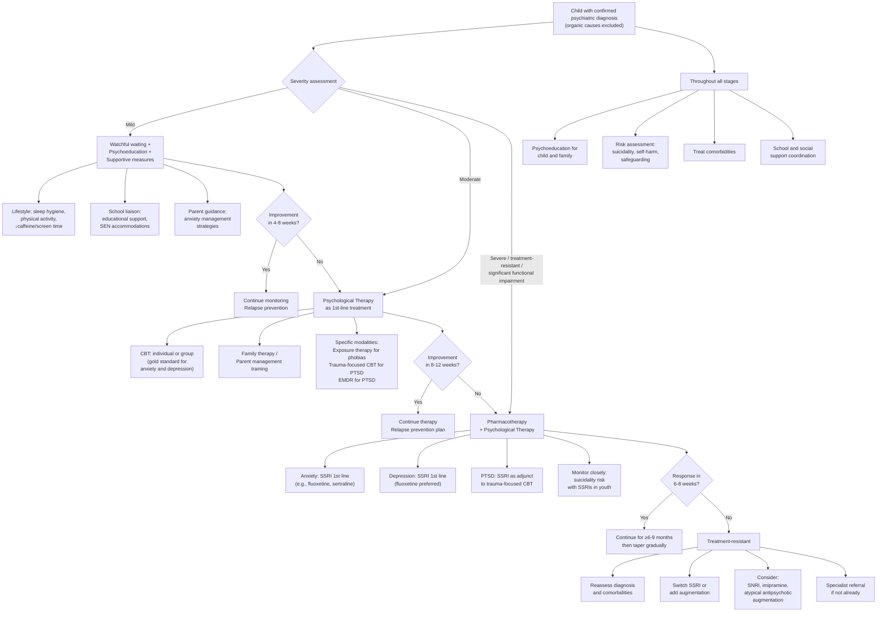
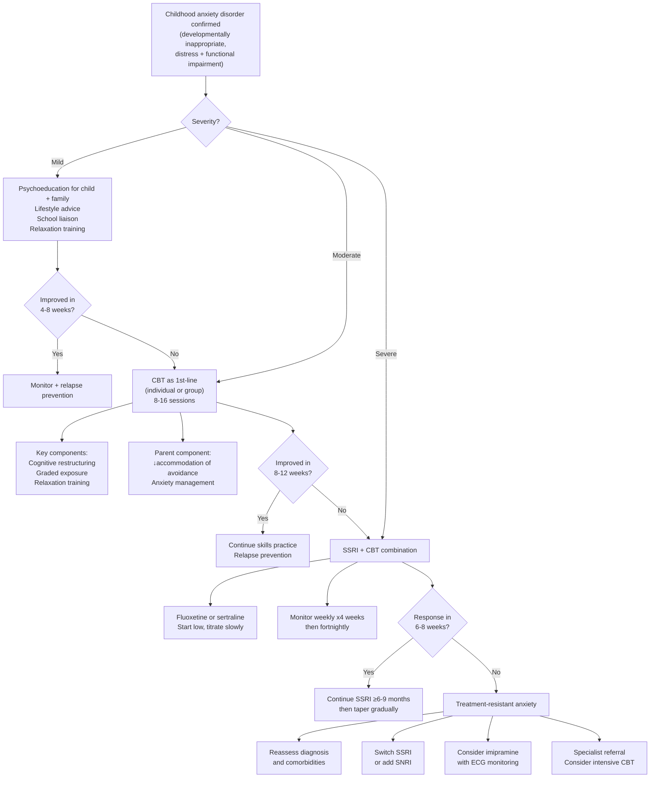
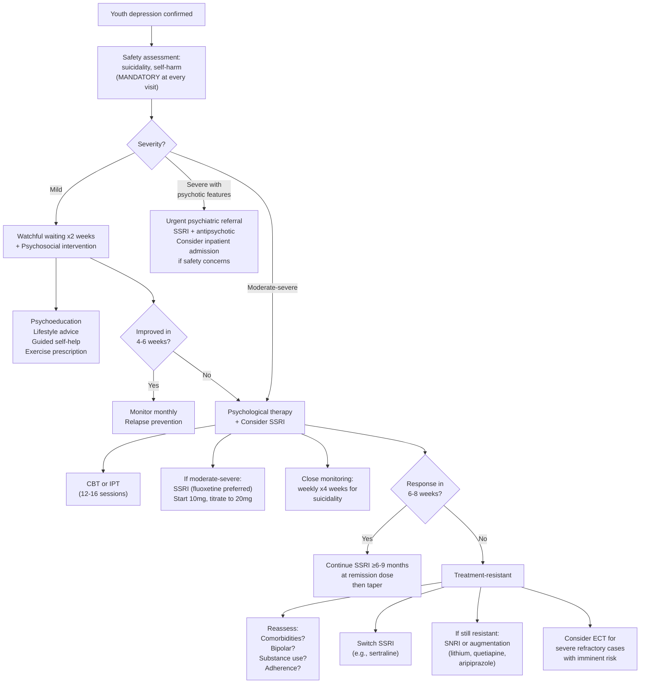

## Management Algorithm and Treatment Modalities

### 1. Guiding Principles of Management in Child Psychiatry

Before discussing specific treatments, the overarching framework must be understood:

**Why is management in child psychiatry different from adults?**

1. **The developing brain responds differently to psychotropics**: Receptor density, neurotransmitter systems, and hepatic metabolism all change with age. Children are not small adults pharmacologically — they often metabolise drugs faster (higher hepatic blood flow relative to body mass) but their brains are more sensitive to certain effects (e.g., behavioural activation from SSRIs).

2. **Psychotherapy is first-line for most conditions**: The immature but plastic brain is highly amenable to learning-based interventions. Environmental modification (changing the child's world) is often more effective than pharmacological modification (changing the child's brain chemistry).

3. **The family is the patient**: Unlike adult psychiatry where the individual is the unit of treatment, in child psychiatry the family system is the therapeutic target. A child's symptoms often reflect family dysfunction, and treatment must address the system, not just the child.

4. **Multimodal treatment is the norm**: Most children benefit from a combination of psychoeducation, psychological therapy, environmental modification, educational support, and (when indicated) pharmacotherapy.

5. **The hierarchy of management** — think of it as concentric rings:
   - **Innermost ring**: Psychoeducation (always)
   - **Second ring**: Environmental and educational support
   - **Third ring**: Psychological therapy (CBT, behavioural therapy, family therapy)
   - **Outermost ring**: Pharmacotherapy (reserved for moderate-severe cases or treatment resistance)

---

### 2. Management Algorithm — Overview

---

### 3. Non-Pharmacological Treatment Modalities

#### 3.1 Psychoeducation (Universal — All Severities)

| Component | Rationale | Practical Content |
|---|---|---|
| **For the child** | Understanding reduces fear; fear of the unknown amplifies anxiety | Age-appropriate explanation of what anxiety/depression is; normalising the experience; teaching that physical symptoms have a brain-based explanation |
| **For parents** | Parents are co-therapists; their response to the child's symptoms can maintain or extinguish them | Education about the condition, its course, and prognosis; teaching parents not to accommodate avoidance (accommodation reinforces anxiety); modelling calm responses |
| **For school** | School is where symptoms most commonly manifest | Informing teachers about the child's condition; requesting reasonable accommodations; coordinating return-to-school plans for school refusers |

> **Why does accommodation reinforce anxiety?** If a parent allows the child to stay home every time they feel anxious about school, the child learns: "Anxiety → avoidance → relief." This is **negative reinforcement** (the behaviour of avoidance is strengthened by removal of the aversive stimulus). Psychoeducation teaches parents to support the child through the anxiety rather than helping them escape it.

#### 3.2 Cognitive Behavioural Therapy (CBT) — The Cornerstone

***CBT is the main psychological treatment for anxiety disorders*** [1][15][16].

**Why CBT works in children (first-principles reasoning):**

CBT targets the cognitive-behavioural cycle that maintains psychiatric symptoms:

1. **Cognitive component**: Identifies and challenges distorted thinking patterns (e.g., catastrophising: "If mum doesn't pick me up, something terrible will happen"; overgeneralisation: "I failed one test, so I'll fail everything")
2. **Behavioural component**: Gradually exposes the child to feared situations (exposure therapy) to break the avoidance-reinforcement cycle

The developing brain is highly plastic — children can learn new cognitive patterns more readily than adults. CBT essentially "retrains" the prefrontal cortex to regulate the amygdala more effectively.

**Specific CBT techniques used in child psychiatry:**

| Technique | Mechanism | Indication |
|---|---|---|
| **Psychoeducation** (within CBT) | Understanding the anxiety cycle (trigger → thought → feeling → behaviour) | All anxiety disorders, depression |
| **Cognitive restructuring** | Identifying automatic negative thoughts, evaluating evidence for/against, generating balanced alternatives | GAD, social anxiety, depression |
| **Graded exposure / systematic desensitisation** | Constructing a "fear hierarchy" and gradually exposing the child to feared stimuli, starting from least to most anxiety-provoking. With repeated exposure without catastrophic outcome, the amygdala's fear response **habituates** (fear extinction learning) | Specific phobias, separation anxiety, social anxiety, selective mutism, PTSD |
| **Behavioural experiments** | Testing catastrophic predictions in real life (e.g., "Let's see what happens if you go to school without mum — will something bad really happen?") | All anxiety disorders |
| **Relaxation training** [1] | Progressive muscle relaxation, diaphragmatic breathing → activates parasympathetic nervous system → counteracts sympathetic arousal | All anxiety disorders, as an adjunct |
| **Social skills training** | Modelling, role-playing, and practising social interactions | Social anxiety, selective mutism |
| **Activity scheduling / behavioural activation** | Scheduling pleasant and mastery activities to counteract withdrawal and anhedonia | Depression (the behavioural component of CBT for depression) |
| **Problem-solving skills training** | Teaching step-by-step approach to interpersonal problems [15] | Conduct disorders, depression, adjustment |

<Callout title="Exposure Therapy — The Most Important Single Technique">
Exposure therapy is the single most effective component of CBT for anxiety disorders. The principle is simple but counterintuitive for families: **you must approach what you fear to overcome it**. Avoidance maintains anxiety; exposure extinguishes it.

The neuroscience: during exposure, the amygdala initially fires (fear response). But with repeated exposure without the feared outcome occurring, the **ventromedial prefrontal cortex** learns a new "safety" association that **inhibits** the amygdala. This is called **fear extinction** — it doesn't erase the original fear memory but creates a competing safety memory that suppresses it.

This is why exposure must be:
1. **Gradual** (starting with manageable anxiety, not overwhelming)
2. **Repeated** (one exposure isn't enough — the extinction memory needs consolidation)
3. **Prolonged** (the child must stay in the situation long enough for anxiety to naturally decrease — this is called **habituation**)
4. **Without safety behaviours** (if the child has mum on the phone the whole time, they attribute their safety to mum, not to the situation being safe)
</Callout>

#### 3.3 Trauma-Focused CBT (TF-CBT) — For PTSD and Acute Stress Disorder

***Trauma-focused CBT is considered first-line treatment for PTSD*** [9][16].

| Component | Description | Mechanism |
|---|---|---|
| **Psychoeducation** | Educating child and family about normal stress reactions and their cognitive underpinnings [9] | Normalisation reduces shame and fear; understanding the "why" of symptoms is itself therapeutic |
| **Cognitive restructuring** | ***Addressing maladaptive or unrealistic appraisals by the patient towards the trauma, their response to the event, and fears of potential future harm*** [9] | Corrects distorted cognitions (e.g., "It was my fault," "The world is completely dangerous") |
| **Trauma narrative** | The child constructs a coherent narrative of the traumatic event with the therapist's guidance | Verbal processing of the trauma allows the hippocampus to properly "contextualise" the fear memory — moving it from a raw, fragmented emotional memory to a coherent autobiographical memory |
| **Exposure therapy** | ***Assisting the patient in confronting feared memories and situations; allows emotional processing of emotional response following exposure to related cues*** [9] | Fear extinction (same principle as for anxiety disorders) |
| **Parent component** | Training parents to respond supportively; managing their own distress | Parents' emotional reactions directly influence the child's recovery |
| **Safety planning** | Addressing ongoing safety concerns, developing coping strategies | Practical and essential; no therapy works if the child is still in danger |

***EMDR (Eye Movement Desensitisation and Reprocessing)*** is also effective for PTSD [9]:
- ***Involves: patient imagines a scene from the trauma, focuses on accompanying cognition and arousal, while the therapist moves two fingers across the patient's visual field and instructs the patient to track the fingers*** [9]
- ***Sequence repeated until anxiety decreases, with patient instructed to generate a more adaptive thought*** [9]
- ***Most studies show it is efficacious in PTSD, superior to other less-specific psychotherapy*** [9]
- Mechanism debated — may work through dual-attention (the eye movements tax working memory, reducing the vividness and emotionality of the trauma memory during reprocessing)

<Callout title="Critical Incident Stress Debriefing — A Common Mistake" type="error">
***Critical incident stress debriefing (CISD) — going through traumatic events together with the victim — although widely used, has NOT been shown to be helpful in reducing psychological distress*** [9]. In fact, some evidence suggests it may be harmful by re-traumatising individuals. Do **not** recommend routine debriefing for all trauma-exposed children. Instead, use **psychological first aid** (practical support, safety, connection) and monitor for development of ASD/PTSD symptoms.
</Callout>

#### 3.4 Family-Based Interventions

| Modality | Mechanism | Indication |
|---|---|---|
| **Family therapy** | Addresses dysfunctional family dynamics that maintain the child's symptoms; reduces expressed emotion (criticism, hostility, overinvolvement) | Separation anxiety (anxious parent-child dyad), family conflict contributing to depression, attachment disorders, conduct disorders |
| **Parent management training (PMT)** [15] | Based on **social learning theory** (operant conditioning) — teaches parents to: **promote desirable behaviour through attention and rewards** ("catch your child being good"), **extinguish unwanted behaviour through selective ignoring, withdrawal of privileges, time-out** [15] | ODD/CD (mainstay), ADHD (adjunct), anxiety disorders (teaching parents not to accommodate avoidance) |
| ***Family or carer-focused treatment*** [17] | Psychoeducation, communication training, problem-solving skills | Bipolar disorder, psychotic disorders, severe depression |
| ***Psychoeducation for families*** [17][18] | Education about the illness, its course, treatment, relapse signs | All child psychiatric conditions |

#### 3.5 School-Based and Environmental Interventions

| Intervention | Rationale |
|---|---|
| **Educational support** [1] | Children with psychiatric conditions often underperform academically — not because of lack of ability but because symptoms interfere with learning. Accommodations (extra time, reduced workload, exam arrangements) reduce stress and improve functioning |
| **Special educational needs (SEN) accommodations** | Many child psychiatric conditions (ADHD, ASD, severe anxiety) qualify as SEN under Hong Kong's inclusion education policy [15]. Schools must provide appropriate support |
| **Gradual return-to-school programme** | For school-refusing children, abrupt forced return is counterproductive (too much exposure too fast → overwhelm → worsening). A graded plan (visiting school briefly → attending part-time → full-time) follows exposure therapy principles |
| **Peer support and social skills groups** | For socially anxious or isolated children; provides structured social practice in a safe environment |

#### 3.6 Other Psychotherapeutic Approaches

| Modality | Mechanism | Indication |
|---|---|---|
| ***Mindfulness-based therapy*** [16] | Training attention to present-moment experience without judgment; reduces rumination and anticipatory anxiety; strengthens prefrontal regulatory control over amygdala | Anxiety, depression, relapse prevention |
| **Interpersonal therapy (IPT)** | Focuses on current interpersonal problems (grief, role transitions, interpersonal disputes, skill deficits) [15] | Adolescent depression |
| **Play therapy** | For younger children who cannot engage in verbal CBT; uses play as the medium for emotional expression and processing | Pre-school anxiety, trauma, attachment difficulties |
| **Supportive psychotherapy / counselling** | Empathic listening, validation, problem-solving support | Adjustment disorders, mild presentations, as adjunct [10] |

---

### 4. Pharmacological Treatment Modalities

#### 4.1 General Principles of Pharmacotherapy in Children

1. **Pharmacotherapy is rarely first-line** — it is reserved for moderate-severe cases, cases with significant functional impairment, or when psychotherapy alone has failed [1]
2. **"Start low, go slow"** — but children may ultimately need weight-adjusted doses similar to or higher than adult doses due to faster hepatic metabolism
3. **Informed consent** — from parents AND age-appropriate assent from the child
4. **Close monitoring** — especially in the first weeks, for suicidality (SSRIs) and side effects
5. **Time-limited trials** — reassess the need for medication periodically; many childhood conditions are self-limiting

#### 4.2 SSRIs — The Workhorse of Child Psychopharmacology

"SSRI" → **S**elective **S**erotonin **R**euptake **I**nhibitor → selectively blocks the serotonin transporter (SERT) at the presynaptic terminal → ↑synaptic 5-HT availability → downstream receptor changes → therapeutic effect [15].

| Property | Details |
|---|---|
| **Mechanism** | Blocks SERT → ↑5-HT in synaptic cleft → desensitisation of 5-HT1A autoreceptors over 2-4 weeks → enhanced 5-HT neurotransmission → anxiolytic and antidepressant effects |
| **Why 2-4 week delay?** | Acute SERT blockade paradoxically activates 5-HT1A autoreceptors → initially DECREASES 5-HT firing. Only after autoreceptor desensitisation does 5-HT transmission actually increase. This explains the delayed therapeutic effect and the initial worsening of anxiety |
| **First-line for** | Childhood anxiety disorders (moderate-severe) [1], youth depression (moderate-severe) [1], PTSD (as adjunct to TF-CBT) [9], OCD |

**Specific SSRI Agents:**

| Agent | FDA/NICE Approval in Youth | Notes |
|---|---|---|
| **Fluoxetine** ("fluox" = flow/fluid — conceptually "gets serotonin flowing") | **Only SSRI FDA-approved for depression in children ≥ 8 years** and adolescents; also approved for OCD ≥ 7 years | Longest half-life (1-3 days active; norfluoxetine metabolite 4-16 days) → least withdrawal symptoms; best evidence base in youth depression |
| **Sertraline** | FDA-approved for OCD in children ≥ 6 years; strong evidence for anxiety disorders in children | Often preferred for anxiety; shorter half-life than fluoxetine |
| **Fluvoxamine** | FDA-approved for OCD in children ≥ 8 years | Potent CYP1A2 inhibitor — drug interaction considerations |
| **Escitalopram** | FDA-approved for depression in adolescents ≥ 12 years | S-enantiomer of citalopram; cleaner pharmacology |
| **Citalopram** | Not FDA-approved in youth; used off-label | QTc prolongation risk at higher doses → ECG monitoring |

<Callout title="The SSRI Suicidality Warning — Critical Exam Topic" type="error">
In 2004, the FDA issued a **Black Box Warning** for all antidepressants used in children and adolescents (extended to age 24 in 2007): **SSRIs may increase suicidal thinking and behaviour in the first few weeks of treatment**, especially in youth.

**Why does this happen?**
- **Activation before mood improvement**: SSRIs can increase energy and reduce psychomotor retardation before improving mood. A severely depressed adolescent who was too lethargic to act on suicidal thoughts may now have the energy to do so, while still feeling hopeless
- **Akathisia/agitation**: Some patients experience restlessness and inner agitation (akathisia-like effect) which can be distressing and increase suicidal risk
- **Paradoxical anxiety**: The initial increase in synaptic 5-HT (before autoreceptor desensitisation) can worsen anxiety transiently

**Clinical implication**: **Monitor closely in the first 4 weeks** — weekly visits initially, assess for suicidality at every contact, involve parents in monitoring. The benefits of SSRIs in moderate-severe depression and anxiety **outweigh** the risks when properly monitored — undertreated depression itself carries a high suicide risk.

The senior notes state: ***antidepressants for moderate/severe depression → beware of suicidal risk in SSRIs*** [1].
</Callout>

**Side Effects of SSRIs in Children:**

| Side Effect | Mechanism | Management |
|---|---|---|
| **GI symptoms** (nausea, diarrhoea, abdominal pain) | 5-HT3 receptor stimulation in GI tract (most 5-HT in the body is in the gut) | Usually transient (1-2 weeks); take with food; dose titration |
| **Headache** | 5-HT-mediated vasodilation | Usually transient; analgesics if needed |
| **Sleep disturbance** (insomnia or sedation) | 5-HT2 receptor effects (varies by agent) | Give in morning if activating; at night if sedating |
| **Behavioural activation** (agitation, restlessness, disinhibition) | More common in younger children; mechanism unclear but may relate to dopaminergic effects or anxiety worsening | Dose reduction; slow titration; consider switching |
| **Serotonin syndrome** (rare but dangerous) | Excess serotonergic activity (especially with drug combinations) → autonomic instability, myoclonus, altered consciousness | Avoid combining with other serotonergic agents (MAOIs, tramadol, triptans); stop offending agent; supportive care |
| **Emotional blunting** | Excessive serotonergic dampening of emotional range | Dose reduction; consider switching |
| **Discontinuation syndrome** | Abrupt cessation → rapid ↓synaptic 5-HT → dizziness, "brain zaps," irritability, flu-like symptoms | Taper gradually (except fluoxetine which self-tapers due to long half-life) |

#### 4.3 Other Pharmacological Agents

| Agent | Class | Indication in Children | Mechanism | Cautions/Contraindications |
|---|---|---|---|---|
| ***Imipramine*** [1] | Tricyclic antidepressant (TCA) | Separation anxiety disorder; enuresis; treatment-resistant anxiety/depression | Blocks SERT + NRT → ↑5-HT and NA. Also blocks muscarinic, histaminergic, and α-adrenergic receptors (explains side effects) | **Cardiotoxicity** (QTc prolongation, arrhythmias → ECG before and during treatment); anticholinergic effects (dry mouth, constipation, urinary retention); sedation; lethal in overdose (narrow therapeutic index); **not first-line** due to safety concerns |
| ***Anxiolytics (benzodiazepines)*** [1] | GABA-A receptor positive allosteric modulator | ***Generally avoided*** in children [1]; very short-term use only for acute severe anxiety | Enhances GABA-mediated chloride influx → CNS depression → anxiolytic, sedative, muscle relaxant | **Dependence and tolerance** develop rapidly; paradoxical disinhibition in children (opposite of intended effect — child becomes more agitated); sedation impairs learning; cognitive impairment; respiratory depression in overdose |
| ***Serotonergic antidepressants*** [16] | SSRIs/SNRIs | ***OCD treatment*** | Higher doses often needed for OCD than for depression/anxiety (why? OCD may involve deeper serotonergic dysfunction requiring more robust SERT blockade) | As above for SSRIs; SNRIs add NA-related side effects (↑BP, tachycardia) |
| ***Adjunctive antipsychotics*** [16] | Second-generation antipsychotics (SGAs) | ***OCD (augmentation)*** [16]; severe aggression in ASD; treatment-resistant depression (augmentation) | D2 receptor antagonism + 5-HT2A antagonism → modulates dopaminergic and serotonergic circuits | Metabolic syndrome (weight gain, dyslipidaemia, insulin resistance); prolactinaemia; extrapyramidal symptoms; sedation; QTc prolongation. **Monitor**: weight, fasting glucose, lipids, prolactin |
| **Prazosin** | Alpha-1 adrenergic blocker | ***PTSD-related nightmares and sleep disturbance*** [9] | Blocks noradrenergic hyperactivation → ↓nightmare frequency, ↓hyperarousal | Hypotension (especially first dose); dizziness; titrate slowly; monitor BP |
| **Melatonin** | Endogenous hormone | Sleep-onset insomnia (common in anxiety, ADHD, ASD) | Activates MT1/MT2 receptors in SCN → resets circadian clock, promotes sleep onset | Very well tolerated; minimal side effects; not habit-forming |

#### 4.4 Pharmacotherapy by Condition — Summary Table

| Condition | 1st-Line Pharmacotherapy | 2nd-Line / Augmentation | Key Monitoring Points |
|---|---|---|---|
| **Childhood anxiety disorders** | ***SSRI (fluoxetine or sertraline)*** for moderate-severe cases [1] | ***Imipramine*** [1]; SNRI (venlafaxine, duloxetine); ***anxiolytics generally avoided*** [1] | Suicidality in first weeks; efficacy at 4-6 weeks |
| **Youth depression** | ***SSRI (fluoxetine preferred — best evidence)*** for moderate-severe [1] | Switch SSRI; SNRI; augment with lithium, quetiapine, or aripiprazole for treatment-resistant cases [15] | **Suicidality monitoring** — weekly initially; ECG if using TCA; growth/weight |
| **PTSD** | ***SSRI (as adjunct to TF-CBT)*** [9] | ***SGA augmentation*** [9]; prazosin for nightmares [9]; ***BZDs for hyperarousal*** (short-term only) [9] | Suicidality; ongoing safety; comorbid substance use |
| **OCD** | ***Serotonergic antidepressants (SSRI at higher doses)*** [16] | ***Adjunctive antipsychotics (e.g., risperidone, aripiprazole)*** [16]; clomipramine | ***40-60% treatment response*** [16]; monitor metabolic parameters if using SGA |
| **Selective mutism** | SSRI (fluoxetine or sertraline) for severe cases unresponsive to behavioural intervention | — | Most children respond to behavioural approach alone |
| **Attachment disorders (RAD/DSED)** | **No pharmacotherapy for core symptoms** — these are relational disorders requiring relational treatment | Treat comorbidities (e.g., anxiety, ADHD) pharmacologically if present | The treatment is **stable, nurturing caregiving environment** — no pill can substitute for attachment |

<Callout title="Attachment Disorders — Pills Don't Fix Relationships" type="error">
There is no medication that treats the core symptoms of RAD or DSED. These disorders arise from **pathological caregiving**, not from neurotransmitter imbalance. The treatment is providing a **consistent, responsive, nurturing caregiver** — ideally through foster care placement, adoption, or therapeutic parenting programmes. Medications may be used for comorbid conditions (anxiety, ADHD, behavioural dysregulation) but never as standalone treatment for attachment difficulties.
</Callout>

---

### 5. Condition-Specific Management Algorithms

#### 5.1 Childhood Anxiety Disorders

> **Why combine SSRI + CBT for severe anxiety?** The landmark CAMS (Child/Adolescent Anxiety Multimodal Study) trial showed that combination treatment (sertraline + CBT) was superior to either alone, with ~81% response rate vs ~60% for CBT alone or ~55% for sertraline alone. The SSRI lowers the baseline anxiety level, making the child more able to engage in exposure-based CBT.

#### 5.2 Youth Depression

***Approach (adapted from NICE guidelines)*** [15]:

***Prophylaxis*** [15]:
- ***First episode → continue antidepressants for ≥ 6-9 months at dose that induces remission***
- ***≥ 2 episodes with significant functional impairment → continue antidepressants for ≥ 2 years***

<Callout title="Fluoxetine — The Preferred SSRI in Youth Depression">
Among all SSRIs, **fluoxetine** has the strongest evidence base for efficacy in youth depression (the TADS — Treatment for Adolescents with Depression Study — demonstrated superiority of fluoxetine + CBT over all other arms). It is the **only SSRI FDA-approved for depression in children ≥ 8 years**. Other SSRIs have shown more equivocal results in youth depression trials (some studies suggest no benefit over placebo for paroxetine, citalopram in youth), though they may work for anxiety.
</Callout>

#### 5.3 PTSD in Children

***Treatment*** [9][16]:

| Phase | Intervention | Details |
|---|---|---|
| **Acute phase** (within first month — ASD) | ***Trauma-focused CBT as first-line*** [9] | Psychoeducation, cognitive restructuring, exposure therapy. ***Pharmacotherapy generally not considered helpful*** for acute stress disorder [9] |
| **Established PTSD** (> 1 month) | ***Trauma-focused CBT — 1st line*** [9] | 12-16 sessions; includes trauma narrative, in-vivo exposure, cognitive processing |
| | ***EMDR — alternative 1st line*** [9] | Particularly useful if child cannot engage verbally in CBT |
| | ***SSRI — as adjunct/2nd line*** [9] | Sertraline or fluoxetine; addresses comorbid depression, hyperarousal; ***usually as augmentation or 2nd-line to psychotherapy*** [9] |
| **Adjunctive/symptomatic** | ***Prazosin*** for nightmares/sleep [9] | α1-blocker; titrate slowly; monitor BP |
| | ***SGAs*** (e.g., risperidone) [9] | For severe aggression, dissociation, treatment-resistant symptoms; as monotherapy or augmentation |
| | ***BZDs*** [9] | Short-term only for severe hyperarousal; caution re dependence |
| **Comorbidities** | ***Treat comorbid conditions*** [9] | ***Alcohol/substance use disorders, sleep disorders, psychosis*** [9] |

#### 5.4 OCD in Children

***Treatment*** [16]:

- ***40-60% treatment response*** overall [16]
- **1st-line**: ***Behaviour therapy*** (exposure and response prevention, ERP) + ***serotonergic antidepressants*** (SSRI, usually at higher doses than for depression) [16]
- **Augmentation**: ***adjunctive antipsychotics*** (e.g., risperidone, aripiprazole) for partial responders [16]
- **Refractory**: ***psychosurgery (rarely)*** [16] — e.g., anterior cingulotomy or deep brain stimulation; reserved for the most severe, treatment-resistant cases with significant disability

> **Why higher SSRI doses for OCD?** OCD is thought to involve a deeper serotonergic dysfunction in the cortico-striato-thalamo-cortical (CSTC) circuit. The higher dose may be needed to achieve sufficient SERT blockade in these specific circuits to interrupt the obsessional loop.

#### 5.5 Selective Mutism

| Step | Intervention |
|---|---|
| **1st-line** | Behavioural intervention: **graded exposure** to speaking situations (start with whispering → single words → phrases → sentences → spontaneous speech, moving from comfortable settings to challenging ones); "stimulus fading" (gradually introducing new people into situations where the child already speaks) |
| **Family component** | Psychoeducation; reducing parental accommodation (speaking for the child); coaching parents and teachers on how to gently increase verbal demands |
| **School component** | Teacher training; seating arrangements (near trusted peers); avoiding putting child on the spot; reinforcing any verbal communication |
| **2nd-line** | SSRI (fluoxetine or sertraline) for severe/persistent cases unresponsive to behavioural intervention alone |

#### 5.6 Attachment Disorders

| Intervention | Details |
|---|---|
| **Primary treatment** | **Provision of stable, responsive caregiving environment** — this is the treatment, full stop. For children in institutional care: placement in foster family or adoption. For children with caregivers: therapeutic parenting programmes, attachment-based family therapy |
| **Supportive** | Psychoeducation for caregivers about attachment theory and the child's specific needs; managing expectations (recovery takes time, especially for DSED) |
| **Comorbidity treatment** | Pharmacotherapy/CBT for comorbid anxiety, ADHD, depression as needed |
| **What NOT to do** | Do NOT use "holding therapy" or "rebirthing therapy" — these are unproven and potentially harmful. Do not expect rapid results — attachment formation takes months to years |

---

### 6. ***General Treatment Approaches*** — Summary from Lectures

The lecture slides provide a high-level framework applicable across conditions [16]:

***General treatment approaches:***
- ***Pharmacotherapy: Antidepressants, Anxiolytics, Antipsychotics, Mood stabilizers***
- ***Psychotherapy: Cognitive Behaviour Therapy (CBT), Mindfulness-based Therapy***

***Key summary points from the lecture*** [16]:
- ***Anxiety, obsessive-compulsive and trauma and stressor-related disorders are common***
- ***There are significant comorbid psychiatric conditions associated with anxiety disorders***
- ***Screening questions can help identify or rule out diagnoses***
- ***There are many effective treatments including psychotherapy and psychopharmacology***
- ***There is a huge amount of suffering associated with these disorders***

***Management of bipolar disorder (relevant when BAD presents as juvenile depression)*** [17][18]:
- ***Early diagnosis and maintenance treatment***
- ***Watch out for side effects and the need of alternative treatments***
- ***Deal with stigma and poor drug compliance***
- ***Provide psychoeducation (individual and family)***
- ***Pay attention to stress coping, interpersonal relationship, lifestyle regularity and other risk factors of relapse***
- ***Recognise and treat comorbidities, e.g. anxiety disorder, sleep problem, suicidal risk, substance abuse***

---

### 7. Prognosis

| Condition | Prognosis |
|---|---|
| **Childhood anxiety disorders** | **Nearly 2/3 expected to disappear within 3-5 years**, but ***~1/3 of them will have other categories of anxiety disorders at follow-up*** [1]. This means anxiety often transforms rather than truly resolves — a child with separation anxiety may later develop social anxiety or GAD |
| **Youth depression** | **Episodic relapsing course** — majority recover within < 3 months but ***15% lasting > 18 months*** [1]. High recurrence rate (50-70% will have another episode within 5 years). ***~25% of BAD first presents as juvenile depression*** [1] |
| **PTSD** | Variable; many children recover with appropriate treatment within 6-12 months. Chronicity is more likely with more severe trauma, ongoing adversity, and lack of social support |
| **OCD** | ***40-60% treatment response*** [16]; better prognosis with later onset, precipitating event, good adjustment, episodic symptoms |
| **Selective mutism** | Many improve with appropriate intervention; may persist into adolescence if untreated; associated with ongoing social anxiety even after mutism resolves |
| **Attachment disorders** | RAD generally improves with stable caregiving; DSED is more "sticky" and may persist even after placement in nurturing environment |

---

<Callout title="High Yield Summary">

**Management Principles:**
- **Psychoeducation is universal** — for child, parents, and school
- **CBT is 1st-line** for anxiety, depression, PTSD, OCD in children
- **Pharmacotherapy reserved for moderate-severe** or treatment-resistant cases
- **SSRI is 1st-line pharmacotherapy** for anxiety, depression, PTSD, OCD — fluoxetine is preferred for depression (only SSRI FDA-approved for youth depression)
- **SSRI suicidality risk**: Black Box Warning; monitor weekly for first 4 weeks; benefits outweigh risks when properly monitored
- **Imipramine**: 2nd-line for anxiety; cardiotoxicity risk requires ECG monitoring
- **Benzodiazepines generally avoided** in children (dependence, paradoxical disinhibition, cognitive impairment)
- **Attachment disorders**: no pill fixes attachment — treatment is stable nurturing caregiving
- **PTSD**: TF-CBT or EMDR 1st-line; SSRI as adjunct; critical incident debriefing is NOT helpful
- **OCD**: higher SSRI doses needed; 40-60% response; augment with SGA if partial response
- **Duration**: continue SSRI ≥ 6-9 months after remission; ≥ 2 years if recurrent episodes

**Prognosis:**
- Childhood anxiety: 2/3 resolve in 3-5 years but 1/3 develop other anxiety disorders
- Youth depression: episodic relapsing; 25% may be bipolar
- OCD: 40-60% treatment response
</Callout>

---

<ActiveRecallQuiz
  title="Active Recall - Management of Child Psychiatric Conditions"
  items={[
    {
      question: "What is the first-line treatment for moderate childhood anxiety disorders, and what is the most important specific technique within this treatment?",
      markscheme: "CBT is first-line. The most important specific technique is graded exposure therapy (systematic desensitisation). This works by constructing a fear hierarchy and gradually exposing the child to feared stimuli. With repeated exposure without catastrophic outcome, the VMPFC learns a safety association that inhibits the amygdala (fear extinction learning)."
    },
    {
      question: "Which SSRI is preferred for youth depression and why? What critical safety concern must be monitored?",
      markscheme: "Fluoxetine is preferred because it has the strongest evidence base (TADS trial) and is the only SSRI FDA-approved for depression in children aged 8 and above. The critical safety concern is the Black Box Warning for increased suicidal thinking/behaviour in the first weeks of treatment. Monitor weekly for the first 4 weeks. Mechanism: activation before mood improvement, akathisia-like effects, and paradoxical anxiety worsening."
    },
    {
      question: "A child with PTSD is referred for management. Outline the first-line treatment and explain why critical incident stress debriefing should NOT be used.",
      markscheme: "First-line is trauma-focused CBT (including psychoeducation, cognitive restructuring, trauma narrative, and exposure therapy). EMDR is an alternative. SSRIs are used as adjunct or second-line. Critical incident stress debriefing (going through events with the victim) has NOT been shown to reduce psychological distress and may be harmful by re-traumatising individuals. Instead, use psychological first aid and monitor for ASD/PTSD development."
    },
    {
      question: "Why are benzodiazepines generally avoided in children with anxiety disorders? Name three specific concerns.",
      markscheme: "1) Dependence and tolerance develop rapidly; 2) Paradoxical disinhibition - children may become more agitated rather than calm (opposite of intended effect); 3) Sedation and cognitive impairment which impairs learning and academic performance. Additional concerns: respiratory depression risk, interference with exposure-based therapy (reduces anxiety that is needed for fear extinction learning)."
    },
    {
      question: "Explain why there is no pharmacotherapy for the core symptoms of Reactive Attachment Disorder. What is the primary treatment?",
      markscheme: "RAD arises from pathological caregiving (neglect, institutional care, repeated caregiver changes), not from neurotransmitter imbalance. The core problem is failure to develop selective attachment due to environmental deprivation. No medication can substitute for a consistent, responsive caregiving relationship. The primary treatment is provision of a stable, nurturing caregiver (foster care, adoption, therapeutic parenting). Medications may only be used for comorbid conditions such as anxiety or ADHD."
    },
    {
      question: "State the recommended duration of SSRI treatment after remission of a first depressive episode in an adolescent, and how this changes for recurrent episodes.",
      markscheme: "First episode: continue SSRI for at least 6-9 months at the dose that induced remission, then taper gradually. For 2 or more episodes with significant functional impairment: continue SSRI for at least 2 years. Rationale: depression has a high relapse rate (50-70% within 5 years in youth), and premature discontinuation significantly increases relapse risk."
    }
  ]}
/>

## References

[1] Senior notes: ryanho-psych.md (Section 12.5 Other Psychiatric Conditions in Child Psychiatry)
[9] Senior notes: ryanho-psych.md (Section on PTSD treatment — acute stress disorder and PTSD)
[10] Senior notes: ryanho-psych.md (Section on Adjustment Disorder management)
[15] Senior notes: ryanho-psych.md (Sections on Treatment in Psychiatry — antidepressants, psychotherapy, depression management, ADHD non-pharmacological interventions, parent management training)
[16] Lecture slides: GC 171. Stress-related disorders and obsessive-compulsive disorder (Post-traumatic stress disorder adjustment disorder, acute stress disorder)_rev.pdf (p17, p41, p43)
[17] Lecture slides: GC 163. I am a superman Bipolar disorder.pdf (p36, p47)
[18] Lecture slides: GC 163. I am a superman Bipolar disorder.pdf (p64)
