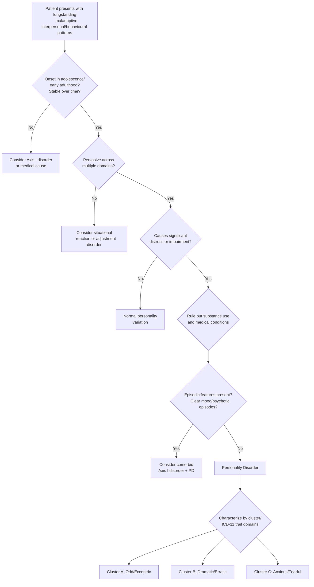

## Differential Diagnosis of Personality Disorders

The differential diagnosis of personality disorders is one of the trickiest areas in psychiatry. Why? Because personality disorders are **pervasive, stable, and ego-syntonic** — they look like "who the person is." The challenge is distinguishing them from episodic psychiatric illnesses that can *mimic* personality pathology, from normal personality variation, from each other, and from medical/organic causes. Let's work through this systematically.

### The Core Diagnostic Dilemma: Trait vs. State

Before diving into specific differentials, understand the fundamental question you must answer:

> **"Is this a stable, enduring pattern (TRAIT = personality disorder) or an episodic change from baseline (STATE = Axis I disorder)?"**

This single question drives the entire differential diagnosis of personality disorders. A person in a major depressive episode can appear dependent, avoidant, or even borderline. A person in a manic episode can appear narcissistic or antisocial. A person with chronic PTSD can appear paranoid or emotionally unstable. You must always ask: ***"Was this person like this BEFORE the illness?"*** [2]

This is why **premorbid personality** assessment and **longitudinal history** (including collateral from informants) are absolutely essential [2].

---

### Systematic Approach to Differential Diagnosis

The differential diagnosis can be organized into several broad categories:

1. **Other personality disorders** (within and across clusters)
2. **Episodic (Axis I) psychiatric disorders mimicking PD**
3. **Neurodevelopmental disorders**
4. **Substance use disorders**
5. **Medical/organic conditions**
6. **Normal personality variation and cultural considerations**

---

### 1. Distinguishing Between Personality Disorders (Within and Across Clusters)

This is the first layer of differential — once you've decided it's a personality disorder, *which one*? Recall that ***clinicians often agree on the presence of PD but disagree on subtype*** [2]. There is enormous overlap, which is exactly why ICD-11 moved to a dimensional model.

#### 1.1 Within Cluster A

| Comparison | Key Distinguishing Features |
|---|---|
| **Paranoid vs. Schizotypal** | Both are suspicious, but schizotypal has additional **odd/magical thinking**, **perceptual disturbances**, and **eccentric behaviour**. Paranoid PD has clear, focused suspicion without the "oddness" |
| **Schizoid vs. Schizotypal** | Both are socially withdrawn, but schizoid is **emotionally flat and uninterested** while schizotypal is **odd, eccentric** with quasi-psychotic features. Schizoid lacks the cognitive/perceptual distortions of schizotypal |
| **Paranoid vs. Schizoid** | Paranoid is **actively suspicious** and **hypervigilant**; schizoid is **passively detached** and **indifferent** |

#### 1.2 Within Cluster B

| Comparison | Key Distinguishing Features |
|---|---|
| **Borderline vs. Antisocial** | Both are impulsive, but BPD impulsivity is driven by **emotional dysregulation and fear of abandonment**, while ASPD impulsivity is driven by **callous disregard and sensation-seeking**. BPD patients feel remorse; ASPD patients characteristically **do not** |
| **Borderline vs. Histrionic** | Both are emotionally expressive and attention-seeking, but BPD has **self-destructiveness, identity disturbance, chronic emptiness, and splitting** that histrionic lacks. Histrionic affect is **shallow and performative**; BPD affect is **intense and chaotic** |
| **Narcissistic vs. Antisocial** | Both can be exploitative and lack empathy. However, narcissistic PD is driven by **need for admiration and grandiosity** whereas ASPD is driven by **disregard for rules and rights of others**. Narcissistic patients rarely engage in criminal behaviour for its own sake |
| **Narcissistic vs. Histrionic** | Both seek attention, but narcissistic PD seeks **admiration for perceived superiority** while histrionic PD seeks **any attention through emotional drama and seductiveness** |

#### 1.3 Within Cluster C

| Comparison | Key Distinguishing Features |
|---|---|
| **Avoidant vs. Dependent** | Both are insecure and need reassurance. Avoidant PD **avoids relationships** due to fear of rejection; dependent PD **clings to relationships** due to fear of being alone. Avoidant patients withdraw; dependent patients over-attach |
| **OCPD vs. Avoidant** | Both can appear rigid. OCPD rigidity is about **control and perfectionism** (ego-syntonic); avoidant rigidity is about **avoiding criticism and rejection** |
| **OCPD vs. Dependent** | OCPD wants to **control everything themselves**; dependent PD wants **others to take control** — they are virtually opposite in this dimension |

#### 1.4 Critical Cross-Cluster Distinctions

| Comparison | Key Distinguishing Features | Why It Matters |
|---|---|---|
| **Schizoid vs. Avoidant** | Schizoid: **does not want** relationships (no distress). Avoidant: **wants but fears** relationships (significant distress) [2] | One of the most tested distinctions in exams |
| **OCPD vs. OCD** | OCPD: **ego-syntonic** traits (perfectionism, control — "I'm right, everyone else is sloppy"). OCD: **ego-dystonic** (intrusive thoughts are unwanted and distressing) [2] | Most commonly confused distinction |
| **Paranoid PD vs. Narcissistic PD** | Both can be hostile and grandiose. Paranoid PD is driven by **suspicion** ("they're out to get me"); narcissistic PD is driven by **entitlement** ("I deserve better than this") | Different treatment approaches |
| **Borderline PD vs. Schizotypal PD** | Both can have transient psychotic-like experiences. In BPD, these are **stress-related and brief**; in schizotypal PD, they are **chronic, trait-like, and associated with odd beliefs/magical thinking** | Prognostic implications — schizotypal can progress to schizophrenia |

---

### 2. Axis I Psychiatric Disorders Mimicking Personality Disorders

This is where the most clinically important differential diagnoses lie. The key principle: **an Axis I disorder can mimic personality pathology when it is chronic, undertreated, or has early onset**.

#### 2.1 Mood Disorders

##### Borderline PD vs. Bipolar Disorder

This is the **single most important differential** in personality disorder diagnosis, and it appears repeatedly in lectures and exams [13][14].

***Bipolar spectrum: bothered by frequent mood changes, can be mistaken as borderline personality disorder*** [14]

| Feature | Borderline PD | Bipolar Disorder |
|---|---|---|
| **Mood shift duration** | **Hours** (rarely > 24 hours) | **Days to weeks** (minimum 4 days for hypomania, 7 days for mania) |
| **Mood shift trigger** | Almost always **interpersonal** ("they abandoned me," "they betrayed me") | May be **spontaneous** or triggered by sleep disruption, stress |
| **Baseline mood** | **Chronic emptiness/dysphoria** | **Euthymic** between episodes |
| **Grandiosity** | Absent (self-image is unstable/negative) | Present in mania/hypomania |
| **Sleep** | Insomnia from distress | **↓Need for sleep** in mania (feels rested on < 4h) |
| **Course** | **Trait-like, stable** over years | **Episodic** with distinct episodes |
| **Identity disturbance** | **Core feature** | Not characteristic |
| **Self-harm** | **Very common**, often chronic and repetitive | Less typical pattern |
| **Family history** | Less likely to have FHx of BAD [2] | Often positive FHx of BAD |
| **Response to mood stabilizers** | Limited (adjunctive role only) | Robust response |

> ***In mania, these S/S usually change quickly in content and seldom outlast mood disruption. In psychotic disorders, psychosis occurs outside of mood disturbances*** [2]

> ***Borderline personality disorder: Often a/w marked affective instability → mimics rapid cycling bipolar disorder. Discerning features: No FHx of BAD; Rapid shifts of mood (e.g. over hours and days); No classic symptoms of mania, e.g. ↑energy, grandiosity; Mood disturbances often triggered by interpersonal issues*** [2]

<Callout title="They Can Co-Exist" type="error">
BPD and bipolar disorder are **not mutually exclusive**. Up to 20% of BPD patients may also have bipolar disorder. The presence of one does not rule out the other. However, ***misdiagnosis is very common → correct dx and Tx often delayed by 5-7y on average*** [2]. Overdiagnosing bipolar when BPD is present leads to unnecessary mood stabilizers; underdiagnosing bipolar when BPD is present leads to missed treatment opportunities.
</Callout>

##### Personality Disorders vs. Depressive Disorders

- **Chronic/undertreated depression** can look like avoidant PD (social withdrawal), dependent PD (helplessness), or even borderline PD (irritability, emptiness)
- ***Dysthymia (persistent depressive disorder)***: Persistent low mood for ≥2 years may be confused with a "depressive personality." The key is that dysthymia has an identifiable onset and represents a change from premorbid baseline, whereas PD traits were present *before* mood symptoms [2][15]
- ***Neuroticism*** overlaps heavily with both depression and Cluster C PDs [2][15]
- Key differentiator: In depression, the symptoms **remit** (at least partially) with treatment. Personality traits **persist** even when mood improves

##### Personality Disorder vs. Mania/Hypomania

***Personality disorder with prominent irritability*** is listed as a differential of manic episode in lecture slides [13]:
- ***Differential diagnosis of manic episode***: ***Personality disorder with prominent irritability*** [13]
- Discerning features: personality-driven irritability is **constant and trait-like**; manic irritability is **episodic, with associated features** (↑energy, ↓need for sleep, grandiosity, pressured speech)

#### 2.2 Psychotic Disorders

##### Schizotypal PD vs. Schizophrenia

- ***Schizotypal (personality) disorder: a personality disorder (trait-like, > 2y) characterized by eccentric behaviour, anomalies of thinking and affect that resembles schizophrenia but without overt schizophrenia*** [2]
- ***Chronic with fluctuating course, may evolve into overt schizophrenia*** [2]
- ***Considered part of schizophrenic spectrum*** [2]
- Key differences: Schizotypal PD has **subthreshold** psychotic-like experiences (ideas of reference, not delusions; unusual perceptual experiences, not hallucinations). Schizophrenia has **frank psychosis** meeting Criterion A (delusions, hallucinations, disorganized speech/behaviour, negative symptoms) for ≥1 month

##### Paranoid PD vs. Delusional Disorder

- Paranoid PD involves **overvalued ideas** (suspicion, mistrust) — beliefs that are strongly held but not of delusional intensity; reality testing is partially preserved
- Delusional disorder involves **fixed, unshakeable delusions** (e.g., persecutory) for ≥1 month (DSM-5) / ≥3 months (ICD-10), with relatively preserved functioning apart from the delusion
- Paranoid PD has a **genetic relationship with delusional disorder** [2] — they may be on the same spectrum

##### BPD Transient Psychosis vs. Psychotic Disorders

- BPD can feature ***transient, stress-related paranoid ideation or severe dissociative symptoms*** — these are **brief** (hours to days), triggered by **interpersonal stress**, and resolve when the stressor is removed
- In schizophrenia and related psychotic disorders, psychosis is **sustained**, often independent of identifiable stressors, and requires antipsychotic treatment

#### 2.3 Anxiety Disorders

##### Avoidant PD vs. Social Anxiety Disorder (SAD)

- There is **massive overlap** — many experts consider avoidant PD to be the severe end of the social anxiety spectrum
- Both involve fear of negative evaluation and social avoidance
- ***DDx for avoidance features: Personality disorder, psychosis, depression*** [16]
- Key differences:
  - Avoidant PD: **Pervasive** feelings of inadequacy/inferiority across **all life domains** (not just social performance); identity is built around being "defective"
  - SAD: Fear is more specifically related to **social performance situations** (public speaking, eating in public)
  - In practice, most patients with avoidant PD also meet criteria for SAD

##### OCPD vs. OCD vs. GAD

- OCPD: Ego-syntonic perfectionism without intrusive thoughts or compulsions
- OCD: Ego-dystonic intrusive thoughts with compulsive rituals. ***Recurrent thoughts/ruminations and avoidant behaviours may also be present. However, content tends to be related to real-life concerns in GAD compared to odd, irrational or magical beliefs in OCD*** [2]
- GAD: Pervasive worry about real-life concerns (health, finances, family) — not the focused, irrational obsessions of OCD or the rigid perfectionism of OCPD

##### Anxiety Theme as a Clue to Diagnosis

This is a useful clinical framework from the senior notes [2]:
- ***Separation or abandonment → borderline, dependent personality disorder*** [2]
- ***Being rejected or inadequate → avoidant personality disorder*** [2]
- Worry about gaining weight → eating disorder
- Worry about serious illness → hypochondriacal disorder
- Fear of being poisoned/killed → paranoid schizophrenia
- Ruminatory guilt/worthlessness → depression
- Associated with obsessional thoughts → OCD

#### 2.4 Trauma and Stress-Related Disorders

##### Complex PTSD vs. Borderline PD

This is an increasingly recognized and clinically important distinction (especially since ICD-11 introduced Complex PTSD as a formal diagnosis):

| Feature | Complex PTSD | Borderline PD |
|---|---|---|
| **Core issue** | Disturbances in self-organization (DSO) secondary to trauma | Emotional dysregulation + identity disturbance + interpersonal dysfunction |
| **Affect dysregulation** | Present (a DSO symptom) | Present (a core feature) |
| **Negative self-concept** | Present — "I am damaged/worthless" | Present — unstable self-image |
| **Relationship difficulties** | Present — avoidance of closeness | Present — chaotic oscillation between idealization and devaluation |
| **Self-harm** | Less prominent | Very common, often chronic |
| **Abandonment fears** | Less central | Core feature |
| **Splitting** | Less characteristic | Central defence mechanism |
| **Re-experiencing** | **Core feature** (flashbacks, nightmares) | Not required (though can co-occur) |
| **Trauma history** | Required — prolonged, repeated trauma | Common but not required |

- ***Some personality features may be associated with vulnerability to situational distress that may resemble an adjustment disorder. It is important to understand the lifetime history of personality functioning*** [2]

##### Adjustment Disorder vs. PD Exacerbation

- ***Personality disorder: Some personality features may be a/w vulnerability to situational distress that may resemble an adjustment disorder*** [2]
- Key: In adjustment disorder, the distress is **time-limited** (develops within 3 months of stressor, resolves within 6 months of stressor ending). In PD, the maladaptive patterns were present **before** the stressor and will **persist** after it resolves

#### 2.5 Neurodevelopmental Disorders

##### ADHD vs. Borderline PD / Antisocial PD

***Personality or neurodevelopmental disorders, e.g. ADHD, borderline personality disorder: May have features similar to hypomania, e.g. impulsivity, temper, mood lability. Tends to involve more stable and enduring behaviour pattern (cf episodic in mania)*** [2]

| Feature | ADHD | Borderline PD | Antisocial PD |
|---|---|---|---|
| **Onset** | Childhood (symptoms before age 12) | Late adolescence/early adulthood | Childhood conduct disorder → adult ASPD |
| **Impulsivity** | Pervasive across settings, **not emotionally driven** | Driven by **emotional dysregulation** | Driven by **callous disregard** |
| **Mood lability** | Present but **reactive to frustration/boredom**, not interpersonally triggered | **Interpersonally triggered**, intense, a/w emptiness | Less prominent |
| **Identity** | Stable (though may have low self-esteem from repeated failure) | **Markedly unstable** | Stable (but callous) |
| **Empathy** | Preserved (may appear inattentive to others' needs) | **Variable** — can be empathic but overwhelmed | **Deficient** |
| **Self-harm** | Not typical | Very common | Not typical (though reckless) |
| **Course** | **Chronic from childhood**, often improves with medication | Chronic but may remit over decades | Behavioural features "burn out" after 40 |

> ***ADHD and mania are both a/w distractibility, impulsivity and talkativeness. In BAD, these features tend to occur episodically and may be a/w elated mood and grandiosity*** [2]
> ***ADHD should not have ↑self-esteem, grandiosity, flight of ideas, ↓need of sleep*** [2]

##### Autism Spectrum Disorder (ASD) vs. Cluster A PDs

| Feature | ASD | Schizoid PD | Schizotypal PD |
|---|---|---|---|
| **Social interaction** | Qualitative impairment — **doesn't understand** social cues | **Understands but doesn't care** | **Odd** social interaction with suspicion |
| **Restricted interests** | **Core feature** (repetitive, narrow) | Not typical | Not typical |
| **Communication** | **Pragmatic language difficulties** | Stilted but not odd | **Odd speech** (vague, metaphorical) |
| **Onset** | Childhood (developmental) | Adulthood | Adulthood |
| **Magical thinking** | Not typical | Not typical | **Present** |

---

### 3. Substance Use Disorders

Substance intoxication and withdrawal states can mimic almost any personality disorder:
- **Chronic stimulant use** → paranoid, grandiose, impulsive presentation (mimics Cluster B or paranoid PD)
- **Chronic alcohol/sedative use** → emotional instability, impulsivity, poor interpersonal functioning (mimics BPD)
- **Chronic cannabis use** → amotivation, social withdrawal, odd beliefs (mimics Cluster A or avoidant PD)
- ***Substance/medication-induced*** conditions are listed as a differential of manic episode [13]

Key principle: **substance use effects should diminish after cessation**. Personality traits **persist** regardless of substance use status. Always assess personality when the patient is **sober and stable**, not during active use or withdrawal.

***Sensation-seeking, impulsive personality traits, more extrovert → predispose to experiment with both licit and illicit drugs*** [5] — so substance use and personality disorders frequently co-occur, making the differential even harder.

---

### 4. Medical/Organic Conditions

Organic conditions that can mimic personality disorders or cause personality change:

| Condition | Mechanism | PD Mimic |
|---|---|---|
| **Frontal lobe lesions** (tumour, TBI, stroke) | Damage to prefrontal cortex → disinhibition, impulsivity, emotional lability, apathy | Antisocial PD, BPD, schizoid PD |
| **Temporal lobe epilepsy** | Interictal personality syndrome (Geschwind syndrome): hyperreligiosity, hypergraphia, altered sexuality | Schizotypal PD, OCPD |
| **Thyroid disease** | Hyperthyroidism → anxiety, irritability; hypothyroidism → apathy, withdrawal | Cluster C PDs; schizoid PD |
| **Cushing's disease** | Cortisol excess → emotional lability, depression, irritability | BPD |
| **Huntington's disease** | Early personality and behavioural changes before motor symptoms | Antisocial PD, BPD |
| **Wilson's disease** | Copper deposition in basal ganglia/cortex → personality change, psychiatric symptoms | Various PDs |
| **HIV/neurosyphilis** | Frontal lobe involvement → disinhibition, personality change | Antisocial PD |
| **Multiple sclerosis** | White matter lesions → emotional lability, personality change | BPD |

> ***Organic brain lesion: extreme social disinhibition with no gross mood disorder → frontal lobe pathology. Consider especially middle-aged or older patient with expansive behaviour but no past history of affective disorder*** [2]

<Callout title="Red Flags for Organic Personality Change" type="error">
Always consider organic causes when:
- Personality change has **late onset** (after age 40)
- Change is **abrupt** rather than gradual
- **Neurological signs** are present (seizures, focal deficits, gait abnormality)
- **Cognitive decline** accompanies personality change
- No prior history of personality difficulties
The ICD-10/11 diagnosis "Personality and behavioural disorders due to brain disease, damage, and dysfunction (F07)" exists for these cases.
</Callout>

---

### 5. Normal Personality Variation and Cultural Considerations

Not every unusual personality is a disorder. Remember the diagnostic criteria require:
- **Deviation** from cultural expectations
- **Pervasiveness** across multiple domains
- **Stability** over time
- **Distress or functional impairment**

Cultural considerations are particularly important in Hong Kong:
- **Collectivist values** → what appears "dependent" in a Western framework may be culturally normative
- **Emotional restraint** → what appears "schizoid" or "avoidant" may reflect cultural norms of emotional expression
- **Filial piety** → submissive behaviour toward elders is not dependent PD
- **"Saving face"** → avoidance of social situations where one might be embarrassed does not automatically mean avoidant PD

---

### 6. The Hierarchy of Diagnosis

Remember the **diagnostic hierarchy** in psychiatry [2]: when symptoms can be explained by more than one diagnosis, the higher-order diagnosis takes precedence because treating it often resolves lower-order symptoms. The hierarchy is:

1. **Organic disorders** (delirium, dementia, substance-related)
2. **Psychotic disorders** (schizophrenia, schizoaffective)
3. **Mood disorders** (bipolar, depression)
4. **Anxiety disorders** (GAD, OCD, PTSD)
5. **Personality disorders**

This means: **always rule out higher-order diagnoses before attributing symptoms to a personality disorder**. A paranoid schizophrenic is not diagnosed with paranoid PD. A depressed patient is not diagnosed with avoidant PD just because they're withdrawn during the episode.

However, comorbidity is extremely common — a patient may genuinely have both schizophrenia AND schizotypal PD traits, or both bipolar disorder AND borderline PD.

---

### Summary Table: Key Differential Diagnoses by Cluster

| PD | Most Important Differentials | Key Distinguishing Feature |
|---|---|---|
| **Paranoid PD** | Delusional disorder, paranoid schizophrenia, substance-induced paranoia | PD: overvalued ideas, no frank delusions, stable |
| **Schizoid PD** | Avoidant PD, ASD, schizotypal PD, negative symptoms of schizophrenia | Schizoid: genuinely indifferent to social contact |
| **Schizotypal PD** | Schizophrenia prodrome, schizophrenia, paranoid PD | Schizotypal: subthreshold psychotic experiences, chronic |
| **Antisocial PD** | Substance use, adult ADHD, conduct disorder, narcissistic PD, mania | ASPD: requires conduct disorder before 15; callous lack of remorse |
| **Borderline PD** | Bipolar disorder, complex PTSD, ADHD, histrionic PD, depression | BPD: mood shifts in hours, interpersonally triggered, identity disturbance |
| **Histrionic PD** | BPD, depression, somatic symptom disorder, narcissistic PD | Histrionic: shallow affect, no self-harm, no identity disturbance |
| **Narcissistic PD** | Mania, antisocial PD, histrionic PD | NPD: grandiosity + need for admiration (not just disregard for others) |
| **Avoidant PD** | Social anxiety disorder, schizoid PD, depression, agoraphobia | Avoidant: wants relationships but fears rejection |
| **Dependent PD** | Depression, agoraphobia, borderline PD | Dependent: needs others to take care of them; no splitting/rage |
| **OCPD** | OCD, GAD, ASD, anorexia nervosa | OCPD: ego-syntonic; no obsessions/compulsions |

---

<Callout title="High Yield Summary">

**Core principle**: Trait (stable, lifelong, ego-syntonic) vs. State (episodic, change from baseline, often ego-dystonic). Always assess premorbid personality.

**Top differentials to know cold**:
1. **BPD vs. Bipolar**: Hours vs. days-weeks; interpersonal triggers vs. spontaneous; emptiness vs. euthymic baseline; no grandiosity vs. grandiosity
2. **Schizoid vs. Avoidant**: Doesn't want vs. wants but fears
3. **OCPD vs. OCD**: Ego-syntonic vs. ego-dystonic
4. **Schizotypal vs. Schizophrenia**: Subthreshold psychotic-like experiences vs. frank psychosis
5. **Paranoid PD vs. Delusional Disorder**: Overvalued ideas vs. fixed delusions
6. **Complex PTSD vs. BPD**: Re-experiencing core feature; less splitting/self-harm; requires trauma history
7. **ADHD vs. BPD vs. Bipolar**: ADHD = childhood onset, not emotionally driven; BPD = emotionally driven, identity disturbance; Bipolar = episodic with mania features

**Always rule out**: Organic causes (frontal lobe lesions, thyroid, substance use), especially with late onset or abrupt change.

**Diagnostic hierarchy**: Organic > Psychotic > Mood > Anxiety > Personality. Rule out higher-order diagnoses first.

</Callout>

---

<ActiveRecallQuiz
  title="Active Recall - Differential Diagnosis of Personality Disorders"
  items={[
    {
      question: "A 25-year-old woman presents with emotional instability, impulsive spending, and frequent relationship breakdowns. Her mood shifts occur over hours and are triggered by arguments with her partner. She has no history of elevated mood, grandiosity, or decreased need for sleep. What is the most likely diagnosis and what key features distinguish it from bipolar disorder?",
      markscheme: "Most likely BPD. Key distinguishing features: (1) Mood shifts last hours not days-weeks, (2) Triggered by interpersonal events, (3) No grandiosity or decreased need for sleep, (4) Baseline is chronic emptiness not euthymia, (5) Identity disturbance present, (6) No family history of bipolar expected. Bipolar mood episodes last days-weeks, may be spontaneous, involve mania features (grandiosity, decreased sleep, increased energy)."
    },
    {
      question: "Explain how you would differentiate schizotypal personality disorder from prodromal schizophrenia in a young person presenting with odd beliefs, social withdrawal, and unusual perceptual experiences.",
      markscheme: "Schizotypal PD: chronic trait-like pattern, subthreshold psychotic-like experiences (ideas of reference not delusions, unusual perceptions not hallucinations), present for more than 2 years, relatively stable. Prodromal schizophrenia: progressive deterioration in functioning, attenuated psychotic symptoms that are worsening over time, eventual development of frank psychosis meeting Criterion A for schizophrenia. Longitudinal follow-up is essential. About 10-25% of schizotypal PD may progress to schizophrenia."
    },
    {
      question: "A 50-year-old man with no prior psychiatric history develops social disinhibition, impulsivity, and callous behaviour over 6 months. What is the most important diagnostic consideration and why?",
      markscheme: "Most important consideration is organic or frontal lobe pathology (tumour, frontotemporal dementia, TBI, stroke). Red flags: late onset (age more than 40), abrupt change, no prior personality difficulties. Must do neurological examination, neuroimaging (CT/MRI). This is NOT antisocial PD (which requires childhood conduct disorder and lifelong pattern). Diagnosis would be personality change due to medical condition (ICD F07)."
    },
    {
      question: "What is the diagnostic hierarchy in psychiatry and why does it matter when diagnosing personality disorders?",
      markscheme: "Hierarchy from highest to lowest: Organic > Psychotic > Mood > Anxiety > Personality disorders. Higher-order diagnoses take precedence because treating them often resolves lower-order symptoms. Must rule out organic causes, psychotic disorders, mood disorders, and anxiety disorders before attributing symptoms to personality disorder. However, comorbidity is common and both diagnoses may coexist."
    },
    {
      question: "List three key features that distinguish OCPD from OCD.",
      markscheme: "(1) OCPD is ego-syntonic (person sees traits as correct/desirable) vs OCD is ego-dystonic (intrusive thoughts are unwanted and distressing). (2) OCPD has no true obsessions or compulsions vs OCD has specific obsessions with compulsive rituals to reduce anxiety. (3) OCPD is a pervasive lifelong personality pattern vs OCD is an episodic anxiety-related disorder with specific symptom domains. Most OCD patients do not have OCPD and vice versa."
    }
  ]}
/>

## References

[2] Senior notes: ryanho-psych.md (Sections 10.1-10.4: Personality and Personality Disorders; Section 7.1.1: Approach to Low Mood DDx; Section 7.1.2: Approach to Elated Mood DDx; Section on Approach to Psychosis DDx; Section 8.1.1: Approach to Anxiety DDx; Adjustment Disorder DDx)
[5] Lecture slides: GC 166. I cannot help myself, taking these pills just feels good Substance abuse and addiction.pdf (p26 — Personality)
[13] Lecture slides: GC 163. I am a superman Bipolar disorder.pdf (p10 — Differential diagnosis of manic episode)
[14] Lecture slides: GC 163. I am a superman Bipolar disorder.pdf (p17 — Bipolar spectrum and borderline personality disorder)
[15] Lecture slides: GC 164. I am depressed Mood disorders.pdf (p12-13 — Aetiology of depression, personality factors)
[16] Lecture slides: GC 167. I feel very nervous Anxiety disorders.pdf (p27 — DDx for phobic disorder, avoidance features)
