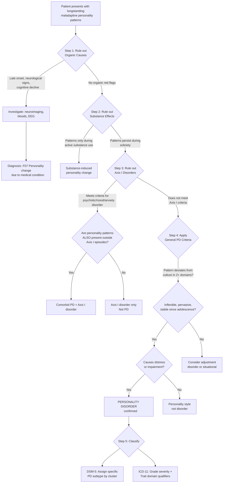

## Diagnostic Criteria for Personality Disorders

### Why Is Diagnosing Personality Disorders So Difficult?

Before we get into the formal criteria, let's understand the fundamental challenge. Personality disorders sit at the **bottom of the diagnostic hierarchy** [2][17]. They are the psychiatric diagnoses you reach *after* ruling out everything above them (organic, psychotic, mood, anxiety disorders). They require **longitudinal assessment** — you cannot diagnose a personality disorder from a single cross-sectional encounter. And the patients themselves ***tend not to regard their own personality as inherently abnormal*** [2], so the information often must come from multiple sources.

Moreover, ***clinicians often agree on the presence of PD but disagree on subtype*** [2], highlighting the limitations of the categorical system and explaining the drive toward dimensional models.

---

### 1. General Diagnostic Criteria

There are two major frameworks to know: the **traditional categorical system** (DSM-5 Section II / ICD-10) and the **newer dimensional system** (ICD-11, DSM-5 Section III Alternative Model).

#### 1.1 DSM-5 Section II — General Diagnostic Criteria for a Personality Disorder

This is the "classic" system that remains the most widely used for exam purposes [2]:

| Criterion | Description | Rationale (Why This Criterion?) |
|---|---|---|
| **A** | An enduring pattern of inner experience and behaviour that **deviates markedly from the expectations of the individual's culture**, manifested in **≥2** of the following: **(1) Cognition** (ways of perceiving and interpreting self, other people, events); **(2) Affectivity** (range, intensity, lability, appropriateness of emotional response); **(3) Interpersonal functioning**; **(4) Impulse control** | Personality is multi-domain — it affects how you *think*, *feel*, *relate to others*, and *control yourself*. Requiring ≥2 domains ensures the pattern is **pervasive**, not just a single problem area |
| **B** | The enduring pattern is **inflexible and pervasive** across a broad range of personal and social situations | This distinguishes PD from situational problems. A person who is only aggressive at work but charming everywhere else likely has a situational issue, not antisocial PD |
| **C** | The pattern leads to **clinically significant distress or impairment** in social, occupational, or other areas of functioning | Without this, the pattern is just a personality *style*, not a *disorder*. This is the threshold — harm to self or others |
| **D** | The pattern is **stable and of long duration**, with onset traceable to at least **adolescence or early adulthood** | This distinguishes PD from episodic Axis I disorders. Depression makes you withdrawn for weeks; avoidant PD makes you withdrawn for *decades* |
| **E** | The enduring pattern is **not better explained as a manifestation or consequence of another mental disorder** | Hierarchy principle — always rule out depression, psychosis, etc. first |
| **F** | The enduring pattern is **not attributable to the physiological effects of a substance or another medical condition** | Rules out organic personality change (e.g., frontal lobe tumour, TBI) |

<Callout title="The Four Pillars of PD Diagnosis">
Think of DSM-5 Criterion A as four "pillars" — **Cognition, Affectivity, Interpersonal, Impulse control**. Any personality disorder will involve dysfunction in at least two of these four areas. This framework helps you organize your clinical assessment systematically.
</Callout>

#### 1.2 ICD-10 — General Criteria for Specific Personality Disorders (F60) [2]

The ICD-10 criteria require that the condition **not be attributable to gross brain damage or another psychiatric disorder**, and specify that the pattern must involve:

- Markedly **disharmonious attitudes and behaviour** involving several areas of functioning (affects, arousal, impulse control, perception/thinking, relating to others)
- **Enduring pattern** of long standing (not limited to episodes of mental illness)
- **Pervasive** and clearly maladaptive to a broad range of personal and social situations
- Always manifesting **during childhood or adolescence** and continuing into adulthood
- Leading to considerable **personal distress** (which may become apparent only later)
- Usually (but not invariably) associated with significant problems in **occupational and social performance**

> Note: ICD-10 includes all the DSM personality disorders *except* **schizotypal** (classified under psychotic disorders as F21) and **narcissistic** (not included as a separate category) [2]

#### 1.3 ICD-11 — The New Dimensional System (Current WHO Standard, 2022+)

The ICD-11 represents a **paradigm shift** from categorical to dimensional classification. It is the system you should know for current practice and future exams.

**Step 1: Determine if a Personality Disorder is present**

The general criteria are similar to DSM-5:
- Enduring pattern of disturbance in functioning of aspects of the self (identity, self-worth, self-direction, capacity for empathy) AND/OR interpersonal dysfunction
- Manifested in patterns of cognition, emotional experience, emotional expression, and behaviour
- Present across a range of situations, not limited to specific contexts
- Of long duration (typically ≥2 years, traceable to late childhood/adolescence)
- Not better explained by another mental disorder, substance, or medical condition
- Associated with substantial distress or significant impairment

**Step 2: Grade Severity**

| Severity | Description |
|---|---|
| **Mild** | Disturbance primarily in some but not all domains of personality functioning; may not affect all relationships or social situations; does not pervasively extend across all contexts |
| **Moderate** | Disturbance affects multiple areas of personality functioning; affects most interpersonal relationships and some social roles; may be associated with harm to self or others |
| **Severe** | Severe disturbances affecting many areas of personality functioning; affects virtually all relationships; often associated with significant harm to self or others; may require intensive/inpatient care |

**Step 3: Specify Trait Domain Qualifiers**

These replace the old PD subtypes. Think of them as the "flavour" of the personality pathology:

| ICD-11 Trait Domain | Description | Approximate Mapping to Old Categories |
|---|---|---|
| **Negative Affectivity** | Tendency to experience a broad range of negative emotions (anxiety, depression, anger, irritability, emotional lability) with disproportionate intensity | Borderline PD, Avoidant PD, Dependent PD features |
| **Detachment** | Tendency to maintain interpersonal distance, social withdrawal, restricted emotional expression, avoidance of intimacy | Schizoid PD, Avoidant PD features |
| **Dissociality** | Disregard for rights/feelings of others, lack of empathy, callousness, exploitativeness, hostility, aggression | Antisocial PD, Narcissistic PD features |
| **Disinhibition** | Tendency toward impulsive action, irresponsibility, recklessness, poor planning, distractibility | Borderline PD, Antisocial PD features |
| **Anankastia** | Focus on rigid perfectionism, emotional/behavioural constraint, stubbornness, deliberativeness, orderliness, rule-following | OCPD features |

**Step 4: Optional Borderline Pattern Qualifier**

A specific **Borderline pattern** specifier is retained because of the extensive evidence base for treatment (DBT, MBT). It requires a pattern of emotional instability, impulsivity, identity disturbance, and abandonment fears — essentially the same as DSM-5 BPD.

<Callout title="ICD-11 vs. DSM-5: What Changed and Why" type="idea">
The ICD-11 abandoned named PD subtypes because:
1. **Overlap**: Most patients met criteria for multiple PDs — the "categories" didn't carve nature at its joints
2. **Clinical utility**: Clinicians agreed PD was present but disagreed on subtype
3. **Treatment planning**: Severity grade is more useful for treatment decisions than a categorical label
4. **Coverage**: Many patients with significant personality pathology didn't fit any specific category ("PD-NOS" was the most common PD diagnosis in DSM-IV)

However, the **Borderline pattern** was kept because DBT and MBT specifically target it, and the evidence base is robust.
</Callout>

---

### 2. Specific Diagnostic Criteria by Disorder (DSM-5 Section II)

Since DSM-5 Section II remains the most commonly examined categorical system, here are the specific criteria. I'll present each with the diagnostic threshold and the "why" behind key features.

#### 2.1 Cluster A

##### Paranoid Personality Disorder (DSM-5 301.0 / ICD-10 F60.0)

A pervasive distrust and suspiciousness of others, beginning by early adulthood, present in a variety of contexts, as indicated by **≥4** of:
1. Suspects, without sufficient basis, that others are exploiting, harming, or deceiving them
2. Preoccupied with unjustified doubts about loyalty or trustworthiness of friends/associates
3. Reluctant to confide due to unwarranted fear information will be used maliciously
4. Reads hidden demeaning or threatening meanings into benign remarks or events
5. Persistently bears grudges (unforgiving of insults, injuries, slights)
6. Perceives attacks on character or reputation not apparent to others and is quick to react angrily
7. Recurrent suspicions, without justification, regarding fidelity of spouse or partner

> Does not occur exclusively during schizophrenia, bipolar/depressive disorder with psychotic features, or another psychotic disorder, and is not due to a medical condition.

##### Schizoid Personality Disorder (DSM-5 301.20 / ICD-10 F60.1)

A pervasive pattern of detachment from social relationships and restricted emotional expression, beginning by early adulthood, as indicated by **≥4** of:
1. Neither desires nor enjoys close relationships, including family
2. Almost always chooses solitary activities
3. Has little, if any, interest in sexual experiences with another person
4. Takes pleasure in few, if any, activities
5. Lacks close friends or confidants other than first-degree relatives
6. Appears indifferent to praise or criticism
7. Shows emotional coldness, detachment, or flattened affectivity

##### Schizotypal Personality Disorder (DSM-5 301.22 / ICD-10: classified under F21 as schizotypal disorder) [2]

A pervasive pattern of social and interpersonal deficits marked by acute discomfort with close relationships, cognitive/perceptual distortions, and eccentricities of behaviour, beginning by early adulthood, as indicated by **≥5** of:
1. Ideas of reference (excluding delusions of reference)
2. Odd beliefs or magical thinking inconsistent with subcultural norms
3. Unusual perceptual experiences, including bodily illusions
4. Odd thinking and speech (vague, circumstantial, metaphorical, overelaborate, stereotyped)
5. Suspiciousness or paranoid ideation
6. Inappropriate or constricted affect
7. Behaviour or appearance that is odd, eccentric, or peculiar
8. Lack of close friends or confidants other than first-degree relatives
9. Excessive social anxiety that does not diminish with familiarity and is associated with paranoid fears rather than negative self-judgments

> Does not occur exclusively during schizophrenia, bipolar/depressive disorder with psychotic features, another psychotic disorder, or ASD.

<Callout title="Schizotypal: The Threshold Issue" type="error">
Note that schizotypal PD requires **5 out of 9** criteria — a higher threshold than most other PDs. This is because the features overlap significantly with schizophrenia-spectrum phenomena, and you want to be certain before labelling someone with a personality disorder rather than a psychotic disorder. Also recall: ***although attenuated positive symptoms may be present, the patient has never met criteria of schizophrenia throughout entire life*** [2].
</Callout>

#### 2.2 Cluster B

##### Antisocial Personality Disorder (DSM-5 301.7 / ICD-10 F60.2 "Dissocial PD") [2]

A pervasive pattern of disregard for and violation of the rights of others, since age 15, as indicated by **≥3** of:
1. Failure to conform to social norms with respect to lawful behaviours (repeatedly performing acts that are grounds for arrest)
2. Deceitfulness (repeated lying, use of aliases, conning others for personal profit/pleasure)
3. Impulsivity or failure to plan ahead
4. Irritability and aggressiveness (repeated physical fights or assaults)
5. Reckless disregard for safety of self or others
6. Consistent irresponsibility (repeated failure to sustain consistent work behaviour or honour financial obligations)
7. Lack of remorse (indifferent to or rationalizing having hurt/mistreated/stolen from another)

**Additional requirements:**
- Individual is at least **age 18 years**
- There is evidence of **conduct disorder** with onset **before age 15**
- Not exclusively during course of schizophrenia or bipolar disorder

> Why the age and conduct disorder requirements? Because ASPD is conceptualized as the *adult continuation* of childhood-onset behavioural pathology. Without the conduct disorder criterion, you'd be diagnosing personality traits that didn't emerge until adulthood — more likely to be situational, substance-related, or secondary to another disorder.

##### Borderline Personality Disorder (DSM-5 301.83 / ICD-10 F60.31 "Emotionally Unstable PD, Borderline type") [2]

A pervasive pattern of instability of interpersonal relationships, self-image, and affects, and marked impulsivity, beginning by early adulthood, as indicated by **≥5** of:
1. Frantic efforts to avoid real or imagined abandonment
2. ***Unstable and intense interpersonal relationships, alternating between extremes of idealization and devaluation*** ("splitting")
3. Identity disturbance: markedly and persistently unstable self-image or sense of self
4. ***Impulsivity*** in ≥2 areas that are potentially self-damaging (spending, sex, substance abuse, reckless driving, binge eating)
5. Recurrent suicidal behaviour, gestures, threats, or self-mutilating behaviour
6. Affective instability due to a marked reactivity of mood (intense episodic dysphoria, irritability, or anxiety usually lasting hours, rarely days)
7. Chronic feelings of emptiness
8. Inappropriate, intense anger or difficulty controlling anger
9. Transient, stress-related paranoid ideation or severe dissociative symptoms

> 5 out of 9 criteria are needed. The most commonly endorsed features in clinical practice are affective instability (#6), impulsivity (#4), and unstable relationships (#2).

##### Histrionic Personality Disorder (DSM-5 301.50 / ICD-10 F60.4)

A pervasive pattern of excessive emotionality and attention seeking, beginning by early adulthood, as indicated by **≥5** of:
1. Uncomfortable when not the centre of attention
2. Interaction with others often characterized by inappropriately sexually seductive or provocative behaviour
3. Displays rapidly shifting and shallow expression of emotions
4. Consistently uses physical appearance to draw attention to self
5. Has a style of speech that is excessively impressionistic and lacking in detail
6. Shows self-dramatization, theatricality, and exaggerated expression of emotion
7. Is suggestible (easily influenced by others or circumstances)
8. Considers relationships to be more intimate than they actually are

##### Narcissistic Personality Disorder (DSM-5 301.81 / Not separately listed in ICD-10) [2]

A pervasive pattern of grandiosity (in fantasy or behaviour), need for admiration, and lack of empathy, beginning by early adulthood, as indicated by **≥5** of:
1. Grandiose sense of self-importance (exaggerates achievements/talents, expects to be recognized as superior without commensurate achievements)
2. Preoccupied with fantasies of unlimited success, power, brilliance, beauty, or ideal love
3. Believes they are "special" and unique and can only be understood by, or should associate with, other special or high-status people/institutions
4. Requires excessive admiration
5. Has a sense of entitlement (unreasonable expectation of favourable treatment or automatic compliance)
6. Is interpersonally exploitative (takes advantage of others to achieve own ends)
7. Lacks empathy: unwilling to recognize or identify with the feelings/needs of others
8. Is often envious of others or believes others are envious of them
9. Shows arrogant, haughty behaviours or attitudes

#### 2.3 Cluster C

##### Avoidant Personality Disorder (DSM-5 301.82 / ICD-10 F60.6)

A pervasive pattern of social inhibition, feelings of inadequacy, and hypersensitivity to negative evaluation, beginning by early adulthood, as indicated by **≥4** of:
1. Avoids occupational activities involving significant interpersonal contact because of fears of criticism, disapproval, or rejection
2. Unwilling to get involved with people unless certain of being liked
3. Shows restraint within intimate relationships because of fear of being shamed or ridiculed
4. Preoccupied with being criticized or rejected in social situations
5. Inhibited in new interpersonal situations because of feelings of inadequacy
6. Views self as socially inept, personally unappealing, or inferior to others
7. Unusually reluctant to take personal risks or engage in any new activities because they may prove embarrassing

##### Dependent Personality Disorder (DSM-5 301.6 / ICD-10 F60.7)

A pervasive and excessive need to be taken care of that leads to submissive and clinging behaviour and fears of separation, beginning by early adulthood, as indicated by **≥5** of:
1. Difficulty making everyday decisions without excessive advice/reassurance from others
2. Needs others to assume responsibility for most major areas of life
3. Difficulty expressing disagreement with others because of fear of loss of support or approval
4. Difficulty initiating projects or doing things on own (because of lack of self-confidence in judgment/abilities)
5. Goes to excessive lengths to obtain nurturance and support (even to point of volunteering for unpleasant tasks)
6. Feels uncomfortable or helpless when alone because of exaggerated fears of being unable to care for self
7. Urgently seeks another relationship as a source of care and support when a close relationship ends
8. Unrealistically preoccupied with fears of being left to take care of self

##### Obsessive-Compulsive Personality Disorder (DSM-5 301.4 / ICD-10 F60.5 "Anankastic PD")

A pervasive pattern of preoccupation with orderliness, perfectionism, and mental and interpersonal control, at the expense of flexibility, openness, and efficiency, beginning by early adulthood, as indicated by **≥4** of:
1. Preoccupied with details, rules, lists, order, organization, or schedules to the extent that the major point of the activity is lost
2. Shows perfectionism that interferes with task completion
3. Excessively devoted to work and productivity to the exclusion of leisure and friendships (not accounted for by economic necessity)
4. Over-conscientious, scrupulous, and inflexible about matters of morality, ethics, or values (not accounted for by cultural or religious identification)
5. Unable to discard worn-out or worthless objects even when they have no sentimental value
6. Reluctant to delegate tasks or work with others unless they submit to exactly their way of doing things
7. Adopts a miserly spending style toward both self and others (money viewed as something to be hoarded for future catastrophes)
8. Shows rigidity and stubbornness

---

### 3. "Secondary" Personality Disorders (Personality Change Due to Another Condition) [2]

These are **not** true primary personality disorders. They represent **acquired personality change** in adulthood:

| ICD-10 Category | Cause | Criteria |
|---|---|---|
| **F07 — Personality and behavioural disorders due to brain disease, damage, and dysfunction** | Head injury, encephalitis, tumour, cerebrovascular disease | Personality change attributable to the organic condition; not present premorbidly |
| **F62.0 — Enduring personality change after catastrophic experience** | Hostage situations, torture, concentration camps, prolonged captivity | Lasted **≥2 years**, following **extreme** stressful experience; may follow PTSD but considered distinct [2] |
| **F62.1 — Enduring personality change after psychiatric illness** | Especially after **schizophrenia** | Lasted **≥2 years**, clearly **related to experience of illness**, **not present before it** [2] |

<Callout title="Why Secondary PD Matters" type="error">
If a 55-year-old with no prior personality difficulties suddenly becomes disinhibited, impulsive, and socially inappropriate — this is NOT antisocial PD. This is likely organic personality change (F07), and you need neuroimaging urgently. The distinction is clinically critical because the management is entirely different.
</Callout>

---

### 4. Diagnostic Algorithm

The following flowchart integrates the above criteria into a practical clinical algorithm:

---

### 5. Investigation and Assessment Modalities

Personality disorders are **clinical diagnoses** — there is no blood test, scan, or single instrument that confirms a PD. However, a structured, multimodal assessment is essential. Investigations serve two purposes: (1) **ruling out organic/medical causes** and (2) **characterizing the personality pathology and its comorbidities**.

#### 5.1 Clinical Assessment (The Foundation)

| Component | What It Covers | Why It Matters |
|---|---|---|
| **Comprehensive psychiatric history** | Developmental history, family history, education, occupation, relationships, forensic history, substance use, medical history | PDs are **defined by longitudinal pattern** — you need the whole life story, not just the presenting complaint |
| **Premorbid personality assessment** | "What kind of person were you *before* all this started?" — relationships, coping styles, emotional patterns, hobbies, self-description | Essential for distinguishing state (Axis I) from trait (PD) [2] |
| **Collateral history** | From family, partners, friends, previous clinicians, school/work records | Patients with PD often **lack insight** into their own patterns; collateral is often more informative than self-report |
| **Mental State Examination** | Full MSE, noting especially: affect (range, stability, appropriateness), interpersonal style during interview, impulse control, insight | The MSE of PD is often "normal" in a snapshot — the pathology emerges *over time* and *across relationships* |

**Assessment should cover** [2]:
- **Source of distress**: Thoughts, emotions, behaviour, relationships — to self and others
- **Functional impairment**: At work, at home, in social circumstances
- **Comorbid psychiatric illness**: Always screen for depression, anxiety, substance use, PTSD
- **Strengths and weaknesses** of the individual → important for subsequent treatment planning

#### 5.2 Structured and Semi-Structured Interviews

These are the "gold standard" for PD diagnosis in research and specialist settings:

| Instrument | Format | Notes |
|---|---|---|
| **SCID-5-PD** (Structured Clinical Interview for DSM-5 Personality Disorders) | Semi-structured interview, clinician-rated | Gold standard for DSM-5 PD diagnosis; covers all 10 PDs; takes 60-90 minutes; requires trained interviewer |
| **IPDE** (International Personality Disorder Examination) | Semi-structured interview | Developed by WHO; compatible with both ICD-10 and DSM-IV criteria |
| **SIDP-IV** (Structured Interview for DSM-IV Personality) | Semi-structured interview | Organizes questions by topic rather than by disorder — reduces patient defensiveness |
| **SIPP-118** (Severity Indices of Personality Problems) | Self-report questionnaire | Dimensional measure of personality functioning; useful for tracking change over time |

#### 5.3 Self-Report Screening Instruments

| Instrument | Format | Key Findings / Interpretation |
|---|---|---|
| **PDQ-4+** (Personality Diagnostic Questionnaire) | 99-item True/False self-report | Screens for all DSM-IV PDs; high sensitivity but lower specificity (many false positives) — use as screening, NOT diagnosis |
| **MCMI-IV** (Millon Clinical Multiaxial Inventory) | 195-item self-report | Aligns with Millon's personality theory; provides personality pattern scores and clinical syndrome scores |
| **MSI-BPD** (McLean Screening Instrument for BPD) | 10-item True/False | Quick screening for BPD; score ≥7 suggests BPD (sensitivity ~80%, specificity ~85%) |
| **ZAN-BPD** (Zanarini Rating Scale for BPD) | Clinician-rated | Tracks BPD symptom severity over time; useful for monitoring treatment response |
| **MMPI-2** (Minnesota Multiphasic Personality Inventory) | 567-item self-report | Comprehensive personality assessment; the dimensional approach mentioned in defining personality [2]; primarily a research tool |

#### 5.4 Dimensional Personality Trait Measures

| Instrument | What It Measures | Use in PD |
|---|---|---|
| **NEO-PI-R** (NEO Personality Inventory-Revised) | Big Five personality traits: Neuroticism, Extraversion, Openness, Agreeableness, Conscientiousness | Maps onto PD trait domains; high Neuroticism a/w Cluster B and C; low Agreeableness a/w Cluster A and antisocial PD |
| **PID-5** (Personality Inventory for DSM-5) | 220 items measuring 25 trait facets organized into 5 domains (Negative Affectivity, Detachment, Antagonism, Disinhibition, Psychoticism) | Specifically designed for the DSM-5 Alternative Model (Section III); maps closely to ICD-11 trait domains |

#### 5.5 Investigations to Rule Out Organic Causes

These are **not for diagnosing PD** but for **ruling out medical conditions** that can cause personality change:

| Investigation | Indication | Key Findings |
|---|---|---|
| **Basic bloods: CBC, RFT, LFT, TFT, glucose** | All patients, especially late-onset personality change | TFT: hypothyroidism → apathy/withdrawal (mimics schizoid); hyperthyroidism → irritability/anxiety (mimics Cluster C). LFT: chronic alcohol use. Glucose: hypoglycaemia causing episodic behavioural disturbance |
| **Urine drug screen** | Suspected substance contribution | Positive → personality features may be substance-related; reassess when sober |
| **Syphilis serology, HIV test** | Late-onset personality change, risk factors | Neurosyphilis/HIV → frontal lobe involvement → disinhibition, personality change |
| **CT/MRI Brain** | Late onset, neurological signs, cognitive decline, head injury history | Frontal lobe tumours, frontotemporal dementia, TBI, stroke → organic personality change (F07) [2] |
| **EEG** | Suspected temporal lobe epilepsy, episodic behavioural disturbance | Temporal lobe foci → interictal personality syndrome |
| **B12/Folate** | Cognitive symptoms, dietary risk | Deficiency can cause personality and cognitive changes |
| **ESR/CRP** | Autoimmune or inflammatory conditions | Cerebral vasculitis, SLE — can present with psychiatric/personality change |
| **Cortisol / dexamethasone suppression test** | Suspected Cushing's | Cushing's disease → emotional lability, depression, personality change |

<Callout title="When to Investigate More Aggressively">
Pursue organic workup when:
- Personality change has **onset after age 40**
- Change is **abrupt** or rapidly progressive
- **Neurological signs** are present
- **Cognitive decline** accompanies personality change
- No premorbid personality difficulties
- Features are **atypical** for any PD (e.g., visual hallucinations, seizures, focal deficits)
</Callout>

#### 5.6 Assessment of Comorbidities

Since personality disorders are almost always comorbid with Axis I conditions, the assessment should include screening for:

| Comorbidity | Screening Tool | Rationale |
|---|---|---|
| **Depression** | PHQ-9, BDI-II | Depression comorbid with PD in up to 80% of BPD cases |
| **Anxiety disorders** | GAD-7, STAI | Cluster C PDs almost always have comorbid anxiety |
| **Substance use** | CAGE, AUDIT, DAST | Especially important for Cluster B (ASPD has ~84% comorbid SA [2]) |
| **PTSD** | PCL-5 | Especially relevant for BPD (56% comorbid PTSD) |
| **Suicidal risk** | Columbia Suicide Severity Rating Scale, direct clinical assessment | BPD has 8-10% lifetime suicide completion rate |
| **Eating disorders** | EDE-Q | Comorbid with BPD (~53%) and OCPD |

#### 5.7 Functional Assessment

| Domain | Assessment Method |
|---|---|
| **Social functioning** | Global Assessment of Functioning (GAF) score; Social Functioning Questionnaire |
| **Occupational functioning** | Employment history, work performance records |
| **Quality of life** | WHOQOL-BREF |
| **Personality functioning** | Level of Personality Functioning Scale (LPFS) — used in DSM-5 Alternative Model; rates self-functioning (identity, self-direction) and interpersonal functioning (empathy, intimacy) on a 0-4 scale |

---

### 6. Interpreting Assessment Results: Putting It All Together

The diagnosis of a personality disorder is ultimately a **clinical judgment** informed by all of the above data. No single instrument is sufficient. The key interpretive principles are:

1. **Convergence**: If structured interview, self-report, collateral history, and clinical observation all point in the same direction → high confidence in diagnosis
2. **Discrepancy**: If patient self-report diverges significantly from collateral/clinician observation → may indicate poor insight (common in PD) or deliberate concealment
3. **Longitudinal consistency**: Features must be present across time (years) and situations — not just during a crisis or Axis I episode
4. **Cultural calibration**: Always interpret features in the context of the patient's cultural background
5. **Severity determines treatment intensity**: ICD-11 severity grading directly guides whether outpatient psychotherapy, intensive outpatient, or inpatient care is needed

---

<Callout title="High Yield Summary">

**General criteria**: DSM-5 requires deviation from cultural expectations in ≥2 of 4 domains (Cognition, Affectivity, Interpersonal, Impulse control) + inflexible + pervasive + stable since adolescence + causes distress/impairment + not explained by another disorder or substance/medical condition.

**ICD-11 revolution**: Dimensional model → Grade severity (mild/moderate/severe) → Specify trait domains (Negative Affectivity, Detachment, Dissociality, Disinhibition, Anankastia) → Optional Borderline pattern qualifier.

**Key thresholds**: Paranoid ≥4/7, Schizoid ≥4/7, Schizotypal ≥5/9, Antisocial ≥3/7 (+ age ≥18 + conduct disorder before 15), Borderline ≥5/9, Histrionic ≥5/8, Narcissistic ≥5/9, Avoidant ≥4/7, Dependent ≥5/8, OCPD ≥4/8.

**Investigations**: PD is a clinical diagnosis. Investigations are for ruling out organic causes (imaging, TFT, B12, syphilis/HIV) and assessing comorbidities (PHQ-9, AUDIT, PCL-5).

**Gold standard assessment**: Structured clinical interview (SCID-5-PD) + collateral history + longitudinal assessment.

**Secondary PD**: Always consider organic personality change (F07) for late-onset or abrupt personality change.

</Callout>

---

<ActiveRecallQuiz
  title="Active Recall - Diagnostic Criteria and Investigation of Personality Disorders"
  items={[
    {
      question: "List the four domains in DSM-5 Criterion A for general personality disorder diagnosis. How many must be affected?",
      markscheme: "The four domains are: (1) Cognition (perceiving/interpreting self, others, events), (2) Affectivity (range, intensity, lability, appropriateness of emotional response), (3) Interpersonal functioning, (4) Impulse control. At least 2 of 4 must be affected. The pattern must deviate markedly from cultural expectations."
    },
    {
      question: "What are the five trait domain qualifiers in the ICD-11 dimensional model of personality disorders, and what old PD categories do they roughly correspond to?",
      markscheme: "1. Negative Affectivity (BPD, Avoidant, Dependent), 2. Detachment (Schizoid, Avoidant), 3. Dissociality (Antisocial, Narcissistic), 4. Disinhibition (BPD, Antisocial), 5. Anankastia (OCPD). Plus a separate Borderline pattern qualifier. The ICD-11 grades severity (mild/moderate/severe) before specifying traits."
    },
    {
      question: "Antisocial personality disorder in DSM-5 has two unique prerequisite criteria that no other PD has. What are they and why do they exist?",
      markscheme: "(1) Individual must be at least 18 years old, (2) There must be evidence of conduct disorder with onset before age 15. These exist because ASPD is conceptualized as the adult continuation of childhood-onset behavioural pathology. Without them, you might diagnose personality traits that emerged only in adulthood due to situational, substance, or other factors."
    },
    {
      question: "A 52-year-old man with no prior psychiatric history becomes disinhibited, impulsive, and socially inappropriate over 3 months. What is your diagnostic approach and what investigations would you order?",
      markscheme: "This is NOT a primary personality disorder (late onset, no premorbid PD history). Suspect organic personality change (ICD-10 F07). Order: CT/MRI brain (frontal lobe tumour, frontotemporal dementia, stroke), basic bloods including TFT, LFT, glucose, B12/folate, syphilis serology, HIV test, possibly EEG. A thorough neurological examination is essential."
    },
    {
      question: "What is the gold standard method for diagnosing personality disorders? Why are self-report questionnaires insufficient on their own?",
      markscheme: "Gold standard: structured or semi-structured clinical interview (e.g., SCID-5-PD) combined with collateral history and longitudinal assessment. Self-report questionnaires alone are insufficient because: (1) PD patients often lack insight into their own patterns (ego-syntonic), (2) self-report instruments have high sensitivity but low specificity (many false positives), (3) personality patterns require longitudinal and contextual assessment that questionnaires cannot capture, (4) collateral information often reveals patterns the patient does not recognize."
    }
  ]}
/>

## References

[2] Senior notes: ryanho-psych.md (Sections 10.1-10.4: Personality and Personality Disorders; diagnostic criteria; approach to PD; secondary PD; assessment framework)
[17] Senior notes: ryanho-psych.md (Hierarchy of diagnosis; diagnostic criteria structure)
