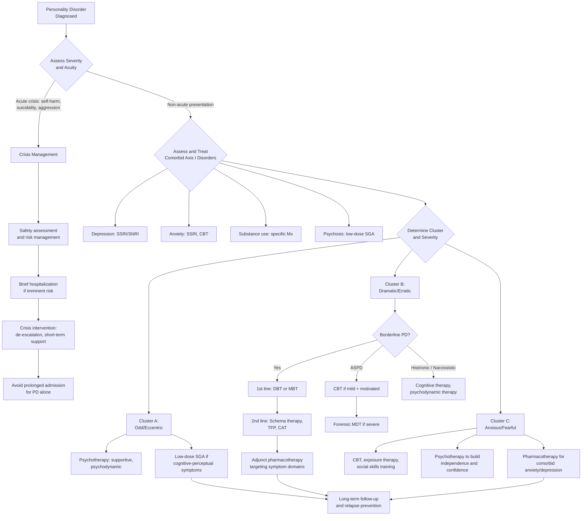

## Management of Personality Disorders

### Overarching Philosophy: Why Is This Different from Treating Other Psychiatric Conditions?

Managing personality disorders requires a fundamentally different mindset compared to, say, prescribing an SSRI for depression or an antipsychotic for schizophrenia. Here's why:

1. **Personality is the person, not the illness.** You're not trying to eliminate symptoms the way you'd eliminate a delusion. You're trying to help someone **live more adaptively with who they are** [2].

2. **The aim is not "cure" but adaptation.** As stated in the management principles: ***Aim: seek a way of life that conflicts less with their character, often by ↓contact with situations provoking difficulties and ↑opportunity to develop assets in their personality*** [2].

3. ***Psychological support is the mainstay***, with multidisciplinary input [2]. Medications are adjuncts, not primary treatments.

4. ***Drugs: as adjunct only to treat comorbid psychiatric disorders*** [2]. There is no medication "approved" for any personality disorder itself.

5. ***Evidence: little hard evidence to support current management, mainly focusing on Cluster B*** [2]. Most of the treatment evidence base centres on borderline personality disorder.

6. The therapeutic relationship itself is both the **tool** and the **battlefield** — personality pathology plays out directly in the patient-clinician relationship (transference, countertransference, splitting of clinical teams), making treatment both challenging and informative.

---

### Management Algorithm

---

### 1. General Principles of Management

Before discussing specific modalities, let's establish the principles that govern ALL personality disorder management [2]:

| Principle | Explanation | Rationale |
|---|---|---|
| **Psychotherapy is the mainstay** | ***Psychological support as mainstay, with multidisciplinary input*** [2] | Personality disorders are disorders of psychological functioning — they respond to psychological interventions, not primarily to medications |
| **Medications are adjuncts only** | ***Drugs: as adjunct only to treat comorbid psychiatric disorders*** [2] | No medication has been shown to treat the core personality pathology itself; medications target specific symptom domains (mood instability, impulsivity, transient psychosis) or comorbid Axis I disorders |
| **Aim for adaptation, not cure** | ***Seek a way of life that conflicts less with their character*** [2] | Personality is enduring — the goal is to help patients function better, not to fundamentally change who they are |
| **Assess strengths and weaknesses** | Part of the assessment framework → ***important in subsequent treatment*** [2] | Treatment is built on the patient's existing strengths. A patient who is intellectually curious (strength) but socially avoidant (weakness) can be engaged through psychoeducation |
| **Multidisciplinary team approach** | Involves psychiatrist, psychologist, psychiatric nurse, social worker, occupational therapist | PDs affect multiple life domains; no single professional can address all needs |
| **Be mindful of the therapeutic relationship** | ***Cluster B → difficult relationship with clinicians → often excluded from care*** [2] | Splitting, idealization/devaluation, manipulation can all play out with clinicians. Consistent boundaries and team communication are essential |
| **Long-term perspective** | Treatment is measured in years, not weeks | Personality is enduring — meaningful change takes time |

<Callout title="The Single Most Important Point">
***Psychotherapy: psychodynamic, cognitive therapy when well-motivated + stable*** [2]. The prerequisite "well-motivated and stable" is crucial — you cannot do intensive psychotherapy with someone who is actively in crisis, intoxicated, or has no motivation to change. Stabilize first, then treat.
</Callout>

---

### 2. Psychotherapeutic Modalities (The Core of Treatment)

#### 2.1 Dialectical Behaviour Therapy (DBT)

**What it is**: "Dialectical" = "dialectic" from Greek *dialektikḗ* = the art of arriving at truth through opposing arguments. The "dialectic" in DBT is the balance between **acceptance** (mindfulness, validation) and **change** (behavioural modification, skill-building).

**Developed by**: Marsha Linehan, specifically for **Borderline Personality Disorder**.

**Theoretical basis**: Linehan's biosocial model — BPD arises from the interaction of biological emotional vulnerability and an invalidating environment. The treatment therefore addresses both:
- **Acceptance** strategies: mindfulness, validation of the patient's emotional experience (correcting the invalidation)
- **Change** strategies: CBT-based skills for emotional regulation, distress tolerance, interpersonal effectiveness

**Structure**:
- **Individual therapy** (weekly, 1 hour): Addresses the patient's specific problems using a target hierarchy (life-threatening behaviours → therapy-interfering behaviours → quality of life issues)
- **Skills group** (weekly, 2-2.5 hours): Teaches four skill modules:
  1. **Mindfulness**: Core awareness skills — observe, describe, participate without judgment
  2. **Distress tolerance**: Crisis survival skills — self-soothing, distraction, "TIPP" (Temperature, Intense exercise, Paced breathing, Progressive relaxation)
  3. **Emotional regulation**: Understanding, labelling, and modifying emotional responses
  4. **Interpersonal effectiveness**: Asking for what you need, saying no, maintaining self-respect in relationships
- **Phone coaching**: Between sessions for real-time crisis support
- **Therapist consultation team**: Mutual support for therapists treating this demanding population

**Indications**:
- ***Borderline personality disorder*** — gold standard, strongest evidence base [2][18]
- BPD with chronic suicidality and self-harm (primary target)
- Substance use disorders with emotional dysregulation
- Eating disorders with BPD features

**Contraindications/limitations**:
- Requires **high commitment** (~1 year minimum programme)
- Patient must be **willing and able to attend** regularly
- Not effective if patient is **actively psychotic** or **severely cognitively impaired**
- Resource-intensive (requires trained therapists, team structure)

**Evidence**: Strong RCT evidence for ↓self-harm, ↓suicide attempts, ↓hospitalization, ↓emergency department visits, ↑emotional regulation in BPD.

> ***Dialectical behavioural therapy (DBT) with mixture of CBT (to ↑emotional regulation) and mindfulness (to ↑awareness) with confrontation*** [2]

#### 2.2 Mentalization-Based Therapy (MBT)

**What it is**: "Mentalization" = the capacity to understand behaviour in terms of underlying **mental states** (thoughts, feelings, desires, intentions) — both your own and others'.

**Developed by**: Anthony Bateman and Peter Fonagy, for **Borderline Personality Disorder**.

**Theoretical basis**: BPD patients have **impaired mentalizing capacity** — under stress, they lose the ability to reflect on their own and others' mental states, leading to impulsive actions, misinterpretations, and interpersonal chaos. This impairment stems from early attachment disruption.

**Structure**:
- Combination of **individual** and **group** therapy
- Originally delivered in a **partial hospitalization / day unit** setting (therapeutic community model)
- Now also delivered in outpatient format
- Duration: typically 18 months

> ***Mentalization: day units to build therapeutic communities designed to help patient become more fully aware of their thoughts/feelings before acting on them*** [2]

**How it works**:
- Therapist adopts a curious, "not-knowing" stance
- Focuses on **current mental states** rather than past events
- When mentalizing breaks down (e.g., patient acts impulsively), the therapist helps restore the capacity to think about thinking
- Avoids deep interpretation (unlike psychoanalysis) — focuses on the process of understanding, not the content

**Indications**:
- Borderline personality disorder (strong evidence base, comparable to DBT)
- Antisocial PD (emerging evidence, particularly from Fonagy's group)
- Young people with emerging personality pathology

**Contraindications/limitations**:
- Active psychosis
- Severe cognitive impairment
- Active substance intoxication (can't mentalize if intoxicated)
- Requires trained therapists and structured programme

#### 2.3 Schema Therapy

**What it is**: "Schema" = Greek *skhêma* = form/pattern. Schema therapy targets **early maladaptive schemas** — deep, pervasive patterns/themes about oneself and relationships that develop in childhood and are elaborated throughout life.

**Developed by**: Jeffrey Young, as an integrative approach combining elements of CBT, psychodynamic, attachment, and Gestalt therapy.

**Theoretical basis**: Personality disorders arise from unmet core emotional needs in childhood → development of early maladaptive schemas (e.g., "I am defective," "I will always be abandoned," "Others are dangerous") → maladaptive coping modes (surrender, avoidance, overcompensation).

**Key concepts**:
- **18 Early Maladaptive Schemas** organized into 5 domains (Disconnection/Rejection, Impaired Autonomy, Impaired Limits, Other-Directedness, Overvigilance/Inhibition)
- **Schema modes**: Moment-to-moment emotional states and coping responses (e.g., Vulnerable Child mode, Angry Child mode, Punitive Parent mode, Healthy Adult mode)
- **Limited reparenting**: The therapist provides a corrective emotional experience within professional boundaries

**Indications**:
- BPD (RCT evidence comparable to DBT and MBT)
- Cluster C personality disorders (particularly avoidant and dependent)
- Narcissistic PD (emerging evidence)
- Chronic/treatment-resistant depression with personality pathology
- Any PD where specific maladaptive schemas can be identified

**Contraindications/limitations**:
- Active psychosis
- Severe dissociation (need stabilization first)
- Long duration (typically 2-3 years)

#### 2.4 Transference-Focused Psychotherapy (TFP)

**What it is**: A structured psychodynamic psychotherapy that focuses on the **therapeutic relationship** (transference) as the primary arena for change.

**Developed by**: Otto Kernberg, for **Borderline Personality Disorder**.

**Theoretical basis**: Object relations theory — BPD results from failure to integrate "good" and "bad" representations of self and others (splitting). TFP uses the patient-therapist relationship to identify, confront, and integrate these split representations.

**Structure**:
- Twice-weekly individual sessions
- Clear treatment contract at outset
- Duration: typically 1-3 years

**Indications**:
- BPD (RCT evidence)
- Other Cluster B PDs with significant interpersonal pathology

**Contraindications/limitations**:
- Antisocial PD with severe psychopathy (poor treatment response)
- Active substance use
- Severe cognitive impairment
- Requires specialized training

#### 2.5 Cognitive Behavioural Therapy (CBT) and Related Approaches

**Standard CBT** can be adapted for personality disorders, though it is less specifically designed for PDs compared to DBT, MBT, or Schema Therapy:

**Indications by cluster** [2]:
- **Cluster A**: Limited evidence, but CBT can address paranoid cognitions and social skills deficits
- ***Antisocial PD: CBT if mild, has insight and motivation to improve*** [2]
- **Cluster C**: Good evidence for avoidant PD, OCPD; addresses cognitive distortions and avoidance behaviours

**Cognitive Analytic Therapy (CAT)**:
- Integrates cognitive and psychodynamic approaches
- Maps "reciprocal roles" (patterns of relating derived from early relationships)
- Brief (16-24 sessions)
- Evidence for BPD [18]

#### 2.6 Other Psychotherapeutic Approaches

| Modality | Description | Indications |
|---|---|---|
| **Psychodynamic psychotherapy** | Explores unconscious conflicts, defence mechanisms, early relationships; less structured than TFP | ***Psychotherapy: psychodynamic, cognitive therapy when well-motivated + stable*** [2]; Cluster A, B, and C PDs |
| **Supportive psychotherapy** | Provides emotional support, reality testing, guidance; less interpretive | All PDs, especially those not suitable for intensive therapies; ***usually difficult with slow progress*** in Cluster A [2] |
| **Social skills training** | Structured behavioural training in social interaction | ***Social skills training and group Tx*** for avoidant PD [2]; schizotypal PD |
| **Exposure therapy** | Graded exposure to feared social situations | ***Exposure therapy to gradually increase social contact*** for avoidant PD [2] |
| **Group therapy** | Various theoretical frameworks; provides safe social environment for interpersonal learning | Avoidant PD, dependent PD, BPD (as part of DBT skills groups) |
| ***Functional analytic psychotherapy*** | Focuses on the therapeutic relationship as a microcosm of the patient's interpersonal problems | ***Narcissistic PD*** — to identify maladaptive interpersonal patterns in real-time [2] |
| **Therapeutic communities** | Residential or day programmes; structured milieu therapy with group process | BPD, antisocial PD; ***day units to build therapeutic communities*** [2] |

---

### 3. Pharmacological Management

Let me be very clear about the role of medications in personality disorders:

<Callout title="The Cardinal Rule of Pharmacotherapy in PD" type="error">
***Drugs: as adjunct only to treat comorbid psychiatric disorders*** [2]. There is **no medication approved by the FDA, EMA, or MHRA specifically for any personality disorder**. Medications target **symptom domains** (mood instability, impulsivity, transient psychosis, anxiety) and **comorbid Axis I conditions** (depression, anxiety, substance use). Polypharmacy is a major risk in PD patients — resist the temptation to add more drugs for every symptom.
</Callout>

#### 3.1 Symptom-Domain-Based Pharmacotherapy (Primarily for BPD)

Since BPD has the most evidence, most pharmacological guidance pertains to BPD. The approach is **symptom-domain targeting**:

| Symptom Domain | Medication Options | Mechanism / Rationale | Evidence Level |
|---|---|---|---|
| **Affective dysregulation** (mood lability, depression, anxiety) | SSRIs (fluoxetine, sertraline), SNRIs | ↑Serotonin → ↑emotional regulation; addresses comorbid depression/anxiety | Moderate (SSRIs); limited for core BPD mood instability |
| **Affective dysregulation** | Mood stabilizers: lamotrigine, valproate, topiramate | Membrane stabilization, ↑GABA, glutamate modulation → ↓mood swings | Some RCT evidence for lamotrigine in BPD |
| **Impulsive-behavioural dyscontrol** (impulsivity, aggression, self-harm) | SSRIs (fluoxetine) | ↑Serotonin → ↓impulsivity and aggression (serotonin modulates impulse control) | Moderate |
| **Impulsive-behavioural dyscontrol** | Mood stabilizers (valproate, lithium) | ↓Impulsivity through neuronal membrane stabilization | Moderate for valproate; lithium has narrow therapeutic index — caution in overdose-prone patients |
| **Cognitive-perceptual symptoms** (transient psychosis, dissociation, paranoia) | Low-dose second-generation antipsychotics (aripiprazole, olanzapine, quetiapine) | Dopamine receptor modulation → ↓psychotic-like experiences | Some evidence; use lowest effective dose for shortest duration |
| **Severe anxiety** | SSRIs, SNRIs | First-line for anxiety symptoms | Good evidence for comorbid anxiety |

#### 3.2 Cluster-Specific Pharmacotherapy

| Cluster / Disorder | Pharmacological Considerations | Evidence |
|---|---|---|
| **Cluster A** | |
| Paranoid PD | Generally poorly studied; low-dose SGA if paranoid ideation is very distressing and impairing; SSRIs for comorbid anxiety/depression | Very limited |
| Schizoid PD | Rarely seek treatment; no specific pharmacotherapy; medications for comorbid conditions | Minimal |
| Schizotypal PD | ***Consider low-dose SGA for cognitive-perceptual symptoms with significant impairment or distress; consider stimulant for cognitive deficits; consider regular clonazepam, SSRI, SNRI for prominent social anxiety*** [2] | Limited RCTs; clinical consensus |
| **Cluster B** | |
| Antisocial PD | ***Trial of SGA, SSRI, mood stabilizers for those with severe aggression and willing to take medications*** [2]; ***seldom effective*** [2] | Very limited; must be mindful of manipulation |
| Borderline PD | Symptom-domain approach as above; avoid polypharmacy; avoid benzodiazepines | Moderate overall; NICE guidelines recommend against routine pharmacotherapy for BPD |
| Histrionic PD | No specific pharmacotherapy; treat comorbid mood/anxiety disorders | Minimal |
| Narcissistic PD | No specific pharmacotherapy; ***treatment often prompted by depression from dissolved romantic relationships*** [2]; treat comorbid depression | Minimal |
| **Cluster C** | |
| Avoidant PD | SSRIs/SNRIs for comorbid social anxiety; consider alongside psychotherapy | Moderate (for social anxiety component) |
| Dependent PD | ***Consider psychotropics for comorbid depression/anxiety, but caution for liability to dependence*** [2] | Limited; benzodiazepines contraindicated due to dependence risk |
| OCPD | SSRIs may help with rigidity and anxiety; treat comorbid conditions | Limited |

#### 3.3 Medications to AVOID in Personality Disorders

| Medication | Why Avoid | Relevant PD |
|---|---|---|
| **Benzodiazepines** | Paradoxical disinhibition (can worsen impulsivity and aggression); dependence risk; overdose risk when combined with other substances | BPD (paradoxical worsening); Dependent PD (dependence liability) [2]; all PDs with substance use comorbidity |
| **Tricyclic antidepressants** | Lethal in overdose (cardiac toxicity); given high suicide risk in BPD, this is unacceptable | BPD, any PD with suicidal ideation |
| **Lithium** | Narrow therapeutic index; lethal in overdose; requires monitoring and compliance — problematic in impulsive patients | BPD with poor compliance; ASPD |
| **Polypharmacy** | Patients with PD (especially BPD) may accumulate medications targeting each symptom without evidence; leads to side effects, interactions, and therapeutic nihilism | All PDs — always review and simplify |

<Callout title="NICE Guidelines on BPD Pharmacotherapy" type="idea">
The UK NICE guidelines (CG78, updated) explicitly state: **"Drug treatment should not be used specifically for borderline personality disorder or for the individual symptoms or behaviour associated with the disorder."** Medications should only be used for comorbid conditions (e.g., depression, anxiety) and should be **time-limited with regular review**. This reflects the concern about polypharmacy and the fact that psychotherapy, not medication, is the evidence-based treatment for BPD itself.
</Callout>

---

### 4. Crisis Management

Patients with personality disorders, particularly BPD and ASPD, frequently present in acute crisis. This requires a specific approach:

| Phase | Actions | Rationale |
|---|---|---|
| **Immediate safety** | Assess for suicidality, self-harm, homicidality; secure safety of patient and staff; remove means | Life-threatening behaviours are the top priority in DBT's target hierarchy |
| **De-escalation** | Calm, non-judgmental, validating communication; avoid power struggles; set clear boundaries | Invalidation escalates crises in BPD; validation de-escalates |
| **Brief hospitalization** | Consider if imminent risk of serious self-harm or suicide; keep admission **short** (hours to days, not weeks) | ***Avoid prolonged admission for PD alone*** — prolonged hospitalization can reinforce sick role, increase dependency, and expose patients to iatrogenic harm (institutional regression) |
| **Discharge planning** | Ensure outpatient follow-up arranged; crisis plan in place; safety contacts identified | Crisis is an opportunity to engage the patient in longer-term treatment |
| **Team communication** | Ensure consistency of approach across all team members; prevent splitting | BPD patients may unconsciously split clinical teams (idealizing some staff, devaluing others) → inconsistent responses worsen the patient's distress |

---

### 5. Management by Specific Disorder: Detailed Approach

#### 5.1 Cluster A Management

| Disorder | Psychotherapy | Pharmacotherapy | Prognosis | Challenges |
|---|---|---|---|---|
| **Paranoid PD** | ***Psychotherapy as mainstay but depends on good therapist-client alliance; usually difficult with slow progress*** [2] | Low-dose SGA if paranoid ideation very distressing; SSRIs for comorbid mood/anxiety | ***Prone to develop delusional disorder or even psychosis*** [2] | ***Usually do not seek help on their own and often discontinue therapy*** [2] |
| **Schizoid PD** | ***Psychotherapy as mainstay including psychodynamic, CBT, supportive; usually difficult with slow progress*** [2] | No specific pharmacotherapy | Stable, chronic course | ***Rarely seek help and often drop out; tend to intellectualize problems and question value of treatment*** [2] |
| **Schizotypal PD** | ***Psychodynamically-informed, supportive-expressive approach*** [2] | ***Low-dose SGA for cognitive-perceptual symptoms; stimulant for cognitive deficits; clonazepam, SSRI, SNRI for prominent social anxiety*** [2] | 10-20% develop schizophrenia or schizoaffective disorder | Social anxiety may be treatment-limiting |

#### 5.2 Cluster B Management

| Disorder | Psychotherapy | Pharmacotherapy | Prognosis | Challenges |
|---|---|---|---|---|
| **Borderline PD** | ***DBT*** (gold standard) [2][18]; ***MBT*** [2]; Schema Therapy; TFP; CAT | Symptom-domain approach; avoid BZDs; time-limited with regular review | Many remit over 10 years (~85-90%); functional impairment may persist | Chronic suicidality; splitting of clinical teams; treatment dropout |
| **Antisocial PD** | ***CBT if mild, has insight and motivation to improve; majority delivered by forensic psychiatrists*** [2]; ***must be mindful of manipulation of therapeutic relationship*** [2] | ***Trial of SGA, SSRI, mood stabilizers for those with severe aggression and willing to take medications*** [2] | Behavioural features tend to "burn out" after age 40; interpersonal deficits persist | ***Seldom effective*** [2]; high manipulation; low motivation; often forensic context |
| **Histrionic PD** | ***Cognitive therapy*** [2]; psychodynamic therapy; group therapy | Treat comorbid conditions only | Variable; ***treatment often prompted by depression from dissolved romantic relationships*** [2] | Seductiveness and drama in the therapeutic relationship |
| **Narcissistic PD** | ***Cognitive therapy; functional analytic psychotherapy*** [2]; psychodynamic therapy; Schema therapy | Treat comorbid depression and substance use | Variable; vulnerable to decompensation during life transitions | Grandiosity may prevent engagement; vulnerable subtype may be more treatable |

#### 5.3 Cluster C Management

| Disorder | Psychotherapy | Pharmacotherapy | Prognosis | Challenges |
|---|---|---|---|---|
| **Avoidant PD** | ***Social skills training and group therapy; exposure therapy to gradually increase social contact*** [2]; CBT | SSRIs/SNRIs for comorbid social anxiety/depression | ***Significant improvement possible*** [2] | ***Often difficult to gain/keep patient's trust as fear therapist rejection*** [2] |
| **Dependent PD** | ***Psychotherapy with aim of making the individual more independent and help form healthier relationships*** [2] | ***Consider psychotropics for comorbid depression/anxiety, but caution for liability to dependence*** [2] | Variable; dependent on establishing therapeutic independence | Patient may become dependent on therapist; must manage this proactively |
| **OCPD** | CBT (addressing perfectionism, control); psychodynamic therapy | SSRIs for rigidity, anxiety, comorbid conditions | Chronic; may improve with sustained psychotherapy | Rigidity may impede therapeutic engagement; patient may resist unstructured approaches |

---

### 6. Social and Occupational Interventions

| Intervention | Description | Indication |
|---|---|---|
| **Occupational therapy** | Assessment and support for work skills, daily living skills, structured activity | All PDs with functional impairment |
| **Vocational rehabilitation** | Supported employment, job coaching, workplace accommodation | Especially for severe BPD, ASPD, schizotypal PD with occupational dysfunction |
| **Housing support** | Supported housing, crisis accommodation | Severe PD with homelessness or unstable housing |
| **Social work** | Financial support, legal advocacy, child protection liaison | ASPD (forensic liaison); BPD (child protection concerns); dependent PD |
| **Family/carer support** | Psychoeducation for family, carer support groups | All PDs — family members often suffer significantly |
| **Peer support** | Recovery-focused peer support workers | Emerging evidence, especially for BPD |

---

### 7. Special Considerations

#### 7.1 The Therapeutic Relationship in PD Management

This deserves special emphasis because it is unique to PD:

- ***Cluster B → difficult relationship with clinicians → often excluded from care*** [2]. This is a clinical reality and an ethical challenge. Patients with BPD and ASPD generate strong countertransference reactions (frustration, anger, helplessness, rescue fantasies). These reactions are **informative** (they reflect the patient's interpersonal patterns) but must be managed through team supervision, not acted upon.
- ***Obsessional trait → frustrated and resistant if response does not follow expectation*** [2]. Patients with OCPD may become controlling in therapy, insisting on specific structures or procedures.
- **Splitting**: BPD patients may idealize one team member and devalue another, creating conflict within the clinical team. The antidote is **consistent communication** and a **shared treatment plan**.

#### 7.2 Hong Kong Context

- **Public psychiatric services**: Hospital Authority psychiatric services provide outpatient and inpatient care; some specialized personality disorder services exist (e.g., DBT programmes in selected clusters)
- **Private sector**: Private psychologists and psychiatrists offering DBT, Schema Therapy, and psychodynamic psychotherapy
- **Cultural considerations**: The concept of "personality disorder" may carry more stigma in Chinese culture; family involvement may be more important in treatment; somatization of psychological distress may be more common
- **Resource limitations**: Full DBT programmes (individual therapy + skills group + phone coaching + consultation team) are resource-intensive and may not be available in all public settings

#### 7.3 Treatment of Comorbid Conditions

Always treat comorbid Axis I disorders aggressively — they are often the source of acute distress and the reason the patient presents:

| Comorbidity | Treatment Approach |
|---|---|
| **Major depression** | SSRI/SNRI (avoid TCAs — overdose risk); psychotherapy (CBT, IPT); combine with PD-specific therapy |
| **Anxiety disorders** | SSRI/SNRI first-line; CBT; avoid benzodiazepines |
| **PTSD** | Trauma-focused CBT or EMDR; stabilization before trauma processing if severe PD |
| **Substance use** | Integrated dual-diagnosis approach; motivational interviewing; substance-specific interventions |
| **Eating disorders** | CBT-E; family-based treatment in younger patients; address PD pathology concurrently |

---

### 8. Summary: Treatment Evidence by Personality Disorder

| PD | Evidence-Based Psychotherapy | Pharmacotherapy Role | Overall Evidence Strength |
|---|---|---|---|
| **Paranoid** | Supportive, psychodynamic | Minimal; SGA/SSRI for comorbidities | Weak |
| **Schizoid** | Supportive, CBT, psychodynamic | Minimal | Weak |
| **Schizotypal** | Supportive-expressive | Low-dose SGA, SSRI, stimulants | Moderate |
| **Antisocial** | CBT (if motivated), forensic programmes | SGA, SSRI, mood stabilizers for aggression | Weak |
| **Borderline** | **DBT, MBT, Schema Therapy, TFP, CAT** | Symptom-domain adjunct only | **Strong** |
| **Histrionic** | Cognitive therapy, psychodynamic | For comorbidities only | Weak |
| **Narcissistic** | Cognitive therapy, Schema Therapy, psychodynamic | For comorbidities only | Weak |
| **Avoidant** | CBT, exposure therapy, social skills training | SSRI/SNRI for social anxiety | Moderate |
| **Dependent** | Psychotherapy (autonomy-building) | For comorbidities; avoid BZDs | Weak-Moderate |
| **OCPD** | CBT, psychodynamic | SSRI for rigidity/comorbidities | Moderate |

---

<Callout title="High Yield Summary">

**Core principle**: ***Psychological support is the mainstay; drugs are adjuncts only for comorbid conditions*** [2].

**For Borderline PD** (most evidence):
- 1st line: **DBT** (emotional regulation + mindfulness + distress tolerance + interpersonal effectiveness) or **MBT** (restoring mentalizing capacity)
- 2nd line: Schema Therapy, TFP, CAT
- Pharmacotherapy: symptom-domain targeting (SSRIs for affective dysregulation/impulsivity, low-dose SGA for transient psychosis, mood stabilizers for mood instability). **Avoid benzodiazepines, avoid TCAs, avoid polypharmacy.**
- Crisis: brief hospitalization only if imminent risk; avoid prolonged admission.

**For Antisocial PD**: ***Seldom effective; CBT if mild with insight; forensic MDT if severe*** [2].

**For Cluster A**: Supportive/psychodynamic psychotherapy; low-dose SGA for schizotypal cognitive-perceptual symptoms [2].

**For Cluster C**: CBT, exposure therapy, social skills training; SSRIs for comorbid anxiety/depression.

**NICE guideline key point**: Do not use medications specifically for BPD itself — only for comorbid conditions, time-limited with review.

**Therapeutic relationship**: The treatment tool AND the challenge. Manage countertransference, prevent splitting, maintain consistent boundaries.

</Callout>

---

<ActiveRecallQuiz
  title="Active Recall - Management of Personality Disorders"
  items={[
    {
      question: "What are the four skills modules taught in DBT skills groups, and what does each target?",
      markscheme: "1. Mindfulness: awareness and acceptance of present moment without judgment. 2. Distress tolerance: crisis survival skills to tolerate distress without resorting to self-harm. 3. Emotional regulation: understanding, labelling, and modifying emotional responses. 4. Interpersonal effectiveness: asking for needs, saying no, maintaining self-respect in relationships. DBT combines acceptance strategies (mindfulness, validation) with change strategies (CBT, skills)."
    },
    {
      question: "Why are benzodiazepines generally contraindicated in borderline personality disorder and dependent personality disorder?",
      markscheme: "In BPD: paradoxical disinhibition (can worsen impulsivity and aggression), dependence risk, overdose risk (especially combined with other substances or self-harm behaviour). In Dependent PD: high liability to dependence given the core personality trait of excessive reliance on external sources for support. Also: BZDs do not address core pathology, and polypharmacy risk is already high in this population."
    },
    {
      question: "What is the overarching aim of personality disorder management, and why is it different from treating episodic psychiatric illnesses?",
      markscheme: "Aim: seek a way of life that conflicts less with the person's character, by decreasing contact with provoking situations and increasing opportunities to develop personality assets. Unlike episodic disorders (e.g., depression, schizophrenia) where the goal is symptom remission/cure, personality is enduring and constitutes who the person is. Treatment focuses on adaptation and improved functioning, not elimination of the personality itself. Psychotherapy is the mainstay; medications are adjuncts for comorbid conditions only."
    },
    {
      question: "What pharmacotherapy would you consider for a patient with schizotypal personality disorder presenting with ideas of reference, social anxiety, and cognitive difficulties?",
      markscheme: "Low-dose second-generation antipsychotic for cognitive-perceptual symptoms (ideas of reference, paranoid ideation) causing significant distress or impairment. SSRI, SNRI, or regular clonazepam for prominent social anxiety. Stimulant medication for cognitive deficits. Psychotherapy (psychodynamically-informed supportive-expressive) as mainstay. Monitor for progression to schizophrenia (10-20% risk)."
    },
    {
      question: "A patient with BPD is admitted to your ward. She tells you the day nurse is wonderful but the night nurse is cruel and incompetent. The night nurse feels demoralized and angry. What interpersonal phenomenon is occurring and how should you manage it?",
      markscheme: "Splitting: the patient is unconsciously dividing staff into all-good and all-bad objects (idealization vs devaluation), reflecting failure to integrate positive and negative representations. Management: (1) Consistent team communication - regular team meetings, (2) Shared treatment plan that all staff follow, (3) Acknowledge the countertransference (the night nurse's feelings are informative, not personal), (4) Do not act on the splitting (don't become the 'good' staff member who sides against the 'bad' one), (5) Validate the patient's distress without reinforcing the split."
    }
  ]}
/>

## References

[2] Senior notes: ryanho-psych.md (Sections 10.1-10.4: Personality and Personality Disorders — management principles, cluster-specific management, approach to PD; also therapeutic relationship challenges)
[18] Senior notes: ryanho-psych.md (Section 3.3.4: Indications for Psychotherapy — listing of psychological treatments for borderline personality disorder including DBT, MBT, psychodynamic, CBT, CAT, therapeutic communities)
