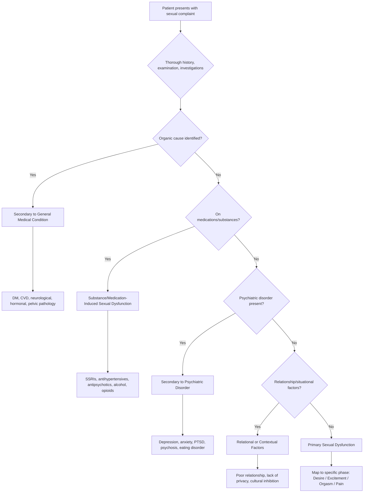

## Differential Diagnosis of Psychosexual Disorders

The differential diagnosis of psychosexual disorders is fundamentally about answering one question: **"Is this a primary psychosexual disorder, or is the sexual/gender symptom a manifestation of something else?"** This requires systematic thinking across organic, psychiatric, substance-related, and relational domains.

Because the three categories of psychosexual disorders (sexual dysfunctions, paraphilias, gender dysphoria) have very different differential diagnoses, we'll address each systematically.

---

### 1. Differential Diagnosis of Sexual Dysfunctions

The core clinical challenge is distinguishing **primary sexual dysfunction** from sexual symptoms that are **secondary to** organic disease, medications, psychiatric illness, or relationship factors. This is not just academic — management is completely different depending on the cause.

#### 1.1 Systematic Approach — The Differential Diagnosis Framework

#### 1.2 Key Differential Diagnoses for Sexual Dysfunctions

| Differential | Key Distinguishing Features | Why It Matters |
|---|---|---|
| **General medical conditions** | History of DM, CVD, neurological disease, endocrine disorder; abnormal examination findings (vasculopathy, neuropathy, hormonal signs); abnormal investigations (glucose, lipids, hormones, prolactin, TFT) [2] | Organic causes are treatable and may be sentinel markers for serious disease (e.g., ED preceding MI by 3–5 years). Must be excluded FIRST. |
| **Substance/medication-induced** | Temporal relationship between drug initiation and onset of dysfunction; improvement with dose reduction/cessation; known culprit drugs: **SSRIs, TCAs, MAOIs, beta-blockers, CCBs, spironolactone, lithium, BZDs, FGA/SGA, antihistamines, alcohol, heroin, stimulants, marijuana** [2] | Extremely common and often overlooked. Always take a meticulous drug history. SSRIs are the single most common medication cause. |
| **Depressive disorder** | Sexual dysfunction is extremely common in depression (~50%) — from the disease itself (anhedonia → ↓desire, psychomotor retardation → ↓arousal) AND from treatment (SSRIs) [2]. Look for: low mood, anhedonia, sleep/appetite disturbance, guilt, suicidal ideation. Sexual symptoms track with mood episodes. | If sexual dysfunction only occurs during depressive episodes and resolves between episodes, primary diagnosis is depression, not a separate sexual dysfunction. |
| **Anxiety disorders** | Performance anxiety is the most common psychological perpetuator of ED. GAD may cause generalised ↓desire. Social anxiety may impair intimacy. PTSD (especially from sexual trauma) can cause aversion, vaginismus, or arousal difficulties [4]. | The vicious cycle: anxiety → sympathetic overdrive → vasoconstriction → ED → more anxiety. Breaking the anxiety is often the treatment. |
| **Psychotic disorders** | Schizophrenia: negative symptoms (apathy, avolition) → ↓desire; positive symptoms (paranoid delusions about partner) → avoidance of intimacy; antipsychotic treatment → hyperprolactinaemia → ↓libido, ED, anorgasmia [2] | Sexual dysfunction in psychosis is multifactorial (disease + medications). Must distinguish from the rare presentation of somatic delusions involving genitalia. |
| **Somatoform disorders** | Patient may present with genital pain or sexual complaints as part of broader somatisation. In somatic symptom disorder, the focus is on distress and maladaptive response to somatic symptoms. No organic explanation found but the patient's concern is disproportionate [5]. | Key distinction: in somatoform disorders, the patient seeks diagnosis and relief from perceived physical symptoms, not specifically complaining about sexual function per se. |
| **Relationship/contextual factors** | Dysfunction is **situational** — e.g., occurs only with partner but not during masturbation; temporal relationship with relationship deterioration; partner confirms conflict/communication problems [2] | "Sex is the barometer of a relationship." If the dysfunction is purely situational and relational, couples therapy is the treatment, not medication. |
| **Normal ageing** | Gradual decline in sexual desire, arousal, and frequency is physiologically normal with age (↓testosterone, ↓oestrogen, ↓vascular compliance). Becomes pathological only when it causes **distress**. | Do not over-pathologise normal ageing. A 75-year-old with reduced libido who is not distressed does not have a "disorder." |
| **Hypogonadism** | Low testosterone (male or female) from any cause: primary (testicular/ovarian failure), secondary (pituitary — check prolactin, FSH, LH), or functional (chronic illness, obesity, opioids). Presents with ↓libido, fatigue, ↓body hair, ↓muscle mass. | Always check sex hormones and prolactin. Hyperprolactinaemia (from pituitary adenoma or antipsychotics) is a treatable cause. |
| **Pelvic/genital pathology** | For dyspareunia specifically: must exclude endometriosis, ovarian cysts, PID, vaginal atrophy, Bartholin's cyst, vulvitis, Peyronie's disease, phimosis [2] | A thorough pelvic/genital examination is mandatory before diagnosing a psychosexual pain disorder. |

<Callout title="The 50% Rule for Depression" type="error">
Approximately **50% of patients with depression** have sexual dysfunction — from the disease itself OR its medications [2]. This means: (1) Always screen for depression in sexual dysfunction, and (2) Always ask about sexual side effects when prescribing antidepressants. The irony is that the treatment for depression (SSRIs) often worsens the sexual dysfunction, creating a clinical dilemma.
</Callout>

#### 1.3 Differentiating Specific Sexual Dysfunctions from Each Other

Within the category of sexual dysfunctions, the key is mapping the complaint to the correct **phase of the sexual response cycle**:

| Complaint | Phase | Disorder | Key Differentiating Point |
|---|---|---|---|
| "I don't feel like having sex" | Desire | Hypoactive sexual desire disorder | Reduced fantasies AND desire; distinguish from sexual aversion (active disgust/avoidance, often trauma-related) |
| "I can't get/maintain an erection" / "I don't get aroused" | Excitement | Erectile disorder / Female arousal disorder | In males: psychogenic vs organic (morning erections preserved?). In females: distinguish from ↓desire (she may desire sex but cannot become physically aroused) |
| "I come too quickly" | Orgasm | Premature ejaculation | Ejaculation within ~1 min (lifelong) or ≤ 3 min (acquired); must cause distress |
| "I can't reach orgasm" | Orgasm | Delayed ejaculation / Female orgasmic disorder | Distinguish from ↓desire (patient is aroused but cannot climax) and from medication effect (SSRIs) |
| "It hurts during sex" | Pain | Genitopelvic pain/penetration disorder | Superficial vs deep pain; with or without muscle spasm (vaginismus component); must exclude organic pelvic pathology |

<Callout title="Situational vs Generalised — The Most Important Distinction">
If a sexual dysfunction is **situational** (e.g., ED only with partner but normal morning erections and masturbation), it is almost certainly **psychogenic or relational**, not organic. If it is **generalised** (present in ALL situations including spontaneous erections), think **organic**. This single distinction drives the entire workup direction.
</Callout>

---

### 2. Differential Diagnosis of Paraphilias

The differential is narrower but carries significant **forensic implications** — getting this wrong has legal consequences [2].

| Differential | Key Distinguishing Features |
|---|---|
| **Normal sexual variation** | DSM-5 distinguishes paraphilia (atypical interest) from paraphilic *disorder* (causes distress or involves harm to others). Consensual, non-distressing atypical interests (e.g., consensual BDSM between adults) are NOT disorders. |
| **Organic/neurological disease** | **Late-onset paraphilic behaviour** (especially in middle-aged/elderly) → must consider frontal lobe dementia, brain tumour (orbitofrontal), Huntington's disease, or **dopamine agonist therapy for Parkinson's disease** [2]. The mechanism: loss of frontal inhibitory control or excessive dopaminergic stimulation of the mesolimbic reward pathway → disinhibited sexual behaviour. |
| **Intellectual disability** | May display inappropriate sexual behaviour due to impaired social judgement, not true paraphilia. The distinction: there is no specific pattern of deviant arousal, just poor behavioural regulation. |
| **Substance intoxication** | Alcohol, stimulants, or other disinhibiting substances may lead to inappropriate sexual behaviour. Key: the behaviour only occurs during intoxication and is not a persistent pattern. |
| **Mania** | Hypersexuality during manic episodes can include impulsive, disinhibited sexual behaviour that may resemble paraphilia. Key: it is episodic, occurs only during mood episodes, and resolves with treatment of mania [6]. |
| **Psychotic disorders** | Rarely, sexual delusions or command hallucinations may drive inappropriate sexual behaviour. The behaviour is driven by psychotic symptoms, not by a persistent pattern of deviant arousal. |
| **Personality disorders** (especially antisocial, borderline) | Impulsive, risky sexual behaviour is common in cluster B personality disorders. Distinguished from paraphilia by: no specific pattern of deviant arousal; sexual acting-out is part of broader impulsivity and interpersonal dysfunction. |
| **OCD with sexual obsessions** | Patients with OCD may have intrusive, unwanted sexual thoughts (e.g., about children, same-sex, taboo acts) that are **ego-dystonic** — they find them repulsive and distressing. In paraphilia, the fantasies are **ego-syntonic** — they are arousing and desired (at least some of the time) [7]. This distinction is critical — OCD patients with sexual obsessions often fear they are "perverts" but they are NOT paraphilic. |
| **Gender dysphoria vs transvestic fetishism** | Cross-dressing in transvestic fetishism is specifically for **sexual arousal**. In gender dysphoria, cross-dressing reflects **gender expression** and is not primarily sexually motivated [2]. Some individuals with transvestic fetishism may later develop gender dysphoria. |

<Callout title="Late-Onset Paraphilia = Always Organic Until Proven Otherwise" type="error">
If someone with a previously normal sexual history develops paraphilic behaviour after age 40–50, ALWAYS investigate for organic causes: frontotemporal dementia, brain tumours, Parkinson's disease medication (dopamine agonists), or other causes of frontal disinhibition [2]. This has forensic as well as clinical implications.
</Callout>

---

### 3. Differential Diagnosis of Gender Dysphoria

| Differential | Key Distinguishing Features |
|---|---|
| **Gender non-conformity** | NOT the same as gender dysphoria. A person can be gender non-conforming (e.g., a boy who likes traditionally feminine activities) without experiencing distress about their gender identity. Gender dysphoria requires **persistent discomfort** with biological sex and **clinically significant distress** [2]. |
| **Transvestic fetishism** | Cross-dressing is for **sexual arousal**, not gender expression. The individual identifies with their assigned gender. However, some may develop gender dysphoria over time ("secondary gender dysphoria") [2]. |
| **Body dysmorphic disorder (BDD)** | In BDD, the person is preoccupied with a perceived defect in physical appearance, which may include genital appearance. However, BDD does not involve a desire to be another gender — the distress is about the appearance of a specific body part, not about gender identity. |
| **Psychotic disorders** | Very rarely, a patient may have a delusion of being the opposite sex (e.g., "I have been transformed into a woman"). This is a delusional belief, not gender dysphoria. Key: it occurs in the context of other psychotic symptoms, onset is usually acute, and it resolves with antipsychotic treatment. |
| **Disorders of sex development (DSD / intersex conditions)** | Individuals with ambiguous genitalia, chromosomal anomalies (e.g., Klinefelter's 47,XXY, Turner's 45,X, congenital adrenal hyperplasia) may have gender identity questions. These are medically distinct from gender dysphoria in individuals with typical sex development, though gender dysphoria can coexist. |
| **Homosexuality** | Sexual orientation (who you are attracted to) is NOT the same as gender identity (who you are). A gay man identifies as male; a transgender woman may be attracted to men or women. These are independent dimensions. Homosexuality is NOT a disorder. |
| **Normal childhood gender exploration** | Young children frequently engage in cross-gender play and experimentation. This is developmentally normal. Gender dysphoria in children requires a persistent, insistent pattern — not just occasional role-play. Many children with gender non-conforming behaviour **desist** by adolescence [2]. |
| **Autism spectrum disorder (ASD)** | Higher rates of gender diversity are noted in individuals with ASD. Careful assessment is needed to ensure the individual understands the concept of gender identity and that the dysphoria is genuine, not a manifestation of rigid thinking or social difficulties. |

<Callout title="Key Principle: Assess Comorbidity Before Attributing Everything to Gender Dysphoria">
Gender dysphoria has **significantly increased comorbid Axis I disorders, especially mood and anxiety disorders** [2]. Before confirming a diagnosis, one must rule out and treat any significant comorbid mental illness that might be contributing to identity confusion or distress. This does NOT mean denying the patient's experience — it means ensuring a thorough assessment. This is emphasised in the SOC guidelines [2].
</Callout>

---

### 4. Cross-Cutting Differential Considerations

Some differentials apply across all three categories:

| Cross-Cutting Differential | Relevance |
|---|---|
| **Substance use disorders** | Alcohol: acute disinhibition (paraphilia-like behaviour), chronic ↓testosterone (sexual dysfunction), chronic personality change. Stimulants: acute hypersexuality, chronic dysfunction. Opioids: ↓GnRH → hypogonadism → ↓desire [2]. |
| **Medications** | SSRIs → sexual dysfunction; antipsychotics → hyperprolactinaemia → sexual dysfunction; dopamine agonists → hypersexuality/paraphilia-like behaviour [2]. |
| **Personality disorders** | Borderline PD: identity disturbance may include confusion about gender or sexual identity; impulsive sexual behaviour may mimic paraphilia. Antisocial PD: sexual offending may overlap with paraphilia. |
| **Factitious disorder / Malingering** | Rarely, patients may fabricate or exaggerate sexual symptoms (factitious: for the sick role; malingering: for external gain, e.g., legal proceedings). Consider if the presentation is inconsistent or if there is secondary gain [5]. |
| **Normal stress reactions and adjustment disorder** | Acute stress, bereavement, major life change → transient sexual dysfunction. If ≤ 3 months and below threshold for specific disorder → adjustment disorder, not primary sexual dysfunction [4]. |

---

### 5. Summary Differential Diagnosis Table

| Presenting Complaint | Think About | Key Distinguishing Feature |
|---|---|---|
| ↓ Libido | Depression, hypogonadism, hyperprolactinaemia, medications, relationship issues, normal ageing | Is there a mood disorder? Check hormones. Is it situational? |
| Erectile dysfunction | DM, CVD, medications, performance anxiety, depression, neurological disease | Morning erections preserved? Situational? Drug history? |
| Premature ejaculation | Primary (lifelong, serotonergic), secondary (anxiety, ED, prostatitis, thyroid) | Lifelong vs acquired? Comorbid ED? Check TFT. |
| Dyspareunia/vaginismus | Organic pelvic pathology, atrophic vaginitis, infection, endometriosis, phobic response, PTSD | Superficial vs deep? Examination findings? Trauma history? |
| Paraphilic behaviour | Primary paraphilia, organic disinhibition, substance use, mania, OCD with sexual obsessions, PD | Age of onset? New medications? Ego-syntonic vs dystonic? |
| Gender dysphoria | True GD, gender non-conformity, transvestic fetishism, BDD, psychosis, DSD, normal childhood play | Persistent and insistent? Causes distress? Cross-gender identification vs arousal? |

---

<Callout title="High Yield Summary — Differential Diagnosis of Psychosexual Disorders">

1. **Sexual dysfunctions**: Always exclude organic (DM #1, CVD), medication-induced (SSRIs #1), psychiatric (depression ~50% have SD), and relational causes before diagnosing primary sexual dysfunction.

2. **Situational vs Generalised** is the most important clinical distinction for sexual dysfunction — situational = likely psychogenic/relational; generalised = likely organic.

3. **Paraphilias**: Distinguish from OCD with sexual obsessions (ego-dystonic vs ego-syntonic), organic disinhibition (late-onset = always investigate), mania, substance use, and personality disorders.

4. **Late-onset paraphilia** = organic until proven otherwise (frontotemporal dementia, dopamine agonists, brain tumour).

5. **Gender dysphoria**: Distinguish from gender non-conformity (no distress), transvestic fetishism (arousal-driven), BDD (appearance-focused), psychosis (delusional), and normal childhood exploration.

6. **Always assess comorbid psychiatric illness** — mood and anxiety disorders are highly comorbid with all psychosexual disorders, and treating these may resolve or improve sexual symptoms.

7. **Drug history is essential** — SSRIs, antipsychotics, antihypertensives, dopamine agonists, and substances of abuse are all common culprits.

</Callout>

---

<ActiveRecallQuiz
  title="Active Recall - Differential Diagnosis of Psychosexual Disorders"
  items={[
    {
      question: "A 45-year-old man on sertraline for depression presents with inability to reach orgasm. What is the most likely cause of his sexual dysfunction, and what is the pathophysiological mechanism?",
      markscheme: "SSRI-induced delayed orgasm / anorgasmia. Mechanism: SSRIs increase serotonin at synaptic cleft, which inhibits dopaminergic and nitric oxide pathways involved in orgasm. Serotonin has a generally inhibitory effect on sexual function, particularly the orgasm phase. Temporal relationship with drug initiation confirms the diagnosis."
    },
    {
      question: "How do you differentiate OCD with sexual obsessions from a paraphilic disorder? Why is this distinction clinically critical?",
      markscheme: "OCD sexual obsessions are ego-dystonic (unwanted, distressing, repulsive to the patient), whereas paraphilic fantasies are ego-syntonic (arousing, desired). In OCD, patients are horrified by their thoughts and seek help to eliminate them. In paraphilia, the fantasies are a source of pleasure. Distinction is critical because: (1) OCD is treated with SSRIs/CBT with ERP, not sex offender protocols; (2) misdiagnosis causes unnecessary distress and stigma; (3) forensic implications differ entirely."
    },
    {
      question: "A 68-year-old man with Parkinson's disease on pramipexole is brought by his wife for new-onset voyeuristic behaviour. What differential diagnoses should you consider and what is the likely mechanism?",
      markscheme: "Differentials: (1) Dopamine agonist-induced paraphilic behaviour (most likely) - pramipexole stimulates mesolimbic dopamine pathway causing disinhibition and hypersexuality; (2) Frontotemporal dementia - loss of frontal inhibitory control; (3) PD-related cognitive decline with behavioural disinhibition. Mechanism of most likely cause: dopamine agonists excessively stimulate D2/D3 receptors in the ventral striatum/nucleus accumbens (reward pathway), lowering the threshold for impulsive/compulsive sexual behaviours."
    },
    {
      question: "What features distinguish gender dysphoria from transvestic fetishism?",
      markscheme: "Gender dysphoria: cross-dressing reflects gender expression and identity; the person identifies as the other gender; not primarily sexually motivated; persistent discomfort with biological sex; desire for opposite sex characteristics. Transvestic fetishism: cross-dressing is specifically for sexual arousal; the person identifies with their assigned gender; arousal diminishes after orgasm; no persistent desire to be the other gender. Note: some with transvestic fetishism may develop secondary gender dysphoria over time."
    },
    {
      question: "Name 3 features that suggest erectile dysfunction is psychogenic rather than organic.",
      markscheme: "(1) Preserved morning erections (indicates intact neurovascular mechanism); (2) Situational - can achieve erection with masturbation or different partner but not with usual partner; (3) Sudden onset (organic tends to be gradual). Additional: younger age, linked to stress/anxiety/relationship problems, no risk factors for vascular/neurological disease."
    }
  ]}
/>

## References

[2] Senior notes: ryanho-psych.md (Sections 9.3, 9.3.2, 9.3.3)
[4] Senior notes: ryanho-psych.md (Section 8.1.1 — Approach to Anxiety; Section 8.3 — PTSD differential)
[5] Senior notes: ryanho-psych.md (Section 8.4 — Somatoform Disorders, approach to medically unexplained symptoms)
[6] Senior notes: ryanho-psych.md (Section 7.2 — Differential diagnosis of mania)
[7] Senior notes: ryanho-psych.md (Section 8.2 — OCD differential diagnoses)
