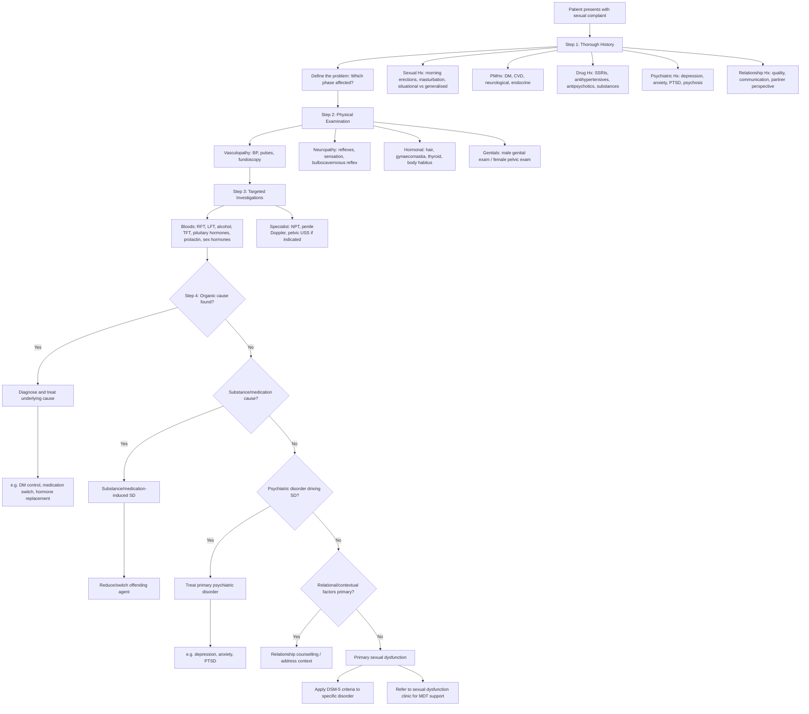
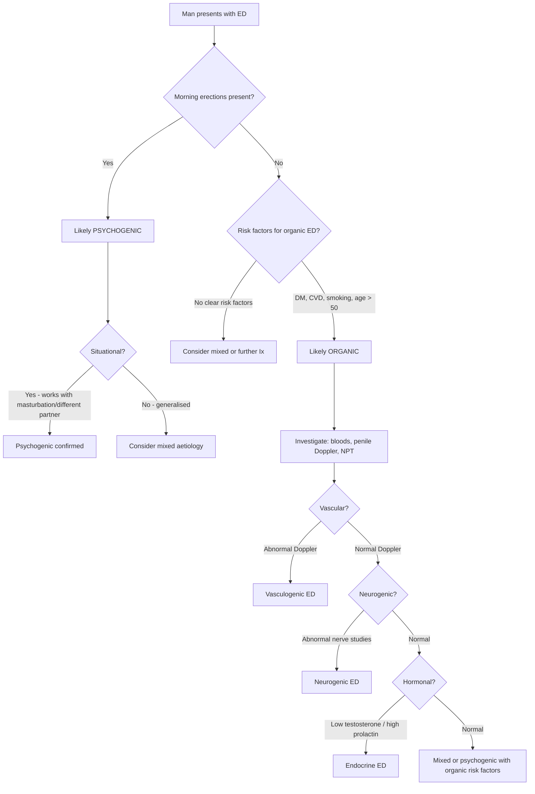
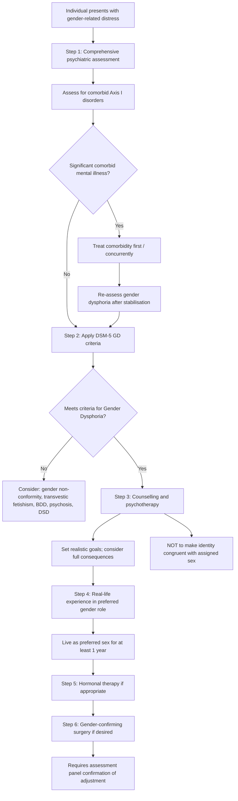

## Diagnostic Criteria, Diagnostic Algorithm, and Investigations for Psychosexual Disorders

The diagnosis of psychosexual disorders is fundamentally **clinical** — there is no blood test or scan that "confirms" a sexual dysfunction, paraphilia, or gender dysphoria. However, investigations are essential to **exclude organic causes** and **identify treatable contributing factors**. The diagnostic process follows a structured approach: history → examination → targeted investigations → application of diagnostic criteria.

---

### 1. Diagnostic Criteria

#### 1.1 Sexual Dysfunctions — DSM-5-TR Criteria

All DSM-5-TR sexual dysfunction diagnoses share common structural elements [2]:

**Universal DSM-5-TR requirements for all sexual dysfunctions:**
- Symptoms must be **persistent or recurrent**
- Must be present for a **minimum of approximately 6 months**
- Must cause **clinically significant distress** in the individual
- Must **not be better explained by** a non-sexual psychiatric disorder, severe relationship distress, other significant stressors, or substance/medication effects
- Must **specify**: lifelong vs acquired; generalised vs situational; severity (mild/moderate/severe)

##### 1.1.1 Male Hypoactive Sexual Desire Disorder

| Criterion | Detail |
|---|---|
| A | Persistently or recurrently deficient (or absent) **sexual/erotic thoughts or fantasies AND desire for sexual activity** |
| B | Symptoms persist for ≥ 6 months |
| C | Causes clinically significant distress |
| D | Not better explained by another mental disorder, medical condition, substance, or relationship factors |
| Specifiers | Lifelong/acquired; generalised/situational; mild/moderate/severe |

*Why this criterion matters*: Note that BOTH fantasies AND desire must be reduced — a person who has fantasies but doesn't act on them may have other barriers (relationship, opportunity) rather than a desire disorder.

##### 1.1.2 Female Sexual Interest/Arousal Disorder

| Criterion | Detail |
|---|---|
| A | Lack of, or significantly reduced, sexual interest/arousal as manifested by **≥ 3 of the following**: (1) absent/reduced interest in sexual activity; (2) absent/reduced sexual/erotic thoughts or fantasies; (3) no/reduced initiation of sexual activity and typically unreceptive to partner's attempts; (4) absent/reduced sexual excitement/pleasure during sexual activity in ≥ 75% of encounters; (5) absent/reduced sexual interest/arousal in response to any internal or external sexual/erotic cues; (6) absent/reduced genital or non-genital sensations during sexual activity in ≥ 75% of encounters |
| B–D | As above (≥ 6 months, distress, exclusions) |

*Why DSM-5 combined interest and arousal in females*: Research showed that in women, desire and arousal are much more intertwined than in men — many women experience "responsive desire" (arousal precedes and generates desire) rather than "spontaneous desire." Separating them artificially missed many women's experiences.

##### 1.1.3 Erectile Disorder

| Criterion | Detail |
|---|---|
| A | **≥ 1 of the following** on almost all (≥ 75%) occasions of sexual activity: (1) marked difficulty in obtaining an erection during sexual activity; (2) marked difficulty in maintaining an erection until completion of sexual activity; (3) marked decrease in erectile rigidity |
| B–D | As above |

*Why 75%*: Occasional erectile difficulties are normal (fatigue, stress, alcohol). The threshold of ≥ 75% ensures we are capturing a genuine pattern, not isolated incidents.

##### 1.1.4 Premature Ejaculation

| Criterion | Detail |
|---|---|
| A | A persistent or recurrent pattern of ejaculation occurring during partnered sexual activity within approximately **1 minute** following vaginal penetration and **before the individual wishes it** |
| B–D | As above |
| Note | For non-vaginal sexual activities, no specific time criteria established; clinical judgement applies. For lifelong PE the threshold is ~1 minute; for acquired PE, ≤ 3 minutes is clinically significant |

*Why the time criterion*: Normative data show that the median intravaginal ejaculatory latency time (IELT) is ~5.4 minutes. An IELT of < 1 minute is below the 2.5th percentile and consistently associated with distress and poor sexual satisfaction.

##### 1.1.5 Delayed Ejaculation

| Criterion | Detail |
|---|---|
| A | **Either** of the following on almost all (≥ 75%) occasions of partnered sexual activity: (1) marked delay in ejaculation; (2) marked infrequency or absence of ejaculation |
| B–D | As above |

##### 1.1.6 Female Orgasmic Disorder

| Criterion | Detail |
|---|---|
| A | **≥ 1 of the following** on almost all (≥ 75%) occasions: (1) marked delay in, infrequency of, or absence of orgasm; (2) markedly reduced intensity of orgasmic sensations |
| B–D | As above |
| Specifier | "Never experienced an orgasm under any situation" (for lifelong subtype) |

##### 1.1.7 Genitopelvic Pain/Penetration Disorder

| Criterion | Detail |
|---|---|
| A | Persistent or recurrent difficulties with **≥ 1 of the following**: (1) vaginal penetration during intercourse; (2) marked vulvovaginal or pelvic **pain** during vaginal intercourse or penetration attempts; (3) marked **fear or anxiety** about vulvovaginal or pelvic pain in anticipation of, during, or as a result of vaginal penetration; (4) marked **tensing or tightening of the pelvic floor muscles** during attempted vaginal penetration |
| B–D | As above |

*Why DSM-5 merged dyspareunia and vaginismus*: Clinically, pain, fear, and muscle spasm are so intertwined that separating them was artificial. Most patients present with a combination — pain causes fear, fear causes spasm, spasm causes more pain [2].

##### 1.1.8 Substance/Medication-Induced Sexual Dysfunction

| Criterion | Detail |
|---|---|
| A | A clinically significant disturbance in sexual function |
| B | Evidence from history, examination, or investigations that the dysfunction developed during or soon after substance intoxication/withdrawal OR the medication is known to cause the dysfunction |
| C | Not better explained by a non-substance-induced sexual dysfunction |
| Specifiers | With onset during intoxication; with onset during withdrawal; with onset after medication use |

---

#### 1.2 Paraphilic Disorders — DSM-5-TR Criteria

All paraphilic disorder diagnoses share a two-criterion structure [2][8]:

**Criterion A**: Recurrent and intense **sexually arousing fantasies, sexual urges, or behaviours** involving the specific paraphilic focus, **over a period of at least 6 months**

**Criterion B**: The individual has **acted on** these urges with a non-consenting person, OR the urges/fantasies cause **clinically significant distress or impairment** in social, occupational, or other functioning

| Paraphilic Disorder | Criterion A Specifics | Criterion B Notes |
|---|---|---|
| **Exhibitionistic disorder** | Exposure of genitals to an unsuspecting person | Acting on urges = sufficient for diagnosis (non-consenting victim) |
| **Voyeuristic disorder** | Observing an unsuspecting person who is naked, undressing, or engaging in sexual activity | Acting on urges = sufficient |
| **Frotteuristic disorder** | Touching or rubbing against a non-consenting person | Acting on urges = sufficient |
| **Sexual masochism disorder** | Being humiliated, beaten, bound, or otherwise made to suffer | Requires distress/impairment (consensual masochism without distress is NOT a disorder) |
| **Sexual sadism disorder** | Physical or psychological suffering of another person | Acting on non-consenting person = sufficient |
| **Paedophilic disorder** | Sexual activity with a prepubescent child (generally age ≤ 13); individual must be ≥ 16 years and ≥ 5 years older than the child | Acting on urges = sufficient |
| **Fetishistic disorder** | Use of non-living objects or highly specific focus on non-genital body parts | Requires distress/impairment |
| **Transvestic disorder** | Cross-dressing | Requires distress/impairment; specifiers: with fetishism, with autogynephilia |

<Callout title="Paraphilia ≠ Paraphilic Disorder — Critical Exam Distinction" type="error">
DSM-5 explicitly states that having an atypical sexual interest (paraphilia) is NOT sufficient for a diagnosis. It becomes a **disorder** only when Criterion B is met — i.e., distress/impairment OR involvement of non-consenting persons/harm. This is an intentional de-pathologisation of consensual, non-distressing atypical sexuality. In an exam, always state both criteria.
</Callout>

---

#### 1.3 Gender Dysphoria — DSM-5-TR Criteria [2]

##### In Adolescents and Adults

| Criterion | Detail |
|---|---|
| A | A marked incongruence between one's experienced/expressed gender and assigned gender, of **≥ 6 months** duration, as manifested by **≥ 2** of the following: (1) marked incongruence between experienced gender and primary/secondary sex characteristics; (2) strong desire to be rid of one's primary/secondary sex characteristics; (3) strong desire for primary/secondary sex characteristics of the other gender; (4) strong desire to be of the other gender (or an alternative gender); (5) strong desire to be treated as the other gender; (6) strong conviction that one has typical feelings/reactions of the other gender |
| B | The condition is associated with **clinically significant distress** or impairment in social, occupational, or other areas of functioning |
| Specifier | With or without a disorder of sex development; post-transition |

##### In Children

| Criterion | Detail |
|---|---|
| A | Marked incongruence between experienced/expressed gender and assigned gender, ≥ 6 months, manifested by **≥ 6 of the following** (must include criterion 1): (1) strong desire to be of the other gender or insistence that one IS the other gender; (2) strong preference for cross-dressing; (3) strong preference for cross-gender roles in make-believe play; (4) strong preference for toys/activities stereotypically used by the other gender; (5) strong preference for playmates of the other gender; (6) strong rejection of typically gender-congruent toys/activities; (7) strong dislike of one's sexual anatomy; (8) strong desire for primary/secondary sex characteristics matching experienced gender |
| B | Clinically significant distress or impairment |

*Why 6 of 8 for children but only 2 of 6 for adults?*: The threshold is deliberately higher for children because gender non-conforming behaviour is common in childhood and many children desist. A higher bar reduces over-diagnosis. In contrast, by adolescence/adulthood, the presentation is typically more crystallised.

> **Diagnosis can be by any appropriately trained health professional** under the latest guidelines (WPATH SOC-8) [2]. This is a deliberate de-gatekeeping measure — you do not need a specialist psychiatrist specifically, though in Hong Kong, referral to a psychiatrist with expertise in gender identity is standard practice.

---

#### 1.4 ICD-11 Classification Differences (Current WHO System)

| Condition | ICD-11 Term | Key Change from ICD-10 |
|---|---|---|
| Sexual dysfunctions | Sexual dysfunctions | Broadly similar to DSM-5; explicitly requires distress |
| Paraphilias | Paraphilic disorders | Similar two-criterion structure; emphasises harm/distress |
| Gender dysphoria | **Gender Incongruence** | Moved OUT of "Mental and Behavioural Disorders" chapter → into "Conditions related to sexual health" — a landmark **de-psychiatrisation** move |

---

### 2. Diagnostic Algorithm

#### 2.1 Master Diagnostic Algorithm for Sexual Complaints

[2]

#### 2.2 Algorithm for Distinguishing Psychogenic vs Organic Erectile Dysfunction

#### 2.3 Algorithm for Gender Dysphoria Assessment [2]

---

### 3. Investigation Modalities

#### 3.1 Investigations for Sexual Dysfunctions

The purpose of investigations is threefold: (1) **exclude organic causes**, (2) **identify treatable contributing factors**, and (3) **establish a baseline** before treatment. Investigations should be **targeted based on clinical suspicion** from history and examination, not shotgun [2].

##### 3.1.1 Blood Investigations

| Investigation | What It Tells You | Key Findings and Interpretation |
|---|---|---|
| **Renal function tests (RFT)** | Chronic kidney disease causes sexual dysfunction via uraemia, anaemia, autonomic neuropathy, ↓testosterone, hyperprolactinaemia | ↑Urea, ↑creatinine → CKD contributing to SD |
| **Liver function tests (LFT)** | Chronic liver disease → ↑SHBG → ↓free testosterone → ↓libido, ED; also ↑oestrogen (impaired hepatic metabolism) → gynaecomastia, feminisation | ↑Bilirubin, ↑transaminases, ↓albumin → chronic liver disease |
| **Alcohol level** | Acute alcohol intoxication → CNS depression → ↓arousal; chronic alcohol → ↓testosterone, liver disease, neuropathy [2] | Elevated → may explain dysfunction; also screen with CAGE/AUDIT |
| **Thyroid function tests (TFT)** | Hypothyroidism → ↓libido, ED, delayed ejaculation, fatigue; Hyperthyroidism → premature ejaculation (↑sympathetic tone), ↓libido | ↑TSH, ↓fT4 → hypothyroidism; ↓TSH, ↑fT4 → hyperthyroidism |
| **Pituitary hormones (including prolactin)** | Hyperprolactinaemia (from pituitary adenoma, antipsychotics, hypothyroidism) → directly suppresses GnRH → ↓LH/FSH → ↓testosterone → ↓libido, ED, anorgasmia | ↑Prolactin → investigate cause (MRI pituitary if significantly elevated, review medications). Even mildly elevated prolactin can cause SD |
| **Sex hormone profile** | Testosterone (total AND free), oestradiol, FSH, LH, SHBG | ↓Testosterone: primary hypogonadism if ↑FSH/LH (testicular failure); secondary if ↓FSH/LH (pituitary/hypothalamic cause). SHBG ↑ with age, liver disease, hyperthyroidism → ↓bioavailable testosterone even if total is "normal" |
| **Fasting glucose / HbA1c** | DM is the #1 organic cause of ED (vasculopathy + neuropathy) [2] | ↑Glucose or HbA1c ≥ 6.5% → DM. Even pre-diabetes contributes |
| **Lipid profile** | Dyslipidaemia → atherosclerosis → penile vascular disease → ED | ↑LDL, ↓HDL, ↑triglycerides → cardiovascular risk, treat aggressively |
| **FBC** | Anaemia → fatigue → ↓desire; chronic disease | ↓Hb → investigate cause |

[2]

<Callout title="The Essential Sexual Dysfunction Blood Panel">
**Must-order in any sexual dysfunction workup** [2]:
- RFT, LFT, Alcohol
- TFT
- Pituitary hormones (including **prolactin**)
- Sex hormone profile (testosterone, oestradiol, FSH, LH, SHBG)
- Fasting glucose / HbA1c
- Lipid profile

The mnemonic **"RATS Have Sexy Lives"**: **R**FT, **A**lcohol/LFT, **T**FT, **S**ex hormones + prolactin, **H**bA1c, **L**ipids
</Callout>

##### 3.1.2 Specialist Investigations

| Investigation | Indication | What It Measures | Key Findings |
|---|---|---|---|
| **Nocturnal penile tumescence (NPT) testing** | Distinguishing psychogenic from organic ED when clinical assessment is equivocal | Measures erections during REM sleep using a portable device (RigiScan) worn overnight for 2–3 nights | **Normal NPT** (3–5 episodes per night, rigidity > 60%, duration > 10 min) → psychogenic ED (the neurovascular mechanism is intact; the problem is psychological). **Abnormal NPT** → organic ED. This is the gold standard for this distinction because during REM sleep, psychological inhibition is removed. |
| **Penile Doppler ultrasound** | Suspected vasculogenic ED | Measures peak systolic velocity (PSV) and end-diastolic velocity (EDV) in cavernous arteries after intracavernosal injection of alprostadil (PGE1) | PSV < 25 cm/s → **arterial insufficiency**; EDV > 5 cm/s → **venous leak** (blood fills the corpora but drains out too quickly). Normal: PSV > 35 cm/s, EDV < 5 cm/s |
| **Intracavernosal injection test** | Assessing erectile capacity independent of neurological input | Direct injection of alprostadil into the corpus cavernosum | Full erection within 10 minutes that lasts > 30 minutes → intact vascular mechanism (neurogenic or psychogenic cause). Poor response → vasculogenic ED |
| **Biothesiometry / nerve conduction studies** | Suspected neurogenic ED (DM neuropathy, spinal cord lesion) | Measures penile vibration perception threshold; or formal nerve conduction studies of pudendal nerve | Elevated vibration threshold → peripheral neuropathy contributing to ED |
| **Pelvic ultrasound (female)** | Dyspareunia with suspected pelvic pathology | Assesses for ovarian cysts, endometriosis, fibroids, pelvic masses | Identifies organic causes of deep dyspareunia |
| **Vaginal pH / swabs** | Suspected infection or atrophic vaginitis contributing to dyspareunia | Vaginal pH, microscopy, culture | pH > 4.5 + thin epithelium → atrophic vaginitis; positive cultures → infection |

##### 3.1.3 Psychological Assessment Tools

| Tool | Purpose | Key Features |
|---|---|---|
| **International Index of Erectile Function (IIEF-5)** | Standardised screening and severity grading for ED | 5-item questionnaire; score 5–25; severe ED ≤ 7, mild ED 17–21 |
| **Female Sexual Function Index (FSFI)** | Comprehensive assessment of female sexual function across 6 domains | 19 items; domains: desire, arousal, lubrication, orgasm, satisfaction, pain; total score ≤ 26.55 suggests dysfunction |
| **Premature Ejaculation Diagnostic Tool (PEDT)** | Screening for PE | 5 items; score ≥ 11 = PE likely |
| **Patient Health Questionnaire (PHQ-9)** | Screen for comorbid depression | 9 items; ≥ 10 = moderate depression requiring treatment |
| **Generalised Anxiety Disorder scale (GAD-7)** | Screen for comorbid anxiety | 7 items; ≥ 10 = moderate anxiety |

#### 3.2 Investigations for Paraphilias

Paraphilia diagnosis is **almost entirely clinical** — based on history (often corroborated by forensic/legal records). However, investigations may be relevant in specific contexts [2]:

| Investigation | Indication | Purpose |
|---|---|---|
| **Penile plethysmography (phallometry)** | Forensic assessment (especially paedophilia) | Measures penile circumference changes in response to visual/auditory sexual stimuli. Can help identify patterns of deviant arousal. Controversial — ethical and privacy concerns; not universally used. |
| **Neuroimaging (MRI brain)** | Late-onset paraphilia, suspected organic cause | Rule out frontal lobe pathology (frontotemporal dementia, tumour) in new-onset paraphilic behaviour in middle-aged/elderly patients |
| **Testosterone, LH, FSH** | Baseline before anti-androgen therapy | Need pre-treatment levels to monitor response; also to exclude hypogonadism as confound |
| **LFT, FBC, coagulation** | Before pharmacotherapy (anti-androgens) | Cyproterone acetate is hepatotoxic — need baseline LFT |
| **Cognitive screening (MMSE / MoCA)** | Late-onset, suspected dementia | Screen for frontotemporal dementia or other neurodegenerative cause |

<Callout title="Paraphilia Assessment Has Forensic Implications" type="error">
When assessing paraphilias, remember two priorities [2]:
1. **Diagnosis** — which has forensic/legal implications (e.g., paedophilia → mandatory reporting obligations)
2. **Risk assessment** — risk to others, need to report to authorities

Document meticulously. In Hong Kong, if there is a credible risk of harm to identifiable persons (especially children), the clinician has a duty to report to the Social Welfare Department or police.
</Callout>

#### 3.3 Investigations for Gender Dysphoria [2]

Gender dysphoria diagnosis is **clinical** — made by applying DSM-5/ICD-11 criteria during a comprehensive psychiatric assessment. There is no confirmatory investigation. However, investigations are relevant at specific stages:

| Investigation | Stage | Purpose |
|---|---|---|
| **Comprehensive psychiatric assessment** | Initial | Rule out and treat any **significant comorbid mental illness** (mood, anxiety disorders are highly comorbid) [2]; distinguish from transvestic fetishism, BDD, psychosis, DSD |
| **Karyotype** | If DSD suspected | Rule out chromosomal abnormalities (47,XXY Klinefelter's, 45,X Turner's, etc.) |
| **Baseline hormones** | Before hormonal therapy | Testosterone, oestradiol, FSH, LH, prolactin, TFT — establish baseline for monitoring |
| **LFT, lipids, FBC, coagulation** | Before hormonal therapy | MtF: oestrogen therapy ↑risk of VTE, hepatotoxicity. FtM: testosterone → polycythaemia (↑RBC) |
| **Bone densitometry (DEXA)** | During hormonal therapy | Monitor bone health — especially in MtF on anti-androgens (↓testosterone → ↓bone density) |
| **Prolactin** | During MtF hormonal therapy | Oestrogen therapy can ↑prolactin → monitor for prolactinoma |
| **Psychological assessment tools** | Throughout | PHQ-9, GAD-7 for comorbid mood/anxiety; gender identity questionnaires |

---

### 4. Interpretation Framework — Putting It All Together

The investigation results should be interpreted in the context of the clinical picture. Here is a practical interpretation framework:

| Finding | Interpretation | Next Step |
|---|---|---|
| ↓ Total testosterone, ↑ FSH/LH | **Primary hypogonadism** (testicular failure — e.g., Klinefelter's, age-related, orchitis) | Testosterone replacement therapy; karyotype if young |
| ↓ Total testosterone, ↓ FSH/LH | **Secondary hypogonadism** (pituitary or hypothalamic cause) | Check prolactin → if ↑, MRI pituitary (prolactinoma?). If normal prolactin, consider hypothalamic cause (stress, opioids, obesity) |
| ↑ Prolactin | **Hyperprolactinaemia** | Review medications (antipsychotics, metoclopramide); if no medication cause → MRI pituitary. Prolactin > 200 μg/L strongly suggests macroprolactinoma |
| ↑ TSH, ↓ fT4 | **Hypothyroidism** | Treat with levothyroxine — may improve libido, ED, delayed ejaculation |
| ↓ TSH, ↑ fT4 | **Hyperthyroidism** | May cause premature ejaculation (↑sympathetic tone); treat underlying cause |
| ↑ HbA1c / fasting glucose | **Diabetes mellitus** | Optimise glycaemic control; ED in DM is multifactorial (vascular + neurogenic) |
| Normal NPT + abnormal clinical ED | **Psychogenic ED** | Psychosexual counselling, sensate focus, address anxiety |
| Abnormal NPT + abnormal clinical ED | **Organic ED** | Further vascular/neurogenic workup; consider PDE5 inhibitor trial |
| PSV < 25 cm/s on Doppler | **Arterial insufficiency** | CVD risk factor modification; PDE5 inhibitor; consider vascular surgery if severe |
| EDV > 5 cm/s on Doppler | **Venous leak** | Poor response to PDE5 inhibitors; may need surgical correction or penile prosthesis |

<Callout title="High Yield Summary — Diagnosis of Psychosexual Disorders">

1. **All DSM-5 sexual dysfunctions** require: ≥ 6 months duration, clinically significant distress, not better explained by another disorder/substance/medical condition. Specify lifelong vs acquired, generalised vs situational.

2. **Paraphilic disorders** require TWO criteria: (A) recurrent intense atypical fantasies/urges/behaviours ≥ 6 months AND (B) distress/impairment OR involvement of non-consenting persons. Paraphilia without Criterion B is NOT a disorder.

3. **Gender dysphoria** in adults requires ≥ 2 of 6 features for ≥ 6 months + distress. In children, ≥ 6 of 8 features (higher threshold to avoid over-diagnosis). ICD-11 reclassified as "Gender Incongruence" outside of mental disorders.

4. **Investigations for sexual dysfunction** [2]: RFT, LFT, alcohol, TFT, pituitary hormones (prolactin), sex hormone profile, HbA1c, lipids. Specialist: NPT (psychogenic vs organic ED), penile Doppler (vascular ED).

5. **NPT is the gold standard** for distinguishing psychogenic from organic ED: normal NPT = intact neurovascular mechanism = psychogenic.

6. **Morning erections preserved + situational dysfunction = psychogenic**. This simple clinical observation often obviates expensive testing.

7. **Late-onset paraphilia → MRI brain** to exclude frontotemporal dementia or tumour.

8. **Gender dysphoria diagnosis is clinical** — investigations support pre-treatment workup, not diagnosis itself. Comprehensive psychiatric assessment to rule out comorbid Axis I disorders is essential.

</Callout>

---

<ActiveRecallQuiz
  title="Active Recall - Diagnostic Criteria and Investigations for Psychosexual Disorders"
  items={[
    {
      question: "What are the universal DSM-5-TR requirements shared by ALL sexual dysfunction diagnoses? Name 4 features.",
      markscheme: "(1) Persistent or recurrent symptoms; (2) Duration of approximately 6 months or more; (3) Causes clinically significant distress; (4) Not better explained by another mental disorder, medical condition, substance/medication, or severe relationship distress. Additionally must specify: lifelong vs acquired, generalised vs situational, severity."
    },
    {
      question: "What distinguishes a paraphilia from a paraphilic disorder in DSM-5? Why is this distinction clinically important?",
      markscheme: "Paraphilia = atypical sexual interest alone (Criterion A only: recurrent intense fantasies/urges/behaviours for 6 or more months). Paraphilic DISORDER = paraphilia PLUS Criterion B: causes clinically significant distress/impairment in the individual OR involves non-consenting persons/risk of harm. Important because: de-pathologises consensual non-distressing atypical sexuality; prevents over-diagnosis; has forensic implications; changes management approach."
    },
    {
      question: "List the essential blood investigations for a sexual dysfunction workup and explain why prolactin is included.",
      markscheme: "Essential bloods: RFT, LFT, alcohol level, TFT, pituitary hormones including prolactin, sex hormone profile (testosterone, oestradiol, FSH, LH, SHBG), fasting glucose/HbA1c, lipid profile. Prolactin is included because: hyperprolactinaemia (from pituitary adenoma or antipsychotics) directly suppresses GnRH, leading to decreased LH/FSH, decreased testosterone, causing decreased libido, ED, and anorgasmia. It is a treatable cause that is often missed."
    },
    {
      question: "How does nocturnal penile tumescence testing distinguish psychogenic from organic ED, and what is the physiological basis?",
      markscheme: "NPT measures spontaneous erections during REM sleep over 2-3 nights. During REM sleep, psychological inhibition is removed, so if the neurovascular mechanism is intact, erections will occur normally. Normal NPT (3-5 episodes/night, rigidity > 60%, duration > 10 min) indicates intact vascular and neurological pathways, therefore the ED is psychogenic. Abnormal NPT indicates organic cause (vascular, neurogenic, or hormonal)."
    },
    {
      question: "Why does the DSM-5 require 6 of 8 criteria for gender dysphoria in children but only 2 of 6 in adults?",
      markscheme: "Higher threshold in children because: (1) gender non-conforming behaviour is common and developmentally normal in childhood; (2) many children with gender non-conforming behaviour desist by adolescence (reported desistance rates 60-80% in older studies); (3) gender identity is still developing in young children. By adolescence/adulthood, gender identity is more crystallised and the presentation more stable, so a lower threshold is appropriate. The higher bar prevents over-diagnosis and unnecessary medical intervention in children."
    },
    {
      question: "A man on risperidone presents with erectile dysfunction and decreased libido. What investigation finding would you expect and what is the mechanism?",
      markscheme: "Expected finding: elevated serum prolactin (hyperprolactinaemia). Mechanism: Risperidone (a second-generation antipsychotic with high D2 antagonism) blocks dopamine D2 receptors in the tuberoinfundibular pathway. Dopamine normally tonically inhibits prolactin release from the anterior pituitary. Loss of this inhibition leads to elevated prolactin, which suppresses GnRH from the hypothalamus, leading to decreased LH/FSH, decreased testosterone, resulting in decreased libido and ED."
    }
  ]}
/>

## References

[2] Senior notes: ryanho-psych.md (Sections 9.3, 9.3.2, 9.3.3)
[8] Senior notes: ryanho-psych.md (Section 9.3 — DSM-5 vs ICD-10 classification table, paraphilic disorders)
