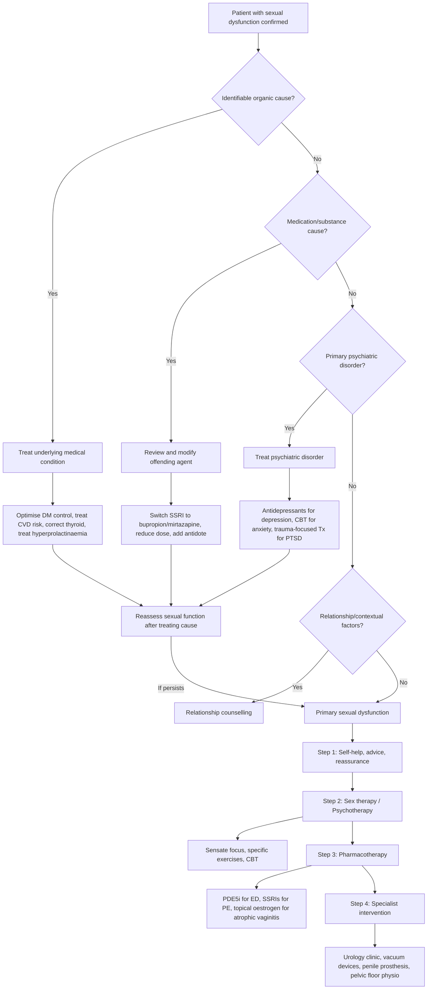
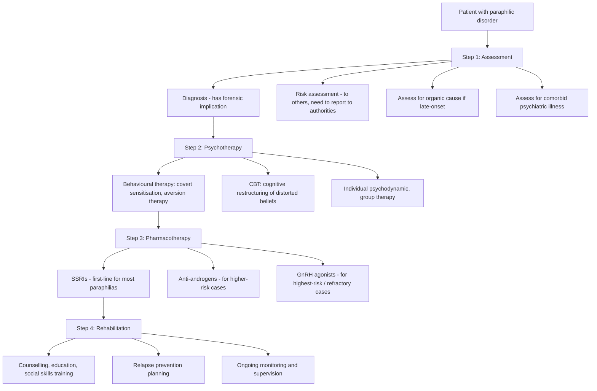
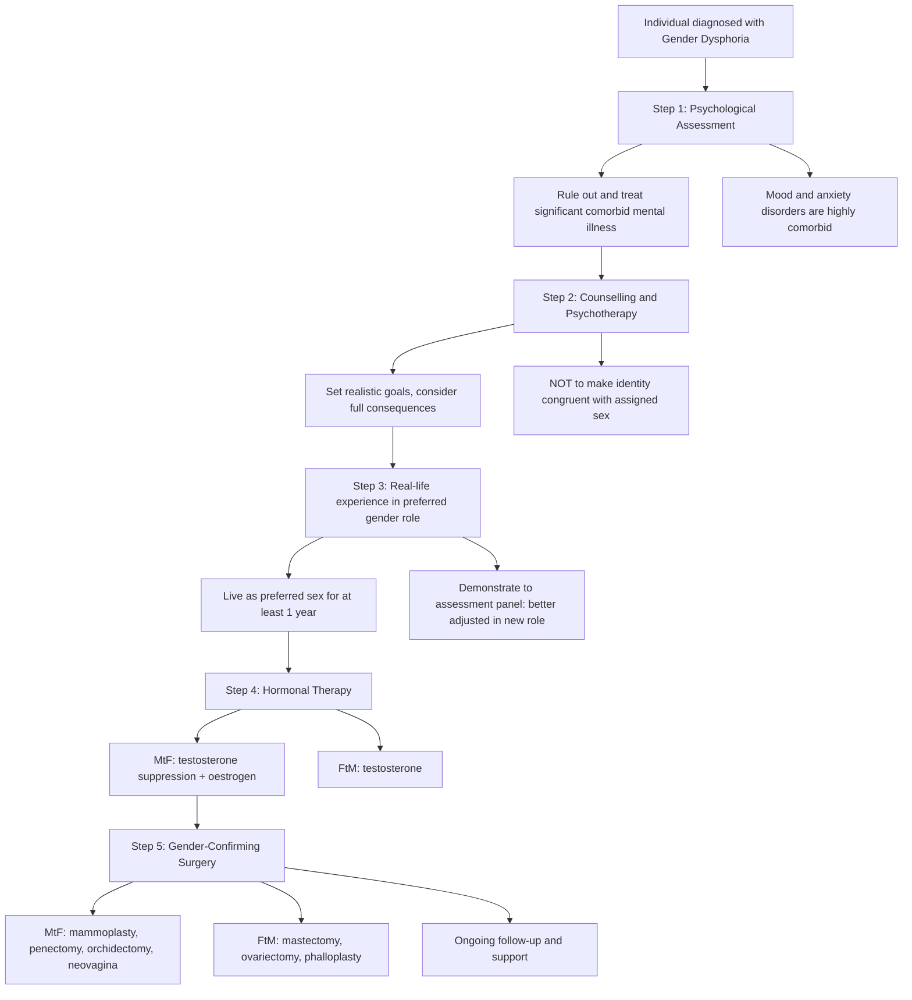

## Management of Psychosexual Disorders

Management of psychosexual disorders follows a core principle: **treat the cause, not just the symptom**. A man with ED from uncontrolled diabetes needs glycaemic optimisation, not just sildenafil. A woman with ↓desire from SSRI-induced dysfunction needs a medication review, not sex therapy alone. The biopsychosocial aetiology demands a biopsychosocial management approach — and in practice, most patients need a combination of strategies.

Let me walk through this systematically for each major category.

---

### 1. Master Management Algorithm — Sexual Dysfunctions

The key message: **address reversible causes first** (organic, medication, psychiatric, relational) before diagnosing and treating a "primary" sexual dysfunction. Many sexual dysfunctions resolve when the underlying cause is treated [2].

---

### 2. Management of Sexual Dysfunctions — Detailed

#### 2.1 General Principles [2]

> ***Sexual dysfunction clinic to offer multidisciplinary support*** [2] — this is the ideal model: psychiatrist, urologist/gynaecologist, psychologist/sex therapist, and counsellor working together.

**Step 1: Self-help, advice, and reassurance** — for the ***majority of cases*** [2]
- Education about normal sexual anatomy and physiology (many patients have misconceptions)
- Normalisation ("you are not alone — this is extremely common")
- Lifestyle modification: exercise, weight loss, smoking cessation, ↓alcohol (all improve endothelial function → improve erections; reduce anxiety → improve all phases)
- Address modifiable risk factors

**Step 2: Referral pathways** [2]:
- ***Urology clinic for physiological causes*** [2]
- ***Relationship counselling for relationship difficulties*** [2]

**Step 3: Sex therapy** — formal behavioural therapy [2]

#### 2.2 Sex Therapy — The Core Psychosexual Intervention

Sex therapy is a structured behavioural intervention based on the principle that sexual dysfunction is often maintained by anxiety, avoidance, and communication failure [2].

**Core principles** [2]:
- ***Partners treated together*** — sex is a dyadic (couple) activity; treating one partner alone misses half the problem
- ***Helped to communicate better about sexual relationship*** — many couples have never openly discussed what they want/enjoy
- ***Education on anatomy and physiology of sexual intercourse*** — surprisingly effective; many people have poor understanding of normal sexual response

##### 2.2.1 Sensate Focus [2]

> ***Sensate focus: a series of graded tasks → hierarchical series of structured touching opportunities with a focus on what must NOT yet be done and what is to be done → significantly reduces performance anxiety*** [2]

This is the cornerstone sex therapy technique, developed by Masters & Johnson. Here's why it works from first principles:

- **The problem**: Performance anxiety creates a vicious cycle — fear of failure → sympathetic activation → vasoconstriction/↓arousal → failure → more fear
- **The solution**: Remove the pressure to perform by explicitly **banning** intercourse in early stages. Paradoxically, when there is nothing to "fail" at, anxiety drops and natural arousal can return

| Stage | What To Do | What Is Banned | Purpose |
|---|---|---|---|
| Stage 1: Non-genital sensate focus | Take turns touching partner's body, focusing on sensation and pleasure | Genital touching, intercourse | Rediscover physical intimacy without pressure; learn what feels good |
| Stage 2: Genital sensate focus | Include genital touching, but with focus on exploration not orgasm | Intercourse, orgasm as a goal | Build comfort with genital contact; ↓performance anxiety around genital arousal |
| Stage 3: Containment | Brief vaginal containment of penis without movement | Thrusting, orgasm | Desensitise to penetration (especially useful for vaginismus and PE) |
| Stage 4: Gradual intercourse | Slow progression to movement and intercourse | No restrictions, but maintain focus on pleasure not performance | Reintroduce full sexual activity with new non-anxious associations |

##### 2.2.2 Specific Exercises for Specific Dysfunctions [2]

| Sexual Dysfunction | Specific Exercise | Mechanism |
|---|---|---|
| ***Female orgasmic disorder*** | ***Exercises in sexual fantasy and masturbation, sometimes with a vibrator or dildo*** [2] | Teaches the woman to identify what stimulation leads to orgasm in a low-pressure setting; she can then communicate this to her partner. Masturbation removes performance anxiety and interpersonal variables. |
| ***Premature ejaculation*** | ***Squeeze technique***: woman squeezes the glans of her partner's penis for a few seconds when he feels ejaculation is imminent. ***Start-stop method***: stimulation is halted and arousal allowed to subside when the man feels ejaculation is imminent; the process is then repeated. ***Quiet vagina***: man keeps penis motionless in vagina for increasing periods before ejaculating [2] | All three techniques work by training the man to recognise the point of "ejaculatory inevitability" and learn to control arousal at that threshold. Repeated practice raises the ejaculatory threshold over time. |
| ***Vaginismus*** | ***Desensitisation, first by finger insertion followed by dilators of increasing size*** [2] | Systematic desensitisation — the same principle used in treating phobias. Graded exposure to the feared stimulus (vaginal penetration) in a controlled, relaxed setting extinguishes the conditioned fear–spasm response. Patient starts with own finger → small dilator → progressively larger → eventually partner involvement. |

<Callout title="Sensate Focus — The Most Important Concept in Sex Therapy">
Sensate focus works because it attacks the root cause of most psychogenic sexual dysfunction: **performance anxiety**. By banning the "goal" (intercourse/orgasm), you remove the possibility of "failure," which breaks the anxiety–failure cycle. The focus shifts from "performing" to "experiencing." This is elegant behavioural therapy — simple in concept but transformative in practice [2].
</Callout>

#### 2.3 Pharmacotherapy for Specific Sexual Dysfunctions

##### 2.3.1 Erectile Disorder

| Treatment | Mechanism | Indication | Contraindications / Cautions | Key Points |
|---|---|---|---|---|
| **PDE5 inhibitors** (sildenafil, tadalafil, vardenafil, avanafil) | Inhibit phosphodiesterase type 5 → ↓breakdown of cGMP → sustained smooth muscle relaxation in corpora cavernosa → ↑blood flow → erection. Note: requires sexual stimulation to initiate NO release — they enhance, not create, erections | First-line pharmacotherapy for ED of any cause (organic, psychogenic, mixed) | **Absolute**: concurrent nitrate therapy (glyceryl trinitrate, isosorbide mononitrate) → profound hypotension → death. **Caution**: recent MI/stroke ( < 6 months), unstable angina, severe hepatic impairment, retinitis pigmentosa, anatomical penile deformity | Sildenafil: take 1hr before, lasts 4–6hrs. Tadalafil: longer-acting (36hrs), can be taken daily (2.5–5mg) — "the weekend pill." Side effects: headache, flushing, dyspepsia, visual disturbance (blue tinge — PDE6 cross-reactivity in retina), nasal congestion |
| **Intracavernosal injection** (alprostadil / PGE1) | Direct injection of prostaglandin E1 into corpus cavernosum → ↑cAMP → smooth muscle relaxation → erection independent of nerve input | Second-line: when PDE5i fails or is contraindicated; neurogenic ED (spinal cord injury) | Sickle cell disease (risk of priapism), penile fibrosis, concurrent anticoagulation (relative) | Patient self-injects. Risk of priapism (erection > 4 hours — medical emergency requiring aspiration), penile fibrosis with repeated use, pain at injection site |
| **Intraurethral alprostadil** (MUSE) | PGE1 pellet inserted into urethra → absorbed → local vasodilation | Alternative to injection for patients who refuse needles | As above | Less effective than injection; can cause urethral pain/bleeding |
| **Vacuum erection device (VED)** | Negative pressure draws blood into penis → constriction ring at base traps blood → maintains erection | Non-pharmacological option; useful when drugs contraindicated (e.g., on nitrates) | Manual dexterity issues, severe Peyronie's disease | Can feel "mechanical"; erection is cooler than natural (blood is venous, not arterial). Ring must be removed within 30 mins to prevent ischaemia |
| **Penile prosthesis** | Surgically implanted device — inflatable (hydraulic pump) or malleable (semi-rigid rods) | Last resort: when all other treatments have failed | Active infection, unrealistic expectations | High satisfaction rates (> 80%) when selected appropriately. Irreversible — destroys natural erectile tissue. Infection risk ~2–3% |
| **Testosterone replacement** | Restores testosterone in hypogonadal men → ↑libido, may improve erections | Only if documented hypogonadism (low testosterone) | Prostate cancer (testosterone fuels growth), severe sleep apnoea, polycythaemia (Hct > 54%), breast cancer | Available as: gel (daily), injection (2–4 weekly), patch. Monitor PSA, haematocrit, LFT, lipids |

<Callout title="PDE5i + Nitrates = Death" type="error">
**NEVER prescribe PDE5 inhibitors with nitrates.** Both cause vasodilation via the NO-cGMP pathway — combined effect → catastrophic systemic vasodilation → profound refractory hypotension → cardiovascular collapse → death. This includes ALL forms of nitrates: GTN spray, isosorbide mononitrate, isosorbide dinitrate. Also be cautious with alpha-blockers (additive hypotension). Always ask about cardiac medications before prescribing.
</Callout>

##### 2.3.2 Premature Ejaculation

| Treatment | Mechanism | Indication | Key Points |
|---|---|---|---|
| **SSRIs** (paroxetine, sertraline, fluoxetine, citalopram) — daily or on-demand | ↑Serotonin at ejaculatory centre in lumbosacral cord → ↑ejaculatory threshold → delay ejaculation. The same mechanism that causes "sexual dysfunction" as a side effect of SSRIs is harnessed therapeutically here | First-line pharmacotherapy for PE | Paroxetine has strongest effect (↑IELT by ~8x). Daily dosing more effective than on-demand. Takes 1–2 weeks for full effect. Side effects: nausea, drowsiness, ↓libido (paradoxically) |
| **Dapoxetine** (short-acting SSRI) | Same as above but designed for on-demand use (rapid onset, short half-life ~1.5 hours) | On-demand treatment of PE | Take 1–3 hours before intercourse. Specifically licensed for PE (unlike other SSRIs which are off-label). Side effects: nausea, dizziness, headache. Contraindicated with MAOIs, potent CYP3A4 inhibitors |
| **Topical anaesthetics** (lidocaine/prilocaine cream — EMLA) | Local anaesthetic effect on penile glans → ↓sensory input → ↓ejaculatory reflex | Adjunct or alternative when SSRIs not tolerated | Apply 20–30 min before intercourse, wash off before penetration (otherwise numbs partner). Must use condom if not washed off |
| **Clomipramine** (TCA) | Serotonergic + noradrenergic effects → ↑ejaculatory threshold | Second-line (more side effects than SSRIs) | More anticholinergic side effects. Can be used on-demand (25mg 4–6hrs before) |
| **Behavioural techniques** (squeeze, start-stop, quiet vagina) | As described above [2] | First-line non-pharmacological | Often combined with pharmacotherapy for best results |

##### 2.3.3 Female Sexual Dysfunction

| Treatment | Mechanism | Indication | Key Points |
|---|---|---|---|
| **Topical oestrogen** (vaginal cream/pessary/ring) | Restores vaginal epithelial thickness, ↑blood flow, ↑lubrication, normalises pH | Dyspareunia/arousal difficulty due to vulvovaginal atrophy (post-menopausal) | Minimal systemic absorption → safe even when systemic HRT is contraindicated. First-line for genitourinary syndrome of menopause |
| **Systemic HRT** (oestrogen ± progesterone) | Replaces declining oestrogens → improves desire, arousal, lubrication, reduces hot flushes (which disrupt sleep/mood → affect desire) | Peri/postmenopausal women with multiple menopausal symptoms including sexual dysfunction | Risks: ↑breast cancer, VTE, stroke (with prolonged use). Use lowest effective dose for shortest duration. Contraindicated: history of breast cancer, active VTE, liver disease |
| **Testosterone** (off-label in females) | ↑Libido — testosterone is the primary driver of sexual desire in both sexes | Hypoactive sexual desire disorder in postmenopausal women not responding to HRT alone | Evidence growing but still off-label in most jurisdictions. Transdermal patch/gel preferred. Monitor for virilising effects (acne, hirsutism, voice deepening) |
| **Flibanserin** | 5-HT1A agonist + 5-HT2A antagonist → ↑dopamine and norepinephrine, ↓serotonin in prefrontal cortex → ↑desire | HSDD in premenopausal women | Daily dosing (not on-demand). Modest efficacy (~0.5 additional satisfying sexual events/month). Contraindicated with alcohol (severe hypotension/syncope), hepatic impairment, CYP3A4 inhibitors |
| **Lubricants and moisturisers** | Reduce friction → ↓pain during intercourse | Dyspareunia from any cause of inadequate lubrication | Simple, safe, first-line adjunct. Water-based or silicone-based |
| **Pelvic floor physiotherapy** | Teaches awareness and voluntary relaxation of pelvic floor muscles; manual techniques to release myofascial trigger points | Genitopelvic pain/penetration disorder, vaginismus | First-line physical intervention. Often combined with graded dilator therapy [2] |

##### 2.3.4 Medication-Induced Sexual Dysfunction — Management Strategies

| Strategy | Detail | When To Use |
|---|---|---|
| **Wait and observe** | Some tolerance develops to sexual side effects over weeks–months | Mild dysfunction, patient willing to wait, medication otherwise effective |
| **Dose reduction** | Lower dose may reduce side effects while maintaining efficacy | When on higher-than-minimum effective dose |
| **Drug holiday** | Skip medication on weekends (only for shorter half-life drugs like sertraline) | Stable patients, NOT with paroxetine (withdrawal) or fluoxetine (too long half-life anyway) |
| **Switch to less sexually-impairing antidepressant** | Bupropion (dopamine/norepinephrine — minimal sexual side effects), mirtazapine (noradrenergic/specific serotonergic — less sexual dysfunction), agomelatine (melatonergic — no sexual side effects), vortioxetine | When sexual side effects are intolerable and affecting compliance |
| **Add antidote** | Add bupropion to SSRI (↑dopamine counteracts serotonergic inhibition); or add PDE5i for ED specifically | When switching is not possible (e.g., the current antidepressant is the only one that works for their depression) |

<Callout title="Bupropion — The Antidepressant That Helps, Not Hinders, Sex" type="idea">
Bupropion works via norepinephrine–dopamine reuptake inhibition (NDRI). Because it does NOT increase serotonin, it has minimal sexual side effects — and may even improve sexual function by ↑dopamine in the mesolimbic pathway. It is the go-to switch when SSRI-induced sexual dysfunction is the primary concern. Contraindications: seizure history, eating disorders (↓seizure threshold).
</Callout>

---

### 3. Management of Paraphilias [2]

> ***Management: majority has limited evidence*** [2]

The approach to paraphilia management has three pillars: **assessment, psychotherapy, and pharmacotherapy** — with **rehabilitation** as an overarching goal.

#### 3.1 Management Algorithm — Paraphilias

#### 3.2 Assessment [2]

Two priorities:
1. ***Diagnosis*** — which ***has forensic implications*** [2]. A diagnosis of paedophilia, for instance, has legal ramifications. Documentation must be meticulous.
2. ***Risk assessment*** — ***to others, need to report to authorities*** [2]. In Hong Kong, if there is a credible risk of harm (especially to children), clinicians have a duty to report under child protection protocols.

Additionally:
- **Assess for organic cause** if late-onset (neuroimaging, cognitive screening)
- **Assess for comorbid psychiatric illness** (depression, anxiety, substance use — which may lower inhibition)

#### 3.3 Psychotherapy [2]

| Therapy | Mechanism | Detail |
|---|---|---|
| ***Behavioural therapy: covert sensitisation*** | Classical conditioning — pair paraphilic fantasy with ***humiliating consequences*** (imagined) [2] | Patient imagines paraphilic scenario → then imagines a highly aversive outcome (e.g., being arrested, family finding out, public humiliation). Repeated pairing ↓arousal to paraphilic stimulus |
| ***Aversion therapy*** | Classical conditioning — pair paraphilic fantasy with ***noxious stimulus*** [2] | e.g., ***unpleasant odour or taste*** presented when patient is exposed to paraphilic stimulus. Ammonia smelling salts or foul-tasting substances are used. Over time, the paraphilic stimulus becomes associated with displeasure rather than arousal |
| **CBT** | Cognitive restructuring of distorted beliefs that justify paraphilic behaviour | e.g., in paedophilia: "children enjoy sexual contact with adults" → challenged and restructured. Also addresses offence cycle, victim empathy, relapse prevention |
| ***Individual psychodynamic therapy*** [2] | Explores unconscious conflicts underlying paraphilic behaviour | Longer-term, less evidence-based, but may be useful for motivated individuals |
| ***Group therapy*** [2] | Peer accountability, confrontation of denial and minimisation | Particularly useful in sex offender treatment programmes |

#### 3.4 Pharmacotherapy [2]

| Drug | Mechanism | Indication | Key Considerations |
|---|---|---|---|
| ***SSRIs*** (e.g., fluoxetine, sertraline, paroxetine) | ↑Serotonin → ↓sexual drive, ↓impulsivity, ↓obsessive-compulsive features of paraphilia; also treats comorbid depression/anxiety | ***First-line pharmacotherapy*** for most paraphilias — particularly exhibitionism, voyeurism, frotteurism [2] | Lower side effect profile than anti-androgens; mechanism here is dual — both ↓sexual arousal (serotonin inhibits sexual function) AND ↓compulsive element |
| ***Anti-androgens*** (cyproterone acetate, medroxyprogesterone acetate) | Competitive androgen receptor blockade (cyproterone) or ↓testosterone production (medroxyprogesterone) → ↓libido, ↓sexual arousal, ↓frequency of paraphilic fantasies | ***Higher-risk cases***: particularly ***paedophilia and exhibitionism*** [2]; repeated sexual offending despite psychotherapy/SSRIs | Cyproterone: hepatotoxic (monitor LFT), depression, fatigue, gynaecomastia, ↓bone density, weight gain. Medroxyprogesterone: weight gain, depression, DVT risk. Both: reversible on cessation. **Informed consent essential** — "chemical castration" is ethically complex |
| ***GnRH agonists*** (leuprolide, triptorelin) | Initially stimulate then downregulate GnRH receptors → ↓↓LH/FSH → ↓↓testosterone to castrate levels. "Chemical castration" in its most potent form | ***Highest-risk / refractory cases*** — severe paedophilia, sexual sadism with violent offending, failure of other treatments [2] | Most potent suppression of testosterone. Side effects: hot flushes, ↓bone density (need DEXA monitoring), depression, cardiovascular risk. Very significant ethical/legal considerations. Often court-mandated in some jurisdictions |

<Callout title="Pharmacotherapy for Paraphilias — Escalating Ladder">
Think of it as an escalating ladder of potency and invasiveness:
1. **SSRIs** → mild ↓sexual drive, treats comorbidity, well-tolerated (first-line)
2. **Anti-androgens** → moderate ↓testosterone, significant side effects (second-line, higher risk)
3. **GnRH agonists** → maximal testosterone suppression, castrate levels (last resort, highest risk)

The choice depends on the **severity of risk to others**, not just the patient's distress.
</Callout>

#### 3.5 Rehabilitation [2]

- ***Counselling, education, social skills training*** [2]
- Relapse prevention planning (identify triggers, high-risk situations, coping strategies)
- Ongoing monitoring and supervision (often within forensic/probation frameworks)
- Community reintegration support

---

### 4. Management of Gender Dysphoria [2]

> ***Management: based on SOC-7 guideline (most influential)*** [2]

Note: The WPATH Standards of Care have been updated to SOC-8 (2022), but the senior notes reference SOC-7. The principles remain similar, with SOC-8 providing more flexibility and less rigid sequencing. The core pathway is:

#### 4.1 Management Algorithm — Gender Dysphoria

#### 4.2 Step-by-Step Detail

##### Step 1: Psychological Assessment [2]

- ***Detailed psychological assessment to rule out and treat any significant comorbid mental illness*** [2]
- This is NOT gatekeeping — it is good clinical practice. Gender dysphoria has ***increased comorbid Axis I disorders, especially mood and anxiety disorders*** [2]
- Assessment by **any appropriately trained health professional** [2]
- Assess: identity history, social functioning, mental health, support systems, understanding of treatment options

##### Step 2: Counselling and Psychotherapy [2]

- ***Emphasises the need to set realistic goals and consider full consequences*** [2] — hormonal and surgical treatments are partially or wholly irreversible. The patient must understand what to expect and what limitations exist (e.g., phalloplasty has high complication rates, neovagina requires lifelong dilation)
- ***NOT to focus on making a person's gender identity to be more congruent with assigned sex*** [2] — "conversion therapy" (attempting to change gender identity) is ineffective and harmful. It is banned or discouraged in most professional guidelines
- Explore gender identity, address minority stress, support social transition

##### Step 3: Real-Life Experience [2]

- ***Should live as preferred sex for ≥ 1 year*** to demonstrate to an assessment panel that they are ***better adjusted in new gender role before surgery*** [2]
- This involves: adopting the name, pronouns, clothing, and social role of the affirmed gender in all aspects of daily life (work, social, family)
- Purpose: confirms that the individual can function successfully and happily in the affirmed gender before irreversible surgical intervention
- SOC-8 is more flexible about the exact duration and does not require a rigid 12-month minimum in all cases, but this remains the standard in Hong Kong public hospital protocols

##### Step 4: Hormonal Therapy [2]

| Direction | Agents | Effects | Monitoring |
|---|---|---|---|
| ***MtF (feminising)*** | ***Testosterone suppression: spironolactone, cyproterone acetate, GnRH agonist*** + Oestrogen (estradiol — oral, transdermal, or injectable) [2] | Breast development, fat redistribution to hips/thighs, ↓body hair, softer skin, ↓muscle mass, ↓libido, testicular atrophy, ↓spontaneous erections. Voice does NOT change (vocal cord changes from testosterone are irreversible) | Oestradiol, testosterone, prolactin (oestrogen ↑prolactin risk), LFT, lipids, coagulation (↑VTE risk), BMD. Monitor every 3–6 months initially |
| ***FtM (masculinising)*** | ***Androgens (testosterone — IM injection, transdermal gel/patch)*** [2] | ***Will develop secondary sexual characteristics***: ***↑clitoris size, ↑hair (facial and body), deep voice*** [2], ↑muscle mass, fat redistribution, acne, male-pattern baldness, cessation of menses, ↑libido | FBC (polycythaemia risk — testosterone ↑erythropoiesis), lipids (↑LDL, ↓HDL), LFT, testosterone levels. Haematocrit > 54% → dose reduction |

| Hormone | Contraindications |
|---|---|
| Oestrogen (MtF) | History of VTE or thrombophilia, active liver disease, oestrogen-sensitive malignancy (breast cancer), uncontrolled hypertension, migraine with aura (↑stroke risk) |
| Cyproterone acetate (MtF) | Hepatic impairment (hepatotoxic), meningioma (cyproterone associated with ↑risk), depression (can worsen) |
| Testosterone (FtM) | Polycythaemia (Hct > 54%), severe sleep apnoea, active liver disease, pregnancy (teratogenic — virilisation of female foetus) |

<Callout title="Voice Changes Are Asymmetric">
**Testosterone deepens the voice irreversibly** (thickens vocal cords) — so FtM individuals on testosterone will develop a deeper voice. However, **oestrogen does NOT raise the voice** — vocal cord thickening from puberty is irreversible. MtF individuals often need **voice therapy** (speech pathology) or, rarely, surgical vocal cord thinning (glottoplasty) to feminise their voice. This is a common source of distress for MtF individuals.
</Callout>

##### Step 5: Gender-Confirming (Sex Reassignment) Surgery [2]

| Direction | Procedures | Notes |
|---|---|---|
| ***MtF*** | ***Mammoplasty*** (if hormonal breast development insufficient), ***penectomy, orchidectomy, creation of vagina-like structure*** (vaginoplasty — typically penile inversion technique) [2] | Requires lifelong vaginal dilation to prevent stenosis. Facial feminisation surgery and tracheal shave (thyroid cartilage reduction) may also be desired but are usually not publicly funded |
| ***FtM*** | ***Mastectomy*** (chest masculinisation), ***ovariectomy*** (often with hysterectomy), ***phalloplasty*** (construction of a penis — complex, multi-stage, high complication rate) [2] | Alternatively: metoidioplasty (using hormonally-enlarged clitoris as a micropenis — simpler, fewer complications but smaller result). Scrotoplasty with testicular prostheses may also be performed |

**Indications for surgery**:
- Persistent, well-documented gender dysphoria
- Capacity to make a fully informed decision and consent
- Age of majority (18 in Hong Kong)
- Completed ≥ 12 months of hormone therapy (if desired and medically appropriate)
- Completed ≥ 12 months of living in the affirmed gender role
- Well-controlled comorbid mental/medical conditions

**Contraindications for surgery**:
- Unstable, uncontrolled psychiatric illness (active psychosis, severe untreated depression)
- Inability to give informed consent
- Unrealistic expectations
- Medical conditions making surgery unacceptably high-risk

##### Prognosis [2]

> ***86% FtM and 71% MtF reported improvement in quality of life*** [2]

- Regret rates are low (1–2% in modern cohorts with proper assessment)
- Better outcomes associated with: younger age at transition, good social support, absence of comorbid psychiatric illness, thorough pre-surgical assessment
- Poorer outcomes associated with: late transition, social isolation, comorbid mental illness, unrealistic expectations

---

### 5. Special Situations

#### 5.1 Management of Gender Dysphoria in Children and Adolescents

This is an area of active debate worldwide. The current approach in most guidelines:

| Stage | Intervention | Indication | Reversibility |
|---|---|---|---|
| **Prepubertal** | Social transition (name, pronouns, clothing) + psychological support. NO medical intervention | Children with persistent gender dysphoria | Fully reversible |
| **Early puberty (Tanner stage 2+)** | **GnRH agonists** ("puberty blockers") — suppress puberty | Adolescents with persistent GD, onset of puberty causing distress | Fully reversible on cessation — puberty resumes. Purpose: buy time for the adolescent to mature and explore identity without the irreversible changes of endogenous puberty |
| **Age ~16+** | Gender-affirming hormones (oestrogen or testosterone) | After thorough assessment, if GD persists | Partially irreversible (e.g., voice deepening, breast development) |
| **Age 18+** | Surgical options | As above | Irreversible |

<Callout title="Puberty Blockers — Buying Time, Not Making Decisions" type="idea">
GnRH agonists in early puberty work by downregulating the HPG axis → suppressing LH/FSH → halting pubertal development. They do NOT cause cross-sex changes — they simply press "pause." If stopped, endogenous puberty resumes. The rationale: prevent the distress and irreversible physical changes of the "wrong" puberty while the adolescent has more time for assessment and decision-making. Concerns: long-term bone density effects, potential impact on brain development (ongoing research).
</Callout>

---

### 6. Summary Management Table — All Three Categories

| Category | First-Line | Second-Line | Specialist/Last Resort |
|---|---|---|---|
| **Sexual Dysfunctions** | Treat underlying cause (organic, medication, psychiatric, relational); self-help; sensate focus; specific behavioural exercises [2] | Pharmacotherapy: PDE5i for ED, SSRIs for PE, topical oestrogen for atrophic vaginitis | Intracavernosal injection, vacuum devices, penile prosthesis, pelvic floor physio, surgery for pelvic pathology |
| **Paraphilias** | Assessment (diagnosis + risk); psychotherapy (behavioural therapy, CBT) [2] | SSRIs; anti-androgens for higher-risk cases [2] | GnRH agonists for highest-risk/refractory cases; forensic/legal involvement [2] |
| **Gender Dysphoria** | Psychological assessment + treat comorbidities; counselling and psychotherapy [2] | Real-life experience ≥ 1 year; hormonal therapy [2] | Gender-confirming surgery [2] |

---

<Callout title="High Yield Summary — Management of Psychosexual Disorders">

1. **Sexual dysfunctions**: Treat underlying cause FIRST (organic, medication, psychiatric, relational). **For the majority: self-help, advice, reassurance** [2]. Sex therapy = partners together, communication, education, **sensate focus** (graded touching tasks, ban intercourse initially → ↓performance anxiety).

2. **Specific exercises** [2]: Female orgasmic disorder → fantasy/masturbation/vibrator. PE → squeeze technique, start-stop, quiet vagina. Vaginismus → graded dilator desensitisation.

3. **ED pharmacotherapy ladder**: PDE5i (first-line) → intracavernosal injection → vacuum device → penile prosthesis. **PDE5i + nitrates = ABSOLUTE contraindication** (fatal hypotension).

4. **PE pharmacotherapy**: SSRIs first-line (paroxetine most potent); dapoxetine (on-demand short-acting SSRI); topical anaesthetics adjunct.

5. **SSRI-induced sexual dysfunction**: Switch to bupropion/mirtazapine, ↓dose, drug holiday, add PDE5i for ED.

6. **Paraphilias**: Evidence is limited. Assessment (diagnosis with forensic implication + risk). Psychotherapy (covert sensitisation, aversion therapy, CBT). Pharmacotherapy escalating ladder: SSRIs → anti-androgens → GnRH agonists. Rehabilitation.

7. **Gender dysphoria** (SOC guidelines): Psychological assessment (rule out comorbidities) → counselling (NOT conversion therapy) → real-life experience ≥ 1 year → hormonal therapy (MtF: oestrogen + anti-androgen; FtM: testosterone) → gender-confirming surgery. **86% FtM and 71% MtF report improved QoL** [2].

8. **FtM testosterone effects**: ↑clitoris size, ↑hair, deep voice, ↑muscle, cessation of menses. **MtF oestrogen does NOT change voice** — voice therapy needed separately.

</Callout>

---

<ActiveRecallQuiz
  title="Active Recall - Management of Psychosexual Disorders"
  items={[
    {
      question: "Explain the principle of sensate focus therapy and why banning intercourse in the early stages paradoxically improves sexual function.",
      markscheme: "Sensate focus is a series of graded touching tasks progressing from non-genital to genital to containment to intercourse. Intercourse is explicitly banned in early stages. This works because most psychogenic sexual dysfunction is maintained by performance anxiety: fear of failure leads to sympathetic overdrive which leads to failure which reinforces fear. By banning the goal (intercourse/orgasm), the possibility of failure is removed, anxiety drops, and natural arousal can return. Partners focus on sensation and pleasure rather than performance."
    },
    {
      question: "A 58-year-old man with stable angina on isosorbide mononitrate presents with erectile dysfunction. He asks for sildenafil. What do you tell him and what alternative treatments can you offer?",
      markscheme: "Sildenafil is ABSOLUTELY CONTRAINDICATED with nitrates. Both act via NO-cGMP pathway causing vasodilation. Combined use causes catastrophic hypotension, cardiovascular collapse and death. Alternatives: (1) discuss with cardiologist about switching away from nitrates if possible, then PDE5i may become safe; (2) vacuum erection device (non-pharmacological, no drug interaction); (3) intracavernosal alprostadil injection (works via cAMP not cGMP, no interaction with nitrates); (4) intraurethral alprostadil; (5) psychosexual counselling if psychogenic component."
    },
    {
      question: "Describe the pharmacotherapy escalation ladder for paraphilic disorders and explain the mechanism of each step.",
      markscheme: "Step 1 - SSRIs (first-line): increase serotonin which inhibits sexual drive and reduces impulsive/obsessive-compulsive features of paraphilia. Step 2 - Anti-androgens (cyproterone acetate, medroxyprogesterone): block androgen receptors or suppress testosterone production, reducing libido and paraphilic fantasy frequency. For higher-risk cases especially paedophilia/exhibitionism. Step 3 - GnRH agonists (leuprolide): initially stimulate then downregulate GnRH receptors causing suppression of LH/FSH and reduction of testosterone to castrate levels. Maximal potency for highest-risk refractory cases. Choice depends on severity of risk to others."
    },
    {
      question: "Outline the stepwise management pathway for gender dysphoria according to SOC guidelines. What is the purpose of the real-life experience requirement?",
      markscheme: "Steps: (1) Psychological assessment to rule out and treat comorbid mental illness. (2) Counselling and psychotherapy to set realistic goals, consider full consequences. NOT to convert identity to match assigned sex. (3) Real-life experience in preferred gender role for at least 1 year. (4) Hormonal therapy: MtF (oestrogen plus anti-androgen: spironolactone, cyproterone, or GnRH agonist); FtM (testosterone). (5) Gender-confirming surgery. Purpose of real-life experience: demonstrates to assessment panel that the individual is better adjusted in the new gender role before irreversible surgery. Confirms the decision is sustained and functional."
    },
    {
      question: "Name 3 specific behavioural exercises used in sex therapy and match each to its target sexual dysfunction. Explain how each works.",
      markscheme: "(1) Squeeze technique for premature ejaculation: partner squeezes glans when man feels ejaculation is imminent, halting the reflex. Trains awareness of the point of ejaculatory inevitability and raises the threshold over time. (2) Graded dilator desensitisation for vaginismus: finger insertion then dilators of increasing size. Systematic desensitisation principle: graded exposure to feared stimulus extinguishes conditioned fear-spasm response. (3) Masturbation exercises with fantasy/vibrator for female orgasmic disorder: teaches identification of effective stimulation in a low-pressure setting, which can then be communicated to partner."
    },
    {
      question: "Why does testosterone deepen the voice irreversibly in FtM individuals, but oestrogen does NOT raise the voice in MtF individuals? What is the clinical implication?",
      markscheme: "Testosterone causes vocal cord thickening and lengthening (increased mass leads to lower fundamental frequency). This is a structural change that is irreversible. Oestrogen cannot reverse vocal cord thickening once it has occurred during male puberty. Clinical implication: FtM individuals on testosterone will develop a deeper voice, but MtF individuals need voice therapy (speech pathology) or rarely surgical vocal cord thinning (glottoplasty) to feminise their voice. This is a common source of distress for MtF individuals."
    }
  ]}
/>

## References

[2] Senior notes: ryanho-psych.md (Sections 9.3, 9.3.2, 9.3.3)
