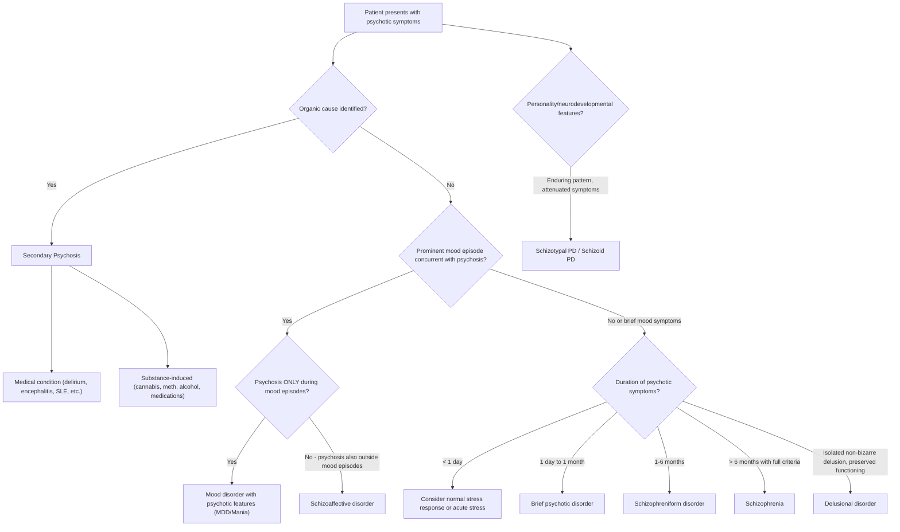
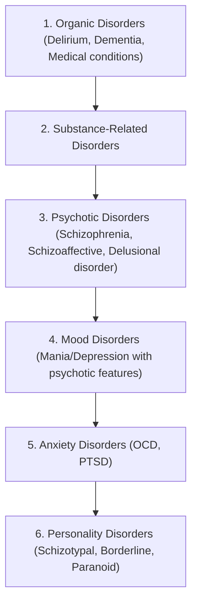

## Differential Diagnosis of Schizophrenia and Related Psychotic Disorders

When a patient presents with **psychotic symptoms** (delusions, hallucinations, disorganised thinking/behaviour), the critical task is NOT to immediately label it "schizophrenia." Psychosis is a **syndrome** — a final common pathway — and the differential is broad. The hierarchy of psychiatric diagnosis dictates that you must rule out causes from the **top of the pyramid** (organic → substance → psychotic → mood → anxiety → personality) before settling on a diagnosis lower down [2].

> **Why does the hierarchy matter?** Because treating the higher-order disorder (e.g., delirium from a UTI, or substance-induced psychosis from methamphetamine) often resolves the psychosis entirely. Missing an organic cause and treating with antipsychotics alone is a serious — and potentially lethal — error.

<Callout title="First Principle: Psychosis ≠ Schizophrenia" type="error">
Psychosis is a syndrome (loss of contact with reality) that can be caused by many disorders. Schizophrenia is just ONE cause. Always exclude organic, substance-related, and mood-related causes first. The hierarchy is: Organic > Substance > Psychotic disorders > Mood disorders > Anxiety > Personality [2].
</Callout>

---

### Overall Approach: Primary (Psychiatric) vs Secondary (Medical) Psychosis

Before diving into the specific differentials, you need a framework for distinguishing **primary psychiatric psychosis** from **secondary (organic) psychosis** [2]:

| Feature | Primary (Psychiatric) Psychosis | Secondary (Organic) Psychosis |
|---|---|---|
| **Age of onset** | Typically young adult (18–35) | Any age, but consider especially if onset > 40 without prior psychiatric history |
| **Consciousness** | **Clear** | Often **impaired** (fluctuating awareness, disorientation — think delirium) |
| **Orientation** | Usually preserved | Often impaired |
| **Hallucination type** | Predominantly **auditory** (especially auditory verbal hallucinations) | Predominantly **visual** (visual hallucinations should ALWAYS prompt organic work-up) |
| **Cognitive function** | Subtle deficits (working memory, executive function) but no gross impairment | May show gross cognitive deficits, delirium, confusion |
| **Physical signs** | Usually absent | May have focal neurological signs, vital sign abnormalities, pupil changes, etc. |
| **Course** | Chronic/relapsing | Fluctuating, often acute onset; may improve when underlying cause treated |
| **Response to context** | Psychotic content often stable | Worsening at night (sundowning), fluctuating |

---

### Systematic Differential Diagnosis

The differential can be organised into **four major categories**: (1) Other psychotic (non-affective) disorders, (2) Mood disorders with psychotic features, (3) Other psychiatric disorders, and (4) Secondary (organic/substance-related) causes.

---

### Category 1: Other Non-Affective Psychotic Disorders (Schizophrenia-Spectrum)

***Schizophrenia-spectrum*** includes ***schizophrenia, schizoaffective disorder, schizotypal personality disorder*** [1].

#### 1A. Schizophreniform Disorder

| Feature | Detail |
|---|---|
| **Core distinction** | Same symptom criteria as schizophrenia (Criterion A of DSM-5), BUT total duration is **1–6 months** |
| **Functional decline** | NOT required (cf. schizophrenia requires functional decline) |
| **Prognosis** | Better than schizophrenia; ~1/3 recover fully, ~2/3 progress to schizophrenia or schizoaffective disorder |
| **Why it exists** | Acts as a "provisional" diagnosis — you can't diagnose schizophrenia until 6 months have elapsed |

#### 1B. Brief Psychotic Disorder / Acute and Transient Psychotic Disorders (ATPD)

***Brief psychotic disorder / acute & transient psychotic disorders (ATPD)*** [1]:
- ***Acute onset / complete remission / brief period (1–3 months, depends on criteria)*** [1]
- ***Polymorphic features (~cycloid psychosis): rapidly changing clinical pictures, prominent fluctuated mood state, perplexity*** [1]
- Duration: **1 day – 1 month** (DSM-5 brief psychotic disorder); onset ≤2 weeks for ATPD (ICD-10) [2]
- May be precipitated by **acute stress** (intense stressor or traumatic event) [2]
- Rapid recovery is typical

> **Why distinguish this from schizophrenia?** Prognosis is vastly different. Brief psychotic disorder has excellent prognosis with full return to premorbid functioning. Mislabelling it as schizophrenia carries enormous stigma and may lead to unnecessary long-term antipsychotic treatment.

#### 1C. Schizoaffective Disorder

***Schizoaffective: concurrent schizophrenic and mood symptoms are equally prominent (fulfilling a major mood episode e.g. manic or depressive episode)*** [1]

- Diagnosed when a **major mood episode** (depressive or manic) occurs **concurrently** with psychotic symptoms meeting Criterion A of schizophrenia [2]
- The critical DSM-5 requirement: **psychosis must exist for ≥2 weeks in the ABSENCE of a major mood episode** during the total illness duration [2]
  - This is what separates it from a mood disorder with psychotic features (where psychosis occurs ONLY during mood episodes)
- Prognosis is intermediate between schizophrenia (worse) and mood disorders (better)

> **Why is this distinction so important clinically?** Treatment differs. Schizoaffective disorder typically requires BOTH an antipsychotic AND a mood stabiliser (or antidepressant, depending on subtype), whereas a mood disorder with psychotic features may respond to mood treatment plus short-term antipsychotic.

#### 1D. Delusional Disorder

***Delusional disorder*** [1]:
- ***Systematized, likely single-theme delusion, non-bizarre in nature (classic definition)*** [1]
- ***No or non-prominent hallucination*** [1]
- ***Minimal negative symptoms, reported of having better functioning*** [1]
- ***Over-represented by women and adult-onset*** [1]
- ***Relatively rare*** [1]
- Lifetime risk 0.05–0.1%, median onset 46 years [2]
- Delusion themes: **persecutory** (commonest), erotomania, jealous, somatic, grandiose [2]
- Behaviour unrelated to the delusion is often **normal** (encapsulated) [2]

| Feature | Delusional Disorder | Schizophrenia |
|---|---|---|
| Delusions | Non-bizarre, systematised, single-themed | Often bizarre, fragmented, multiple themes |
| Hallucinations | Absent or minimal (related to delusion) | Prominent, especially AVH |
| Negative symptoms | Absent or minimal | Often prominent |
| Functioning | Relatively preserved | Significantly impaired |
| Onset age | Later (median 46y) | Earlier (18–35y) |

#### 1E. Schizotypal Personality Disorder

- Prevalence: 0.6–4.6%, familially aggregates with schizophrenia [2]
- A **pervasive, enduring pattern** (trait-like, > 2 years) of social/interpersonal deficits with **attenuated** psychotic-like features [2]:
  - Cognitive distortions ("attenuated delusions"): odd beliefs, ideas of reference, magical thinking, paranoid ideation [2]
  - Perceptual distortions ("attenuated hallucinations"): illusions, "sixth sense" [2]
  - Odd behaviour ("attenuated disorganisation"): vague/circumstantial speech, eccentric appearance [2]
  - Social isolation ("attenuated negative symptoms") [2]
- **Never met full criteria for schizophrenia** throughout entire life [2]
- Considered personality disorder in DSM-5 but schizophrenia-like disorder in ICD-10; part of the **schizophrenia-spectrum** [2]

> **Schizotypal vs Schizoid personality disorder:** Schizoid PD has similar social isolation and emotional detachment but **NO cognitive/perceptual distortions** (no attenuated positive symptoms). Schizotypal has the "quasi-psychotic" features; schizoid is just detached and cold [2].

---

### Category 2: Mood Disorders with Psychotic Features

This is one of the most critical differentials — and one of the most commonly missed.

#### 2A. Manic Episode with Psychotic Features (Bipolar Disorder)

***Manic episode with psychotic symptoms misdiagnosed as schizophrenia*** [3] — this is a classic pitfall.

***Misdiagnosis is especially common*** — among 600 patients with bipolar disorder, ***69% were initially misdiagnosed*** and most frequently as major depression, followed by anxiety disorders, substance/alcohol use disorder [3]. ***Correct diagnosis and treatment was delayed by 5–7 years on average*** [3].

Key distinguishing features between mania with psychosis and schizophrenia [2]:

| Feature | Mania with Psychosis | Schizophrenia |
|---|---|---|
| **Mood** | Elated, expansive, or irritable mood is **primary** and dominates the picture | Mood disturbance, if any, is secondary or not concurrent with psychosis |
| **Psychosis timing** | Psychotic symptoms occur **during** mood episodes and resolve with mood normalisation | Psychosis occurs **outside** of prominent mood disturbance |
| **Delusion content** | Usually **mood-congruent** (grandiose in mania, nihilistic in depression) | Often **mood-incongruent**, bizarre, with passivity/thought alienation [2] |
| **FTD type** | Circumstantiality, tangentiality, **flight of ideas** (with discernible links) | Loosening of associations, neologisms, **thought blocking** (links absent) [2] |
| **Speech** | **Pressured**, difficult to interrupt [2] | More hesitant/halting [2] |
| **Sleep** | Markedly **decreased need for sleep** (feels rested after minimal sleep) [2] | Less prominent sleep disturbance |
| **Energy/activity** | Markedly **increased** energy and goal-directed activity [2] | Apart from agitation, may have catatonia or negative symptoms [2] |
| **Course** | Episodic with inter-episode recovery | Chronic with residual deficits |

> **Why is this misdiagnosis so consequential?** Because treatment with antipsychotics alone (appropriate for schizophrenia) is insufficient for bipolar disorder — the patient needs a **mood stabiliser** (lithium, valproate). Conversely, treating bipolar depression with antidepressants alone (if misdiagnosed as MDD) can trigger a **manic switch** and accelerate cycling [3].

#### 2B. Major Depressive Disorder with Psychotic Features

- Mood disturbance (depression) **dominates** the clinical picture [2]
- Psychotic content is often **mood-congruent**: nihilistic delusions ("I am already dead," "my organs are rotting"), delusions of guilt/worthlessness, persecutory delusions (believe punishment is deserved), auditory hallucinations with derogatory content [2]
- Psychotic symptoms occur **only during depressive episodes** and resolve when depression remits
- Unlike schizophrenia: no prominent formal thought disorder, no bizarre delusions, no negative symptoms outside of depression

<Callout title="Mood-Congruent vs Mood-Incongruent Psychosis" type="idea">
**Mood-congruent**: Psychotic content is thematically consistent with the mood state (grandiose delusions in mania, nihilistic delusions in depression). Suggests a mood disorder with psychotic features.

**Mood-incongruent**: Psychotic content has no logical relationship to the mood (e.g., thought insertion, bizarre persecutory delusions in a depressed patient). Suggests schizophrenia or schizoaffective disorder. However, mood-incongruent psychosis CAN occur in mood disorders — it just makes the diagnosis less certain and suggests worse prognosis.
</Callout>

---

### Category 3: Other Psychiatric Disorders that May Mimic Psychosis

#### 3A. Obsessive-Compulsive Disorder (OCD)

- Some obsessions may resemble delusions due to the **oddity of beliefs** or intensity of conviction (poor-insight OCD) [2]
- Compulsive behaviours and weak resistance may look like disorganised or bizarre behaviour
- **Key distinction:** OCD symptoms are **ego-dystonic** (the patient recognises them as unwanted, intrusive, and distressing) whereas delusions in schizophrenia are **ego-syntonic** (the patient believes them to be true)
- NB: OC symptoms are also common **within** schizophrenia — always elicit other psychotic features actively [2]

#### 3B. Personality Disorders

- **Borderline personality disorder (BPD):** Can present with transient, stress-related paranoid ideation or dissociative symptoms that resemble psychosis. However, these are brief, occur in the context of interpersonal stress, and the patient has an enduring pattern of affective instability, identity disturbance, and impulsive behaviour [2]
- **Paranoid personality disorder:** Pervasive distrust and suspiciousness, but beliefs are **overvalued ideas** rather than fixed delusions. Maintains reality testing.
- ***Personality disorder with prominent irritability*** can mimic manic psychosis [3]
- Key: personality disorders are **trait-like** (enduring, pervasive, stable over years), NOT episodic [2]

#### 3C. ADHD

***Attention deficit and hyperactivity disorder*** [3]:
- Similarities with mania: decreased attention, difficulty with task completion, increased energy, disinhibited behaviour [2]
- Differences: ADHD should NOT have increased self-esteem, grandiosity, flight of ideas, decreased need for sleep [2]
- Course: ADHD is **chronic (trait-like)** rather than episodic [2]
- ADHD-like symptoms can also overlap with the cognitive and negative symptom dimensions of schizophrenia (poor concentration, reduced motivation), but ADHD lacks psychotic features

#### 3D. Post-Traumatic Stress Disorder (PTSD)

- Flashbacks can be misinterpreted as hallucinations
- Hypervigilance and paranoia may resemble persecutory delusions
- **Key distinction:** PTSD symptoms are clearly linked to a specific traumatic event, and the "hallucinations" are actually **re-experiencing phenomena** (vivid reliving of the trauma), not true perceptions without external stimuli in the schizophrenia sense

#### 3E. Autism Spectrum Disorder (ASD)

- Can present with social withdrawal, restricted interests, unusual behaviour, and communication difficulties that superficially resemble negative symptoms and disorganisation
- However: no delusions, no hallucinations; the social difficulties stem from **impaired social cognition** and restricted interests, not from paranoia or avolition
- DSM-5 allows comorbid diagnosis: if a person with ASD develops **prominent delusions or hallucinations for ≥1 month**, an additional diagnosis of schizophrenia can be made [2]

---

### Category 4: Secondary (Organic and Substance-Related) Causes

This is the category you **must not miss** — organic psychosis can be life-threatening if the underlying cause is untreated.

#### 4A. Delirium

- **The great mimicker** — delirium can present with vivid hallucinations (typically **visual**), delusions, disorganised speech, agitation or stupor [2]
- **Key distinctions from schizophrenia:**
  - **Fluctuating consciousness** and attention (cardinal feature)
  - **Disorientation** (to time first, then place, then person)
  - Rapid diurnal changes (sundowning)
  - Acute onset with identifiable precipitant
  - Usually in elderly or medically unwell patients
- Always rule out delirium before diagnosing a primary psychotic disorder, especially in **first presentations**, **older patients**, or **medically unwell patients** [2]

#### 4B. Dementia with Psychotic Features

- Especially ***Lewy body dementia*** — characterised by vivid **visual hallucinations** (often well-formed, detailed images of people or animals), fluctuating cognition, and parkinsonism [2]
- Also: Alzheimer's disease (delusions common in moderate–severe stages), frontotemporal dementia (behavioural variant can mimic negative symptoms and disorganisation)
- **Key distinction:** Progressive cognitive decline is the primary feature; psychosis is secondary

#### 4C. Neurological Conditions

- **Anti-NMDA receptor encephalitis** — especially important in young women; presents with psychiatric symptoms (psychosis, agitation, catatonia) followed by seizures, movement disorders, autonomic instability. This is treatable with immunotherapy and is a critical "don't miss" diagnosis
- **Temporal lobe epilepsy** — can cause ictal and post-ictal psychosis, déjà vu, olfactory/gustatory hallucinations
- **Autoimmune/infectious encephalitis**, **MS**, **leukodystrophies**, **cerebral lupus (SLE)**, **head trauma**, **space-occupying lesions (SOL)**, **stroke**, **neurodegenerative disorders** [2]

#### 4D. Metabolic/Endocrine Conditions

- **Thyroid** disorders (both hyper- and hypothyroidism — "myxoedema madness")
- **Parathyroid** disorders (hypercalcaemia → psychosis)
- **Adrenal** disorders (Cushing's disease — cortisol excess; Addisonian crisis)
- **Vitamin deficiency**: B12 (subacute combined degeneration → psychiatric symptoms), B1 (Wernicke's — but this more commonly causes delirium), B3 (pellagra — the classic "3 D's": dermatitis, diarrhoea, dementia/psychosis)
- **Hepatic/uraemic encephalopathy**
- **Acute intermittent porphyria** (classically presents with abdominal pain, neuropsychiatric symptoms, and autonomic dysfunction in young women)
- **Wilson's disease** (copper accumulation — psychiatric symptoms can precede neurological signs; look for Kayser-Fleischer rings) [2]
- **Infections**: HIV (direct CNS involvement), neurosyphilis (general paresis of the insane — grandiose delusions classically), Lyme disease [2]

#### 4E. Substance-Related Psychosis

| Substance | Key Features | Why it causes psychosis |
|---|---|---|
| **Cannabis (THC)** | Paranoia, perceptual disturbance, anxiety; dose-response relationship with schizophrenia risk | THC activates CB1 receptors → increases mesolimbic dopamine release |
| **Amphetamines / Methamphetamine** | Paranoid delusions, tactile hallucinations (formication), agitation; can closely mimic paranoid schizophrenia | Massive dopamine release in mesolimbic pathway |
| **Cocaine** | Similar to amphetamines; paranoia, tactile hallucinations | Blocks dopamine reuptake → excess synaptic dopamine |
| **Alcohol** | Alcoholic hallucinosis (vivid AVH in clear consciousness); delirium tremens (VH, confusion, autonomic instability, seizures) during withdrawal | Complex: GABA withdrawal, glutamate rebound, dopamine dysregulation |
| **Hallucinogens (LSD, psilocybin)** | Vivid visual hallucinations, synaesthesia, depersonalisation | 5-HT2A receptor agonism |
| **Ketamine / PCP** | Can produce a full schizophrenia-like syndrome including positive AND negative symptoms | NMDA receptor antagonism → supports glutamate hypothesis of schizophrenia |
| **Synthetic cannabinoids ("spice")** | Severe psychosis, agitation, may be prolonged | Potent CB1 agonism |

- **Key distinction:** Substance-induced psychosis should **remit** after the substance clears (typically days to weeks). If it persists beyond this, consider a primary psychotic disorder that was "unmasked" by the substance [2]
- Always perform **urine toxicology screen** in first-episode psychosis [2]

#### 4F. Medication-Induced Psychosis

- **Neurological drugs:** Barbiturates, benzodiazepines (especially during withdrawal), anticholinergics, antidepressants (serotonin syndrome), antiepileptics, antiparkinsonian agents (L-DOPA, dopamine agonists) [2]
- **Other medications:** Corticosteroids (steroid psychosis — dose-related), antimalarials (mefloquine), digoxin, dextromethorphan [2]
- **Toxins:** Carbon monoxide, organophosphates, heavy metal poisoning (arsenic, manganese, mercury, thallium) [2]

---

### The Diagnostic Hierarchy in Practice

The hierarchy of psychiatric diagnosis is fundamental [2]:

> **Why does this hierarchy exist?** Treating the higher-order disorder often resolves lower-order symptoms (e.g., treating delirium from a UTI resolves the "psychosis"), but NOT vice versa (giving antipsychotics alone won't fix the UTI). You work from the top down [2].

---

### Summary Table: Key Differentiating Features

| Diagnosis | Duration | Hallucination type | Mood | Functioning | Key distinguishing feature |
|---|---|---|---|---|---|
| **Schizophrenia** | ≥6 months (DSM-5) | Auditory predominant | Secondary, if any | Impaired | Bizarre delusions, FRS, negative symptoms, chronic course |
| **Schizophreniform** | 1–6 months | Auditory | Variable | May be preserved | Same as schizophrenia but shorter duration |
| **Brief psychotic / ATPD** | < 1 month | Any | Fluctuating, perplexity | Returns to baseline | Rapid onset, polymorphic, often stress-related, full recovery |
| **Schizoaffective** | Prolonged | Auditory | Prominent mood episode | Variable | Psychosis ≥2 weeks WITHOUT mood episode |
| **Delusional disorder** | ≥1 month | Minimal/absent | Relatively normal | Preserved | Single-themed, non-bizarre, encapsulated delusion |
| **Mania with psychosis** | Episodic | Auditory | Elated/irritable, primary | Impaired during episode | Mood-congruent psychosis, flight of ideas, pressured speech, decreased need for sleep |
| **MDD with psychosis** | Episodic | Auditory | Depressed, primary | Impaired during episode | Mood-congruent (nihilistic, guilt), psychosis only during depression |
| **Delirium** | Days–weeks | **Visual** predominant | Labile | Acutely impaired | Fluctuating consciousness, disorientation, acute onset |
| **Substance-induced** | Related to use | Variable | Variable | Variable | Temporal relationship to substance use/withdrawal; resolves when substance clears |

<Callout title="High Yield Summary">

**Approach to psychotic symptoms — always use the diagnostic hierarchy:**
1. **Rule out organic/medical causes first** — especially delirium (visual hallucinations, fluctuating consciousness, disorientation), anti-NMDA receptor encephalitis, and metabolic/endocrine conditions
2. **Rule out substance-induced psychosis** — temporal relationship to substance use; urine tox screen; should remit after substance clears
3. **Distinguish from mood disorders with psychotic features** — is psychosis occurring ONLY during mood episodes (mood disorder) or also independently (schizoaffective/schizophrenia)?
4. **Differentiate among psychotic disorders by duration** — brief psychotic disorder ( < 1 month) → schizophreniform (1–6 months) → schizophrenia ( > 6 months)
5. **Delusional disorder** — isolated, non-bizarre, encapsulated delusion; preserved functioning; no/minimal hallucinations or negative symptoms
6. **Schizotypal PD** — attenuated psychotic-like features that are trait-like and enduring; never meets full criteria for schizophrenia

**Classic exam pitfalls:**
- Manic psychosis misdiagnosed as schizophrenia (look for elevated mood, decreased need for sleep, grandiosity, pressured speech, episodic course)
- Visual hallucinations should prompt organic work-up (delirium, Lewy body dementia, substance-induced)
- Anti-NMDA receptor encephalitis in young women with new-onset psychosis + catatonia + seizures
- Cannabis/methamphetamine-induced psychosis in Hong Kong context

</Callout>

---

<ActiveRecallQuiz
  title="Active Recall - Differential Diagnosis of Schizophrenia and Related Disorders"
  items={[
    {
      question: "A 22-year-old man presents with paranoid delusions and auditory hallucinations for 3 weeks after heavy methamphetamine use. How do you distinguish substance-induced psychosis from a first episode of schizophrenia?",
      markscheme: "Substance-induced psychosis: temporal relationship to substance use, should remit within days to weeks after substance clears, urine toxicology positive, no premorbid prodromal features. Schizophrenia: symptoms persist after substance clearance (typically beyond 1 month), may have premorbid cognitive/social decline, negative symptoms present. If psychosis persists after substance clears, consider primary psychotic disorder unmasked by substance.",
    },
    {
      question: "Name 4 features that help distinguish a manic episode with psychotic features from schizophrenia.",
      markscheme: "1. Mood is primary and dominates the picture (elated/irritable) in mania vs secondary in schizophrenia. 2. Psychotic content is mood-congruent (grandiose) in mania vs mood-incongruent/bizarre in schizophrenia. 3. Course is episodic with inter-episode recovery in mania vs chronic with residual deficits in schizophrenia. 4. Speech is pressured with flight of ideas in mania vs hesitant with loosening of associations/thought blocking in schizophrenia. Also: decreased need for sleep and markedly increased energy more prominent in mania.",
    },
    {
      question: "What is the critical DSM-5 criterion that distinguishes schizoaffective disorder from a mood disorder with psychotic features?",
      markscheme: "In schizoaffective disorder, delusions or hallucinations must be present for at least 2 weeks in the ABSENCE of a major mood episode during the total illness duration. In mood disorder with psychotic features, psychosis occurs ONLY during mood episodes.",
    },
    {
      question: "List 3 organic causes of psychosis that must not be missed in a first-episode psychosis presentation, and state one key clinical clue for each.",
      markscheme: "1. Anti-NMDA receptor encephalitis: young woman + psychosis + catatonia + seizures + movement disorder + autonomic instability. 2. Delirium (from any medical cause): fluctuating consciousness, disorientation, visual hallucinations, acute onset. 3. Neurosyphilis: grandiose delusions classically, positive syphilis serology, Argyll Robertson pupils. Others acceptable: Wilson disease (Kayser-Fleischer rings, young age), temporal lobe epilepsy (aura, olfactory hallucinations, post-ictal confusion), Lewy body dementia (well-formed visual hallucinations, parkinsonism, fluctuating cognition).",
    },
    {
      question: "Explain the diagnostic hierarchy of psychiatric diagnosis and why it matters when approaching a psychotic patient.",
      markscheme: "Hierarchy from top to bottom: Organic > Substance-related > Psychotic disorders > Mood disorders > Anxiety disorders > Personality disorders. It matters because treating the higher-order disorder often resolves lower-order symptoms (e.g., treating delirium resolves psychosis), but not vice versa. Missing an organic cause and treating with antipsychotics alone can be dangerous. Always rule out causes from the top down before diagnosing a primary psychiatric disorder.",
    },
  ]}
/>

## References

[1] Lecture slides: GC 170. Schizophrenia and related psychoses.pdf (pp. 22)
[2] Senior notes: ryanho-psych.md (sections 6.1, 6.2, pp. 123–124, 128, 132–133, 143, 165)
[3] Lecture slides: GC 163. I am a superman Bipolar disorder.pdf (pp. 10, 12)
