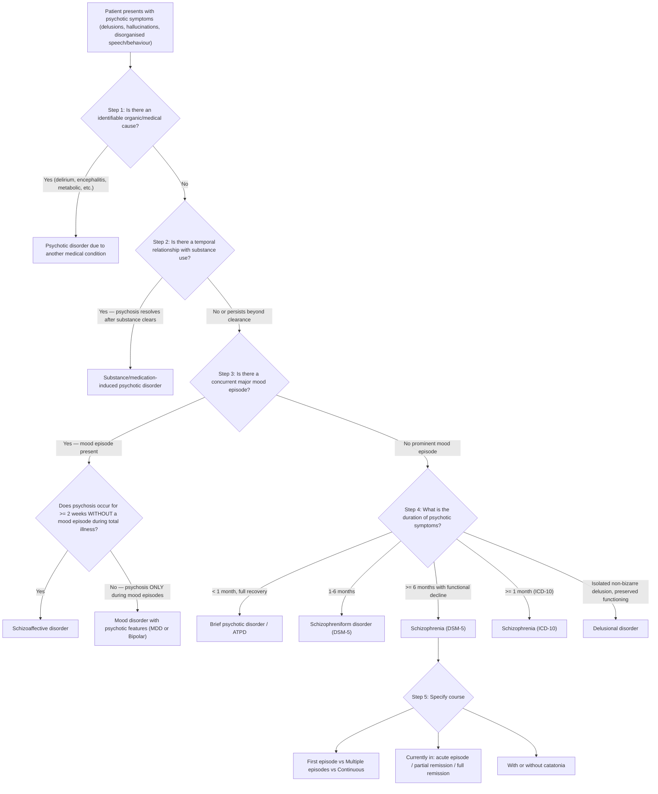

## Diagnostic Criteria for Schizophrenia and Related Disorders

### Conceptual Framework: How Do We Diagnose Schizophrenia?

Schizophrenia is a **clinical diagnosis** — there is no blood test, no imaging finding, and no biomarker that confirms it. The diagnosis rests entirely on the **clinical picture** (history + mental state examination), supplemented by investigations whose purpose is to **exclude secondary causes**, not to confirm schizophrenia itself. This is a crucial first-principles point to understand everything that follows.

The diagnostic criteria serve as standardised "checklists" that ensure:
1. The correct **cluster of symptoms** is present
2. For a sufficient **duration** (to distinguish from transient psychotic episodes)
3. Causing sufficient **functional impairment**
4. **Not better explained** by mood disorders, substances, or medical conditions

<Callout title="ICD-10 vs DSM-5: Key Differences for Exams" type="error">
Schizophrenia duration: ***ICD-10 requires 1 month of symptoms; DSM-5 requires 6 months of disturbance*** (including prodromal/residual phases, with at least 1 month of active-phase symptoms) [2][4]. This means a patient who has had psychotic symptoms for 2 months could be diagnosed with schizophrenia under ICD-10 but only schizophreniform disorder under DSM-5. ***ICD-10 lists schizophrenia subtypes (e.g. paranoid, hebephrenic); DSM-5 doesn't*** [2][4]. ***Catatonia: not specific to schizophrenia, currently used as a diagnostic specifier in DSM-5*** [1].
</Callout>

---

### 1. DSM-5 Diagnostic Criteria for Schizophrenia

This is the criteria you must know cold for exams [2]:

| Criterion | Requirement | Explanation |
|---|---|---|
| **A. Characteristic symptoms** | **≥2 of the following**, each present for a significant portion of time during a **1-month period** (or less if successfully treated). ***At least one must be (1), (2), or (3)*** | This ensures the diagnosis requires a "core psychotic symptom" — you cannot diagnose schizophrenia with only disorganised behaviour and negative symptoms |
| | (1) **Delusions** | |
| | (2) **Hallucinations** | |
| | (3) **Disorganised speech** (e.g. frequent derailment or incoherence) | |
| | (4) **Grossly disorganised or catatonic behaviour** | |
| | (5) **Negative symptoms** (i.e. diminished emotional expression or avolition) | |
| **B. Functional impairment** | **Impaired level of functioning** in ≥1 domain (work, relationships, self-care) for a significant portion of time since onset. In childhood/adolescence: failure to achieve expected level of functioning | This distinguishes schizophrenia from milder psychotic presentations |
| **C. Duration** | **Continuous signs of disturbance for ≥6 months**, which must include **≥1 month** of symptoms meeting Criterion A | The 6 months can include prodromal or residual periods with attenuated symptoms (e.g. negative symptoms, odd beliefs). This is what makes DSM-5 stricter than ICD-10 |
| **D. Exclusion of schizoaffective and mood disorders** | Does NOT meet criteria for schizoaffective disorder, or mood disorder with psychotic features | If mood episodes have occurred, they must be brief relative to the psychotic periods |
| **E. Exclusion of substance/medical condition** | Not attributable to substance or another medical condition | This is why investigations are essential |
| **F. ASD clause** | If history of **autism spectrum disorder**, additional diagnosis of schizophrenia only if **prominent delusions or hallucinations** are present for ≥1 month | Prevents over-diagnosis in patients whose social withdrawal and odd behaviour are explained by ASD alone [2] |

**DSM-5 Course Specifiers** [2]:
- First episode: currently in acute episode / partial remission / full remission
- Multiple episodes: currently in acute episode / partial remission / full remission
- Continuous
- Unspecified
- With catatonia (specifier)

> **Why does DSM-5 require 6 months but ICD-10 only requires 1 month?** The 6-month criterion was introduced to improve **specificity** — it reduces the chance of diagnosing schizophrenia in patients who actually have brief psychotic disorder or schizophreniform disorder (which have better prognoses). However, it sacrifices **sensitivity** — some true schizophrenia patients will be "underdiagnosed" in the early months. In practice, this rarely matters because treatment starts regardless; the label changes later.

---

### 2. ICD-10 Diagnostic Criteria for Schizophrenia (F20)

ICD-10 places greater emphasis on **Schneider's first-rank symptoms** and is structured differently [2]:

**Required duration:** Symptoms clearly present for **most of the time during ≥1 month** [2].

The criteria are divided into "major" (first-rank) and "minor" symptoms:

**At least 1 "major" symptom from groups (a)–(d), OR symptoms from ≥2 of groups (e)–(h):**

| Group | Symptom (Major — First Rank) |
|---|---|
| **(a)** | Thought echo, thought insertion or withdrawal, thought broadcasting |
| **(b)** | Delusions of control, influence, or passivity (clearly referred to body/limb movements or specific thoughts, actions, or sensations); delusional perception |
| **(c)** | Hallucinatory voices giving running commentary, or discussing the patient among themselves, or other types of hallucinatory voices coming from some part of the body |
| **(d)** | Persistent delusions of other kinds that are culturally inappropriate and completely impossible (bizarre delusions) |

| Group | Symptom (Minor) |
|---|---|
| **(e)** | Persistent hallucinations in any modality, when accompanied by fleeting/half-formed delusions, persistent overvalued ideas, or occurring every day for weeks/months |
| **(f)** | Breaks or interpolations in the train of thought → incoherence, irrelevant speech, neologisms |
| **(g)** | Catatonic behaviour: excitement, posturing, waxy flexibility, negativism, mutism, stupor |
| **(h)** | Negative symptoms: marked apathy, paucity of speech, blunting/incongruity of emotional responses (must be clear these are not due to depression or neuroleptic medication) |
| **(i)** | Significant and consistent change in overall quality of personal behaviour (loss of interest, aimlessness, idleness, self-absorbed attitude, social withdrawal) |

**ICD-10 Subtypes** (still in use though not in DSM-5) [1][2]:

| ***Subtype*** | ***Key Features*** |
|---|---|
| ***Paranoid (F20.0)*** | ***Prominent positive symptoms*** — dominated by relatively stable delusions (often control, influence, passivity, persecutory) and hallucinations, with relatively less prominent negative, catatonic, and disorganisation symptoms [1][2] |
| ***Hebephrenic/Disorganised (F20.1)*** | ***Younger age of onset, prominent thought disorder / incongruous affect, poor prognosis*** [1][2] |
| ***Catatonic (F20.2)*** | ***Constellation of specific motor signs e.g. posturing, waxy flexibility, mutism*** [1][2] |
| ***Simple (F20.6)*** | ***Lack of positive symptoms, gradual functional decline, prominent negative symptoms*** [1][2] |
| Undifferentiated (F20.3) | Not conforming to above subtypes [2] |
| Post-schizophrenic depression (F20.4) | Previous schizophrenia with residual symptoms and prominent depression meeting depressive episode criteria [2] |
| Residual (F20.5) | Prominent negative symptoms with prior psychotic episode for ≥1 year [2] |

> ***Subtype classification is no longer included in DSM-5*** [1] — because subtypes showed poor diagnostic stability (patients shifted between subtypes over time), low inter-rater reliability, and limited clinical utility for guiding treatment.

---

### 3. Diagnostic Criteria for Related Disorders

#### 3A. Schizophreniform Disorder (DSM-5)

| Criterion | Requirement |
|---|---|
| A | Meets Criterion A of schizophrenia |
| B | Total duration of episode is **≥1 month but < 6 months** |
| | Criterion B (functional decline) of schizophrenia is NOT required |

> This is essentially a "provisional schizophrenia" — if symptoms persist beyond 6 months, the diagnosis is upgraded to schizophrenia [2].

#### 3B. Brief Psychotic Disorder (DSM-5) / ATPD (ICD-10)

| DSM-5: Brief Psychotic Disorder | ICD-10: ATPD |
|---|---|
| ≥1 psychotic symptom for **≥1 day but < 1 month** | Acute onset ( < 2 weeks) |
| Full return to premorbid functioning | Complete recovery within **2–3 months** [2] |
| Specifiers: with/without marked stressor, with peripartum onset | ***Polymorphic features (~cycloid psychosis): rapidly changing clinical pictures, prominent fluctuated mood state, perplexity*** [1] |

#### 3C. Schizoaffective Disorder (DSM-5)

| Criterion | Requirement | Rationale |
|---|---|---|
| **A** | **Major mood episode** (manic or depressive) concurrent with **Criterion A of schizophrenia** | ***Schizoaffective: concurrent schizophrenic and mood symptoms are equally prominent (fulfilling a major mood episode)*** [1] |
| **B** | **Delusions or hallucinations for ≥2 weeks** in the **absence** of a major mood episode (during the total illness) | This is the critical criterion — it proves the psychosis is NOT simply a feature of the mood disorder |
| **C** | Symptoms meeting criteria for a major mood episode are present for the **majority** of the total active and residual illness duration | Prevents diagnosing schizoaffective disorder in a patient with schizophrenia who has a brief depressive episode |
| **D** | Not attributable to substance or medical condition | Standard exclusion |

#### 3D. Delusional Disorder (DSM-5)

| Criterion | Requirement |
|---|---|
| A | ≥1 delusion lasting **≥1 month** |
| B | **Has never met Criterion A of schizophrenia** — hallucinations, if present, are not prominent and are related to the delusional theme [2] |
| C | **Functioning and behaviour relatively normal** apart from the delusion and its ramifications [2] |
| D | If mood episodes have occurred, they have been **brief** relative to the delusional periods |
| E | Not attributable to substance or medical condition |

---

### 4. Comparison Table: Duration Criteria Across Psychotic Disorders

| Disorder | Duration Requirement (DSM-5) | Duration Requirement (ICD-10) |
|---|---|---|
| Brief psychotic disorder | 1 day – < 1 month | Acute onset < 2 weeks, recovery within 2–3 months |
| Schizophreniform disorder | ≥1 month – < 6 months | (Not a separate entity in ICD-10; would be diagnosed as schizophrenia if > 1 month) |
| **Schizophrenia** | **≥6 months total** (including ≥1 month Criterion A) | **≥1 month of symptoms** |
| Delusional disorder | ≥1 month | ≥3 months |
| Schizoaffective disorder | Total illness duration with mood episode for majority + ≥2 weeks psychosis without mood episode | Simultaneous occurrence for ≥2 weeks |

---

### 5. Diagnostic Algorithm

> **How to use this algorithm:** Work from the **top down** — this mirrors the diagnostic hierarchy. You systematically exclude organic causes first, then substances, then mood disorders, before concluding it's a primary psychotic disorder. Only then do you differentiate by duration and symptom profile.

---

### 6. Investigations in First-Episode Psychosis

Remember: investigations in psychosis are **not to confirm** schizophrenia but to **exclude secondary causes**. A first-episode psychosis (FEP) should be treated as "guilty until proven innocent" — assume an organic cause until you've ruled it out.

#### 6.1 Mandatory Baseline Investigations

| Investigation | Purpose | Key Findings / Interpretation |
|---|---|---|
| **Full blood count (FBC)** | Exclude infection (↑WCC), anaemia, macrocytosis (B12/folate deficiency, alcohol) | Leucocytosis → infection/delirium. MCV > 100 → B12/folate deficiency or alcohol use |
| **Renal function (U&E, Cr)** | Exclude uraemic encephalopathy; baseline before medication | ↑Urea/Cr → uraemic psychosis. Also needed for medication dosing |
| **Liver function tests (LFTs)** | Exclude hepatic encephalopathy; baseline before medication (many antipsychotics are hepatically metabolised) | ↑AST/ALT → hepatic cause; also screens for alcohol-related liver disease |
| **Thyroid function tests (TFTs)** | Exclude thyroid disease — both hyperthyroidism (agitation, psychosis) and hypothyroidism ("myxoedema madness") | ↑TSH + ↓T4 → hypothyroidism; ↓TSH + ↑T4 → hyperthyroidism |
| **Fasting glucose / HbA1c** | Baseline metabolic screen (critical before starting 2nd-generation antipsychotics which cause metabolic syndrome); exclude hypoglycaemia as cause of altered mental state | Hypoglycaemia → episodic confusion/psychosis. Also establishes baseline for metabolic monitoring on antipsychotics |
| **Fasting lipid profile** | Baseline metabolic screen before antipsychotics | Establishes baseline; 2nd-generation antipsychotics (especially olanzapine, clozapine) can cause dyslipidaemia |
| **Calcium, phosphate** | Exclude hypercalcaemia (hyperparathyroidism → psychosis), hypocalcaemia | ↑Ca²⁺ → confusion, psychosis ("bones, stones, groans, and psychiatric moans") |
| **B12 and folate** | Exclude deficiency — B12 deficiency can present with psychosis, cognitive decline, and neurological signs (subacute combined degeneration) before haematological changes appear [2] | ↓B12 → megaloblastic anaemia + neuropsychiatric symptoms |
| **Syphilis serology (VDRL/RPR ± TPHA)** | Exclude neurosyphilis — classically presents with grandiose delusions ("general paresis of the insane") [2] | Positive serology → further CSF analysis needed |
| **ESR / CRP** | Non-specific inflammatory markers; screen for autoimmune/infectious causes [2] | ↑ESR/CRP → suggests underlying inflammatory/infectious process |
| **Urine drug screen (UDS)** | **Critical** in every FEP — exclude substance-induced psychosis (cannabis, amphetamines/methamphetamine, cocaine, ketamine, synthetic cannabinoids) [2] | Positive → does not exclude comorbid primary psychotic disorder, but substance must clear before diagnosis can be finalised |
| **ECG** | Baseline QTc before starting antipsychotics (many prolong QT interval); also screens for cardiac arrhythmia [2] | Prolonged QTc ( > 500ms or increase > 60ms) → high risk of torsades de pointes. Haloperidol, ziprasidone particularly associated with QT prolongation |

#### 6.2 Additional Investigations (As Clinically Indicated)

| Investigation | When to Consider | Key Findings |
|---|---|---|
| **CT / MRI brain** | First-episode psychosis (to exclude structural lesion); atypical presentations; late onset ( > 40y); focal neurological signs; head injury [2] | Space-occupying lesion, stroke, demyelination, enlarged ventricles (can be seen in schizophrenia but is not diagnostic). In established schizophrenia: reduced GM volume, increased ventricular volume (research finding, not used diagnostically) |
| **EEG** | Suspected epilepsy (temporal lobe epilepsy can present with psychosis); catatonia; suspected non-convulsive status epilepticus [2] | Epileptiform discharges → ictal/post-ictal psychosis. Diffuse slowing → encephalopathy/delirium |
| **CSF analysis** | Suspected encephalitis (viral, autoimmune — e.g. anti-NMDA receptor encephalitis); neurosyphilis | ↑WCC/protein → infection/inflammation. Anti-NMDA receptor antibodies → autoimmune encephalitis. Positive VDRL in CSF → neurosyphilis |
| **HIV serology** | Risk factors present; mandatory consideration in FEP in many settings | HIV → CNS involvement can cause psychosis directly, or via opportunistic infections |
| **Autoimmune screen (ANA, anti-dsDNA, complement)** | Suspected SLE (cerebral lupus can present with psychosis), especially in young women with multi-system involvement | Positive ANA + anti-dsDNA + low complement → lupus |
| **Anti-NMDA receptor antibodies (serum + CSF)** | Young patient (especially female) with new-onset psychosis + seizures + movement disorder + autonomic instability + catatonia | Positive → anti-NMDA receptor encephalitis — a treatable, potentially reversible cause of psychosis |
| **Ceruloplasmin, serum copper, 24h urine copper, slit-lamp exam** | Young patient ( < 40y) with psychosis + movement disorder + liver disease | ↓Ceruloplasmin, ↑urine copper, Kayser-Fleischer rings → Wilson's disease |
| **Urine porphyrins / porphobilinogen** | Episodic psychosis with abdominal pain + neuropathy, especially young women | ↑Porphobilinogen → acute intermittent porphyria |
| **Serum cortisol / dexamethasone suppression test** | Cushingoid features | ↑Cortisol, non-suppression → Cushing's disease |
| **Heavy metal screen** | Occupational exposure; specific clinical suspicion | Positive → arsenic, manganese, mercury, thallium poisoning [2] |

#### 6.3 Neuropsychological / Cognitive Assessment

***Cognitive impairment is a core feature in schizophrenia*** [1]:
- ***Key determinant of functional outcome*** [1]
- ***Unmet therapeutic need, not responsive to antipsychotic treatment*** [1]
- ***Generalised cognitive impairment encompassing multiple cognitive domains***: ***sustained attention, executive functions (planning, set-shifting, inhibition control), working memory, verbal and visual memory (immediate registration and recall), processing speed*** [1]
- ***In general, 1–2 standard deviations below normal healthy controls*** [1]
- ***Healthy first-degree relatives of patients also demonstrate deficits (albeit less severe) in cognition*** [1]
- ***Impairment in social cognition observed including deficits in Theory of Mind (ToM), emotion recognition etc.*** [1]

Formal neuropsychological testing (e.g. MATRICS Consensus Cognitive Battery) can be used to quantify deficits and guide cognitive remediation therapy, though this is typically done after acute stabilisation rather than during the acute diagnostic work-up.

#### 6.4 Baseline Physical Health Assessment

This is critically important given the metabolic morbidity associated with schizophrenia and its treatment:

| Parameter | Why | Frequency of Monitoring |
|---|---|---|
| **Weight, BMI, waist circumference** | Baseline before antipsychotics (especially 2nd-generation) → metabolic syndrome risk | At baseline, then monthly for 3 months, then 3-monthly |
| **Blood pressure** | Antipsychotics can cause orthostatic hypotension (α1 blockade); metabolic syndrome screening | At baseline and regularly |
| **Fasting glucose + lipids** | Metabolic syndrome monitoring | At baseline, 3 months, then annually |
| **Prolactin** | 2nd-generation antipsychotics (especially risperidone, paliperidone, amisulpride) cause hyperprolactinaemia → galactorrhoea, amenorrhoea, osteoporosis, sexual dysfunction | If symptoms develop; some guidelines recommend baseline |

---

### 7. What Investigations Do NOT Show in Schizophrenia (Important Negative Findings)

| Investigation | Typical Finding in Schizophrenia |
|---|---|
| **CT/MRI brain** | May show enlarged ventricles, reduced cortical GM volume — but these are **non-specific** and **not diagnostic**. Many patients have normal scans. These are research-level findings. |
| **EEG** | Usually **normal** (helps distinguish from epilepsy/delirium where it's abnormal) |
| **Blood tests** | All **normal** (if secondary causes excluded) — this is expected since schizophrenia is diagnosed clinically |
| **CSF** | **Normal** (helps exclude encephalitis) |

> The investigation findings in schizophrenia are defined by their **negativity** — the absence of organic findings IS the finding. This is why schizophrenia remains a clinical diagnosis of exclusion.

---

### 8. Structured Clinical Assessment Tools

While not "investigations" per se, structured tools help standardise assessment:

| Tool | Purpose |
|---|---|
| **PANSS (Positive and Negative Syndrome Scale)** | Quantifies severity of positive symptoms (7 items), negative symptoms (7 items), and general psychopathology (16 items). Used in clinical trials and treatment monitoring |
| **BPRS (Brief Psychiatric Rating Scale)** | Shorter, more practical measure of overall symptom severity |
| **CGI (Clinical Global Impression)** | Global severity and improvement rating |
| **GAF (Global Assessment of Functioning)** | Rates overall social, occupational, and psychological functioning (0–100) |
| **CAARMS / SIPS** | Specifically for assessing **at-risk mental state (ARMS)** / clinical high-risk (CHR) for psychosis |
| **Calgary Depression Scale for Schizophrenia** | Assesses depression specifically in schizophrenia (distinguishes depressive symptoms from negative symptoms) |

<Callout title="Practical Exam Tip: What to Mention When Asked 'Investigations for Schizophrenia'" type="idea">
Structure your answer as:
1. **Exclude organic causes:** FBC, U&E, LFTs, TFTs, Ca²⁺, B12/folate, glucose, syphilis serology, ESR/CRP
2. **Exclude substance-related causes:** Urine drug screen
3. **Baseline before treatment:** ECG (QTc), fasting glucose, fasting lipids, weight/BMI, prolactin
4. **Additional if clinically indicated:** CT/MRI brain (FEP, atypical presentation, late onset), EEG (if seizures/catatonia), CSF (if encephalitis suspected), HIV, autoimmune screen, anti-NMDA receptor antibodies
5. **Functional assessment:** Neuropsychological testing, structured rating scales (PANSS)
</Callout>

---

<Callout title="High Yield Summary">

**Diagnosis of schizophrenia is CLINICAL — investigations exclude secondary causes, not confirm schizophrenia.**

**DSM-5 Criteria (memorise):**
- **A:** ≥2 of delusions, hallucinations, disorganised speech, disorganised/catatonic behaviour, negative symptoms; at least one must be delusions, hallucinations, or disorganised speech; present for significant portion of ≥1 month
- **B:** Functional decline
- **C:** ≥6 months total duration (including prodromal/residual)
- **D:** Not schizoaffective or mood disorder with psychotic features
- **E:** Not substance/medical condition
- **F:** ASD clause

**Key ICD-10 vs DSM-5 difference:** ICD-10 requires 1 month; DSM-5 requires 6 months. ICD-10 retains subtypes; DSM-5 uses course specifiers.

**Duration continuum:** Brief psychotic disorder ( < 1 month) → Schizophreniform (1–6 months) → Schizophrenia ( ≥ 6 months)

**Schizoaffective key criterion:** Psychosis for ≥2 weeks WITHOUT mood episode

**Mandatory FEP investigations:** FBC, U&E, LFTs, TFTs, Ca²⁺, B12/folate, glucose, lipids, syphilis serology, ESR/CRP, urine drug screen, ECG. CT/MRI brain recommended for all FEP.

**Cognitive impairment:** Core feature, 1–2 SD below normal, strongest predictor of functional outcome, NOT responsive to antipsychotics — an unmet therapeutic need.

</Callout>

---

<ActiveRecallQuiz
  title="Active Recall - Diagnostic Criteria, Algorithm, and Investigations"
  items={[
    {
      question: "List the DSM-5 Criterion A symptoms for schizophrenia and state which must be present.",
      markscheme: "Five symptoms: (1) Delusions, (2) Hallucinations, (3) Disorganised speech, (4) Grossly disorganised or catatonic behaviour, (5) Negative symptoms. Need >= 2 present for significant portion of >= 1 month. At least one must be from (1), (2), or (3).",
    },
    {
      question: "What is the key duration difference between ICD-10 and DSM-5 for diagnosing schizophrenia, and what intermediate diagnoses exist in DSM-5 for shorter durations?",
      markscheme: "ICD-10 requires 1 month of symptoms. DSM-5 requires 6 months of continuous disturbance including at least 1 month of active-phase symptoms. Intermediate diagnoses: Brief psychotic disorder (1 day to less than 1 month), Schizophreniform disorder (1 to less than 6 months).",
    },
    {
      question: "What is the single most important criterion that distinguishes schizoaffective disorder from a mood disorder with psychotic features?",
      markscheme: "In schizoaffective disorder, delusions or hallucinations must be present for at least 2 weeks in the ABSENCE of a major mood episode during the total illness duration. In mood disorder with psychotic features, psychosis occurs only during mood episodes and resolves when mood normalises.",
    },
    {
      question: "Name 6 mandatory baseline blood investigations for first-episode psychosis and explain the rationale for each.",
      markscheme: "1. TFTs: exclude thyroid disease causing psychosis. 2. Fasting glucose: exclude hypoglycaemia, baseline for antipsychotic metabolic monitoring. 3. B12/folate: deficiency can cause psychosis and cognitive decline. 4. Syphilis serology: neurosyphilis can present as psychosis. 5. Urine drug screen: exclude substance-induced psychosis. 6. ECG: baseline QTc before starting antipsychotics which prolong QT. Also acceptable: FBC, U and E, LFTs, calcium, ESR/CRP, fasting lipids.",
    },
    {
      question: "Why is cognitive impairment considered a core feature of schizophrenia, and how does it relate to functional outcome and treatment response?",
      markscheme: "Cognitive impairment is a core feature because: it is present before illness onset (prodromal period), is generalised across multiple domains (attention, executive function, working memory, memory, processing speed), is 1-2 SD below healthy controls, and is seen in attenuated form in healthy first-degree relatives. It is the strongest predictor of functional outcome, more so than positive or negative symptoms. It represents an unmet therapeutic need because it does NOT respond to antipsychotic treatment.",
    },
  ]}
/>

## References

[1] Lecture slides: GC 170. Schizophrenia and related psychoses.pdf (pp. 7, 8, 9, 11, 22)
[2] Senior notes: ryanho-psych.md (sections 6.1, 6.2, pp. 4, 33, 124–125, 128–135)
[4] Senior notes: ryanho-psych.md (section on ICD-10 vs DSM-5 comparison, pp. 6–7)
