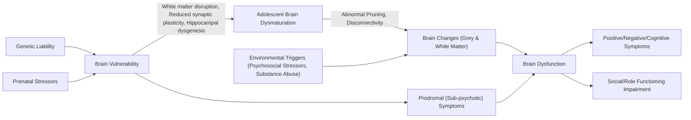

## 1. Definition

**Schizophrenia** — let's break down the name: *"schizo"* (Greek: split) + *"phrēn"* (Greek: mind). This does **not** mean "split personality" (a common misconception), but rather a splitting or fragmentation of mental functions — thought, perception, emotion, and behaviour become disconnected from each other.

Schizophrenia is a **chronic, severe neuropsychiatric disorder** characterised by a constellation of **positive symptoms** (psychosis — delusions, hallucinations), **negative symptoms** (loss of normal functioning — avolition, flat affect), **disorganisation** (thought disorder, bizarre behaviour), **cognitive impairment**, and **affective disturbance**. It is the prototypical psychotic disorder, and it profoundly impairs social and occupational functioning [1][2].

**"Related psychoses"** encompass a spectrum of disorders that share psychotic features but differ in duration, prominence of mood symptoms, or restriction to specific delusional themes. These include:
- **Schizophreniform disorder** (schizophrenia-like but < 6 months)
- **Schizoaffective disorder** (schizophrenia + major mood episode occurring concurrently)
- **Delusional disorder** (non-bizarre, encapsulated delusions without other schizophrenia features)
- **Brief psychotic disorder** (psychotic symptoms lasting < 1 month)
- **Substance/medication-induced psychotic disorder**
- **Psychotic disorder due to another medical condition**

<Callout title="Key Conceptual Point">
Schizophrenia is best understood as a **neurodevelopmental disorder** with a **stress-vulnerability** model — genetic liability creates a vulnerable brain, and environmental insults (prenatal, childhood, adolescence) push it past a threshold into frank psychosis. It is NOT a neurodegenerative disease like Alzheimer's, even though there are progressive structural brain changes in a subgroup of patients [1][2].
</Callout>

---

## 2. Epidemiology

### 2.1 Prevalence and Incidence

- ***Prevalence of all psychotic disorders: approximately 2–3%*** [1]
- ***Lifetime risk of developing schizophrenia: ~1%*** [1]
- ***Median incidence rate of schizophrenia: 15.2 per 100,000 per year*** [1]
- ***Lifetime prevalence of psychotic disorders in Hong Kong: 2.5% (Chang et al. 2017)*** [1]
- Schizophrenia is traditionally described as a **high-prevalence, low-incidence** disease — meaning it is relatively common in the population at any given time (because it is chronic), but new cases per year are not that many [2]

### 2.2 Demographics

| Parameter | Detail |
|-----------|--------|
| ***Male-to-female risk ratio*** | ***1.4:1*** [1] |
| ***Age of onset*** | ***Late adolescence and early adulthood*** [1] |
| Age of onset (M) | 18–25 years [2] |
| Age of onset (F) | Bimodal: 25–35 years + perimenopausal peak [2] |
| ***Men vs Women*** | ***Men have an earlier age at onset of psychosis than women*** [1] |
| Gender severity | Males tend to have more severe illness, more negative symptoms, poorer outcomes [2] |

> **Why the gender difference in onset?** Oestrogen is thought to have a **neuroprotective/antidopaminergic effect** — it raises the threshold for psychosis. This is why women develop schizophrenia later (while oestrogen is high) and have a second peak at perimenopause (when oestrogen drops).

### 2.3 Incidence Variation

***Incidence rates varied widely across regions (7.7–43 per 100,000 per year)*** [1], with elevated incidence being associated with:

- ***Migrants of ethnic minority (from developing countries to western developed countries, e.g. UK, Netherlands) (vs locally-born Caucasians)*** [1]
- ***Individuals being brought up in urban (vs rural) areas (urbanicity)*** [1]

> These observations support the **social defeat hypothesis / stress-dopamine sensitisation** — chronic social stress (discrimination, social exclusion, isolation) sensitises the mesolimbic dopamine system, lowering the threshold for psychosis [1].

### 2.4 Mortality and Morbidity

- **Suicide** is the *single largest cause of premature death* in schizophrenia [2]
  - **5.6% lifetime suicide risk** (highest in the first year of illness) [2]
  - **12× general population** suicide risk [2]
- **Reduced lifespan by 10–15 years** on average [2]
- **2.6× all-cause mortality**, the majority being *non-suicidal* causes [2]
  - Reasons: (1) Sedentary lifestyle, poor nutrition; (2) High rates of smoking, substance/alcohol abuse; (3) Metabolic syndrome from 2nd-generation antipsychotics; (4) Possibly inherent disease process accelerating aging and medical morbidity [2]
- **No. 12 leading disability worldwide**, accounting for ***substantial direct and indirect costs*** [2]

<Callout title="Exam Pearl" type="error">
Students often forget that the **majority of excess mortality** in schizophrenia is from **cardiovascular and metabolic disease**, NOT suicide. However, suicide is the single largest *specific* cause of premature death. The overall excess mortality is driven by multiple medical causes combined.
</Callout>

---

## 3. Anatomy and Functional Neuroanatomy

Understanding schizophrenia requires understanding the **dopamine pathways** and the **key brain regions** affected.

### 3.1 The Four Major Dopamine Pathways

This is the anatomical backbone of the **dopamine hypothesis** and explains both the symptoms and the side effects of treatment.

| ***Pathway*** | ***Origin → Destination*** | ***Function*** | ***Relevance to Schizophrenia*** |
|---|---|---|---|
| ***Mesolimbic*** | Ventral tegmental area (VTA) → Nucleus accumbens, amygdala, hippocampus | Reward, motivation, salience | ***Hyperdopaminergic → positive symptoms*** (delusions, hallucinations) [1] |
| ***Mesocortical*** | VTA → Prefrontal cortex (PFC) | Executive function, working memory, motivation | ***Hypodopaminergic → negative symptoms & cognitive deficits*** [1] |
| ***Nigrostriatal*** | Substantia nigra → Dorsal striatum (caudate, putamen) | Voluntary motor control | ***Antipsychotic blockade here → extrapyramidal side effects (EPS)*** [1] |
| ***Tuberoinfundibular*** | Hypothalamus → Anterior pituitary | Inhibits prolactin release | ***Antipsychotic blockade here → hyperprolactinaemia*** [1] |

> **Why does dopamine blockade in the nigrostriatal pathway cause EPS?** Dopamine in the basal ganglia normally facilitates smooth, coordinated movement by modulating the direct and indirect pathways of motor control. When antipsychotics block D2 receptors here, the result is an imbalance favouring the indirect (inhibitory) pathway — clinically manifesting as parkinsonian features (rigidity, bradykinesia, tremor), akathisia, and dystonia.

### 3.2 Key Brain Regions Affected

***Structural / neuroanatomical abnormalities in schizophrenia (by sMRI)*** [1]:

- ***Reduced whole brain volume / grey matter (GM) volume*** [1]
- ***Reduced GM volumes in temporal lobe (hippocampus, amygdala, superior temporal gyri [STG]), prefrontal cortex, thalamus, anterior cingulate*** [1]
- ***Increased ventricular volume*** [1]
- ***Reduced cortical thickness (cortical thinning)*** [1]
- ***Reduced cortical surface area*** [1]

| Brain Region | Normal Function | Consequence of Abnormality in Schizophrenia |
|---|---|---|
| **Prefrontal cortex** | Executive function, working memory, planning, social cognition | Negative symptoms, cognitive deficits, poor insight |
| **Temporal lobe / STG** | Language comprehension (Wernicke's area), auditory processing | Auditory verbal hallucinations |
| **Hippocampus** | Memory formation, contextual processing | Memory impairment, inability to contextualise stimuli → delusional interpretation |
| **Amygdala** | Emotion processing, fear conditioning | Affective dysregulation, paranoia |
| **Thalamus** | Sensory relay, gating of information | Sensory overload → inability to filter relevant from irrelevant stimuli |
| **Anterior cingulate** | Error monitoring, conflict resolution, motivation | Avolition, impaired self-monitoring |

### 3.3 Connectivity Abnormalities

***Structural & functional connectivity alterations*** [1]:
- ***Altered integrity of white matter tracts (via DTI — diffusion tensor imaging)*** [1]
- ***Altered resting-state functional connectivity (via fMRI)*** [1]

> **Why does disconnectivity matter?** Schizophrenia is increasingly understood as a **disconnection syndrome** — the problem isn't just in individual brain regions, but in how they communicate with each other. This explains the bizarre juxtaposition of symptoms: a patient can have intact memory for facts but completely disordered thinking — the "wires" between brain areas are disrupted.

***Evidence indicates progressive structural brain changes (volume reduction) across the course of illness, at least in a subgroup of patients*** [1].

---

## 4. Aetiology

Schizophrenia follows a **multifactorial, gene–environment interaction model**. Think of it as a **stress-vulnerability framework**: genes load the gun, environment pulls the trigger.

### 4.1 Genetic Factors

***High degree of heritability (estimated as 80% contributed by genetic cause)*** [1]

| Relationship | Risk |
|---|---|
| General population | ~1% |
| ***First-degree relatives*** | ***10–15%*** [1] |
| Dizygotic twin | ~17% [2] |
| ***Monozygotic twin*** | ***~50%*** [1] |
| Both parents affected | ~46% |

> The **MZ concordance of ~50%** (not 100%) is critical — it proves that genetics alone is NOT sufficient. Environmental factors must also be involved [2].

***Polygenic (multiple genes with small effects contributed by each gene)*** [1]:
- ***Many identified candidate genes are related to dopamine, glutamate, synaptic functions, and immune mechanisms*** [1]
- Single nucleotide polymorphisms (SNPs): common variants conferring small individual risks; 108+ genomic loci identified, including the **MHC locus on chromosome 6** (immune function) [2]

***Rare copy number variants (CNVs) with larger effect*** [1]:
- ***e.g. Chromosome 22q11.2 deletion syndrome (DiGeorge Syndrome or Velo-cardio-facial syndrome, VCFS)*** [1]
- ***Associated with 20–30-fold increase in risk of schizophrenia*** [1]

> **Why Ch22q11.2 deletion?** This deletion encompasses genes involved in neuronal migration, synaptic signalling, and catecholamine metabolism (including COMT — catechol-O-methyltransferase, which degrades dopamine). Loss of COMT may lead to dopamine dysregulation. Additionally, the resulting congenital anomalies (cardiac defects, palatal abnormalities, thymic hypoplasia) reflect the broader neurodevelopmental disruption.

Schizophrenia shares genetic risk with other **schizophrenia-spectrum disorders**: schizoaffective disorder, schizotypal personality disorder, paranoid personality disorder, and even bipolar disorder and autism [2][3].

### 4.2 Environmental Factors

#### Prenatal and Perinatal Risk Factors (Distal Factors) [1]

- ***Obstetric complications*** — hypoxic-ischaemic injury to the developing brain, particularly the hippocampus (exquisitely sensitive to hypoxia)
- ***Winter birth, maternal infections (e.g. influenza, toxoplasmosis)*** — maternal immune activation causes cytokine-mediated disruption of fetal brain development. The winter birth effect correlates with peak influenza season
- ***Advanced paternal age at conception (de novo mutation / epigenetic)*** — older sperm accumulate more mutations; epigenetic changes (e.g. altered DNA methylation) may also play a role

#### Proximal Social Risk Factors [1]

- ***Substance abuse (cannabis)*** — cannabis (specifically THC) increases dopamine release in the mesolimbic pathway. Adolescent cannabis use during the critical period of synaptic pruning is particularly risky; dose-response relationship demonstrated
- ***Migration (ethnic minority)*** — chronic social defeat, discrimination, and social isolation sensitise the dopamine system
- ***Urbanicity (urban upbringing)*** — related to social fragmentation, pollution, and chronic stress

> ***These proximal social factors are explained by the social defeat hypothesis / stress-dopamine sensitisation*** [1] — chronic social stress causes the mesolimbic dopamine system to become hyper-responsive, lowering the threshold for psychosis.

#### Other Environmental Factors

- **Childhood adversity** — abuse, neglect, bullying → chronic HPA axis activation, dopamine sensitisation
- **Expressed emotion (EE)**: critical, hostile, or emotionally over-involved attitudes from family members. Exposure to high-EE environments > 35 hours/week increases relapse risk. This is a **perpetuating factor**, not a cause [2]

***Gene × environment interactions*** [1] — genetic vulnerability modifies the impact of environmental exposures (e.g., individuals with certain COMT polymorphisms are more susceptible to cannabis-induced psychosis).

<Callout title="The Stress-Vulnerability Model" type="idea">
Think of each person as having a "bucket" of vulnerability. Genetics fills the bucket partially. Each environmental insult adds more. Once the bucket overflows, psychosis emerges. Some people have very full buckets genetically (e.g. 22q11.2 deletion) and need only a small environmental push. Others have nearly empty buckets and would need overwhelming stress to develop psychosis. This explains why not everyone with risk factors gets schizophrenia.
</Callout>

### 4.3 Neurobiology / Pathophysiology

#### 4.3.1 The Dopamine Hypothesis

***Dopamine hypothesis*** [1]:
- ***Increased pre-synaptic dopamine synthesis in the striatum*** [1]
- ***Hyperdopaminergic transmission → manifestations of psychosis*** [1]

Evidence supporting this:
1. **All effective antipsychotics block D2 receptors** — their clinical potency correlates with D2 binding affinity
2. **Dopamine-releasing drugs** (amphetamines, L-DOPA) can induce psychotic symptoms
3. **PET imaging** shows increased presynaptic dopamine synthesis capacity and release in the striatum of schizophrenia patients

The **four dopamine pathways** (detailed in Section 3.1) explain the full clinical picture:

| Pathway | State in Schizophrenia | Clinical Consequence |
|---|---|---|
| ***Mesolimbic*** | ***Hyperdopaminergic*** | ***Positive symptoms*** [1] |
| ***Mesocortical*** | ***Hypodopaminergic*** | ***Negative & cognitive symptoms*** [1] |
| ***Nigrostriatal*** | Normal (until antipsychotic given) | ***Antipsychotic-induced parkinsonism / EPS*** [1] |
| ***Tuberoinfundibular*** | Normal (until antipsychotic given) | ***Hyperprolactinaemia*** [1] |

> **Why is there HYPER-dopaminergic transmission in the mesolimbic pathway but HYPO-dopaminergic in the mesocortical pathway at the same time?** This is the dopamine paradox. The current model suggests that cortical dopamine deficiency (mesocortical) actually *drives* subcortical dopamine excess (mesolimbic) — the prefrontal cortex normally exerts inhibitory control over subcortical dopamine release. When the PFC is hypofunctional (due to developmental insults, glutamate dysfunction), this "brake" is lost, leading to disinhibited mesolimbic dopamine firing.

#### 4.3.2 Other Neurotransmitter Systems

***Other neurotransmitters involved: glutamate (NMDA hypofunction), GABA*** [1]:

**Glutamate (NMDA receptor hypofunction hypothesis):**
- ***Excess glutamate neurotransmission → neurotoxicity / may lead to hyperdopaminergia*** [1]
- NMDA receptor antagonists (phencyclidine/PCP, ketamine) can induce a schizophrenia-like psychosis that includes **both positive AND negative symptoms** — unlike amphetamines which mainly produce positive symptoms. This makes the glutamate hypothesis more comprehensive [2]
- NMDA hypofunction on GABAergic interneurons → loss of inhibitory tone → excess glutamate release → downstream excessive dopamine release in mesolimbic pathway

**Serotonin (5-HT):**
- Reduced 5-HT2A and 5-HT1A receptor densities in the frontal cortex [2]
- LSD (a 5-HT2 agonist) is a hallucinogen — supporting serotonin's role
- Atypical antipsychotics (e.g. clozapine, olanzapine) act as **5-HT2A antagonists**, which may account for their improved efficacy against negative symptoms and reduced EPS

**GABA:**
- Reduced glutamic acid decarboxylase (GAD — the enzyme that synthesises GABA) in schizophrenic brain [2]
- Reduced GABA levels on spectroscopy [2]
- GABA interneuron dysfunction is thought to be a core upstream abnormality → disinhibition of pyramidal neurons → aberrant glutamate and dopamine signalling

#### 4.3.3 Neuropathological Findings

***Neuropathological findings*** [1]:
- ***Absence of gliosis*** (glial scarring that would indicate neurodegeneration or post-natal injury)
- ***Lack of evidence of neuronal loss***
- ***Reduction in synapse-rich neuropil*** (the dense network of dendrites, axons, and synapses)
- This pattern ***argues against the neurodegeneration hypothesis*** [1]

> **Why is the absence of gliosis so important?** In neurodegenerative diseases (Alzheimer's, Parkinson's), neuronal death triggers reactive gliosis — astrocytes and microglia proliferate to clean up debris. The absence of gliosis in schizophrenia suggests the pathology occurred **before the brain's glial response system was mature** — i.e., during fetal development, supporting a **neurodevelopmental origin**.

#### 4.3.4 The Neurodevelopmental Hypothesis

***Neurodevelopmental hypothesis*** — the **major** hypothesis based on current findings [1][2]:

Schizophrenia is primarily a *neurodevelopmental disorder* rather than an acquired/neurodegenerative one.

Evidence [1][2]:
- ***Motor function deficits occur before onset of illness*** [1]
- ***Neurological soft signs*** (subtle motor and sensory integration abnormalities present premorbidly) [1]
- ***Poor premorbid adjustment*** [1]
- ***Low IQ / mental retardation associated with higher risk of schizophrenia*** [1]
- ***Cognitive deficits emerge in prodromal period*** [1]
- Neurobiology: no gliosis/neuronal loss → prenatal insult; structural brain changes present at or before illness onset, with limited progression after onset [2]
- Most environmental risk factors are pre/perinatal in origin [2]

The **conceptual model** (from both lecture slides and notes) [1][2]:

***Stress-vulnerability model for psychosis development*** [1] — this integrates all the above: genetic vulnerability + neurodevelopmental insults create a "vulnerable brain" → environmental stressors during adolescence/early adulthood push the system past threshold → psychosis.

---

## 5. Development and Course

***Development and course of schizophrenia*** [1]:

| ***Phase*** | ***Timing*** | ***Features*** |
|---|---|---|
| ***Premorbid phase*** | ***Childhood*** | Subtle cognitive, motor, social deficits; poor premorbid adjustment; neurological soft signs |
| ***Prodromal phase (At-Risk Mental State, ARMS / Clinical High-Risk, CHR)*** | ***Adolescence & early adulthood*** | Attenuated psychotic symptoms (unusual ideas, perceptual disturbances), decline in functioning, social withdrawal, cognitive deterioration — **NOT yet meeting criteria for frank psychosis** |
| ***First Psychotic Episode (FEP)*** | ***Onset of psychosis*** | Full psychotic symptoms emerge — hallucinations, delusions, disorganisation |
| ***Longitudinal course*** | ***Variable*** | ***Three trajectories: (1) Fully recovered; (2) Residual deficits (most common — episodic with incomplete remission); (3) Chronic deteriorating course*** |

Note that in the prodromal phase: ***No transition to psychosis*** is also a possible outcome — not all CHR individuals convert [1].

> **Duration of Untreated Psychosis (DUP):** The time between onset of frank psychotic symptoms and initiation of treatment. Longer DUP is consistently associated with poorer outcomes. This is why **early intervention** services (e.g. EASY programme in Hong Kong) are critical.

---

## 6. Classification

### 6.1 DSM-5 Classification of Schizophrenia Spectrum and Other Psychotic Disorders

| Disorder | Key Distinguishing Features |
|---|---|
| **Schizophrenia** | ≥2 of: delusions, hallucinations, disorganised speech, disorganised/catatonic behaviour, negative symptoms (at least one must be delusion, hallucination, or disorganised speech); duration ≥6 months; functional decline |
| **Schizophreniform disorder** | Same symptoms as schizophrenia but total duration 1–6 months; no requirement for functional decline |
| **Schizoaffective disorder** | Concurrent major mood episode (depressive or manic) + Criterion A of schizophrenia; ≥2 weeks of delusions/hallucinations WITHOUT mood symptoms during the illness |
| **Delusional disorder** | ≥1 non-bizarre delusion for ≥1 month; does NOT meet Criterion A of schizophrenia; functioning relatively preserved apart from delusion |
| **Brief psychotic disorder** | ≥1 psychotic symptom lasting 1 day – 1 month, with full return to premorbid functioning |
| **Substance/medication-induced psychotic disorder** | Psychosis develops during or soon after substance intoxication/withdrawal |
| **Psychotic disorder due to another medical condition** | Psychosis directly attributable to a medical condition (e.g. anti-NMDA receptor encephalitis, neurosyphilis, SLE, delirium) |
| **Catatonia** | Can be associated with another mental disorder, medical condition, or be unspecified |

### 6.2 Traditional Subtypes (ICD-10, now largely historical)

The old subtypes (paranoid, hebephrenic/disorganised, catatonic, simple, undifferentiated, residual) were removed from DSM-5 due to poor reliability, low diagnostic stability, and limited clinical utility. However, they may still appear in ICD-10 and are worth knowing:

| Subtype | Key Features |
|---|---|
| **Paranoid** | Prominent delusions (persecutory/grandiose) and hallucinations; relatively preserved cognition and affect; best prognosis among subtypes |
| **Hebephrenic (Disorganised)** | Prominent disorganised speech and behaviour, flat/inappropriate affect; early onset; worst prognosis |
| **Catatonic** | Dominated by psychomotor disturbance (stupor, rigidity, waxy flexibility, negativism, excitement) |
| **Simple** | Insidious negative symptoms without prominent psychosis; progressive decline |
| **Residual** | Past psychotic episodes, now mainly negative symptoms |
| **Undifferentiated** | Meets criteria but doesn't fit neatly into other subtypes |

### 6.3 Delusional Disorder (in detail)

Previously known as paranoid psychoses/paranoia [2]:

- **Epidemiology:** Uncommon; lifetime risk **0.05–0.1%**; median age of onset **46 years** [2]
- **Clinical features:**
  - **Delusion** that is *non-bizarre* (could theoretically happen in real life), *systematised* (well-organised, coherent), and *single-themed* (cf. fragmented, multiple, bizarre in schizophrenia) [2]
  - Themes: **Persecutory** (commonest), erotomania, jealous, somatic, grandiose, mixed, unspecified [2]
  - **Encapsulated**: behaviour unrelated to the delusion is often *normal* [2]
  - **No/minimal hallucinations** — if present, tend to be fleeting and related to the delusional theme [2]
  - **No/minimal negative symptoms** and impact on functioning [2]
- **Course:** Acute onset with generally stable trajectory (a proportion goes on to develop full-blown schizophrenia) [2]

**DSM-5 Diagnostic Criteria for Delusional Disorder** [2]:
- A. ≥1 delusion lasting ≥1 month
- B. Criterion A of schizophrenia has never been met (hallucinations, if present, are not prominent and are related to delusional theme)
- C. Functioning and behaviour are relatively normal apart from the delusion
- D. If mood episodes have occurred, they are brief relative to the delusional periods
- E. Not attributable to substance or medical condition

---

## 7. Symptom Dimensions of Schizophrenia

Modern conceptualisation of schizophrenia moves away from simple "positive vs negative" to **six symptom dimensions** [2]:

### 7.1 Positive Symptoms — "Reality Distortions"

These represent an **excess or distortion** of normal brain functions. They are driven by ***hyperdopaminergic transmission in the mesolimbic pathway*** [1].

#### 7.1.1 Delusions

**Delusion** = a fixed, false belief held with absolute conviction, not amenable to counter-argument, and not explained by the patient's cultural or religious background.

> **Why do delusions occur?** The aberrant salience hypothesis proposes that dopamine dysregulation causes normally irrelevant stimuli to become imbued with inappropriate significance. The patient then constructs delusional explanations to make sense of these abnormally salient experiences.

Common types in schizophrenia:

| Type | Description | Example |
|---|---|---|
| **Persecutory** | Belief that one is being targeted, harmed, or conspired against | "The government is monitoring me through my phone" |
| **Referential** | Belief that ordinary events have special personal significance | "The newsreader was sending me a coded message" |
| **Grandiose** | Belief of inflated worth, power, or identity | "I am the chosen one sent to save humanity" |
| **Thought insertion** | Belief that thoughts are being placed into one's mind by an external force | "They put these ideas in my head" |
| **Thought withdrawal** | Belief that thoughts are being removed from one's mind | "Someone is stealing my thoughts" |
| **Thought broadcasting** | Belief that one's thoughts are transmitted and known to others | "Everyone can hear what I'm thinking" |
| **Delusions of control/passivity** | Belief that one's actions, feelings, or impulses are controlled by an external force | "They are making my arm move" |

#### 7.1.2 Hallucinations

**Hallucination** = a perception in the absence of an external stimulus, with the quality of a real perception (i.e., the patient believes it is real).

| Modality | Description | Pathophysiology |
|---|---|---|
| **Auditory (most common in schizophrenia)** | Auditory verbal hallucinations (AVH) — hearing voices | Abnormal activation of the superior temporal gyrus (auditory cortex) + inner speech misattributed to an external source (failure of self-monitoring by prefrontal cortex) |
| **Visual** | Seeing things not there | More common in organic psychosis (delirium, substance use) — should prompt investigation for organic cause |
| **Olfactory** | Smelling things not there | Consider temporal lobe epilepsy |
| **Tactile** | Feeling things on/under the skin | Common in substance-induced psychosis (e.g. formication in stimulant use) |
| **Gustatory** | Tasting things not there | Rare |

#### 7.1.3 Kurt Schneider's First Rank Symptoms (FRS)

These were historically considered pathognomonic for schizophrenia but are now recognised as **highly suggestive but NOT diagnostic** (they can occur in other conditions including bipolar disorder with psychosis). Still high-yield for exams. The mnemonic is **SPECTRA** [2]:

| Letter | Symptom | Explanation |
|---|---|---|
| **S** | **Somatic passivity** | Belief that bodily sensations are imposed by external force |
| **P** | **"Made" actions, impulses (Passivity experiences)** | Belief that one's will, emotions, or acts are controlled externally |
| **E** | **Thought Echo** (écho de la pensée) | Voice repeating one's own thoughts aloud |
| **C** | **Thought Commentary / 3rd person AVH** | Voices discussing the patient in the 3rd person, or providing running commentary on their actions |
| **T** | **Thought insertion/withdrawal/broadcasting** | Alien thoughts placed in, removed from, or broadcast from one's mind |
| **R** | **Referential delusion / delusional perception** | A normal perception given delusional significance (e.g. seeing a red car → believing it's a sign that an assassination will occur) |
| **A** | **Audible thoughts** (Gedankenlautwerden) | Patient hears their own thoughts spoken aloud |

### 7.2 Negative Symptoms — "Loss of Normal Functioning"

These represent a **diminution or loss** of normal functions. They are linked to ***hypodopaminergic transmission in the mesocortical pathway*** [1] and correlate with **prefrontal cortex atrophy**.

Negative symptoms are often more disabling than positive symptoms and are harder to treat.

The **"5 A's" of negative symptoms**:

| Symptom | Description | Pathophysiology |
|---|---|---|
| **Avolition** | Loss of motivation and drive; inability to initiate and sustain purposeful activity | Reduced dopaminergic signalling in mesocortical pathway → impaired reward processing and motivation circuits (prefrontal cortex–striatal loop) |
| **Alogia** | Poverty of speech (reduced quantity) or poverty of content (speech is vague, repetitive, lacking substance) | Prefrontal cortex dysfunction → impaired language generation |
| **Anhedonia** | Inability to experience pleasure from previously enjoyable activities | Disrupted reward circuitry involving nucleus accumbens and ventral striatum |
| **Asociality** | Withdrawal from social interaction; decreased interest in relationships | Combination of amygdala dysfunction (impaired social cognition), prefrontal dysfunction (poor motivation), and possibly secondary to paranoia |
| **Affective flattening (blunted affect)** | Reduced range and intensity of emotional expression (flat face, monotone voice, poor eye contact) | Prefrontal and temporal lobe dysfunction → impaired emotional expression (NB: the patient may still *feel* emotions internally — the expression is reduced, not necessarily the experience) |

<Callout title="Primary vs Secondary Negative Symptoms" type="error">
Before attributing negative symptoms to schizophrenia itself (primary), always rule out **secondary** causes:
- **Depression** (can look identical to negative symptoms)
- **Antipsychotic side effects** (especially EPS — akinesia mimics avolition; sedation mimics alogia)
- **Social deprivation** (institutional environment)
- **Positive symptoms** (e.g., patient may be socially withdrawn because of paranoid delusions, not asociality)
Distinguishing these has major treatment implications.
</Callout>

### 7.3 Disorganisation Symptoms — "Disorganised Thoughts and Behaviour"

These represent **disrupted integration of thought and behaviour** — the "split" in schizophrenia.

#### Formal Thought Disorder (FTD) — Disorganised Speech

The patient's speech reflects their disordered thinking:

| Type | Description | Example |
|---|---|---|
| **Loosening of associations (derailment)** | Ideas shift from one topic to an unrelated topic without logical connection | "I need to go to the bank. Banks have rivers. Rivers run through it. Running is good exercise." |
| **Tangentiality** | Replies to questions are obliquely related or completely irrelevant | Q: "How are you feeling?" A: "My dog ate the newspaper yesterday." |
| **Incoherence (word salad)** | Speech is incomprehensible — words are strung together with no logical or grammatical connection | "Tree window jumps the happy sadly car" |
| **Neologisms** | Invented words with private meaning | "I'm feeling very snorpelated today" |
| **Clang associations** | Words chosen for their sound (rhyme/assonance) rather than meaning | "I went to the mall, had a ball, hit the wall, that's all" |
| **Perseveration** | Repetition of a word, phrase, or idea beyond relevance | Repeating the answer to a previous question for subsequent questions |
| **Thought blocking** | Sudden interruption of train of thought; patient stops mid-sentence and cannot recall what they were saying | Experienced by patient as thought withdrawal |
| **Circumstantiality** | Over-inclusive speech that eventually reaches the point (cf. tangentiality which never reaches the point) | Long, meandering answer that does eventually answer the question |
| **Poverty of content** | Speech is adequate in amount but conveys little information | Vague, empty, repetitive speech |

> **Pathophysiology of FTD:** Disrupted connectivity between Wernicke's area (language comprehension), Broca's area (language production), and the prefrontal cortex (executive control of speech). The prefrontal cortex normally acts as a "filter" — organising thoughts into coherent, goal-directed speech. When this breaks down, thoughts become loosely associated and speech becomes disorganised.

#### Disorganised Behaviour

- Unpredictable, non-goal-directed behaviour
- Inappropriate affect (laughing at sad news)
- Poor self-care, unkempt appearance
- Agitation or stupor without clear cause

### 7.4 Motor Symptoms — Catatonia

**Catatonia** (*"kata"* = down, *"tonos"* = tension) — a syndrome of psychomotor disturbance that can occur in schizophrenia, mood disorders, or medical conditions.

| Feature | Description |
|---|---|
| **Stupor** | Markedly decreased reactivity to environment; reduction/absence of movement |
| **Catalepsy / waxy flexibility** | Passive positioning of limbs maintained against gravity (like bending a candle) |
| **Mutism** | Absent or minimal verbal response |
| **Negativism** | Motiveless resistance to all instructions or attempts to be moved |
| **Posturing** | Spontaneous maintenance of unusual postures |
| **Mannerisms / stereotypies** | Odd, purposeful movements (mannerisms) or repetitive, non-purposeful movements (stereotypies) |
| **Echolalia** | Automatic repetition of another's speech |
| **Echopraxia** | Automatic imitation of another's movements |
| **Catatonic excitement** | Excessive, purposeless motor activity not influenced by external stimuli |

> **Pathophysiology of catatonia:** Hypothesised to involve GABAergic dysfunction (hence response to benzodiazepines, which enhance GABA), with additional involvement of dopaminergic, glutamatergic, and potentially autoimmune mechanisms. Always consider **anti-NMDA receptor encephalitis** as a differential for catatonia in young patients.

### 7.5 Cognitive Symptoms

- **Working memory** deficits (PFC dysfunction)
- **Attention and concentration** impairment
- **Processing speed** reduced
- **Executive function** impairment (planning, abstract thinking, cognitive flexibility)
- **Verbal learning and memory** deficits

> These are present **before** the onset of frank psychosis (in the prodromal period) and are relatively **stable** over time — they do not fluctuate with positive symptoms. They are the **strongest predictor of functional outcome** — more so than positive or negative symptoms. Unfortunately, they are also the **hardest to treat** with current medications.

### 7.6 Affective Symptoms

- **Depression** — extremely common in schizophrenia (up to 80% experience depressive symptoms at some point); contributes significantly to suicide risk
- **Anxiety** — often present, especially in paranoid presentations
- **Dysphoria / irritability**

---

## 8. Clinical Features — Signs (MSE Findings)

On Mental State Examination (MSE), you may find:

| MSE Domain | Findings |
|---|---|
| **Appearance & Behaviour** | Unkempt, poor self-care, psychomotor agitation or retardation, bizarre posturing, stereotypies, decreased eye contact, suspicious/guarded demeanour |
| **Speech** | Poverty of speech (alogia), disorganised speech (loosening of associations, tangentiality, word salad, neologisms), or normal |
| **Mood (subjective) / Affect (objective)** | Mood may be described as "empty" or "nothing"; affect is typically **flat/blunted** (reduced range), or may be **incongruent** (inappropriate to content — e.g. laughing when discussing death) |
| **Thought Form** | Formal thought disorder (as above) |
| **Thought Content** | Delusions (persecutory, referential, grandiose, passivity, thought insertion/withdrawal/broadcasting); suicidal ideation must be assessed |
| **Perceptions** | Auditory verbal hallucinations (2nd or 3rd person, running commentary, thought echo); less commonly visual, olfactory, tactile |
| **Cognition** | Impaired attention, concentration, working memory, executive function; orientation usually preserved (cf. delirium where it is impaired) |
| **Insight** | Typically **poor** — patient does not believe they are unwell, does not see the need for treatment. Insight exists on a spectrum and fluctuates |
| **Judgment** | Often impaired |

<Callout title="Distinguishing Schizophrenia from Delirium">
Both can present with hallucinations and disorganised behaviour, but:
- **Delirium**: fluctuating consciousness, impaired orientation, **visual** hallucinations predominate, acute onset with identifiable medical cause, often in elderly
- **Schizophrenia**: clear consciousness, orientation usually preserved, **auditory** hallucinations predominate, insidious onset (usually), typically young adults
</Callout>

---

## 9. Summary of Clinical Features with Pathophysiological Basis

| Clinical Feature | Pathophysiological Basis |
|---|---|
| Auditory hallucinations | Spontaneous activation of auditory cortex (STG) + failure of self-monitoring (PFC) → inner speech misattributed as external |
| Persecutory delusions | Aberrant dopamine-mediated salience → neutral stimuli perceived as threatening → delusional explanation constructed |
| Thought insertion/withdrawal/broadcasting | Failure of "efference copy" mechanism — the brain normally tags self-generated thoughts as "mine"; when this tagging fails, thoughts feel alien or externally controlled |
| Flat affect | Mesocortical hypodopaminergia + PFC/temporal atrophy → impaired emotional expression circuitry |
| Avolition | Disrupted reward circuitry (PFC → nucleus accumbens) due to mesocortical dopamine deficit → inability to anticipate reward and initiate goal-directed behaviour |
| Formal thought disorder | Disconnection between language areas (Wernicke's, Broca's) and executive control (PFC) → loss of goal-directed, coherent speech |
| Cognitive deficits | PFC grey matter reduction + white matter disconnection → impaired working memory, executive function, processing speed |
| Catatonia | GABAergic dysfunction in motor circuits; may also involve basal ganglia dopaminergic dysregulation |

---

## 10. Prognostic Factors (Brief Overview)

| Better Prognosis | Worse Prognosis |
|---|---|
| Female sex | Male sex |
| Late onset | Early onset |
| Acute onset with clear precipitant | Insidious onset |
| Prominent positive symptoms | Prominent negative symptoms |
| Prominent affective symptoms | Absence of affective symptoms |
| Good premorbid adjustment | Poor premorbid adjustment |
| Married / good social support | Single / isolated |
| Family history of mood disorders | Family history of schizophrenia |
| Short DUP (duration of untreated psychosis) | Long DUP |
| No substance abuse | Comorbid substance abuse |
| Good treatment adherence | Poor adherence |

---

<Callout title="High Yield Summary">

**Definition:** Schizophrenia is a chronic neurodevelopmental psychotic disorder characterised by positive symptoms (hallucinations, delusions), negative symptoms (5 A's), disorganisation, cognitive impairment, motor symptoms, and affective disturbance.

**Epidemiology:** Lifetime risk ~1%; prevalence of all psychotic disorders ~2–3%; M:F = 1.4:1; onset late adolescence/early adulthood; men earlier onset. HK prevalence 2.5%. Incidence varies with urbanicity and migration.

**Aetiology — Stress-Vulnerability Model:**
- **Genetics (80% heritability):** Polygenic (dopamine, glutamate, synaptic, immune genes); 22q11.2 deletion → 20–30× risk; MZ concordance ~50%
- **Environment:** Prenatal (obstetric complications, winter birth, infections, paternal age) + Proximal (cannabis, urbanicity, migration — social defeat hypothesis)
- **Gene × environment interaction**

**Pathophysiology:**
- **Dopamine hypothesis:** Mesolimbic hyper → positive symptoms; Mesocortical hypo → negative/cognitive symptoms
- **Glutamate:** NMDA hypofunction → excess glutamate → hyperdopaminergia + neurotoxicity
- **GABA:** Reduced GAD → disinhibition
- **Neuropathology:** Reduced neuropil, NO gliosis → neurodevelopmental NOT neurodegenerative
- **Structural:** Reduced GM (temporal, PFC, thalamus, anterior cingulate), increased ventricles, cortical thinning, white matter disconnectivity

**Schneider's First Rank Symptoms (SPECTRA):** Somatic passivity, Passivity of action/impulse, Echo of thoughts, Commentary/3rd person AVH, Thought insertion/withdrawal/broadcasting, Referential/delusional perception, Audible thoughts

**Negative symptoms (5 A's):** Avolition, Alogia, Anhedonia, Asociality, Affective flattening

**Course:** Premorbid → Prodromal (ARMS/CHR) → First Episode Psychosis → Variable longitudinal course (full recovery / residual deficits / chronic)

**Delusional disorder:** Non-bizarre, systematised, single-themed delusion ≥1 month; preserved functioning; no/minimal hallucinations or negative symptoms; lifetime risk 0.05–0.1%; median onset 46y

</Callout>

---

<ActiveRecallQuiz
  title="Active Recall - Schizophrenia and Related Disorders (Definition to Clinical Features)"
  items={[
    {
      question: "Name the four major dopamine pathways and state the clinical relevance of each in schizophrenia and its treatment.",
      markscheme: "1. Mesolimbic (VTA to nucleus accumbens) - hyperdopaminergic - positive symptoms. 2. Mesocortical (VTA to PFC) - hypodopaminergic - negative and cognitive symptoms. 3. Nigrostriatal (substantia nigra to dorsal striatum) - antipsychotic blockade causes EPS. 4. Tuberoinfundibular (hypothalamus to pituitary) - antipsychotic blockade causes hyperprolactinaemia.",
    },
    {
      question: "What neuropathological findings in schizophrenia support the neurodevelopmental hypothesis over the neurodegeneration hypothesis?",
      markscheme: "Absence of gliosis, lack of evidence of neuronal loss, reduction in synapse-rich neuropil. Gliosis would be expected in neurodegeneration. Absence suggests prenatal insult before glial response system matured. Additional support: premorbid motor/cognitive deficits, poor premorbid adjustment, structural changes present at illness onset.",
    },
    {
      question: "List the five A's of negative symptoms in schizophrenia and explain the shared pathophysiological mechanism.",
      markscheme: "Avolition, Alogia, Anhedonia, Asociality, Affective flattening. Shared mechanism: hypodopaminergic transmission in the mesocortical pathway (VTA to PFC), plus prefrontal cortex grey matter reduction and disrupted PFC-striatal reward circuitry.",
    },
    {
      question: "Explain the social defeat hypothesis and name three proximal risk factors for schizophrenia it explains.",
      markscheme: "Social defeat hypothesis proposes that chronic social stress causes sensitisation of the mesolimbic dopamine system, lowering threshold for psychosis. Three proximal risk factors: 1. Migration/ethnic minority status, 2. Urbanicity (urban upbringing), 3. Substance abuse (cannabis). All involve chronic social adversity or dopamine sensitisation.",
    },
    {
      question: "What are the key differences between delusional disorder and schizophrenia?",
      markscheme: "Delusional disorder: non-bizarre, systematised, single-themed delusions; no/minimal hallucinations; no/minimal negative symptoms; preserved functioning apart from delusion; later onset (median 46y); lifetime risk 0.05-0.1%. Schizophrenia: bizarre, fragmented, multiple delusions; prominent hallucinations; negative symptoms present; significant functional impairment; earlier onset; lifetime risk 1%.",
    },
    {
      question: "Describe the Schneider first rank symptoms using the SPECTRA mnemonic.",
      markscheme: "S - Somatic passivity (bodily sensations imposed externally). P - Passivity of actions/impulses (made actions). E - Echo of thoughts (thought echo). C - Commentary / 3rd person AVH (voices discussing patient or running commentary). T - Thought insertion, withdrawal, broadcasting. R - Referential delusion / delusional perception. A - Audible thoughts (Gedankenlautwerden).",
    },
  ]}
/>

---

## References

[1] Lecture slides: GC 170. Schizophrenia and related psychoses.pdf (pp. 4, 5, 14, 15, 16, 18, 20, 21)
[2] Senior notes: ryanho-psych.md (sections 6.2, pp. 128, 132–136)
[3] Lecture slides: GC 163. I am a superman Bipolar disorder.pdf (p. 28)
