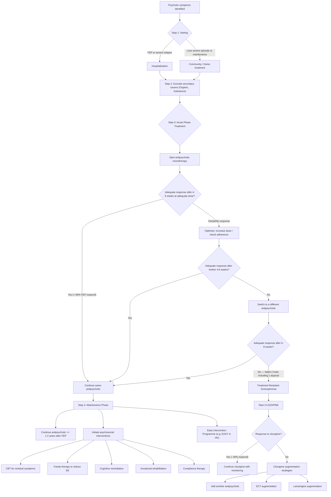

## Management of Schizophrenia and Related Disorders

### Overall Management Philosophy

Managing schizophrenia is a **long-game** — this is not an acute illness you treat and cure. It is a chronic, relapsing-remitting condition that requires a **biopsychosocial approach** across multiple phases. Think of it in three time horizons:

1. **Acute phase** — stabilise the psychosis (primarily pharmacological)
2. **Maintenance phase** — prevent relapse (pharmacological + psychosocial)
3. **Long-term recovery** — maximise functioning, independence, and quality of life (primarily psychosocial + ongoing medication)

The management also depends on the **stage of illness**: first-episode psychosis (FEP) is approached differently from chronic relapsing schizophrenia, which is again different from treatment-resistant schizophrenia.

---

### Management Algorithm

---

### 1. Setting

- ***Hospitalisation*** necessary for **first-episode psychosis or severe relapses** [2]
  - Advantages: thorough assessment (including excluding organic causes), better medication compliance (supervised administration), relief for family, management of risk (self-harm, harm to others), and establishment of therapeutic rapport [2]
  - May be involuntary under the **Mental Health Ordinance (Cap. 136)** in Hong Kong if criteria met (mental disorder + risk to self/others + refuses voluntary admission)
- **Home/community treatment** possible for less severe episodes and the maintenance phase [2]
  - Advantages: avoids institutionalisation, maintains social networks, less stigma
  - Requires good community support, adherent patient, and low-risk presentation

---

### 2. Pharmacological Treatment

#### 2A. Antipsychotics — The Mainstay

***Antipsychotic medication as the mainstay treatment*** [1]

***Effective in treating positive psychotic symptoms*** [1]

***> 80% of patients with first-episode psychosis respond to antipsychotic treatment in first psychotic episode*** [1]

***Mechanism of action: D2 receptor antagonist (striatum)*** [1]

> **Why D2 blockade works:** In schizophrenia, the mesolimbic pathway is hyperdopaminergic. D2 receptor antagonism in the mesolimbic system reduces this excess dopaminergic signalling, thereby reducing the aberrant salience that drives delusions and hallucinations. The drug only needs to occupy **70–80%** of striatal D2 receptors to be clinically effective [2].

***Excessive D2 blockade (> 70–80% of striatal D2 receptors) → motor side-effects*** [1]

> **Why does excessive blockade cause EPS?** Beyond the 70–80% threshold needed for therapeutic effect, additional D2 blockade in the **nigrostriatal** pathway tips the balance of the direct/indirect motor pathways, causing parkinsonism, dystonia, and akathisia. This is the **therapeutic window** concept — enough blockade to treat psychosis, not so much as to cause EPS.

#### Classification of Antipsychotics

The traditional classification divides antipsychotics into **first-generation (FGA, "typical")** and **second-generation (SGA, "atypical")**, though newer evidence suggests this classification has **limited clinical significance** — drugs should be considered individually based on their side effect profiles [2].

| Feature | First-Generation Antipsychotics (FGA / Typical) | Second-Generation Antipsychotics (SGA / Atypical) |
|---|---|---|
| **Examples** | Haloperidol, chlorpromazine, trifluoperazine, flupentixol, zuclopenthixol | Risperidone, olanzapine, quetiapine, aripiprazole, amisulpride, clozapine, paliperidone, lurasidone, asenapine |
| **Primary MoA** | D2 receptor antagonism (primarily) | D2 antagonism + 5-HT2A antagonism (+ variable effects on other receptors) |
| **Positive symptoms** | Effective | Equally effective (with exception of clozapine which is superior) |
| **Negative symptoms** | Limited efficacy | May be slightly better (via 5-HT2A antagonism → increased dopamine release in prefrontal cortex) |
| **Main side effects** | **EPS** (high), **hyperprolactinaemia** (high) | **Metabolic syndrome** (weight gain, diabetes, dyslipidaemia), **sedation** |

> **Why do SGAs cause less EPS?** The 5-HT2A antagonism of SGAs disinhibits dopamine release specifically in the nigrostriatal pathway, partially counteracting the D2 blockade there. This "restores" some dopaminergic tone in the motor pathway, reducing EPS risk. However, this comes at the cost of metabolic effects from histamine H1, muscarinic, and serotonin receptor interactions.

#### Side Effect Profiles — The "Anti-HAM" Framework

Side effects of antipsychotics are explained by their receptor binding profiles beyond D2:

| Receptor Blocked | Side Effects | Mnemonic | Worst Offenders |
|---|---|---|---|
| **D2 (nigrostriatal)** | EPS: parkinsonism, acute dystonia, akathisia, tardive dyskinesia | | Haloperidol, FGAs generally, risperidone |
| **D2 (tuberoinfundibular)** | Hyperprolactinaemia → galactorrhoea, amenorrhoea, sexual dysfunction, osteoporosis | | Amisulpride, risperidone/paliperidone, sulpiride |
| **H1 (histamine)** | Sedation, weight gain | **H** = Histamine | Chlorpromazine, olanzapine, quetiapine, clozapine |
| **α1 (adrenergic)** | Postural hypotension, dizziness, reflex tachycardia | **A** = Alpha | Chlorpromazine, quetiapine, clozapine |
| **M1 (muscarinic)** | Dry mouth, blurred vision, constipation, urinary retention, cognitive impairment | **M** = Muscarinic | Clozapine, olanzapine, chlorpromazine |

> "**Anti-HAM**" = anti-**H**istaminergic + anti-**A**drenergic (α1) + anti-**M**uscarinic effects. This framework lets you predict side effects from receptor profiles [2].

#### Specific Side Effect Comparison Table (High Yield)

| Side Effect | Highest Risk | Lowest Risk |
|---|---|---|
| **EPS** | Haloperidol, FGAs | Clozapine (0), quetiapine (0), aripiprazole (+) |
| **Prolactin elevation** | Amisulpride (+++), risperidone/paliperidone (+++) | Clozapine (0), aripiprazole (0), quetiapine (0) |
| **Weight gain** | Clozapine (+++), olanzapine (+++) | Aripiprazole (0), lurasidone (0), amisulpride (+) |
| **QTc prolongation** | Amisulpride, haloperidol, ziprasidone | Aripiprazole, lurasidone |
| **Sedation** | Chlorpromazine, quetiapine, olanzapine, clozapine | Amisulpride, aripiprazole, paliperidone |

<Callout title="Aripiprazole — The Odd One Out" type="idea">
Aripiprazole is unique in that it is a **partial dopamine agonist** (not a pure antagonist). It acts as a "dopamine stabiliser" — in hyperdopaminergic states (mesolimbic pathway), it acts as a functional antagonist (reducing activity); in hypodopaminergic states (mesocortical), it acts as a partial agonist (boosting activity). This gives it a favourable side effect profile: minimal D2 blockade-related effects (low EPS, no prolactin elevation, no metabolic syndrome). However, its pro-dopaminergic effects can cause insomnia, nausea, vomiting, and restlessness/agitation [2].
</Callout>

#### Antipsychotic Formulations

| Formulation | When to Use | Key Points |
|---|---|---|
| **Oral (tablets/liquid)** | Standard — first-line for most patients | Most flexible for dose titration |
| **Rapid-acting IM injection** | Acute agitation/aggression requiring rapid tranquillisation | Haloperidol IM, olanzapine IM, aripiprazole IM. Onset within 15–30 minutes |
| **Long-acting injectable (LAI / Depot)** | Maintenance phase in patients with **poor adherence** | Paliperidone palmitate (monthly/3-monthly), aripiprazole LAI (monthly), flupentixol decanoate, zuclopenthixol decanoate. Ensures continuous therapeutic levels. Should be avoided in elderly and those at risk of overdose/drug interactions due to difficulty in reversal [2] |

> **Why use depot injections?** Non-adherence is the **major risk factor for relapse** — up to 52% of patients are non-adherent [2]. Depot formulations guarantee medication delivery and remove the daily decision to take or skip a pill. Studies show depots reduce relapse and rehospitalisation rates.

#### Duration of Maintenance Treatment

***High risk of relapse*** [1]

***Major risk factor of relapse: non-adherence to medication*** [1]

***At least 1–2 year maintenance antipsychotic treatment following positive symptom remission is recommended for first-episode psychosis (also depends on individual case)*** [1]

| Episode | Recommended Duration | Rationale |
|---|---|---|
| **First episode** | ≥1–2 years after symptom remission | Even with treatment, 80–98% relapse if medication discontinued prematurely. Must balance risk of relapse vs long-term side effects [2] |
| **Second episode / multiple relapses** | ≥5 years or indefinite | Each relapse carries risk of incomplete recovery and progressive functional decline |
| **Treatment-resistant / chronic** | Indefinite (lifelong) | Stopping medication almost always leads to relapse |

> **Why such long maintenance?** The neurobiology doesn't "reset" after a psychotic episode. The underlying dopamine dysregulation persists. Antipsychotics suppress psychosis but don't cure the underlying vulnerability. Stopping medication removes the suppressive effect, and the mesolimbic hyperdopaminergia re-emerges → relapse. Additionally, each relapse may cause further neurotoxic damage and progressive structural brain changes.

#### 2B. Treatment-Resistant Schizophrenia (TRS) and Clozapine

***Treatment-resistant schizophrenia*** [1]:
- ***Persistent, prominent positive psychotic symptoms despite at least 2 trials of different types of antipsychotic medications with adequate dose and adequate duration (6–8 weeks)*** [1]
- ***Indication for clozapine initiation*** [1]

Clozapine is the **gold standard** for TRS — it is the **only drug proven to be superior** in treatment-resistant patients [2].

| Property | Detail |
|---|---|
| **Prevalence of TRS** | 10–30% of schizophrenia patients [2] |
| **Definition** | Persistent, prominent positive symptoms despite ≥2 adequate antipsychotic trials (≥1 atypical), each at maximally tolerated dose for ≥6–8 weeks [2] |
| **Drug of choice** | Clozapine [2] |
| **Response rate** | ~30% of TRS patients respond to clozapine [2] |
| **Additional benefits** | Reduced suicidality (only antipsychotic with this indication), reduced aggression, benefit in comorbid substance abuse [2] |
| **EPS profile** | 0 — virtually no EPS (minimal D2 affinity) [2] |
| **Prolactin** | 0 — no prolactin elevation [2] |

**Clozapine Side Effects — The Trade-off:**

| Side Effect | Detail | Mechanism |
|---|---|---|
| **Agranulocytosis** | Potentially **life-threatening**; highest risk in first 18 weeks | Idiosyncratic immune-mediated destruction of granulocytes |
| **Weight gain** | Severe (+++) | H1 + 5-HT2C antagonism → appetite stimulation |
| **Metabolic syndrome** | Diabetes, dyslipidaemia | Insulin resistance (mechanism incompletely understood) |
| **Sedation** | Severe | H1 antagonism |
| **Constipation** | Can be severe → functional intestinal obstruction (ileus) — potentially fatal | Muscarinic (M1) antagonism → reduced gut motility |
| **Seizures** | Dose-related; risk increases above 600mg/day | Lowered seizure threshold |
| **Myocarditis / cardiomyopathy** | Rare but potentially fatal; highest risk in first months | Likely immune-mediated |
| **Sialorrhoea (hypersalivation)** | Paradoxical — despite being antimuscarinic. Very common | M4 muscarinic agonism (partial agonist at this subtype) |
| **Postural hypotension** | Significant, especially on initiation | α1 antagonism |
| **Pulmonary embolism** | Increased risk | Multifactorial (sedation, weight gain, immobility, coagulation effects) |
| **Hepatotoxicity / pancreatitis** | Rare | Idiosyncratic |

**Clozapine Monitoring:**

| Monitoring | Schedule | Rationale |
|---|---|---|
| **Neutrophil count** | **Weekly × 18 weeks → Fortnightly until 1 year → Monthly thereafter until end of treatment** [2] | To detect agranulocytosis early; treatment must be stopped immediately if neutrophils drop below threshold (< 1.5 × 10⁹/L) |
| **Metabolic parameters** | Fasting glucose, lipids, weight, BP — regularly | High metabolic risk |
| **ECG/Troponin/CRP** | Baseline and if symptoms suggest myocarditis | Myocarditis screening |
| **Clozapine plasma levels** | If poor response, suspected non-adherence, or dose adjustment | Therapeutic range: 0.35–0.5 mg/L; toxic > 1.0 mg/L |

**Clozapine Contraindications** [2]:
- **Neutropenia** (absolute)
- **Cardiac disease** (myocarditis, cardiomyopathy)
- **Uncontrolled seizure disorder** (relative)
- **Severe hepatic impairment** (relative)
- **Paralytic ileus** (relative)

**If Clozapine Fails** — little consensus on best treatment [2]:
- Add another antipsychotic to clozapine (e.g. amisulpride, aripiprazole)
- ECT augmentation
- Lamotrigine augmentation (evidence for reducing positive symptoms when added to clozapine)

#### 2C. Other Pharmacological Agents

- **Benzodiazepines**: For acute behavioural disturbances, aggression, agitation, insomnia. Used as short-term adjunct, NOT as standalone treatment for psychosis [2]
- **Antidepressants/lithium**: For augmentation in treatment-resistant cases (evidence limited), especially when there are significant affective symptoms (e.g. schizoaffective disorder, post-schizophrenia depression) [2]

<Callout title="Non-Adherence: The Biggest Treatment Challenge" type="error">
Non-compliance is **very common** (up to 52%) [2]. Risk factors include poor insight, negative attitude to medications, side effects, substance abuse, and lack of social support. Strategies to improve adherence include: depot/LAI formulations, compliance therapy (motivational interviewing), psychoeducation, simplification of regimen, management of side effects, and family involvement.
</Callout>

---

### 3. Non-Pharmacological Treatment

***Non-pharmacological treatments*** — usually as an **adjunct** to medications, aiming to [1][2]:
- Increase interpersonal and social functioning, especially promotion of independent living in community
- Attenuate symptomatic severity and associated comorbidities
- Improve treatment compliance

#### 3A. Cognitive Behavioural Therapy (CBT)

***Cognitive-behavioural therapy (CBT)*** [1]:
- ***Residual positive psychotic symptoms (e.g. residual AH)*** [1]
- ***Comorbid depressive and anxiety symptoms*** [1]

| Aspect | Detail |
|---|---|
| **Rationale** | Positive symptoms may be amenable to structured reasoning and behavioural modification [2] |
| **How it works** | Breaking thought-behaviour patterns underpinning psychotic symptoms. E.g.: delusional ideas traced back to origin with alternative explanations explored; challenging beliefs about omnipotence and origin of auditory hallucinations [2] |
| **Evidence** | Effective for residual positive symptoms (especially persistent auditory hallucinations that don't fully respond to medication) and comorbid depression/anxiety [2] |
| **Timing** | Usually after acute stabilisation; not during florid psychosis |

#### 3B. Other Psychosocial Interventions

| ***Intervention*** | ***Purpose*** | ***Mechanism / Details*** |
|---|---|---|
| ***Treatment compliance therapy*** [1] | Improve medication adherence | Use of motivational interviewing to explore ambivalence about treatment; address beliefs about illness and medication |
| ***Cognitive remediation*** [1] | Reduce cognitive decline and improve daily functioning | Mental exercises/training targeting attention, memory, executive function. ***Cognitive impairment is an unmet therapeutic need, not responsive to antipsychotic treatment*** — hence the need for non-pharmacological approaches [1] |
| ***Occupational rehabilitation / vocational support & training / social skills training*** [1] | Promote independent living and employment | Supported employment programmes, sheltered workshops, skills training in activities of daily living |
| ***Community case-management approach*** [1] | Coordinate care across multiple providers | Assigned case manager provides continuity, monitors symptoms, coordinates services |
| ***Family intervention (expressed-emotions / EE, caregiver stress & burden, psychoeducation, support)*** [1] | Reduce relapse by lowering EE; reduce caregiver burden | Family therapy to reduce critical, hostile, emotionally over-involved attitudes (high EE > 35h/week increases relapse risk [2]). Psychoeducation about illness. Support groups |

#### 3C. Early Intervention (EI) Paradigm

This is a **major focus** for mental health service development in the past 20 years [2]:

| Aspect | Detail |
|---|---|
| **Rationale** | Increased duration of untreated psychosis (DUP) predicts poor outcome (postulated that active psychosis is neurotoxic and delayed treatment leads to irreversible neurological deterioration [2]); phase-specific intervention allows optimal treatment in the **critical period** (3–5 years after illness onset) [2] |
| **Evidence** | Benefit demonstrated over standard care in both overseas and local research [2] |
| **Local programme** | **Early Assessment Service for Young people with psychosis (EASY)** [2] |
| **EASY eligibility** | First-episode psychosis at 15–64 years old [2] |
| **EASY duration** | Covers first 3 years of psychosis, then transferred to general care [2] |
| **EASY components** | Intensive follow-up with more allied health support and assignment of case managers [2] |
| **EASY outcomes** | Reduced suicide and hospitalisation rates, improved functioning and symptom outcomes, reduced default rate [2] |

> **Why is early intervention so important?** The "critical period" hypothesis proposes that the first few years after psychosis onset represent a window of neuroplasticity where treatment has maximal impact. Longer DUP is associated with reduced grey matter volume, worse cognitive function, and poorer treatment response. Early detection and intensive treatment during this window can alter the long-term trajectory of illness.

#### 3D. Electroconvulsive Therapy (ECT)

***ECT for catatonia / treatment-resistant schizophrenia*** [1]

| Aspect | Detail |
|---|---|
| **Status in schizophrenia** | NOT commonly used as first-line; reserved for specific indications [2] |
| **Indications** | **Catatonia** (life-threatening, treatment-resistant to benzodiazepines); **severe comorbid depression**; **treatment-resistant cases** (especially augmentation with clozapine) [2] |
| **Mechanism** | Unknown, but hypothesised to involve neuroendocrine effects (increased ACTH, PRL, endorphins), neurotrophic signalling (increased BDNF → neurogenesis), increased monoamine release, and changes in brain connectivity [2] |
| **Administration** | 6–12 treatments, 2–3 per week; short-acting GA + muscle relaxant; electrodes applied to scalp; electric pulse induces generalised tonic-clonic seizure lasting ≥15 seconds [2] |
| **Electrode placement** | Bilateral (more effective but more cognitive side effects) vs unilateral (less cognitive impairment; if used, contralateral to dominant hemisphere) [2] |
| **Side effects** | Acute confusion, anterograde/retrograde amnesia (generally short-lived, lasting days); headache, nausea, muscle pain [2] |
| **Mortality** | 2–4 per 100,000 (~comparable to minor surgery under GA); usually from cardiopulmonary events [2] |
| **Contraindications** | No absolute contraindications. Relative: recent MI, heart failure, IHD; raised ICP; risk of ICH (HTN, recent stroke); poor anaesthetic risk [2] |

---

### 4. Course and Prognosis

| Aspect | Detail |
|---|---|
| **Course** | Highly heterogeneous; usually chronic and relapsing-remitting [2] |
| **Outcomes** | ~30% treatment-resistant; ~20% achieve sustained remission; ~10% die by suicide; > 50% have poor long-term outcome [2] |

**Poor Prognostic Factors** [2]:

| Patient Factors | Disease Factors | Other Factors |
|---|---|---|
| Poor premorbid adjustment | Insidious onset, not related to stress | High EE of caregivers |
| Male gender | Prolonged DUP | Comorbid substance abuse |
| Single | Prominent negative and cognitive symptoms | Poor treatment adherence |
| Family history of schizophrenia | Hebephrenic subtype | |
| | Prominent affective symptoms (debatable — some sources suggest affective symptoms indicate better prognosis) | |
| | Poor initial treatment response | |
| | Poor insight | |

---

### 5. Special Considerations

#### Choosing an Antipsychotic — Practical Approach

There is **no single "best" antipsychotic** (apart from clozapine for TRS). Choice is guided by **side effect profile** matched to **patient characteristics**:

| Patient Factor | Preferred Drug | Drugs to Avoid | Rationale |
|---|---|---|---|
| **Obese / metabolic syndrome** | Aripiprazole, lurasidone, amisulpride | Olanzapine, clozapine | Weight-neutral options |
| **Prolactin-sensitive** (young woman, concerns about fertility/osteoporosis) | Aripiprazole, quetiapine | Risperidone, amisulpride, paliperidone | Minimal prolactin elevation |
| **Elderly / falls risk** | Lower-dose risperidone, aripiprazole | Chlorpromazine, clozapine, quetiapine | Avoid postural hypotension (α1), sedation |
| **Cardiac history / QT prolongation** | Aripiprazole, lurasidone | Amisulpride, haloperidol, ziprasidone | Lowest QTc risk |
| **Poor adherence** | Depot/LAI (paliperidone palmitate, aripiprazole LAI) | Any oral if non-adherent | Ensures medication delivery |
| **Agitation / insomnia** | Quetiapine, olanzapine (sedating) | Aripiprazole (can worsen insomnia) | Use sedation therapeutically |
| **Treatment-resistant** | Clozapine (only proven option) | Any other agent (by definition, failed 2 trials) | Superior efficacy in TRS |

---

<Callout title="High Yield Summary">

**Pharmacological Treatment:**
- Antipsychotics are the mainstay; D2 receptor antagonism in the mesolimbic pathway reduces positive symptoms
- > 80% of FEP patients respond; 70–80% D2 occupancy needed; excessive blockade → EPS
- Maintenance: ≥1–2 years after FEP; non-adherence is the major relapse risk factor → consider depot formulations
- TRS definition: persistent positive symptoms despite 2 adequate antipsychotic trials (≥1 atypical, each 6–8 weeks, adequate dose)
- Clozapine is the ONLY drug with proven superiority in TRS (~30% response rate); also reduces suicidality and aggression
- Clozapine monitoring: neutrophil count weekly × 18 weeks → fortnightly to 1 year → monthly thereafter
- Clozapine serious side effects: agranulocytosis, metabolic syndrome, seizures, myocarditis, constipation/ileus, PE
- If clozapine fails: add another antipsychotic, ECT augmentation, or lamotrigine augmentation

**Non-Pharmacological Treatment:**
- CBT for residual positive symptoms and comorbid depression/anxiety
- Family therapy to reduce expressed emotions and caregiver burden
- Cognitive remediation for cognitive impairment (unmet therapeutic need — not responsive to antipsychotics)
- Compliance therapy, vocational rehabilitation, social skills training, community case management
- Early intervention (EASY in HK): intensive support for first 3 years of psychosis → reduced suicide, hospitalisation, and default rates
- ECT: reserved for catatonia, severe comorbid depression, and treatment-resistant cases

**Prognosis:** Chronic, heterogeneous; ~30% TRS, ~20% sustained remission, ~10% suicide, > 50% poor outcome. Poor prognostic factors include male sex, early onset, insidious onset, prolonged DUP, prominent negative symptoms, poor premorbid adjustment, substance abuse, and high EE.

</Callout>

---

<ActiveRecallQuiz
  title="Active Recall - Management of Schizophrenia"
  items={[
    {
      question: "Define treatment-resistant schizophrenia and state the drug of choice. What monitoring is mandatory and on what schedule?",
      markscheme: "TRS: persistent, prominent positive psychotic symptoms despite at least 2 adequate trials of different antipsychotics (at least 1 atypical), each at maximally tolerated dose for adequate duration (6-8 weeks). Drug of choice: clozapine. Mandatory monitoring: neutrophil count — weekly for 18 weeks, then fortnightly until 1 year, then monthly until end of treatment. This is to detect agranulocytosis (highest risk in first 18 weeks).",
    },
    {
      question: "Explain the mechanism of action of antipsychotics and why excessive D2 blockade causes motor side effects.",
      markscheme: "Antipsychotics work as D2 receptor antagonists at the striatum, reducing hyperdopaminergic transmission in the mesolimbic pathway (treating positive symptoms). Therapeutic effect requires 70-80% D2 receptor occupancy. Excessive blockade beyond this threshold causes hypodopaminergia in the nigrostriatal pathway, disrupting the balance between direct and indirect motor pathways, resulting in EPS (parkinsonism, dystonia, akathisia, tardive dyskinesia).",
    },
    {
      question: "Name 4 non-pharmacological treatments for schizophrenia from the lecture slides and explain the indication for each.",
      markscheme: "1. CBT: for residual positive symptoms (e.g. persistent auditory hallucinations) and comorbid depression/anxiety. 2. Family intervention: to reduce expressed emotions and caregiver stress and burden. 3. Cognitive remediation: to address cognitive impairment, which is not responsive to antipsychotics. 4. Treatment compliance therapy: to improve medication adherence through motivational interviewing. Also acceptable: occupational rehabilitation, vocational support, social skills training, community case management, ECT for catatonia/TRS.",
    },
    {
      question: "What is the EASY programme in Hong Kong? State its eligibility, duration, and demonstrated outcomes.",
      markscheme: "EASY = Early Assessment Service for Young people with psychosis. Eligibility: first-episode psychosis aged 15-64 years. Duration: covers the first 3 years of psychosis, then transferred to general care. Outcomes: reduced suicide and hospitalisation rates, improved functioning and symptom outcomes, reduced default rates. Rationale: increased DUP predicts poor outcome; early intervention during the critical period (3-5 years post-onset) improves trajectory.",
    },
    {
      question: "A patient on clozapine presents with severe constipation. Why is this dangerous and what is the mechanism?",
      markscheme: "Clozapine causes constipation through antimuscarinic (M1 antagonism) effects reducing gut motility. This can progress to functional intestinal obstruction (paralytic ileus), which is potentially life-threatening (bowel perforation, sepsis, death). This is one of the most underappreciated serious side effects of clozapine. Management requires proactive bowel regimen and regular monitoring of bowel function.",
    },
    {
      question: "Explain why aripiprazole has a unique pharmacological profile compared to other antipsychotics and list 3 clinical advantages.",
      markscheme: "Aripiprazole is a partial dopamine agonist (not a pure antagonist). In hyperdopaminergic mesolimbic pathway it acts as functional antagonist (reducing psychosis); in hypodopaminergic mesocortical pathway it acts as partial agonist (potentially improving negative/cognitive symptoms). Three advantages: 1. Minimal EPS (partial agonism in nigrostriatal pathway). 2. No prolactin elevation (partial agonism in tuberoinfundibular pathway). 3. Weight-neutral / minimal metabolic effects. However, can cause insomnia, nausea, and restlessness due to its pro-dopaminergic effects.",
    },
  ]}
/>

## References

[1] Lecture slides: GC 170. Schizophrenia and related psychoses.pdf (pp. 23, 24)
[2] Senior notes: ryanho-psych.md (sections 6.2C, 3.1.2, 3.2, 3.3, pp. 45, 65–71, 135–138)
