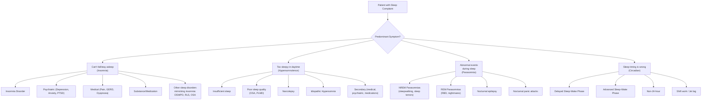

## Differential Diagnosis of Sleep Disorders

### The Conceptual Approach

Before diving into individual differentials, let's think about this from first principles. A patient presenting with a sleep complaint essentially falls into one (or more) of **four cardinal symptom clusters**:

1. **"I can't fall asleep / stay asleep"** → Insomnia complaint
2. **"I'm too sleepy during the day"** → Hypersomnolence / excessive daytime sleepiness (EDS) complaint
3. **"Something weird happens when I sleep"** → Parasomnia / abnormal nocturnal behaviour complaint
4. **"My sleep timing is wrong"** → Circadian rhythm complaint

The differential diagnosis differs for each cluster, though considerable overlap exists (e.g., OSA causes both insomnia from fragmentation AND daytime sleepiness). The key clinical skill is to **systematically distinguish primary sleep disorders from sleep disturbance secondary to psychiatric, medical, or substance-related conditions** — while remembering the modern concept that these frequently coexist as ***"comorbid"*** rather than strictly "primary vs secondary" [2].

---

### Differential Diagnosis of Insomnia

This is the most common presentation, so the differential is extensive. The table below is adapted from DSM-5 and ICSD-3 differential listings [2].

| Differential | Salient Differentiating Features | Why It Matters / First Principles Explanation |
|---|---|---|
| ***Normal sleep variations (short sleepers)*** | ***Some individuals require little sleep and do not feel difficulty falling/staying asleep or daytime sleepiness. May mimic insomnia if they try to stay in bed for a longer time. Inadequate opportunity of sleep due to e.g., shift work, other disturbances.*** [2] | The key distinction is **absence of daytime impairment**. A true short sleeper (genetic — e.g., *DEC2* gene mutation) sleeps 4–6 hours and functions perfectly. They only present when they (or a partner) believe they "should" sleep more. Spending excessive time in bed trying to force more sleep actually fragments it (paradoxically worsening sleep quality). |
| ***Situational (adjustment) insomnia*** | ***Lasts days to weeks and is associated with life events or changes in sleep schedules. Classified under other specified insomnia disorder under DSM-5 if < 3 months but otherwise meets criteria.*** [2] | This is the acute insomnia that everyone experiences — exam stress, bereavement, jet lag. The distinction from chronic insomnia disorder is **duration < 3 months** and **clear temporal relationship to a stressor**. Most cases self-resolve. The concern is when perpetuating factors (3P model) develop and it transitions to chronic insomnia. |
| ***Delayed sleep-wake phase disorder (DSWPD)*** | ***Classified under delayed sleep phase type of circadian rhythm sleep-wake disorder. Usually report sleep-onset insomnia when trying to sleep at socially normal times, but do not complain of insomnia when following endogenous circadian rhythm.*** [2] | This is a crucial mimic of insomnia. The patient says "I can't fall asleep until 3 AM" — sounds like initial insomnia. But if you let them sleep 3 AM–11 AM, their sleep quality and quantity are completely normal. The problem is **timing, not the sleep itself**. The circadian clock is set late (SCN intrinsic period too long, or insufficient morning light exposure / excessive evening light). Distinguish by sleep diary + actigraphy showing a consistent late sleep phase. |
| ***Restless leg syndrome (RLS)*** | ***Often produces difficulties initiating and maintaining sleep. Should have urge to move legs, unpleasant leg sensation when sitting/lying down. Partner may report history of restless sleep or limb movements/muscle twitches during sleep.*** [2] | RLS causes sleep-onset insomnia because the patient cannot keep their legs still when trying to relax in bed → uncomfortable sensory symptoms → forced to move → can't fall asleep. The pathophysiology is dopaminergic — symptoms are worst in the evening when dopamine is lowest. Always check **ferritin** (iron deficiency exacerbates RLS as iron is a cofactor for tyrosine hydroxylase in dopamine synthesis). |
| ***Breathing-related sleep disorders (OSA)*** | ***Majority have history of loud snoring, breathing pauses during sleep. May report interrupted sleep (frequent arousal due to apnoea) and daytime sleepiness.*** [2] | OSA can present as insomnia (especially "maintenance insomnia" from repeated arousals). The patient may not be aware of the apnoeas — it's the **bed partner** who describes snoring and witnessed apnoeas. Morning headache (from CO₂ retention and desaturation), dry mouth, and nocturia are clues. OSA also worsens RBD and NREM parasomnias by causing arousals from deep sleep. |
| ***Narcolepsy*** | ***Predominantly presents with excessive daytime sleepiness, but may also have cataplexy (intense emotions precipitate drop attack), sleep paralysis, sleep-related hallucinations.*** [2] | Narcolepsy patients often have **fragmented nocturnal sleep** (from flip-flop switch instability) and may complain of "insomnia." However, the **predominant complaint is EDS**, and the characteristic tetrad (EDS, cataplexy, sleep paralysis, hypnagogic hallucinations) distinguishes it. Important: not all features need to be present (type 2 lacks cataplexy). |
| ***Parasomnias*** | ***Characterised by unusual behaviour/events during sleep. May lead to intermittent wakening and difficulty resuming sleep.*** [2] | Parasomnias cause sleep disruption but the primary complaint is usually the abnormal behaviour (or its consequences — injury, bed partner disturbance) rather than difficulty initiating sleep. The insomnia is secondary to the arousals. |

#### Psychiatric Differentials of Insomnia

This is where you must be especially careful, because insomnia is both a **symptom** and a **comorbid condition** in psychiatric disorders. The modern approach says: ***diagnose insomnia as comorbid with the psychiatric disorder rather than dismissing it as "secondary"*** [2].

| Psychiatric Condition | Sleep Pattern | Why This Pattern Occurs |
|---|---|---|
| **Major Depressive Disorder** | ***Most classically early morning awakening*** [4]. Also middle insomnia, initial insomnia (less common). Some atypical features include **hypersomnia**. | Terminal insomnia in depression is thought to relate to HPA axis dysregulation — cortisol rises too early (advanced cortisol nadir), and REM pressure shifts earlier in the night. SWS is reduced. The depressed brain is in a state of hyperarousal (contrary to the subjective experience of low energy). |
| **Generalised Anxiety Disorder (GAD)** | ***Usually difficulty falling asleep with persistent worrying thoughts, intermittent unrefreshing sleep with unpleasant dreams/night terrors*** [5]. ***Early morning awakening is NOT a feature of GAD and strongly suggests depressive disorders*** [5]. | Anxiety causes cognitive hyperarousal at bedtime — the "racing mind." The sympathetic nervous system is activated, opposing the VLPO's sleep-promoting activity. The key differentiator from depression: GAD causes **initial and middle insomnia** (can't switch off the worrying), NOT terminal insomnia. |
| **PTSD** | Initial insomnia (hyperarousal, fear of sleep/nightmares), middle insomnia (nightmares cause awakenings), nightmares (re-experiencing) | The traumatised brain maintains a persistent state of threat detection (amygdala hyperactivation, impaired prefrontal regulation). Sleep is perceived as a vulnerable state → resistance to falling asleep. Nightmares are a core re-experiencing symptom. |
| **Bipolar Affective Disorder** | **Mania/hypomania**: ***↓ need for sleep*** (distinct from insomnia — patient feels refreshed after little sleep). **Depressive phase**: insomnia or hypersomnia. | In mania, the reduced sleep need is driven by dopaminergic and noradrenergic overactivity — the wake-promoting system is overactive. The patient doesn't *want* to sleep and doesn't *feel tired* — this is fundamentally different from insomnia where the patient wants to sleep but cannot. |
| **Schizophrenia** | Severely disrupted sleep architecture — delayed sleep phase, fragmented sleep, reversed sleep–wake cycle | Dopaminergic dysregulation, social withdrawal (reduced zeitgeber exposure), medication effects, and circadian rhythm disruption from disorganised behaviour. |
| **Substance use disorders** | Varies by substance (see below) | Direct pharmacological effects on sleep architecture. |

<Callout title="Exam Trap: Decreased Need for Sleep vs Insomnia" type="error">

***Decreased need for sleep (mania)*** is fundamentally different from ***insomnia***:
- **Mania**: Patient sleeps 2–3 hours and wakes feeling energised, refreshed, and ready to go. They do not complain about poor sleep — they don't feel they need it.
- **Insomnia**: Patient wants to sleep, tries to sleep, cannot sleep, and suffers daytime impairment as a result.

If a patient reports sleeping 3 hours and feels great with increased energy and grandiosity, think **mania**, not insomnia. This distinction is frequently tested.
</Callout>

#### Medical Differentials of Insomnia

| Medical Condition | Mechanism of Sleep Disruption |
|---|---|
| **Chronic pain** (arthritis, neuropathy, malignancy) | Pain → cortical arousal → inability to maintain sleep. Pain perception is actually heightened at night due to loss of descending inhibitory modulation. |
| **GERD** | Supine position → ↑ reflux → oesophageal irritation → arousals. Also, oesophageal acid exposure can cause microarousals without conscious awareness. |
| **Heart failure** | Paroxysmal nocturnal dyspnoea (PND) → awakening with SOB. Orthopnoea. Cheyne-Stokes respiration (central sleep apnoea). Fluid redistribution when supine → upper airway oedema → OSA. |
| **COPD / Asthma** | Nocturnal bronchoconstriction (cortisol nadir at ~4 AM → peak airway inflammation) → dyspnoea → arousal. Medications (theophylline, β-agonists) are stimulatory. |
| **Hyperthyroidism** | ↑ metabolic rate → ↑ sympathetic activation → hyperarousal → difficulty sleeping. Also causes anxiety, tremor, palpitations that contribute. |
| **Menopause** | Hot flushes → sudden autonomic arousal → awakening. Oestrogen decline also affects serotonergic and GABAergic regulation of sleep. |
| **Nocturia** (BPH, DM, HF) | Repeated awakening to urinate → fragmented sleep. Must distinguish from nocturia *secondary to* arousals from another cause (patient wakes from OSA → notices bladder → attributes awakening to nocturia). |
| **Neurological** (Parkinson's, dementia, epilepsy) | PD: RBD, PLMD, dyskinesias. Dementia: "sundowning" (reversed sleep–wake). Epilepsy: nocturnal seizures mimicking parasomnias. |

#### Substance/Medication Differentials

| Substance | Effect on Sleep |
|---|---|
| **Caffeine** | Adenosine receptor antagonist → blocks Process S → insomnia. Half-life ~5–6 hours. A cup at 4 PM still has 50% caffeine at 10 PM. |
| **Alcohol** | Initial sedation (enhances GABA) → BUT second-half rebound arousal as alcohol is metabolised → fragmented sleep, ↓ REM, ↑ SWS early then ↓ later. Chronic use → tolerance → withdrawal insomnia. |
| **Nicotine** | Stimulant at low doses (nicotinic ACh receptor agonist) → arousal. Withdrawal during sleep → nocturnal arousal in dependent smokers. |
| **Stimulants** (amphetamines, cocaine, methylphenidate) | ↑ DA, NA release → potent wake-promoting → severe insomnia |
| **SSRIs/SNRIs** | ↑ serotonin → can cause insomnia, vivid dreams, ↓ REM, periodic limb movements. SSRIs also cause/exacerbate RBD. |
| **Corticosteroids** | ↑ cortisol → HPA axis activation → hyperarousal → insomnia |
| **β-blockers** | Suppress melatonin secretion (via β₁-receptor blockade of pineal gland) → insomnia, nightmares |
| **Benzodiazepine withdrawal** | Rebound insomnia — GABA receptor downregulation → hyperexcitability → severe insomnia, anxiety, potential seizures |

---

### Differential Diagnosis of Excessive Daytime Sleepiness (EDS)

***Causes of excessive daytime sleepiness:*** [2]

| Category | Conditions | Key Distinguishing Features |
|---|---|---|
| ***Insufficient sleep*** | Behavioural (most common cause globally) | History of voluntarily restricting sleep. Resolves when adequate sleep is obtained. Very common in Hong Kong's work-hard culture. |
| ***Poor sleep quality*** | ***OSA, periodic limb movement disorder (PLMD)*** | OSA: snoring, witnessed apnoeas, obesity. PLMD: bed partner reports limb jerks (patient often unaware). Both cause fragmented sleep → EDS. |
| ***Narcolepsy*** | Type 1 and Type 2 | Cataplexy pathognomonic for type 1. MSLT: mean latency < 5 min + ≥2 SOREMPs. Naps are refreshing (unlike idiopathic hypersomnia). |
| ***Idiopathic hypersomnia*** | — | Naps are **un**refreshing and prolonged. Severe sleep inertia ("sleep drunkenness"). MSLT: mean latency < 8 min but < 2 SOREMPs. |
| ***Secondary to medical conditions*** | ***Hypothyroidism, Prader-Willi syndrome*** | Check TFTs. Prader-Willi: obesity, hyperphagia, intellectual disability. |
| ***Secondary to psychiatric disorders*** | ***Depression*** | EDS can be a feature of atypical depression (hypersomnia, hyperphagia, leaden paralysis, rejection sensitivity). Also seen in bipolar depressive episodes. |
| ***Secondary to medications*** | ***Antihistamines, gabapentinoids, anticonvulsants, benzodiazepines*** | Temporal correlation with medication initiation. Antihistamines cause drowsiness by blocking H₁ receptors in the TMN (wake-promoting centre). |

<Callout title="Sleepiness vs Fatigue: A Critical Distinction" type="idea">

***Sleepiness is the propensity to fall asleep — it differs from fatigue/tiredness:*** [2]
- **Sleepiness** is worst during **inactivity** and improves with stimulation. Ask: "Do you actually *fall asleep* or *nearly fall asleep* during the day?"
- **Fatigue** is worst during **exertion** and not relieved by sleep. Ask: "Do you feel *exhausted* and *lacking energy* but couldn't actually fall asleep if you tried?"

Sleepiness → think sleep disorders (OSA, narcolepsy, insufficient sleep).
Fatigue → think medical conditions (anaemia, hypothyroidism, HF) or psychiatric (depression).

Some conditions cause both (e.g., depression, OSA), but asking the patient to distinguish helps narrow the differential.
</Callout>

---

### Differential Diagnosis of Parasomnias and Abnormal Nocturnal Behaviours

This is where the distinction between NREM and REM parasomnias, nocturnal epilepsy, and psychiatric conditions becomes critical.

| Differential | Key Differentiating Features | First Principles |
|---|---|---|
| **NREM parasomnias** (sleepwalking, sleep terrors, confusional arousals) | First half of night, eyes open, no recall, onset in childhood, usually resolves by adolescence. Precipitated by sleep deprivation, fever, stress, OSA, PLMD. | Arise from incomplete arousal from SWS — motor cortex active but hippocampus/prefrontal cortex still in deep sleep. |
| **REM sleep behaviour disorder (RBD)** | ***Latter half of night, eyes closed, dream recall present, older adults (usually male, M:F = 9:1), can be precipitated by OSA*** [2]. ***Loss of REM sleep atonia → dream enactment.*** Short episodes ( < 60s). | Degeneration or dysfunction of pontine REM-atonia generators (sublaterodorsal nucleus) → failure to inhibit spinal motor neurons during REM. |
| **Nightmare disorder** | Latter half of night (REM), patient wakes fully and is rapidly alert, vivid recall of frightening dream content, no motor enactment (atonia preserved). | Normal REM atonia is intact — patient is paralysed and experiences the dream passively. The distress comes from the content, not the behaviour. |
| **Nocturnal (sleep-related) epilepsy** | Can occur at any time of night, stereotyped movements (identical from episode to episode), may have tongue biting / incontinence, post-ictal confusion, EEG abnormalities. | Epileptic discharges during sleep. Frontal lobe epilepsy is particularly difficult to distinguish from NREM parasomnias — both cause complex motor behaviours from sleep. Key: epileptic events are **stereotyped** (same movement every time), while parasomnias are **variable**. |
| **Nocturnal panic attacks** | Occur from NREM sleep (usually N2/N3), patient wakes with intense fear + autonomic symptoms (palpitations, sweating, SOB), fully alert within minutes, recalls the event but NOT dream content. | Panic attacks can arise from sleep — not triggered by dreams (unlike nightmares). The autonomic surge during NREM arouses the patient into a full panic. Distinguished from sleep terrors by **full alertness and recall**. |
| **Sleep-related eating disorder** | Episodes of involuntary eating during partial arousals from NREM sleep. Often bizarre food choices (raw meat, inedible items). Partial or no recall. | A variant of NREM disorder of arousal. Distinguished from nocturnal eating syndrome (NES) where patient is fully conscious during eating. |
| **Nocturnal dissociative episodes** | Complex behaviours arising from wakefulness during the night (PSG shows wake EEG during episodes). Often in context of childhood trauma. | Not a true parasomnia — patient is electrophysiologically awake. Distinguished by video-PSG showing wake pattern during the episode. |

<Callout title="How to Distinguish Nocturnal Frontal Lobe Epilepsy from NREM Parasomnias">

Both cause complex motor behaviours from sleep, but:

| Feature | NREM Parasomnia | Nocturnal Frontal Lobe Epilepsy |
|---|---|---|
| **Stereotypy** | Variable from episode to episode | Highly stereotyped (identical each time) |
| **Duration** | Usually longer (minutes) | Usually shorter (seconds to 1–2 minutes) |
| **Frequency** | Infrequent (weekly to monthly) | Can occur multiple times per night |
| **Age of onset** | Childhood (usually resolves) | Any age (persists) |
| **Family history** | Common for parasomnias | Less common; may have FHx of epilepsy |
| **EEG** | Normal | May show epileptiform discharges (but often normal inter-ictally in frontal epilepsy) |

If in doubt → **video-PSG** is the gold standard investigation.
</Callout>

---

### Differential Diagnosis of Circadian Rhythm Complaints

| Differential | How to Distinguish |
|---|---|
| **DSWPD vs Insomnia** | DSWPD: normal sleep quality/quantity when allowed to follow own schedule. Insomnia: sleep is disturbed regardless of timing. Confirm with sleep diary + actigraphy showing consistent delayed sleep phase. |
| **ASWPD vs Depression** | Both cause early morning awakening. ASWPD: patient also has excessive evening sleepiness and wants to go to bed early. Depression: no desire to go to bed early, wakes with low mood, ruminative thoughts. Check for other depressive features (anhedonia, worthlessness, suicidal ideation). |
| **Shift work disorder vs Insomnia** | Clear temporal relationship to shift schedule. Worker sleeps well on days off. Resolved or improved when shifted to day work. |
| **Non-24-hour sleep–wake disorder vs Irregular sleep** | Non-24h: progressive daily delay of sleep–wake times, eventually cycling through the 24-hour day. Most common in blind individuals (no light entrainment). Sighted individuals: extremely rare, consider psychiatric comorbidity. |

---

### A Systematic Approach to Sleep Disorder Differentials

When facing a patient with a sleep complaint, use this structured thinking:

**Step 1: What is the predominant complaint?**
- Insomnia? Hypersomnolence? Abnormal behaviour? Timing?

**Step 2: Rule out insufficient sleep and poor sleep hygiene**
- The most common cause of EDS globally is simply not sleeping enough
- Ask about sleep opportunity, caffeine, screen time, irregular schedule

**Step 3: Screen for psychiatric comorbidity**
- Depression (terminal insomnia, anhedonia, low mood)
- Anxiety (initial insomnia, racing thoughts)
- PTSD (nightmares, hyperarousal)
- Mania (decreased need for sleep — patient feels fine)

**Step 4: Screen for medical comorbidity**
- Pain, GERD, respiratory disease, thyroid disease, menopause
- Review medication list (SSRIs, steroids, β-blockers, stimulants)
- Substance use (caffeine, alcohol, nicotine, recreational drugs)

**Step 5: Consider specific sleep disorders**
- OSA (snoring, witnessed apnoeas, obesity, morning headache)
- RLS (urge to move legs, worse at rest and evening)
- Narcolepsy (EDS + cataplexy/sleep paralysis/hallucinations)
- CSWRD (timing complaint, normal sleep when on own schedule)
- Parasomnias (abnormal behaviours — characterise timing, recall, stereotypy)

**Step 6: Use appropriate investigations**
- Sleep diary (2 weeks) for all
- Actigraphy for CSWRD
- PSG for suspected OSA, RBD, PLMD, epilepsy — NOT for routine insomnia
- MSLT for suspected narcolepsy/idiopathic hypersomnia
- DLMO for circadian phase confirmation

> ***The insomnia is not better explained by and does not occur exclusively during the course of another sleep-wake disorder (e.g., narcolepsy, a breathing-related sleep disorder, a circadian rhythm sleep-wake disorder, a parasomnia). The insomnia is not attributable to the physiological effects of a substance. Coexisting mental disorders and medical conditions do not adequately explain the predominant complaint of insomnia.*** — DSM-5 Criteria S, T, U [2]

This is important: the DSM-5 insomnia criteria explicitly require you to **rule out** (or at least consider) all of the above differentials. But remember — you can diagnose insomnia disorder **comorbidly** with these conditions if the insomnia is a prominent independent complaint that warrants treatment in its own right.

---

<Callout title="High Yield Summary — Differential Diagnosis of Sleep Disorders">

1. **Insomnia DDx**: Normal short sleepers (no impairment), situational insomnia ( < 3 months), DSWPD (normal sleep on own schedule), RLS (urge to move legs), OSA (snoring, apnoeas), narcolepsy (EDS dominant), depression (terminal insomnia), anxiety (initial insomnia), substance/medication effects.

2. **EDS DDx**: Insufficient sleep (most common), OSA, narcolepsy (refreshing naps, cataplexy), idiopathic hypersomnia (unrefreshing naps, sleep drunkenness), depression (fatigue > sleepiness), medications (antihistamines, BZDs).

3. **Parasomnia DDx**: NREM (first half, eyes open, no recall, children) vs REM (second half, eyes closed, dream recall, older males) vs nocturnal epilepsy (stereotyped, any time) vs nocturnal panic (NREM, fully alert, no dream content).

4. **Key distinguishing concepts**: Decreased need for sleep (mania) ≠ insomnia; sleepiness ≠ fatigue; DSWPD ≠ insomnia; ASWPD ≠ depression.

5. **Comorbid approach**: Insomnia can be diagnosed alongside psychiatric/medical conditions — causality is bidirectional.
</Callout>

---

<ActiveRecallQuiz
  title="Active Recall - Differential Diagnosis of Sleep Disorders"
  items={[
    {
      question: "A 20-year-old student complains of difficulty falling asleep before 3 AM. She sleeps well on weekends (3 AM-11 AM) but is exhausted on school days. What is the most likely diagnosis and how does it differ from insomnia disorder?",
      markscheme: "Delayed sleep-wake phase disorder (DSWPD). Key difference: sleep quality and quantity are NORMAL when following endogenous circadian rhythm. In insomnia disorder, sleep is disturbed regardless of timing. Confirm with 2-week sleep diary plus actigraphy showing consistent delayed phase. DLMO would show delayed melatonin onset."
    },
    {
      question: "A 35-year-old man presents with insomnia. His wife reports loud snoring and witnessed apnoeas. He has a BMI of 32, morning headaches, and a collar size of 18 inches. What is the most likely underlying cause and why does it cause both insomnia AND daytime sleepiness?",
      markscheme: "Obstructive sleep apnoea. Causes insomnia through repeated arousals from apnoeic episodes (sleep fragmentation). Causes EDS because fragmented sleep fails to dissipate Process S (homeostatic sleep drive). Morning headache from nocturnal desaturation and CO2 retention causing cerebral vasodilation. Investigate with polysomnography."
    },
    {
      question: "How do you distinguish decreased need for sleep in mania from insomnia disorder?",
      markscheme: "In mania, patient sleeps very little (e.g., 2-3 hours) but feels refreshed, energised, and does not complain about sleep. Associated features: grandiosity, pressured speech, increased energy, disinhibition. In insomnia, patient WANTS to sleep but cannot, resulting in daytime impairment, fatigue, and distress. Always screen for other manic features when a patient reports very short sleep without complaint."
    },
    {
      question: "A 72-year-old man is brought by his wife because he has been punching and kicking during sleep, injuring her. He recalls vivid violent dreams. What is the most likely diagnosis, what investigation confirms it, and what must you screen for?",
      markscheme: "REM sleep behaviour disorder. Confirmed by video polysomnography showing REM without atonia plus dream enactment behaviour. Must screen for synucleinopathies (Parkinson disease, dementia with Lewy bodies, multiple system atrophy) as idiopathic RBD has 80-90% conversion rate over 10-15 years. Also consider serotonergic antidepressants and narcolepsy as causes."
    },
    {
      question: "Name three features that distinguish nocturnal frontal lobe epilepsy from NREM parasomnias.",
      markscheme: "1. Stereotypy: epileptic events are highly stereotyped (identical each time) vs parasomnias are variable. 2. Frequency: epilepsy can occur multiple times per night vs parasomnias are infrequent. 3. Duration: epileptic events are usually shorter (seconds to 1-2 minutes) vs parasomnias are usually longer (minutes). Also: epilepsy can persist at any age vs NREM parasomnias usually resolve by adolescence."
    }
  ]}
/>

## References

[1] Lecture slides: GC 165. I can't fall asleep Sleep physiology and Sleep disorders.pdf
[2] Senior notes: ryanho-psych.md (Chapter 9.2 Sleep Disorders)
[4] Senior notes: ryanho-psych.md (Chapter 7.1 Approach to Low Mood — sleep disturbance in depression)
[5] Lecture slides: GC 167. I feel very nervous Anxiety disorders.pdf (GAD sleep features)
