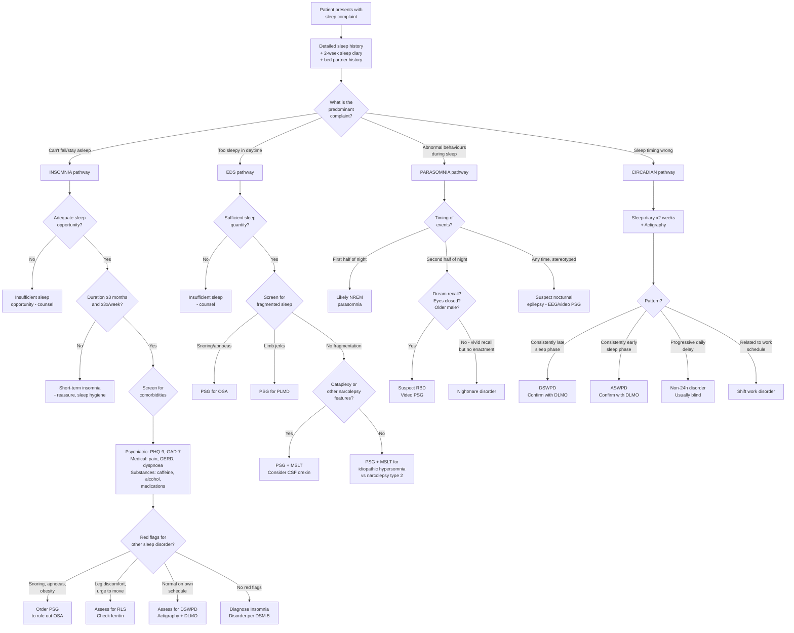

## Diagnostic Criteria, Algorithm, and Investigations for Sleep Disorders

### Guiding Principle

The diagnosis of sleep disorders follows a logical hierarchy:

1. **Clinical history and sleep diary** — this is the foundation. Most sleep disorders (especially insomnia) are **clinical diagnoses** based on history alone.
2. **Validated screening tools** — quantify severity and guide further workup.
3. **Special investigations** — reserved for specific indications (e.g., PSG for suspected OSA, MSLT for narcolepsy). They are **not** routine for every sleep complaint.

The key concept is: ***polysomnography is only indicated when you suspect another sleep disorder, e.g., OSA*** [2]. You do NOT order a sleep study for straightforward insomnia — that is diagnosed clinically.

---

### 1. Diagnostic Criteria by Condition

#### 1.1 Insomnia Disorder — DSM-5 Criteria

This is the most commonly tested set of criteria. Walk through each criterion to understand **why** it exists [2]:

| Criterion | DSM-5 Text | Rationale / First Principles |
|-----------|-----------|------------------------------|
| **A** | ***A predominant complaint of dissatisfaction with sleep quantity or quality, associated with one or more of: (1) Difficulty initiating sleep; (2) Difficulty maintaining sleep, characterised by frequent awakenings or problems returning to sleep after awakenings (in children, may manifest as difficulty returning to sleep without caregiver intervention); (3) Early-morning awakening with inability to return to sleep*** | These three patterns map to initial, middle, and terminal insomnia respectively. At least one must be present. Each has different differential implications (initial → anxiety/RLS/DSWPD; terminal → depression/ASWPD). |
| **B** | ***The sleep disturbance causes clinically significant distress or impairment in social, occupational, educational, academic, behavioural, or other important areas of functioning*** | This separates pathological insomnia from normal short sleepers. Without daytime impairment, there is no disorder — the patient may simply have a lower sleep need. |
| **C** | ***The sleep difficulty occurs ≥3 nights per week*** | Frequency threshold — occasional poor nights are normal. ≥3/week establishes a pattern. |
| **D** | ***The sleep difficulty is present for ≥3 months*** | Duration threshold — separates chronic insomnia disorder from short-term/adjustment insomnia ( < 3 months). This criterion increased specificity when DSM-5 replaced DSM-IV's 1-month threshold, reducing prevalence from 22.1% to 10.8%. |
| **E** | ***The sleep difficulty occurs despite adequate opportunity for sleep*** | Critical exclusion — if someone works 80-hour weeks and sleeps 4 hours, that's insufficient sleep opportunity, not insomnia. The sleep environment and schedule must be permissive of sleep. |
| **F** | ***The insomnia is not better explained by and does not occur exclusively during the course of another sleep-wake disorder (e.g., narcolepsy, a breathing-related sleep disorder, a circadian rhythm sleep-wake disorder, a parasomnia)*** | Requires consideration of primary sleep disorder mimics — especially DSWPD (normal sleep on own schedule), OSA (fragmentation from apnoeas), and RLS (can't keep legs still). |
| **G** | ***The insomnia is not attributable to the physiological effects of a substance (e.g., a drug of abuse, a medication)*** | Rule out substance-induced sleep disorder — caffeine, alcohol, stimulants, SSRIs, steroids, etc. |
| **H** | ***Coexisting mental disorders and medical conditions do not adequately explain the predominant complaint of insomnia*** | Modern "comorbid" approach — you CAN diagnose insomnia disorder alongside depression/anxiety, but only if the insomnia is prominent enough to warrant independent clinical attention. If insomnia is a minor symptom fully explained by severe depression, it doesn't need a separate diagnosis. |

***Specify course:*** [2]
- ***Episodic: ≥1 month, < 3 months***
- ***Persistent: ≥3 months***
- ***Recurrent: ≥2 episodes per year***

***Remember the number "3": ≥30 min delay/awake/early awakening, for ≥3×/week, for ≥3 months*** [2]

<Callout title="ICD-10 Non-Organic Insomnia (F51.0) — Key Differences">

The ICD-10 criteria are broadly similar but require:
- The complaint occurs at least 3 nights per week for at least 1 month (shorter than DSM-5's 3 months)
- The sleep disturbance is the predominant complaint
- Preoccupation with not sleeping and excessive concern about consequences
- No organic cause (unlike DSM-5's comorbid approach, ICD-10 retains the organic/non-organic split)
- Must cause marked distress or interference with functioning

For HKU exams, know DSM-5 criteria primarily, but be aware the ICD-10 threshold is 1 month (not 3).
</Callout>

#### 1.2 Narcolepsy — Diagnostic Criteria (ICSD-3 / DSM-5)

**Narcolepsy Type 1 (with cataplexy / orexin deficiency):**
- Excessive daytime sleepiness for ≥3 months, PLUS
- One or both of:
  - ***Cataplexy*** (definite episodes) PLUS ***MSLT showing mean sleep latency ≤8 min AND ≥2 SOREMPs*** (a SOREMP on preceding nocturnal PSG counts as one)
  - ***CSF hypocretin-1 (orexin-A) level ≤110 pg/mL*** (or < 1/3 of normal mean values)

**Narcolepsy Type 2 (without cataplexy):**
- Excessive daytime sleepiness for ≥3 months
- ***MSLT showing mean sleep latency ≤8 min AND ≥2 SOREMPs***
- No cataplexy
- CSF orexin-A levels either normal or not measured
- Not better explained by another disorder

<Callout title="Why ≥2 SOREMPs?" type="idea">
A sleep-onset REM period (SOREMP) is entering REM within 15 minutes of falling asleep. Normally, you go through N1 → N2 → N3 before reaching REM (~60–90 min). SOREMPs occur because in narcolepsy, the destabilised flip-flop switch allows direct transitions from wakefulness into REM. Finding ≥2 SOREMPs across 4–5 nap opportunities is abnormal and suggests pathological REM intrusion. One SOREMP can occur normally (especially after sleep deprivation), hence the threshold of ≥2 for specificity.
</Callout>

#### 1.3 Obstructive Sleep Apnoea — Diagnostic Criteria

Diagnosed by polysomnography (PSG):
- ***Apnoea-Hypopnoea Index (AHI) ≥5 events/hour*** with symptoms (EDS, snoring, witnessed apnoeas, gasping), OR
- ***AHI ≥15 events/hour*** regardless of symptoms

Severity classification:
| Severity | AHI |
|----------|-----|
| Mild | 5–14 events/hour |
| Moderate | 15–29 events/hour |
| Severe | ≥30 events/hour |

Where:
- **Apnoea** = complete cessation of airflow for ≥10 seconds
- **Hypopnoea** = ≥30% reduction in airflow for ≥10 seconds with ≥3% oxygen desaturation or arousal

#### 1.4 Restless Leg Syndrome — IRLSSG Diagnostic Criteria

All five essential criteria must be met:
1. **Urge to move the legs**, usually accompanied by uncomfortable sensations
2. **Begins or worsens during rest or inactivity** (sitting, lying down)
3. **Partially or totally relieved by movement** (walking, stretching)
4. **Occurs or worsens in the evening or night** (vs daytime)
5. **Not solely accounted for by another condition** (leg cramps, positional discomfort, habitual foot tapping)

Why these criteria work from first principles: The dopaminergic A11 pathway is the key — dopamine has a circadian nadir in the evening (criterion 4), rest removes competing sensory input allowing the abnormal sensations to dominate (criterion 2), and movement activates alternative motor/sensory circuits that override the dysfunction (criterion 3).

#### 1.5 REM Sleep Behaviour Disorder — ICSD-3 Criteria

- ***Repeated episodes of sleep-related vocalisation and/or complex motor behaviours***
- ***Documented by PSG to occur during REM sleep, OR based on clinical history of dream enactment, presumed to occur during REM sleep***
- ***PSG demonstrates REM sleep without atonia (RSWA)*** [2]
- ***Behaviours cause clinically significant distress or impairment (including injury to self or bed partner)***
- ***Not better explained by another disorder or substance***

***Diagnosis: History + video polysomnography*** [2] — video PSG is essential because it simultaneously shows:
1. The EEG is in REM
2. The EMG shows loss of normal atonia (persistent muscle tone during REM = RSWA)
3. The video captures the dream enactment behaviour

#### 1.6 Circadian Rhythm Sleep-Wake Disorders — General Criteria

All circadian rhythm disorders share a common diagnostic structure:
1. **Persistent or recurrent pattern** of sleep disruption due to alteration of the circadian system or misalignment between endogenous circadian rhythm and desired/required sleep–wake schedule
2. **Sleep disruption leads to insomnia, excessive sleepiness, or both**
3. **Causes clinically significant distress or impairment**

***Workup for CSWRD:*** [2]
- ***Sleep diary ± actigraphy to document sleeping pattern***
- ***Chronotype questionnaire to determine circadian preference***
- ***Dim light melatonin onset (DLMO) protocol: periodic blood/salivary sampling every 30–60 min for melatonin level under dim light → should show ↑ level 90–120 min before habitual bedtime***

---

### 2. Diagnostic Algorithm

The following algorithm represents a systematic approach to a patient presenting with a sleep complaint. Think of it as the clinical reasoning pathway you'd use on a ward round.

---

### 3. Investigation Modalities — Detailed Guide

#### 3.1 Clinical Assessment Tools (Bedside / Outpatient)

##### 3.1.1 Sleep Diary

***Prefer sleep diary over a 2-week period*** [2]

This is the single most important "investigation" for any sleep complaint. It costs nothing and provides more diagnostic information than most laboratory tests.

**What to record each day:**

| Parameter | Why It Matters |
|-----------|---------------|
| ***Bedtime*** | Identifies irregular schedules (perpetuating factor) |
| ***Duration until sleep onset (sleep onset latency)*** | ≥30 min suggests insomnia or DSWPD |
| ***Number and duration of awakenings*** | Frequent brief awakenings → OSA/PLMD; prolonged awakenings → insomnia |
| ***Final awakening time*** | Early → depression/ASWPD; Late → DSWPD |
| ***Nap times and length*** | Excessive napping perpetuates insomnia; short refreshing naps suggest narcolepsy |
| ***Self-rated sleep quality*** | Subjective perception — poor quality despite adequate duration suggests fragmented sleep or paradoxical insomnia |
| ***Alcohol, caffeine, medication intake*** | Identifies substance-related contributions |
| ***Exercise timing*** | Late exercise is stimulatory |

A standard sleep diary format from the reference [2] includes columns for: date, bedtime, lights-off, estimated sleep onset, number of awakenings, total wake time after sleep onset, final awakening, out-of-bed time, naps, subjective quality rating.

##### 3.1.2 Screening Questionnaires

| Tool | What It Measures | Scoring / Interpretation |
|------|-----------------|-------------------------|
| ***Pittsburgh Sleep Quality Index (PSQI)*** | ***Global sleep quality over past month*** | ***7 component scores (0–3 each): subjective quality, latency, duration, efficiency, disturbances, medication use, daytime dysfunction. Total 0–21. Significant sleep disturbance = > 5 points*** [2] |
| ***Sleep Problems Questionnaire*** | Frequency of specific sleep problems | ***Significant sleep disturbance = ≥4 on any single item*** [2] |
| ***Epworth Sleepiness Scale (ESS)*** | ***Subjective daytime sleepiness*** | ***Score 0–24. Excessive sleepiness ≥10. Rates likelihood of dozing in 8 situations (0 = never to 3 = high chance)*** [2] |
| ***STOP-BANG Questionnaire*** | OSA risk screening | **S**noring, **T**ired, **O**bserved apnoeas, blood **P**ressure, **B**MI > 35, **A**ge > 50, **N**eck > 40 cm, **G**ender male. Score 0–8. High risk ≥5. |
| ***Insomnia Severity Index (ISI)*** | Insomnia severity | 7 items, 0–28. No insomnia 0–7; subthreshold 8–14; moderate 15–21; severe 22–28 |
| ***International RLS Study Group Rating Scale*** | RLS severity | 10 items, 0–40 |
| ***PHQ-9 and GAD-7*** | Depression and anxiety screening | Essential because psychiatric comorbidity is so common. PHQ-9 ≥10 suggests moderate depression; GAD-7 ≥10 suggests moderate anxiety |

##### 3.1.3 Physical Examination

***Physical examination should screen for medical comorbidities:*** [2]

| System | What to Look For | Why |
|--------|-----------------|-----|
| ***Oropharynx*** | Mallampati grade, tonsillar hypertrophy, crowding, retrognathia, macroglossia | OSA risk assessment — anatomical narrowing of upper airway |
| ***Neck*** | Circumference ( > 40 cm / 17 inches in males = high risk OSA) | Fat deposition around pharyngeal airway |
| ***Cardiovascular*** | ***HTN (especially resistant), signs of HF*** | OSA → chronic intermittent hypoxia → sympathetic overdrive → HTN. HF → Cheyne-Stokes / orthopnoea |
| ***Respiratory*** | ***COPD, asthma signs*** | Nocturnal bronchoconstriction → arousals |
| ***GI*** | ***GERD symptoms*** | Supine reflux → arousals |
| ***Neurological*** | Tremor, rigidity, bradykinesia, cognitive assessment | RBD → screen for synucleinopathies (PD, DLB) |
| ***General*** | BMI, thyroid status, signs of iron deficiency | Obesity → OSA; hypothyroidism → hypersomnia; iron deficiency → RLS |

---

#### 3.2 Objective Sleep Investigations

##### 3.2.1 Actigraphy

***Used as adjunct to sleep diary when suspecting circadian sleep-wake disorder*** [2]

- **What it is**: A wrist-worn device (resembles a watch) containing an accelerometer ± light sensor
- ***Measures activity through light and movement*** [2] — infers sleep/wake states from rest-activity patterns
- **Duration**: Worn continuously for days to weeks (typically 1–2 weeks minimum)
- **Strengths**: Non-invasive, ecological validity (measures in patient's home environment), excellent for documenting circadian patterns over time
- **Limitations**: Cannot distinguish sleep stages; less accurate for fragmented sleep; cannot diagnose OSA or parasomnias
- **Key indications**:
  - ***Circadian rhythm sleep-wake disorders*** — demonstrates consistent phase shifts
  - Insomnia — as adjunct to sleep diary to corroborate subjective reports
  - Treatment monitoring (e.g., response to chronotherapy)

##### 3.2.2 Polysomnography (PSG)

***Only indicated when you suspect another sleep disorder, e.g., OSA*** — ***NOT for routine insomnia evaluation*** [2]

**What it measures — a "multi-channel" overnight recording:**

| Channel | What It Records | Why It's Needed |
|---------|----------------|-----------------|
| **EEG** (electroencephalogram, typically 6+ channels) | Brain electrical activity | Determines sleep stage (N1/N2/N3/REM/wake), identifies arousals, detects epileptiform activity |
| **EOG** (electrooculogram) | Eye movements | Distinguishes REM (rapid conjugate eye movements) from NREM (slow rolling or absent) |
| **EMG** (electromyogram — chin + tibialis anterior) | Muscle tone | Chin EMG: REM atonia vs RSWA (for RBD). Leg EMG: periodic limb movements (PLMD) |
| **ECG** | Heart rhythm | Detects arrhythmias associated with apnoeas (bradycardia during apnoea → tachycardia on arousal) |
| **Nasal airflow** (thermistor + pressure transducer) | Breathing | Detects apnoeas (complete cessation) and hypopnoeas (partial reduction) |
| **Chest/abdominal effort** (respiratory inductance plethysmography) | Respiratory effort | Distinguishes obstructive (effort present, airflow absent) from central (effort absent, airflow absent) apnoeas |
| **Pulse oximetry** | SpO₂ | Detects desaturations associated with apnoeas — quantifies hypoxaemic burden |
| **Body position sensor** | Supine vs lateral | Positional OSA (worse supine due to gravity pulling tongue posteriorly) |
| **Snore microphone** | Snoring | Documents snoring and its relationship to respiratory events |
| **Video** (for video-PSG) | Visible behaviour | Essential for parasomnia evaluation — correlates visible behaviour with electrophysiological data |

**Key findings and interpretation by condition:**

| Condition | ***Key PSG Findings*** | Interpretation |
|-----------|----------------------|----------------|
| **OSA** | ***AHI ≥5 with obstructive apnoeas/hypopnoeas; oxygen desaturations (often cyclical "sawtooth" pattern); respiratory effort present during airflow cessation; arousal at termination of events*** | Upper airway collapse → effort continues against closed airway → desaturation → arousal to reopen → cycle repeats. The AHI quantifies severity. |
| **Central Sleep Apnoea** | AHI ≥5 with central apnoeas; absent respiratory effort during airflow cessation; may see Cheyne-Stokes pattern in HF | Brain fails to generate respiratory drive. In HF: cyclical crescendo-decrescendo breathing due to high loop gain from pulmonary congestion. |
| **RBD** | ***REM sleep without atonia (RSWA) on chin/limb EMG during REM + video showing dream enactment behaviour*** [2] | Pontine REM-atonia generators dysfunctional → persistent muscle tone during REM → motor output not suppressed → enactment. |
| **PLMD** | Periodic limb movement index ≥15/hour; stereotyped, repetitive leg movements (dorsiflexion of ankle + flexion of knee/hip) in NREM, occurring in runs | Dopaminergic dysfunction → repetitive involuntary limb movements. Each movement may cause a microarousal → fragmented sleep → EDS. |
| ***Narcolepsy*** | ***Early REM entry (≤15 min from sleep onset), spontaneous awakenings, increased light NREM sleep, fragmented sleep architecture*** [2] | Destabilised flip-flop switch → rapid transitions between wake and REM; inadequate consolidation of sleep states. |
| **NREM parasomnia** | Arousal from N3 (SWS) — EEG shows sudden shift from high-amplitude delta to mixed alpha/theta; behaviour on video (walking, screaming) | Partial cortical arousal from deep sleep — motor cortex active, hippocampus and prefrontal cortex remain in sleep. |
| **Nocturnal epilepsy** | Epileptiform discharges (spikes, sharp waves) on EEG during or between events; stereotyped movements on video | Epileptic focus generating abnormal electrical activity. May need extended EEG montage for frontal lobe foci. |

<Callout title="When to Order PSG — A Common Exam Question" type="error">

**DO order PSG for:**
- Suspected OSA (snoring + EDS + witnessed apnoeas + risk factors)
- Suspected RBD (dream enactment in older adult)
- Suspected PLMD (bed partner reports repetitive limb jerks)
- Pre-MSLT assessment for narcolepsy (must rule out OSA first and document preceding night's sleep)
- Suspected nocturnal epilepsy (when history is ambiguous)
- Treatment-resistant insomnia where another sleep disorder is suspected

**Do NOT order PSG for:**
- ***Routine insomnia evaluation*** — insomnia is a clinical diagnosis
- Circadian rhythm disorders — use actigraphy + DLMO instead
- RLS — diagnosed clinically using IRLSSG criteria
- Uncomplicated NREM parasomnias in children — diagnosed clinically
</Callout>

##### 3.2.3 Multiple Sleep Latency Test (MSLT)

***Objective measure of sleepiness*** [2]

- **Purpose**: Quantifies physiological sleepiness and detects pathological REM intrusion (SOREMPs)
- ***Process: patient asked to try to sleep for 20 min, repeated every 2 hours (Q2H), starting 2–4 hours after awakening, performed 4–5 times throughout the day*** [2]
- **Prerequisites** (critical — invalid without these):
  - Preceding night's PSG to confirm ≥6 hours of sleep (and rule out OSA causing EDS)
  - Sleep diary for ≥1 week before showing adequate habitual sleep (≥7 hours)
  - Discontinuation of REM-suppressing medications (SSRIs, SNRIs, TCAs) ≥2 weeks before (these suppress REM and reduce SOREMPs, causing false negatives)
  - No caffeine, alcohol, or recreational drugs on test day

***Interpretation:*** [2]

| Finding | Interpretation |
|---------|---------------|
| ***Mean sleep latency < 5 min*** | ***Pathological sleepiness*** — the patient is so sleepy they fall asleep within 5 minutes, indicating severe sleepiness that could impair functioning and driving safety |
| Mean sleep latency 5–8 min | Borderline / indeterminate |
| Mean sleep latency > 8 min | Normal — argues against pathological sleepiness |
| ***≥2 SOREMPs out of 4–5 naps*** | ***Narcolepsy (type 1 or 2)*** — pathological REM intrusion. A SOREMP on the preceding nocturnal PSG can count as one of the two. |
| < 2 SOREMPs with short latency | Idiopathic hypersomnia, insufficient sleep, or other cause of EDS |

***≥2 trials with positive REM sleep indicates narcolepsy*** [2]

##### 3.2.4 Maintenance of Wakefulness Test (MWT)

***Multiple trials of staying awake under sleep-inducing stimuli*** [2]

- **Purpose**: Measures the ability to **stay awake** (as opposed to MSLT which measures propensity to fall asleep)
- **Protocol**: Patient sits in a dimly lit room in a reclined chair and is asked to **resist sleep** for 40 minutes, repeated every 2 hours, 4 trials
- **Clinical use**: Primarily for occupational assessment — e.g., fitness to drive, fitness for duty in safety-critical occupations (pilots, drivers)
- **Interpretation**: Mean sleep latency < 8 min = definite inability to stay awake; > 40 min = normal wakefulness capacity

##### 3.2.5 Dim Light Melatonin Onset (DLMO)

***Gold standard for circadian phase assessment*** [2]

- ***Protocol: periodic blood/salivary sampling every 30–60 min for melatonin level under dim light conditions (< 30 lux)*** [2]
- Performed in the hours leading up to and beyond the patient's habitual bedtime
- ***Normal: melatonin levels should begin to rise 90–120 min before habitual bedtime*** [2]
- **Interpretation**:
  - DLMO occurring later than expected → **delayed circadian phase** (DSWPD)
  - DLMO occurring earlier than expected → **advanced circadian phase** (ASWPD)
  - DLMO drifting progressively later each day → **non-24-hour disorder**
- **Why dim light?** Melatonin secretion is acutely suppressed by light (especially blue/green wavelengths). Measuring under normal lighting conditions would give falsely low levels. Dim light ( < 30 lux) allows endogenous melatonin rhythm to be observed without photic suppression.

##### 3.2.6 Additional Blood Investigations

| Test | Indication | Rationale |
|------|-----------|-----------|
| **Ferritin** | RLS evaluation | ***Iron repletion if ferritin < 75 µg/L*** [2] — iron is a cofactor for tyrosine hydroxylase (rate-limiting enzyme in dopamine synthesis). Low iron → low dopamine → RLS symptoms. Note: target is 75 µg/L, NOT the standard lab "normal" cutoff of ~15–20 µg/L |
| **TFTs** | EDS evaluation | Hypothyroidism → ↓ metabolic rate → hypersomnia, fatigue |
| **HbA1c / Fasting glucose** | OSA evaluation | OSA ↔ metabolic syndrome (bidirectional relationship); screen for T2DM |
| **ABG** | Severe OSA / Obesity hypoventilation | Chronic CO₂ retention (↑ PaCO₂, ↑ HCO₃⁻) indicates alveolar hypoventilation |
| **CSF hypocretin-1 (orexin-A)** | Narcolepsy type 1 diagnosis | ***Low in narcolepsy type 1 (≤110 pg/mL or < 1/3 of normal)*** [2]. Highly specific and sensitive. Useful when MSLT is equivocal or cannot be performed. |
| **HLA-DQB1*0602** | Narcolepsy risk assessment | ***Positive in 98% of narcolepsy type 1, 50% of type 2, but also 12–40% of healthy individuals*** [2] — therefore it is **supportive but not diagnostic**. High sensitivity, low specificity. A negative result makes narcolepsy type 1 very unlikely. |

---

### 4. Putting It All Together — Investigation Strategy by Condition

| Suspected Condition | ***First-Line Investigation*** | ***Confirmatory / Additional*** |
|----|----|----|
| **Insomnia disorder** | ***Sleep history + 2-week sleep diary + screening tools (PSQI, ISI)*** [2] | PSG only if another sleep disorder suspected; psychiatric screening (PHQ-9, GAD-7) |
| **OSA** | STOP-BANG screening → PSG (or home sleep apnoea test if high pre-test probability and no comorbidities) | SpO₂ trend, ABG if severe, TFTs, HbA1c |
| **Narcolepsy** | Clinical assessment (tetrad) + ESS → PSG followed by MSLT | CSF orexin-A (if type 1 suspected), HLA-DQB1*0602 (supportive) |
| **Idiopathic hypersomnia** | Clinical assessment + ESS → PSG followed by MSLT | MSLT: mean latency < 8 min but < 2 SOREMPs |
| **RLS** | Clinical diagnosis (IRLSSG criteria) + ferritin level | PSG only if PLMD needs documentation; nerve conduction studies if neuropathy suspected |
| **RBD** | Clinical history (dream enactment, bed partner Hx) → ***video PSG*** [2] | Neurological assessment for synucleinopathies; DaTscan if PD suspected |
| **NREM parasomnias** | Clinical history (usually sufficient in children) | Video PSG if diagnosis uncertain, events are frequent/injurious, or nocturnal epilepsy needs exclusion |
| **CSWRD** | ***Sleep diary ≥2 weeks + actigraphy*** [2] | ***Chronotype questionnaire + DLMO protocol*** [2] |

---

<Callout title="High Yield Summary — Diagnosis and Investigation of Sleep Disorders">

1. **Insomnia Disorder DSM-5**: Sleep complaint (initial/middle/terminal) + distress/impairment + ≥3 nights/week + ≥3 months + adequate sleep opportunity + not explained by other sleep disorder/substance/medical condition. Remember "3-3-3": 30 min, 3x/week, 3 months.

2. **Insomnia is a CLINICAL diagnosis** — PSG is NOT indicated for routine insomnia. Only order PSG when suspecting OSA, RBD, PLMD, or treatment-resistant cases.

3. **PSG channels**: EEG (sleep stages), EOG (eye movements), EMG (atonia/RSWA/PLMS), ECG, airflow, respiratory effort, SpO2, position, video. Know which channel answers which clinical question.

4. **MSLT**: Objective sleepiness test. Mean latency < 5 min = pathological sleepiness. ≥2 SOREMPs = narcolepsy. Must have preceding PSG + adequate prior sleep + withdrawal of REM-suppressants.

5. **DLMO**: Gold standard for circadian phase. Sample melatonin under dim light ( < 30 lux) every 30–60 min. Normal rise 90–120 min before habitual bedtime. Delayed rise = DSWPD.

6. **Actigraphy**: Wrist-worn accelerometer for rest-activity cycles over weeks. Best for CSWRD and as adjunct to sleep diary. Cannot stage sleep.

7. **Key blood tests**: Ferritin < 75 µg/L → iron repletion for RLS. CSF orexin-A ≤110 pg/mL → narcolepsy type 1. HLA-DQB1*0602: supportive not diagnostic (98% type 1, but 12–40% healthy).

8. **OSA diagnosis**: AHI ≥5 + symptoms or AHI ≥15 regardless. Mild 5–14, Moderate 15–29, Severe ≥30.

9. **RBD diagnosis**: History + video PSG showing RSWA + dream enactment. Always screen for synucleinopathies.

10. **RLS diagnosis**: Purely clinical (IRLSSG 5 criteria). Check ferritin. PSG only for PLMD documentation.
</Callout>

---

<ActiveRecallQuiz
  title="Active Recall - Diagnostic Criteria, Algorithm and Investigations"
  items={[
    {
      question: "List the key DSM-5 diagnostic criteria for Insomnia Disorder. What is the '3-3-3' memory aid?",
      markscheme: "A: Dissatisfaction with sleep quality/quantity with one or more of difficulty initiating, maintaining, or early morning awakening. B: Clinically significant distress or impairment. C: At least 3 nights per week. D: Present for at least 3 months. E: Despite adequate sleep opportunity. F: Not better explained by another sleep-wake disorder. G: Not attributable to substance effects. H: Coexisting conditions do not adequately explain insomnia. 3-3-3 = 30 min delay/awake/early waking, 3 times per week, 3 months duration."
    },
    {
      question: "A patient with excessive daytime sleepiness undergoes an MSLT. Mean sleep latency is 3 minutes and 3 out of 5 nap opportunities showed SOREMPs. What is the diagnosis? What prerequisite must be met before the MSLT is valid?",
      markscheme: "Diagnosis: Narcolepsy (mean latency less than 8 min plus 2 or more SOREMPs). Prerequisites: preceding night PSG confirming at least 6 hours sleep and ruling out OSA; 1 week sleep diary showing at least 7 hours habitual sleep; discontinuation of REM-suppressing drugs (SSRIs, SNRIs, TCAs) at least 2 weeks before; no caffeine or alcohol on test day."
    },
    {
      question: "When is polysomnography indicated and when is it NOT indicated in the evaluation of sleep disorders? Give two examples of each.",
      markscheme: "Indicated: suspected OSA (snoring plus EDS plus witnessed apnoeas), suspected RBD (dream enactment in older adult), pre-MSLT for narcolepsy evaluation, suspected PLMD, treatment-resistant insomnia. NOT indicated: routine insomnia evaluation (clinical diagnosis), circadian rhythm disorders (use actigraphy plus DLMO), RLS (clinical diagnosis), uncomplicated childhood NREM parasomnias."
    },
    {
      question: "Explain the DLMO protocol. Why must it be performed under dim light? What finding confirms delayed sleep-wake phase disorder?",
      markscheme: "Protocol: periodic blood or salivary melatonin sampling every 30-60 minutes under dim light (less than 30 lux). Must be dim light because melatonin secretion is acutely suppressed by light (especially blue wavelengths) - normal lighting would give falsely low levels. Normal: melatonin rises 90-120 min before habitual bedtime. In DSWPD: melatonin onset is delayed (occurs later than expected for conventional bedtime), confirming the circadian phase is shifted late."
    },
    {
      question: "A patient is suspected of having RLS. What are the five IRLSSG diagnostic criteria, and what is the target ferritin level for iron repletion?",
      markscheme: "Five criteria: 1) Urge to move legs with uncomfortable sensations. 2) Begins or worsens during rest/inactivity. 3) Partially or totally relieved by movement. 4) Occurs or worsens in evening/night. 5) Not solely accounted for by another condition. Target ferritin: 75 micrograms per litre (not the standard lab normal of 15-20). Rationale: iron is cofactor for tyrosine hydroxylase in dopamine synthesis pathway."
    },
    {
      question: "What are the key PSG findings that distinguish obstructive from central sleep apnoea?",
      markscheme: "Obstructive: respiratory effort PRESENT (chest/abdominal movement continues) during airflow cessation - the airway is collapsed but the brain is trying to breathe. Central: respiratory effort ABSENT during airflow cessation - the brain fails to generate respiratory drive. Both show AHI of 5 or more with oxygen desaturations. Central may show Cheyne-Stokes pattern in HF (crescendo-decrescendo breathing from high loop gain)."
    }
  ]}
/>

## References

[1] Lecture slides: GC 165. I can't fall asleep Sleep physiology and Sleep disorders.pdf
[2] Senior notes: ryanho-psych.md (Chapter 9.2 Sleep Disorders)
