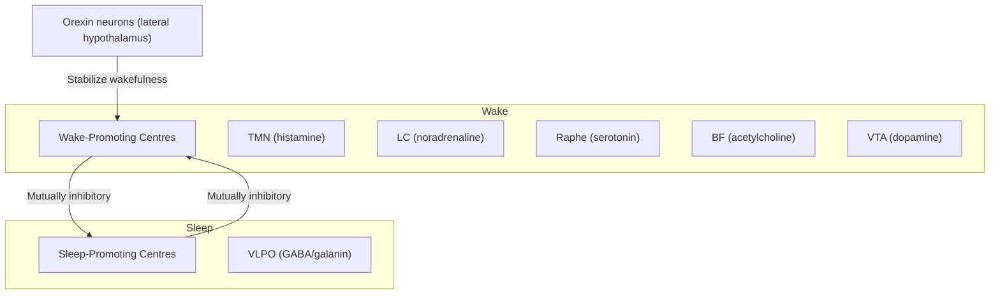
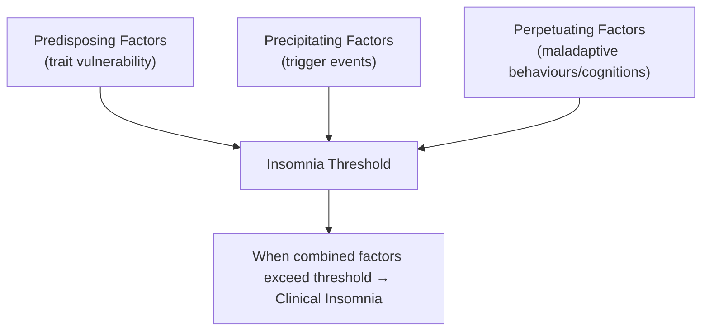

## 1. Definition

Sleep disorders (somnipathy) encompass a broad group of conditions that alter the normal pattern, quality, quantity, or timing of sleep, or that produce abnormal behaviours during sleep, leading to clinically significant distress or impairment in daytime functioning [1][2].

The term breaks down from Greek/Latin roots:
- **Somnus** (Latin) = sleep → hence "somnolence," "insomnia" (in- = not + somnus = sleep)
- **Dys-somnia** = "bad sleep" — disorders of the amount, quality, or timing of sleep
- **Para-somnia** = "alongside sleep" — abnormal events that occur during sleep

> ***Sleep-related disorders are important because they:*** [1]
> 1. ***May represent primary sleep disorders***
> 2. ***May be symptoms of psychiatric or medical disorder, especially mood disorders → secondary sleep disorder***
> 3. ***May be a cause of psychological symptoms → contribute to onset of psychiatric disorders***
> 4. ***Persistent sleep difficulties are associated with a range of adverse physical health consequences***

This is a key conceptual point: sleep disorders sit at the intersection of psychiatry, neurology, respirology, and general medicine. You must always think bidirectionally — does the psychiatric disorder cause poor sleep, or does poor sleep cause the psychiatric disorder?

---

## 2. Epidemiology

### 2.1 Insomnia
- ***Prevalence: 22.1% under DSM-IV (1-month criterion) and 10.8% under DSM-5 (3-month criterion)*** [2]
- Insomnia is the most common sleep disorder globally
- More prevalent in females (F > M, approximately 1.4:1), older adults, those with psychiatric comorbidities, and those of lower socioeconomic status
- ***Natural history: chronic insomnia is notoriously persistent — lasts ≥1 year in 74%, ≥3 years in 46% (especially in females, older adults, severe insomnia); resolves in 54% but recurs in > 50% of those recovered within 4 years*** [2]

### 2.2 Narcolepsy
- ***Type 1: prevalence 25–50/100,000, incidence 0.74/100,000, M:F ≈ 1:1, onset 15–25 years*** [2]
- ***Type 2: uncertain, estimated prevalence 20–34/100,000*** [2]

### 2.3 Obstructive Sleep Apnoea (OSA)
- Extremely common: affects ~4% of middle-aged men, ~2% of middle-aged women in Western populations
- ***Higher prevalence in Hong Kong*** due to craniofacial anatomy (shorter mandible, midface hypoplasia) even at lower BMI thresholds compared with Caucasians
- Strong association with obesity, male sex, increasing age

### 2.4 Restless Leg Syndrome (RLS)
- Prevalence approximately 5–15% in Western populations, somewhat lower in East Asian populations (~1–3%)

### 2.5 REM Sleep Behaviour Disorder (RBD)
- ***Prevalence 0.5–1%, increases with age, M > F = 9:1*** [2]
- Usually antidepressant- or narcolepsy-related in those < 40 years

### 2.6 Parasomnias (NREM)
- ***Sleepwalking: most common ages 5–12 years (affects 15% of this group), occasionally persists into adulthood*** [2]

### 2.7 Circadian Rhythm Sleep–Wake Disorders
- ***Delayed sleep–wake phase disorder (DSWPD): 3.3–4.6% of adolescents and young adults (accounts for ~80% of circadian rhythm disorders)*** [2]
- ***Advanced sleep–wake phase disorder: 0.25–7% of adults, increases in older males*** [2]

<Callout title="Hong Kong Context">
In Hong Kong's dense urban environment, noise pollution, small living spaces, shift work (common in service and healthcare industries), high academic/work stress, and heavy smartphone use before bed are significant contributors to the burden of sleep disorders, particularly insomnia and delayed sleep–wake phase disorder in adolescents.
</Callout>

---

## 3. Sleep Physiology — Anatomy and Function

To understand sleep disorders, you must first understand normal sleep. This section covers the neuroanatomy, neurochemistry, and architecture of sleep from first principles.

### 3.1 The Two-Process Model of Sleep Regulation

***Sleep is regulated by two interacting processes:*** [1][3]

#### Process S — Homeostatic Sleep Drive ("Sleep Pressure")
- ***The longer you are awake, the greater the drive to sleep*** [3]
- Molecular basis: ***adenosine accumulation*** in the basal forebrain during wakefulness. Adenosine is a by-product of neuronal ATP consumption. As neurons fire throughout the day, ATP is broken down → ADP → AMP → adenosine accumulates in the extracellular space
- Adenosine acts on A₁ receptors in the basal forebrain (ventrolateral preoptic area, VLPO) → inhibits wake-promoting centres → promotes sleepiness
- **Why does caffeine keep you awake?** Caffeine is an adenosine receptor antagonist — it blocks A₁ and A₂A receptors, preventing adenosine from exerting its sleep-promoting effect
- ***Sleep need index phosphoproteins (SNIPPs) in the brain become increasingly phosphorylated with prolonged wakefulness*** — this is a molecular marker of the homeostatic sleep drive [2]
- Process S dissipates during sleep (especially during slow-wave sleep, SWS)

#### Process C — Circadian Rhythm ("Body Clock")
- ***Governed by the suprachiasmatic nucleus (SCN) of the anterior hypothalamus*** — the master circadian pacemaker [1][3]
- The SCN has an intrinsic ~24.2-hour rhythm (slightly longer than 24 hours) → must be entrained daily
- ***Primary zeitgeber (time-giver): light*** [3]
  - Light enters the eye → melanopsin-containing intrinsically photosensitive retinal ganglion cells (ipRGCs) → retinohypothalamic tract → SCN
  - Light exposure in the morning **advances** the clock; light in the evening **delays** it
- ***The SCN signals the pineal gland to release melatonin via a multisynaptic pathway*** (SCN → paraventricular nucleus → superior cervical ganglion → pineal gland) [1][3]
  - ***Melatonin: released in darkness ("hormone of darkness"), suppressed by light*** [3]
  - Melatonin promotes sleep onset and signals nighttime to the body
  - This is why ***bright light therapy*** works for circadian rhythm disorders, and why ***blue light from screens*** delays sleep onset
- ***Core body temperature rhythm***: drops in the evening (promoting sleep onset), reaches a nadir in the early morning hours (~04:00), and rises before awakening [3]
- ***Cortisol rhythm***: peaks in the early morning (cortisol awakening response), lowest at midnight [3]

> ***The interaction of Process S and Process C determines when you feel sleepy and when you feel alert. Process S builds up during the day (increasing sleep pressure), while Process C provides an alerting signal during the day that opposes Process S. In the evening, as Process C's alerting signal wanes and Process S is high, you feel sleepy.*** [3]

<Callout title="Why do you get a 'second wind' at night?" type="idea">
In the early evening, Process C's alerting signal is near its peak (the "wake maintenance zone" or "forbidden zone for sleep," roughly 19:00–21:00). Even though Process S has accumulated significantly, the circadian alerting signal counterbalances it. Once this alerting signal declines after ~21:00–22:00, the accumulated Process S "wins" and sleepiness hits hard. This is also why shift workers find it very difficult to sleep during the day — Process C is sending a strong alerting signal.
</Callout>

### 3.2 Neuroanatomy of the Sleep–Wake Switch

***The "flip-flop" switch model (Saper, 2005):*** [3]

#### Wake-Promoting Centres (Ascending Reticular Activating System, ARAS)
These are located in the brainstem and hypothalamus:

| Centre | Neurotransmitter | Location | Role |
|--------|-----------------|----------|------|
| ***Locus coeruleus (LC)*** | ***Noradrenaline (NA)*** | Dorsal pons | Cortical arousal, attention |
| ***Raphe nuclei*** | ***Serotonin (5-HT)*** | Brainstem midline | Wakefulness, mood regulation |
| ***Tuberomammillary nucleus (TMN)*** | ***Histamine*** | Posterior hypothalamus | Cortical arousal — **this is why antihistamines cause drowsiness** |
| ***Basal forebrain (BF)*** | ***Acetylcholine (ACh)*** | Basal forebrain | Cortical activation, especially REM |
| ***Ventral tegmental area (VTA)*** | ***Dopamine*** | Midbrain | Motivation, reward-based arousal |
| ***Lateral hypothalamus*** | ***Orexin/Hypocretin*** | Lateral hypothalamus | **Stabilizes wakefulness and prevents inappropriate transitions into sleep** |

#### Sleep-Promoting Centre
- ***Ventrolateral preoptic area (VLPO)*** of the anterior hypothalamus [3]
- Uses ***GABA and galanin*** as inhibitory neurotransmitters
- Activated by rising adenosine levels (Process S) and melatonin (Process C)
- Inhibits all wake-promoting centres → "switches off" the ARAS

#### The Flip-Flop Switch
- The VLPO and wake-promoting centres are ***mutually inhibitory*** — when one is active, it suppresses the other
- This creates a bistable system (like a light switch) — you're either awake or asleep, with rapid transitions
- ***Orexin (hypocretin) neurons in the lateral hypothalamus stabilize the "wake" side of the switch*** [1][2][3]
  - This is why ***loss of orexin neurons in narcolepsy type 1 causes instability of the switch → inappropriate intrusions of sleep elements into wakefulness (cataplexy, sleep paralysis, hypnagogic hallucinations) and wakefulness elements into sleep (fragmented sleep)*** [2]

### 3.3 Sleep Architecture — Stages and Cycles

***Sleep is divided into two fundamentally different states:*** [1][3]

| Feature | ***NREM Sleep*** | ***REM Sleep*** |
|---------|-----------------|----------------|
| ***EEG*** | ***Synchronised, high-amplitude, low-frequency waves*** | ***Desynchronised, low-amplitude, high-frequency waves (resembles wakefulness — hence "paradoxical sleep")*** |
| ***Muscle tone*** | ***Maintained (reduced but present)*** | ***Atonia (generalised skeletal muscle paralysis except diaphragm and extraocular muscles)*** |
| ***Eye movements*** | ***Slow rolling (Stage 1) → absent (Stage 2, 3)*** | ***Rapid conjugate eye movements*** |
| ***Dreaming*** | ***Thought-like mental activity, less vivid*** | ***Vivid, bizarre, narrative dreams*** |
| ***Autonomic activity*** | ***↓HR, ↓BP, ↓RR — stable*** | ***Variable — ↑HR, ↑BP, penile/clitoral engorgement*** |
| ***Thermoregulation*** | ***Maintained (can still sweat or shiver)*** | ***Poikilothermic (thermoregulation suspended)*** |

#### NREM Stages (N1, N2, N3)

| Stage | ***% of Total Sleep*** | ***EEG Features*** | ***Key Features*** |
|-------|----------------------|-------------------|-------------------|
| ***N1*** | ***2–5%*** | ***Theta waves (4–7 Hz), vertex sharp waves*** | ***Lightest sleep, easily aroused, "drifting off," hypnic jerks, slow rolling eye movements*** |
| ***N2*** | ***45–55%*** | ***Sleep spindles (11–16 Hz bursts) + K-complexes*** | ***True sleep onset, memory consolidation begins, harder to arouse*** |
| ***N3 (Slow-Wave Sleep, SWS)*** | ***13–23%*** | ***Delta waves ( < 2 Hz), high-amplitude ( > 75 µV)*** | ***Deepest sleep, most restorative, hardest to arouse, GH secretion, immune function, NREM parasomnias occur here*** |

- ***Sleep spindles*** are generated by the thalamic reticular nucleus — they serve as a "gate" that blocks external sensory information from reaching the cortex (why you don't hear things during sleep)
- ***K-complexes*** are large-amplitude, biphasic waves — they represent cortical responses to external stimuli and help maintain sleep by suppressing cortical arousal
- ***Slow-wave sleep (N3) is maximal in the first third of the night*** → this is why NREM parasomnias (sleepwalking, sleep terrors) tend to occur in the **first half** of the night [2]

#### REM Sleep
- ***Constitutes ~20–25% of total sleep*** [3]
- ***"Paradoxical sleep"*** because the EEG looks like wakefulness, but the person is deeply asleep
- ***REM atonia***: pontine nuclei (sublaterodorsal nucleus/subcoeruleus) send descending inhibitory signals via the ventromedial medulla → glycinergic/GABAergic inhibition of spinal alpha motor neurons → skeletal muscle paralysis
  - ***This protective mechanism prevents dream enactment***
  - ***Failure of REM atonia → REM sleep behaviour disorder (RBD)*** — patients physically act out their dreams [2]
- ***REM sleep increases in the second half of the night*** → this is why REM-related phenomena (nightmares, RBD) tend to occur in the **latter half** of the night [2]
- ***REM sleep is associated with memory consolidation (especially procedural and emotional memory), emotional regulation, and brain development*** [3]

<Callout title="Exam Pearl: Timing of Parasomnias" type="error">

A very common exam mistake is getting the timing wrong. Here's the rule:

- ***NREM parasomnias (sleepwalking, sleep terrors, confusional arousals) → FIRST half of the night*** (when SWS predominates)
- ***REM parasomnias (nightmares, RBD) → SECOND half of the night*** (when REM predominates)

Note that in the comparison table in the senior notes [2], the timing column appears reversed — this is likely a typographical error. Trust the pathophysiology: SWS is maximal early → NREM parasomnias early; REM is maximal late → REM parasomnias late.
</Callout>

#### Sleep Cycle
- ***A typical sleep cycle = NREM (N1 → N2 → N3) → REM, lasting approximately 90–110 minutes*** [3]
- ***4–6 cycles per night in an adult***
- ***Early cycles are dominated by SWS (N3); later cycles are dominated by REM***
- ***With ageing: ↓ SWS, ↑ N1/N2, ↑ awakenings, ↓ total sleep time, more fragmented sleep*** [3]

### 3.4 Sleep Requirements Across the Lifespan

| Age Group | ***Recommended Sleep (hrs)*** |
|-----------|------------------------------|
| ***Neonates*** | ***14–17*** |
| ***Infants*** | ***12–15*** |
| ***Toddlers*** | ***11–14*** |
| ***Preschool*** | ***10–13*** |
| ***School-age*** | ***9–11*** |
| ***Teens*** | ***8–10*** |
| ***Adults*** | ***7–9*** |
| ***Older adults*** | ***7–8*** |

***Method to determine individual sleep need: sleep/wake in a free-running manner (i.e., no alarm clock, sleep as long as needed) for ≥1 week. If tired or sleepy in the daytime = not getting enough.*** [2]

### 3.5 Consequences of Sleep Deprivation

***Sleep deprivation produces widespread physiological, neuropsychiatric, and systemic effects:*** [2]

| Domain | Effect | Mechanism |
|--------|--------|-----------|
| ***Physiological*** | ***↑ evening cortisol, ↑ sympathetic nervous activity, ↑ TSH, ↓ insulin response (→ ↓ glucose tolerance)*** | HPA axis dysregulation; sympathetic overdrive from inadequate VLPO restoration |
| ***Neuropsychiatric*** | ***↑ amygdala activation → ↑ negative emotions; irritability; cognitive impairment; memory lapses; impaired moral judgement; hallucinations; symptoms similar to ADHD*** | Failure of prefrontal cortical regulation of the amygdala; impaired memory consolidation |
| ***Motor*** | ***Increased reaction time, decreased accuracy, tremors*** | Cerebellar and cortical dysfunction |
| ***Chronic effects*** | ***Associated with obesity, CVD, ↑ overall mortality ( < 5h/day during weekends associated with 52% ↑ mortality compared to 7h/day)*** | Metabolic dysregulation (leptin ↓, ghrelin ↑), chronic inflammation, sympathetic overdrive |
| ***Immune*** | ***Impaired immune function*** | ↓ NK cell activity, altered cytokine profiles |

> ***Partial sleep deprivation and short duration ( < 7h vs 7–8h) is associated with mental and physical health risk, especially cardiovascular. Long duration ( > 9h) is also associated with health risks (U-shaped curve).*** [2]

---

## 4. Aetiology (with Focus on Hong Kong Context) and Pathophysiology

### 4.1 The 3P Model of Insomnia (Spielman Model)

***This is the single most important aetiological framework for understanding insomnia:*** [1][2]

The 3Ps are: ***Predisposing, Precipitating, and Perpetuating factors.***

| Factor | Definition | Examples | Timeframe |
|--------|-----------|----------|-----------|
| ***Predisposing*** | Trait-level vulnerabilities that lower the threshold for insomnia | Anxious temperament, female sex, older age, family history, hyperarousability (elevated cortisol, ↑ metabolic rate, ↑ beta EEG activity), comorbid psychiatric/medical conditions | Always present |
| ***Precipitating*** | Acute stressors/events that trigger insomnia | Life events (bereavement, job loss, exams), acute illness, pain, medication changes, jet lag, shift work | Acute phase |
| ***Perpetuating*** | Maladaptive behaviours and cognitions that maintain insomnia after the precipitant has resolved | Spending excessive time in bed, irregular sleep–wake schedule, daytime napping, clock-watching, catastrophising about sleep, using bed for non-sleep activities, stimulant use | Chronic phase |

<Callout title="Key Insight: Why Chronic Insomnia Persists">

***As insomnia becomes chronic, perpetuating factors become the dominant driver, even as the original precipitating factor resolves.*** [2] This is why CBT-I (which specifically targets perpetuating factors — maladaptive behaviours and dysfunctional cognitions) is so effective for chronic insomnia, often more so than medications which only address symptoms.

The classic diagram shows:
- Pre-morbid: only predisposing factors present (below threshold)
- Acute insomnia: predisposing + precipitating exceed threshold
- Early insomnia: predisposing + precipitating + emerging perpetuating factors
- Chronic insomnia: precipitating factors have largely resolved, but perpetuating factors maintain insomnia above threshold
</Callout>

### 4.2 Paradigm Shift: Primary vs Secondary vs Comorbid Insomnia

***This is an important conceptual evolution that is frequently examined:*** [2]

- Previously, insomnia was classified as:
  - **Primary insomnia** — no identifiable cause
  - **Secondary insomnia** — caused by another medical/psychiatric condition

- ***Current approach: the concept of "secondary" insomnia has been largely abandoned in favour of "comorbid insomnia"*** [2]
  - ***Rationale: insomnia can both result from AND precipitate psychiatric/medical conditions → difficult to ascertain causality***
  - ***Example: Depression can cause insomnia, but insomnia also significantly increases the risk of developing depression (RR ~2–3×)***
  - ***Practical implication: insomnia can now be diagnosed alongside Axis I/II diagnoses (e.g., depression + insomnia disorder) and should be treated in its own right***

- ***Aetiology of primary insomnia exists on a continuum:*** [2]
  - ***"Organic" on one end (idiopathic insomnia)*** — genetic and biological abnormalities in sleep regulation
  - ***"Lifestyle" on the other end (inadequate sleep hygiene insomnia)*** — behaviours that exceed the natural automaticity and plasticity of the sleep system
  - ***Psychophysiological insomnia represents the middle of the continuum***

### 4.3 Common Comorbid Conditions (Hong Kong Relevant)

***Common comorbid conditions with insomnia:*** [2]

- ***Medical disorders: pain, night sweating, hot flushes, cancer, COPD, Parkinson's disease, GERD, heart failure, asthma***
- ***Psychiatric disorders: depression, anxiety, schizophrenia***
- ***Sleep disorders: circadian sleep–wake disorder, OSA, periodic limb movement disorder***

**Hong Kong-specific aetiological considerations:**
- **High urban density → noise, light pollution, cramped living quarters**
- **Extreme work culture** → long working hours, high stress → precipitating and perpetuating factors for insomnia
- **Heavy smartphone/screen use** (especially in adolescents) → blue light suppresses melatonin → delayed sleep–wake phase disorder
- **Shift work** — common in healthcare, transport, hospitality sectors
- **Cultural attitudes** — reluctance to seek help for sleep problems; traditional remedies (TCM) often used first-line
- **Ageing population** — Hong Kong has one of the longest life expectancies globally → ↑ prevalence of age-related sleep disorders (OSA, RBD as prodrome of neurodegenerative disease, insomnia)
- **High prevalence of OSA** — East Asian craniofacial anatomy (retrognathia, midface hypoplasia) predisposes to OSA at lower BMI thresholds

### 4.4 Aetiologies by Sleep Disorder Category

#### 4.4.1 Insomnia — Aetiology

Already covered under 3P model above. Key additional points:

- **Hyperarousal model**: patients with insomnia demonstrate evidence of central nervous system hyperarousal — ↑ cortisol, ↑ ACTH, ↑ metabolic rate (whole-body), ↑ high-frequency EEG activity during sleep. This is not simply a failure to sleep but an active state of excessive arousal that prevents sleep.
- **Conditioned arousal**: the bedroom becomes associated with wakefulness and frustration rather than sleep → classical conditioning → this is why **stimulus control** in CBT-I works (re-associate the bed with sleep only)

#### 4.4.2 Narcolepsy — Aetiology and Pathophysiology

***Orexin (hypocretin) deficiency:*** [2]

- ***CSF orexin deficiency in narcolepsy type 1 (with cataplexy) but not type 2***
- ***Orexin: released by orexin neurons in the lateral hypothalamus***
- ***Function: released during wakefulness → increases activity of brain regions promoting wakefulness → stabilizes wakefulness and prevents inappropriate transition into REM or NREM sleep***
- ***Deficiency → allows REM sleep-related phenomena to intrude into wakefulness, e.g., cataplexy, hypnagogic hallucinations, sleep paralysis***

***Genetics and autoimmune hypothesis:*** [2]
- ***HLA-DQB1*0602 found in 98% of type 1, 50% of type 2***
- ***This led to the autoimmune hypothesis of selective orexin neuronal death by autoimmune process***
- ***Also explains why onset is common in spring (?streptococcal infection as trigger — molecular mimicry)***

***Secondary narcolepsy:*** [2]
- ***Rare, can be due to posterior hypothalamic or midbrain lesions (?direct injury to orexin neurons)***

**Pathophysiological basis of narcolepsy symptoms:**

| Symptom | Pathophysiology |
|---------|----------------|
| ***Excessive daytime sleepiness*** | Loss of orexin → destabilised flip-flop switch → inappropriate transition from wakefulness to sleep |
| ***Cataplexy*** | Intrusion of REM atonia into wakefulness, triggered by strong emotions (which normally activate the amygdala → lateral hypothalamus pathway, but without orexin stabilization, this triggers the REM atonia circuit) |
| ***Sleep paralysis*** | REM atonia persisting into the wake transition — unable to move upon waking/falling asleep |
| ***Hypnagogic/hypnopompic hallucinations*** | REM dreaming intruding at sleep–wake transitions (hypnagogic = at sleep onset; hypnopompic = upon awakening) |
| ***Fragmented nocturnal sleep*** | Instability of sleep states → frequent arousals |

#### 4.4.3 Obstructive Sleep Apnoea (OSA) — Aetiology and Pathophysiology

- **Pathophysiology**: During sleep, there is normal reduction in pharyngeal dilator muscle tone. In OSA, the upper airway collapses (partially = hypopnoea, completely = apnoea) due to a combination of:
  1. **Anatomical factors**: obesity → fat deposition around upper airway, large tongue, retrognathia, tonsillar hypertrophy, nasal obstruction
  2. **Neuromuscular factors**: impaired reflex activation of pharyngeal dilators (especially genioglossus)
  3. **Low arousal threshold**: some patients wake up too easily, preventing compensatory mechanisms
  4. **High loop gain**: exaggerated ventilatory response to CO₂ → overshoot → undershoot → cyclical apnoeas

- Consequences of each apnoeic event:
  - Hypoxia + hypercapnia → chemoreceptor stimulation → brief arousal (cortical or subcortical) → reopens airway → patient falls back asleep → cycle repeats
  - Each cycle: sympathetic surge + intrathoracic pressure swings → chronic consequences: HTN, CVD, arrhythmias, stroke, metabolic syndrome

#### 4.4.4 Restless Leg Syndrome (RLS) / Willis-Ekbom Disease — Aetiology

- ***Primary/idiopathic***: genetic predisposition (BTBD9, MEIS1 gene variants), dopaminergic dysfunction in the A11 diencephalospinal tract
- ***Secondary***: iron deficiency (ferritin < 75 µg/L — iron is a cofactor for tyrosine hydroxylase, the rate-limiting enzyme in dopamine synthesis), uraemia, pregnancy, peripheral neuropathy
- ***This is why iron repletion is first-line treatment***

#### 4.4.5 Circadian Rhythm Sleep–Wake Disorders — Aetiology

- ***Intrinsic causes: failure of the endogenous circadian rhythm*** [2]
  - DSWPD: intrinsic period is longer than normal → clock drifts later
  - ASWPD: intrinsic period is shorter → clock advances
  - Non-24-hour: inability to entrain to 24-hour environment (most common in blind individuals — no light input to SCN)
- ***Extrinsic causes: jet lag, shift work*** [2]

#### 4.4.6 Parasomnias — Aetiology

**NREM parasomnias (disorders of arousal):**
- Arise from **incomplete arousal from SWS** — the cortex is partially awake (enough for complex motor behaviour) but the hippocampus and prefrontal cortex are still asleep (no memory formation, no executive control)
- ***Precipitants: physical exertion, heavy exercise, fever, drugs, OSA, periodic limb movement disorder (PLMD)*** [2]
- More common in children (who have proportionally more SWS)

**REM parasomnias:**
- ***RBD: loss of REM sleep atonia → failure to suppress motor activity → dream enactment*** [2]
- ***Caused by synucleinopathies (PD, MSA, DLB), narcolepsy, pontine lesions, serotonergic antidepressants*** [2]
- ***Can be precipitated by OSA*** [2]
- Isolated/idiopathic RBD has a very high conversion rate (~80–90%) to synucleinopathies (especially PD, DLB) over 10–15 years → considered a **prodromal marker** of neurodegeneration

<Callout title="RBD as Prodromal Neurodegeneration" type="idea">
If a patient (especially an older male) presents with dream enactment behaviour, this should trigger concern for future development of Parkinson's disease or Lewy body dementia. Follow-up with neurology is warranted. This is an increasingly recognized and examinable concept.
</Callout>

---

## 5. Classification

### 5.1 Overview of Classification Systems

***Three major classification systems are used for sleep disorders:*** [2]

| ***ICSD-3 (2014)*** | ***ICD-10*** | ***DSM-5*** |
|---------------------|-------------|------------|
| ***~60 specific diagnoses under 7 categories:*** | ***Non-organic sleep disorders (F51):*** | ***10 disorder categories:*** |
| ***1. Insomnia*** | ***Dyssomnias (insomnia, hypersomnia, disorder of sleep–wake cycle)*** | ***Insomnia disorder*** |
| ***2. Sleep-related breathing disorders*** | ***Parasomnias (sleepwalking, sleep terrors, nightmares)*** | ***Hypersomnolence disorder*** |
| ***3. Central disorders of hypersomnolence*** | ***Sleep disorders of organic origin (G47):*** | ***Narcolepsy*** |
| ***4. Circadian rhythm sleep–wake disorders*** | ***Narcolepsy*** | ***Breathing-related sleep disorders*** |
| ***5. Parasomnias*** | ***Kleine-Levin syndrome*** | ***Circadian rhythm sleep–wake disorders*** |
| ***6. Sleep-related movement disorders*** | ***Sleep apnoea*** | ***NREM sleep arousal disorders*** |
| ***7. Other sleep disorders*** | ***Others (R33): primary nocturnal enuresis*** | ***Nightmare disorders*** |
| | | ***REM sleep behaviour disorder*** |
| | | ***Restless leg syndrome*** |
| | | ***Substance/medication-induced sleep disorder*** |

### 5.2 Insomnia Classification (ICSD-3)

***Based on ICSD-3 (2014):*** [2]

**By Duration:**
- ***Short-term (adjustment, acute) insomnia: symptoms lasting < 3 months***
  - ***Generally occurs in response to an identifiable stressor (physical, psychosocial)***
  - ***Usually resolves when the stressor is eliminated or with adaptation***
- ***Chronic insomnia: symptoms occurring ≥3×/week persisting for ≥3 months***
  - ***Generally lasts for years but may be triggered by an initial stressful event***
  - ***Varies between nights and with psychosocial stressors and medical/psychiatric comorbidities***

**By Type (previously used subtypes, now eliminated as not reliably reproducible in practice):** [2]
- ***Idiopathic insomnia: begins in childhood, lifelong, cannot be explained by other causes***
- ***Secondary insomnia: result of drugs, substance, medical condition, mental disorder***
- ***Paradoxical insomnia: complaint of severe insomnia despite no objective evidence of sleep disturbance***
  - ***Previously called "sleep state misperception" → possibly due to misinterpretation of sleep as wakefulness***
- ***Psychophysiological insomnia: insomnia plus excessive amount of anxiety/worry regarding sleep/insomnia*** [2]

**By Presentation:**
- ***Initial (predormitional) insomnia: difficulty falling asleep***
- ***Middle insomnia: sleep broken, choppy, intermittent, or lacunary***
- ***Terminal (postdormitional) insomnia: early awakening with inability to fall asleep again***

<Callout title="Clinical Pearl: Type of Insomnia as a Diagnostic Clue">

- **Initial insomnia** → think anxiety disorders, delayed sleep–wake phase disorder, RLS, conditioned insomnia
- **Middle insomnia** → think OSA, periodic limb movements, pain, nocturia, depression
- **Terminal insomnia** → think depression (classic), advanced sleep–wake phase disorder, ageing
</Callout>

### 5.3 Parasomnia Classification

***Parasomnias (ICSD-3):*** [2]

- ***NREM-related parasomnias (disorders of arousal):***
  - ***Confusional arousals***
  - ***Sleepwalking (somnambulism)***
  - ***Sleep terrors***
  - ***Sleep-related eating disorder***
- ***REM-related parasomnias:***
  - ***Sleep paralysis***
  - ***Nightmare disorder***
  - ***REM sleep behaviour disorder (RBD)***
- ***Other parasomnias***

### 5.4 Comparison: REM vs NREM Parasomnias

***This table is high-yield and frequently tested:*** [2]

| Feature | ***NREM Parasomnia*** | ***REM Parasomnia*** |
|---------|----------------------|---------------------|
| ***Timing*** | ***First half of the night*** (SWS predominates) | ***Latter half of the night*** (REM predominates) |
| ***Duration*** | ***Seconds to several minutes*** | ***Brief, lasting seconds (for RBD)*** |
| ***Age*** | ***Usually begins in early childhood and resolves by adolescence*** | ***Primarily affects older adults (usually male)*** |
| ***Eyes*** | ***Open eyes*** (for disorders of arousal) | ***Closed eyes*** (for RBD) |
| ***Memory recall*** | ***Partial or no recall*** (deep sleep — hippocampus offline) | ***Reasonable dream recall congruent with behaviour performed*** |
| ***Behaviour*** | Complex, semi-purposeful, may walk around | Typically short, may appear purposeful, often violent |

### 5.5 Circadian Rhythm Sleep–Wake Disorders

| Type | ***Epidemiology*** | ***Features*** | ***Treatment*** |
|------|-------------------|---------------|----------------|
| ***Delayed (80%)*** | ***3.3–4.6% adolescents and young adults*** | ***"Night owl" circadian preference; ↓ sleep time when combined with early school/work*** | ***Gradual advancing bedtime; 0.5 mg melatonin 1h before target bedtime; morning light (2h 5000 lux); evening light restriction*** |
| ***Advanced*** | ***0.25–7% adults, ↑ in older males*** | ***Excessive evening sleepiness; chronic early morning awakening*** | ***Bright light therapy in the evening*** |
| ***Non-24h*** | ***Average onset 20 years; majority blind*** | ***Inability to align endogenous clock to 24h → continuous delay → eventual day-night reversal*** | ***Behavioural changes; timed melatonin (1h before bed); melatonin agonist (tasimelteon)*** |

---

## 6. Clinical Features — Symptoms and Signs (with Pathophysiological Basis)

### 6.1 Insomnia

***Clinical features — remember the number "3": ≥30 min delay/awake/early awakening for 3×/week × 3 months*** [2]

**Symptoms:**

| Symptom | Pathophysiological Basis |
|---------|------------------------|
| ***Difficulty initiating sleep (sleep onset latency ≥30 min)*** | Hyperarousal state → elevated sympathetic tone, cortisol, and high-frequency EEG activity prevents the VLPO from adequately suppressing wake centres. Conditioned arousal (bed = anxiety about not sleeping) further raises arousal. Most well-rested adults fall asleep in ≤10–20 min. |
| ***Difficulty maintaining sleep (≥30 min awake during the night)*** | Fragmentation due to cortical hyperarousal → insufficient "depth" of sleep → frequent micro-arousals → subjective awakening. May also be driven by comorbidities (pain, OSA, PLMD). |
| ***Early morning awakening (≥30 min before desired wake time, cannot return to sleep)*** | May reflect advanced circadian phase, HPA axis dysregulation (early cortisol surge), or mood disorder (depression classically causes terminal insomnia due to REM pressure and cortisol dysregulation). |
| ***Non-restorative sleep*** | Even if total sleep time is adequate, fragmentation prevents sufficient SWS → impaired glymphatic clearance, impaired GH secretion, impaired immune restoration. |
| ***Daytime fatigue, malaise, ↓ concentration, ↓ work performance*** | Sleep deprivation → ↓ prefrontal cortical function → cognitive impairment; ↑ amygdala reactivity → emotional dysregulation; ↓ vigilance and psychomotor performance. |
| ***Worry about sleep ("cycle of worry")*** | ***Worry that lack of sleep will compromise daytime function → ↑ stress → ↑ arousal → ↑ difficulty sleeping → self-fulfilling prophecy. This is the key perpetuating cognitive factor in the 3P model.*** [2] |

**Signs (often limited in insomnia):**
- May appear fatigued, irritable, with ↓ concentration on MSE
- No specific physical signs (unlike OSA where you may see obesity, crowded oropharynx, etc.)

### 6.2 Narcolepsy

***Four characteristic symptoms (the "narcolepsy tetrad"):*** [2]

| Symptom | Pathophysiological Basis |
|---------|------------------------|
| ***1. Excessive daytime sleepiness (EDS)*** | ***Loss of orexin → destabilised flip-flop switch → unable to sustain wakefulness. Sleep attacks: severe sleepiness resulting in rapid dozing off with little warning. Sleepiness usually improves temporarily after a nap (unlike idiopathic hypersomnia where naps are unrefreshing).*** |
| ***2. Cataplexy*** | ***Intrusion of REM atonia into wakefulness. Triggered by strong emotions (laughter, surprise, anger). Ranges from jaw drop, head nod, knee buckling to complete collapse. Consciousness preserved. Pathognomonic for narcolepsy type 1. Mechanism: emotional circuits (amygdala, hypothalamus) normally held in check by orexin; without orexin, emotional arousal triggers the pontine REM-atonia circuit.*** |
| ***3. Sleep paralysis*** | ***REM atonia persisting into the transition from sleep to wakefulness or vice versa. Patient is awake but unable to move for seconds to minutes. Frightening but benign. Can also occur in isolation in healthy individuals (especially with sleep deprivation).*** |
| ***4. Hypnagogic/hypnopompic hallucinations*** | ***REM dreaming intruding at sleep–wake transitions. Hypnagogic = at sleep onset (hypn- = sleep, -agogic = leading to); hypnopompic = upon awakening (-pompic = sending away). Often vivid, visual, sometimes frightening. Due to direct transition into REM at sleep onset (sleep-onset REM periods, SOREMPs) rather than the normal N1 → N2 → N3 → REM progression.*** |

**Additional features:**
- ***Fragmented nocturnal sleep*** — instability of sleep states (wakefulness intruding into sleep, the converse of daytime symptoms)
- Automatic behaviours (continuing activities in a semi-conscious state)
- Weight gain (orexin also regulates metabolism and appetite)
- Depression and anxiety (common comorbidities)

**Signs:**
- May observe sleep attacks during clinical encounter
- Formal testing: ***MSLT shows mean sleep latency < 5 min and ≥2 SOREMPs (≥1 if narcolepsy suspected)*** [2]

### 6.3 Idiopathic Hypersomnia

***Key features:*** [2]
- ***Epidemiology: prevalence 20–50/million, usual onset 10–30 years***
- ***Insidious onset of chronic, disabling excessive daytime sleepiness***
- ***Difficulty arousing from sleep ("sleep drunkenness/inertia")***
- ***Long, unrefreshing daytime naps*** — this distinguishes it from narcolepsy where naps are typically short and refreshing
- ***Diagnostic criteria: hypersomnolence despite ≥7h/day main sleep period with multiple daytime naps/sleep lapses, non-restorative sleep at > 9h/day or difficulty arousing from sleep, ≥3×/week for ≥3 months***

### 6.4 Obstructive Sleep Apnoea (OSA)

***Symptoms and their basis:*** [2]

| Symptom | Pathophysiological Basis |
|---------|------------------------|
| ***Loud and habitual snoring*** | Partial upper airway obstruction → turbulent airflow → soft palate/uvula vibration |
| ***Witnessed apnoeas / choking episodes*** | Complete upper airway collapse → cessation of airflow (apnoea) → arousal with gasping/choking to restore airway patency |
| ***Insomnia with daytime sleepiness (frequent arousals)*** | Repeated arousals to terminate apnoeas fragment sleep → poor sleep quality → EDS |
| ***Excessive sleep movements*** | Arousals and respiratory effort against closed airway cause body movements |
| ***Dry mouth*** | Mouth breathing due to nasal obstruction and/or during apnoeic recovery |
| ***Nocturia*** | Arousal from apnoeas → awareness of bladder; ↑ abdominal pressure against closed glottis → ↑ intrathoracic negative pressure → ↑ venous return → ↑ ANP secretion → diuresis |
| ***Morning headache*** | ***Nocturnal desaturation + CO₂ retention → cerebral vasodilation → headache*** [2] |
| ***Unrefreshing sleep, cognitive impairment, mood changes*** | Chronic intermittent hypoxia + sleep fragmentation → hippocampal and prefrontal cortical damage |

**Signs:**
- Obesity (especially central/neck obesity, collar size > 17 inches in males)
- Crowded oropharynx (Mallampati grade III/IV)
- Retrognathia
- Hypertension (especially resistant/refractory HTN)
- Signs of right heart failure (in severe, chronic cases — cor pulmonale)

### 6.5 Restless Leg Syndrome (RLS) / Willis-Ekbom Disease

| Feature | Pathophysiological Basis |
|---------|------------------------|
| ***Urge to move legs, unpleasant leg sensations when sitting/lying down*** | Dopaminergic dysfunction in the A11 diencephalospinal pathway → failure of descending dopaminergic inhibition of sensory processing in the spinal cord → uncomfortable sensory experiences |
| ***Symptoms worse at rest, relieved by movement*** | Movement activates alternative sensory/motor circuits that override the abnormal sensory input |
| ***Symptoms worse in the evening/night*** | Dopamine levels have a circadian variation — lowest in the evening/night → symptoms peak |
| ***Partner reports restless sleep, limb jerks*** | May overlap with periodic limb movement disorder (PLMD) — repetitive stereotypical limb movements during sleep |
| ***Sleep-onset insomnia*** | Inability to keep legs still prevents relaxation needed for sleep onset |

### 6.6 NREM Parasomnias

#### Sleepwalking (Somnambulism) [2]

| Feature | Pathophysiological Basis |
|---------|------------------------|
| ***Complex behaviours during sleep (walking, sitting, repetitive movements)*** | Incomplete arousal from SWS → motor cortex active but prefrontal cortex and hippocampus remain in deep sleep → complex motor activity without executive control or memory encoding |
| ***Begin with confusional arousal*** | Partial cortical activation |
| ***Typically NO recollection*** | Hippocampus offline → no memory consolidation |
| ***Can be violent if attempts to restrain*** | Amygdala activation without prefrontal modulation → fight response |
| ***Eyes open, glazed expression*** | Partial cortical activation — enough for visual processing but not full awareness |

#### Sleep Terrors [2]
- Sudden arousal from SWS with intense autonomic activation (screaming, tachycardia, diaphoresis, mydriasis)
- ***No memory of the event*** (distinguishes from nightmares, which are remembered)
- ***First third of the night*** (SWS-predominant)
- More common in children; usually resolves by adolescence

#### Confusional Arousals
- Episodes of mental confusion during arousal from sleep (usually SWS)
- Disoriented, slow speech, inappropriate behaviour
- No ambulation (distinguishes from sleepwalking)

### 6.7 REM Parasomnias

#### Nightmare Disorder
- ***Repeated, well-remembered frightening dreams*** — patient becomes rapidly alert and oriented upon awakening
- Occurs during REM → latter half of night
- Content is remembered (because cortex is active during REM)
- Causes significant distress, fear of going back to sleep
- Common in PTSD

#### REM Sleep Behaviour Disorder (RBD) [2]

| Feature | Pathophysiological Basis |
|---------|------------------------|
| ***Dream enactment behaviour: short episodes ( < 60s), appear purposeful (throwing, punching, vocalising)*** | ***Loss of REM sleep atonia → failure to suppress motor activity during REM → patient physically acts out dreams*** |
| ***Change in dream content: frequent, vivid, action-packed, violent dreams*** | Unknown mechanism; possibly altered dream generation in a brain undergoing neurodegeneration |
| ***Can injure self or bed partner*** | Violent dream enactment without cortical awareness of surroundings |
| ***50% associated with neurological conditions*** | Synucleinopathies (PD, DLB, MSA) → degeneration of pontine REM-atonia centres (subcoeruleus/sublaterodorsal nucleus) |
| ***Eyes closed during episodes*** | In REM, eyes are closed (unlike NREM disorders of arousal where eyes are open) |
| ***Can recall dream content upon awakening*** | Cortex active during REM → memory consolidation intact |

### 6.8 Circadian Rhythm Sleep–Wake Disorders

Already detailed in Classification section. Key clinical features:

- **DSWPD**: Patient reports **inability to fall asleep at conventional bedtime** but sleeps normally once they finally fall asleep. If allowed to follow their own schedule (e.g., sleeping 3:00 AM–11:00 AM), sleep quality and quantity are normal. ***Reports sleep-onset insomnia when trying to sleep at socially normal times, but does not complain of insomnia when following endogenous circadian rhythm.*** [2]
- **ASWPD**: Excessive evening sleepiness, chronic early morning awakening
- **Shift work disorder**: Insomnia during desired sleep period + EDS during work hours

### 6.9 Assessment of Sleepiness

***Assessment of excessive daytime sleepiness — an important clinical skill:*** [2]

**Severity grading by frequency and circumstance:**
- ***Mild: infrequent episodes, occurs when little attention is required***
- ***Moderate: regular episodes, occurs when some degree of attention is required***
- ***Severe: daily occurrence, even when sustained attention is required***

***Epworth Sleepiness Scale (ESS):*** [2]
- ***Subjective measure of sleepiness***
- ***Excessive sleepiness suggested by ESS total score ≥10***
- ***Rates chances of dozing (0 = never, 1 = slight, 2 = moderate, 3 = high) in 8 situations:***
  1. ***Sitting and reading***
  2. ***Watching TV***
  3. ***Sitting inactive in a public place***
  4. ***As a passenger in a car for 1 hour***
  5. ***Lying down in the afternoon***
  6. ***Sitting and talking to someone***
  7. ***Sitting quietly after lunch without alcohol***
  8. ***In a car, while stopped for a few minutes in traffic***

***Multiple Sleep Latency Test (MSLT):*** [2]
- ***Objective measure of sleepiness***
- ***Process: patient asked to try to sleep for 20 min, repeated every 2 hours, starting 2–4 hours after awakening, 4–5 times***
- ***Interpretation:***
  - ***Pathological sleepiness: mean sleep latency < 5 min***
  - ***Narcolepsy suggested by ≥2 SOREMPs (sleep-onset REM periods) out of 4–5 naps***

---

## 7. Evaluation of Sleep Disorders

***Systematic approach to evaluating a patient with a sleep complaint:*** [2]

### 7.1 Sleep History and Diary

***Prefer a sleep diary over a 2-week period*** [2]

Key components:
- ***HPI: nature of complaint, number of awakenings, duration, timing, exacerbating/relieving factors***
- ***Sleep history: bedtime, duration until sleep onset, final awakening, nap times and length, self-rated sleep quality***
- ***Nighttime symptoms: abnormal movements, parasomnia, snoring, breathing problems***
  - ***Try to include history from bed partner***
- ***Daytime symptoms: sleepiness, impact on functioning and mood***
- ***Sleep hygiene: exercise, smoking, drinking, caffeine, light/noises in bedroom***
- ***Comorbidities: anxiety, depression, other sleep disorders (OSA, RLS), drug use***

### 7.2 Screening Tools
- ***Pittsburgh Sleep Quality Index (PSQI): significant sleep disturbance = > 5/21 points***
- ***Sleep Problems Questionnaire: significant sleep disturbance = ≥4 on any single item***
- ***Epworth Sleepiness Scale: > 10 suggests EDS***

### 7.3 Physical Examination
- ***For medical comorbidities: HTN, HF, GERD, asthma*** [2]
- Oropharyngeal exam (OSA)
- BMI, neck circumference
- Neurological examination (if suspecting narcolepsy, RBD, neurodegenerative disease)

### 7.4 Special Investigations

| Investigation | Indication |
|--------------|-----------|
| ***Actigraphy*** | ***Adjunct to sleep diary when suspecting circadian sleep–wake disorder*** — wrist-worn accelerometer measures rest-activity cycles over days to weeks |
| ***Polysomnography (PSG)*** | ***Only when suspecting another sleep disorder, e.g., OSA, RBD, PLMD*** — NOT routinely indicated for insomnia alone |
| ***MSLT*** | Narcolepsy, idiopathic hypersomnia |
| ***Chronotype questionnaire*** | ***Determine circadian preference*** — Morningness-Eveningness Questionnaire |
| ***Dim light melatonin onset (DLMO) protocol*** | ***Periodic blood/salivary sampling every 30–60 min for melatonin level under dim light → should show ↑ level 90–120 min before habitual bedtime*** — gold standard for circadian phase assessment |
| ***Blood tests*** | Ferritin ( < 75 µg/L suggests iron deficiency → RLS), TFTs (hypothyroidism → hypersomnia), HbA1c |
| ***Video PSG*** | RBD diagnosis — demonstrates REM without atonia + dream enactment |
| ***CSF orexin levels*** | Narcolepsy type 1 — ≤110 pg/mL (or < 1/3 of normal) |
| ***HLA typing*** | HLA-DQB1*0602 — supportive but not diagnostic for narcolepsy |

---

<Callout title="High Yield Summary">

1. **Sleep regulation**: Two-process model — Process S (homeostatic, adenosine-driven) + Process C (circadian, SCN/melatonin-driven). Their interaction determines sleep timing.

2. **Flip-flop switch**: VLPO (GABA/galanin, sleep) ↔ ARAS (NA, 5-HT, histamine, ACh, DA, orexin, wake) — mutually inhibitory. Orexin stabilises the wake state. Loss of orexin → narcolepsy type 1.

3. **Sleep architecture**: NREM (N1 → N2 → N3) → REM in 90-min cycles. SWS predominates early (NREM parasomnias first half). REM predominates late (REM parasomnias second half).

4. **3P model of insomnia**: Predisposing (trait) + Precipitating (trigger) + Perpetuating (maladaptive behaviours/cognitions). Chronic insomnia is driven primarily by perpetuating factors.

5. **Comorbid insomnia**: "Secondary" insomnia concept abandoned → now "comorbid" because causality is bidirectional.

6. **Narcolepsy type 1**: Orexin deficiency → REM intrusion phenomena (cataplexy, sleep paralysis, hypnagogic hallucinations) + sleep instability. HLA-DQB1*0602 → autoimmune hypothesis.

7. **RBD**: Loss of REM atonia → dream enactment. Strongly associated with synucleinopathies (prodromal PD/DLB). M > F 9:1. Eyes closed (vs NREM open). Dream recall present.

8. **Assessment**: Sleep diary (2 weeks), ESS (≥10 = excessive sleepiness), MSLT (mean latency < 5 min = pathological; ≥2 SOREMPs = narcolepsy), PSG only if suspecting OSA/RBD/PLMD — NOT for routine insomnia.

9. **CSWRD workup**: Sleep diary + actigraphy + chronotype questionnaire + DLMO protocol.

10. **Clinical pearl — insomnia type by presentation**: Initial → anxiety/DSWPD/RLS; Middle → OSA/PLMD/pain; Terminal → depression/ASWPD.
</Callout>

---

<ActiveRecallQuiz
  title="Active Recall - Sleep Disorders (Definition to Clinical Features)"
  items={[
    {
      question: "Explain the two-process model of sleep regulation. What is Process S and Process C, and how do they interact?",
      markscheme: "Process S = homeostatic sleep drive, driven by adenosine accumulation during wakefulness, dissipates during sleep (especially SWS). Process C = circadian rhythm governed by SCN, provides alerting signal during day via melatonin suppression. Interaction: Process C opposes Process S during the day; in evening, C wanes and S is high, producing sleepiness. The wake maintenance zone in early evening is when C peaks despite high S."
    },
    {
      question: "What is the 3P model of insomnia? Give one example of each P and explain why chronic insomnia is dominated by the third P.",
      markscheme: "Predisposing (trait vulnerability, e.g., anxious temperament), Precipitating (acute trigger, e.g., bereavement), Perpetuating (maladaptive behaviours, e.g., excessive time in bed). Chronic insomnia is dominated by perpetuating factors because the original precipitant often resolves, but conditioned arousal and maladaptive sleep behaviours maintain insomnia above the threshold. This is why CBT-I targets perpetuating factors."
    },
    {
      question: "Explain the pathophysiology of cataplexy in narcolepsy type 1. Why are emotions the trigger?",
      markscheme: "Loss of orexin neurons destabilises the flip-flop switch. Strong emotions activate amygdala-hypothalamus circuits which normally are kept in check by orexin. Without orexin stabilisation, emotional arousal triggers the pontine REM-atonia circuit, causing sudden loss of muscle tone (intrusion of REM atonia into wakefulness). Consciousness is preserved."
    },
    {
      question: "Compare NREM and REM parasomnias in terms of timing, eyes, and memory recall. Explain the pathophysiological reason for each difference.",
      markscheme: "NREM parasomnias occur in first half of night (SWS predominates early), eyes open (partial cortical arousal), no memory recall (hippocampus offline in SWS). REM parasomnias occur in latter half (REM predominates late), eyes closed (REM physiology), dream recall present (cortex active during REM allowing memory encoding)."
    },
    {
      question: "Why is REM sleep behaviour disorder considered a prodromal marker of neurodegeneration? Name three associated conditions.",
      markscheme: "RBD is caused by loss of REM atonia due to degeneration of pontine nuclei (sublaterodorsal/subcoeruleus). These same regions are affected early in synucleinopathies. 80-90% of idiopathic RBD converts to a synucleinopathy within 10-15 years. Associated conditions: Parkinson disease, dementia with Lewy bodies, multiple system atrophy."
    },
    {
      question: "A patient reports difficulty falling asleep at conventional bedtime but sleeps normally if allowed to follow their own schedule. What is the likely diagnosis and what investigation would confirm the circadian phase?",
      markscheme: "Delayed sleep-wake phase disorder (DSWPD). Confirmed by dim light melatonin onset (DLMO) protocol: periodic salivary or blood melatonin sampling every 30-60 min under dim light; should show elevated melatonin onset 90-120 min before habitual (delayed) bedtime, confirming delayed circadian phase. Also: sleep diary plus actigraphy over 2 or more weeks."
    }
  ]}
/>

## References

[1] Lecture slides: GC 165. I can't fall asleep Sleep physiology and Sleep disorders.pdf
[2] Senior notes: ryanho-psych.md (Chapter 9.2 Sleep Disorders)
[3] Lecture slides: GC 165. I can't fall asleep Sleep physiology and Sleep disorders.pdf (Sleep physiology section)
