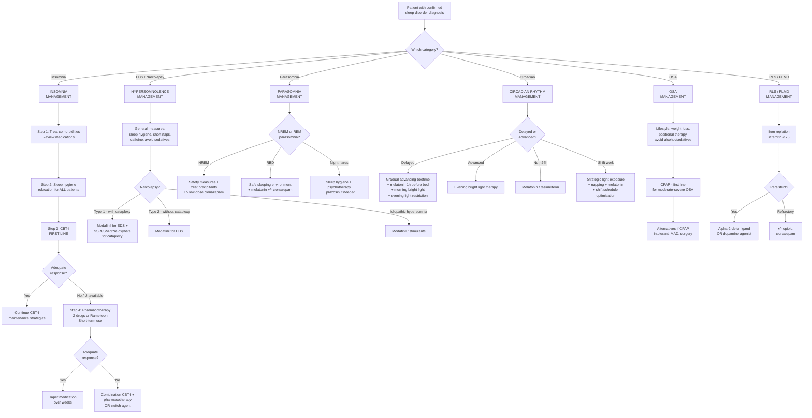

## Management of Sleep Disorders

### Overarching Treatment Philosophy

Before discussing individual treatments, understand the **general principles** that govern sleep disorder management. Think of this as the "operating system" that runs behind every specific treatment decision [2]:

1. ***Goals: (1) ↑ sleep quality and quantity, (2) ↓ insomnia-related daytime impairment*** [2]
2. ***Optimise treatment of comorbid sleep, medical, psychiatric disorder first*** [2] — You cannot fix insomnia while untreated depression, pain, or OSA rages on
3. ***Address underlying factors, especially drugs (stimulants, SSRI/SNRI, steroids, chronic opioid use)*** [2] — Always review the medication list
4. ***Ensure good sleep hygiene*** [2] — The foundation upon which everything else is built
5. **Non-pharmacological before pharmacological** — CBT-I is first-line for insomnia, not pills
6. **Use the least amount of medication for the shortest time** — most sleep medications carry dependence risk

---

### Master Management Algorithm

---

### 1. Management of Insomnia

#### 1.1 Sleep Hygiene Education — For ALL Patients

***Sleep hygiene is the universal foundation — every patient with any sleep disorder should receive sleep hygiene counselling.*** [2] Think of it as the "lifestyle modification" equivalent in hypertension — necessary but often insufficient alone for moderate-severe disease.

***Principles of sleep education (sleep hygiene):*** [2]

| Category | ***Recommendations*** | Rationale / First Principles |
|----------|----------------------|------------------------------|
| ***Sleep environment*** | ***Familiar and comfortable, Dark, Quiet*** | Darkness promotes melatonin secretion (pineal gland responds to absence of light via the retinohypothalamic tract → SCN → pineal). Noise causes cortical arousals. An unfamiliar environment activates the amygdala ("first night effect"). |
| ***Encourage*** | ***Bedtime routines*** | Conditioned relaxation response — consistent pre-sleep ritual signals to the brain that sleep is approaching |
| | ***Consistent time for going to bed and waking up*** | Entrains the circadian clock (SCN); irregular schedules cause internal desynchrony (similar to perpetual jet lag) |
| | ***Going to bed only when tired*** | Prevents lying awake in bed → prevents conditioned arousal (bed = frustration) |
| | ***Thinking about problems before going to bed*** | "Worry time" earlier in the evening offloads cognitive arousal before the sleep period |
| | ***Regular exercise*** | Exercise ↑ adenosine accumulation (↑ Process S), ↓ anxiety, ↑ SWS — but timing matters |
| ***Avoid*** | ***Late-evening exercise*** | Exercise is sympathetically activating; core body temperature needs to drop for sleep onset — exercise delays this drop |
| | ***Caffeine-containing drinks late in the day*** | Caffeine blocks adenosine A₁/A₂A receptors → blocks Process S → delays sleep onset. Half-life ~5–6h, so afternoon caffeine is still active at bedtime |
| | ***Using mobile devices or watching TV in bed*** | Blue light from screens suppresses melatonin via ipRGCs → delays circadian phase. Also, bed becomes associated with stimulating activity (conditioned arousal) |
| | ***Excessive alcohol and smoking*** | Alcohol: initial sedation → second-half rebound arousal + ↓ REM. Nicotine: stimulant effect |
| | ***Excessive daytime sleep*** | Dissipates Process S → reduces homeostatic sleep drive at night |
| | ***Large late meals*** | GERD risk; thermogenic effect of digestion raises core temperature, opposing the temperature drop needed for sleep onset |
| | ***Too much time in bed lying awake*** | Perpetuates conditioned arousal — the bed becomes a cue for wakefulness, not sleep |

<Callout title="Sleep Hygiene Alone Is Usually Insufficient for Chronic Insomnia" type="error">
Sleep hygiene is necessary but rarely sufficient as monotherapy for chronic insomnia disorder. It is best thought of as the "baseline" that enables other treatments (CBT-I, medications) to work. Studies show sleep hygiene education alone has modest effect sizes (~0.2). Always combine with CBT-I or pharmacotherapy for chronic insomnia. Do NOT dismiss a patient with chronic insomnia by telling them to "just practice good sleep hygiene."
</Callout>

#### 1.2 CBT for Insomnia (CBT-I) — FIRST LINE

***CBT for insomnia (CBT-I): 1st line but not readily available*** [2]

CBT-I is the **gold standard** treatment for chronic insomnia. It is recommended as first-line by AASM, European Sleep Research Society, and NICE guidelines. It has equivalent short-term efficacy to medications but **superior long-term outcomes** because it addresses perpetuating factors (3P model) rather than just symptoms.

***Techniques:*** [2]

| Technique | What It Is | How It Works (First Principles) |
|-----------|-----------|--------------------------------|
| ***Sleep education*** | Teaching the patient about normal sleep, sleep architecture, the 3P model, and realistic sleep expectations | Corrects misconceptions (e.g., "I need 8 hours or I'll be destroyed") that fuel anxiety about sleep. Reduces the cognitive component of hyperarousal. |
| ***Stimulus control*** | Instructions to re-associate the bed/bedroom with sleep only. Rules: go to bed only when sleepy; if unable to sleep within ~20 min, leave the bed and return only when sleepy; use bed only for sleep and sex; fixed wake time regardless of sleep quality; no napping. | Targets **conditioned arousal** — the classical conditioning where bed = wakefulness/frustration. By breaking this association and rebuilding bed = sleep, you restore the automatic sleep response. This is arguably the single most powerful CBT-I component. |
| ***Sleep restriction*** | Reduce time in bed to match actual sleep time (e.g., if patient sleeps 5 hours but spends 8 hours in bed → restrict to 5 hours in bed). Gradually increase by 15–30 min as sleep efficiency improves. Target: sleep efficiency ≥85%. | Builds up Process S (homeostatic sleep drive) by mild sleep deprivation → consolidates sleep → improves sleep efficiency. Counter-intuitive but extremely effective. **Sleep efficiency = (total sleep time / time in bed) × 100%.** Normal ≥85%. |
| ***Relaxation training*** | Progressive muscle relaxation, diaphragmatic breathing, guided imagery, autogenic training | Directly opposes physiological hyperarousal — ↓ sympathetic tone, ↓ cortisol, ↓ muscle tension → lowers the arousal threshold to allow VLPO activation |
| ***Cognitive therapy*** | Identifying and challenging dysfunctional beliefs about sleep (e.g., "If I don't sleep 8 hours, I'll collapse at work tomorrow"; "I've never been a good sleeper and never will be") | Addresses the **cognitive perpetuating factors** — catastrophising, unrealistic expectations, and attentional bias toward sleep-related threat. Reduces the "worry cycle" described in the 3P model. |

***Delivery formats:*** [2]
- ***Form: self-help, individual, group, face-to-face, telephone-administered***
- ***Delivery: by nurse or therapist***
- ***Number of sessions: 1–8*** (typically 4–6 weekly sessions)
- Digital CBT-I (dCBT-I) is increasingly available and has good evidence (e.g., Sleepio, SHUTi). ***HKU's CBT-I project by Dr KF Chung*** is a local resource [2]

<Callout title="Why Is CBT-I First Line Over Medications?">

1. **Equivalent short-term efficacy** to pharmacotherapy for chronic insomnia
2. **Superior long-term efficacy** — effects persist after treatment ends (because you've changed the perpetuating factors), unlike medications where insomnia returns upon discontinuation
3. **No dependence risk** — unlike benzodiazepines and Z-drugs
4. **No side effects** — no hangover sedation, no falls risk, no cognitive impairment
5. **Addresses root cause** — targets the perpetuating factors of the 3P model, not just the symptom

The main barrier is **availability** — there are not enough trained CBT-I therapists. This is why digital CBT-I programmes are increasingly important.
</Callout>

#### 1.3 Pharmacotherapy for Insomnia

***Pharmacological therapy: only Z drugs and Ramelteon recommended in guidelines, also 1st line*** [2]

Medications are appropriate when:
- CBT-I is unavailable or the patient declines
- Acute/short-term insomnia where rapid symptom relief is needed
- As adjunct to CBT-I in severe cases
- Always aim for **short-term use** (2–4 weeks), with planned tapering

##### 1.3.1 Recommended Agents

| Drug Class | ***Specific Agents*** | ***Mechanism*** | Indications | Key Features | Cautions/Contraindications |
|-----------|----------------------|----------------|-------------|--------------|---------------------------|
| ***Z drugs (BZD receptor agonists)*** | ***Zolpidem (Stilnox), Zopiclone (Imovane)*** [2][6] | ***Non-benzodiazepine drugs acting as specific agonists at BZD receptors (ω₁ receptors)*** [6]. The ω₁ (alpha-1 subunit of GABA-A) receptor is selectively targeted → sedation without significant anxiolytic, muscle relaxant, or anticonvulsant effects (which require ω₂/ω₃). | Sleep onset insomnia primarily. ***Stilnox CR can be used for sleep maintenance insomnia*** [6]. | ***Produces ↓ changes in sleep architecture and has ↓ duration of action compared to BZDs*** [6]. ***Stilnox has shorter half-life (↓ propensity for hangover), less bitter, but may be less effective for sleep maintenance and may be more expensive. Imovane may cause bitter aftertaste.*** [6] | ***Residual effects (slow, drowsiness, ↓ daytime performance, ↑ risk of falls), rarely behavioural disturbances (confusion, amnesia, ↓ mood)*** [6]. Complex sleep behaviours (sleep-driving, sleep-eating) — rare but serious. Elderly: start low dose. Avoid in pregnancy. Short-term use only (2–4 weeks). |
| ***Melatonin receptor agonist*** | ***Ramelteon*** [2][6] | ***Selective MT₁ and MT₂ receptor agonist*** [6]. MT₁ receptors in SCN → promote sleepiness; MT₂ receptors → shift circadian phase. Unlike melatonin supplements, Ramelteon has higher receptor affinity and longer half-life. | Sleep onset insomnia, especially in elderly (no abuse potential, no next-day impairment). | No abuse potential, no dependence risk, not a controlled substance. Minimal next-day sedation. Safe in elderly. | Avoid with fluvoxamine (strong CYP1A2 inhibitor → ↑ Ramelteon levels). Less effective for sleep maintenance. |
| ***Low-dose doxepin*** | ***Doxepin (Silenor) 3–6 mg*** [2] | Tricyclic antidepressant — at low doses, acts primarily as H₁ antihistamine (blocks histamine at the TMN → blocks wake-promoting signal). At antidepressant doses (75–150 mg), additional NA and 5-HT reuptake inhibition. | Sleep maintenance insomnia, especially in elderly. | At 3–6 mg, essentially a pure antihistamine with minimal anticholinergic or adrenergic effects. Only FDA-approved TCA for insomnia. | Avoid in glaucoma (anticholinergic at higher doses), urinary retention. Very low doses are remarkably well-tolerated. |

> **Why the ω₁ selectivity of Z drugs matters**: Traditional benzodiazepines bind non-selectively to all GABA-A receptor subtypes (ω₁, ω₂, ω₃). ω₁ → sedation; ω₂ → anxiolysis + muscle relaxation; ω₃ → anticonvulsant. By targeting only ω₁, Z drugs provide hypnotic effect with fewer muscle-relaxant and amnestic effects, less disruption to sleep architecture, and (theoretically) less dependence potential. In practice, however, dependence can still develop with prolonged use.

##### 1.3.2 Other Drugs (Not First-Line / Not Recommended as Monotherapy)

***Other drugs (not recommended):*** [2]

| Drug Class | ***Specific Agents*** | Mechanism | When Used | Why Not First-Line |
|-----------|----------------------|-----------|-----------|-------------------|
| ***Off-label sedating antidepressants*** | ***Mirtazapine (Remeron), Trazodone, Paroxetine*** [2] | Mirtazapine: H₁ antagonist + 5-HT₂A/2C antagonist → sedation + ↑ appetite. Trazodone: 5-HT₂A antagonist + weak SARI → sedation at low dose. Paroxetine: SSRI with some sedating properties. | When comorbid depression exists, or when primary agents fail. Trazodone is very widely used off-label (50–100 mg) despite limited evidence. | Insufficient RCT evidence for insomnia specifically. SE profile: Mirtazapine → weight gain; Trazodone → priapism (rare but serious), orthostatic hypotension; Paroxetine → weight gain, sexual dysfunction, withdrawal symptoms. |
| ***Off-label sedating antipsychotics*** | ***Quetiapine (Seroquel)*** [2] | At low doses (25–50 mg): primarily H₁ and α₁ antagonism → sedation. At higher doses: D₂ and 5-HT₂A antagonism. | Sometimes used when comorbid psychotic illness or severe agitation. Widely (mis)used off-label for insomnia. | ***NOT recommended for insomnia*** — metabolic syndrome risk (weight gain, dyslipidaemia, hyperglycaemia), QTc prolongation, extrapyramidal symptoms with chronic use. Disproportionate risk for a "sleep aid." |
| ***Short-acting benzodiazepines*** | ***Lorazepam (Ativan)*** [2] | Non-selective GABA-A receptor agonist → sedation + anxiolysis + muscle relaxation + anticonvulsant | Acute severe insomnia with significant anxiety, very short-term use ( < 2–4 weeks) | ***↑ risk of dependence*** [2]. Disrupt sleep architecture (↓ SWS, ↓ REM). Rebound insomnia on discontinuation. Falls risk in elderly. Cognitive impairment. Tolerance develops. |
| ***OTC drugs*** | ***Promethazine (Phenergan), melatonin*** [2] | Promethazine: 1st-generation antihistamine (H₁ blocker). Melatonin: MT₁/MT₂ agonist (OTC formulation). | Self-medication by patients. | Promethazine: anticholinergic SE (dry mouth, blurred vision, urinary retention, constipation), next-day sedation, not evidence-based. OTC melatonin: variable bioavailability, unregulated dosing, modest effect mainly on sleep latency (15–20 min reduction). |

<Callout title="Benzodiazepines for Insomnia — What You Must Know for Exams" type="error">

***Benzodiazepines should NOT be used as primary treatment for insomnia*** [6]:
- ***Prefer short-acting drugs for sleep induction to minimise hangover (e.g., temazepam, lormetazepam)*** [6]
- ***May inhibit REM sleep and disrupt sleep architecture, resulting in a rebound increase when discontinued*** [6]
- ***Should avoid using hypnotics regularly or for long periods of time*** [6]
- Maximum recommended duration: **2–4 weeks**
- Risk of **tolerance** (need escalating doses) and **dependence** (physical withdrawal symptoms)
- Withdrawal symptoms: rebound insomnia (worse than baseline), anxiety, tremor, seizures (in severe cases)
- Elderly: ↑ falls risk, ↑ cognitive impairment, ↑ hip fractures

If you must use a BZD for insomnia, choose short-acting, prescribe the lowest effective dose, limit to < 4 weeks, and have an exit plan.
</Callout>

##### 1.3.3 Other Non-Pharmacological Approaches

***Other non-pharmacological: mindfulness, TCM, hypnosis*** [2]

| Approach | Evidence | Mechanism |
|----------|----------|-----------|
| **Mindfulness-Based Therapy for Insomnia (MBTI)** | Moderate evidence — can be combined with CBT-I elements | Reduces cognitive and physiological arousal through present-moment awareness; breaks the "worry cycle" |
| **Acupuncture / TCM** | Limited but growing evidence; popular in Hong Kong | Proposed mechanism: modulation of autonomic nervous system, endorphin release. Evidence quality is generally low. |
| **Hypnosis** | Limited evidence as standalone; may augment relaxation training | Suggestion-based approach to reduce arousal and modify sleep-related cognitions |
| **Exercise** | Good evidence as adjunct | ↑ adenosine, ↑ SWS, ↓ anxiety, ↑ core body temperature (subsequent cooling promotes sleep) — must be timed correctly (not late evening) |

---

### 2. Management of Excessive Daytime Sleepiness and Narcolepsy

#### 2.1 General Measures for Sleepiness

***Treatment for sleepiness in general:*** [2]

| Measure | Rationale |
|---------|-----------|
| ***Sleep hygiene: regular and adequate sleep, caffeine not later than 4 PM*** [2] | Ensuring adequate sleep opportunity addresses the most common cause of EDS (insufficient sleep). Caffeine after 4 PM disrupts subsequent night's sleep → perpetuates cycle. |
| ***Short naps: 15 min*** [2] | Short naps dissipate Process S without entering deep sleep (which causes sleep inertia upon waking). In narcolepsy, short naps are characteristically refreshing. Longer naps enter SWS → grogginess. |
| ***Bright light: especially for shift work, jet lag, seasonal affective disorder*** [2] | Light suppresses melatonin and activates the SCN alerting signal → promotes wakefulness at desired times. Strategic light exposure can phase-shift the circadian clock. |
| ***Adjust shift work: forward shift, regular night shift, 12h 2-shift*** [2] | Forward rotation (morning → afternoon → night) follows the natural tendency of the circadian clock to delay. Rapid backward rotations cause severe desynchrony. Consistent schedules allow partial adaptation. |

#### 2.2 Narcolepsy — Specific Treatment

***Management of narcolepsy:*** [2]

| Symptom Targeted | ***Drug*** | ***Mechanism*** | Key Points |
|-----------------|-----------|----------------|------------|
| ***Daytime sleepiness*** | ***Modafinil: 1st line*** [2] | ***?Amphetamine-like inhibition of dopamine reuptake*** [2] → ↑ DA in wake-promoting circuits (VTA, LC). Also may affect norepinephrine and histamine pathways. Exact mechanism not fully elucidated. | 100–400 mg/day. Well-tolerated. SE: headache, nausea, anxiety. Lower abuse potential than traditional stimulants. |
| | ***Other options: armodafinil, methylphenidate, amphetamines*** [2] | Armodafinil: R-enantiomer of modafinil (longer-acting). Methylphenidate/amphetamines: ↑ DA and NA release. | Methylphenidate and amphetamines are second-line due to higher abuse potential, cardiovascular SE (↑ HR, ↑ BP), and Schedule II controlled substance status. |
| ***Cataplexy*** | ***SSRI/SNRI/(TCA)*** [2]: ***e.g., venlafaxine, atomoxetine, fluoxetine, (clomipramine)*** | ***MoA: brainstem circuits that generate REM sleep are strongly inhibited by noradrenaline and serotonin*** [2]. These drugs ↑ NA and/or 5-HT → suppress the pontine REM-atonia generator → prevent cataplexy (which is intrusion of REM atonia into wakefulness). | Venlafaxine is often preferred (potent NA + 5-HT reuptake inhibition). Clomipramine (TCA) is highly effective but has more SE (anticholinergic). **Abrupt discontinuation can cause "status cataplecticus"** — prolonged cataplexy episode. |
| ***Both EDS and cataplexy*** | ***Sodium oxybate (sodium γ-hydroxybutyrate / GHB)*** [2] | ***GABA metabolite → ?acts through GABA-B receptors, exact mechanism unknown*** [2]. Consolidates nocturnal sleep (↑ SWS) → ↓ daytime sleepiness. Also suppresses cataplexy through unclear mechanisms. | Given in two divided doses at night (at bedtime and 2.5–4 hours later — short half-life). Powerful but tightly regulated (Schedule III). SE: nausea, dizziness, enuresis, sleep-disordered breathing. Risk of abuse. |
| | ***Pitolisant*** (newer agent) | Histamine H₃ receptor inverse agonist/antagonist → blocks presynaptic H₃ autoreceptors → ↑ histamine release from TMN → promotes wakefulness. Also modulates other neurotransmitters. | EU/US approved. Oral, once daily. Lower abuse potential. Also effective for cataplexy. |
| | ***Solriamfetol*** (newer agent) | Dual dopamine and norepinephrine reuptake inhibitor (DNRI) | Approved for EDS in narcolepsy and OSA. Fast onset. |

**Driving advice for narcolepsy:** [2]
- ***Majority safe to drive but may need time limit (prolonged wakefulness → ↑ attacks)*** [2]
- Patients should avoid long, monotonous drives
- Strategic napping before driving
- Some jurisdictions require medical clearance

**Other drugs to avoid:** [2]
- ***Avoid BZD, opiates, antipsychotics, alcohol*** — all suppress wakefulness and worsen EDS

#### 2.3 Idiopathic Hypersomnia — Treatment

***Management: CNS stimulants similar to narcolepsy, e.g., modafinil, amphetamines*** [2]

- Less effective than in narcolepsy (naps remain unrefreshing)
- Sleep inertia may respond to strategic alarm systems and caffeine
- No FDA-approved treatment specifically for idiopathic hypersomnia (off-label use of narcolepsy drugs)

---

### 3. Management of Obstructive Sleep Apnoea (OSA)

| Treatment | Indication | Mechanism | Key Considerations |
|-----------|-----------|-----------|-------------------|
| **Lifestyle modifications** | All patients | Weight loss: ↓ fat around pharyngeal airway → ↑ airway calibre. Positional therapy: avoid supine sleeping (tongue falls back). Avoid alcohol/sedatives: these relax pharyngeal muscles → ↑ collapsibility. | Weight loss of 10% can ↓ AHI by ~50% in moderate OSA. Positional therapy works for positional OSA (AHI ≥2× in supine vs lateral). |
| **Continuous Positive Airway Pressure (CPAP)** | ***First line for moderate-severe OSA (AHI ≥15)*** | Pneumatic splint — delivers continuous positive pressure via mask → prevents upper airway collapse by maintaining intraluminal pressure above the critical closing pressure | Gold standard. Highly effective. Main barrier: **adherence** (~50% patients struggle). Adequate use = ≥4 hours/night for ≥70% of nights. SE: mask discomfort, nasal dryness, aerophagia, claustrophobia. Heated humidification and proper mask fitting improve tolerance. |
| **Mandibular Advancement Device (MAD)** | Mild-moderate OSA or CPAP-intolerant patients | Custom-fitted oral appliance that protrudes the mandible forward → pulls the tongue and soft palate anteriorly → ↑ posterior airway space | Less effective than CPAP but better adherence. Custom devices (fitted by dentist) superior to OTC boil-and-bite devices. |
| **Surgery** | Selected patients with identifiable anatomical obstruction or CPAP/MAD failure | Uvulopalatopharyngoplasty (UPPP): removes excess tissue. Maxillomandibular advancement: moves jaw forward. Hypoglossal nerve stimulation: stimulates genioglossus → opens airway. | Highly variable success rates. UPPP: ~50% response, often diminishes over time. Hypoglossal nerve stimulation (Inspire device) is promising for selected patients who fail CPAP. |
| **Adjuncts** | As indicated | Nasal surgery for obstruction. Tonsillectomy/adenoidectomy (first-line in paediatric OSA). Myofunctional therapy (tongue exercises). | Paediatric OSA: adenotonsillectomy is curative in most cases. |

---

### 4. Management of Parasomnias

#### 4.1 NREM Parasomnias (Sleepwalking, Sleep Terrors, Confusional Arousals)

***Key principle: determine severity and frequency → highly variable but important treatment implications*** [2]

- ***Infrequent → no treatment required*** [2]
- ***Once every few months → need treatment + search for precipitating factors*** [2]

| Treatment | Details | Mechanism |
|-----------|---------|-----------|
| ***Treat precipitating factors*** | ***Sleep deprivation, alcohol, medications (especially BZD, BZRA), fever, OSA, PLMD*** [2] | These factors increase SWS depth or cause incomplete arousals → more parasomnia events. Treating OSA alone can resolve NREM parasomnias. |
| ***Environment modification*** | ***Use padding in bedroom, lock doors, remove sharp objects*** [2]. Alarms on doors/windows. Sleep on ground floor. | Prevent injury during episodes. The patient is unaware during the event and cannot protect themselves. |
| **Reassurance and education** | Explain to parents (for children) that this is developmental and usually self-limiting | Most childhood NREM parasomnias resolve by adolescence as SWS proportion naturally decreases |
| **Scheduled awakening** | Wake the child ~15–30 min before the typical time of the parasomnia event, nightly for several weeks | Disrupts the SWS cycle before the partial arousal occurs. Effective in children with predictable timing. |
| ***Pharmacotherapy: low-dose clonazepam*** | ***Best studied, rarely necessary*** [2]. Typical dose: 0.25–0.5 mg at bedtime. | Clonazepam suppresses SWS (reduces depth of N3) → fewer partial arousals. Also ↓ arousal threshold. Reserve for frequent, dangerous, or injurious episodes. |

**SRED (Sleep-Related Eating Disorder):** [2]
- ***Management: SSRI, topiramate, clonazepam*** [2]
- Topiramate: appetite suppressant + GABAergic properties → reduces eating episodes

#### 4.2 REM Parasomnias

##### REM Sleep Behaviour Disorder (RBD)

***Management of RBD:*** [2]

| Treatment | Details | Mechanism |
|-----------|---------|-----------|
| ***Safe sleeping environment*** | ***First priority*** [2]. Remove bedside tables, sharp objects. Place mattress on floor. Separate beds if necessary. Pad the floor and furniture edges. | RBD episodes can cause serious injury — falling out of bed, punching partner, breaking furniture. Safety comes first. |
| ***Melatonin*** | ***Augments REM sleep*** [2]. Dose: 3–12 mg at bedtime. | Melatonin may partially restore REM atonia through unclear mechanisms — possibly by modulating GABAergic and glycinergic transmission in the brainstem. Has fewer SE than clonazepam. Increasingly used as first-line pharmacotherapy. |
| ***Clonazepam*** | 0.25–2 mg at bedtime [2] | Suppresses phasic muscle activity during REM. Does NOT restore normal REM atonia (EMG still shows RSWA on PSG). May work by raising the arousal threshold. Effective but risk of sedation, falls (elderly), worsening OSA (muscle relaxation). |
| **Address underlying cause** | Withdraw offending serotonergic antidepressants if possible. Treat comorbid OSA (which can precipitate RBD). Screen for neurodegenerative disease (PD, DLB). | Serotonergic antidepressants (SSRIs, SNRIs, mirtazapine) can cause/exacerbate RBD by altering serotonergic modulation of pontine REM-atonia centres. |

##### Nightmare Disorder

***Management of nightmares:*** [2]

| Treatment | Details | Mechanism |
|-----------|---------|-----------|
| ***Good sleep hygiene*** | Address sleep deprivation, which increases REM rebound → more intense dreams [2] | Sleep deprivation → REM rebound → ↑ dream intensity and emotional content |
| ***Treat comorbid disorder*** | Especially depression, PTSD [2] | Nightmares are often a manifestation of underlying psychopathology |
| ***Psychotherapy*** | Image Rehearsal Therapy (IRT): patient rehearses a modified, non-threatening version of the nightmare during daytime → "rewrites" the dream script [2] | Cognitive restructuring of the nightmare content. Highly effective (NNT ~3 for PTSD-related nightmares). |
| ***Prazosin*** | ***α₁-adrenergic antagonist*** [2]. Dose: 1–15 mg at bedtime (start low, titrate up). | Blocks noradrenergic hyperactivation during sleep — in PTSD, the locus coeruleus is overactive, causing increased noradrenergic tone during REM → nightmares. Prazosin blocks post-synaptic α₁ receptors → reduces this hyperarousal. SE: orthostatic hypotension (first dose effect), dizziness. |

##### Sleep Paralysis

***Management of sleep paralysis:*** [2]
- ***TCA, SSRI/SNRI to suppress REM sleep*** [2]
- Mechanism: by ↑ serotonin and noradrenaline, these drugs suppress REM entry → fewer episodes of REM-atonia intrusion into wakefulness
- Reassurance is important — episodes are frightening but benign and self-limiting (1–2 minutes)
- Address precipitants: ***sleep deprivation, irregular sleep habits, overtiredness, stress*** [2]

---

### 5. Management of Restless Leg Syndrome (RLS) / Willis-Ekbom Disease

***Stepwise approach:*** [2]

| Step | Treatment | Details |
|------|-----------|---------|
| **1** | ***Iron repletion if ferritin < 75 µg/L*** [2] | Oral iron (ferrous sulfate 325 mg with vitamin C on empty stomach) or IV iron if oral intolerant. Target ferritin > 75 µg/L (NOT the standard lab "normal" of 15–20). Iron is the cofactor for tyrosine hydroxylase → rate-limiting enzyme for dopamine synthesis → ↓ iron = ↓ dopamine. |
| **2** | ***α₂δ ligand (gabapentin, pregabalin)*** [2] OR ***non-ergot dopamine agonists (pramipexole, ropinirole)*** [2] | **α₂δ ligands**: Bind α₂δ subunit of presynaptic voltage-dependent Ca²⁺ channels → block release of excitatory neurotransmitters → ↓ sensory symptoms. ***SE: somnolence, dizziness, ↑ appetite, mood changes, confusion, ataxia*** [6]. **DA agonists**: directly stimulate D₂/D₃ receptors in A11 diencephalospinal pathway. SE: nausea, augmentation (worsening of symptoms with chronic use — paradoxical earlier onset and spread to arms), impulse control disorders (gambling, hypersexuality). **Current guidelines (IRLSSG 2024) favour α₂δ ligands as first-line** over DA agonists due to augmentation risk. |
| | ***Levodopa*** [2] | Dopamine precursor (converted to DA by DOPA decarboxylase). Effective for intermittent RLS but **high augmentation risk** with daily use (up to 70% over years). Best reserved for as-needed/intermittent use. |
| **3 (Refractory)** | ***± Opioid, clonazepam*** [2] | Low-dose opioids (oxycodone, tramadol, codeine): activate mu-opioid receptors → modulate dopaminergic and sensory pathways. Very effective but addiction risk. Clonazepam: ↓ arousals from PLMS but doesn't treat RLS sensation. |

<Callout title="Augmentation — The Nemesis of Dopamine Agonist Therapy in RLS" type="idea">
**Augmentation** is the most important long-term complication of dopamine agonist treatment for RLS. It manifests as:
- Earlier onset of symptoms (e.g., afternoon instead of evening)
- Faster onset when at rest
- Spread to previously unaffected body parts (arms, trunk)
- Shorter duration of drug effect

This occurs because chronic dopamine receptor stimulation → receptor desensitisation → compensatory upregulation of symptoms. It is **more common with levodopa** (70%) and **less common with longer-acting DA agonists** (pramipexole ~8% at 10 years). This is the main reason current guidelines prefer α₂δ ligands over DA agonists as initial therapy.
</Callout>

---

### 6. Management of Circadian Rhythm Sleep–Wake Disorders

| Disorder | ***Treatment*** | Mechanism |
|----------|----------------|-----------|
| ***Delayed Sleep-Wake Phase Disorder (80%)*** | ***Gradual advancing bedtime with strict sleep/wake schedule; 0.5 mg melatonin 1h before target bedtime; morning light (2h 5000 lux); evening light restriction*** [2] | **Chronotherapy** (gradually advancing bedtime): shifts the clock earlier. **Melatonin**: exogenous melatonin given 1h before desired bedtime acts as a "darkness signal" → advances the circadian phase via MT₁/MT₂ receptors in SCN. Must be low dose (0.5 mg) and correctly timed — higher doses can cause daytime sedation without better phase-shifting. **Morning bright light**: suppresses residual melatonin and provides a phase-advancing zeitgeber to the SCN. **Evening light restriction**: prevents the blue light phase-delay signal. |
| ***Advanced Sleep-Wake Phase Disorder*** | ***Bright light therapy in the evening*** [2] | Evening bright light delays the circadian clock (sends "it's still daytime" signal to the SCN → delays melatonin onset → delays sleep phase). |
| ***Non-24-hour Sleep-Wake Disorder*** | ***Behavioural changes; timed melatonin (1h before bed); melatonin agonist (tasimelteon)*** [2] | **Tasimelteon** ("tasi" from the MT₁/MT₂ receptor targets): dual MT₁/MT₂ agonist specifically approved for non-24-hour disorder in totally blind adults. Provides the entrainment signal that missing light input cannot. |
| ***Shift work disorder*** | ***Strategic light/dark exposure; scheduled napping; melatonin before desired sleep time; optimise shift schedules*** [2] | **Forward rotation** (morning → afternoon → night): aligns with natural circadian delay tendency. Bright light at start of night shift → promotes alertness. Dark sunglasses on drive home in morning → prevents phase-advancing light exposure. Melatonin before daytime sleep → promotes sleep during biological day. |
| ***Jet lag*** | Strategic light exposure at destination, melatonin, short-acting hypnotic (one-off) | Eastward travel (phase advance required): morning light at destination, melatonin in evening. Westward travel (phase delay required): evening light at destination, avoid morning light. |

---

### 7. Summary of Drug Mechanisms — Quick Reference

| Drug | Class | Mechanism | Primary Use |
|------|-------|-----------|-------------|
| ***Zolpidem, Zopiclone*** | Z drugs | ω₁-selective GABA-A agonist | Insomnia (sleep onset) |
| ***Ramelteon*** | Melatonin agonist | MT₁/MT₂ agonist | Insomnia (sleep onset, elderly) |
| ***Low-dose doxepin*** | TCA (at low dose = antihistamine) | H₁ antagonist | Insomnia (sleep maintenance) |
| ***Modafinil*** | Wakefulness promoter | DA reuptake inhibition | Narcolepsy EDS, shift work |
| ***Sodium oxybate*** | GHB | GABA-B agonist | Narcolepsy (EDS + cataplexy) |
| ***Venlafaxine, Fluoxetine*** | SNRI / SSRI | ↑ NA and/or 5-HT → suppress REM | Cataplexy, sleep paralysis |
| ***Pitolisant*** | H₃ inverse agonist | ↑ histamine release from TMN | Narcolepsy EDS + cataplexy |
| ***Melatonin*** | Neurohormone | MT₁/MT₂ agonist | RBD, CSWRD, insomnia |
| ***Clonazepam*** | BZD | Non-selective GABA-A agonist | RBD, NREM parasomnias, PLMD |
| ***Prazosin*** | α₁ antagonist | Blocks noradrenergic hyperactivation | Nightmares (PTSD) |
| ***Gabapentin, Pregabalin*** | α₂δ ligand | Blocks presynaptic Ca²⁺ channels | RLS (first-line) |
| ***Pramipexole, Ropinirole*** | DA agonist | D₂/D₃ agonist | RLS (second-line, augmentation risk) |
| ***Tasimelteon*** | Melatonin agonist | MT₁/MT₂ agonist | Non-24h CSWRD |

---

<Callout title="High Yield Summary — Management of Sleep Disorders">

1. **Insomnia first-line**: CBT-I (sleep education, stimulus control, sleep restriction, relaxation, cognitive therapy). 1–8 sessions. Superior long-term outcomes to drugs. Address perpetuating factors of 3P model.

2. **Insomnia pharmacotherapy**: Only Z drugs (zolpidem, zopiclone) and Ramelteon recommended. Low-dose doxepin for maintenance insomnia. Short-term use only (2–4 weeks). BZDs are NOT first-line and carry dependence risk.

3. **Z drugs**: ω₁-selective GABA-A agonists → less sleep architecture disruption and shorter action than BZDs. Stilnox (shorter half-life, less hangover). Imovane (bitter taste).

4. **Narcolepsy**: Modafinil first-line for EDS. SSRI/SNRI for cataplexy (suppress REM via ↑ NA/5-HT in brainstem). Sodium oxybate for both (GABA-B agonist, consolidates sleep). Pitolisant (H₃ inverse agonist) is newer option.

5. **OSA**: CPAP first-line for moderate-severe. Weight loss in all. MAD if CPAP-intolerant. Surgery for selected cases.

6. **RBD**: Safe environment first. Melatonin (augments REM, first-line drug). Clonazepam (suppresses phasic muscle activity). Screen for synucleinopathies.

7. **RLS**: Iron repletion if ferritin < 75. α₂δ ligand (gabapentin/pregabalin) preferred over DA agonists (augmentation risk). Opioids/clonazepam if refractory.

8. **DSWPD**: Low-dose melatonin 1h before target bedtime + morning bright light + evening light restriction + gradual schedule advance.

9. **Nightmares**: Sleep hygiene + treat comorbid PTSD/depression + Image Rehearsal Therapy + prazosin (α₁ antagonist blocks noradrenergic hyperactivation).

10. **Sleep paralysis**: SSRI/SNRI/TCA to suppress REM + reassurance + address precipitants.
</Callout>

---

<ActiveRecallQuiz
  title="Active Recall - Management of Sleep Disorders"
  items={[
    {
      question: "What are the five components of CBT-I? Explain why stimulus control is considered the most powerful single component.",
      markscheme: "Five components: sleep education, stimulus control, sleep restriction, relaxation training, cognitive therapy. Stimulus control is most powerful because it directly targets conditioned arousal - the classical conditioning where the bed has become associated with wakefulness and frustration rather than sleep. Rules: bed for sleep and sex only; leave bed if unable to sleep within 20 min; return only when sleepy; fixed wake time; no napping. This re-associates the bed with sleep and restores the automatic sleep response."
    },
    {
      question: "Compare and contrast Z drugs and benzodiazepines for insomnia treatment. Why are Z drugs preferred?",
      markscheme: "Z drugs (zolpidem, zopiclone) are omega-1 selective GABA-A receptor agonists, targeting the alpha-1 subunit responsible for sedation. BZDs are non-selective, binding all GABA-A subtypes (omega 1, 2, 3) causing sedation plus anxiolysis, muscle relaxation, and anticonvulsant effects. Z drugs preferred because: less disruption of sleep architecture, shorter duration of action (less hangover), theoretically lower dependence potential, less muscle relaxation (fewer falls). However, dependence can still develop with prolonged Z drug use."
    },
    {
      question: "A patient with narcolepsy type 1 has both excessive daytime sleepiness and cataplexy. Name the drug that treats both symptoms and explain its mechanism.",
      markscheme: "Sodium oxybate (sodium gamma-hydroxybutyrate). It is a GABA metabolite that acts through GABA-B receptors (exact mechanism unknown). It consolidates nocturnal sleep by increasing slow-wave sleep, which reduces daytime sleepiness. It also suppresses cataplexy through unclear mechanisms. Given in two divided doses at night due to short half-life. Alternative: pitolisant (H3 inverse agonist) also treats both EDS and cataplexy."
    },
    {
      question: "Why do current IRLSSG guidelines favour alpha-2-delta ligands over dopamine agonists as first-line for RLS? What is augmentation?",
      markscheme: "Alpha-2-delta ligands (gabapentin, pregabalin) are preferred because dopamine agonists carry significant risk of augmentation. Augmentation is paradoxical worsening of RLS with chronic dopamine agonist use, manifesting as: earlier symptom onset (afternoon instead of evening), faster onset at rest, spread to previously unaffected body parts (arms, trunk), and shorter drug effect duration. Caused by dopamine receptor desensitisation from chronic stimulation. Augmentation risk: levodopa 70%, pramipexole approximately 8% at 10 years. Alpha-2-delta ligands do not cause augmentation."
    },
    {
      question: "How would you treat delayed sleep-wake phase disorder? Explain the timing and mechanism of each intervention.",
      markscheme: "1. Low-dose melatonin (0.5 mg) 1 hour before TARGET bedtime (not current late bedtime) - acts as exogenous darkness signal via MT1/MT2 receptors in SCN to phase-advance the clock. 2. Morning bright light therapy (2h, 5000 lux) - suppresses residual melatonin and provides phase-advancing zeitgeber to SCN. 3. Evening light restriction (avoid screens, dim lights) - prevents blue light from sending phase-delaying signal. 4. Gradual advancing of bedtime with strict sleep-wake schedule. All four components work synergistically to shift the circadian clock earlier."
    },
    {
      question: "What are the first-line and second-line pharmacological treatments for REM sleep behaviour disorder? Why must you also screen for neurodegenerative disease?",
      markscheme: "First-line: melatonin 3-12 mg at bedtime (augments REM sleep, may partially restore REM atonia, fewer side effects). Second-line: clonazepam 0.25-2 mg at bedtime (suppresses phasic muscle activity during REM but does not restore normal atonia; risk of sedation, falls, worsening OSA in elderly). Also ensure safe sleeping environment first. Must screen for synucleinopathies because 80-90% of idiopathic RBD converts to PD, DLB, or MSA over 10-15 years. RBD is a prodromal marker of neurodegeneration - the same pontine nuclei affected in RBD are damaged early in synucleinopathies."
    }
  ]}
/>

## References

[1] Lecture slides: GC 165. I can't fall asleep Sleep physiology and Sleep disorders.pdf
[2] Senior notes: ryanho-psych.md (Chapter 9.2 Sleep Disorders)
[6] Senior notes: ryanho-psych.md (Chapter 3.1.4 Non-benzodiazepine Anxiolytics and Hypnotics; Chapter 3.1.4.1 Benzodiazepines)
