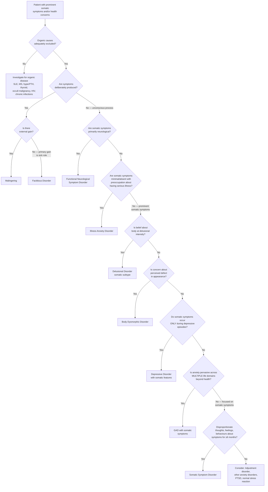

## Differential Diagnosis of Somatoform Disorders

The differential diagnosis of somatoform (somatic symptom and related) disorders is one of the most nuanced exercises in psychiatry. The reason is simple: these disorders sit at the crossroads of medicine and psychiatry, and the symptom overlap with both organic disease and other psychiatric conditions is enormous. Approaching this systematically is therefore essential.

The cardinal rule before considering any psychiatric differential: **you must diligently rule out organic causes before considering a psychiatric diagnosis** [2]. Somatoform disorders are never a diagnosis of exclusion by convenience — they are a positive diagnosis made on the basis of specific features (disproportionate distress and maladaptive behaviour), but only after adequate medical evaluation.

### Overarching Diagnostic Framework

The differential can be organised into three tiers:

1. **Organic (medical) disorders** — must always be excluded first
2. **Other psychiatric disorders** that produce somatic symptoms — the most common source of diagnostic confusion
3. **Other somatoform-spectrum conditions** — differentiating between subtypes within the somatoform umbrella
4. **Intentional symptom production** — factitious disorder and malingering

---

### Tier 1: Medical (Organic) Disorders

This is the most critical step. Insidious, multisystem diseases can mimic somatoform disorders for months or years before declaring themselves [2].

| Organic Condition | Why It Mimics Somatoform Disorders | Key Differentiating Features |
|---|---|---|
| **Systemic lupus erythematosus (SLE)** | Fatigue, joint pain, diffuse pain, neuropsychiatric symptoms — all vague and fluctuating early on | Look for malar rash, photosensitivity, oral ulcers, serositis. Check ANA, anti-dsDNA, complement levels. |
| **Multiple sclerosis (MS)** | Sensory symptoms, weakness, fatigue, visual disturbance — can present with "non-anatomical" patterns initially | MRI brain/spine with demyelinating lesions, oligoclonal bands in CSF. Symptoms should follow white matter tract anatomy on detailed examination. |
| **Hyperparathyroidism** | "Bones, stones, abdominal moans, psychic groans" — fatigue, diffuse pain, GI disturbance, cognitive complaints | Check serum calcium, PTH. Hypercalcaemia is the giveaway. |
| **Hyperthyroidism / Hypothyroidism** | Palpitations, anxiety, tremor, fatigue, weight changes, GI disturbance | TFTs (TSH, free T4). Thyroid disorders are extremely common and must always be screened. |
| **Occult malignancy** | Fatigue, weight loss, diffuse pain, paraneoplastic neurological syndromes | Age-appropriate cancer screening. Unexplained weight loss, night sweats, lymphadenopathy should raise alarm. |
| **HIV/AIDS** | Fatigue, weight loss, neuropsychiatric symptoms, diffuse lymphadenopathy | Risk factor assessment, HIV serology. Particularly relevant in Hong Kong with rising HIV incidence among men who have sex with men. |
| **Chronic infections** (e.g., TB, endocarditis, hepatitis) | Fatigue, weight loss, vague systemic complaints | Infection markers (CRP, ESR, blood cultures), targeted serology. TB remains relevant in Hong Kong. |
| **Phaeochromocytoma** | Episodic palpitations, sweating, headache, anxiety — classic mimic of panic/somatoform disorder | 24-hour urine catecholamines/metanephrines, plasma metanephrines. Paroxysmal hypertension. |
| **Coeliac disease / malabsorption** | GI symptoms (bloating, diarrhoea, abdominal pain), fatigue, iron deficiency | Anti-tTG antibodies, duodenal biopsy. |
| **Pituitary failure** | Fatigue, weakness, weight changes, amenorrhoea, reduced libido | Pituitary hormone panel (cortisol, TSH, LH/FSH, prolactin, GH). |

<Callout title="The DSM-5 Nuance on Organic Disease" type="error">
Under DSM-5 criteria, the presence of a known organic disease does **NOT** exclude a diagnosis of somatic symptom disorder [2]. Conversely, medically unexplained symptoms alone do **NOT** qualify for the diagnosis. The diagnosis centres on whether the patient's cognitive, emotional, and behavioural responses are **disproportionate** to the symptom's expected severity. So a patient with well-controlled type 2 diabetes who spends 6 hours daily researching diabetic complications, checks their blood sugar 20 times a day, and visits the emergency department weekly despite stable HbA1c — that patient meets criteria for SSD even though their underlying condition is entirely organic.
</Callout>

---

### Tier 2: Other Psychiatric Disorders

This is where the exam questions live. Each of these conditions can produce prominent somatic symptoms, and the key is knowing the **specific differentiating features** [2].

| Differential Diagnosis | Shared Features with Somatoform Disorders | Key Differentiating Features | Why This Distinction Matters |
|---|---|---|---|
| **Major Depressive Disorder** | Somatization is very common in depression — fatigue, pain, sleep disturbance, appetite change, psychomotor retardation are all "somatic" | If somatic symptoms and related concerns **do not occur outside of depressive episodes**, then SSD is not diagnosed [2]. Look for core depressive features: persistent low mood, anhedonia, guilt, worthlessness, suicidal ideation, diurnal mood variation, early morning wakening. Somatic symptoms remit when depression remits [2]. | Depression is treatable with antidepressants — if you misdiagnose as SSD and don't treat the depression, the patient won't improve |
| **Generalised Anxiety Disorder (GAD)** | Both marked by high levels of anxiety and somatic symptoms (palpitations, GI disturbance, muscle tension, fatigue) [2] | In GAD, anxiety is **pervasive over multiple aspects of life** (finances, work, family, health, future) — not limited to bodily symptoms [2]. In SSD, the preoccupation is focused specifically on somatic symptoms and their implications. GAD patients worry about *everything*; SSD patients worry about their *bodies*. | Treatment strategies differ — GAD responds well to SSRI + CBT targeting generalised worry patterns, whereas SSD requires CBT targeting illness beliefs specifically |
| **Panic Disorder** | Panic attacks produce dramatic somatic symptoms (chest pain, palpitations, dyspnoea, dizziness, paraesthesiae, nausea) — patients genuinely fear they are dying | Panic attacks are **episodic** and typically last 10–30 minutes. There is **anticipatory anxiety about the next attack** and catastrophic thoughts about acute life-threatening illness ("I'm having a heart attack") [2]. SSD tends to be more **enduring and chronic** with persistent preoccupation rather than episodic peaks [2]. Panic disorder features unexpected (uncued) attacks. | Panic disorder has very specific treatment (CBT for panic, SSRI, respiratory retraining) |
| **Obsessive-Compulsive Disorder (OCD)** | May have health/hygiene-related obsessions and compulsive checking (e.g., contamination fears → excessive handwashing, health checking) | In OCD, the thoughts are experienced as **intrusive, ego-dystonic, and unwanted** [2]. The compulsive behaviour specifically aims to **reduce anxiety arising from the intrusive thought** (not to investigate a symptom). OCD compulsions are typically **ritualistic/rule-driven** and may be clearly excessive or unrelated to the feared outcome [2]. In SSD, checking behaviour is directly related to health concerns and not ritualistic. | OCD has specific pharmacotherapy (high-dose SSRI) and psychotherapy (ERP — exposure and response prevention) |
| **Illness Anxiety Disorder (IAD)** | Both involve maladaptive responses to somatic concerns [2] | In IAD, somatic symptoms are **minimal or absent** [2]. The patient's primary concern is **having an undiagnosed serious disease** and they **seek diagnosis** (investigations) rather than **relief of symptoms** (treatment) [2]. In SSD, the patient has prominent somatic symptoms and seeks relief from the distress those symptoms cause. IAD patients may also **fear treatment side effects** and be reluctant to take medication, whereas SSD patients may push for medications including narcotics [2]. | If significant somatic symptoms are present → diagnose SSD, not IAD |
| **Functional Neurological Symptom Disorder (FND / Conversion Disorder)** | Both are under the somatoform spectrum | FND presents specifically with **neurological symptoms** (weakness, paralysis, seizures, sensory loss, movement disorders) that are incompatible with recognised neurological disease [2]. SSD presents with **distress caused by symptoms** across any body system. The maladaptive cognitive/emotional/behavioural features **may not be present** in FND patients [2] — i.e., a patient with functional weakness may not show the excessive health preoccupation seen in SSD. | FND management emphasises physiotherapy for motor symptoms and specific neurological rehabilitation, rather than the CBT-for-illness-beliefs approach used in SSD |
| **Delusional Disorder (somatic subtype)** | Belief that something is wrong with one's body [2] | The belief reaches **delusional intensity** — it is fixed, unshakeable, not amenable to reason, and often bizarre (e.g., "insects are crawling under my skin," "my organs are rotting") [2]. In somatoform disorders, illness-related beliefs are usually **overvalued ideas** — strongly held but the patient can entertain doubt when challenged (at least partially). | Delusional disorder requires antipsychotic treatment; somatoform disorders do not |
| **Body Dysmorphic Disorder (BDD)** | Excessive preoccupation with a body-related concern [2] | In BDD, the concern is about a **perceived defect in physical appearance** — the patient thinks they look abnormal/ugly [2]. In SSD, the concern reflects **fear of underlying illness** and the distress brought on by the symptom itself, **not a defect in appearance** [2]. | BDD is classified under OCD-related disorders in DSM-5 and treated with high-dose SSRI + CBT |
| **Social Anxiety Disorder** | Somatic symptoms in social situations (blushing, tremor, sweating, palpitations, nausea) | Symptoms are **situation-specific** — triggered by social/performance situations where the patient fears evaluation by others [2]. Outside social situations, the patient is well. In SSD, preoccupation is with the symptoms themselves, not the social context. | Different CBT focus (social skills training, cognitive restructuring of social fears) |
| **Adjustment Disorder** | Anxiety and somatic symptoms following a stressor | Must develop within 3 months of an identifiable stressor. Symptoms are expected to resolve within 6 months after the stressor ceases [2]. Does not meet criteria for a specific mood or anxiety disorder. In SSD, the course is chronic (≥6 months) and the focus is specifically on somatic symptoms. | Adjustment disorder is generally self-limiting |
| **PTSD** | Somatic symptoms (hyperarousal, pain, fatigue) are common | Requires exposure to a traumatic event. Core features are re-experiencing (flashbacks, nightmares), avoidance of trauma reminders, negative cognitions/mood, and hyperarousal [2]. Somatic symptoms are secondary to the trauma response, not the primary focus of preoccupation. | Trauma-focused CBT and EMDR are first-line; very different from SSD management |

---

### Tier 3: Intentional Symptom Production

This tier is conceptually distinct because it involves **some degree of conscious intent** — in contrast to somatoform disorders where the process is entirely unconscious [2].

| Condition | Insight into Psychological Basis | Illness Behaviour | Motivation | Key Differentiating Features |
|---|---|---|---|---|
| **Somatoform Disorders** | None (unconscious) | Feels genuinely ill (unconscious) | ?Underlying psychological distress [2] | Patient genuinely suffers; believes symptoms are real; seeks help |
| **Factitious Disorder** | None (unconscious motivation) | Feels ill — but **consciously fabricates/induces** symptoms [2] | To **assume the sick role** (primary gain) [2] | May present to multiple hospitals under different names. May have extensive medical knowledge. Munchausen syndrome = chronic, severe form. **Munchausen syndrome by proxy** = caretaker inducing illness in child (a form of child abuse) [2]. |
| **Malingering** | **Conscious process** [2] | **Does NOT feel ill** — deliberately aims to look ill [2] | **Secondary (external) gain** — insurance money, avoiding work/prison/military service, obtaining drugs [2] | Medicolegal context raises suspicion [2]. Marked discrepancy between claimed disability and objective findings [2]. Vague reports loaded with overgeneralisations that may seem rehearsed [2]. Once objective is achieved, symptoms lose significance [2]. Rejects all treatment that does not include psychoactive medications [2]. Exhibits lack of cooperation with diagnostic/treatment interventions [2]. Possible underlying antisocial personality disorder [2]. |

<Callout title="Ganser's Syndrome" type="idea">
**Ganser's syndrome** was first described in prisoners [2]. Its characteristic features include: (1) giving **approximate answers** to questions designed to test intellectual function (e.g., answering "5" to 2+2 — close but wrong, suggesting they actually know the answer), (2) psychogenic physical symptoms, (3) hallucinations, and (4) apparent clouding of consciousness [2]. It is considered by some to be a form of malingering, but the behaviour may be so consistent that it reflects genuine underlying distress — a way of communicating distress among individuals with limited psychological vocabulary [2]. Must rule out organic brain disease and schizophrenia, especially if associated with psychotic features, visual hallucinations, or muddled thinking [2].
</Callout>

---

### Differentiating Within the Somatoform Spectrum

This is a critical skill for the exam — knowing which somatoform subtype to assign [2]:

| Feature | Somatic Symptom Disorder | Illness Anxiety Disorder | Functional Neurological Symptom Disorder | Body Dysmorphic Disorder |
|---|---|---|---|---|
| **Somatic symptoms** | ≥1, prominent and distressing | Minimal or none | Neurological symptoms specifically | Perceived physical appearance defect |
| **Core concern** | Distress from symptoms | Having an undiagnosed serious illness | Neurological deficit | Appearance |
| **What patient seeks** | Relief of symptoms (treatment) | Diagnosis (investigation) | Explanation for neurological problem | Reassurance about appearance, or cosmetic surgery |
| **Maladaptive behaviour** | Prominent — excessive checking, doctor-shopping | Prominent — excessive scanning for illness signs | May or may not be present | Compulsions (mirror checking, camouflaging, comparing) |
| **Duration criterion** | ≥6 months (DSM-5) | ≥6 months | No minimum specified | No minimum specified |
| **Insight** | Variable | Variable | Often with la belle indifférence (but non-specific) | Often poor — overvalued ideas to delusional |
| **DSM-5 classification** | Somatic symptom and related disorders | Somatic symptom and related disorders | Somatic symptom and related disorders | OCD and related disorders |

---

### Differential Diagnosis Decision-Making Flowchart

---

### Key Differentiating Principles — A Summary Table

| Differentiating Question | If YES → Think... | If NO → Think... |
|---|---|---|
| Are symptoms consciously produced? | Factitious disorder or malingering | Somatoform spectrum or other psychiatric disorder |
| Is there external gain? | Malingering | Factitious disorder (sick role is the gain) |
| Are symptoms exclusively neurological? | FND (conversion disorder) | SSD or IAD |
| Is the concern primarily about having an undiagnosed disease with minimal symptoms? | Illness Anxiety Disorder | SSD (if symptoms are prominent) |
| Is the concern about physical appearance? | BDD | SSD |
| Does belief reach delusional intensity? | Delusional disorder, somatic subtype | Somatoform disorders (overvalued ideas) |
| Are thoughts ego-dystonic, intrusive, and ritualistic? | OCD | SSD |
| Do somatic symptoms only occur during mood episodes? | Depression with somatic features | SSD (independent of mood episodes) |
| Is anxiety about health AND multiple other life domains? | GAD | SSD (if focused on health) |

<Callout title="High Yield Summary — Differential Diagnosis">

**Step 1: Always exclude organic disease first** — SLE, MS, hyperparathyroidism, thyroid disorders, occult malignancy, HIV, chronic infections, phaeochromocytoma.

**Step 2: Distinguish unconscious vs conscious symptom production** — somatoform (unconscious/unconscious) vs factitious (unconscious motivation/conscious fabrication) vs malingering (conscious/conscious, external gain).

**Step 3: Within the somatoform spectrum** — differentiate by (a) whether symptoms are neurological (FND), (b) whether symptoms are minimal with preoccupation about having disease (IAD), (c) whether concern is about appearance (BDD), or (d) whether there is disproportionate response to prominent somatic symptoms (SSD).

**Step 4: Distinguish from other psychiatric disorders** — Depression (symptoms remit outside episodes), GAD (anxiety pervasive beyond health), Panic disorder (episodic, anticipatory anxiety about attacks), OCD (intrusive, ego-dystonic thoughts with ritualistic compulsions), Delusional disorder (fixed, unshakeable beliefs at delusional intensity), PTSD (trauma exposure required), Adjustment disorder (identifiable stressor, self-limiting).

**Key DSM-5 principle**: The presence of organic disease does NOT exclude SSD. The absence of organic disease does NOT alone qualify for SSD. The diagnosis is about the **disproportionate response**.
</Callout>

---

<ActiveRecallQuiz
  title="Active Recall - Differential Diagnosis of Somatoform Disorders"
  items={[
    {
      question: "A patient has prominent somatic symptoms AND a confirmed diagnosis of type 2 diabetes. Can they still receive a diagnosis of somatic symptom disorder under DSM-5? Explain why or why not.",
      markscheme: "Yes. Under DSM-5, a known organic disease does NOT exclude SSD. The diagnosis is based on disproportionate thoughts, feelings, and behaviours in response to the somatic symptoms, regardless of whether an organic explanation exists. Conversely, medically unexplained symptoms alone do not qualify for SSD."
    },
    {
      question: "How do you distinguish somatic symptom disorder from illness anxiety disorder?",
      markscheme: "SSD: prominent somatic symptoms present, patient seeks treatment/relief from symptoms. IAD: somatic symptoms minimal or absent, patient preoccupied with having a serious undiagnosed illness, seeks diagnosis/investigation rather than treatment. IAD patients may also fear treatment side effects."
    },
    {
      question: "A patient presents with multiple somatic complaints and excessive health anxiety. They also report persistent low mood, anhedonia, guilt, and early morning wakening. How do you decide between SSD and depression with somatic features?",
      markscheme: "If somatic symptoms and related health concerns do NOT occur outside of depressive episodes, diagnose depression with somatic features rather than SSD. Key: determine temporal relationship between somatic preoccupation and mood episodes. If somatic concern persists between depressive episodes, comorbid SSD may be diagnosed."
    },
    {
      question: "Outline the three key features that distinguish somatoform disorders, factitious disorders, and malingering.",
      markscheme: "Three axes of distinction: (1) Insight into psychological basis: unconscious in somatoform and factitious, conscious in malingering. (2) Illness behaviour: unconscious in somatoform, conscious fabrication in factitious, deliberate feigning in malingering. (3) Motivation: psychological distress in somatoform, assuming sick role (primary gain) in factitious, external gain (secondary gain — money, drugs, avoiding obligations) in malingering."
    },
    {
      question: "Name five organic conditions that must be excluded before diagnosing a somatoform disorder, and for each state one key investigation.",
      markscheme: "1. SLE — ANA, anti-dsDNA, complement. 2. MS — MRI brain/spine. 3. Hyperparathyroidism — serum calcium and PTH. 4. Thyroid disorders — TFTs. 5. Occult malignancy — age-appropriate cancer screening, CT/PET if indicated. Others acceptable: HIV (serology), phaeochromocytoma (urine/plasma metanephrines), chronic infections (CRP, ESR, blood cultures)."
    },
    {
      question: "What is Ganser syndrome and what are its four characteristic features?",
      markscheme: "First described in prisoners. Four features: (1) Approximate answers (Vorbeireden) — e.g., answering 5 to 2+2. (2) Psychogenic physical symptoms. (3) Hallucinations. (4) Apparent clouding of consciousness. Debated whether it is malingering or genuine expression of distress. Must rule out organic brain disease and schizophrenia."
    }
  ]}
/>

## References

[2] Senior notes: ryanho-psych.md (Sections 8.4.1, 8.4.2.1, 8.4.2.2, 8.4.2.3 — Approach to MUS, Somatic Symptom Disorder, Illness Anxiety Disorder, Other Related Disorders including factitious disorder and malingering)
