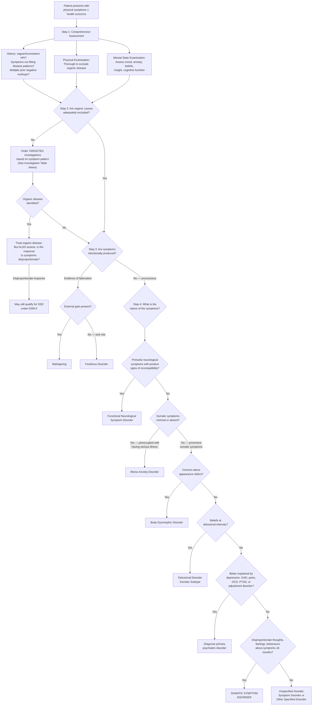

## Diagnostic Criteria

Diagnosis of somatoform disorders is fundamentally a **clinical diagnosis** — there is no blood test, imaging study, or biomarker that confirms it. The diagnosis rests on recognising a specific pattern of symptoms AND maladaptive responses, after appropriate exclusion of organic disease. Understanding the diagnostic criteria in both ICD-10 and DSM-5 is essential because they differ significantly in philosophy [2].

### General Structure of Psychiatric Diagnostic Criteria [2]

Before diving into specifics, recall that psychiatric diagnostic criteria typically consist of:
- **Core (discriminating) symptoms** — present in the defined disorder but seldom in others
- **Associated (characteristic) symptoms** — frequent but also seen in other disorders
- **Minimal duration** of symptoms
- **Distress or impairment** in functioning
- **Exclusion criteria** — ruling out other explanations

---

### A. Somatic Symptom Disorder

This is the "core" diagnosis in the somatoform spectrum. The ICD-10 and DSM-5 criteria differ substantially, and understanding **why** they differ is just as important as memorising them [2].

#### DSM-5 Criteria (Somatic Symptom Disorder, 300.82) [2]

| Criterion | Requirement | Explanation |
|---|---|---|
| **A** | **≥1 somatic symptoms** that are distressing or result in significant disruption of daily life [2] | Note: only ONE symptom is needed. The symptom does NOT need to be medically unexplained — this is the key DSM-5 shift. A patient with known coronary artery disease whose chest pain causes disproportionate distress qualifies. |
| **B** | **Excessive thoughts, feelings, or behaviours** related to the somatic symptoms or associated health concerns, as manifested by **at least one** of: (1) Disproportionate and persistent thoughts about the seriousness of one's symptoms; (2) Persistently high level of anxiety about health or symptoms; (3) Excessive time and energy devoted to these symptoms or health concerns [2] | This is the **positive diagnostic criterion** that makes DSM-5 fundamentally different from ICD-10. The diagnosis is about the **response** to symptoms, not the absence of organic explanation. Only ONE of the three manifestations is required. |
| **C** | Although any one somatic symptom may not be continuously present, the **state of being symptomatic is persistent** (typically **> 6 months**) [2] | Individual symptoms may come and go, but the patient remains chronically symptomatic. The 6-month threshold reflects the chronic nature of the disorder and prevents over-diagnosis of transient illness behaviour. |

**DSM-5 Specifiers:**
- **With predominant pain** — for patients where pain is the dominant symptom (replaces the old DSM-IV "pain disorder")
- **Persistent** — severe symptoms, marked impairment, long duration (> 6 months)
- **Severity**: Mild (only 1 of criterion B symptoms), Moderate (≥2 of criterion B), Severe (≥2 of criterion B + multiple somatic complaints or one very severe somatic complaint)

#### ICD-10 Criteria (Somatization Disorder, F45.0) [2]

| Criterion | Requirement | Explanation |
|---|---|---|
| **(a)** | **≥2 years** of multiple and variable physical symptoms for which **no adequate physical explanation** has been found [2] | Much stricter than DSM-5: requires 2 years (vs 6 months), requires MULTIPLE symptoms (vs ≥1), and critically requires that symptoms be **medically unexplained** |
| **(b)** | **Persistent refusal** to accept the advice or reassurance of several doctors that there is no physical explanation for the symptoms [2] | This criterion captures the maladaptive health behaviour — the doctor-shopping and resistance to reassurance |
| **(c)** | **Some degree of impairment** of social and family functioning attributable to the nature of the symptoms and resulting behaviour [2] | Functional impairment criterion |

<Callout title="ICD-10 vs DSM-5: Why Does It Matter?">
The ICD-10 approach is **more restrictive**: it requires medically unexplained symptoms, multiple symptoms, 2-year duration, and refusal of reassurance. The DSM-5 approach is **broader and more clinically practical**: it does not require symptoms to be unexplained, needs only 1 symptom, requires only 6 months, and focuses on the disproportionate psychological/behavioural response. In practice, many patients who would not meet ICD-10 criteria for somatization disorder DO meet DSM-5 criteria for somatic symptom disorder. Hong Kong uses ICD coding for administrative purposes but clinical teaching increasingly follows DSM-5 conceptualisation [2].
</Callout>

<Callout title="Key Exam Point" type="error">
One single distressing somatic symptom is sufficient for DSM-5 diagnosis, but a **high number of somatic complaints is associated with poorer outcome** [2]. Do not confuse "sufficient for diagnosis" with "typical presentation."
</Callout>

---

### B. Illness Anxiety Disorder

#### DSM-5 Criteria (Illness Anxiety Disorder, 300.7) [2]

| Criterion | Requirement | Explanation |
|---|---|---|
| **A** | **Preoccupation with having or acquiring a serious illness** [2] | The core feature. The patient is consumed by the idea that they have (or will develop) a serious disease. |
| **B** | **Somatic symptoms are not present** or, if present, are only **mild in intensity**. If another medical condition is present or there is high risk for developing one, the preoccupation is **clearly excessive or disproportionate** [2]. | This is the critical separator from SSD: if prominent somatic symptoms exist → SSD, not IAD. IAD patients worry about *disease*, not about *symptoms*. |
| **C** | There is a **high level of anxiety about health**, and the individual is easily alarmed about personal health status [2] | Health anxiety is the engine driving the condition |
| **D** | The individual performs **excessive health-related behaviours** (e.g., repeatedly checks body for signs of illness) **OR** exhibits **maladaptive avoidance** (e.g., avoids doctor appointments and hospitals) [2] | Two subtypes: **care-seeking type** (excessive visits) vs **care-avoidant type** (phobic avoidance of medical settings). Both are maladaptive. |
| **E** | Illness preoccupation has been present for **≥6 months**, but the specific illness feared may change [2] | The fear may shift (e.g., cancer → MS → ALS) but the underlying preoccupation persists |
| **F** | Not better explained by another mental disorder [2] | Must rule out SSD (if prominent somatic symptoms), GAD (if worry extends beyond health), OCD (if intrusive thoughts with rituals), BDD (if about appearance), delusional disorder (if delusional intensity) |

#### ICD-10 Criteria (Hypochondriacal Disorder, F45.2) [2]

| Criterion | Requirement |
|---|---|
| **(a)** | Persistent belief in the presence of **≥1 serious physical illness** underlying the presenting symptom(s), even though repeated investigations and examinations have identified no adequate physical explanation; **OR** a persistent preoccupation with a presumed deformity or disfigurement [2] |
| **(b)** | Persistent refusal to accept reassurance of several doctors [2] |
| Duration | ≥6 months [2] |

Note that ICD-10 hypochondriacal disorder is broader than DSM-5 illness anxiety disorder because it also includes preoccupation with perceived deformity (which DSM-5 would classify as BDD under OCD-related disorders).

---

### C. Functional Neurological Symptom Disorder (Conversion Disorder)

#### DSM-5 Criteria (Functional Neurological Symptom Disorder, 300.11) [2]

| Criterion | Requirement | Explanation |
|---|---|---|
| **A** | **≥1 symptoms of altered voluntary motor or sensory function** | The symptoms must be neurological in nature — motor (weakness, paralysis, movement disorders, gait abnormality, seizures) or sensory (anaesthesia, visual/hearing loss) |
| **B** | Clinical findings provide evidence of **incompatibility** between the symptom and recognised neurological or medical conditions | This is critical: there must be **positive evidence** of functional origin (e.g., Hoover's sign, distractibility of tremor, preserved optokinetic nystagmus in "blindness"), not merely absence of organic findings. The diagnosis is NOT made by exclusion alone. |
| **C** | The symptom or deficit is **not better explained** by another medical or mental disorder | Must rule out genuine neurological disease and other psychiatric conditions |
| **D** | The symptom or deficit causes clinically significant **distress or impairment** in functioning, or warrants medical evaluation | Functional impairment criterion |

**DSM-5 Specifiers:**
- With weakness or paralysis
- With abnormal movement (tremor, dystonia, myoclonus, gait disorder)
- With swallowing symptoms
- With speech symptoms (dysphonia, slurred speech)
- With attacks or seizures (psychogenic non-epileptic seizures/PNES)
- With anaesthesia or sensory loss
- With special sensory symptoms (visual, olfactory, hearing)
- With mixed symptoms
- **With or without psychological stressor** (DSM-5 no longer requires identification of a psychological stressor — this was removed because it was unreliable)

<Callout title="Critical Change from DSM-IV">
DSM-IV required that the clinician judge the symptom to be "associated with psychological factors" and that a psychological stressor be identified. DSM-5 removed both requirements. The diagnosis now rests on **positive neurological examination findings** demonstrating incompatibility with disease, NOT on identifying a psychological cause. This was changed because (1) the psychological link was often assumed rather than demonstrated, and (2) requiring it biased against patients with genuine functional neurological symptoms who could not articulate a stressor.
</Callout>

---

### D. Body Dysmorphic Disorder (DSM-5 — under OCD and Related Disorders) [2]

| Criterion | Requirement |
|---|---|
| **A** | Preoccupation with ≥1 **perceived defects or flaws** in physical appearance that are **not observable or appear slight** to others [2] |
| **B** | At some point during the course, the individual has performed **repetitive behaviours** (mirror checking, excessive grooming, skin picking, reassurance seeking) or **mental acts** (comparing appearance with that of others) in response to the appearance concerns [2] |
| **C** | The preoccupation causes clinically significant **distress or impairment** |
| **D** | Not better explained by an **eating disorder** (concerns about body fat/weight → eating disorder, not BDD) |

**Specifiers:**
- With muscle dysmorphia (preoccupation with being insufficiently muscular)
- Insight specifier: good/fair, poor, absent/delusional [2]

---

### E. Factitious Disorder (DSM-5 — under Somatic Symptom and Related Disorders) [2]

| Criterion | Requirement | Explanation |
|---|---|---|
| **A** | **Falsification** of physical or psychological signs or symptoms, or **induction** of injury or disease, associated with identified **deception** [2] | The patient deliberately produces or fakes symptoms — this is the conscious element. However, the motivation is unconscious. |
| **B** | The individual presents themselves to others as **ill, impaired, or injured** | They want to be perceived as a patient |
| **C** | The deceptive behaviour is evident even in the **absence of obvious external rewards** [2] | No financial gain, no avoiding legal consequences — the gain is internal (assuming the sick role). If external gain is present → malingering, not factitious disorder. |
| **D** | Not better explained by another mental disorder (e.g., delusional disorder) | |

Two subtypes:
- **Factitious disorder imposed on self** (Munchausen syndrome)
- **Factitious disorder imposed on another** (Munchausen syndrome by proxy / factitious disorder by proxy) — caretaker induces illness in someone under their care (e.g., parent → child). This is a form of **child abuse** [2].

---

## Diagnostic Algorithm

The following comprehensive algorithm integrates the diagnostic approach from initial presentation to specific somatoform subtype diagnosis [2]:

---

## Investigation Modalities

### Philosophy of Investigation in Somatoform Disorders

This is where clinical judgement is paramount. There are two competing risks [2]:

1. **Under-investigation** → missing a genuine organic disease (SLE, MS, occult malignancy)
2. **Over-investigation** → false-positive results leading to unnecessary invasive procedures, reinforcing illness behaviour, exposing patients to iatrogenic harm [2]

The guiding principle: **investigations should be judicious and targeted** based on the clinical presentation, not exhaustive or reflexive [2]. Each investigation should be ordered with a specific clinical question in mind.

### A. Investigations to Exclude Organic Disease

These are ordered based on the symptom pattern, not as a blanket screening panel. The rationale for each is to exclude the most important mimics [2]:

| Symptom Pattern | Investigations | Rationale / Key Findings to Look For |
|---|---|---|
| **Non-specific symptoms** (fatigue, weight loss, malaise) | FBC, ESR/CRP, TFTs, fasting glucose/HbA1c, LFTs, RFTs, calcium/PTH, HIV serology, chest X-ray | FBC: anaemia (malignancy, chronic disease), lymphocytosis (infection). ESR/CRP: inflammatory markers elevated in SLE, infection, malignancy. TFTs: hypothyroidism causes fatigue; hyperthyroidism causes anxiety + weight loss. Calcium/PTH: hyperparathyroidism ("bones, stones, moans, groans"). |
| **Pain-predominant** (diffuse pain, headache, back pain, joint pain) | ESR/CRP, ANA, anti-dsDNA, complement, RF/anti-CCP, serum calcium, vitamin D, plain X-rays of affected areas | ANA elevated in SLE, Sjogren's, mixed connective tissue disease. RF/anti-CCP for rheumatoid arthritis. Vitamin D deficiency causes widespread musculoskeletal pain — common in Hong Kong due to indoor lifestyles. |
| **GI symptoms** (nausea, bloating, diarrhoea, abdominal pain) | FBC, coeliac serology (anti-tTG IgA), LFTs, stool studies, faecal calprotectin, consider OGD/colonoscopy if red flags | Coeliac disease is underdiagnosed. Faecal calprotectin distinguishes inflammatory bowel disease (elevated) from functional GI disorders (normal). Red flags for endoscopy: weight loss, rectal bleeding, anaemia, family history of GI malignancy, age > 50 with new symptoms. |
| **Cardiovascular/respiratory** (chest pain, palpitations, dyspnoea) | ECG, troponin (if acute), echocardiography, Holter monitor, chest X-ray, BNP/NT-proBNP, TFTs, pulmonary function tests | ECG: arrhythmias, ischaemic changes. Holter: paroxysmal arrhythmias. BNP: heart failure screen. TFTs: hyperthyroidism causes sinus tachycardia, AF. Always rule out PE in acute chest pain + dyspnoea (D-dimer, CTPA). |
| **Neurological symptoms** (weakness, sensory loss, seizures, movement disorders) | MRI brain/spine, EEG (especially video-EEG for seizures), nerve conduction studies/EMG, visual evoked potentials, lumbar puncture if indicated | MRI: demyelination (MS), space-occupying lesions. Video-EEG: gold standard for distinguishing epileptic seizures from psychogenic non-epileptic seizures (PNES) — normal EEG during the clinical event = functional. NCS/EMG: normal in FND (intact peripheral nerves + muscle). |
| **Endocrine/metabolic mimics** | TFTs, cortisol (AM or 24h urine free cortisol), plasma/urine metanephrines, glucose, calcium/PTH | Phaeochromocytoma: elevated plasma/urine metanephrines (episodic palpitations, hypertension, sweating — classic mimic of panic/somatoform). Cushing's: elevated cortisol (fatigue, weight gain, anxiety, depression). |
| **Autoimmune/inflammatory screen** | ANA, anti-dsDNA, complement (C3, C4), ESR, CRP, ANCA | Especially important in young women with multi-system complaints — SLE can mimic somatoform disorders for years before serological evidence appears. |
| **Infection screen** | HIV serology, hepatitis B/C serology, TB screening (IGRA/Mantoux), blood cultures if febrile | Relevant in Hong Kong: TB remains endemic; hepatitis B prevalence ~7.2% in general population; HIV incidence rising. |

### B. Psychiatric Assessment Tools

These are not "investigations" in the traditional sense but are structured assessment instruments used to quantify and characterise the somatoform presentation:

| Tool | What It Measures | Clinical Utility |
|---|---|---|
| **Patient Health Questionnaire-15 (PHQ-15)** | Severity of 15 common somatic symptoms over past 4 weeks | Validated screening tool for somatic symptom burden. Scores: 0–4 minimal, 5–9 low, 10–14 medium, 15–30 high somatic symptom severity. Useful for monitoring treatment response. |
| **Somatic Symptom Disorder — B Criteria Scale (SSD-12)** | Cognitive, affective, and behavioural aspects of SSD (Criterion B) | 12-item self-report measuring the three DSM-5 Criterion B dimensions: cognitive (catastrophising), affective (health anxiety), behavioural (excessive health-related behaviours). |
| **Whiteley Index (WI-7)** | Health anxiety / hypochondriacal concerns | 7-item self-report screen for illness anxiety. Score ≥ 4 suggests significant health anxiety. |
| **PHQ-9** | Depression severity | Screen for comorbid depression (30–60% comorbidity). Score ≥ 10 = moderate depression warranting treatment. |
| **GAD-7** | Generalised anxiety severity | Screen for comorbid GAD. Score ≥ 10 = moderate anxiety. |
| **Beck Depression Inventory (BDI)** / **Beck Anxiety Inventory (BAI)** | Depression / anxiety symptom severity | Alternative validated scales for quantifying comorbid mood/anxiety symptoms |
| **Structured Clinical Interview for DSM-5 (SCID-5)** | Formal psychiatric diagnostic interview | Gold standard for confirming DSM-5 diagnoses including SSD, IAD, and comorbidities |

### C. Specific Examination Findings in Functional Neurological Symptom Disorder

These are **positive clinical signs** that demonstrate incompatibility with recognised neurological disease — they are the "investigation" for FND, performed at the bedside [2]:

| Sign | How to Perform | What It Demonstrates | Why It Works |
|---|---|---|---|
| **Hoover's sign** (motor) | Place hand under the "weak" leg heel. Ask patient to flex the contralateral (strong) hip against resistance. | Involuntary extension of the "weak" leg occurs (pushing down on examiner's hand), but voluntary hip extension on the same side is "weak" | Contralateral hip flexion reflexively activates ipsilateral hip extensors via the crossed extensor reflex. If the motor pathway were truly damaged, this involuntary activation would also be absent. Its presence proves the pathway is structurally intact. |
| **Tremor entrainment / distractibility** (motor) | Ask the patient to copy a rhythmic tapping movement with the unaffected hand while you observe the tremor | Functional tremor changes frequency to match the tapping rhythm (entrainment) or stops entirely when attention is diverted | Organic tremor has a fixed frequency generated by a pathological oscillator (e.g., basal ganglia circuit in Parkinson's). It does not change with distraction. Functional tremor is generated by voluntary motor circuits and therefore competes with other voluntary tasks. |
| **Drift without pronation** (motor) | Arms outstretched, eyes closed, observe for drift | In functional weakness, the arm drifts downward but does NOT pronate. In UMN lesions, the arm pronates as it drifts (pronator drift) | UMN lesion preferentially weakens supinators → gravity + unopposed pronation. In functional weakness, the mechanism is different — no selective supinator weakness, so the arm falls without rotation. |
| **Give-way weakness** (motor) | Test power in a limb — the patient initially resists, then suddenly "gives way" | Inconsistent force output — initially normal power, then collapses | Organic weakness produces consistent, proportional weakness throughout the range. Give-way pattern suggests effort-dependent weakness. |
| **Non-anatomical sensory loss** (sensory) | Test light touch and pinprick across dermatomes | Sensory loss that splits exactly at the midline (nose, sternum, umbilicus) or does not follow dermatomal/peripheral nerve distributions | True sensory loss from a central lesion spares 1–2 cm around the midline (because midline skin has bilateral innervation from both hemispheres). Exact midline splitting is anatomically impossible with organic disease. |
| **Tubular (tunnel) visual field** (visual) | Test visual fields at 1 metre and then at 2 metres | The visual field remains the same size (tubular) at both distances | With organic lesions, the visual field expands proportionally with distance (like a cone). A fixed-size "tunnel" at all distances is geometrically impossible with real visual field loss. |
| **Preserved optokinetic nystagmus** (visual) | Pass an optokinetic drum/tape across the visual field of a "blind" patient | Nystagmus is present, proving the visual cortex is receiving and processing visual information | Optokinetic nystagmus requires an intact visual pathway from retina to occipital cortex. If the patient were truly cortically blind, no nystagmus would occur. |
| **Video-EEG** (seizures) | Continuous EEG monitoring during a clinical seizure event | Normal EEG during the clinical event | Epileptic seizures produce abnormal EEG activity (spikes, sharp waves, rhythmic discharges). Normal EEG during a seizure = psychogenic non-epileptic seizure (PNES). Additional features: eyes closed during event (eyes typically open in epilepsy), variable semiology, pelvic thrusting, prolonged duration > 2 min, no post-ictal confusion. |

<Callout title="FND Is a Positive Diagnosis, Not a Diagnosis of Exclusion">
A very common mistake is to diagnose FND simply because MRI and blood tests are normal. This is wrong. FND requires **positive examination findings** demonstrating incompatibility with neurological disease (Criterion B of DSM-5). Normal investigations alone are insufficient. You must actively demonstrate signs like Hoover's, tremor entrainment, or non-anatomical sensory loss [2].
</Callout>

### D. Investigation Pitfalls

| Pitfall | Consequence | How to Avoid |
|---|---|---|
| **Ordering blanket screening panels** | False positives (e.g., mildly elevated ANA in a healthy person) → unnecessary follow-up, anxiety, invasive procedures | Target investigations to the clinical question. Ask: "What specific disease am I trying to exclude?" |
| **Repeating previously normal investigations** | Reinforces illness behaviour; does not provide lasting reassurance; wastes resources [2] | Review old records before ordering. One thorough workup is sufficient unless new symptoms emerge. |
| **Investigating to "reassure" the patient** | Paradoxically increases anxiety — negative results do NOT provide lasting reassurance in somatoform disorders [2] | Explain to the patient upfront that normal results are expected and are GOOD news, not evidence that "they haven't found it yet." |
| **Missing incidental findings** | Incidentalomas (adrenal, thyroid, renal, hepatic) trigger further workup that may never have been needed | Only order imaging with a clear indication. If incidental findings arise, follow established guidelines for their management, not the patient's anxiety. |
| **Over-investigating in factitious disorder** | The patient may actively interfere with samples, inject themselves with substances, or tamper with monitoring equipment | If factitious disorder is suspected, observe specimen collection, check for injection marks, consider toxicology screen, review records from other hospitals. |

---

## Summary of Diagnostic Approach

<Callout title="High Yield Summary — Diagnosis">

**Somatic Symptom Disorder (DSM-5):**
- Criterion A: ≥1 distressing somatic symptom (medically explained or not)
- Criterion B: Disproportionate thoughts (catastrophising), anxiety about health, OR excessive time/energy devoted to symptoms — at least ONE required
- Criterion C: Persistent state of being symptomatic, typically > 6 months
- Key difference from ICD-10: DSM-5 does NOT require symptoms to be medically unexplained; ICD-10 requires ≥2 years + no physical explanation + refusal of reassurance

**Illness Anxiety Disorder (DSM-5):**
- Preoccupation with having/acquiring serious illness + minimal/no somatic symptoms + ≥6 months
- Two subtypes: care-seeking vs care-avoidant
- If prominent somatic symptoms present → SSD, not IAD

**Functional Neurological Symptom Disorder (DSM-5):**
- Neurological symptoms with clinical evidence of INCOMPATIBILITY with recognised disease
- Requires POSITIVE signs (Hoover's, entrainment, non-anatomical sensory loss) — NOT just normal investigations
- No longer requires identified psychological stressor

**Investigation Principles:**
- Judicious and targeted, not exhaustive
- Each test must answer a specific clinical question
- False positives are dangerous — may trigger iatrogenic cascade
- Normal results do NOT reassure somatoform patients
- Review old records before repeating investigations
</Callout>

---

<ActiveRecallQuiz
  title="Active Recall - Diagnostic Criteria and Investigations for Somatoform Disorders"
  items={[
    {
      question: "List the three DSM-5 criteria (A, B, C) for somatic symptom disorder and explain what makes each criterion unique compared to ICD-10.",
      markscheme: "A: >=1 somatic symptom causing distress or disruption (ICD-10 requires multiple symptoms). B: Excessive thoughts, health anxiety, OR excessive time/energy devoted to symptoms (at least 1 of 3) — this is the positive criterion; ICD-10 instead requires refusal of reassurance. C: Persistent state of being symptomatic, typically >6 months (ICD-10 requires >=2 years). Key difference: DSM-5 does NOT require symptoms to be medically unexplained; ICD-10 does."
    },
    {
      question: "A patient presents with apparent seizures. Video-EEG shows normal electrical activity during the event. What is the diagnosis and what additional clinical features distinguish PNES from epileptic seizures?",
      markscheme: "Diagnosis: psychogenic non-epileptic seizures (PNES) — a subtype of functional neurological symptom disorder. Distinguishing features: (1) normal EEG during event, (2) eyes typically closed during PNES (open in epilepsy), (3) variable semiology between events, (4) pelvic thrusting, (5) prolonged duration >2 minutes, (6) no post-ictal confusion or only brief pseudo-post-ictal state, (7) may be suppressed by observer suggestion or distraction."
    },
    {
      question: "Explain why DSM-5 removed the requirement for an identified psychological stressor in the diagnosis of functional neurological symptom disorder.",
      markscheme: "Two reasons: (1) The psychological link was often assumed rather than demonstrated by clinicians, leading to unreliable diagnoses. (2) Requiring it biased against patients with genuine functional neurological symptoms who could not articulate a stressor, potentially delaying appropriate treatment. DSM-5 now requires positive neurological examination findings demonstrating incompatibility with recognised disease instead."
    },
    {
      question: "What is Hoover's sign and explain the neurophysiological basis for why it works to detect functional weakness.",
      markscheme: "Hoover's sign: examiner places hand under the 'weak' leg heel and asks patient to flex the contralateral (strong) hip. In functional weakness, involuntary extension of the 'weak' leg occurs during contralateral flexion, but voluntary extension of the same leg is weak. Neurophysiological basis: contralateral hip flexion activates the crossed extensor reflex, which reflexively engages ipsilateral hip extensors. If the corticospinal tract were truly damaged, this involuntary activation would also be impaired. Its presence proves the motor pathway is structurally intact."
    },
    {
      question: "Why can over-investigation paradoxically harm patients with somatoform disorders? Give three specific mechanisms.",
      markscheme: "(1) False-positive or incidental findings trigger further invasive workup and unnecessary procedures with iatrogenic risk. (2) Repeated investigations reinforce the patient's belief that clinicians suspect something serious, perpetuating illness behaviour and health anxiety. (3) Negative results do NOT provide lasting reassurance (core feature of somatoform disorders), so the cycle of investigation-anxiety is never broken. Additional: wastes healthcare resources and delays appropriate psychiatric management."
    },
    {
      question: "Compare the DSM-5 criteria for illness anxiety disorder vs somatic symptom disorder — what is the single most important differentiating feature?",
      markscheme: "The single most important differentiator is the presence or absence of significant somatic symptoms. In IAD, somatic symptoms are minimal or absent — the patient is preoccupied with the IDEA of having a serious disease. In SSD, the patient has >=1 prominent somatic symptoms causing distress, with disproportionate cognitive/emotional/behavioural responses. If prominent somatic symptoms are present, diagnose SSD, not IAD."
    }
  ]}
/>

## References

[2] Senior notes: ryanho-psych.md (Sections 8.4.1, 8.4.2.1, 8.4.2.2, 8.4.2.3 — Approach to MUS, Somatic Symptom Disorder diagnostic criteria, Illness Anxiety Disorder diagnostic criteria, Conversion disorder, Other Related Disorders)
