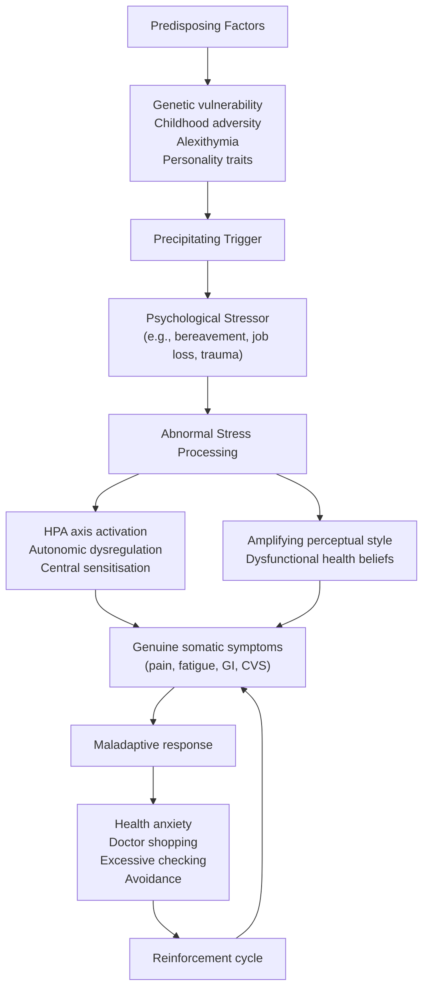
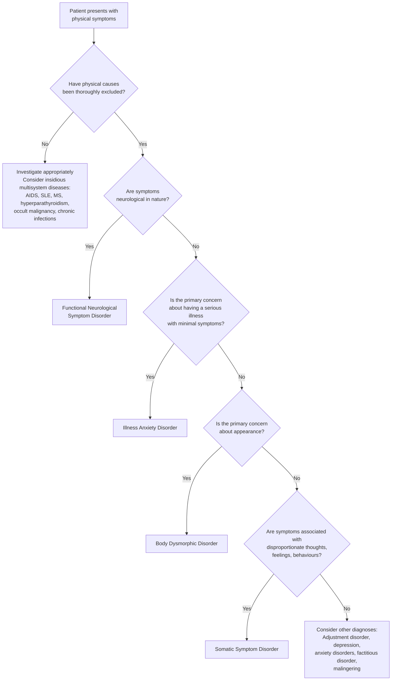

# Somatoform Disorders

## 1. Definition and Terminology

Somatoform disorders (now reclassified as **Somatic Symptom and Related Disorders** in DSM-5) represent a group of psychiatric conditions characterised by the presence of physical (somatic) symptoms that cause significant distress and functional impairment, and which are associated with disproportionate and maladaptive thoughts, feelings, and behaviours related to those symptoms [2].

Let's break the name down from its roots:
- **"Somato-"** (Greek: *soma* = body) → relating to the body
- **"-form"** (Latin: *forma* = shape/appearance) → taking the form of

So "somatoform" literally means **"taking the form of a bodily [disease]"** — i.e., psychiatric distress manifesting as if it were physical illness.

### Key Terminology Distinctions

Understanding the terminology is critical because it has evolved significantly and the naming itself reveals conceptual shifts in how we think about these conditions [2]:

| Term | Definition | Limitations |
|---|---|---|
| **Somatization** | The expression of emotional distress as bodily symptoms | Assumes symptoms are merely a manifestation of underlying psychopathology — not always true |
| **Functional somatic symptoms** | Disturbance in bodily function without known structural pathology | Implies a mind-body duality (functional ≠ "not real"); patients may feel dismissed |
| **Medically unexplained symptoms (MUS)** | Clinical symptoms that cannot be explained by identifiable organic disease | "Unexplainable" is problematic — cause unknown ≠ unexplainable; science may simply not yet understand the mechanism |

<Callout title="Why Did DSM-5 Change the Approach?">
The old approach (DSM-IV, ICD-10) required proving that symptoms were **"not medically explained"** — this forced clinicians into proving a negative. DSM-5 shifted the focus to the **positive criterion**: the degree of distress, preoccupation, and maladaptive behaviour the patient exhibits in response to their symptoms. Under DSM-5, even patients WITH a known medical condition can receive the diagnosis if their response to symptoms is disproportionate [2].
</Callout>

### Two Perspectives on MUS [2]

Medically unexplained symptoms have traditionally been classified from two perspectives:

1. **Medical approach**: Identify patterns of physical symptoms and label them syndromically — e.g., irritable bowel syndrome (IBS), fibromyalgia, chronic fatigue syndrome, non-cardiac chest pain. These are "functional" diagnoses within their respective specialties.
2. **Psychiatric approach**: Identify psychiatric syndromes as the basis of symptoms — e.g., anxiety and depressive disorders, somatoform disorders, factitious disorders.

In reality, these perspectives are complementary, not competing. Many patients sit at the intersection.

---

## 2. Epidemiology

### Prevalence [2]
- **General population**: 4–6%
- **Primary care patients**: ~17% (i.e., roughly 1 in 6 patients presenting to a GP has medically unexplained symptoms — this is remarkably common)
- **Illness anxiety disorder** specifically: prevalence ~0.75%, though symptoms of health anxiety occur in 5–30% of outpatients [2]

### Demographics [2]
- **Sex**: Female > Male (approximately 10:1 for somatic symptom disorder in some older studies, though this ratio narrows with DSM-5 criteria)
- **Age of onset**: Majority begin during **adolescence** and are established by **mid-20s**
- **Socioeconomic status**: More common in those with **lower education** and **lower socio-economic status**
- **Illness anxiety disorder**: M:F ≈ 1:1, more common among unemployed and those with lower education and disability [2]

### Associations [2]
- **Personal history**: Childhood chronic illness, sexual abuse, childhood/adult trauma
- **Concurrent general medical disorders** (especially in older patients — important not to miss organic disease that co-exists)
- **Comorbid psychiatric disorders**: Both Axis I (depression, dysthymia, anxiety disorders, substance dependence) and Axis II (personality disorders)
- **Family history** of chronic illnesses

<Callout title="Why Is It More Common in Lower Socioeconomic Groups?">
In communities where there is less social acceptance of emotional expression, or where psychological language/literacy is limited, distress is more likely to be channelled through bodily complaints. Additionally, reduced access to mental health services means these patients present to medical services with physical complaints instead [2].
</Callout>

---

## 3. Anatomy and Function: The Neurobiology of Somatization

While there is no single "lesion" in somatoform disorders, understanding the relevant neuroanatomy helps explain why emotional distress can produce genuine physical symptoms.

### Brain Regions Involved

| Brain Region | Role in Somatization |
|---|---|
| **Anterior cingulate cortex (ACC)** | Integrates emotional and cognitive processing; modulates pain perception. Hyperactivation → amplified awareness of bodily sensations |
| **Insular cortex** | Primary interoceptive cortex — processes internal body signals (heartbeat, gut sensations, pain). Altered insula function → distorted body signal interpretation |
| **Prefrontal cortex (PFC)** | Top-down modulation of emotional responses. Reduced PFC regulation → inability to "dampen" alarm signals from the body |
| **Amygdala** | Threat detection centre. Heightened amygdala reactivity → normal body sensations tagged as "dangerous" |
| **Somatosensory cortex** | Processes somatic sensations. Increased somatosensory gain → amplification of normal stimuli |
| **Hippocampus** | Memory consolidation. Links between adverse memories and body schema may perpetuate somatic symptom recall |

### The Amplification Model [2]

The key neurobiological concept is that there are **alterations in brain activation related to how adverse events are processed** and in the **links between emotion, memory, and body schema** [2]. In plain terms:

1. Normal bodily sensations (e.g., a slight stomach cramp, a muscle twitch) occur in everyone, all the time.
2. In patients with somatoform disorders, these sensations are **amplified** at the cortical level — the brain turns up the volume.
3. The amplified signal is then **misattributed** to a serious medical disease due to dysfunctional health-related assumptions.
4. This generates anxiety → further heightens vigilance → selectively confirms fears → a self-perpetuating cycle.

### The Hypothalamic-Pituitary-Adrenal (HPA) Axis

Chronic stress activates the HPA axis, leading to sustained cortisol elevation. This can produce genuine physiological changes:
- Increased muscle tension → pain (headaches, back pain)
- Altered gut motility → nausea, bloating, diarrhoea
- Autonomic dysregulation → palpitations, sweating, dizziness
- Immune dysregulation → fatigue, malaise

This is why somatoform symptoms are **real** — they are not "made up." The patient genuinely experiences pain, nausea, dizziness. The difference is that the origin is a dysregulated stress-body interface rather than a structural lesion.

---

## 4. Aetiology and Pathophysiology

The aetiology is best understood through the **biopsychosocial model** [2]:

### 4.1 Biological Factors

| Factor | Detail |
|---|---|
| **Genetics** | Heritability **7–21%** — modest but real. May be involved in the co-occurrence of anxiety and depression with somatic symptoms [2] |
| **Neurobiological** | Alterations in brain activation related to processing of adverse events; abnormal links between emotion, memory, and body schema [2]. In illness anxiety disorder: altered plasma neurotrophin-3, platelet 5-HT levels, and pituitary volume [2] |
| **Autonomic dysregulation** | Chronic sympathetic overdrive produces genuine autonomic symptoms (palpitations, sweating, GI disturbance) |
| **Central sensitisation** | Repeated activation of pain pathways lowers the threshold for future pain perception — explains why chronic pain syndromes are so common in somatoform disorders |

### 4.2 Psychological Factors

This is where the major explanatory models live [2]:

#### Model 1: Somatization as a Masked Presentation of Psychiatric Illness [2]
- An underlying psychiatric disorder (e.g., depression, anxiety) exists.
- **Psychological defences** block the expression of this as psychiatric symptoms.
- Instead, the distress is **converted** into unexplained physical symptoms.
- The patient presents to healthcare with somatic complaints, and the underlying psychiatric disorder remains hidden.

#### Model 2: Somatization as an Amplifying Personal Perceptual Style [2]
- The patient has an **amplifying perceptual style** — normal bodily sensations are perceived with greater intensity.
- This leads to the expression of psychological distress as physical symptoms.
- An underlying psychiatric disorder may or may not be present.

#### Model 3: Illness-Related Beliefs [2]
- The patient holds **over-inclusive/unrealistic concepts of good health** (e.g., "I should never feel any discomfort").
- **Dysfunctional assumptions** about the prevalence and communicability of severe illnesses (e.g., "headache usually means a brain tumour").
- This leads to **increased attention** to bodily sensations → **maladaptive interpretation** → anxiety → more attention → cycle.

#### Model 4: Alexithymia [2]
- **Alexithymia** (Greek: *a-* = without, *lexis* = words, *thymos* = emotions): literally "without words for emotions."
- Difficulty identifying, describing, and expressing emotions.
- Psychological distress that cannot be verbalised is instead expressed through the body.

#### Model 5: Somatization as Care-Seeking Behaviour [2]
- Psychological distress acts as a **catalyst** to seek medical care for common, innocuous physical symptoms that would otherwise be ignored.
- The healthcare system may inadvertently reinforce this (investigations, specialist referrals, follow-ups).

### 4.3 Social Factors

| Factor | Detail |
|---|---|
| **Developmental factors** | Poor emotional awareness during childhood; higher levels of negative emotions in childhood [2] |
| **Childhood adverse experiences** | Inadequate food, clothing, attention; insecure attachment [2] |
| **Abuse** | Sexual abuse, childhood physical abuse — strong risk factors [2] |
| **Personality factors** | Often already very health-conscious in adolescence [2] |
| **Socioeconomic** | Lower socio-economic status, lower education [2] |
| **Cultural factors** | In cultures where **social acceptance of emotional expression is low**, distress tends to be expressed as MUS [2]. This is particularly relevant in **Hong Kong** and broader East Asian cultures, where stigma around mental illness remains significant and somatic complaints are a culturally sanctioned form of expressing distress |

<Callout title="Hong Kong Context" type="idea">
In Hong Kong, the concept of **neurasthenia** (神經衰弱, *shenjing shuairuo*) — characterised by fatigue, headaches, dizziness, poor concentration, and sleep disturbance — remains a culturally important idiom of distress. ICD-10 retains neurasthenia as a diagnosis (F48.0), though DSM-5 does not. Many patients who would be classified as having somatic symptom disorder in DSM-5 present with neurasthenia-like complaints in Hong Kong primary care. Understanding this cultural context is essential for effective communication and management.
</Callout>

### Pathophysiology Summary — Integrative Model

---

## 5. Classification

### 5.1 Evolution of Classification

The classification has undergone major changes across ICD-10, DSM-IV, and DSM-5 [2]:

| ICD-10 | DSM-IV | DSM-5 |
|---|---|---|
| Somatization disorder | Somatization disorder | **Somatic symptom and related disorders** |
| Undifferentiated somatoform disorder | Undifferentiated somatoform disorder | Somatic symptom and related disorders |
| Hypochondriacal disorder | Hypochondriasis | **Illness anxiety disorder** |
| Somatoform autonomic dysfunction | No category | No category |
| Persistent pain disorder | Pain disorder associated with psychological factors (and a general medical condition) | Somatic symptom disorder with predominant pain, or psychological factors affecting other medical conditions |
| Other somatoform disorders | Somatoform disorders NOS | Unspecified somatic symptom disorder |
| *No category* | Body dysmorphic disorder | Moved to **Obsessive-Compulsive and Related Disorders** |
| *No category* | Conversion disorder | **Functional neurological symptom disorder** |
| Neurasthenia | No category | No category |

### 5.2 DSM-5 Categories (Current)

The key DSM-5 conditions under this umbrella [2]:

1. **Somatic Symptom Disorder (SSD)** — the "core" disorder
   - Previously: somatoform disorder / Briquet syndrome
   - Emphasises disproportionate distress/behaviour in response to somatic symptoms
   - Does NOT require symptoms to be medically unexplained

2. **Illness Anxiety Disorder (IAD)**
   - Previously: hypochondriasis
   - Preoccupation with having a serious illness
   - Minimal or no somatic symptoms (if significant somatic symptoms present → classify as SSD instead)

3. **Functional Neurological Symptom Disorder (FND)**
   - Previously: conversion disorder / hysteria
   - Neurological symptoms (weakness, paralysis, seizures, sensory loss) incompatible with recognised neurological disease
   - The "conversion" refers to the psychodynamic concept of converting psychological conflict into neurological symptoms

4. **Psychological Factors Affecting Other Medical Conditions**
   - A known medical condition exists, but psychological factors adversely affect its course

5. **Factitious Disorder**
   - Now classified under this umbrella in DSM-5
   - Conscious fabrication of symptoms, but unconscious motivation (to assume the sick role)

<Callout title="Critical Distinction Table" type="error">

| | Insight into psychological basis | Illness behaviour | Motivation |
|---|---|---|---|
| **Somatoform disorders** | None (unconscious process) | Feels genuinely ill (unconscious process) | ?Due to underlying psychological distress |
| **Factitious disorders** | None (unconscious process) | Feels ill (conscious process — deliberately fabricates symptoms) | To assume the sick role |
| **Malingering** | Conscious process | Does NOT feel ill; aims to look ill | External gain (money, avoiding work/prison, drugs) |

This distinction is extremely high-yield for exams. The key differentiator is the **level of consciousness** at each step [2].
</Callout>

---

## 6. Clinical Features

### 6.1 Somatic Symptom Disorder — Symptoms and Signs

The clinical presentation of somatic symptom disorder involves two domains: the **somatic symptoms themselves** and the **maladaptive psychological/behavioural response** [2].

#### A. Somatic Symptoms

One or more somatic symptoms that are distressing and/or result in significant disruption of daily life [2]. The symptom may be long-standing, and while a single distressing somatic symptom is sufficient for diagnosis, a **high number of somatic complaints is associated with poorer outcome** [2].

| System | Common Symptoms | Pathophysiological Basis |
|---|---|---|
| **Non-specific** | Fatigue, syncope, dizziness | HPA axis activation → cortisol excess → fatigue. Autonomic dysregulation → vasovagal tendency → syncope/presyncope. Hyperventilation from anxiety → respiratory alkalosis → dizziness |
| **Pain** | Joint pain, limb pain, back pain, headache, chest pain, abdominal pain, dysuria, diffuse pain | Central sensitisation: repeated activation of nociceptive pathways lowers pain thresholds. Chronic muscle tension from sympathetic overdrive → myofascial pain. Visceral hypersensitivity (especially GI pain) |
| **Gastrointestinal** | Nausea, vomiting, abdominal pain, bloating, gas, diarrhoea | Gut-brain axis dysregulation: stress → vagal and enteric nervous system activation → altered motility, visceral hypersensitivity. Excess cortisol → increased gastric acid, altered mucosal blood flow |
| **Cardiovascular/Respiratory** | Chest pain, shortness of breath, palpitations | Sympathetic overdrive → tachycardia, awareness of heartbeat (palpitations). Hyperventilation → chest wall tightness, air hunger. Non-cardiac chest pain from musculoskeletal tension or oesophageal dysmotility |
| **Neurological** | Movement disorders, sensory loss, weakness, paralysis | In conversion (FND): functional disconnection between motor planning areas (supplementary motor area) and primary motor cortex — the "intention to move" fails to reach execution, despite intact structural pathways |
| **Urogenital** | Dyspareunia, dysmenorrhoea, erectile dysfunction | Pelvic floor hypertonicity from chronic stress → dyspareunia. Autonomic imbalance → erectile dysfunction. Altered prostaglandin sensitivity → dysmenorrhoea |

#### B. Excessive Thoughts, Worries, and Behaviours [2]

This is the **defining feature** that distinguishes SSD from simply having physical symptoms:

| Feature | Explanation |
|---|---|
| **Disproportionate cognitive/emotional/behavioural responses** | The level of worry, distress, and time devoted to health concerns is far out of proportion to the actual severity of the symptom. A mild headache might trigger days of anguish and multiple emergency visits. |
| **Variable insight** | Some patients recognise their worry is irrational; others are convinced they have a serious disease. This ranges from good insight → poor insight → delusional conviction. |
| **Excessive checking behaviours** | e.g., excessive BP checking, excessive breast self-examination, compulsive Googling of symptoms, repeated self-palpation of lymph nodes |
| **High healthcare utilisation** | Doctor-shopping, multiple examinations/investigations, pressing doctors to order more invasive diagnostic tests. **Repeated negative workups do NOT alleviate their fears** [2] — this is a cardinal feature. |
| **Comorbid anxiety/depression (30–60%)** | Some somatic symptoms may actually arise from these comorbid disorders (e.g., fatigue and poor concentration from depression, palpitations and chest tightness from panic disorder) [2] |

<Callout title="Exam Tip" type="idea">
When you see a patient who has had **multiple negative investigations** across **multiple specialties** and **continues to seek further tests despite reassurance** — think somatic symptom disorder. The key is not the absence of organic disease, but the **disproportionate and maladaptive response** to symptoms.
</Callout>

### 6.2 Clinical Course [2]

- **Chronic, fluctuating course**: 50–75% may eventually improve, but rarely completely resolve and may relapse subsequently
- **Negative prognostic factors**:
  - Older age
  - Greater severity and number of complaints
  - Comorbid depression/anxiety
  - Maladaptive personality traits (e.g., harm avoidance, low cooperativeness)
- **Potential complications**:
  - **Unnecessary invasive procedures with iatrogenic complications** (e.g., exploratory laparotomy, repeated endoscopy, unnecessary biopsies)
  - **Substance use disorders** in attempt to manage distress — e.g., narcotic analgesics, benzodiazepines [2]

---

### 6.3 Conversion (Functional Neurological Symptom) Disorder [2]

#### Pathogenesis
- **Unclear**, but involves biological, psychological, and social factors [2]:
  - **Cognitive**: Maladaptive exaggeration of minor symptoms due to assumption of severe underlying disease
  - **Neurobiological**: Altered brain structure and function on imaging studies — particularly abnormal connectivity between limbic regions and motor/sensory cortex
  - **Psychodynamic**: Classical description of a **conversion** of subconscious psychological conflict into somatic signs and symptoms

#### Symptoms and Signs [2]

| Feature | Examples | Pathophysiological Basis |
|---|---|---|
| **Non-epileptic seizures** | "Pseudoseizures" — but this term is increasingly avoided as pejorative | Dissociative mechanism: limbic system "overrides" cortical control. Unlike true epileptic seizures, EEG is normal during the event. Eyes typically closed (eyes open in true seizures). |
| **Weakness/paralysis** | Hemiparesis, paraparesis, monoparesis | Functional disconnection between volitional motor planning areas and primary motor cortex. Hoover's sign positive: involuntary hip extension when flexing contralateral hip, but weakness of voluntary hip extension on the same side. |
| **Movement disorders** | Tremor, dystonia, myoclonus, gait disorder | Functional tremor: variable frequency, distractible (changes/stops when attention diverted to another task). Entrainment sign positive. |
| **Speech disturbances** | Dysphonia, mutism, stuttering | Functional disconnection in speech motor areas |
| **Globus sensation** | Sensation of a lump in the throat | Cricopharyngeal muscle tension from autonomic arousal |
| **Sensory symptoms** | Numbness, paraesthesia | Does not follow dermatomal or peripheral nerve distribution — often "non-anatomical" patterns (e.g., exact midline split in sensation) |
| **Visual symptoms** | Tunnel vision, blindness | Functional visual loss: optokinetic nystagmus preserved (impossible if truly blind). Intact pupillary reflexes. |
| **Cognitive symptoms** | Pseudodementia-like presentation | Functional cognitive disorder |

#### Key Clinical Features of FND [2]

- Symptoms are **highly suggestible**: vary considerably in response to comments of other people, especially doctors
- Can be **reinforced by treatment measures** — e.g., providing a wheelchair for a patient who has difficulty walking may perpetuate the symptom
- **± La belle indifférence**: Some patients are surprisingly unconcerned about their symptoms — though this is **not** pathognomonic and can occur in organic disease too
- **Psychiatric comorbidities** (up to 90%): depression (32%), GAD (21%), panic disorder (36%), dissociation (47%), personality disorders (e.g., borderline, histrionic, narcissistic) [2]

---

### 6.4 Illness Anxiety Disorder (Previously Hypochondriasis) [2]

#### Epidemiology [2]
- Prevalence: **0.75%** (but health anxiety symptoms occur in 5–30% of outpatients)
- Demographics: **M:F ≈ 1:1**, more common among unemployed, lower education, disability

#### Clinical Presentation [2]

The core feature is **preoccupation with having or acquiring a serious illness** despite minimal or no somatic symptoms:

| Feature | Pathophysiological Basis |
|---|---|
| **Preoccupation with having a serious illness** | Normal body sensations are perceived abnormally intensely → misattributed to serious medical disease due to dysfunctional health-related assumptions [2] |
| **Excessive health-related anxiety** | The misattribution generates excessive health-related anxiety → drives maladaptive reassurance-seeking behaviour [2] |
| **Maladaptive behaviour** | Excessive body checking, repeated medical consultations, internet searching ("cyberchondria"), or alternatively phobic avoidance of medical settings |
| **Increased vigilance** | Heightened monitoring of bodily sensations → selectively confirms fears and negates the effect of reassurance [2] |
| **Reinforcement cycle** | Reassurance provides brief relief → anxiety returns → seeks more reassurance → cycle perpetuates [2] |

#### Aetiology of Illness Anxiety Disorder [2]
- **Neurobiology**: Altered plasma neurotrophin-3, platelet 5-HT, pituitary volume [2]
- **Cognitive basis**: Normal body sensation perceived abnormally intensely → misattributed to serious disease → excessive health anxiety → maladaptive behaviour → increased vigilance → selectively confirms fears → reinforces persistent preoccupation [2]

---

### 6.5 Body Dysmorphic Disorder (BDD) [2]

*Note: In DSM-5, BDD has been moved to Obsessive-Compulsive and Related Disorders, but it is discussed here due to historical links to somatoform disorders.*

#### Epidemiology [2]
- Prevalence: **2–4%**, commonly underdiagnosed

#### Pathogenesis [2]
- **Genetics**: Heritability 43%, associated with GABA-A γ2 receptor gene
- **Neurobiology**: Abnormal visual processing on fMRI, impaired executive function
- **Psychosocial**: Childhood neglect and abuse

#### Clinical Features [2]

| Feature | Details |
|---|---|
| **Preoccupation with perceived defect** | Non-existent or slight defects in physical appearance of ≥1 body parts. Usually perceived as unattractive, abnormal, or deformed → very distressing. Common areas: skin, hair, nose, stomach, breast/chest, eyes, symmetry |
| **Compulsions (rituals)** | Repetitive behaviours driven by appearance preoccupations: camouflaging (~90%), comparing (90%), mirror checking (90%), excessive grooming (> 50%), seeking reassurance (50%), clothes changing, skin picking, excessive exercising, compulsive shopping |
| **Poor insight** | Often associated with overvalued ideas or even delusions |
| **Ideas/delusions of reference (~60%)** | Belief that others take special notice of their perceived defect, talk about or make fun of their appearance → social avoidance |
| **Social anxiety and avoidance** | Can mimic social anxiety disorder |
| **Emotional distress** | Decreased self-esteem, depressed mood, guilt, shame, perfectionism, neuroticism |
| **Suicide risk** | ~80% lifetime risk of suicidal ideation, ~25% attempt [2] — this is very high and must not be overlooked |

#### Comorbidities [2]
Depression (75%), social anxiety (40%), personality disorder (40–100%), substance use disorders (30–50%), OCD (33%), eating disorder (33%), panic disorder (13–20%)

#### Course [2]
Typically chronic; recovery in only ~20%

---

### 6.6 Suggestive Features from History and Examination [2]

#### History
- **Vague, inconsistent HPI** mixed with normal physical sensations and abnormal checking behaviour
- **Symptoms do not fit** into known disease patterns or anatomical confines
- **Persistent anxiety and concern** despite repeated help-seeking, reassurance, negative investigations, and treatment [2]

#### Physical Examination [2]
- **Must be thorough** — to exclude any insidious underlying organic condition
- Remember: the purpose of examination is dual — to rule out organic disease AND to demonstrate to the patient that you are taking their symptoms seriously

#### Investigations [2]
- **Must be judicious** — false-positive results may lead to unnecessary invasive investigations and risks
- The challenge: too few investigations risks missing organic disease; too many investigations reinforces the illness behaviour cycle and exposes patients to iatrogenic harm

<Callout title="The Investigation Trap" type="error">
A common mistake is to keep ordering investigations to "reassure" the patient. In somatoform disorders, negative results do NOT provide lasting reassurance. Each new investigation can paradoxically reinforce the patient's belief that something serious is being looked for, and any incidental/false-positive finding can trigger further anxiety and invasive workup. Be targeted, not exhaustive.
</Callout>

---

## 7. Approach to Medically Unexplained Symptoms [2]

### Diagnostic Flow

The approach requires systematic exclusion of organic causes FIRST:

### Basic Approaches to MUS (Key Principles) [2]

These principles form the foundation of the initial clinical approach:

1. **Emphasise that the symptoms are real** and familiar to the clinician
2. **Explain the role of psychosocial factors** in ALL medical conditions (not just "psychiatric" ones)
3. **Offer and discuss a psychosocial explanation** of the symptoms
4. **Allow adequate time** for the patient and partner/family to ask questions
5. **Agree a treatment plan** to include:
   - Treatment of any minor medical problem contributing to the symptoms
   - Treatment of any associated psychiatric disorder (commonly anxiety or depression)
   - If appropriate: improve fitness by **graded activity**
   - If appropriate: **diary keeping** to explore the relationship between symptoms and possible psychosocial causes

---

## 8. High Yield Summary

<Callout title="High Yield Summary">

**Definition**: Somatoform disorders = psychiatric conditions where physical symptoms cause significant distress with disproportionate maladaptive thoughts, feelings, and behaviours. DSM-5 renamed these "Somatic Symptom and Related Disorders."

**Key Conceptual Shift (DSM-5)**: No longer requires symptoms to be "medically unexplained" — focuses on the disproportionate response to symptoms.

**Epidemiology**: 4–6% general population, 17% primary care. F > M. Onset in adolescence/early adulthood. Lower SES and education.

**Aetiology** — Biopsychosocial:
- Biological: Genetics (7–21% heritability), neurobiological alterations in emotion-body schema processing
- Psychological: Amplifying perceptual style, illness-related beliefs, alexithymia, psychodynamic conversion
- Social: Childhood adversity/abuse, low SES, cultural suppression of emotional expression (highly relevant in Hong Kong)

**Classification (DSM-5)**:
- Somatic Symptom Disorder (SSD): ≥1 distressing somatic symptom + disproportionate response (≥6 months)
- Illness Anxiety Disorder (IAD): Preoccupation with serious illness, minimal/no somatic symptoms
- Functional Neurological Symptom Disorder (FND): Neurological symptoms incompatible with recognised disease
- Body Dysmorphic Disorder: Now under OCD-related disorders

**Key Clinical Features**:
- Multiple somatic symptoms across systems (pain, GI, CVS, neuro, urogenital)
- Disproportionate worry, checking behaviours, doctor-shopping
- Negative workups do NOT reassure
- Comorbid anxiety/depression in 30–60%

**Critical Distinctions**:
- Somatoform = unconscious/unconscious/psychological distress
- Factitious = unconscious/conscious/sick role
- Malingering = conscious/deliberate/external gain

**Course**: Chronic, fluctuating. 50–75% improve, rarely fully resolve. Complications: iatrogenic harm from unnecessary procedures, substance use disorders.

**Investigation Principle**: Be judicious — too many investigations reinforce illness behaviour and risk iatrogenic harm.
</Callout>

---

<ActiveRecallQuiz
  title="Active Recall - Somatoform Disorders"
  items={[
    {
      question: "What is the key conceptual shift between DSM-IV and DSM-5 in the diagnostic approach to somatic symptom disorder?",
      markscheme: "DSM-IV required symptoms to be medically unexplained. DSM-5 shifted focus to the degree of disproportionate distress, maladaptive thoughts, feelings, and behaviours in response to somatic symptoms. A known medical condition does not exclude the diagnosis under DSM-5."
    },
    {
      question: "Name the four main psychological models explaining somatization and briefly describe each.",
      markscheme: "1. Masked presentation of psychiatric illness: psychological defences block psychiatric expression, distress converts to physical symptoms. 2. Amplifying perceptual style: normal bodily sensations amplified and misinterpreted. 3. Illness-related beliefs: dysfunctional health assumptions lead to maladaptive interpretation of bodily sensations. 4. Alexithymia: inability to express emotions verbally leads to somatic expression of distress."
    },
    {
      question: "How do you differentiate somatoform disorders, factitious disorders, and malingering?",
      markscheme: "Somatoform: unconscious insight, unconscious illness behaviour, motivated by psychological distress. Factitious: unconscious insight, conscious fabrication of symptoms, motivated by assuming the sick role. Malingering: conscious awareness, deliberate feigning of illness, motivated by external gain (money, avoiding obligations)."
    },
    {
      question: "A patient with functional neurological symptom disorder presents with left leg weakness. Describe Hoover sign and explain why it is useful.",
      markscheme: "Hoover sign: examiner places hand under the weak leg heel and asks patient to flex the contralateral (strong) hip. In functional weakness, involuntary extension of the weak leg occurs (pushing down on examiner hand) during contralateral hip flexion, but voluntary hip extension of the same leg is weak. This demonstrates that the motor pathway is intact and the weakness is functional, not structural."
    },
    {
      question: "Why does ordering excessive investigations paradoxically worsen somatoform disorders?",
      markscheme: "1. Reinforces patient belief that something serious is being searched for. 2. Negative results do not provide lasting reassurance (core feature of the disorder). 3. False-positive or incidental findings trigger further anxiety and more invasive workup. 4. Invasive procedures carry iatrogenic risk. 5. Perpetuates the illness behaviour cycle and doctor-shopping."
    },
    {
      question: "What is the cultural relevance of somatoform disorders in Hong Kong and East Asian settings?",
      markscheme: "Lower social acceptance of emotional expression and mental health stigma in East Asian cultures leads to distress being channelled through somatic complaints. Neurasthenia (shenjing shuairuo) remains a culturally important idiom of distress in Hong Kong. Patients may present with fatigue, headaches, dizziness, and sleep disturbance rather than describing anxiety or depression directly. Understanding this is essential for effective communication and management."
    }
  ]}
/>

## References

[1] Lecture slides: GC 167. I feel very nervous Anxiety disorders.pdf (background context on anxiety-somatoform overlap)
[2] Senior notes: ryanho-psych.md (Sections 8.4.1, 8.4.2.1, 8.4.2.2, 8.4.2.3)
