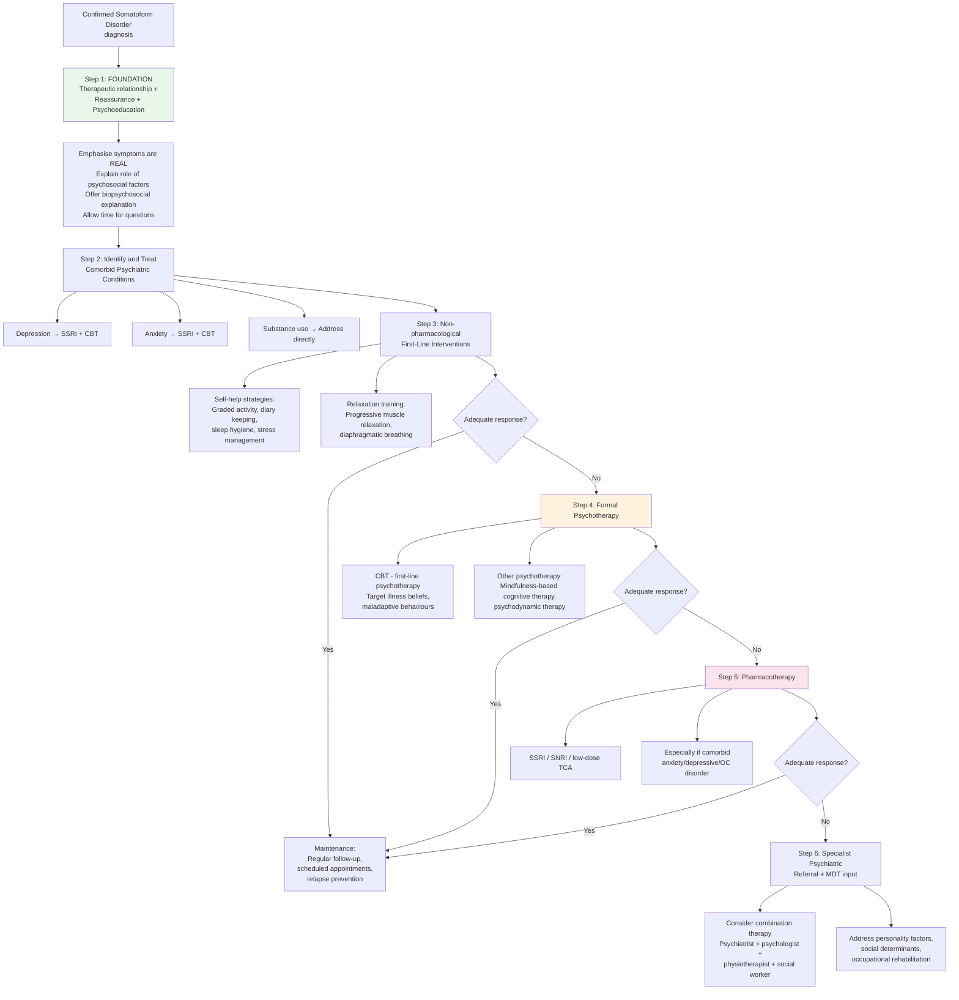
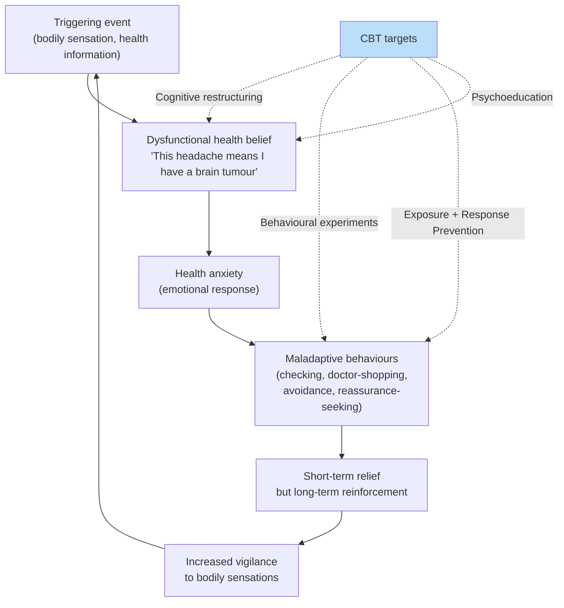

## Management of Somatoform Disorders

### Overarching Philosophy of Management

Before discussing specific treatment modalities, it is essential to understand **why** somatoform disorders are so difficult to manage and what the overarching treatment philosophy should be. Think about this from first principles:

The core problem in somatoform disorders is a **self-reinforcing cycle**: somatic symptoms → health anxiety → maladaptive behaviours (checking, doctor-shopping, avoidance) → reinforcement of illness beliefs → more somatic symptoms. Any management strategy must **break this cycle** at one or more points [2].

There are several unique challenges:

1. **Patients do not believe they have a psychiatric condition** — their symptoms are real, and they feel genuinely ill. Telling them "it's all in your head" is both inaccurate and therapeutic poison.
2. **70–90% of patients decline psychotherapy** when offered [2] — therapeutic engagement is a major barrier.
3. **The healthcare system can reinforce the problem** — each new investigation, each new specialist opinion, each prescription of an analgesic perpetuates the cycle [2].
4. **Comorbid psychiatric conditions** (depression 30–60%, anxiety disorders, substance use) must be addressed simultaneously, as they maintain the somatoform symptoms [2].
5. **Course is chronic and fluctuating** — 50–75% improve but rarely fully resolve [2]. The realistic goal is functional improvement and reduced distress, not "cure."

<Callout title="The Cardinal Rule of Management">
The therapeutic relationship IS the treatment. In somatoform disorders, the single most important intervention is building a trusting, consistent, non-dismissive relationship with the patient. Without this, no amount of CBT or SSRI will work. The patient must feel heard, believed, and respected before they will accept a biopsychosocial explanation for their symptoms [2].
</Callout>

---

### Management Algorithm

---

### Condition-Specific Management Algorithms

The approach differs slightly depending on which somatoform subtype is being managed:

| Condition | First-Line | Second-Line | Third-Line |
|---|---|---|---|
| **Somatic Symptom Disorder** | Reassurance + psychoeducation ± treatment of comorbidities [2] | CBT (targeting health beliefs and expectations) + relaxation training [2] | Antidepressants (SSRI, SNRI, low-dose TCAs) if comorbid anxiety/depressive/OC disorder [2] |
| **Illness Anxiety Disorder** | CBT (1st line): cognitive restructuring for maladaptive illness cognitions + ERP for maladaptive checking behaviours + psychoeducation [2] | Other psychotherapy (2nd line): e.g., mindfulness-based cognitive therapy [2] | Antidepressants (3rd line): SSRI, SNRI [2] |
| **Functional Neurological Symptom Disorder** | Reassurance + psychoeducation (1st line) [2] | Physical therapy for motor symptoms; CBT for other symptoms (2nd line) [2] | Address psychiatric comorbidities (depression, anxiety, personality disorders) |
| **Body Dysmorphic Disorder** | CBT (with ERP components) + high-dose SSRI | Augmentation with antipsychotics if delusional BDD | Referral for specialised BDD treatment; avoid cosmetic surgery (generally worsens outcomes) |

---

### Detailed Treatment Modalities

#### A. Initial Approach: Reassurance and Psychoeducation [2]

This is universally the first step for ALL somatoform disorders. It is not merely "being nice" — it is a structured therapeutic intervention [2].

**Basic approaches to medically unexplained symptoms** [2]:

| Principle | What to Do | Why It Works |
|---|---|---|
| **Emphasise that the symptoms are real** and familiar to the clinician [2] | "I can see these symptoms are causing you genuine suffering. I see patients with similar problems regularly." | Validates the patient's experience. Reduces defensive posture. Builds trust. If the patient feels dismissed, they will disengage and continue doctor-shopping. |
| **Explain the role of psychosocial factors in ALL medical conditions** [2] | "Stress affects every part of the body — it can change your heart rate, digestion, pain thresholds, muscle tension. This happens to everyone." | Normalises the mind-body connection without pathologising the patient. Uses examples they can relate to (e.g., "butterflies in the stomach before an exam"). |
| **Offer and discuss a psychosocial explanation** of the symptoms [2] | "It seems like the stress from your work/family situation may be amplifying the signals your body is sending." | Provides a coherent explanatory model. The patient needs an ALTERNATIVE narrative to replace "I must have cancer." |
| **Allow adequate time** for the patient and partner/family to ask questions [2] | Unhurried consultations; involve family if appropriate | Rushing reinforces the patient's fear that they are being dismissed |
| **Agree a treatment plan** including [2]: | (1) Treatment of any minor medical problem contributing; (2) Treatment of any comorbid psychiatric disorder; (3) Graded activity to improve fitness; (4) Diary keeping to explore symptom-psychosocial links [2] | Collaborative goal-setting empowers the patient and shifts them from passive illness behaviour to active self-management |

<Callout title="Scheduled Appointments — A Key Strategy" type="idea">
A crucial management principle is switching from **symptom-driven** appointments to **time-contingent** (scheduled) appointments. Instead of the patient coming to the clinic whenever symptoms worsen (which reinforces the link between symptoms and medical attention), arrange regular follow-ups at fixed intervals (e.g., every 2–4 weeks) regardless of symptom status. This breaks the contingency between symptom → medical attention and provides consistent support without reinforcing illness behaviour.
</Callout>

---

#### B. Relaxation Training [2]

Relaxation techniques directly target the physiological arousal (sympathetic overdrive) that produces many somatic symptoms [2]:

| Technique | How It Works | Indications |
|---|---|---|
| **Progressive muscle relaxation (PMR)** [2] | Systematic tensing and releasing of muscle groups → reduces chronic muscle tension → reduces tension-type headaches, back pain, myofascial pain | Particularly useful when somatic symptoms are pain-predominant or tension-related |
| **Diaphragmatic breathing** [2] | Slow, deep breathing activates the parasympathetic nervous system (vagal tone) → reduces heart rate, lowers BP, reduces hyperventilation-related symptoms (dizziness, tingling, chest tightness) | Particularly useful when symptoms include palpitations, dyspnoea, dizziness, paraesthesiae |
| **Mindfulness meditation** | Non-judgemental awareness of present-moment experience → reduces ruminative worry about health → breaks the "monitoring → catastrophising" cycle | Can be self-guided or therapist-led. Useful as an adjunct to CBT. |
| **Biofeedback** | Real-time physiological data (heart rate, muscle tension, skin conductance) is fed back to the patient → teaches them to consciously regulate these parameters | Provides objective evidence to the patient that they CAN influence their bodily sensations |

---

#### C. Cognitive Behavioural Therapy (CBT) [2]

***CBT is the mainstay formal psychotherapy for somatoform disorders*** [1][2]. It directly targets the cognitive and behavioural factors that maintain the disorder.

##### The CBT Model for Somatoform Disorders

##### Components of CBT for Somatoform Disorders [2]

| CBT Component | Technique | What It Targets | Example |
|---|---|---|---|
| **Cognitive restructuring** | Identify and challenge dysfunctional automatic thoughts about health [2] | Maladaptive illness beliefs ("headache = brain tumour") | "What is the actual probability that a headache in a 30-year-old with normal examination represents a brain tumour? What are the 10 most common causes of headache?" |
| **Behavioural experiments** | Test predictions about feared outcomes in real life | Catastrophic predictions ("if I don't check my pulse every hour, I'll miss a heart attack") | "Let's try not checking your pulse for one day. What do you predict will happen? What actually happened?" |
| **Exposure and response prevention (ERP)** | Systematic exposure to anxiety-provoking health-related stimuli while preventing the maladaptive response [2] | Compulsive checking behaviours, reassurance-seeking, avoidance | Gradually reduce the number of daily BP checks from 20 to 10 to 5 to 2 to 1. Resist the urge to Google symptoms for progressively longer intervals. |
| **Psychoeducation** [2] | Educate about the role of attention, anxiety, and arousal in symptom perception | The amplification model — why monitoring symptoms makes them worse | "Imagine I asked you to pay attention to your left big toe right now. Can you feel it? Now you're aware of sensations you weren't noticing before. This is what happens when you constantly monitor your body." |
| **Activity scheduling/graded activity** | Progressive increase in physical and social activity [2] | Deconditioning and avoidance that perpetuate disability | Start with 5 minutes of walking, increase by 5 minutes per week. The improvement in physical capacity provides corrective evidence against illness beliefs. |

##### Evidence Base for CBT in Somatoform Disorders
- **Somatic symptom disorder**: CBT is the most evidence-based psychotherapy. Meta-analyses show moderate effect sizes (d ≈ 0.4–0.6) for reducing somatic symptom severity, health anxiety, and healthcare utilisation.
- **Illness anxiety disorder**: **CBT is first-line** [2]. Cognitive restructuring targets the maladaptive cognitive processes maintaining illness preoccupation; ERP targets maladaptive checking behaviours [2].
- **FND**: CBT is effective for non-motor symptoms; physiotherapy is preferred for motor symptoms [2].

<Callout title="The 70–90% Problem" type="error">
**70–90% of patients with somatic symptom disorder decline psychotherapy** when offered [2]. This is a major practical barrier. Reasons include: (1) patients feel the referral implies their symptoms are "not real"; (2) stigma around seeing a psychologist/psychiatrist; (3) preference for a medical/physical explanation. Strategies to improve uptake: frame CBT as "learning to manage symptoms better" rather than "treating a mental problem"; integrate psychological services within the medical clinic (collaborative care model); use digital/online CBT as a less stigmatising entry point.
</Callout>

---

#### D. Other Psychotherapy [2]

| Modality | Mechanism | Indication | Evidence |
|---|---|---|---|
| **Mindfulness-based cognitive therapy (MBCT)** [2] | Combines mindfulness meditation with cognitive therapy. Teaches non-judgemental awareness of bodily sensations without catastrophic interpretation. Breaks the "sensation → automatic thought → anxiety" chain. | **Second-line** for illness anxiety disorder [2]. Useful when CBT alone is insufficient or when rumination is a major feature. | Growing evidence base; originally developed for relapse prevention in depression but increasingly applied to health anxiety |
| **Psychodynamic psychotherapy** [2] | Explores unconscious conflicts, developmental experiences, and relational patterns that may underlie somatisation. Based on the classical conversion model — understanding why distress is expressed through the body. | Patients with identifiable interpersonal/developmental themes (e.g., childhood abuse, insecure attachment). Patients who are psychologically-minded and motivated for self-exploration. | Moderate evidence; may be helpful when CBT is ineffective or declined |
| ***Supportive psychotherapy*** [1][2] | Provides a consistent, empathic therapeutic relationship. Focus on coping strategies, problem-solving, and emotional support rather than symptom resolution. | All patients — forms the basis of the therapeutic relationship. Particularly useful when patients are not ready for structured CBT. | Universal component of care |
| **Interpersonal therapy (IPT)** | Focuses on interpersonal difficulties (grief, role disputes, role transitions, interpersonal deficits) that contribute to distress | When somatisation appears driven by interpersonal stressors | Limited but emerging evidence |

---

#### E. Pharmacotherapy [1][2]

Pharmacotherapy in somatoform disorders is **adjunctive** — it is not the primary treatment but plays an important role, especially when comorbid psychiatric conditions are present [2].

##### Indications for Pharmacotherapy

| Indication | Rationale |
|---|---|
| **Comorbid depression** (30–60%) | Depression amplifies somatic symptom perception and maintains health anxiety. Treating depression often reduces somatic symptom burden. |
| **Comorbid anxiety disorders** (GAD, panic, OCD) | Anxiety drives the hypervigilance-catastrophising-checking cycle. Reducing anxiety breaks this cycle. |
| **Illness anxiety disorder** (3rd line) [2] | When CBT and other psychotherapy are insufficient or declined |
| **Somatic symptom disorder with predominant pain** | Antidepressants have independent analgesic properties (SNRIs, TCAs) beyond their mood effects |

##### Drug Classes

**1. *SSRIs (Selective Serotonin Reuptake Inhibitors)*** [1][2]

- **Mechanism**: Block the serotonin transporter (SERT) → increase synaptic 5-HT availability → downstream effects on amygdala reactivity (reduced fear/anxiety), anterior cingulate function (improved emotional regulation), and descending pain modulation pathways (reduced pain perception)
- ***Examples: paroxetine, citalopram, escitalopram, fluoxetine, sertraline, fluvoxamine*** [1]
- **First-line pharmacotherapy** for somatoform disorders with comorbid anxiety/depression [2]
- **Onset of action**: 2–4 weeks (important to counsel patients — they may become frustrated if expecting immediate relief)
- **Initial worsening**: Most SSRIs cause **increased anxiety symptoms** (apprehension, sleeplessness, palpitations) in the first 1–2 weeks [2] — this is particularly problematic in somatoform patients who are already hypersensitive to bodily sensations. **Start low, go slow.**
- **Duration**: Usually maintained for **≥6 months** to prevent relapse [2]
- **Adverse effects**: GI disturbance (nausea, diarrhoea), sexual dysfunction, headache, insomnia/somnolence, weight changes, serotonin syndrome (if combined with other serotonergic agents), hyponatraemia (especially elderly — SIADH mechanism), increased bleeding risk (serotonin-mediated platelet dysfunction)
- **Contraindications/cautions**: Concurrent MAOIs (serotonin syndrome risk), active GI bleeding, pregnancy (particularly paroxetine — category D), bipolar disorder (risk of manic switch)

**2. *SNRIs (Serotonin-Noradrenaline Reuptake Inhibitors)*** [1][2]

- **Mechanism**: Block both SERT and the noradrenaline transporter (NET) → dual monoamine enhancement. The noradrenergic component adds to efficacy in pain syndromes (descending noradrenergic pain inhibition pathways in the spinal cord) and fatigue.
- ***Examples: venlafaxine, duloxetine*** [1]
- **Indications**: Particularly useful when somatic symptom disorder is associated with **predominant pain** (duloxetine has specific evidence for fibromyalgia, diabetic neuropathic pain, chronic musculoskeletal pain) or when SSRI response is inadequate
- **Adverse effects**: Similar to SSRIs plus: hypertension (noradrenergic effect — must monitor BP), more pronounced discontinuation syndrome (especially venlafaxine — must taper slowly), sweating
- **Contraindications/cautions**: Uncontrolled hypertension, concurrent MAOIs, hepatic impairment (duloxetine)

**3. *Low-dose Tricyclic Antidepressants (TCAs)*** [1][2]

- **Mechanism**: Block SERT and NET (like SNRIs) but also block muscarinic, histaminic, and α-adrenergic receptors — these additional actions produce side effects but also contribute to sedation (useful in insomnia) and analgesia
- **Examples**: Amitriptyline (most commonly used at low dose for pain), imipramine, clomipramine
- ***Imipramine — particularly for panic disorder*** [1]; ***clomipramine — particularly for OCD*** [1]
- **Use in somatoform disorders**: Low-dose amitriptyline (10–50 mg nocte) is widely used for chronic pain syndromes, fibromyalgia, and functional GI disorders (e.g., IBS). At these doses, the antidepressant effect is minimal — the benefit is primarily analgesic (via descending pain pathway modulation) and sedative (via H1 antagonism)
- **Adverse effects**: Anticholinergic (dry mouth, constipation, urinary retention, blurred vision), sedation, weight gain, orthostatic hypotension, cardiac conduction abnormalities (QT prolongation, heart block) — dangerous in overdose (cardiac arrhythmias, seizures)
- **Contraindications**: Recent MI, heart block, mania, severe hepatic impairment, concurrent MAOIs. **Dangerous in overdose** — avoid prescribing large quantities to patients at suicide risk

<Callout title="Why Start Low, Go Slow in Somatoform Patients?" type="error">
Somatoform patients have an **amplifying perceptual style** — they are hyper-attentive to bodily sensations. SSRI/SNRI initiation commonly causes transient GI symptoms, palpitations, and increased anxiety. In a normal patient, these are minor and tolerable. In a somatoform patient, they can be terrifying and interpreted as evidence of serious disease, leading to immediate discontinuation and further loss of trust in medical treatment. Therefore: **start at half the usual starting dose** and **increase gradually** with careful counselling about expected initial side effects [2].
</Callout>

**4. *Benzodiazepines*** [1]

- ***Effective anxiolytics but only for SHORT-TERM use (not more than 1 month)*** [1]
- **Mechanism**: Positive allosteric modulators of GABA-A receptors → increase chloride channel opening frequency → neuronal inhibition → anxiolytic, sedative, muscle relaxant, anticonvulsant effects
- **Role in somatoform disorders**: Very limited. May provide short-term relief during acute crises but carry significant risks of dependence, tolerance, and withdrawal — all of which are particularly problematic in somatoform patients who are already at risk of substance use disorders [2]
- **Risks**: Dependence (can develop within 2–4 weeks of regular use), tolerance, withdrawal symptoms (anxiety, insomnia, tremor, seizures), sedation, cognitive impairment, falls (elderly), respiratory depression
- **Contraindications**: Respiratory failure, severe hepatic impairment, myasthenia gravis, sleep apnoea, history of substance use disorder

<Callout title="Benzodiazepines in Somatoform Disorders — A Trap" type="error">
Prescribing benzodiazepines for somatoform patients is a common pitfall. The short-term relief they provide reinforces medication-seeking behaviour, and the patient quickly develops tolerance → dose escalation → dependence. **Substance use disorders are already a recognised complication of somatoform disorders** (patients self-medicate with narcotic analgesics and benzodiazepines) [2]. Prescribing benzodiazepines can turn a chronic somatoform disorder into a chronic somatoform disorder PLUS benzodiazepine dependence.
</Callout>

**5. Other Pharmacological Agents**

| Agent | Mechanism | Role in Somatoform Disorders | Notes |
|---|---|---|---|
| ***Beta-adrenergic antagonists (e.g., propranolol)*** [1] | Block peripheral β-adrenergic receptors → reduce heart rate, tremor, sweating | Useful for **peripheral** autonomic symptoms of anxiety (palpitations, tremor, sweating) but does NOT address central anxiety or health cognitions | Does not treat the underlying disorder; only masks peripheral symptoms. Useful as adjunct for performance-related somatic symptoms. |
| ***Buspirone*** [1] | 5-HT₁A partial agonist → SSRI-like effect. Onset of action ~4 weeks. Does NOT cause sedation [2] | Effective in GAD but NOT in other anxiety disorders [2]. Limited role in somatoform disorders specifically, but may be helpful when GAD is comorbid. | Advantage: no sedation, no dependence. Disadvantage: slow onset, limited spectrum. |
| ***Pregabalin*** [1] | Binds α₂δ subunit of presynaptic voltage-dependent Ca²⁺ channels → blocks release of excitatory neurotransmitters (glutamate) | Useful when comorbid GAD and/or neuropathic pain. Licensed for GAD and neuropathic pain. | Side effects: somnolence, dizziness, weight gain. Caution: potential for misuse/dependence (Schedule V in US). |
| **Antipsychotics (low-dose)** [1] | Various receptor profiles depending on agent | Very limited role — only if beliefs reach delusional intensity (somatic delusional disorder) or as augmentation for severe treatment-resistant BDD | Not first-line for any somatoform disorder |

---

#### F. Specific Management for Functional Neurological Symptom Disorder (FND) [2]

FND requires a distinct management approach because the symptom type (neurological) demands specific rehabilitation strategies [2]:

| Step | Intervention | Rationale |
|---|---|---|
| **Step 1** | **Reassurance and psychoeducation** (1st line) [2] | Explaining the diagnosis clearly is the single most therapeutic intervention. Name the condition ("functional neurological symptom disorder"), explain that it is common and genuine, show the patient their own positive signs (e.g., demonstrate Hoover's sign to them), and explain that the nervous system is "not damaged but is sending incorrect signals — like a software problem, not a hardware problem." |
| **Step 2a** | **Physical therapy** for motor symptoms (2nd line) [2] | Evidence-based physiotherapy for FND uses motor retraining, gait re-education, and graded exercise. The physiotherapist works to re-establish normal movement patterns by redirecting attention away from the affected limb (exploiting distractibility). |
| **Step 2b** | **CBT** for other symptoms (2nd line) [2] | Targets the cognitive and emotional factors maintaining non-motor FND symptoms (dissociative symptoms, pain, fatigue, cognitive symptoms) |
| **Step 3** | Treat psychiatric comorbidities [2] | Up to **90%** have psychiatric comorbidity: depression (32%), GAD (21%), panic disorder (36%), dissociation (47%), personality disorders [2]. These maintain the functional symptoms and must be addressed. |

<Callout title="Do Not Reinforce FND Symptoms" type="error">
Symptoms in FND **can be reinforced by treatment measures** [2]. For example, providing a wheelchair to a patient with functional leg weakness may entrench the symptom by removing any incentive or opportunity for the motor system to "re-engage." Similarly, excessive bed rest, walking aids, and mobility equipment should be avoided unless absolutely necessary. The rehabilitation approach should be **activating**, not accommodating.
</Callout>

---

#### G. Management of Illness Anxiety Disorder [2]

Management is **difficult due to chronic recurrent course** [2]:

| Line | Treatment | Details |
|---|---|---|
| **1st line** | **CBT** [2] | Cognitive restructuring to address maladaptive cognitive processes maintaining illness preoccupation; ERP to address maladaptive checking/reassurance-seeking behaviours; psychoeducation about the attention-amplification cycle [2] |
| **2nd line** | **Other psychotherapy** [2] | e.g., mindfulness-based cognitive therapy (MBCT) [2] — teaches non-judgemental awareness of bodily sensations without reactive catastrophising |
| **3rd line** | **Antidepressants** [2] | SSRI, SNRI [2] — when psychotherapy is insufficient, declined, or when significant comorbid anxiety/depression is present |

---

#### H. General Principles of Ongoing Management

| Principle | Implementation | Why It Matters |
|---|---|---|
| **Single primary clinician** | Designate one doctor (usually GP) as the primary contact. All referrals and investigations go through this person. | Prevents doctor-shopping, conflicting advice, and unnecessary duplication of investigations |
| **Scheduled (time-contingent) visits** | Regular appointments regardless of symptom status (e.g., every 2–4 weeks initially) | Breaks the reinforcement loop between symptoms → medical consultation. Provides consistent support. |
| **Limit investigations** | No further investigations unless new clinical features emerge that warrant specific evaluation [2] | Prevents false-positive cascades and iatrogenic harm. Reassurance from normal results is transient in these patients [2]. |
| **Avoid iatrogenic harm** | Minimise narcotic analgesics, benzodiazepines, unnecessary procedures [2] | Substance use disorders and iatrogenic surgical complications are recognised complications [2] |
| **Treat the whole person** | Address sleep, diet, exercise, social isolation, occupational functioning, family dynamics | Deconditioning, social withdrawal, and occupational disability perpetuate the illness cycle |
| **Set realistic expectations** | "The goal is to live well WITH your symptoms, not to eliminate them entirely" | Prevents frustration and therapeutic rupture when symptoms inevitably fluctuate |
| **Collaborative care model** | Integrate psychiatry, psychology, physiotherapy, and primary care within a shared management plan | Evidence shows better outcomes than sequential referral between disconnected services |

---

#### I. Indications for Psychiatric Referral [2]

Referral to secondary care (specialist psychiatric services) should be considered when [2]:

- Risk of self-harm or suicide
- Marked self-neglect
- Non-response to at least two treatments (e.g., psychoeducation + SSRI, or psychoeducation + CBT)
- Significant comorbidity (e.g., substance use, severe personality disorder, psychotic features)
- Diagnostic uncertainty (e.g., concern about delusional disorder, somatic subtype)
- Factitious disorder or suspected malingering

---

### Summary Table: Treatment by Condition

| Condition | 1st Line | 2nd Line | 3rd Line | Key Pitfalls |
|---|---|---|---|---|
| **SSD** | Reassurance + psychoeducation + treat comorbidities [2] | CBT + relaxation training [2] | Antidepressants (SSRI/SNRI/low-dose TCA) [2] | 70–90% decline psychotherapy [2]; avoid BZDs and opioids |
| **IAD** | CBT (cognitive restructuring + ERP) [2] | MBCT [2] | Antidepressants (SSRI/SNRI) [2] | Chronic course; repeated reassurance is counterproductive |
| **FND** | Reassurance + psychoeducation [2] | Physiotherapy (motor) / CBT (other) [2] | Treat comorbidities | Do not reinforce symptoms with aids/accommodations |
| **BDD** | CBT + high-dose SSRI | Antipsychotic augmentation if delusional | Specialised BDD treatment | Cosmetic surgery generally worsens outcomes |

<Callout title="High Yield Summary — Management">

**Foundation (ALL somatoform disorders):**
- Therapeutic relationship is the treatment
- Emphasise symptoms are real; explain psychosocial factors; offer biopsychosocial explanation
- Scheduled appointments, single clinician, limit investigations
- Treat comorbid depression/anxiety (SSRI + CBT)

**Psychotherapy:**
- CBT is first-line formal psychotherapy for all somatoform subtypes
- Targets: dysfunctional health beliefs (cognitive restructuring), maladaptive behaviours (ERP/behavioural experiments), psychoeducation (attention-amplification model)
- 70–90% decline psychotherapy — engagement is the biggest barrier
- MBCT is second-line, especially for IAD

**Pharmacotherapy:**
- SSRIs first-line (start low, go slow — amplifying perceptual style makes patients hypersensitive to side effects)
- SNRIs useful for pain-predominant presentations (duloxetine for fibromyalgia/chronic pain)
- Low-dose TCAs (amitriptyline) for chronic pain and insomnia
- BZDs: SHORT-TERM only (max 1 month), high risk of dependence — avoid in somatoform disorders
- Propranolol for peripheral autonomic symptoms only

**FND-specific:**
- Psychoeducation (1st line) → Physiotherapy for motor / CBT for other symptoms (2nd line)
- Do NOT reinforce symptoms with wheelchair/mobility aids

**Key Pitfalls:**
- Never tell patients "it's all in your head"
- Never prescribe long-term benzodiazepines or opioids
- Never order investigations to "reassure" — it doesn't work
- Never provide mobility aids without active rehabilitation plan for FND
</Callout>

---

<ActiveRecallQuiz
  title="Active Recall - Management of Somatoform Disorders"
  items={[
    {
      question: "List the five basic approaches to medically unexplained symptoms as outlined in the management framework.",
      markscheme: "1. Emphasise that the symptoms are real and familiar to the clinician. 2. Explain the role of psychosocial factors in ALL medical conditions. 3. Offer and discuss a psychosocial explanation of the symptoms. 4. Allow adequate time for the patient and family to ask questions. 5. Agree a treatment plan: treat minor medical problems, treat comorbid psychiatric disorders, graded activity, diary keeping to explore symptom-psychosocial links."
    },
    {
      question: "What are the three components of CBT that are used to treat illness anxiety disorder, and what does each target?",
      markscheme: "1. Cognitive restructuring — targets maladaptive cognitive processes that maintain illness-related preoccupation (e.g., catastrophising, probability overestimation). 2. Exposure and response prevention (ERP) — targets maladaptive behaviours such as checking, reassurance-seeking, and avoidance. 3. Psychoeducation — targets the attention-amplification cycle by explaining how monitoring bodily sensations increases awareness and perpetuates anxiety."
    },
    {
      question: "Why should benzodiazepines be avoided in the long-term management of somatoform disorders?",
      markscheme: "1. Rapid development of tolerance and dependence (within 2-4 weeks). 2. Somatoform patients are already at risk of substance use disorders — BZDs add another layer of dependence. 3. Short-term relief reinforces medication-seeking behaviour. 4. Withdrawal symptoms (anxiety, insomnia, seizures) can mimic/worsen somatic symptoms, perpetuating the cycle. 5. Cognitive impairment and sedation impair rehabilitation. Should be limited to short-term use (max 1 month) if used at all."
    },
    {
      question: "What is the stepped management approach for functional neurological symptom disorder?",
      markscheme: "Step 1 (1st line): Reassurance and psychoeducation — explain diagnosis, demonstrate positive signs (e.g., Hoover sign) to patient, use 'software not hardware' analogy. Step 2a: Physiotherapy for motor symptoms (motor retraining, gait re-education, graded exercise). Step 2b: CBT for non-motor symptoms. Step 3: Treat psychiatric comorbidities (90% have comorbidity — depression, GAD, panic, dissociation, personality disorders). Key principle: do NOT reinforce symptoms with mobility aids or excessive accommodations."
    },
    {
      question: "Why is 'starting low and going slow' with SSRIs especially important in somatoform patients compared to other psychiatric populations?",
      markscheme: "Somatoform patients have an amplifying perceptual style — they are hyper-attentive to bodily sensations and interpret them catastrophically. SSRIs commonly cause transient side effects in the first 1-2 weeks (GI disturbance, palpitations, increased anxiety, insomnia). In a normal patient these are tolerable, but in somatoform patients they may be interpreted as evidence of serious disease, leading to immediate discontinuation and further loss of trust. Therefore start at half the usual starting dose and increase gradually with careful counselling about expected transient side effects."
    },
    {
      question: "A major barrier to treatment of somatic symptom disorder is that 70-90% of patients decline psychotherapy. Give three strategies to improve engagement.",
      markscheme: "1. Frame CBT as 'learning to manage symptoms better' rather than implying the problem is psychiatric or 'not real'. 2. Integrate psychological services within the medical clinic (collaborative care model) to reduce stigma of psychiatric referral. 3. Use digital/online CBT platforms as a less stigmatising entry point. Additional strategies: involve family in psychoeducation; scheduled appointments to build therapeutic alliance gradually before formal referral; use the therapeutic relationship itself as the vehicle for gradual engagement."
    }
  ]}
/>

## References

[1] Lecture slides: GC 167. I feel very nervous Anxiety disorders.pdf (p36–37, treatment of anxiety disorders, antidepressant classes)
[2] Senior notes: ryanho-psych.md (Sections 8.4.1, 8.4.2.1, 8.4.2.2, 8.4.2.3 — management of MUS, somatic symptom disorder, illness anxiety disorder, conversion disorder, other related disorders; Section 3.1.1 antidepressants; Section 3.1.4 benzodiazepines and anxiolytics; Section 3.3 psychotherapy)
