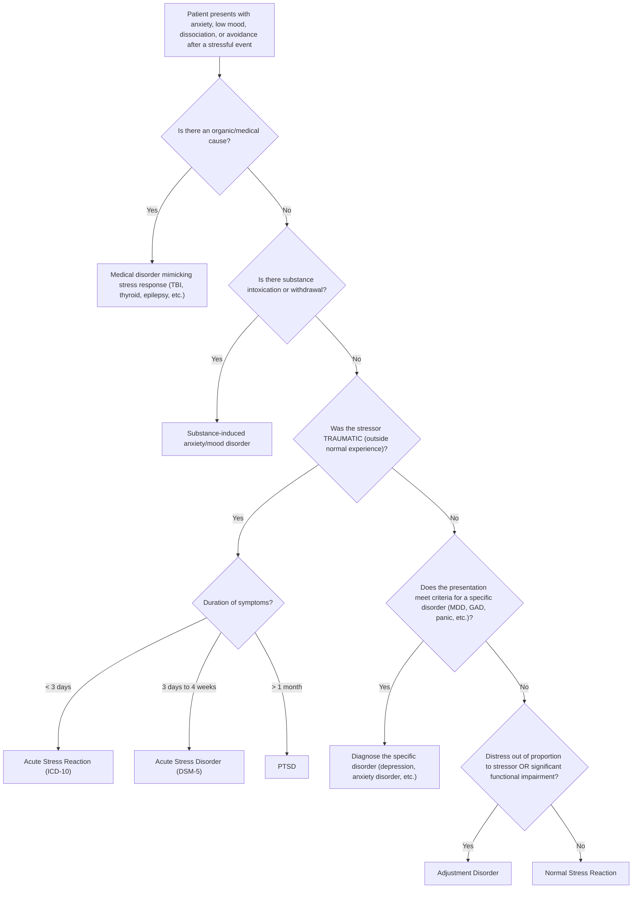

## Differential Diagnosis of Stress-Related Disorders

The differential diagnosis of stress-related disorders is one of the trickiest areas in psychiatry because **anxiety, low mood, dissociation, and avoidance** are transdiagnostic symptoms — they appear across dozens of conditions. The key clinical task is to determine whether the symptoms are best explained by a stress-related disorder (ASD, PTSD, adjustment disorder) or by another condition that shares overlapping features.

The approach rests on three fundamental questions:

1. **Is there an identifiable stressor, and is it temporally linked to symptom onset?**
2. **Is the stressor traumatic (outside normal human experience) or psychosocial (subjective)?**
3. **Are the specific symptom clusters present (re-experiencing, avoidance, arousal, negative cognition)?** Or do the symptoms better fit another diagnostic category?

---

### Diagnostic Hierarchy and Approach

Remember the **hierarchy of psychiatric diagnosis** [2]: when symptoms can be explained by more than one diagnosis, the higher-order diagnosis takes precedence because treating it often resolves the lower-order symptoms. For stress-related disorders:

1. First, **exclude organic/medical causes** (highest priority)
2. Then, **exclude substance-related causes** (intoxication or withdrawal)
3. Then, **differentiate between psychiatric disorders** using the specific symptom profile and temporal relationship to the stressor

<Callout title="Key Principle">
***Adjustment disorder is a residual category*** — it should NOT be diagnosed if criteria for another more specific mental disorder are met [2]. Think of it as the "not-otherwise-specified" response to stress. If the patient meets criteria for MDD, GAD, PTSD, or any other disorder, that diagnosis takes precedence.
</Callout>

---

### Differential Diagnosis Table for PTSD

| Differential Diagnosis | Key Differentiating Features | Why It Can Be Confused With PTSD |
|---|---|---|
| ***Adjustment Disorder*** [2] | ***Stressor can be of any severity or type, but either the stressor is non-traumatic OR the symptomatology does not meet criteria for PTSD*** [2]. Adjustment disorder carries anxiety/depressive symptoms but lacks the hallmark re-experiencing cluster (flashbacks, nightmares). Temporal frame also differs (≤3 months of stressor onset, resolves within 6 months of stressor resolution). | Both are stress-related, both can have anxiety/depressive symptoms, both have a temporal link to a stressor |
| ***Acute Stress Disorder*** [2] | ***Lasts for 3 days to 1 month following exposure to traumatic event*** [1][2]. Same symptom profile as PTSD but the duration criterion distinguishes them. ASD requires 9+ symptoms from 5 categories. | Identical symptom content — the only difference is duration |
| ***Other psychiatric disorders*** [2] | ***Almost all psychiatric disorders can be exacerbated by traumatic stressors. If the symptom response pattern fits another disorder more than PTSD, that diagnosis should be given*** [2]. For example, if a patient develops a full major depressive episode after trauma without prominent re-experiencing/avoidance, diagnose MDD, not PTSD. | Trauma can precipitate depression, psychosis, anxiety disorders — the trauma is a risk factor, not a diagnostic criterion for these other disorders |
| ***Anxiety disorders and OCD*** [2] | ***OCD: recurrent intrusive thoughts are present, but they are unrelated to a traumatic event*** [2]. The intrusive thoughts in OCD concern contamination, symmetry, harm, etc. — not a specific trauma. ***Anxiety disorders: anxiety symptoms (worries, avoidance, arousal) are not related to traumatic events*** [2]. GAD worries are future-oriented and wide-ranging; PTSD hyperarousal is tied to the trauma. | Both OCD and PTSD have intrusive thoughts. Both GAD and PTSD have hyperarousal and worry. Both phobias and PTSD have avoidance. |
| ***Traumatic Brain Injury (TBI)*** [2] | ***TBI-related neurocognitive symptoms may mimic PTSD symptoms (e.g., irritability, startle response, poor concentration), but usually there are no re-experiencing and avoidance symptoms. There may be persistent disorientation and confusion*** [2]. | TBI and PTSD often co-occur (e.g., combat, road traffic accidents). The overlapping symptoms are arousal-related; the distinguishing ones are re-experiencing and avoidance (present in PTSD, absent in TBI). Also look for focal neurological signs, amnesia for the event itself (retrograde, not dissociative), and cognitive deficits out of proportion. |
| ***Major Depressive Disorder*** | MDD has sustained low mood, anhedonia, guilt, worthlessness, suicidal ideation, vegetative symptoms (sleep, appetite, psychomotor changes). While PTSD Cluster D ("negative alterations in cognition and mood") overlaps, MDD lacks the hallmark re-experiencing (flashbacks, nightmares) and avoidance of trauma reminders. Content of rumination differs: depressive patients brood on past failures/guilt; PTSD patients re-experience the specific traumatic event. | Both have anhedonia, sleep disturbance, poor concentration, guilt. ***PTSD frequently co-occurs with depression*** [1] — **comorbidity is the rule, not the exception** |
| ***Dissociative Disorders*** | Dissociative identity disorder, dissociative amnesia, depersonalisation/derealisation disorder can present with amnesia, emotional numbing, and detachment. However, dissociative disorders are not necessarily linked to a single identifiable traumatic event (though often linked to childhood trauma), and they lack the re-experiencing and hyperarousal clusters of PTSD. | Both can have dissociative symptoms. DSM-5 recognises a "dissociative subtype" of PTSD, blurring the boundary further |
| ***Psychotic Disorders*** | Schizophrenia and brief psychotic disorder can present with paranoia, agitation, and hallucinations. However, PTSD flashbacks are *reliving* a real event (not a false perception), and PTSD "paranoia" is hypervigilance to real threats (not systematised delusional beliefs). Psychotic features (command hallucinations, thought disorder, bizarre delusions) are absent in PTSD. | Both can present with hypervigilance, suspiciousness, sleep disturbance, agitation. Flashbacks can superficially resemble hallucinations |
| ***Personality Disorders*** | Borderline personality disorder (BPD) has emotional instability, self-harm, dissociation, and interpersonal difficulties. These can look like PTSD, especially since many BPD patients have trauma histories. Key differences: BPD is a *lifelong pattern* (not linked to a single event), features identity disturbance and abandonment fears, and the emotional instability is more pervasive. ***Some personality features may be associated with vulnerability to situational distress that may resemble an adjustment disorder*** [2]. | Trauma is common in BPD history; dissociation, emotional dysregulation, self-harm overlap |

### Differential Diagnosis Table for Adjustment Disorder

| Differential Diagnosis | Key Differentiating Features |
|---|---|
| ***Depression*** [2] | ***If an individual meets criteria for depression, the diagnosis of adjustment disorder is not applicable*** [2]. The symptoms in adjustment disorder are subthreshold — if full MDD criteria are met, diagnose MDD. Content: depressive patients have pervasive hopelessness and vegetative symptoms; adjustment disorder symptoms are more situation-specific. |
| ***ASD / PTSD*** [2] | ***Temporally, adjustment disorder is diagnosed from immediate to 6 months after stressor, whereas ASD/PTSD are diagnosed based on different temporal frames. Symptomatically, adjustment disorder is diagnosed when an individual does not meet full criteria of ASD/PTSD. In terms of precipitating stressor, adjustment disorder is diagnosed when the stressor is not deemed traumatic in nature*** [2]. |
| ***Personality Disorder*** [2] | ***It is important to understand the lifetime history of personality functioning to decide whether a stress-related disturbance exceeds what may be attributable to maladaptive personality disorder symptoms*** [2]. Personality disorders are chronic and pervasive, not reactive to a single stressor. However, patients with personality disorders are *more vulnerable* to developing adjustment disorders. |
| ***Normal stress reactions*** [2] | ***Diagnosis of adjustment disorder should only be made when the magnitude of distress and the impact on functioning exceeds what is normally expected*** [2]. If the reaction is proportionate and functional impairment is minimal and transient, it is a **normal reaction to stress**, not a disorder. |
| ***Other psychiatric disorders*** [2] | ***Almost all psychiatric disorders may be exacerbated by stressors, therefore it is essential to distinguish whether more specific disorders can be diagnosed and whether such psychiatric symptoms are present before the stressor*** [2]. If GAD, panic disorder, or substance use disorder was present *before* the stressor, the stressor may have exacerbated a pre-existing condition rather than caused an adjustment disorder. |

---

### Comorbidities of PTSD (Important for DDx Thinking)

***Co-morbidities of PTSD*** [1]:
- ***Depression***
- ***Other anxiety disorders***
- ***Substance use disorders***
- ***Somatization***
- ***Dissociative disorders***

Why comorbidities matter for DDx: When PTSD is present, these comorbid conditions are so common that you should **actively screen for all of them**. Conversely, when a patient presents with depression, substance misuse, or somatization, you should **always ask about trauma exposure** because undiagnosed PTSD may be driving the presentation.

<Callout title="Clinical Pearl" type="idea">
The relationship between PTSD and substance use is often bidirectional: patients may self-medicate hyperarousal and re-experiencing with alcohol or benzodiazepines (the "self-medication hypothesis"), while substance withdrawal itself can amplify arousal symptoms and mimic PTSD. Always clarify: ***Did the substance use begin before or after the trauma?***
</Callout>

---

### Differentiating Stress-Related Disorders From Each Other

This is the most commonly tested scenario: you are given a clinical vignette and must decide which stress-related disorder fits.

| Feature | Acute Stress Reaction | Acute Stress Disorder | PTSD | Adjustment Disorder |
|---|---|---|---|---|
| **Stressor type** | Traumatic | Traumatic | Traumatic | ***Any*** (not necessarily traumatic) [2] |
| **Onset** | ≤1 hour | During or shortly after trauma | Usually within 6 months | ***≤3 months*** [2] |
| **Duration** | Hours to days | ***3 days to 1 month*** [1][2] | ***> 1 month*** [2] | Resolves within 6 months of stressor resolution |
| **Re-experiencing** | Absent or minimal | Present | Present (hallmark) | **Absent** |
| **Dissociation** | May be present | ***Prominent*** (one of 5 categories) [1] | May be present (specifier) | Absent |
| **Avoidance** | Minimal | Present | Present (hallmark) | May have behavioural avoidance but not trauma-specific |
| **Hyperarousal** | Prominent (autonomic) | Present | Present (hallmark) | May have anxiety symptoms |
| **Meets criteria for specific disorder?** | N/A | No (it IS the specific disorder) | No (it IS the specific disorder) | ***No — residual category*** [2] |

---

### Medical and Substance-Related Differentials (Must Exclude First)

These are critical "rule-outs" before diagnosing any stress-related disorder. The principle is the **hierarchy of diagnosis**: organic causes take precedence [2].

#### Medical Conditions Mimicking Stress-Related Symptoms

| Medical Condition | Mechanism of Mimicry | Key Differentiating Clue |
|---|---|---|
| ***Thyroid disease*** (especially hyperthyroidism) [3] | ↑thyroid hormones → ↑metabolic rate, ↑sympathetic tone → anxiety, tremor, tachycardia, insomnia, irritability | Weight loss, heat intolerance, goitre, lid lag, abnormal TFTs |
| ***Epilepsy*** (especially temporal lobe epilepsy) [3] | Ictal fear, déjà vu, dissociative-like experiences, post-ictal confusion | Stereotyped episodes, aura, EEG abnormalities, brief duration |
| ***Cardiac disease*** [3] (arrhythmias, MVP) | Palpitations, chest tightness, dyspnoea → panic-like symptoms | ECG abnormalities, relationship to exertion |
| ***Phaeochromocytoma*** [3] | Episodic catecholamine surges → paroxysmal hypertension, tachycardia, diaphoresis, anxiety | Episodic hypertension, 24-hour urinary catecholamines |
| ***Vestibular dysfunction*** [3] | Dizziness, unsteadiness → anxiety, avoidance of triggers | Nystagmus, positive Dix-Hallpike, audiometry |
| ***Hypoglycaemia*** | Catecholamine counter-regulatory response → tremor, sweating, anxiety, confusion | Relationship to fasting/insulin, BGL confirms |
| ***Traumatic brain injury*** [2] | Direct neuronal injury → irritability, poor concentration, startle. ***No re-experiencing or avoidance but may have persistent disorientation and confusion*** [2] | Focal neurology, GCS history, neuroimaging, neuropsychological testing |
| ***Cushing's disease*** | Chronic hypercortisolism → anxiety, depression, cognitive impairment | Cushingoid features, elevated 24-hr urinary free cortisol |

#### Substance-Related Differentials [2]

| Substance | Mechanism | Notes |
|---|---|---|
| **Intoxication**: alcohol, stimulants (amphetamines, cocaine, caffeine), cannabis, hallucinogens | Direct psychoactive effects → anxiety, paranoia, dissociation, agitation | Temporal relationship to substance use; urine drug screen |
| **Withdrawal**: alcohol, benzodiazepines, opiates, caffeine, nicotine | Rebound sympathetic activation → anxiety, tremor, insomnia, irritability, hyperarousal | Symptoms worst in the morning (when withdrawal peaks); history of regular use and recent cessation |
| **Side effects of medications**: antidepressants (first 2 weeks), corticosteroids, sympathomimetics, anticholinergics, antipsychotics (akathisia) | Various mechanisms depending on drug | Temporal relationship to medication initiation/change |

<Callout title="Must-Know: Akathisia vs. PTSD Hyperarousal" type="error">
Akathisia (inner restlessness from antipsychotics/SSRIs) can look like PTSD hyperarousal or anxiety. The key difference: akathisia is a **motor restlessness** (inability to sit still, pacing) that improves with movement, whereas PTSD hyperarousal is a **sensory hypervigilance** (scanning for threats, exaggerated startle). Always check the medication list.
</Callout>

---

### Differentiating by the Focus/Theme of Anxiety

A clinically useful approach from the senior notes [2]: when anxiety is present, **what is the patient anxious about?** The content of the anxiety points to the diagnosis.

| Focus of Anxiety/Fear | Most Likely Diagnosis |
|---|---|
| ***Fear of traumatic memory*** [3] | ***ASD / PTSD*** |
| ***Fear of imminent death*** [3] | ***Panic Disorder*** |
| ***Free-floating anxiety*** (multiple topics) [3] | ***GAD*** |
| ***Fear of specific object/situation*** [3] | ***Specific Phobia*** |
| ***Fear of embarrassment / scrutiny*** [3] | ***Social Anxiety Disorder*** |
| ***Fear of crowds / cannot escape*** [3] | ***Agoraphobia*** |
| ***Fear of intrusive, obsessive ideas*** [3] | ***OCD*** |
| Worry about gaining weight | Eating disorder |
| Worry about having serious illness | Illness anxiety disorder |
| Fear of being poisoned/killed | Paranoid schizophrenia |
| Ruminatory guilt/worthlessness | Depression |
| Fear of separation/abandonment | BPD / separation anxiety |

---

### Differentiating Intrusive Thoughts: PTSD vs. OCD vs. Depression

This is a commonly tested comparison:

| Feature | PTSD | OCD | Depression |
|---|---|---|---|
| **Content** | Specific to the traumatic event (the crash, the assault) | Unrelated to trauma (contamination, symmetry, harm, blasphemy) | Mood-congruent (guilt, worthlessness, hopelessness) |
| **Nature** | Involuntary replay of *real past events* | Ego-dystonic (unwanted, recognised as irrational) urges/images | Ego-syntonic ruminations (feel "true" to the patient) |
| **Compulsions** | Absent (avoidance is not ritualistic) | Present — ritualistic, rule-driven, often excessive and unrelated to feared outcome | Absent |
| **Trigger** | Trauma-related cues (sounds, smells, locations) | Various (contamination cues, symmetry, numbers) | Low mood, negative events |
| **Temporal relationship** | After a specific identifiable traumatic event | No temporal relationship to trauma | During depressive episodes |

---

### Summary: Decision Framework for Differential Diagnosis

When approaching a patient with stress-related symptoms:

1. **Exclude medical causes** — TFTs, BGL, ECG, neuroimaging if indicated
2. **Exclude substance causes** — drug history, urine toxicology
3. **Identify the stressor** — traumatic vs. psychosocial
4. **Match symptom profile** — re-experiencing? avoidance? hyperarousal? Or just anxiety/depression?
5. **Check duration** — < 3 days (acute stress reaction), 3 days–4 weeks (ASD), > 1 month (PTSD), ≤ 3 months of stressor (adjustment disorder)
6. **Check if criteria for another specific disorder are met** — if yes, diagnose that disorder instead of adjustment disorder
7. **Screen for comorbidities** — ***depression, other anxiety disorders, substance use, somatization, dissociative disorders*** [1]

---

<Callout title="High Yield Summary">

1. ***Adjustment disorder is a residual category*** — only diagnose when criteria for other specific disorders (MDD, GAD, PTSD, etc.) are NOT met [2]
2. ***PTSD vs. Adjustment Disorder***: PTSD requires traumatic stressor + specific symptom clusters (re-experiencing, avoidance, hyperarousal). Adjustment disorder can follow any stressor and has subthreshold/non-specific symptoms [2]
3. ***PTSD vs. TBI***: TBI mimics arousal symptoms but ***lacks re-experiencing and avoidance; may show persistent disorientation and confusion*** [2]
4. ***PTSD vs. OCD***: Intrusive thoughts in OCD are ***unrelated to a traumatic event***; compulsions are ritualistic and excessive [2]
5. ***PTSD co-morbidities***: ***Depression, other anxiety disorders, substance use disorders, somatization, dissociative disorders*** [1]
6. ***Always exclude medical causes*** (thyroid, epilepsy, cardiac, phaeochromocytoma, TBI) and ***substance causes*** (intoxication, withdrawal, medication side effects) before diagnosing a stress-related disorder [2][3]
7. The ***focus/theme of anxiety*** helps differentiate: trauma memory = PTSD, imminent death = panic, free-floating = GAD, embarrassment = social phobia, intrusive ideas = OCD [3]
8. ***ASD vs. PTSD***: identical symptom content; ***duration is the sole distinguishing feature*** (ASD: 3 days–4 weeks; PTSD: > 1 month) [1][2]

</Callout>

---

<ActiveRecallQuiz
  title="Active Recall - Differential Diagnosis of Stress-Related Disorders"
  items={[
    {
      question: "A patient presents with irritability, exaggerated startle, and poor concentration 2 weeks after a road traffic accident. They have persistent confusion and disorientation but deny flashbacks or nightmares. What is the most important differential to consider, and how do you distinguish it from PTSD?",
      markscheme: "Traumatic brain injury (TBI). TBI mimics PTSD arousal symptoms (irritability, startle, poor concentration) but usually lacks re-experiencing (flashbacks, nightmares) and avoidance symptoms. Persistent disorientation and confusion are more suggestive of TBI. Investigate with neuroimaging and neuropsychological testing.",
    },
    {
      question: "Explain why adjustment disorder is considered a residual category. What must you exclude before making this diagnosis?",
      markscheme: "Adjustment disorder is only diagnosed when the symptom pattern does not meet criteria for any other specific mental disorder (e.g., MDD, GAD, PTSD, panic disorder). Must also exclude that symptoms are not merely an exacerbation of a pre-existing disorder, not normal bereavement, and that there is a clear temporal link to an identifiable stressor within 3 months.",
    },
    {
      question: "How do you differentiate intrusive thoughts in PTSD from those in OCD?",
      markscheme: "PTSD: intrusive thoughts are replays of a specific real traumatic event, triggered by trauma-related cues, no ritualistic compulsions. OCD: intrusive thoughts are unrelated to any specific trauma (e.g., contamination, symmetry, harm), are ego-dystonic, and are accompanied by ritualistic compulsions that are excessive and often unrelated to the feared outcome.",
    },
    {
      question: "List the five major comorbidities of PTSD as stated in the lecture slides.",
      markscheme: "Depression, other anxiety disorders, substance use disorders, somatization, dissociative disorders.",
    },
    {
      question: "A patient has depressed mood and anxiety for 6 weeks after losing their job. They do not meet criteria for MDD or GAD. What is the diagnosis? What if they met full MDD criteria?",
      markscheme: "Adjustment disorder with mixed anxiety and depressed mood (stressor is non-traumatic, onset within 3 months, subthreshold symptoms, significant distress out of proportion). If full MDD criteria are met, diagnose MDD instead - adjustment disorder is a residual category that cannot be diagnosed when a more specific disorder applies.",
    },
    {
      question: "Name three medical conditions that can mimic stress-related or anxiety symptoms and explain the mechanism for one.",
      markscheme: "Any three of: hyperthyroidism, epilepsy (TLE), cardiac disease, phaeochromocytoma, hypoglycaemia, TBI, Cushing disease, vestibular dysfunction. Example mechanism: Hyperthyroidism - excess thyroid hormones increase metabolic rate and potentiate sympathetic nervous system activity, causing anxiety, tremor, tachycardia, and insomnia that mimic PTSD hyperarousal.",
    },
  ]}
/>

---

## References

[1] Lecture slides: GC 171. Stress-related disorders and obsessive-compulsive disorder (Post-traumatic stress disorder adjustment disorder, acute stress disorder)_rev.pdf
[2] Senior notes: ryanho-psych.md (Sections 8.3.1, 8.3.2, 8.3.3 — DDx tables for PTSD and adjustment disorder, approach to anxiety, hierarchy of diagnosis)
[3] Lecture slides: GC 167. I feel very nervous Anxiety disorders.pdf
