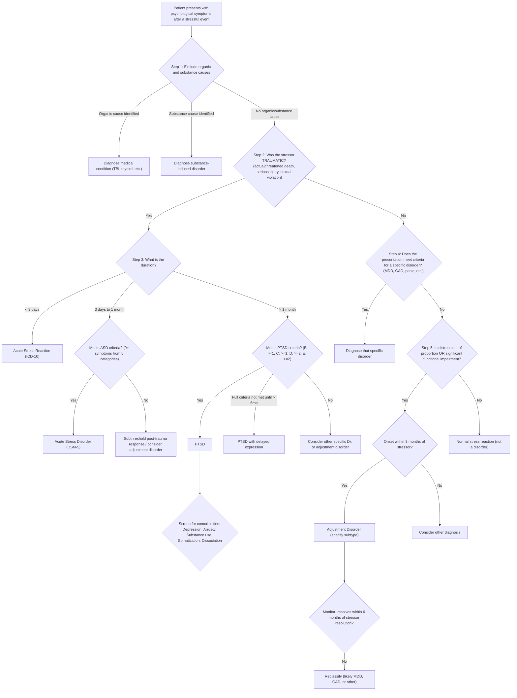

## Diagnostic Criteria

Stress-related disorders are **clinical diagnoses** — there is no blood test, imaging study, or biomarker that confirms ASD, PTSD, or adjustment disorder. Diagnosis rests entirely on:

1. **Identification of the stressor** and its temporal relationship to symptoms
2. **Pattern recognition** of specific symptom clusters
3. **Duration** of symptoms
4. **Exclusion** of other medical, substance-related, and psychiatric causes
5. **Functional impairment** or clinically significant distress

This section lays out the formal criteria for each disorder, then synthesises them into a practical diagnostic algorithm.

---

### 1. Acute Stress Reaction (ICD-10: F43.0)

This captures the **immediate, short-lived, normal reaction** to exceptional trauma. Think of it as the brain's "emergency mode" — not yet pathological [2].

**ICD-10 Criteria** [2]:

| Criterion | Detail | Why This Criterion Exists |
|---|---|---|
| **Temporal connection** | Immediate and clear temporal connection between the impact of an ***exceptional stressor*** and symptom onset; usually within a few minutes if not immediate | Establishes causality — the stressor *caused* the symptoms |
| **Symptom pattern** | Mixed and usually ***changing picture***: initial state of "daze", then depression, anxiety, anger, despair, overactivity, and withdrawal may all be seen, but ***no one type of symptom predominates for long*** | The hallmark of ASR is its *fluctuating*, transient nature — unlike PTSD where specific clusters persist |
| **Resolution** | Symptoms resolve rapidly — ***within a few hours*** if removed from stressful environment; if stress continues, symptoms ***begin to diminish after 24–48 hours*** and are ***usually minimal after about 3 days*** | If symptoms persist beyond this window, consider ASD or PTSD |
| **Exclusion** | Should not be used to cover sudden exacerbation of pre-existing psychiatric disorder (***except personality disorders***). However, ***prior psychiatric Hx does not invalidate*** the diagnosis | Prevents misattribution of pre-existing illness flare to the acute stressor, while acknowledging that prior Hx doesn't preclude a genuine acute stress reaction |

<Callout title="Key Point">
ICD-10's acute stress reaction is the **normal** acute response. It is transient, mixed, and self-limiting. If the patient is still significantly symptomatic after 3 days, you are moving into DSM-5's Acute Stress Disorder territory.
</Callout>

---

### 2. Acute Stress Disorder (DSM-5: 308.3)

***Similar exposure as in PTSD*** [1]. This captures the ***more prolonged abnormal response*** (3 days–1 month) that may predict later PTSD.

**DSM-5 Criteria** [1][2]:

| Criterion | Detail |
|---|---|
| **A. Exposure** | ***Exposure to actual or threatened death, serious injury, or sexual violation in ≥1 of the following ways***: (1) Directly experiencing; (2) Witnessing in person; (3) Learning that event occurred to close family member/friend (must be violent or accidental); (4) Repeated or extreme exposure to aversive details (e.g., first responders — NOT via media) |
| **B. Symptoms** | ***Presence of > 9 of 5 categories*** of: ***intrusion, negative mood, dissociation, avoidance, and arousal*** related to the trauma [1] |
| **C. Duration** | ***Duration of disturbance is 3 days to 1 month after trauma*** [1] |
| **D. Impairment** | ***Causes significant impairment*** in social, occupational, or other important functioning [1] |
| **E. Exclusion** | Not attributable to physiological effects of substance or another medical condition |

The **5 symptom categories** (need ≥9 total from any combination):

**Intrusion** (any of):
- Recurrent, involuntary, intrusive distressing memories
- Recurrent distressing dreams related to the event
- Dissociative reactions (e.g., flashbacks)
- Intense/prolonged distress or physiological reactivity at exposure to cues

**Negative Mood**:
- Persistent inability to experience positive emotions

**Dissociation** (any of):
- Altered sense of reality (derealisation, depersonalisation)
- Inability to remember an important aspect of the trauma (dissociative amnesia)

**Avoidance** (any of):
- Efforts to avoid distressing memories, thoughts, or feelings about the event
- Efforts to avoid external reminders (people, places, activities)

**Arousal** (any of):
- Sleep disturbance
- Irritable behaviour/angry outbursts
- Hypervigilance
- Problems with concentration
- Exaggerated startle response

<Callout title="ASD vs PTSD Criteria" type="idea">
The key structural difference: ASD uses a **pooled 9-of-14** approach (any 9 from 5 categories), whereas PTSD uses **minimum thresholds per cluster** (1 intrusion + 1 avoidance + 2 cognition/mood + 2 arousal). ASD is more "flexible" because in the acute phase, symptoms may not have consolidated into the distinct PTSD clusters yet.
</Callout>

---

### 3. Post-Traumatic Stress Disorder (DSM-5: 309.81)

This is the **most commonly tested** stress-related disorder. The DSM-5 criteria are structured around Criterion A (exposure) + 4 symptom clusters (B–E) + duration + impairment + exclusion.

**DSM-5 Criteria** [1][2]:

#### Criterion A: Exposure

***Exposure to actual or threatened death, serious injury, or sexual violation*** in ≥1 way (same as ASD).

Why this matters: DSM-5 no longer requires that the individual experienced "intense fear, helplessness, or horror" (removed from DSM-5 because some people, especially military personnel, respond with anger or numbness rather than fear, yet still develop PTSD).

#### Criterion B: Intrusion — ***Presence of 1 or more after the event*** [1]

| Symptom | Detail |
|---|---|
| ***Recurrent, involuntary and intrusive memories of event*** [1] | Not just thinking about it — the memories are *unwanted* and break into consciousness |
| ***Recurrent trauma-related nightmares*** [1] | Content and/or affect related to the event |
| ***Dissociative reactions*** [1] | Flashbacks where the individual feels or acts as if the event is recurring (spectrum from brief episodes to complete loss of awareness of surroundings) |
| ***Intense physiologic distress at cue exposure*** [1] | Psychological distress when confronted with internal/external cues symbolising the trauma |
| ***Marked physiological reactivity at cue exposure*** [1] | Autonomic activation (tachycardia, sweating) in response to trauma reminders |

#### Criterion C: Avoidance — ***Persistent avoidance by 1 or both*** [1]

| Symptom | Detail |
|---|---|
| ***Avoidance of distressing memories, thoughts or feelings of the event(s)*** [1] | Cognitive/emotional avoidance |
| ***Avoidance of external reminders that arouse memories of event(s), e.g., people, places, activities*** [1] | Behavioural avoidance |

#### Criterion D: Negative Alterations in Cognitions and Mood — ***2 or more*** [1]

| Symptom | Detail |
|---|---|
| ***Inability to remember an important aspect of the traumatic event(s)*** [1] | Dissociative amnesia (not due to head injury/substance) |
| ***Persistent distorted cognitions about cause or consequence of event that lead to blame of self or others*** [1] | "It was my fault" — cognitive distortion of personalisation |
| ***Persistent negative emotional state*** [1] | Fear, horror, anger, guilt, or shame |
| ***Marked diminished interest*** [1] | In significant activities |
| ***Feeling detached from others*** [1] | Estrangement, emotional numbing |
| ***Persistent inability to experience positive emotions*** [1] | Anhedonia, constricted affect |

#### Criterion E: Arousal and Reactivity — ***2 or more*** [1]

| Symptom | Detail |
|---|---|
| ***Irritable behavior and angry outbursts*** [1] | With little or no provocation; verbal or physical aggression |
| ***Reckless or self-destructive behavior*** [1] | New in DSM-5 (not in DSM-IV) |
| ***Hypervigilance*** [1] | Constantly scanning for threats |
| ***Exaggerated startle response*** [1] | Enhanced acoustic/tactile startle |
| ***Problems with concentration*** [1] | Attentional resources diverted to threat monitoring |
| ***Sleep disturbance*** [1] | Difficulty falling/staying asleep, restless sleep |

#### Criteria F–H

| Criterion | Requirement |
|---|---|
| **F. Duration** | ***Duration of disturbance is more than one month*** [1] |
| **G. Impairment** | ***Causes significant impairment in function*** [1] |
| **H. Exclusion** | ***Not attributable to substance or medical condition*** [2] |

#### Specifiers [1]

| Specifier | Detail |
|---|---|
| ***With dissociative symptoms*** | ***Derealisation or depersonalisation*** [1] — the patient meets PTSD criteria AND experiences persistent/recurrent detachment from mental processes or body, or experiences of unreality of surroundings |
| ***With delayed expression*** | ***Don't meet criteria until > 6 months after event*** [1] — though some symptoms may begin immediately. Important: the *full diagnostic threshold* is what is delayed, not necessarily all symptoms |

<Callout title="Minimum Symptom Count Summary for PTSD (DSM-5)">

**B: ≥1** intrusion + **C: ≥1** avoidance + **D: ≥2** cognition/mood + **E: ≥2** arousal = minimum **6 symptoms** across all 4 clusters, lasting > 1 month, with impairment, not substance/medical.

Mnemonic: **"1-1-2-2"** (B-C-D-E)
</Callout>

---

### 4. PTSD — ICD-10 Criteria (F43.1) for Comparison

The ICD-10 criteria are simpler and narrower:

| Criterion | ICD-10 Requirement |
|---|---|
| Stressor | Exposure to an exceptionally threatening/catastrophic event |
| Re-experiencing | Persistent remembering or "reliving" (flashbacks, vivid memories, recurring dreams) OR distress when exposed to reminders |
| Avoidance | Actual/preferred avoidance of circumstances resembling/associated with the stressor (not present before exposure) |
| Arousal | Either (a) inability to recall important aspects of exposure, OR (b) ≥2 of: difficulty falling/staying asleep, irritability/anger, difficulty concentrating, hypervigilance, exaggerated startle |
| Onset | ***Within 6 months of stressor*** (or the period of stress) |

Key differences from DSM-5:
- ICD-10 does NOT include the "negative cognitions and mood" cluster → ICD-10 PTSD is narrower
- ICD-10 requires onset within 6 months (DSM-5 allows delayed expression beyond 6 months)
- ICD-10 has a lower symptom threshold → captures a broader range of post-trauma presentations

---

### 5. Adjustment Disorder

#### DSM-5 Criteria [2]

| Criterion | Detail | Rationale |
|---|---|---|
| **A** | ***Development of emotional or behavioural symptoms in response to an identifiable stressor occurring ≤3 months of onset of stressor*** [2] | Establishes temporal causation |
| **B** | These symptoms are clinically significant, as evidenced by ≥1 of: **(1) *Marked distress out of proportion to severity or intensity of stressor*** (taking into account external context and cultural factors) **(2) *Significant impairment in functioning*** [2] | Distinguishes from normal stress reaction |
| **C** | ***Does not meet criteria for another mental disorder and is not merely an exacerbation of a pre-existing mental disorder*** [2] | Residual category principle |
| **D** | ***Does not represent normal bereavement*** [2] | Bereavement is a normal process with its own trajectory |
| **E** | Once the stressor (or its consequences) has terminated, symptoms do not persist for > 6 months | If symptoms persist, reclassify |

#### ICD-10 Criteria (F43.2) [2]

| Criterion | Detail |
|---|---|
| **Relationship** | ***Diagnosis depends on careful evaluation of relationship between: (a) form, content, severity of symptoms; (b) previous history and personality; and (c) stressful event, situation, or life crisis*** [2] |
| **Causation** | ***The presence of the 3rd factor should be clearly established and there should be strong, though perhaps presumptive, evidence that the disorder would not have arisen without it*** [2] |
| **Exclusion** | ***If the stressor is relatively minor, or if a temporal connection (< 3 months) cannot be demonstrated, the disorder should be classified elsewhere*** [2] |

#### ICD-10 Subtypes [2]
- ***F43.20 Brief depressive reaction***: transient, mild depressive state ≤1 month
- ***F43.21 Prolonged depressive reaction***: mild depressive state to prolonged exposure to stressor, max 2 years

<Callout title="Adjustment Disorder: The 'Residual Category' Rule" type="error">
This is the most important principle for exams: ***Adjustment disorder should NOT be diagnosed if criteria for another specific mental disorder are met*** [2]. It is a diagnosis of exclusion within the stress-related category. If the patient meets criteria for MDD, GAD, PTSD, or panic disorder, diagnose that instead. Adjustment disorder is for patients who are clearly distressed beyond normal but don't tick all the boxes for anything else.
</Callout>

---

## Diagnostic Algorithm

The following algorithm integrates all the diagnostic criteria into a practical clinical decision-making tool:

### Step-by-Step Explanation of the Algorithm

**Step 1: Exclude organic and substance causes** [2]
- This follows the **hierarchy of diagnosis** [2]: organic > substance > psychiatric
- Key investigations: TFTs, BGL, CBP, LFT, UDS, ECG (see Investigations section below)
- Why: a patient with hyperthyroidism presenting with anxiety after a stressor may have an organic cause masquerading as a stress-related disorder

**Step 2: Characterise the stressor**
- ***Traumatic stress: occurs outside range of normal human experience*** [2] → points toward ASD/PTSD
- ***Psychosocial stressor: any life event that places strain on coping skills*** [2] → points toward adjustment disorder or precipitation of another psychiatric disorder

**Step 3: Determine duration (for traumatic stressors)**
- < 3 days: Acute Stress Reaction (ICD-10) — normal, self-limiting
- ***3 days to 1 month: Acute Stress Disorder*** [1] — requires 9+ symptoms from 5 categories
- ***> 1 month: PTSD*** [1] — requires 1-1-2-2 pattern across 4 clusters

**Step 4: Check for specific psychiatric diagnoses (for non-traumatic stressors)**
- If full criteria are met for MDD, GAD, panic disorder, etc., diagnose that disorder
- The stressor is then understood as a **precipitant**, not the diagnostic basis

**Step 5: Adjustment disorder as residual category**
- ***Only diagnosed when no other specific disorder criteria are met*** [2]
- Must have onset ***≤3 months*** of stressor
- Must show ***disproportionate distress OR functional impairment*** [2]
- If symptoms persist > 6 months after stressor resolution → reclassify

---

## Investigation Modalities

### Why Investigations Are Needed

Stress-related disorders are clinical diagnoses. ***There are no diagnostic investigations for ASD, PTSD, or adjustment disorder***. However, investigations serve three critical purposes:

1. **Exclusion of organic mimics** — the hierarchy of diagnosis demands this
2. **Assessment of comorbidities** — substance use, medical conditions
3. **Baseline before pharmacotherapy** — if medications are to be prescribed

### Assessment Tools

#### Clinical Assessment (The Core of Diagnosis)

| Assessment Component | What You Are Looking For | Why |
|---|---|---|
| **Detailed psychiatric history** | Nature of stressor, temporal relationship, symptom onset, premorbid personality, prior trauma Hx, substance use Hx, past psychiatric Hx | Establishes Criterion A (stressor) and temporal relationship; identifies risk factors and pre-existing conditions |
| **Mental State Examination** | Appearance (neglected? hypervigilant?), Behaviour (startle during interview?), Mood/Affect (flat? anxious? irritable?), Thought content (intrusive memories? guilt? suicidal ideation?), Perception (flashbacks? dissociation?), Cognition (orientation, concentration), Insight | Identifies the specific symptom clusters (B–E) and rules out psychosis/delirium |
| **Functional assessment** | Occupational, social, self-care functioning | Required for Criterion G (impairment) in DSM-5 |
| **Risk assessment** | Suicidality, self-harm, substance misuse, reckless behaviour, violence risk | PTSD is associated with increased suicide risk, substance misuse, and interpersonal violence |

#### Standardised Screening and Rating Instruments

***Screening questions can help identify or rule out diagnoses*** [1]. These instruments do NOT replace clinical assessment but help quantify severity and monitor treatment response.

| Instrument | Type | Use | Key Features |
|---|---|---|---|
| **PCL-5** (PTSD Checklist for DSM-5) | Self-report, 20 items | Screening and severity monitoring for PTSD | Maps directly to DSM-5 criteria; score 0–80; provisional cutoff ~31–33; each item corresponds to a DSM-5 symptom |
| **CAPS-5** (Clinician-Administered PTSD Scale) | Clinician-rated, structured interview | **Gold standard** for PTSD diagnosis and severity | Assesses each DSM-5 symptom for frequency AND intensity on 0–4 scale; yields diagnosis (yes/no) and severity score |
| **IES-R** (Impact of Event Scale – Revised) | Self-report, 22 items | Screening; measures intrusion, avoidance, hyperarousal | Widely used in research; cutoff ~33 for probable PTSD |
| **PHQ-9** | Self-report, 9 items | Screen for comorbid depression | Score 0–27; ≥10 suggests moderate depression; important given ***depression is a major PTSD comorbidity*** [1] |
| **GAD-7** | Self-report, 7 items | Screen for comorbid anxiety | Score 0–21; ≥10 suggests moderate anxiety |
| **AUDIT / CAGE** | Self-report | Screen for comorbid alcohol use disorder | Critical given ***substance use disorders are common PTSD comorbidities*** [1] |
| **Dissociative Experiences Scale (DES)** | Self-report, 28 items | Screen for dissociative symptoms | Useful for identifying the dissociative subtype of PTSD |
| **Columbia Suicide Severity Rating Scale (C-SSRS)** | Clinician or self-report | Suicide risk screening | Should be used in all PTSD patients given elevated suicide risk |

<Callout title="CAPS-5: The Gold Standard" type="idea">
The CAPS-5 is the **gold standard diagnostic instrument** for PTSD. It is a structured clinical interview (not a self-report) that assesses each of the 20 DSM-5 PTSD symptoms for both frequency and intensity. It provides both a categorical diagnosis (PTSD present/absent) and a continuous severity score. If you see "CAPS" in an exam question, it refers to this instrument.
</Callout>

### Laboratory Investigations (To Exclude Organic Mimics)

These are NOT diagnostic of PTSD — they are to **exclude medical conditions** that can present with anxiety, mood, arousal, or dissociative symptoms [2].

| Investigation | What It Excludes | Key Findings to Look For |
|---|---|---|
| **CBP** (Complete Blood Panel) | Anaemia (fatigue, poor concentration), infection | Low Hb → fatigue/concentration problems mimicking PTSD Cluster E |
| **Renal Function Tests / LFTs** | Metabolic derangement, hepatic encephalopathy | Elevated creatinine/urea → uraemic encephalopathy causing confusion; deranged LFTs → alcoholic liver disease suggesting comorbid substance use |
| ***Thyroid Function Tests*** | ***Thyrotoxicosis*** (anxiety, irritability, tachycardia, tremor, insomnia) | ***Suppressed TSH, elevated free T4/T3*** → hyperthyroidism mimicking hyperarousal symptoms. This is one of the most important organic mimics to exclude [2][4] |
| **Blood Glucose** | Hypoglycaemia (anxiety, tremor, diaphoresis, confusion) | Low BGL → catecholamine-mediated symptoms mimicking panic/anxiety |
| ***Blood alcohol level*** | Alcohol intoxication or withdrawal | Elevated BAL → acute intoxication; withdrawing patient may mimic hyperarousal [2][4] |
| ***Blood and urine toxicology screen*** | Substance intoxication/withdrawal (stimulants, cannabis, opioids) | Positive UDS for stimulants (amphetamines, cocaine) → sympathomimetic state mimicking hyperarousal; positive for cannabis → anxiety/paranoia [2][4] |
| **Calcium / Parathyroid** | Hyperparathyroidism (anxiety, depression, cognitive impairment) | Elevated Ca²⁺ → neuropsychiatric symptoms |
| **Cortisol / ACTH stimulation** | Cushing's disease or Addison's disease | Elevated cortisol → Cushing's (anxiety, depression). Note: PTSD itself has LOW cortisol — if cortisol is high, consider Cushing's as the primary diagnosis |

<Callout title="Relevant Lecture Slide Point" type="idea">
From mood disorders lecture [4]: ***Assessment should include physical examination and investigation to rule out medical conditions that may cause depressive symptoms. Basic: CBP, R/LFT, thyroid function test. Others: blood alcohol level, blood and urine toxicology screen, HIV test, cosyntropin (ACTH) stimulation test (for Addison disease), EEG (for epilepsy) or CT or MRI (for organic brain syndrome or hypopituitarism) should be considered if indicated by history taking and physical examination.*** This applies equally to stress-related disorders.
</Callout>

### Neuroimaging (Selective — Not Routine)

Neuroimaging is **NOT part of routine diagnostic workup** for stress-related disorders. It is indicated only when:
- Clinical features suggest TBI (post-accident, focal neurology, persistent confusion)
- There is suspicion of intracranial pathology (tumour, stroke)
- Research settings

| Modality | When Indicated | Findings in PTSD (Research, Not Diagnostic) |
|---|---|---|
| **CT Brain** | Acute TBI assessment; ruling out structural lesion | Normal in PTSD; may show contusion/haemorrhage in TBI |
| **MRI Brain** | Suspected TBI with normal CT; suspected tumour/MS | Research: ***↓hippocampal volume, ↓ACC volume, ↓left amygdala volume*** [2]. Clinically: used to exclude TBI, tumour |
| **EEG** | Suspected epilepsy (especially temporal lobe epilepsy) | Normal in PTSD; epileptiform discharges in TLE |
| **fMRI** (research only) | Not clinical use | Amygdala hyperactivation, PFC hypoactivation, altered connectivity |

### Other Investigations as Indicated

| Investigation | Indication |
|---|---|
| **ECG** | If cardiac symptoms (palpitations, chest pain) — rule out arrhythmia, MI |
| **24-hour urinary catecholamines/metanephrines** | If episodic hypertension + anxiety → phaeochromocytoma |
| **HIV test** | If risk factors present — HIV-associated neurocognitive disorder can mimic psychiatric symptoms [4] |
| **Sleep study (polysomnography)** | If prominent sleep disturbance unresponsive to treatment — to exclude obstructive sleep apnoea or other primary sleep disorders |

---

## Key Diagnostic Principles — Summary Table

| Principle | Application |
|---|---|
| ***Hierarchy of diagnosis*** [2] | Organic > Substance > Psychotic > Mood > Anxiety/Stress > Personality |
| **Temporal relationship** | Stressor must precede symptoms; specific time criteria for each disorder |
| **Symptom specificity** | PTSD requires trauma-specific symptoms (re-experiencing, avoidance); adjustment disorder has non-specific symptoms |
| ***Residual category*** [2] | Adjustment disorder only diagnosed when criteria for more specific disorders are NOT met |
| **Duration** | ASR: hours–days; ASD: 3 days–1 month; PTSD: > 1 month; Adjustment: onset ≤3 months, resolves ≤6 months after stressor |
| **Functional impairment** | Required for DSM-5 diagnosis of all three conditions |
| ***Comorbidity screening*** [1] | Actively screen for depression, other anxiety disorders, substance use, somatization, dissociative disorders |
| ***Screening questions can help identify or rule out diagnoses*** [1] | Use standardised instruments (PCL-5, CAPS-5, PHQ-9, AUDIT) to supplement clinical assessment |

---

<Callout title="High Yield Summary">

1. **PTSD DSM-5 minimum counts**: Criterion B ≥1 intrusion + C ≥1 avoidance + D ≥2 cognition/mood + E ≥2 arousal → **"1-1-2-2"** mnemonic. Plus: > 1 month duration, impairment, not substance/medical
2. **ASD DSM-5**: ***≥9 symptoms from 5 categories (intrusion, negative mood, dissociation, avoidance, arousal)*** [1], duration 3 days–1 month
3. ***PTSD specifiers***: ***with dissociative symptoms (derealisation/depersonalisation)*** and ***with delayed expression (criteria not met until > 6 months)*** [1]
4. **Adjustment disorder** = ***onset ≤3 months of stressor, distress out of proportion OR functional impairment, does NOT meet criteria for another disorder, NOT normal bereavement*** [2]
5. ***Adjustment disorder is a residual category*** — never diagnose it if MDD/GAD/PTSD criteria are met [2]
6. **ICD-10 ASR** = normal response (hours–days); **DSM-5 ASD** = abnormal response (3 days–4 weeks) that may predict PTSD
7. **CAPS-5** is the gold standard diagnostic tool for PTSD
8. ***Investigations are to exclude organic mimics, NOT to diagnose PTSD***: TFTs, BGL, UDS, CBP, LFT are the key baseline bloods [2][4]
9. ***Screening questions can help identify or rule out diagnoses*** [1] — use PCL-5, PHQ-9, GAD-7, AUDIT in clinical practice

</Callout>

---

<ActiveRecallQuiz
  title="Active Recall - Diagnostic Criteria, Algorithm, and Investigations for Stress-Related Disorders"
  items={[
    {
      question: "State the minimum number of symptoms required from each PTSD cluster in DSM-5 (Criteria B through E).",
      markscheme: "B (Intrusion): at least 1. C (Avoidance): at least 1. D (Negative alterations in cognition and mood): at least 2. E (Arousal and reactivity): at least 2. Mnemonic: 1-1-2-2. Total minimum of 6 symptoms. Duration must be more than 1 month with functional impairment and not attributable to substance or medical condition.",
    },
    {
      question: "How does ASD (DSM-5) differ from PTSD (DSM-5) in terms of symptom structure and duration?",
      markscheme: "ASD requires 9 or more symptoms from ANY of 5 categories (intrusion, negative mood, dissociation, avoidance, arousal) pooled together; duration 3 days to 1 month. PTSD requires minimum thresholds per cluster (1-1-2-2 across 4 clusters B-E); duration more than 1 month. ASD includes dissociation as a separate category; PTSD includes it only as a specifier.",
    },
    {
      question: "Name the two DSM-5 specifiers for PTSD and briefly define each.",
      markscheme: "1. With dissociative symptoms: persistent or recurrent depersonalisation or derealisation in addition to meeting full PTSD criteria. 2. With delayed expression: full diagnostic criteria are not met until more than 6 months after the traumatic event, although some symptoms may begin immediately.",
    },
    {
      question: "Why is adjustment disorder considered a residual category? What are its four DSM-5 criteria?",
      markscheme: "Residual because it is only diagnosed when criteria for other specific mental disorders (MDD, GAD, PTSD, etc.) are NOT met. Criteria: A. Emotional or behavioural symptoms within 3 months of identifiable stressor. B. Clinically significant: marked distress disproportionate to stressor OR significant functional impairment. C. Does not meet criteria for another mental disorder or exacerbation of pre-existing disorder. D. Does not represent normal bereavement. (Plus E: resolves within 6 months of stressor termination.)",
    },
    {
      question: "A patient with PTSD symptoms is being worked up. What baseline investigations would you order and why?",
      markscheme: "CBP (exclude anaemia/infection), renal and liver function tests (metabolic derangement, alcohol-related liver disease), thyroid function tests (exclude hyperthyroidism mimicking hyperarousal), blood glucose (exclude hypoglycaemia), blood alcohol level and urine toxicology screen (exclude substance intoxication/withdrawal). These exclude organic mimics per hierarchy of diagnosis. ECG if cardiac symptoms. Neuroimaging only if TBI suspected.",
    },
    {
      question: "What is the gold standard diagnostic instrument for PTSD and how does it work?",
      markscheme: "CAPS-5 (Clinician-Administered PTSD Scale for DSM-5). It is a structured clinical interview (not self-report) that assesses each of the 20 DSM-5 PTSD symptoms individually for both frequency and intensity on a 0-4 scale. It provides a categorical diagnosis (PTSD present or absent) and a continuous severity score.",
    },
  ]}
/>

---

## References

[1] Lecture slides: GC 171. Stress-related disorders and obsessive-compulsive disorder (Post-traumatic stress disorder adjustment disorder, acute stress disorder)_rev.pdf
[2] Senior notes: ryanho-psych.md (Sections 8.3.1, 8.3.2, 8.3.3 — diagnostic criteria for ASR, ASD, PTSD, adjustment disorder; hierarchy of diagnosis; classification tables)
[4] Lecture slides: GC 164. I am depressed Mood disorders.pdf
