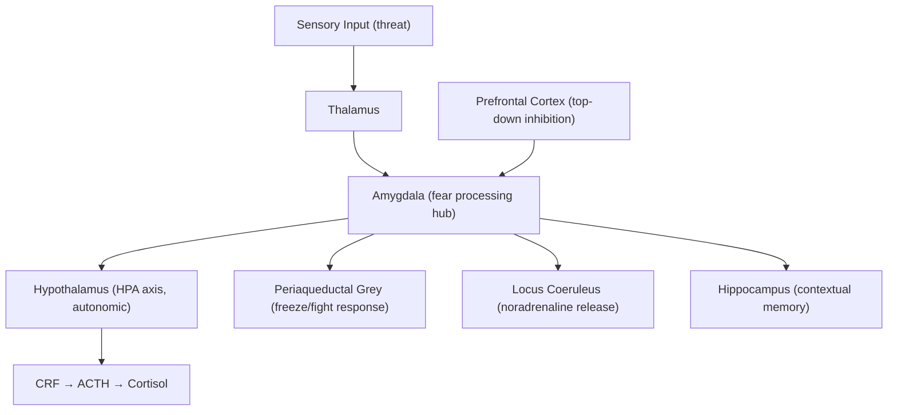

## Definition

**Stress-related disorders** are a group of psychiatric conditions in which the development of clinically significant emotional, behavioural, or physiological symptoms is directly linked to exposure to a stressful or traumatic event. The key distinguishing feature from other psychiatric disorders (e.g., depression, anxiety disorders) is the **clear temporal and aetiological relationship to an identifiable stressor** [1][2].

The word "stress" comes from the Latin *stringere* ("to draw tight"). In psychiatry, we use it to describe the psychological and physiological strain placed on an individual's coping capacity by external events.

<Callout title="Core Concept">
The stress-vulnerability model explains why the same event causes disorder in one person but not another. Psychiatric disorders or maladaptive stress reactions occur when the **stress** overwhelms an individual's **vulnerability threshold**. Both biological vulnerability (genetics, neurodevelopment) and psychosocial protective factors (coping skills, social support, medications) modulate this threshold [2].
</Callout>

---

## Epidemiology

### Acute Stress Disorder (ASD)
- ***5–20% of individuals after major trauma*** [1][2]
  - Road traffic accidents: 13–21%
  - Mild TBI: 14%
  - Assault: 16–19%
  - Burns: 10%
  - Industrial accidents: 6–12%
  - ***Witnessing a mass shooting: 33%*** [2]

### Post-Traumatic Stress Disorder (PTSD)
- ***7–9% of general population*** (lifetime prevalence) [1]
- ***60–80% of trauma victims*** develop some symptoms; a subset go on to full PTSD [1]
- 12-month prevalence: 3.5–4.7% [2]
- Lifetime prevalence: 6.1–9.2% [2]
- By trauma type [2]:
  - ***Sexual assault: 12.3% (up to 50–80%)*** [1]
  - ***Combat veterans: ~30%*** [1]
  - Mass conflict/displacement: 30.6%
  - Medical illness: 6.5%
- ***Increased risk in women, younger people*** [1]
- ***Risk increases with "dose" of trauma, lack of social support, pre-existing psychiatric disorder*** [1]

### Adjustment Disorder
- Prevalence: 2–8% in community samples; up to 12–23% in psychiatric consultation-liaison settings
- Most common psychiatric diagnosis in general hospital settings [2]
- Demographics: affects all ages; no strong sex predominance (some studies suggest slight F > M)

---

## Risk Factors

Risk factors for stress-related disorders are best understood through the **biopsychosocial model**, and many are shared across ASD, PTSD, and adjustment disorder [1][2]:

| Domain | Risk Factors |
|---|---|
| **Pre-trauma / Predisposing** | ***Pre-existing psychiatric disorder*** (depression, anxiety) [1][2]; ***Prior traumatic exposure*** ("sensitisation") [2]; ***Female gender*** [1][2]; ***Neuroticism*** [1][2]; ***Lower intelligence*** [2]; ***Genetic/familial vulnerability*** [1]; Early life adversity (abuse, neglect) |
| **Peri-trauma** | ***Trauma severity / "dose"*** [1]; Intentional interpersonal violence > accidents/disasters [2]; ***Autonomic arousal immediately after trauma predicts PTSD*** [1]; Perceived life threat; Dissociation at time of trauma |
| **Post-trauma / Perpetuating** | ***Lack of social support*** [1][2]; ***Avoidant coping*** [2]; Ongoing life stressors; Substance use; Lack of early intervention |

<Callout title="High Yield" type="idea">
***Autonomic arousal immediately after trauma predicts PTSD*** [1]. This is clinically important because it provides a biological marker that can identify individuals at risk early — those with tachycardia, hyperventilation, and heightened startle in the acute phase are more likely to develop chronic PTSD.
</Callout>

---

## Anatomy and Neurocircuitry of the Stress Response

Understanding the neurobiology helps you understand *why* these patients have the symptoms they do.

### The Fear Circuit
The brain's response to threat is mediated by a network centred on the **amygdala**:

| Structure | Normal Function | Abnormality in PTSD |
|---|---|---|
| **Amygdala** | Detects threat, initiates fear response | ***Hyperactive*** — exaggerated fear responses, hypervigilance |
| **Hippocampus** | Contextualises memories (where, when, safe vs. unsafe) | ***Reduced volume*** [1][2] — failure to contextualise trauma memories → memories "float" without time/place context → re-experiencing symptoms feel like they are happening *now* |
| **Prefrontal cortex (vmPFC, ACC)** | Top-down inhibition of amygdala; extinction of conditioned fear | ***Hypoactive*** — failure to extinguish fear responses, poor emotional regulation |
| **Locus coeruleus** | Source of central noradrenaline | ***Overactive*** — elevated central NA → hyperarousal, exaggerated startle |

### The HPA Axis in PTSD

This is *counterintuitive* and a favourite exam topic:

- In **depression**: ↑cortisol (HPA axis overactivation, failure of dexamethasone suppression)
- In **PTSD**: ***↓plasma cortisol with upregulation of glucocorticoid receptors, ↑CRH in CSF*** [1][2]

Why? The current model suggests:
1. Acute trauma → massive cortisol release
2. Chronic PTSD → glucocorticoid receptors become *upregulated* (supersensitive) as a compensatory mechanism
3. This leads to enhanced **negative feedback** on the HPA axis → lower baseline cortisol
4. But CRH in the brain remains elevated → ongoing central stress signalling despite low peripheral cortisol
5. The result: a system that is "hypersensitive" — it takes very little cortisol to shut off the axis, but the central drive remains excessive

<Callout title="PTSD vs Depression: HPA Axis" type="error">
A common exam mistake is to assume PTSD has the same cortisol profile as depression. Remember: **Depression = high cortisol, poor suppression. PTSD = low cortisol, enhanced suppression** (supersensitive GR). This is a critical distinguishing feature.
</Callout>

### Neurochemical Changes

| Neurotransmitter | Change in PTSD | Clinical Correlate |
|---|---|---|
| ***Noradrenaline (norepinephrine)*** | ***↑central NA levels with down-regulated central adrenergic receptors*** [1][2] | Hyperarousal, hypervigilance, exaggerated startle, insomnia — explains why ***prazosin (α1-blocker)*** helps nightmares |
| ***CRF (corticotropin-releasing factor)*** | ***↑CRH in CSF*** [1] | Central stress drive, anxiety |
| ***Cortisol*** | ***↓plasma cortisol*** [1] | Supersensitive negative feedback (see above) |
| Serotonin (5-HT) | Dysregulated | Mood, irritability, impulsivity — explains why **SSRIs** help |
| GABA | ↓ | Loss of inhibitory tone → anxiety, hyperarousal |

---

## Aetiology

The aetiology of stress-related disorders is best organized using the **biopsychosocial framework** [1][2].

### Biological Factors

| Factor | Detail |
|---|---|
| ***Genetic/familial vulnerability*** [1] | Genetics account for ***~1/3 of variance in susceptibility to PTSD*** [2]; effect partly but not completely mediated through personality (i.e., neuroticism); familial aggregation present |
| ***Neurobiological*** | ***↑central NA with down-regulated adrenergic receptors; ↓plasma cortisol with upregulated glucocorticoid receptors; ↑CRH in CSF; ↓hippocampus, left amygdala, ACC volume*** [1][2] |
| ***Stress-induced release*** | ***Norepinephrine, CRF, Cortisol*** — the triad of the acute stress neurochemical cascade [1] |
| ***Autonomic arousal immediately after trauma predicts PTSD*** [1] | Peri-traumatic sympathetic activation (HR, BP) is a biological predictor |

### Psychological Factors

| Factor | Detail |
|---|---|
| ***Conditioned fear*** [1] | Classical conditioning: the traumatic event (UCS) becomes associated with contextual cues (CS). Later, the CS alone triggers a fear response (CR). In PTSD, there is ***failure to extinguish*** this conditioned response — the brain keeps responding as though the trauma is recurring. This is the basis for **exposure therapy** (systematic extinction of the conditioned fear response) [2] |
| Cognitive theories | Overwhelming of normal cognitive processing of emotionally charged information → memories persist in an ***unprocessed form*** → can ***intrude into conscious awareness*** (flashbacks, nightmares) [2]. This is the basis for **cognitive restructuring** in trauma-focused CBT |
| Psychodynamic theories | Early developmental difficulties → incomplete emotional development → ***↑susceptibility to traumatic stressors*** [2] |
| ***Personality factors*** | ***Neuroticism*** is consistently associated [1][2]. Neuroticism reflects a tendency toward negative affect, emotional instability, and heightened threat sensitivity |
| ***Avoidant coping*** | Avoidance prevents emotional processing of trauma → perpetuates unprocessed memories → maintains re-experiencing and hyperarousal [2] |

### Social Factors

| Factor | Detail |
|---|---|
| ***Lack of social support*** [1][2] | The single strongest *modifiable* post-trauma risk factor. Social support buffers stress by providing emotional processing, practical help, and meaning-making |
| ***Female gender*** [1][2] | ~2× risk of PTSD compared to males (despite lower trauma exposure). Hypothesised mechanisms: hormonal (oestrogen modulates fear conditioning), higher rates of sexual trauma, social/cultural factors |
| ***Lower intelligence*** [2] | May impair cognitive processing of trauma and problem-solving coping |
| ***Prior trauma / psychiatric Hx*** ("sensitisation") [2] | Each trauma lowers the threshold for subsequent PTSD — the brain becomes "sensitised" |
| ***Trauma type*** | ***PTSD more commonly follows intentional acts of interpersonal violence (especially combat, sexual assaults) than accidents or disasters*** [2]. Why? Interpersonal violence shatters trust in other humans and creates a sense of betrayal, which is harder to process than impersonal events |

<Callout title="The Stress-Vulnerability Model" type="idea">
***Psychiatric disorders or maladaptive stress reactions occur when stress overwhelms vulnerability*** [2]. Two people exposed to the same trauma may have different outcomes depending on their biological vulnerability (genetics, brain structure), psychological resilience (coping style, personality), and social buffers (support network). This model is the foundation for understanding *all* stress-related disorders and guides a multi-modal treatment approach targeting all three domains.
</Callout>

---

## Classification of Stress-Related Disorders

***Trauma- and Stressor-Related Disorders*** include [1]:
- ***Acute Stress Reaction***
- ***Post-traumatic Stress Disorder***
- ***Adjustment Disorders***

The key distinction is based on **(a) the nature of the stressor** and **(b) the time course**:

### By Nature of Stressor

| | ***Traumatic Stress*** | ***Psychosocial Stress*** |
|---|---|---|
| **Definition** | ***Occurs outside range of normal human experience*** — would be experienced as traumatic by most people [2] | Any life event/condition that places strain on coping — **subjective** [2] |
| **Examples** | Combat, sexual assault, natural disaster, serious accident, witnessing death | Relationship breakdown, job loss, illness, financial difficulty, bereavement |
| **Physical/psychological integrity** | ***Often involves circumstances where a person feels their own or a loved one's physical or psychological integrity is threatened*** [2] | Not necessarily life-threatening |
| **Associated Dx** | ASD, PTSD | ***Normal reaction, adjustment disorder, precipitation of other psychiatric conditions (mood, anxiety, psychotic)*** [2] |

### By Time Course

| Time Frame | Immediate to 2–3 days | 2–3 days to 1 month | > 1 month |
|---|---|---|---|
| **Traumatic stressor** with trauma-related symptoms (re-experiencing, dissociation, avoidance) | | | |
| DSM-5 | / | ***Acute Stress Disorder*** | ***PTSD*** |
| ICD-10 | ***Acute Stress Reaction*** | Acute Stress Disorder | PTSD |

| Time Frame | Immediate to 6 months after resolution | > 6 months after resolution |
|---|---|---|
| **Any stressor** with non-trauma-related symptoms (anxiety, depression, mixed) | | |
| DSM-5 | ***Adjustment Disorder*** or depressive/anxiety disorder | Depressive/anxiety disorder |
| ICD-10 | ***Adjustment Disorder*** or depressive/anxiety disorder | Depressive/anxiety disorder |

<Callout title="ICD-10 vs DSM-5: Acute Stress" type="error">
***Acute stress reaction (ICD-10) refers to the acute, short-lived, normal reaction*** (resolves in hours to days) after traumatic stressor. ***Acute stress disorder (DSM-5) refers to the more prolonged abnormal response*** (3 days to 4 weeks) which is less common and ***may predict later onset of PTSD*** [2]. Don't confuse these — they capture different temporal phases of the same spectrum.
</Callout>

---

## Clinical Features

Clinical features are organised by disorder, with symptoms and signs separated and pathophysiological basis explained inline.

### 1. Acute Stress Reaction (ICD-10) / Acute Stress Response

**Time course**: Starts ***≤1 hour from stressor***, diminishes after ***≤48 hours***, disappears within a few days [2]

This is essentially the **normal acute response** to extreme trauma. Think of it as the "fight-or-flight" response that hasn't yet turned pathological.

#### Symptoms
| Symptom | Pathophysiological Basis |
|---|---|
| **Dazed, bewildered state** | Overwhelming of cortical processing capacity; prefrontal cortex "shuts down" under extreme amygdala activation |
| **Narrowing of attention / difficulty processing stimuli** | Thalamic gating redirects processing to survival-relevant stimuli; non-essential cortical processing is suppressed |
| **Disorientation** | Hippocampal function impaired by acute cortisol surge → difficulty with spatial and temporal orientation |
| **Anxiety, fear, anger** | Amygdala-driven emotional activation; noradrenaline surge from locus coeruleus |
| **Autonomic symptoms**: tachycardia, sweating, flushing | Sympathetic activation via hypothalamus → sympathetic chain (fight-or-flight response) |
| **Dissociative symptoms** (depersonalisation, derealisation) | Thought to be a protective "circuit breaker" — the brain detaches from overwhelming reality to prevent further psychological damage. Mediated by endogenous opioid release and prefrontal-limbic disconnection |

#### Signs
- Fluctuating, mixed clinical picture (the presentation changes rapidly)
- ***Persistent disorientation and confusion*** (may mimic PTSD but usually no clear re-experiencing or avoidance) [2]
- Psychomotor agitation or withdrawal (either "fighting" or "freezing")
- Autonomic signs: tachycardia, diaphoresis, hyperventilation

### 2. Acute Stress Disorder (DSM-5)

**Time course**: Starts during or shortly after stressor; lasts ***≥3 days but ≤4 weeks*** [2]

This represents the ***more prolonged abnormal response*** that is a risk factor for PTSD. If symptoms persist beyond 1 month, you reclassify as PTSD.

The DSM-5 requires **9 or more symptoms from any of 5 categories** (intrusion, negative mood, dissociation, avoidance, arousal):

#### Symptoms

**A. Intrusion / Re-experiencing symptoms**
| Symptom | Pathophysiological Basis |
|---|---|
| ***Flashbacks*** (involuntary, vivid reliving of the event) | Trauma memories are encoded by the amygdala in a sensory-rich, emotionally charged, but *contextually poor* form (due to hippocampal impairment). When triggered, these memories replay as though the event is happening *now* because they lack the hippocampal "time stamp" |
| ***Nightmares*** | During REM sleep, the amygdala is highly active while prefrontal inhibition is reduced → trauma memories replay without cortical regulation. The locus coeruleus normally goes silent during REM; in PTSD, it remains active → disrupted sleep architecture |
| ***Intrusive distressing memories*** | Unprocessed trauma memories stored in amygdala "leak" into consciousness when triggered by internal or external cues |
| **Intense psychological distress or physiological reactivity to trauma reminders** | Classical conditioning: environmental cues (CS) associated with the trauma (UCS) trigger the conditioned fear response |

**B. Negative Mood**
| Symptom | Pathophysiological Basis |
|---|---|
| ***Inability to experience positive emotions*** (emotional numbing, anhedonia) | Chronic amygdala activation leads to depletion of reward circuitry (ventral tegmental area → nucleus accumbens dopamine pathway). Also, persistent stress hormones blunt mesolimbic dopamine signalling |

**C. Dissociative Symptoms**
| Symptom | Pathophysiological Basis |
|---|---|
| ***Altered sense of reality*** (derealisation — "the world feels unreal") | Dissociation as a neurobiological protective mechanism: medial prefrontal cortex over-inhibits the amygdala to dampen emotional response, but at the cost of disconnection from reality |
| ***Inability to remember important aspect of trauma*** (dissociative amnesia) | State-dependent encoding: memories formed under extreme stress are encoded in a way that is inaccessible to normal conscious recall (hippocampal encoding impaired by cortisol/NA surge) |
| ***Depersonalisation*** ("I feel detached from my body") | Parietal-temporal cortex disconnection from the body map; endogenous opioid system activation |

**D. Avoidance Symptoms**
| Symptom | Pathophysiological Basis |
|---|---|
| ***Avoidance of trauma-related stimuli*** (memories, thoughts, feelings, people, places) | Operant conditioning: avoidance reduces the distressing conditioned fear response → negatively reinforced → avoidance becomes habitual. *This is exactly why avoidance perpetuates the disorder* — it prevents the extinction of conditioned fear |

**E. Arousal Symptoms**
| Symptom | Pathophysiological Basis |
|---|---|
| ***Sleep disturbance*** | Elevated NA from locus coeruleus disrupts sleep architecture; hyperarousal state prevents transition to deep sleep |
| ***Irritability / angry outbursts*** | Amygdala hyperactivation with inadequate prefrontal regulation → lowered threshold for emotional reactivity |
| ***Hypervigilance*** | Locus coeruleus–noradrenaline system on "high alert" → scanning environment for threats constantly |
| ***Exaggerated startle response*** | Sensitised amygdala–brainstem circuits (specifically the pontine reticular formation) → enhanced acoustic startle reflex |
| ***Poor concentration*** | Attentional resources hijacked by threat-monitoring systems; prefrontal cognitive resources diverted |

#### Signs
- Hyperarousal on examination: restlessness, distractibility, exaggerated startle
- Autonomic hyperactivity: elevated resting HR, sweating
- Flat or constricted affect (if dissociative type predominates)
- May appear "on edge" or alternatively "numb and detached"

### 3. Post-Traumatic Stress Disorder (PTSD)

**Time course**: Symptoms persist ***> 1 month*** after traumatic event. ***Should have onset within 6 months after stressor*** (ICD-10) [2]. DSM-5 includes a "delayed expression" specifier for those with onset > 6 months.

The symptom clusters are the same as ASD but are organized into **4 clusters** (DSM-5) rather than 5:

***Characterised by re-experiencing (flashbacks, nightmares, intrusive images), avoidance (of cues, poor memory of event, detachment/numbing) and hyperarousal (anxiety, irritability, insomnia, poor concentration)*** [2]

#### Symptoms

| Cluster | Key Symptoms | Pathophysiology |
|---|---|---|
| **B. Intrusion** | Flashbacks, nightmares, intrusive memories, distress/physiological reactivity to cues | Amygdala-driven, context-poor trauma memories (hippocampal encoding failure) + conditioned fear responses |
| **C. Avoidance** | Avoidance of trauma-related thoughts, feelings, external reminders | Operant conditioning (negative reinforcement); prevents extinction |
| **D. Negative alterations in cognition and mood** | Distorted blame (self/others), persistent negative emotional state (fear, horror, anger, guilt, shame), diminished interest, feeling detached/estranged, inability to experience positive emotions | Prefrontal-limbic dysfunction, serotonin/dopamine depletion, cognitive distortions (overgeneralisation, personalisation) |
| **E. Arousal and reactivity** | Irritability, reckless/self-destructive behaviour, hypervigilance, exaggerated startle, concentration problems, sleep disturbance | Noradrenergic hyperactivation, amygdala sensitisation, impaired prefrontal regulation |

#### Signs
- Hyperarousal state on MSE: psychomotor agitation, exaggerated startle during interview
- Emotional blunting or restricted affect
- Avoidance behaviours (may refuse to discuss trauma)
- Dissociative features (depersonalisation/derealisation — DSM-5 subtype)
- Comorbidities frequently present on examination: evidence of substance use, self-harm, weight change

#### DSM-5 Specifiers
- **With dissociative symptoms**: depersonalisation or derealisation
- **With delayed expression**: full criteria not met until ≥6 months after event (though some symptoms may begin immediately)

#### Important Clinical Distinctions

| Feature | ASD | PTSD |
|---|---|---|
| Time | 3 days–4 weeks | > 1 month |
| Dissociation | Prominent (one of 5 categories) | May or may not be present (specifier) |
| Predictive value | ***ASD may predict later PTSD*** but many PTSD patients never had ASD [2] |
| Minimum symptom count | 9 from any 5 categories | At least 1 intrusion + 1 avoidance + 2 cognition/mood + 2 arousal |

### 4. Adjustment Disorder

**Time course**: Develops ***≤3 months of stressor*** (DSM-5) [2]. Resolves within ***6 months of resolution of stressor*** (or its consequences).

This is the "catch-all" diagnosis for clinically significant distress in response to an identifiable stressor that does ***not*** meet criteria for another specific mental disorder (e.g., MDD, GAD).

- ***Stressor***: usually adaptation to new circumstances or stressful life event (not necessarily traumatic) [2]
- ***Symptoms***: usually anxiety/depressive symptoms that are ***clearly arising from stressor and out of proportion to original stressor*** ("disorder" vs "normal reaction") but ***does not meet criteria of a specific mood/anxiety disorder*** [2]

#### Subtypes (DSM-5)
| Subtype | Features |
|---|---|
| ***With depressed mood*** | Low mood, tearfulness, hopelessness |
| ***With anxiety*** | Nervousness, worry, jitteriness, separation anxiety (in children) |
| ***With mixed anxiety and depressed mood*** | Combination of above |
| ***With disturbance of conduct*** | Behavioural disturbance (truancy, vandalism, reckless driving, fighting) |
| ***With mixed disturbance of emotions and conduct*** | Both emotional and behavioural symptoms |
| ***Unspecified*** | Maladaptive reactions not classifiable above |

#### ICD-10 Subtypes
- ***F43.20 Brief depressive reaction***: transient, mild depressive state ≤1 month [2]
- ***F43.21 Prolonged depressive reaction***: mild depressive state in response to prolonged stressor, maximum duration 2 years [2]
- Mixed anxiety and depressive reaction
- With predominant disturbance of other emotions
- With predominant disturbance of conduct
- With mixed disturbance of emotions and conduct

#### Symptoms
| Symptom | Pathophysiological Basis |
|---|---|
| Depressed mood, tearfulness | HPA axis activation by chronic stress → serotonin/noradrenaline depletion → mood dysregulation. The stressor disrupts psychological equilibrium without reaching the severity of a major depressive episode |
| Anxiety, worry, nervousness | Amygdala sensitisation by ongoing stressor; lower threshold for threat detection |
| Impaired social/occupational functioning | Cognitive resources consumed by rumination and emotional distress → reduced executive function |
| Behavioural symptoms (conduct disturbance) | Impaired prefrontal regulation of impulse control under stress, particularly in adolescents |

#### Signs
- Anxious or depressed appearance on MSE
- May present with somatic complaints (headache, insomnia, fatigue)
- Functioning is impaired but insight is usually preserved
- No psychotic features

#### Diagnostic Boundaries
| Feature | Normal Reaction | Adjustment Disorder | MDD / GAD |
|---|---|---|---|
| Distress proportionate to stressor | Yes | ***No — out of proportion*** [2] | May be independent of stressor |
| Functional impairment | Mild, transient | ***Significant*** | Significant |
| Meets criteria for specific disorder | No | ***No*** | ***Yes*** |
| Time relationship to stressor | Clear | ***Clear (≤3mo)*** | May or may not be |

---

## Concussion / Mild TBI — Differential Consideration

***Mild TBI may mimic PTSD symptoms (e.g., irritability, startle response, poor concentration), but usually there are no re-experiencing and avoidance symptoms. There may be persistent disorientation and confusion*** [2]. This is an important differential, especially in combat or road traffic accident settings.

---

## Summary of Key Pathophysiological Mechanisms Across Stress-Related Disorders

| Mechanism | Manifestation |
|---|---|
| Amygdala hyperactivation | Fear, hypervigilance, exaggerated startle, flashbacks |
| Hippocampal dysfunction (↓volume) | Context-poor memories, dissociative amnesia, difficulty distinguishing safe vs. unsafe |
| Prefrontal hypoactivation | Poor fear extinction, emotional dysregulation, impaired concentration |
| ↑Noradrenaline (locus coeruleus) | Hyperarousal, insomnia, startle, nightmares |
| ↑CRH (central) / ↓cortisol (peripheral) | Chronic central stress signalling despite low baseline cortisol (PTSD-specific) |
| Classical conditioning (fear) | Re-experiencing triggered by cues; avoidance behaviour |
| Operant conditioning (avoidance) | Negative reinforcement perpetuates avoidance → prevents extinction → maintains disorder |

---

<Callout title="High Yield Summary">

1. ***Stress-related disorders include Acute Stress Reaction, Acute Stress Disorder, PTSD, and Adjustment Disorder*** [1]
2. The **stress-vulnerability model** explains individual susceptibility: disorder occurs when stress overwhelms vulnerability threshold [2]
3. ***Traumatic stress*** occurs **outside range of normal human experience** → ASD/PTSD. ***Psychosocial stress*** is subjective → adjustment disorder [2]
4. **Time course is critical**: ASD = 3 days–4 weeks; PTSD = > 1 month; Adjustment disorder = ≤3 months of stressor, resolves within 6 months
5. ***PTSD neurobiology***: ↑amygdala, ↓hippocampus, ↓PFC, ↑NA, ↑CRH, ↓cortisol [1][2]
6. ***PTSD has LOW cortisol*** (unlike depression) due to upregulated glucocorticoid receptors and enhanced negative feedback [2]
7. ***Autonomic arousal immediately after trauma predicts PTSD*** [1]
8. ***Risk factors***: female gender, neuroticism, prior trauma, pre-existing psychiatric disorder, lack of social support, trauma severity [1][2]
9. ***PTSD clusters***: Intrusion + Avoidance + Negative cognition/mood + Arousal (mnemonic: **I-A-N-A** or think "I Avoid Negative Arousal")
10. ***Conditioned fear*** (classical conditioning) drives re-experiencing; ***avoidance*** (operant conditioning, negative reinforcement) maintains the disorder [1][2]
11. ***Mild TBI mimics PTSD*** (irritability, startle, poor concentration) but lacks re-experiencing and avoidance [2]
12. ***Adjustment disorder*** = distress out of proportion to stressor + does NOT meet criteria for another specific disorder [2]

</Callout>

---

<ActiveRecallQuiz
  title="Active Recall - Stress-Related Disorders: Definition, Epidemiology, Aetiology, Classification, Clinical Features"
  items={[
    {
      question: "Explain the key difference in the HPA axis between PTSD and major depression.",
      markscheme: "PTSD: low plasma cortisol, upregulated glucocorticoid receptors, enhanced negative feedback, elevated CRH in CSF. Depression: high cortisol, impaired dexamethasone suppression. The supersensitive GRs in PTSD lead to enhanced cortisol suppression despite elevated central CRH drive.",
    },
    {
      question: "List the four symptom clusters of PTSD in DSM-5 and give one example symptom for each.",
      markscheme: "Intrusion (e.g. flashbacks), Avoidance (e.g. avoiding trauma reminders), Negative alterations in cognition and mood (e.g. persistent guilt or emotional numbing), Arousal and reactivity (e.g. exaggerated startle response).",
    },
    {
      question: "Why does avoidance perpetuate PTSD rather than help recovery?",
      markscheme: "Avoidance is negatively reinforced (operant conditioning) because it reduces distressing conditioned fear responses. However, it prevents extinction of the conditioned fear association, so trauma-related cues continue to trigger distress. This is why exposure therapy is a cornerstone of treatment.",
    },
    {
      question: "Distinguish between acute stress reaction (ICD-10) and acute stress disorder (DSM-5) in terms of onset, duration, and clinical significance.",
      markscheme: "Acute stress reaction (ICD-10): onset within 1 hour, diminishes within 48 hours, gone within days; represents normal acute response. Acute stress disorder (DSM-5): onset during or shortly after trauma, lasts 3 days to 4 weeks; represents abnormal prolonged response and may predict later PTSD.",
    },
    {
      question: "A patient presents 2 months after a job loss with low mood and anxiety. They do not meet criteria for MDD or GAD. What is the most likely diagnosis and what are the key diagnostic requirements?",
      markscheme: "Adjustment disorder. Requirements: identifiable stressor within 3 months, marked distress out of proportion to stressor OR significant functional impairment, does not meet criteria for another mental disorder, not normal bereavement. Resolves within 6 months of stressor resolution.",
    },
    {
      question: "Name three biological predictors or neurobiological findings that predict or characterise PTSD.",
      markscheme: "Any 3 of: autonomic arousal immediately after trauma predicts PTSD, reduced hippocampal volume, elevated central noradrenaline with down-regulated adrenergic receptors, low plasma cortisol with upregulated GRs, elevated CRH in CSF, decreased left amygdala and ACC volume, amygdala hyperactivation.",
    },
  ]}
/>

---

## References

[1] Lecture slides: GC 171. Stress-related disorders and obsessive-compulsive disorder (Post-traumatic stress disorder adjustment disorder, acute stress disorder)_rev.pdf
[2] Senior notes: ryanho-psych.md (Section 8.3.1, 8.3.2, stress-vulnerability model, classification, aetiology, clinical features)
