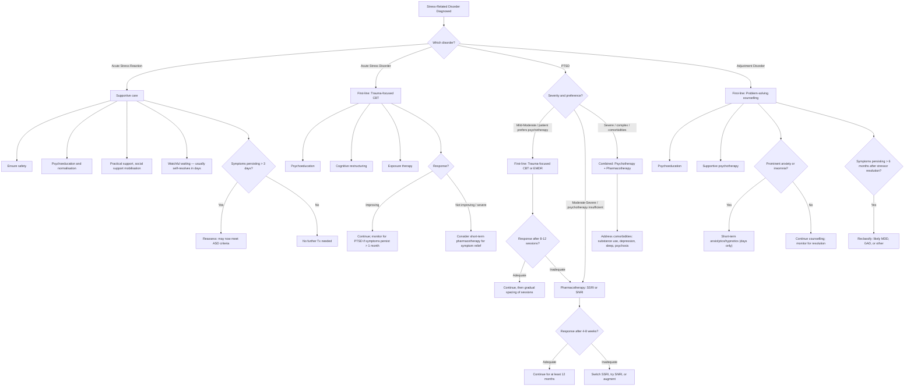
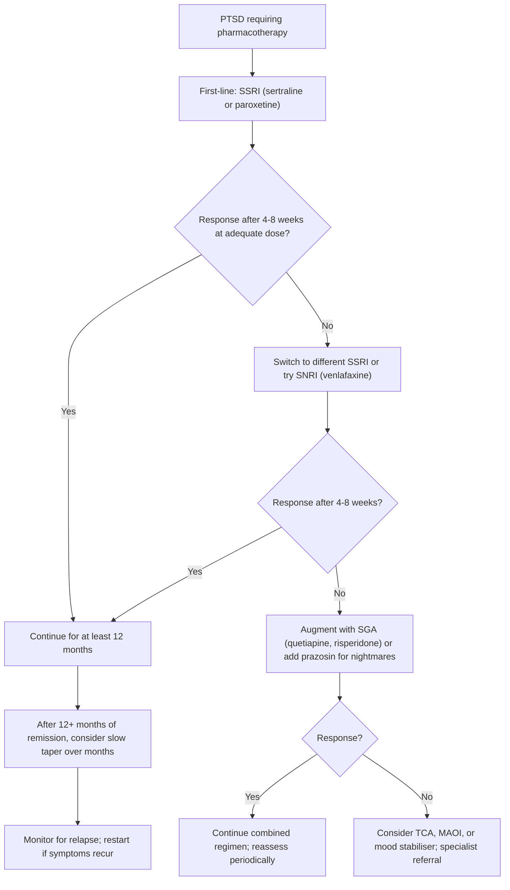

## Management of Stress-Related Disorders

The management of stress-related disorders follows a **stepped-care, biopsychosocial model**. The core principle is simple: ***there are many effective treatments including psychotherapy and psychopharmacology*** [1]. However, the balance between psychotherapy and pharmacotherapy differs dramatically depending on which disorder you are treating.

A useful way to remember the hierarchy:

- **Acute Stress Reaction** → supportive care, watchful waiting (this is a *normal* response)
- **Acute Stress Disorder** → trauma-focused psychotherapy first; pharmacotherapy generally NOT helpful
- **PTSD** → trauma-focused psychotherapy first-line; pharmacotherapy as augmentation or second-line
- **Adjustment Disorder** → problem-solving counselling; pharmacotherapy only briefly if needed

---

## Management Algorithm

---

## Treatment Modalities by Disorder

### 1. Acute Stress Reaction — Management

This is the **normal** acute response. Your job is NOT to pathologise it but to support the person through it.

| Intervention | Detail | Rationale |
|---|---|---|
| **Ensure safety** | Remove from danger, provide safe environment | Basic human need; sympathetic activation cannot subside while threat persists |
| **Psychoeducation** | Explain that the reaction is *normal*, expected, and self-limiting | Reduces secondary anxiety ("Am I going mad?"); normalisation prevents catastrophising about own symptoms |
| **Social support mobilisation** | Involve family, friends, community resources | Social support is the strongest modifiable protective factor against progression to PTSD |
| **Practical support** | Address immediate needs (food, shelter, communication) | Reduces ongoing stressor load; allows physiological recovery |
| **Watchful waiting** | Monitor; most resolve within hours to days | Premature intervention (e.g., forced debriefing) may be iatrogenic |

<Callout title="Do NOT Force Debriefing" type="error">
***Critical Incident Stress Debriefing (CISD): although widely used, has NOT shown to be helpful in reducing psychological distress*** [2]. In fact, some evidence suggests it may be *harmful* by re-exposing people to trauma narratives before they are psychologically ready. Current guidelines recommend **psychological first aid** (practical support, safety, normalisation) rather than mandatory debriefing.
</Callout>

---

### 2. Acute Stress Disorder — Management

***Pharmacotherapy: generally not considered helpful*** [2] for ASD. The mainstay is psychotherapy.

#### First-Line: Trauma-Focused CBT [2]

***Trauma-focused CBT*** is the gold standard for ASD. It has three components, each targeting a specific pathophysiological mechanism:

| Component | What It Involves | Mechanism / Why It Works |
|---|---|---|
| ***Psychoeducation*** [2] | ***Patients are educated on stressful reactions and their cognitive underpinnings*** | Normalises the experience; reduces secondary distress about symptoms; improves engagement with treatment by providing a coherent framework for understanding what is happening |
| ***Cognitive restructuring*** [2] | ***Address maladaptive or unrealistic appraisals by patient towards trauma, their response to the event, and fears of potential future harm*** | Targets Cluster D (negative cognitions): the distorted beliefs like "It was all my fault" or "Nowhere is safe" are identified, challenged, and replaced with balanced cognitions. This is based on cognitive theory — these appraisals maintain the fear response |
| ***Exposure therapy*** [2] | ***Assist patient in confronting feared memories and situations; allow emotional processing of emotional response following exposure to related cues*** | Targets Clusters B and C (intrusion and avoidance): by systematically exposing the patient to trauma-related cues in a safe, controlled setting, the conditioned fear response undergoes **extinction** (classical conditioning principle). The key: avoidance is negatively reinforced and prevents extinction. Exposure breaks this cycle |

#### What NOT to Do

| Intervention | Status | Evidence |
|---|---|---|
| ***Critical Incident Stress Debriefing (CISD)*** [2] | ***NOT recommended*** | ***Although widely used, has NOT shown to be helpful in reducing psychological distress*** [2]. May be harmful — a single session of forced narrative reconstruction does not allow proper processing and may retraumatise |
| ***Pharmacotherapy*** [2] | ***Generally not considered helpful*** for ASD | Early benzodiazepine use may interfere with fear extinction and is associated with worse PTSD outcomes; early SSRI/SNRI use has not shown clear benefit for ASD specifically |

<Callout title="Why Debriefing Doesn't Work (and Exposure Does)">
Both involve talking about the trauma. The difference is *how*. CISD is a single, often mandatory session shortly after the event — the person may not be ready, and a single exposure is insufficient for extinction. Trauma-focused CBT uses **graduated, repeated, controlled exposure** over multiple sessions (typically 5–12), allowing systematic habituation and cognitive reprocessing. Extinction requires *repeated, prolonged exposure* until the fear response subsides — a single brief session actually *reinforces* the conditioned fear.
</Callout>

---

### 3. Post-Traumatic Stress Disorder — Management

PTSD management is the most comprehensive and commonly tested. The approach is multimodal.

#### Overview of Treatment Approaches

***General treatment approaches*** [1]:
- ***Pharmacotherapy: Antidepressants, Anxiolytics, Antipsychotics, Mood stabilizers*** [1]
- ***Psychotherapy: Cognitive Behavior Therapy (CBT), Mindfulness-based Therapy*** [1]

***Treatment of anxiety disorders*** (applicable to PTSD as an anxiety-spectrum disorder) [3]:
- ***Supportive measures: Explanation, Reassurance*** [3]
- ***Psychological treatment: Cognitive behavioural therapy*** [3]
- ***Medications: Antidepressants (e.g., SSRI, SNRI, TCA, MAOI etc.), Beta-adrenergic antagonist (e.g., propranolol), Benzodiazepines, Buspirone, Pregabalin*** [3]

#### A. Psychotherapy (First-Line)

##### i. Trauma-Focused CBT [2]

***Trauma-focused CBT: usually considered 1st line*** [2]

This is the same three-component model as for ASD (psychoeducation + cognitive restructuring + exposure therapy), but delivered over a longer course (typically 8–16 sessions) because the symptoms are more entrenched.

| Component | Application to PTSD | Mechanism |
|---|---|---|
| **Psychoeducation** | Understanding the nature of PTSD, normalising symptoms, building a therapeutic alliance | Reduces shame and self-blame; improves treatment adherence |
| **Cognitive restructuring** | Challenging distorted trauma-related appraisals ("It was my fault," "The world is completely dangerous") | Targets Cluster D — persistent negative cognitions. Based on Beck's cognitive model: identify automatic negative thoughts → examine evidence → develop balanced alternative thoughts |
| **Exposure therapy** | Imaginal exposure (narrating the trauma in detail) + in vivo exposure (gradually confronting avoided real-world situations/places) | Targets Clusters B and C. Prolonged, repeated exposure in a safe setting allows **extinction** of the conditioned fear response. The patient learns that the trauma-related cues are *not* dangerous in the present moment. Habituation occurs within and between sessions |

Why does CBT work in PTSD? From first principles:
- PTSD is maintained by two key mechanisms: **(1) unprocessed trauma memories** (stored by amygdala without hippocampal contextualisation) and **(2) avoidance** (prevents extinction)
- CBT directly targets both: exposure forces processing of the trauma memory and breaks avoidance; cognitive restructuring corrects the distorted meaning attached to the event
- The hippocampus "re-stamps" the memory with context ("this happened *then*, I am safe *now*"), integrating it into the normal autobiographical memory system

##### ii. Eye Movement Desensitisation and Reprocessing (EMDR) [2]

***EMDR*** is the other well-established first-line psychotherapy for PTSD.

| Aspect | Detail |
|---|---|
| **Procedure** | ***Patient imagines a scene from the trauma, focusing on accompanying cognition and arousal, while the therapist moves two fingers across the patient's visual field and instructs the patient to track the fingers*** [2] |
| **Sequence** | ***Sequence repeated until anxiety decreases, with patient instructed to generate a more adaptive thought*** [2] |
| **Mechanism** | Not fully understood. Hypotheses: (a) bilateral eye movements tax working memory → the trauma memory becomes less vivid and emotional when recalled; (b) bilateral stimulation mimics REM sleep processing → facilitates memory consolidation and integration; (c) the dual-attention task (tracking + remembering) forces "adaptive information processing" |
| **Efficacy** | ***Most studies show that it is efficacious in PTSD, superior to other less specific psychotherapy*** [2] |
| **Sessions** | Typically 6–12 sessions |
| **Advantages** | Does not require detailed verbal narration of the trauma (useful for patients who cannot tolerate prolonged exposure); structured protocol |

##### iii. Other Psychotherapies [2]

***Other psychotherapy: coping skills training, stress management, hypnotherapy, interpersonal therapy, mindfulness-based stress reduction, psychodynamic*** [2]

| Psychotherapy | Role in PTSD |
|---|---|
| **Coping skills training** | Teaches practical strategies for managing arousal, distress tolerance, and interpersonal difficulties. Not directly trauma-processing but improves daily functioning |
| **Stress management / relaxation training** | Progressive muscle relaxation, controlled breathing — targets autonomic hyperarousal. Adjunctive rather than standalone |
| ***Mindfulness-based therapy*** [1] | Developing non-judgemental awareness of present-moment experience; reduces avoidance and emotional reactivity. Growing evidence base as adjunct |
| **Interpersonal therapy** | Addresses interpersonal difficulties arising from PTSD (estrangement, relationship conflict). Useful when social functioning is a primary concern |
| **Psychodynamic therapy** | Explores unconscious meanings attached to trauma and how early life experiences shape vulnerability. Longer-term; less evidence base than CBT/EMDR |

#### B. Pharmacotherapy (Second-Line or Augmentation)

***Pharmacotherapy: usually as augmentation or 2nd line to psychotherapy*** [2]

The key principle: **drugs do NOT cure PTSD** — they manage symptoms (particularly hyperarousal, mood, and sleep) to enable the patient to engage in psychotherapy. Think of pharmacotherapy as the scaffolding, and psychotherapy as the actual construction.

##### i. Antidepressants — First-Line Pharmacotherapy

***Antidepressants: SSRIs, SNRIs → hyperarousal, mood*** [2]

| Drug Class | Examples | Mechanism | Target Symptoms | Evidence | Notes |
|---|---|---|---|---|---|
| ***SSRIs*** [1][2][3] | **Sertraline**, **paroxetine** (both FDA-approved for PTSD), fluoxetine, citalopram | Block serotonin reuptake transporter (SERT) → ↑synaptic 5-HT → modulates amygdala reactivity, improves prefrontal regulation, normalises HPA axis | All 4 PTSD clusters: intrusion, avoidance, mood/cognition, arousal | Strongest evidence; first-line pharmacotherapy internationally | Start low, go slow (initial ↑anxiety in first 1–2 weeks). Continue ≥12 months after response. Sertraline and paroxetine are the only FDA-approved medications for PTSD |
| ***SNRIs*** [2][3] | **Venlafaxine** | Blocks both SERT and noradrenaline reuptake transporter (NRT) → ↑5-HT and NA | All 4 clusters; may have additional benefit for fatigue, concentration (via NA) | Good evidence; recommended by NICE as first-line alongside SSRIs | Monitor BP (NA-mediated hypertension at higher doses) |

Why SSRIs work in PTSD — from first principles:
- Serotonin (5-HT) modulates the amygdala's threat response. Low serotonergic tone → amygdala is "uninhibited" → exaggerated fear, irritability, impulsivity
- ↑synaptic 5-HT → ↑serotonergic inhibition of amygdala → ↓re-experiencing, ↓hyperarousal
- 5-HT also modulates prefrontal cortex function → improved cognitive reappraisal and emotional regulation
- Additionally, SSRIs promote neuroplasticity (↑BDNF) → may help restore hippocampal volume lost in chronic PTSD

##### ii. Other Pharmacotherapy

| Drug Class | Examples | Mechanism | Target Symptoms | Indications / Notes |
|---|---|---|---|---|
| ***Second-generation antipsychotics (SGAs)*** [2] | Quetiapine, risperidone, olanzapine, aripiprazole | D₂ and 5-HT₂A antagonism; quetiapine also has antihistaminic (sedation) and α₁-blocking effects | Treatment-resistant PTSD, particularly hyperarousal, paranoia, sleep disturbance | ***As monotherapy or augmentation of antidepressants*** [2]. Used when PTSD has prominent anger, paranoia, or psychotic features. Watch for metabolic syndrome |
| ***α-blockers*** [2] | ***Prazosin*** | α₁-adrenergic receptor antagonist → blocks noradrenaline-mediated activation in the CNS, particularly during sleep | ***Can ↓PTSD symptoms, nightmares, sleep disturbance*** [2] | Specifically targets trauma-related nightmares and sleep disruption. The rationale: nightmares in PTSD are driven by elevated noradrenergic tone during sleep; blocking α₁ receptors reduces this. Start low (1 mg nocte), titrate slowly. Monitor for orthostatic hypotension |
| ***Benzodiazepines (BDZs)*** [1][2][3] | Diazepam, clonazepam, lorazepam | Positive allosteric modulator of GABA-A receptor → ↑inhibitory neurotransmission → anxiolysis, sedation, muscle relaxation | ***May be useful in treatment of anxiety and hyperarousal symptoms*** [2] | **Use with extreme caution in PTSD**: (a) may interfere with fear extinction (GABA-A enhancement blocks the learning required for exposure therapy); (b) high dependence/abuse potential especially in a population prone to substance use; (c) evidence does NOT support routine use in PTSD. Use only short-term, specific indications |
| ***TCAs*** [3] | Amitriptyline, imipramine | Block SERT + NRT + muscarinic/histaminic/α₁ receptors | Mood, sleep, hyperarousal | Third-line due to side effect burden (anticholinergic, cardiac, sedation). Lethal in overdose — avoid in suicidal patients |
| ***MAOIs*** [3] | Phenelzine | Inhibit monoamine oxidase → ↑5-HT, NA, DA | Mood, hyperarousal | Rarely used due to dietary restrictions (tyramine crisis) and drug interactions. Reserved for refractory cases |
| ***Beta-adrenergic antagonists*** [3] | ***Propranolol*** | β-receptor blockade → ↓peripheral and some central adrenergic effects (tachycardia, tremor) | Performance anxiety, autonomic arousal | ***Propranolol*** [3] has been studied for secondary prevention of PTSD (given shortly after trauma to block consolidation of fear memories). Results are mixed. Not standard treatment for established PTSD. Contraindicated in asthma |
| ***Buspirone*** [3] | — | 5-HT₁A partial agonist → anxiolytic without sedation or dependence | Chronic anxiety, augmentation | Slow onset (2–4 weeks); no abuse potential; limited evidence specifically for PTSD |
| ***Pregabalin*** [3] | — | Binds α₂δ subunit of voltage-gated calcium channels → ↓excitatory neurotransmitter release | Anxiety, hyperarousal, sleep | Some evidence for GAD; limited but growing evidence for PTSD. May help with comorbid pain |
| ***Mood stabilisers*** [1] | Valproate, lamotrigine | Various — valproate ↑GABA; lamotrigine blocks voltage-gated Na⁺ channels | Irritability, emotional dysregulation, impulsivity | ***Mood stabilizers*** [1] mentioned as a treatment approach. Used off-label for PTSD with prominent affective instability or comorbid bipolar features |

<Callout title="Benzodiazepines in PTSD: A Double-Edged Sword" type="error">
BDZs may seem logical for PTSD hyperarousal, but they are **NOT recommended as first-line or routine treatment**. Three reasons: (1) They enhance GABA-A → this *blocks* the new learning required for fear extinction during psychotherapy; (2) PTSD patients have high rates of substance use disorders → BDZs have high abuse/dependence potential; (3) They do NOT treat the core pathology (unprocessed trauma memories, conditioned fear). Use only briefly for acute crisis management, not as ongoing therapy [2].
</Callout>

##### Pharmacotherapy Decision Algorithm

#### C. Treatment of Comorbid Conditions [2]

***Treat comorbid conditions, e.g., alcohol/substance use disorders, sleep disorders, psychosis*** [2]

This is critical because comorbidities are the *rule* in PTSD, not the exception:

| Comorbidity | Management Approach |
|---|---|
| **Depression** | SSRIs address both PTSD and comorbid depression simultaneously; add psychotherapy targeting depressive cognitions |
| **Substance use disorders** | Must be addressed concurrently — "stabilise-then-process" model. Motivational interviewing, relapse prevention, consider naltrexone/acamprosate for alcohol dependence. Avoid BDZs |
| **Sleep disorders** | Sleep hygiene education; prazosin for nightmares; consider trazodone (low-dose) for insomnia; avoid long-term BDZ hypnotics |
| **Psychosis** | SGA (e.g., risperidone, quetiapine) for PTSD with psychotic features or comorbid psychotic disorder |
| **Chronic pain** | Common comorbidity; SNRIs (duloxetine, venlafaxine) address both PTSD and neuropathic pain; avoid opioids (abuse risk) |

---

### 4. Adjustment Disorder — Management [2]

Adjustment disorder is generally self-limiting and requires less intensive treatment than PTSD.

***Management*** [2]:

| Intervention | Detail | Mechanism / Rationale |
|---|---|---|
| ***Problem-solving counselling*** [2] | ***Encouraging patient to seek solutions to stressful problems, and to consider advantages and disadvantages of various kinds of actions*** [2] | Targets the core issue: the patient feels overwhelmed by the stressor. Problem-solving therapy empowers them to regain a sense of control by systematically breaking down the problem, generating options, evaluating consequences, and implementing solutions |
| ***Other psychotherapy*** [2] | ***Psychodynamics, supportive*** [2] | Supportive therapy provides empathic listening, validation, and reinforcement of healthy coping. Psychodynamic therapy explores how early relational patterns may be shaping the patient's response to the current stressor |
| **Psychoeducation** | Explain the nature of the adjustment process; normalise distress; provide realistic expectations | Reduces secondary anxiety about symptoms; frames the experience as time-limited and manageable |
| ***Pharmacotherapy*** [2] | ***Anxiolytics/hypnotics may be helpful for a few days*** [2] | Short-term symptomatic relief of insomnia or acute anxiety. Must NOT become long-term. BDZ use should be limited to a few days — the condition is self-limiting and long-term medication use is inappropriate |

<Callout title="Adjustment Disorder: Less Is More" type="idea">
Unlike PTSD, adjustment disorder typically does NOT require intensive trauma-focused therapy or long-term medication. The stressor is not traumatic, and the symptoms are subthreshold. The prognosis is ***usually good*** [2], but be aware that adjustment disorder ***may herald future development of anxiety/depression*** [2]. Monitor the patient and reclassify if symptoms persist beyond 6 months of stressor resolution.
</Callout>

---

## Summary of Management by Disorder

| | Acute Stress Reaction | Acute Stress Disorder | PTSD | Adjustment Disorder |
|---|---|---|---|---|
| **First-line** | Supportive care, safety, psychoeducation | ***Trauma-focused CBT*** [2] | ***Trauma-focused CBT*** or ***EMDR*** [2] | ***Problem-solving counselling*** [2] |
| **Second-line** | Usually none needed | — | ***SSRIs (sertraline, paroxetine)*** or ***SNRIs (venlafaxine)*** [2][3] | ***Other psychotherapy (supportive, psychodynamic)*** [2] |
| **Augmentation** | — | — | ***SGAs, prazosin, BDZs (short-term)*** [2] | ***Anxiolytics/hypnotics (few days only)*** [2] |
| **NOT recommended** | CISD | ***CISD; pharmacotherapy generally not helpful*** [2] | Long-term BDZs as monotherapy | Long-term medication |
| **Duration of Rx** | Days | Weeks | ≥12 months pharmacotherapy; psychotherapy 8–16+ sessions | Weeks to few months |
| **Comorbidity Mx** | — | Monitor for PTSD | ***Treat comorbid substance use, depression, sleep disorders, psychosis*** [2] | Monitor for MDD/GAD development |

---

## Contraindications and Cautions — Key Summary

| Treatment | Contraindications / Cautions |
|---|---|
| **CISD** | NOT evidence-based; may worsen outcomes; avoid mandatory debriefing |
| **BDZs** | Avoid in PTSD patients with substance use disorders (high abuse potential); may block fear extinction and impair psychotherapy effectiveness; risk of dependence |
| **TCAs** | Avoid in suicidal patients (lethal in overdose due to cardiotoxicity — QT prolongation, Na⁺ channel blockade); anticholinergic effects problematic in elderly |
| **MAOIs** | Dietary restrictions (tyramine — risk of hypertensive crisis); extensive drug interactions (serotonin syndrome with SSRIs, sympathomimetics); avoid in non-adherent patients |
| **Propranolol** | Contraindicated in asthma (β₂ blockade → bronchospasm), heart block, severe peripheral vascular disease |
| **SSRIs** | Caution in first 2 weeks (initial ↑anxiety, ↑suicidality in young adults — black box warning); serotonin syndrome risk with MAOIs; GI side effects, sexual dysfunction |
| **SGAs** | Metabolic syndrome (weight gain, dyslipidaemia, hyperglycaemia — especially olanzapine); QT prolongation (especially quetiapine); extrapyramidal symptoms (especially risperidone at higher doses) |
| **Prazosin** | Orthostatic hypotension (start 1 mg nocte, titrate slowly); dizziness; avoid in patients already on multiple antihypertensives |

---

## Referral Criteria

***Consider referral to secondary care if*** [2]:
- Risk of self-harm or suicide
- Marked self-neglect
- Non-response to at least two treatments (stepped care principle)
- Significant comorbidity (e.g., substance use, physical health problems)
- Complex PTSD (prolonged, repeated trauma — e.g., childhood abuse, human trafficking)
- Diagnostic uncertainty

---

<Callout title="High Yield Summary">

1. ***There are many effective treatments including psychotherapy and psychopharmacology*** [1]
2. ***Trauma-focused CBT is first-line for both ASD and PTSD*** [2] — components: psychoeducation, cognitive restructuring, exposure therapy
3. ***EMDR is an equally effective first-line psychotherapy for PTSD*** [2] — ***most studies show it is efficacious, superior to other less specific psychotherapy***
4. ***CISD has NOT shown to be helpful in reducing psychological distress*** [2] — do NOT use mandatory debriefing
5. ***Pharmacotherapy for ASD is generally not considered helpful*** [2]
6. ***Pharmacotherapy for PTSD is usually augmentation or second-line to psychotherapy*** [2]: SSRIs (sertraline, paroxetine) are first-line drugs
7. ***Prazosin (α₁-blocker) can reduce PTSD symptoms, nightmares, sleep disturbance*** [2]
8. ***SGAs can be used as monotherapy or augmentation*** [2] for treatment-resistant PTSD
9. ***BDZs: may be useful for anxiety and hyperarousal but use with extreme caution*** [2] — risk of dependence, may block fear extinction
10. ***Adjustment disorder management***: ***problem-solving counselling*** first-line; ***anxiolytics/hypnotics may be helpful for a few days*** only [2]
11. ***Treat comorbid conditions*** [2]: substance use, depression, sleep disorders, psychosis
12. ***General treatment approaches for anxiety-spectrum disorders*** [1][3]: antidepressants, anxiolytics, antipsychotics, mood stabilisers; CBT, mindfulness-based therapy

</Callout>

---

<ActiveRecallQuiz
  title="Active Recall - Management of Stress-Related Disorders"
  items={[
    {
      question: "What is the first-line treatment for acute stress disorder, and what are its three components? Why is pharmacotherapy generally not recommended?",
      markscheme: "Trauma-focused CBT with three components: (1) Psychoeducation - educating on stress reactions and cognitive underpinnings; (2) Cognitive restructuring - addressing maladaptive appraisals about trauma; (3) Exposure therapy - confronting feared memories and situations to allow emotional processing. Pharmacotherapy is generally not helpful because: BDZs may interfere with fear extinction; early SSRIs have not shown clear benefit specifically for ASD; and the condition may resolve with psychotherapy alone.",
    },
    {
      question: "Why is Critical Incident Stress Debriefing not recommended despite being widely used? How does it differ from therapeutic exposure?",
      markscheme: "CISD has NOT shown to reduce psychological distress and may be harmful. It differs from therapeutic exposure in that CISD is typically a single mandatory session shortly after trauma when the person may not be ready; it provides insufficient repetition for extinction learning. Therapeutic exposure in CBT involves graduated, repeated, controlled, prolonged exposure over multiple sessions (8-16), allowing systematic habituation and cognitive reprocessing. Extinction of conditioned fear requires repeated prolonged exposure, not a single brief session.",
    },
    {
      question: "A patient with PTSD has persistent nightmares despite adequate SSRI therapy. What specific pharmacological agent would you add, and what is its mechanism?",
      markscheme: "Prazosin, an alpha-1 adrenergic receptor antagonist. Mechanism: PTSD nightmares are driven by elevated noradrenergic tone during sleep (locus coeruleus remains active). Prazosin blocks alpha-1 receptors in the CNS, reducing noradrenaline-mediated arousal during sleep, thus reducing nightmare frequency and intensity. Start 1 mg nocte and titrate slowly. Monitor for orthostatic hypotension.",
    },
    {
      question: "Explain why benzodiazepines are NOT recommended as routine treatment for PTSD despite their anxiolytic properties.",
      markscheme: "Three reasons: (1) BDZs enhance GABA-A activity which blocks the new learning (fear extinction) required during exposure-based psychotherapy; (2) PTSD patients have high rates of comorbid substance use disorders, and BDZs have high abuse and dependence potential; (3) BDZs do NOT treat the core pathology (unprocessed trauma memories, conditioned fear) - they only mask symptoms temporarily.",
    },
    {
      question: "Compare the management approach for adjustment disorder versus PTSD in terms of first-line treatment, role of pharmacotherapy, and expected duration.",
      markscheme: "Adjustment disorder: First-line is problem-solving counselling and supportive psychotherapy. Pharmacotherapy limited to anxiolytics/hypnotics for a few days only. Duration of treatment: weeks to a few months; self-limiting. PTSD: First-line is trauma-focused CBT or EMDR (8-16+ sessions). Pharmacotherapy (SSRIs/SNRIs) as second-line or augmentation, continued for at least 12 months. Duration: prolonged treatment course; chronic condition in up to 40%.",
    },
    {
      question: "Name the two FDA-approved medications for PTSD and explain the stepped pharmacotherapy approach for treatment-resistant PTSD.",
      markscheme: "FDA-approved: sertraline and paroxetine (both SSRIs). Stepped approach: (1) First trial of SSRI for 4-8 weeks at adequate dose; (2) If no response, switch to different SSRI or try SNRI (venlafaxine); (3) If still no response, augment with SGA (quetiapine, risperidone) or add prazosin for nightmares; (4) If refractory, consider TCA, MAOI, or mood stabiliser with specialist referral.",
    },
  ]}
/>

---

## References

[1] Lecture slides: GC 171. Stress-related disorders and obsessive-compulsive disorder (Post-traumatic stress disorder adjustment disorder, acute stress disorder)_rev.pdf
[2] Senior notes: ryanho-psych.md (Sections 8.3.2, 8.3.3 — treatment of ASD, PTSD, adjustment disorder; CISD; pharmacotherapy; psychotherapy indications; BDZ indications)
[3] Lecture slides: GC 167. I feel very nervous Anxiety disorders.pdf
